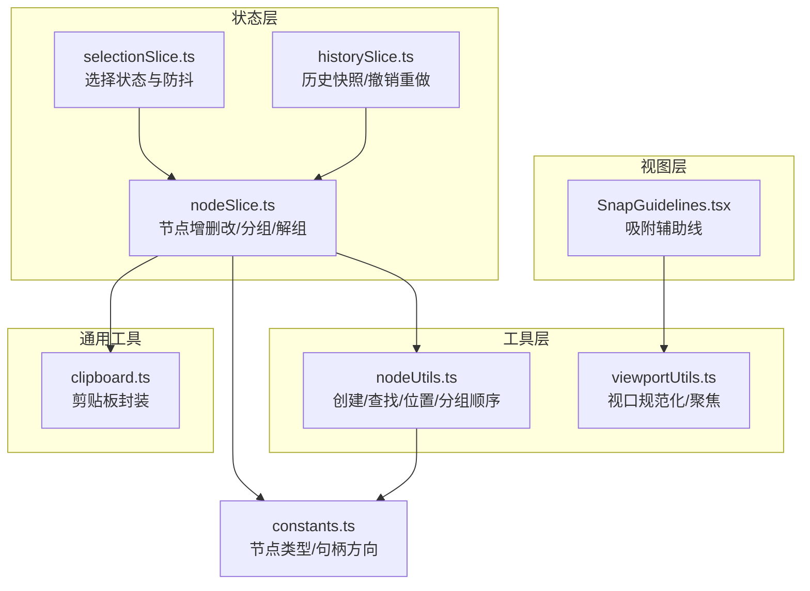
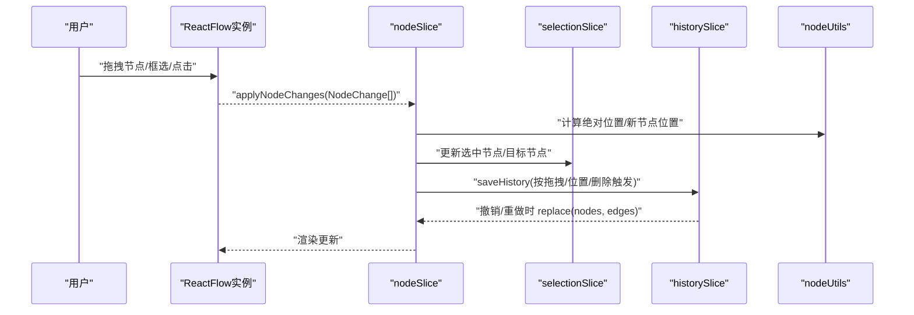
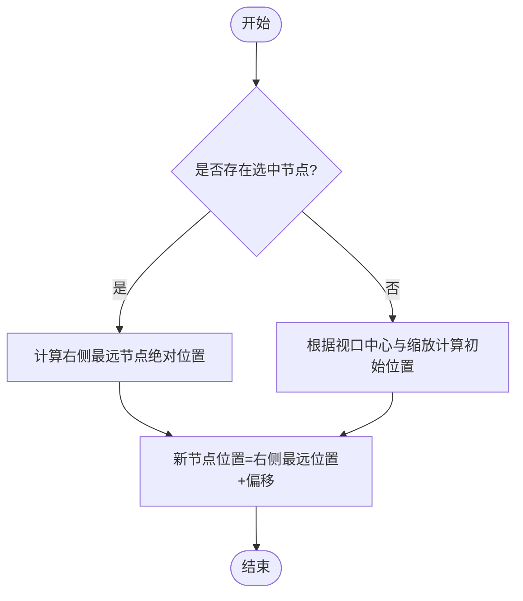
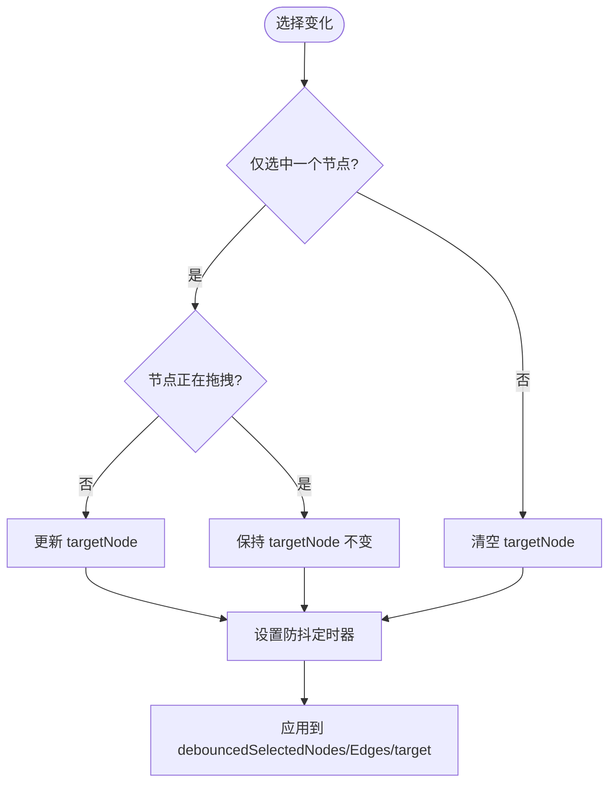
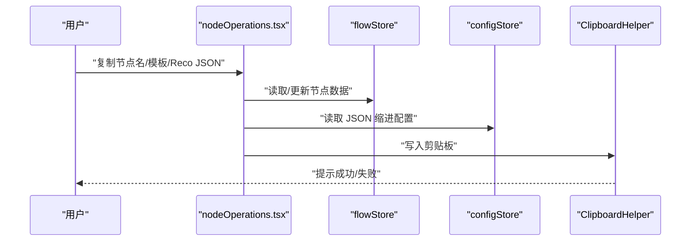
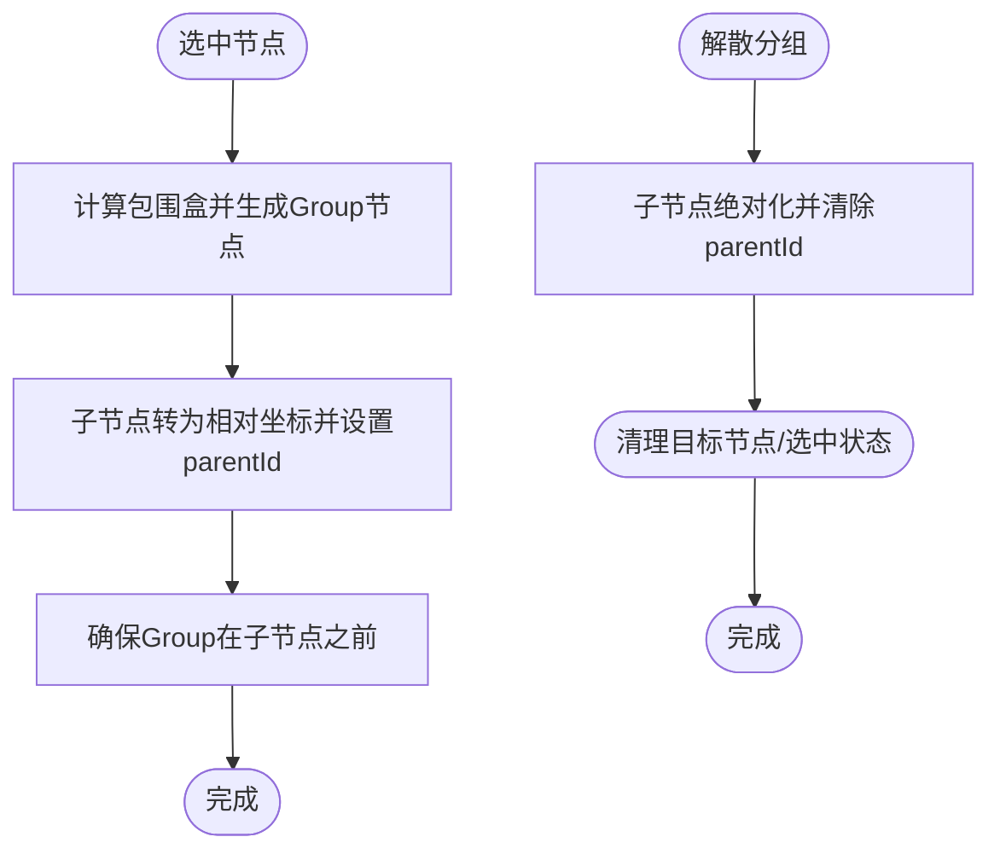
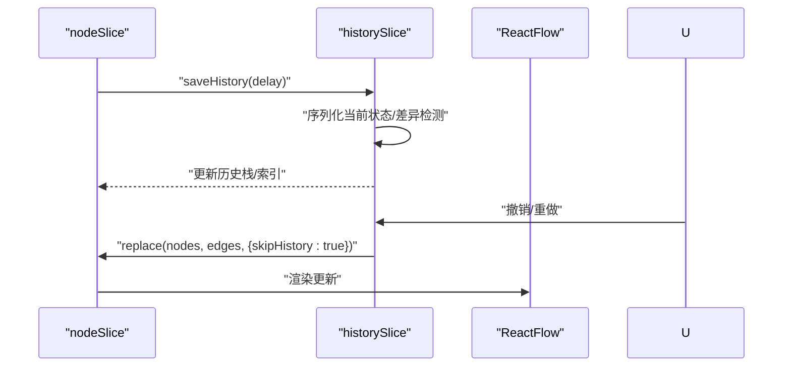
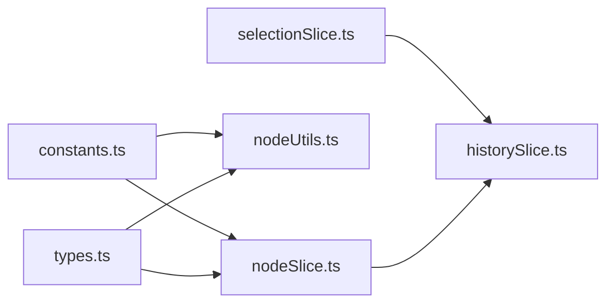

# 节点操作

<cite>
**本文档引用的文件**
- [nodeOperations.tsx](file://src/components/flow/nodes/utils/nodeOperations.tsx)
- [nodeSlice.ts](file://src/stores/flow/slices/nodeSlice.ts)
- [selectionSlice.ts](file://src/stores/flow/slices/selectionSlice.ts)
- [nodeUtils.ts](file://src/stores/flow/utils/nodeUtils.ts)
- [constants.ts](file://src/components/flow/nodes/constants.ts)
- [historySlice.ts](file://src/stores/flow/slices/historySlice.ts)
- [types.ts](file://src/stores/flow/types.ts)
- [viewportUtils.ts](file://src/stores/flow/utils/viewportUtils.ts)
- [SnapGuidelines.tsx](file://src/components/flow/SnapGuidelines.tsx)
- [clipboard.ts](file://src/utils/clipboard.ts)
</cite>

## 目录
1. [简介](#简介)
2. [项目结构](#项目结构)
3. [核心组件](#核心组件)
4. [架构总览](#架构总览)
5. [详细组件分析](#详细组件分析)
6. [依赖关系分析](#依赖关系分析)
7. [性能考虑](#性能考虑)
8. [故障排查指南](#故障排查指南)
9. [结论](#结论)

## 简介
本章节面向 MaaPipelineEditor 的“节点操作”能力，系统性梳理拖拽、选择、变换、对齐分布、复制粘贴删除、分组解组、撤销重做等全流程交互与实现要点，并结合仓库现有代码进行可视化说明，帮助开发者与使用者理解并高效使用节点编辑体验。

## 项目结构
围绕节点操作的关键代码主要分布在以下模块：
- 状态层（Zustand Slice）：节点管理、选择管理、历史管理、图数据替换与粘贴
- 工具层：节点创建与位置计算、绝对坐标转换、分组顺序保证
- 视图层：吸附对齐辅助线渲染、视口聚焦
- 通用工具：剪贴板封装
- 节点类型与常量：统一的节点类型与句柄方向枚举

图表来源
- [nodeSlice.ts:1-691](file://src/stores/flow/slices/nodeSlice.ts#L1-L691)
- [selectionSlice.ts:1-100](file://src/stores/flow/slices/selectionSlice.ts#L1-L100)
- [historySlice.ts:1-230](file://src/stores/flow/slices/historySlice.ts#L1-L230)
- [nodeUtils.ts:1-335](file://src/stores/flow/utils/nodeUtils.ts#L1-L335)
- [viewportUtils.ts:1-53](file://src/stores/flow/utils/viewportUtils.ts#L1-L53)
- [SnapGuidelines.tsx:1-59](file://src/components/flow/SnapGuidelines.tsx#L1-L59)
- [constants.ts:1-47](file://src/components/flow/nodes/constants.ts#L1-L47)
- [clipboard.ts:1-64](file://src/utils/clipboard.ts#L1-L64)

章节来源
- [nodeSlice.ts:1-691](file://src/stores/flow/slices/nodeSlice.ts#L1-L691)
- [selectionSlice.ts:1-100](file://src/stores/flow/slices/selectionSlice.ts#L1-L100)
- [historySlice.ts:1-230](file://src/stores/flow/slices/historySlice.ts#L1-L230)
- [nodeUtils.ts:1-335](file://src/stores/flow/utils/nodeUtils.ts#L1-L335)
- [viewportUtils.ts:1-53](file://src/stores/flow/utils/viewportUtils.ts#L1-L53)
- [SnapGuidelines.tsx:1-59](file://src/components/flow/SnapGuidelines.tsx#L1-L59)
- [constants.ts:1-47](file://src/components/flow/nodes/constants.ts#L1-L47)
- [clipboard.ts:1-64](file://src/utils/clipboard.ts#L1-L64)

## 核心组件
- 节点状态与操作（nodeSlice）
  - 节点增删改、批量更新、位置变更、分组/解组、链接创建、聚焦视图
- 选择状态与目标节点（selectionSlice）
  - 单选/多选/无选择的切换，目标节点的设置与防抖
- 历史与撤销重做（historySlice）
  - 快速序列化、差异检测、历史栈上限、撤销/重做
- 节点工具（nodeUtils）
  - 节点创建、查找、绝对坐标、新节点定位、分组顺序保证
- 视图与吸附（viewportUtils、SnapGuidelines）
  - 视口规范化与聚焦动画；吸附辅助线渲染
- 通用工具（clipboard）
  - 统一的剪贴板写入/读取封装

章节来源
- [nodeSlice.ts:1-691](file://src/stores/flow/slices/nodeSlice.ts#L1-L691)
- [selectionSlice.ts:1-100](file://src/stores/flow/slices/selectionSlice.ts#L1-L100)
- [historySlice.ts:1-230](file://src/stores/flow/slices/historySlice.ts#L1-L230)
- [nodeUtils.ts:1-335](file://src/stores/flow/utils/nodeUtils.ts#L1-L335)
- [viewportUtils.ts:1-53](file://src/stores/flow/utils/viewportUtils.ts#L1-L53)
- [SnapGuidelines.tsx:1-59](file://src/components/flow/SnapGuidelines.tsx#L1-L59)
- [clipboard.ts:1-64](file://src/utils/clipboard.ts#L1-L64)

## 架构总览
节点操作由“状态层（Zustand）+ 工具层（位置/分组/序列化）+ 视图层（吸附/聚焦）+ 通用工具（剪贴板）”构成，遵循“事件驱动 + 状态快照”的设计，确保拖拽、变换、对齐、分组等复杂操作具备良好的可回溯性与一致性。

图表来源
- [nodeSlice.ts:45-130](file://src/stores/flow/slices/nodeSlice.ts#L45-L130)
- [selectionSlice.ts:28-64](file://src/stores/flow/slices/selectionSlice.ts#L28-L64)
- [historySlice.ts:50-108](file://src/stores/flow/slices/historySlice.ts#L50-L108)
- [nodeUtils.ts:199-246](file://src/stores/flow/utils/nodeUtils.ts#L199-L246)

## 详细组件分析

### 拖拽检测与位置计算
- 拖拽检测
  - 节点拖拽通过 ReactFlow 的 NodeChange 流程传递，nodeSlice 监听 position 变更并区分拖拽与非拖拽场景，以控制历史记录保存的延迟策略。
- 位置计算
  - 新节点默认位置：当存在选中节点时，基于右侧最远节点的绝对位置向右偏移；无选中节点时，基于视口中心反推初始位置。
  - 绝对坐标：分组内节点的 position 为相对坐标，getNodeAbsolutePosition 将其转换为全局坐标，便于对齐与包围盒计算。
- 包围盒与分组
  - groupSelectedNodes 会计算选中节点的最小包围盒，生成 Group 节点并将其余节点转为相对坐标，同时保证 Group 排在子节点之前。

图表来源
- [nodeUtils.ts:216-246](file://src/stores/flow/utils/nodeUtils.ts#L216-L246)
- [nodeUtils.ts:199-213](file://src/stores/flow/utils/nodeUtils.ts#L199-L213)

章节来源
- [nodeSlice.ts:45-130](file://src/stores/flow/slices/nodeSlice.ts#L45-L130)
- [nodeUtils.ts:199-246](file://src/stores/flow/utils/nodeUtils.ts#L199-L246)

### 选择机制（单选/多选/框选）
- 单选/多选
  - selectionSlice 维护 selectedNodes 与 targetNode。当仅选中一个节点且非拖拽状态时，targetNode 更新为目标节点；多选或无选中时清空目标节点。
- 防抖更新
  - 通过 debounceTimeout 将高频选择变化合并为稳定状态，避免频繁渲染与面板刷新。
- 清空选择
  - clearSelection 清理定时器与所有选中状态，确保 UI 与状态一致。

图表来源
- [selectionSlice.ts:28-79](file://src/stores/flow/slices/selectionSlice.ts#L28-L79)

章节来源
- [selectionSlice.ts:1-100](file://src/stores/flow/slices/selectionSlice.ts#L1-L100)

### 变换操作（缩放/旋转/移动）
- 移动
  - 通过 ReactFlow 的拖拽事件触发 NodeChange.position，nodeSlice.applyNodeChanges 合并更新，同时区分拖拽与非拖拽以调整历史记录保存时机。
- 缩放/旋转
  - 代码中未发现直接的“缩放/旋转”节点操作逻辑；若需实现，可在节点渲染层扩展 handle 或使用 ReactFlow 的 transform 属性配合 viewportUtils.fitFlowView 实现视图级缩放与平移。
- 视口聚焦
  - fitFlowView 提供聚焦动画与缩放范围控制，适合在新增/粘贴/分组后自动居中显示。

章节来源
- [nodeSlice.ts:45-130](file://src/stores/flow/slices/nodeSlice.ts#L45-L130)
- [viewportUtils.ts:21-53](file://src/stores/flow/utils/viewportUtils.ts#L21-L53)

### 对齐与分布（自动对齐/均匀分布）
- 对齐辅助线
  - SnapGuidelines 根据吸附规则渲染垂直/水平辅助线，辅助用户对齐节点边缘与中心。
- 自动对齐
  - 代码中未发现自动对齐的专用函数；可通过计算节点绝对位置与吸附阈值，结合 getNodeAbsolutePosition 与 SnapGuidelines 的渲染坐标进行对齐修正。
- 均匀分布
  - 代码中未发现自动分布的专用函数；可通过计算选中节点的边界与间距，批量更新 position 实现。

章节来源
- [SnapGuidelines.tsx:1-59](file://src/components/flow/SnapGuidelines.tsx#L1-L59)
- [nodeUtils.ts:199-213](file://src/stores/flow/utils/nodeUtils.ts#L199-L213)

### 复制、粘贴、删除与批量操作
- 复制节点名/模板/Reco JSON
  - 复制节点名：带前缀拼接与剪贴板写入。
  - 保存为模板：弹窗输入模板名，校验长度与重复，支持覆盖确认。
  - 复制 Reco JSON：解析节点为导出格式，提取 recognition 并按配置缩进写入剪贴板。
- 删除节点
  - 通过 nodeSlice.updateNodes 发起 remove 变更，自动清理选中状态与顺序。
- 粘贴
  - graphSlice.paste 支持批量粘贴节点与边，配合 pasteIdCounter 生成新 ID，避免冲突。

图表来源
- [nodeOperations.tsx:17-28](file://src/components/flow/nodes/utils/nodeOperations.tsx#L17-L28)
- [nodeOperations.tsx:35-140](file://src/components/flow/nodes/utils/nodeOperations.tsx#L35-L140)
- [nodeOperations.tsx:155-183](file://src/components/flow/nodes/utils/nodeOperations.tsx#L155-L183)
- [clipboard.ts:3-23](file://src/utils/clipboard.ts#L3-L23)

章节来源
- [nodeOperations.tsx:1-184](file://src/components/flow/nodes/utils/nodeOperations.tsx#L1-L184)
- [clipboard.ts:1-64](file://src/utils/clipboard.ts#L1-L64)

### 分组与解组（含组内协同）
- 创建分组
  - 计算选中节点包围盒，生成 Group 节点，其余节点转为相对坐标并设置 parentId，最后保证 Group 在子节点之前。
- 解散分组
  - 将子节点绝对化并清除 parentId，同时清理目标节点与选中状态。
- 加入/移出分组
  - attach/detach 通过相对/绝对坐标转换完成，确保父子关系正确。

图表来源
- [nodeSlice.ts:524-598](file://src/stores/flow/slices/nodeSlice.ts#L524-L598)
- [nodeSlice.ts:601-635](file://src/stores/flow/slices/nodeSlice.ts#L601-L635)
- [nodeSlice.ts:638-689](file://src/stores/flow/slices/nodeSlice.ts#L638-L689)
- [nodeUtils.ts:321-334](file://src/stores/flow/utils/nodeUtils.ts#L321-L334)

章节来源
- [nodeSlice.ts:524-689](file://src/stores/flow/slices/nodeSlice.ts#L524-L689)
- [nodeUtils.ts:277-334](file://src/stores/flow/utils/nodeUtils.ts#L277-L334)

### 撤销/重做机制
- 快照与差异检测
  - 以 nodes/edges 的精简快照进行序列化，比较 lastSnapshot，避免重复保存。
- 历史栈管理
  - 限制最大栈深（100），在非栈顶插入时截断后续记录，支持连续操作链路。
- 撤销/重做
  - 通过 replace 替换状态，skipHistory=false 时不会再次入栈；同时清除选中状态，保证 UI 一致性。

图表来源
- [historySlice.ts:50-108](file://src/stores/flow/slices/historySlice.ts#L50-L108)
- [historySlice.ts:111-188](file://src/stores/flow/slices/historySlice.ts#L111-L188)
- [nodeSlice.ts:118-130](file://src/stores/flow/slices/nodeSlice.ts#L118-L130)

章节来源
- [historySlice.ts:1-230](file://src/stores/flow/slices/historySlice.ts#L1-L230)
- [nodeSlice.ts:118-130](file://src/stores/flow/slices/nodeSlice.ts#L118-L130)

## 依赖关系分析
- 节点类型与句柄方向
  - constants.ts 定义了节点类型枚举与句柄方向选项，被 nodeSlice 与 nodeUtils 广泛使用。
- 节点数据模型
  - types.ts 定义了 Pipeline/External/Anchor/Sticker/Group 的完整数据结构，包括 position、dragging、selected、measured 等字段，支撑拖拽、测量与渲染。
- 选择与历史的耦合
  - selectionSlice 的 targetNode 与 historySlice 的撤销/重做相互影响：撤销/重做时会清空选中状态，避免状态错配。

图表来源
- [constants.ts:14-47](file://src/components/flow/nodes/constants.ts#L14-L47)
- [types.ts:166-243](file://src/stores/flow/types.ts#L166-L243)
- [selectionSlice.ts:28-79](file://src/stores/flow/slices/selectionSlice.ts#L28-L79)
- [historySlice.ts:111-188](file://src/stores/flow/slices/historySlice.ts#L111-L188)
- [nodeSlice.ts:45-130](file://src/stores/flow/slices/nodeSlice.ts#L45-L130)

章节来源
- [constants.ts:1-47](file://src/components/flow/nodes/constants.ts#L1-L47)
- [types.ts:1-362](file://src/stores/flow/types.ts#L1-L362)
- [selectionSlice.ts:1-100](file://src/stores/flow/slices/selectionSlice.ts#L1-L100)
- [historySlice.ts:1-230](file://src/stores/flow/slices/historySlice.ts#L1-L230)
- [nodeSlice.ts:1-691](file://src/stores/flow/slices/nodeSlice.ts#L1-L691)

## 性能考虑
- 历史记录节流
  - saveHistory 支持延迟参数，拖拽场景延时更长，减少频繁快照带来的内存与序列化开销。
- 差异检测
  - 仅在状态字符串发生变化时入栈，避免重复快照。
- 防抖选择
  - selectionSlice 的防抖降低高频选择事件对渲染与面板更新的压力。
- 视口聚焦动画
  - fitFlowView 的动画时长与插值可调，建议在批量操作后统一触发一次聚焦，避免多次动画抖动。

章节来源
- [historySlice.ts:50-108](file://src/stores/flow/slices/historySlice.ts#L50-L108)
- [selectionSlice.ts:53-60](file://src/stores/flow/slices/selectionSlice.ts#L53-L60)
- [viewportUtils.ts:32-51](file://src/stores/flow/utils/viewportUtils.ts#L32-L51)

## 故障排查指南
- 复制失败
  - 检查剪贴板权限与浏览器兼容性；确认传入内容类型与 JSON 缩进配置。
- 模板保存冲突
  - 若模板名已存在，确认覆盖流程与命名长度限制。
- 撤销/重做无效
  - 确认 saveTimeout 是否被清理；检查 replace 调用时 skipHistory 参数是否正确。
- 分组异常
  - 确认 Group 节点在子节点之前；检查 parentId 与 position 的相对/绝对转换是否正确。

章节来源
- [clipboard.ts:10-23](file://src/utils/clipboard.ts#L10-L23)
- [nodeOperations.tsx:114-137](file://src/components/flow/nodes/utils/nodeOperations.tsx#L114-L137)
- [historySlice.ts:111-188](file://src/stores/flow/slices/historySlice.ts#L111-L188)
- [nodeSlice.ts:588-594](file://src/stores/flow/slices/nodeSlice.ts#L588-L594)

## 结论
MaaPipelineEditor 的节点操作以 Zustand 状态切片为核心，结合 ReactFlow 的拖拽与变更机制，实现了从“拖拽/选择/变换/对齐/分组/撤销重做”的完整闭环。通过差异检测、防抖与历史栈管理，系统在保证交互流畅的同时提供了可靠的可回溯能力。对于缺失的自动对齐/分布与缩放/旋转等高级变换，可在现有工具层基础上扩展实现，以进一步提升编辑效率与体验。