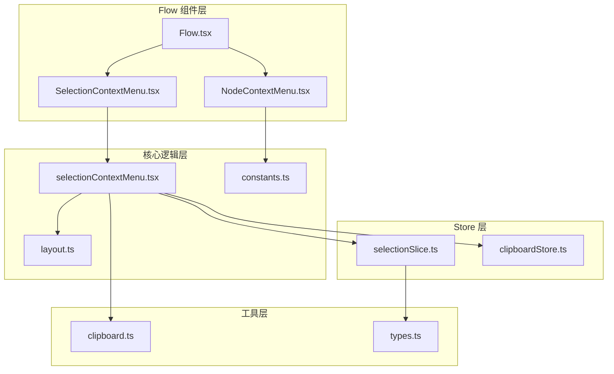
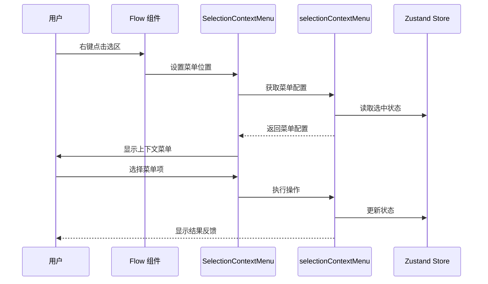
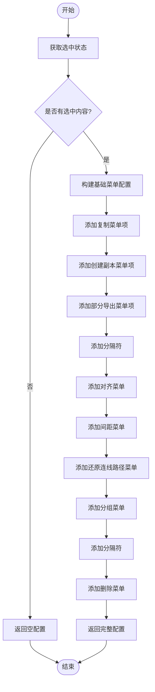
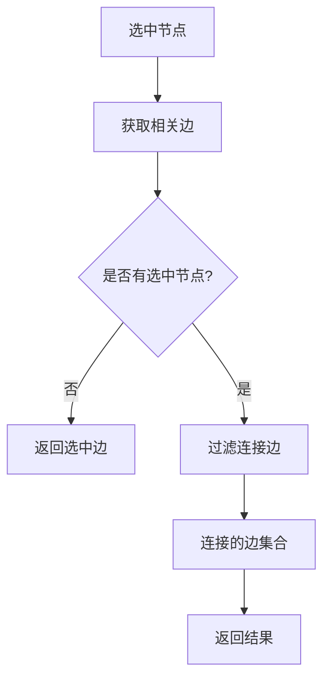
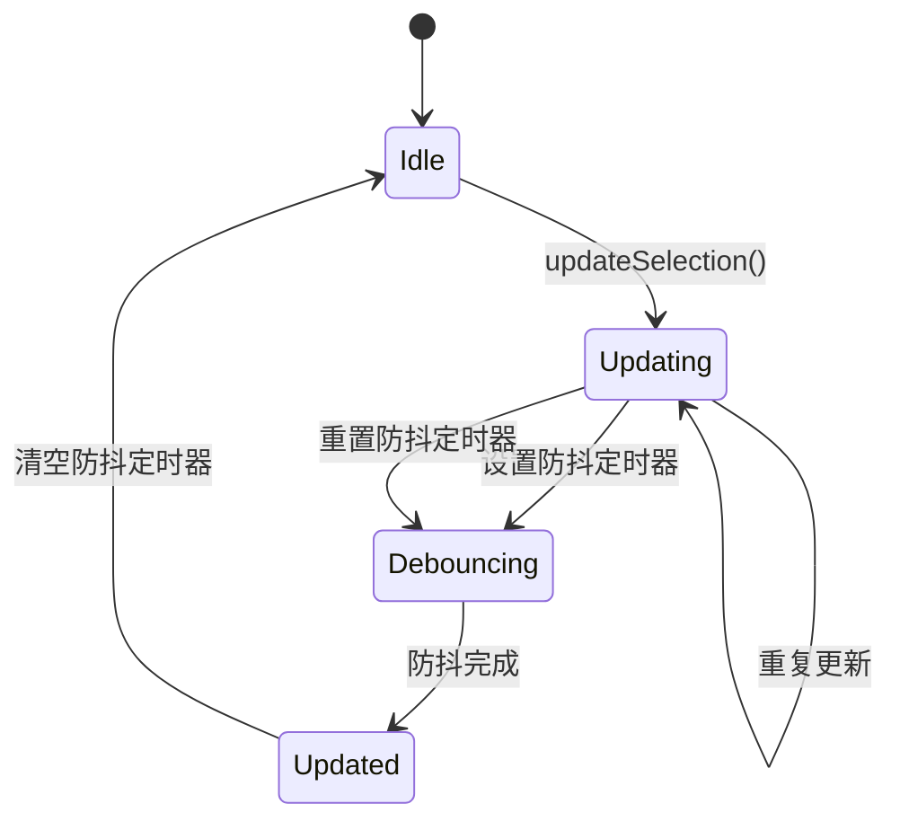
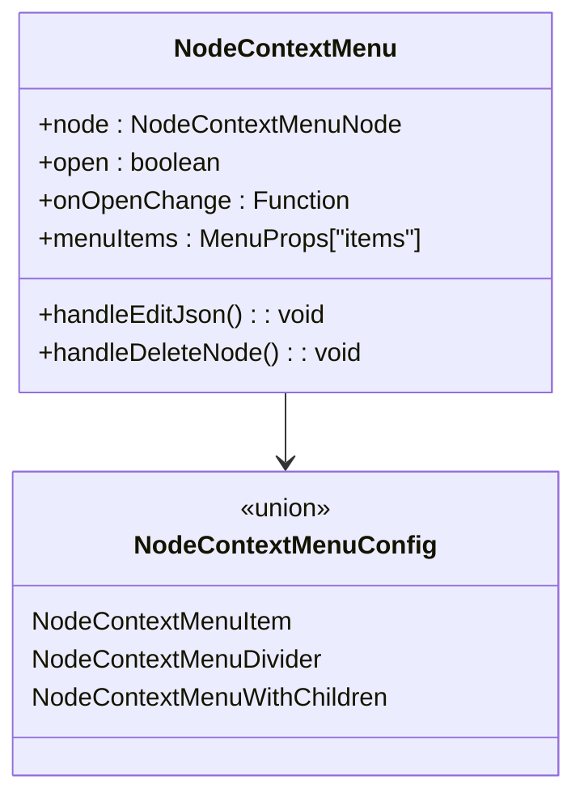

# 多选上下文菜单系统

<cite>
**本文档引用的文件**
- [selectionContextMenu.tsx](file://src/components/flow/selectionContextMenu.tsx)
- [SelectionContextMenu.tsx](file://src/components/flow/components/SelectionContextMenu.tsx)
- [selectionSlice.ts](file://src/stores/flow/slices/selectionSlice.ts)
- [nodeContextMenu.tsx](file://src/components/flow/nodes/nodeContextMenu.tsx)
- [NodeContextMenu.tsx](file://src/components/flow/nodes/components/NodeContextMenu.tsx)
- [types.ts](file://src/stores/flow/types.ts)
- [Flow.tsx](file://src/components/Flow.tsx)
- [clipboard.ts](file://src/utils/clipboard.ts)
- [clipboardStore.ts](file://src/stores/clipboardStore.ts)
- [layout.ts](file://src/core/layout.ts)
- [constants.ts](file://src/components/flow/nodes/constants.ts)
</cite>

## 目录
1. [简介](#简介)
2. [项目结构](#项目结构)
3. [核心组件](#核心组件)
4. [架构概览](#架构概览)
5. [详细组件分析](#详细组件分析)
6. [依赖关系分析](#依赖关系分析)
7. [性能考虑](#性能考虑)
8. [故障排除指南](#故障排除指南)
9. [结论](#结论)

## 简介

多选上下文菜单系统是 MaaPipelineEditor 工作流编辑器中的核心交互组件，提供了丰富的批量操作功能。该系统允许用户通过右键点击选区来执行多种批量操作，包括复制、粘贴、删除、对齐、分组管理等高级功能。

系统采用 React + TypeScript 构建，结合 Zustand 状态管理和 Ant Design 组件库，实现了响应式、高性能的多选上下文菜单体验。该系统不仅支持节点级别的批量操作，还提供了智能的边连接关系处理和实时的状态反馈机制。

## 项目结构

多选上下文菜单系统主要分布在以下目录结构中：



**图表来源**
- [Flow.tsx:195-584](file://src/components/Flow.tsx#L195-L584)
- [SelectionContextMenu.tsx:1-162](file://src/components/flow/components/SelectionContextMenu.tsx#L1-L162)
- [selectionContextMenu.tsx:1-487](file://src/components/flow/selectionContextMenu.tsx#L1-L487)

**章节来源**
- [Flow.tsx:195-584](file://src/components/Flow.tsx#L195-L584)
- [SelectionContextMenu.tsx:1-162](file://src/components/flow/components/SelectionContextMenu.tsx#L1-L162)
- [selectionContextMenu.tsx:1-487](file://src/components/flow/selectionContextMenu.tsx#L1-L487)

## 核心组件

### SelectionContextMenuSelection 接口
这是多选上下文菜单的核心数据结构，定义了选中节点和边的集合：

```typescript
export interface SelectionContextMenuSelection {
  selectedNodes: NodeType[];
  selectedEdges: EdgeType[];
}
```

### SelectionContextMenuItem 接口
定义了菜单项的基本结构，支持图标、禁用状态、可见性控制和危险操作标记：

```typescript
export interface SelectionContextMenuItem {
  key: string;
  label: string;
  icon: ReactNode | string;
  iconSize?: number;
  onClick: (selection: SelectionContextMenuSelection) => void | Promise<void>;
  disabled?: boolean | ((selection: SelectionContextMenuSelection) => boolean);
  visible?: (selection: SelectionContextMenuSelection) => boolean;
  danger?: boolean;
}
```

### SelectionContextMenuWithChildren 接口
支持子菜单的复杂菜单项结构：

```typescript
export interface SelectionContextMenuWithChildren {
  key: string;
  label: string;
  icon: ReactNode | string;
  iconSize?: number;
  children: SelectionContextMenuSubItem[];
  visible?: (selection: SelectionContextMenuSelection) => boolean;
}
```

**章节来源**
- [selectionContextMenu.tsx:10-58](file://src/components/flow/selectionContextMenu.tsx#L10-L58)

## 架构概览

多选上下文菜单系统采用分层架构设计，确保了良好的模块分离和可维护性：



**图表来源**
- [Flow.tsx:485-492](file://src/components/Flow.tsx#L485-L492)
- [SelectionContextMenu.tsx:50-159](file://src/components/flow/components/SelectionContextMenu.tsx#L50-L159)
- [selectionContextMenu.tsx:314-486](file://src/components/flow/selectionContextMenu.tsx#L314-L486)

系统架构的关键特点：
- **响应式设计**：基于 React Hooks 和 Zustand 状态管理
- **类型安全**：完整的 TypeScript 类型定义
- **可扩展性**：支持动态菜单配置和条件显示
- **性能优化**：使用 useMemo 和防抖机制

## 详细组件分析

### SelectionContextMenu 主组件

SelectionContextMenu 是多选上下文菜单的主组件，负责渲染和管理菜单状态：

```mermaid
classDiagram
class SelectionContextMenu {
+position : {x : number, y : number} | null
+open : boolean
+onOpenChange : (open : boolean) => void
-selection : SelectionContextMenuSelection
-menuItems : MenuProps["items"]
+renderMenuLabel() ReactNode
+render() : JSX.Element
}
class SelectionContextMenuSelection {
+selectedNodes : NodeType[]
+selectedEdges : EdgeType[]
}
class SelectionContextMenuItem {
+key : string
+label : string
+icon : ReactNode | string
+onClick : Function
+disabled : boolean | Function
+visible : Function
+danger : boolean
}
SelectionContextMenu --> SelectionContextMenuSelection
SelectionContextMenu --> SelectionContextMenuItem
```

**图表来源**
- [SelectionContextMenu.tsx:16-20](file://src/components/flow/components/SelectionContextMenu.tsx#L16-L20)
- [selectionContextMenu.tsx:10-28](file://src/components/flow/selectionContextMenu.tsx#L10-L28)

### selectionContextMenu 核心逻辑

selectionContextMenu 文件包含了所有菜单项的业务逻辑和操作处理：

#### 菜单配置生成器
getSelectionContextMenuConfig 函数根据当前选中状态动态生成菜单配置：



**图表来源**
- [selectionContextMenu.tsx:314-486](file://src/components/flow/selectionContextMenu.tsx#L314-L486)

#### 边缘关系处理函数

系统提供了智能的边缘关系处理能力：



**图表来源**
- [selectionContextMenu.tsx:60-108](file://src/components/flow/selectionContextMenu.tsx#L60-L108)

#### 操作处理函数

系统包含多种操作处理函数，每种都有相应的错误处理和状态反馈：

| 操作类型 | 函数名 | 功能描述 | 错误处理 |
|---------|--------|----------|----------|
| 复制 | handleCopySelection | 复制选中节点到内部剪贴板 | 未选中节点时显示错误消息 |
| 创建副本 | handleDuplicateSelection | 创建选中节点的副本 | 未选中节点时显示错误消息 |
| 导出 | handlePartialExport | 导出选中内容到剪贴板 | 未选中节点时显示错误消息 |
| 删除 | handleDeleteSelection | 删除选中节点和相关边 | 无选中内容时直接返回 |
| 对齐 | handleAlignSelection | 对齐多个选中节点 | 选中数量不足时显示错误消息 |
| 间距调整 | handleShiftSelection | 调整节点间距 | 选中数量不足时显示错误消息 |

**章节来源**
- [selectionContextMenu.tsx:132-312](file://src/components/flow/selectionContextMenu.tsx#L132-L312)

### 状态管理系统

Selection 状态管理采用防抖机制，确保状态更新的性能和准确性：



**图表来源**
- [selectionSlice.ts:27-65](file://src/stores/flow/slices/selectionSlice.ts#L27-L65)

**章节来源**
- [selectionSlice.ts:1-102](file://src/stores/flow/slices/selectionSlice.ts#L1-L102)

### 节点右键菜单对比

虽然节点右键菜单不是多选系统的一部分，但了解其设计模式有助于理解整体架构：



**图表来源**
- [NodeContextMenu.tsx:18-23](file://src/components/flow/nodes/components/NodeContextMenu.tsx#L18-L23)
- [nodeContextMenu.tsx:27-71](file://src/components/flow/nodes/nodeContextMenu.tsx#L27-L71)

**章节来源**
- [NodeContextMenu.tsx:1-227](file://src/components/flow/nodes/components/NodeContextMenu.tsx#L1-L227)
- [nodeContextMenu.tsx:1-603](file://src/components/flow/nodes/nodeContextMenu.tsx#L1-L603)

## 依赖关系分析

多选上下文菜单系统涉及多个层次的依赖关系：

```mermaid
graph TB
subgraph "外部依赖"
AD[Ant Design]
RF[@xyflow/react]
ZU[Zustand]
end
subgraph "内部模块"
SC[SelectionContextMenu]
SCF[selectionContextMenu]
SS[selectionSlice]
CS[clipboardStore]
L[layout]
CH[clipboard]
end
subgraph "核心类型"
T[Flow Types]
NT[NodeType]
ET[EdgeType]
end
SC --> AD
SC --> RF
SC --> ZU
SCF --> SS
SCF --> CS
SCF --> L
SCF --> CH
SS --> T
CS --> T
SCF --> NT
SCF --> ET
```

**图表来源**
- [SelectionContextMenu.tsx:1-14](file://src/components/flow/components/SelectionContextMenu.tsx#L1-L14)
- [selectionContextMenu.tsx:1-8](file://src/components/flow/selectionContextMenu.tsx#L1-L8)

### 关键依赖关系

1. **状态管理依赖**：SelectionContextMenu 依赖于 Zustand 的 selectionSlice 来获取选中状态
2. **UI 组件依赖**：使用 Ant Design 的 Dropdown 组件提供菜单功能
3. **布局算法依赖**：使用 ELKJS 进行自动布局和对齐操作
4. **剪贴板依赖**：通过 ClipboardHelper 和 clipboardStore 管理剪贴板操作

**章节来源**
- [Flow.tsx:30-37](file://src/components/Flow.tsx#L30-L37)
- [layout.ts:15-29](file://src/core/layout.ts#L15-L29)

## 性能考虑

多选上下文菜单系统在设计时充分考虑了性能优化：

### 防抖机制
- **延迟更新**：使用 400ms 防抖延迟避免频繁状态更新
- **定时器管理**：每次更新都会清除之前的定时器，防止内存泄漏
- **批量处理**：将多次快速更新合并为一次最终状态

### 渲染优化
- **memo 包装**：使用 React.memo 避免不必要的重新渲染
- **useMemo 缓存**：缓存菜单项配置和计算结果
- **浅比较**：使用 useShallow 进行状态选择，减少订阅开销

### 内存管理
- **定时器清理**：及时清理防抖定时器
- **事件监听器**：组件卸载时清理事件监听器
- **状态重置**：clearSelection 方法清理所有相关状态

**章节来源**
- [selectionSlice.ts:9-81](file://src/stores/flow/slices/selectionSlice.ts#L9-L81)
- [SelectionContextMenu.tsx:50-133](file://src/components/flow/components/SelectionContextMenu.tsx#L50-L133)

## 故障排除指南

### 常见问题及解决方案

#### 菜单不显示
**症状**：右键点击无反应
**可能原因**：
1. Flow 组件未正确设置 onSelectionContextMenu 处理器
2. SelectionContextMenu 未接收到正确的 position 状态

**解决方案**：
```typescript
// 确保 Flow 组件正确处理右键事件
const onSelectionContextMenu = useCallback((event: React.MouseEvent) => {
  event.preventDefault();
  setSelectionMenuPos({ x: event.clientX, y: event.clientY });
}, []);
```

#### 菜单项不可用
**症状**：菜单项显示为灰色无法点击
**可能原因**：
1. disabled 函数返回 true
2. visible 函数返回 false
3. 选中状态不符合操作要求

**解决方案**：
检查对应的 disabled 或 visible 函数逻辑，确保条件判断正确。

#### 操作失败
**症状**：复制、粘贴或删除操作失败
**可能原因**：
1. 剪贴板权限问题
2. 状态更新失败
3. 异步操作超时

**解决方案**：
查看浏览器控制台错误信息，检查网络连接和权限设置。

**章节来源**
- [Flow.tsx:485-492](file://src/components/Flow.tsx#L485-L492)
- [clipboard.ts:3-23](file://src/utils/clipboard.ts#L3-L23)

## 结论

多选上下文菜单系统是一个设计精良、功能完善的交互组件。其主要优势包括：

### 技术优势
- **模块化设计**：清晰的分层架构便于维护和扩展
- **类型安全**：完整的 TypeScript 类型定义确保代码质量
- **性能优化**：防抖机制和渲染优化提升用户体验
- **可扩展性**：灵活的配置系统支持未来功能扩展

### 功能特性
- **智能状态管理**：基于选中状态动态生成菜单配置
- **批量操作支持**：支持复制、粘贴、删除等批量操作
- **视觉反馈**：提供即时的操作结果反馈
- **错误处理**：完善的错误处理和用户提示机制

### 架构亮点
- **响应式设计**：基于现代 React Hooks 和 Zustand
- **类型安全**：从接口定义到实现的完整类型约束
- **性能优先**：从渲染优化到状态管理的全方位优化
- **易于测试**：清晰的职责分离便于单元测试

该系统为 MaaPipelineEditor 提供了强大而直观的多选操作能力，是整个工作流编辑器的重要组成部分。