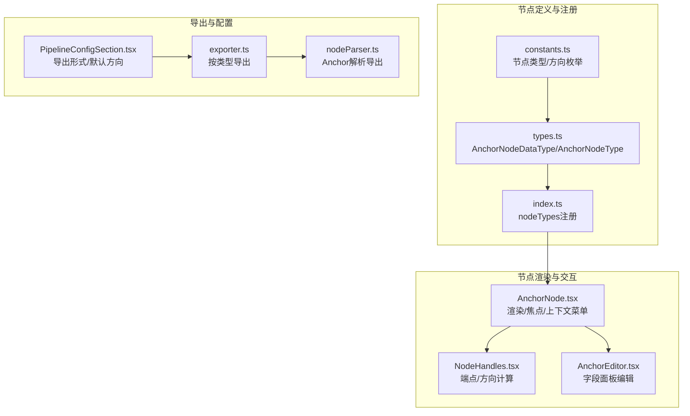
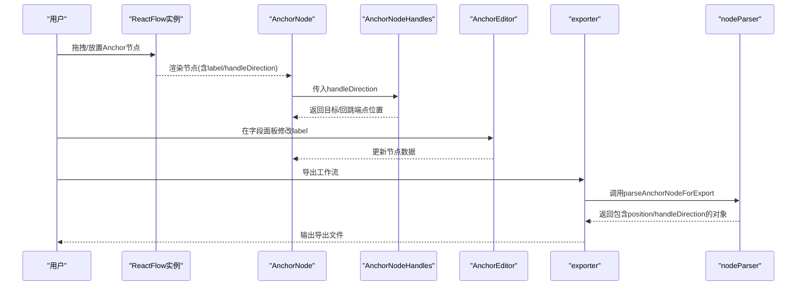
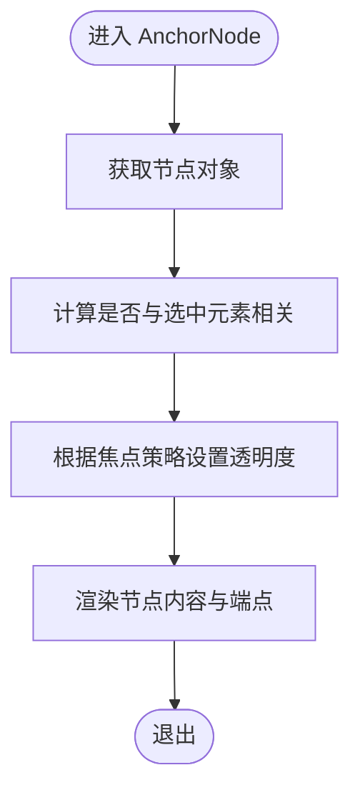
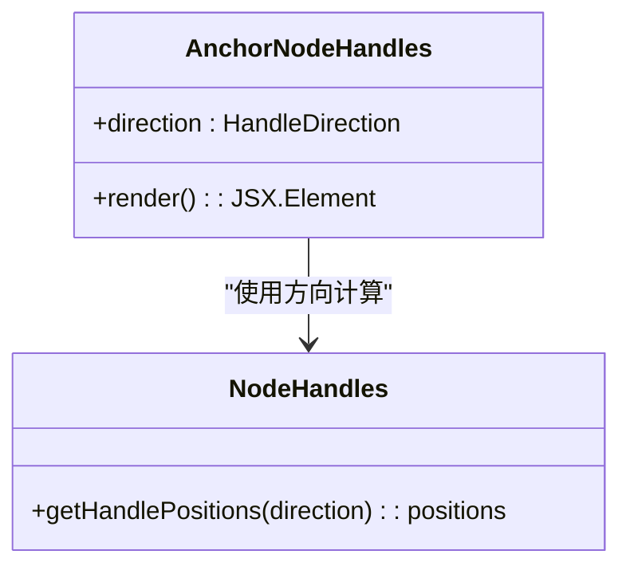
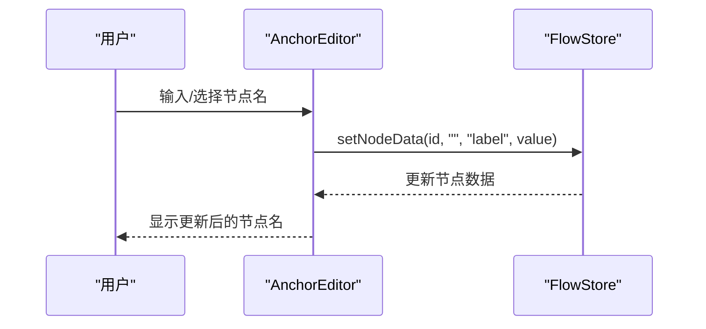
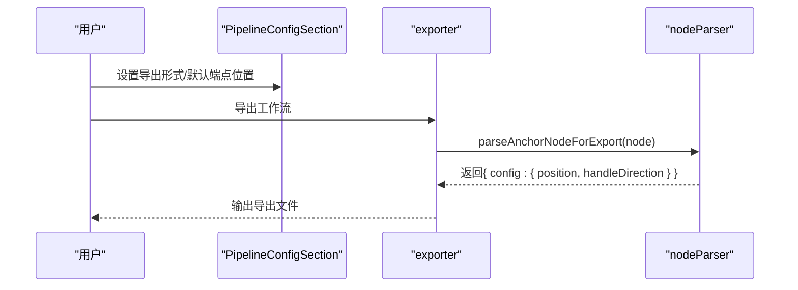
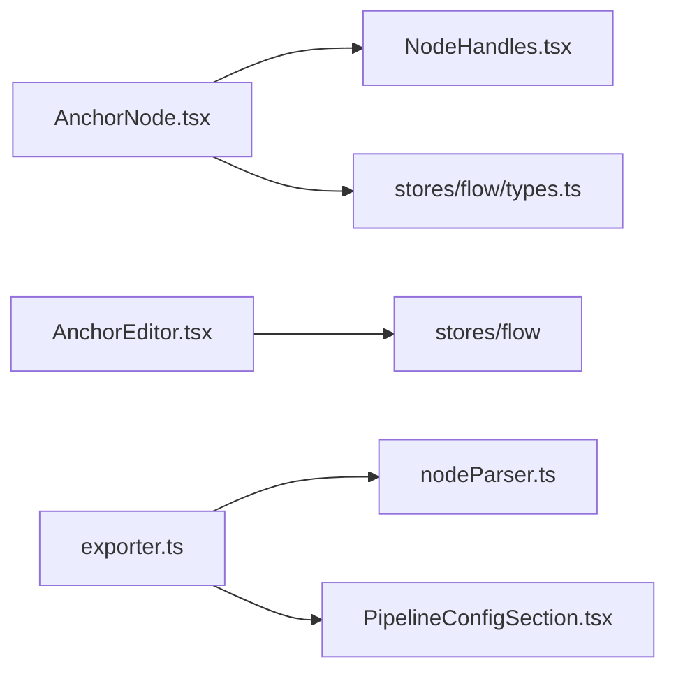

# Anchor节点

<cite>
**本文档引用的文件**
- [AnchorNode.tsx](file://src/components/flow/nodes/AnchorNode.tsx)
- [NodeHandles.tsx](file://src/components/flow/nodes/components/NodeHandles.tsx)
- [constants.ts](file://src/components/flow/nodes/constants.ts)
- [types.ts](file://src/stores/flow/types.ts)
- [index.ts](file://src/components/flow/nodes/index.ts)
- [AnchorEditor.tsx](file://src/components/panels/node-editors/AnchorEditor.tsx)
- [nodeTemplates.ts](file://src/data/nodeTemplates.ts)
- [PipelineConfigSection.tsx](file://src/components/panels/config/PipelineConfigSection.tsx)
- [exporter.ts](file://src/core/parser/exporter.ts)
- [nodeParser.ts](file://src/core/parser/nodeParser.ts)
</cite>

## 目录
1. [简介](#简介)
2. [项目结构](#项目结构)
3. [核心组件](#核心组件)
4. [架构总览](#架构总览)
5. [详细组件分析](#详细组件分析)
6. [依赖分析](#依赖分析)
7. [性能考虑](#性能考虑)
8. [故障排查指南](#故障排查指南)
9. [结论](#结论)
10. [附录](#附录)

## 简介
Anchor节点是工作流编辑器中的“锚点定位节点”，用于在复杂的节点布局中提供稳定的坐标参考点与布局锚点。它本身不执行识别或动作逻辑，而是通过其位置与端点方向，为连接关系、路径高亮、对齐吸附以及导出配置提供关键参考。Anchor节点在以下场景尤为重要：
- 作为复杂布局中的“锚点”：通过固定位置与端点方向，确保连接关系稳定可靠
- 作为坐标参考点：在导出阶段记录精确的x/y坐标，便于跨平台复现
- 作为布局锚点：配合端点方向实现“左右/上下”等不同流向的视觉与连接组织
- 在调试与测试中：通过路径模式与焦点透明度策略，帮助开发者快速定位与验证节点位置

## 项目结构
与Anchor节点直接相关的前端模块分布如下：
- 节点渲染与交互：src/components/flow/nodes/AnchorNode.tsx
- 端点与方向：src/components/flow/nodes/components/NodeHandles.tsx
- 节点类型与常量：src/components/flow/nodes/constants.ts
- 流式状态与类型：src/stores/flow/types.ts
- 节点注册入口：src/components/flow/nodes/index.ts
- 节点编辑器（字段面板）：src/components/panels/node-editors/AnchorEditor.tsx
- 模板与默认行为：src/data/nodeTemplates.ts
- 导出配置与导出流程：src/components/panels/config/PipelineConfigSection.tsx、src/core/parser/exporter.ts、src/core/parser/nodeParser.ts



**图表来源**
- [constants.ts:14-47](file://src/components/flow/nodes/constants.ts#L14-L47)
- [types.ts:130-205](file://src/stores/flow/types.ts#L130-L205)
- [index.ts:8-14](file://src/components/flow/nodes/index.ts#L8-L14)
- [AnchorNode.tsx:31-147](file://src/components/flow/nodes/AnchorNode.tsx#L31-L147)
- [NodeHandles.tsx:199-249](file://src/components/flow/nodes/components/NodeHandles.tsx#L199-L249)
- [AnchorEditor.tsx:8-105](file://src/components/panels/node-editors/AnchorEditor.tsx#L8-L105)
- [PipelineConfigSection.tsx:60-117](file://src/components/panels/config/PipelineConfigSection.tsx#L60-L117)
- [exporter.ts:99-103](file://src/core/parser/exporter.ts#L99-L103)
- [nodeParser.ts:179-197](file://src/core/parser/nodeParser.ts#L179-L197)

**章节来源**
- [constants.ts:14-47](file://src/components/flow/nodes/constants.ts#L14-L47)
- [types.ts:130-205](file://src/stores/flow/types.ts#L130-L205)
- [index.ts:8-14](file://src/components/flow/nodes/index.ts#L8-L14)
- [AnchorNode.tsx:31-147](file://src/components/flow/nodes/AnchorNode.tsx#L31-L147)
- [NodeHandles.tsx:199-249](file://src/components/flow/nodes/components/NodeHandles.tsx#L199-L249)
- [AnchorEditor.tsx:8-105](file://src/components/panels/node-editors/AnchorEditor.tsx#L8-L105)
- [PipelineConfigSection.tsx:60-117](file://src/components/panels/config/PipelineConfigSection.tsx#L60-L117)
- [exporter.ts:99-103](file://src/core/parser/exporter.ts#L99-L103)
- [nodeParser.ts:179-197](file://src/core/parser/nodeParser.ts#L179-L197)

## 核心组件
- AnchorNode：负责渲染锚点节点、处理焦点透明度、上下文菜单与端点显示
- AnchorNodeHandles：根据handleDirection动态计算目标端点与回跳端点的位置与样式
- AnchorNodeDataType/AnchorNodeType：定义Anchor节点的数据结构与节点类型
- AnchorEditor：提供节点名编辑与自动补全，标注“编译时添加 [Anchor] 前缀”的提示
- 导出解析：exporter与nodeParser在导出阶段将Anchor节点的位置与端点方向写入配置

**章节来源**
- [AnchorNode.tsx:31-147](file://src/components/flow/nodes/AnchorNode.tsx#L31-L147)
- [NodeHandles.tsx:199-249](file://src/components/flow/nodes/components/NodeHandles.tsx#L199-L249)
- [types.ts:130-205](file://src/stores/flow/types.ts#L130-L205)
- [AnchorEditor.tsx:8-105](file://src/components/panels/node-editors/AnchorEditor.tsx#L8-L105)
- [exporter.ts:99-103](file://src/core/parser/exporter.ts#L99-L103)
- [nodeParser.ts:179-197](file://src/core/parser/nodeParser.ts#L179-L197)

## 架构总览
Anchor节点在系统中的职责与交互如下：
- 定义与注册：通过constants.ts定义节点类型与方向枚举，types.ts定义数据与节点类型，index.ts注册到nodeTypes
- 渲染与交互：AnchorNode负责节点外观、焦点透明度、上下文菜单；AnchorNodeHandles负责端点布局
- 编辑与配置：AnchorEditor提供节点名编辑；PipelineConfigSection提供导出形式与默认端点方向
- 导出：exporter按类型调用parseAnchorNodeForExport，将位置与端点方向写入导出对象



**图表来源**
- [AnchorNode.tsx:31-147](file://src/components/flow/nodes/AnchorNode.tsx#L31-L147)
- [NodeHandles.tsx:199-249](file://src/components/flow/nodes/components/NodeHandles.tsx#L199-L249)
- [AnchorEditor.tsx:8-105](file://src/components/panels/node-editors/AnchorEditor.tsx#L8-L105)
- [exporter.ts:99-103](file://src/core/parser/exporter.ts#L99-L103)
- [nodeParser.ts:179-197](file://src/core/parser/nodeParser.ts#L179-L197)

## 详细组件分析

### AnchorNode组件
- 渲染内容：标题与锚点端点
- 焦点透明度：根据focusOpacity与选中/路径模式决定节点透明度
- 上下文菜单：包裹节点以支持右键菜单
- 性能优化：AnchorNodeMemo进行浅比较，避免不必要的重渲染



**图表来源**
- [AnchorNode.tsx:31-147](file://src/components/flow/nodes/AnchorNode.tsx#L31-L147)

**章节来源**
- [AnchorNode.tsx:31-147](file://src/components/flow/nodes/AnchorNode.tsx#L31-L147)

### AnchorNodeHandles组件
- 根据handleDirection返回目标端点与回跳端点的位置
- 支持水平/垂直两种布局，并为锚点端点设置偏移样式
- 通过updateNodeInternals在方向变化时刷新内部布局



**图表来源**
- [NodeHandles.tsx:199-249](file://src/components/flow/nodes/components/NodeHandles.tsx#L199-L249)
- [NodeHandles.tsx:10-28](file://src/components/flow/nodes/components/NodeHandles.tsx#L10-L28)

**章节来源**
- [NodeHandles.tsx:199-249](file://src/components/flow/nodes/components/NodeHandles.tsx#L199-L249)
- [NodeHandles.tsx:10-28](file://src/components/flow/nodes/components/NodeHandles.tsx#L10-L28)

### 数据类型与配置
- AnchorNodeDataType：包含label与handleDirection
- AnchorNodeType：扩展为完整节点类型，包含position等
- HandleDirection：支持“左右/右左/上下/下上”
- 默认方向：DEFAULT_HANDLE_DIRECTION

```mermaid
classDiagram
class AnchorNodeDataType {
+label : string
+handleDirection : HandleDirection
}
class AnchorNodeType {
+id : string
+type : "anchor"
+data : AnchorNodeDataType
+position : PositionType
}
class HandleDirection {
<<enum>>
"left-right"
"right-left"
"top-bottom"
"bottom-top"
}
AnchorNodeType --> AnchorNodeDataType : "包含"
AnchorNodeDataType --> HandleDirection : "使用"
```

**图表来源**
- [types.ts:130-205](file://src/stores/flow/types.ts#L130-L205)
- [constants.ts:28-35](file://src/components/flow/nodes/constants.ts#L28-L35)

**章节来源**
- [types.ts:130-205](file://src/stores/flow/types.ts#L130-L205)
- [constants.ts:28-35](file://src/components/flow/nodes/constants.ts#L28-L35)

### 字段面板编辑器（AnchorEditor）
- 节点名编辑：提供AutoComplete，支持搜索与选择
- 提示信息：标注“编译时会添加 [Anchor] 前缀”
- 数据更新：通过useFlowStore.setNodeData更新label



**图表来源**
- [AnchorEditor.tsx:8-105](file://src/components/panels/node-editors/AnchorEditor.tsx#L8-L105)

**章节来源**
- [AnchorEditor.tsx:8-105](file://src/components/panels/node-editors/AnchorEditor.tsx#L8-L105)

### 导出与配置
- 导出形式：支持“对象形式”和“前缀形式”，前缀形式会在节点名前加“[Anchor]”
- 默认端点位置：可在Pipeline配置中设置默认handleDirection
- 导出流程：exporter按类型调用parseAnchorNodeForExport，记录position与handleDirection



**图表来源**
- [PipelineConfigSection.tsx:60-117](file://src/components/panels/config/PipelineConfigSection.tsx#L60-L117)
- [exporter.ts:99-103](file://src/core/parser/exporter.ts#L99-L103)
- [nodeParser.ts:179-197](file://src/core/parser/nodeParser.ts#L179-L197)

**章节来源**
- [PipelineConfigSection.tsx:60-117](file://src/components/panels/config/PipelineConfigSection.tsx#L60-L117)
- [exporter.ts:99-103](file://src/core/parser/exporter.ts#L99-L103)
- [nodeParser.ts:179-197](file://src/core/parser/nodeParser.ts#L179-L197)

## 依赖分析
- 组件耦合
  - AnchorNode依赖NodeHandles计算端点位置
  - AnchorEditor依赖FlowStore更新节点数据
  - 导出链路依赖exporter与nodeParser
- 外部依赖
  - @xyflow/react：Handle、Position、useUpdateNodeInternals、useNodeId等
  - zustand：useFlowStore、useConfigStore
  - Ant Design：AutoComplete、Popover等



**图表来源**
- [AnchorNode.tsx:31-147](file://src/components/flow/nodes/AnchorNode.tsx#L31-L147)
- [NodeHandles.tsx:199-249](file://src/components/flow/nodes/components/NodeHandles.tsx#L199-L249)
- [types.ts:130-205](file://src/stores/flow/types.ts#L130-L205)
- [AnchorEditor.tsx:8-105](file://src/components/panels/node-editors/AnchorEditor.tsx#L8-L105)
- [exporter.ts:99-103](file://src/core/parser/exporter.ts#L99-L103)
- [nodeParser.ts:179-197](file://src/core/parser/nodeParser.ts#L179-L197)
- [PipelineConfigSection.tsx:60-117](file://src/components/panels/config/PipelineConfigSection.tsx#L60-L117)

**章节来源**
- [AnchorNode.tsx:31-147](file://src/components/flow/nodes/AnchorNode.tsx#L31-L147)
- [NodeHandles.tsx:199-249](file://src/components/flow/nodes/components/NodeHandles.tsx#L199-L249)
- [types.ts:130-205](file://src/stores/flow/types.ts#L130-L205)
- [AnchorEditor.tsx:8-105](file://src/components/panels/node-editors/AnchorEditor.tsx#L8-L105)
- [exporter.ts:99-103](file://src/core/parser/exporter.ts#L99-L103)
- [nodeParser.ts:179-197](file://src/core/parser/nodeParser.ts#L179-L197)
- [PipelineConfigSection.tsx:60-117](file://src/components/panels/config/PipelineConfigSection.tsx#L60-L117)

## 性能考虑
- 渲染优化
  - AnchorNodeMemo通过浅比较避免非必要重渲染
  - isRelated计算仅在焦点策略、选中状态、路径模式等关键状态变化时更新
- 端点更新
  - AnchorNodeHandles在handleDirection变化时调用updateNodeInternals，确保端点布局即时生效
- 导出效率
  - 导出阶段仅处理启用导出配置的节点类型，减少不必要开销

[本节为通用性能讨论，无需具体文件分析]

## 故障排查指南
- 焦点透明度异常
  - 检查focusOpacity配置与节点选中状态，确认isRelated计算逻辑
  - 参考：[AnchorNode.tsx:54-111](file://src/components/flow/nodes/AnchorNode.tsx#L54-L111)
- 端点位置不正确
  - 确认handleDirection设置与NodeHandles的方向映射
  - 参考：[NodeHandles.tsx:10-28](file://src/components/flow/nodes/components/NodeHandles.tsx#L10-L28)
- 导出缺少锚点配置
  - 确认导出配置已启用，且节点类型为Anchor
  - 参考：[exporter.ts:99-103](file://src/core/parser/exporter.ts#L99-L103)
- 节点名未按预期添加前缀
  - 检查导出形式设置与字段面板提示
  - 参考：[PipelineConfigSection.tsx:70-75](file://src/components/panels/config/PipelineConfigSection.tsx#L70-L75)

**章节来源**
- [AnchorNode.tsx:54-111](file://src/components/flow/nodes/AnchorNode.tsx#L54-L111)
- [NodeHandles.tsx:10-28](file://src/components/flow/nodes/components/NodeHandles.tsx#L10-L28)
- [exporter.ts:99-103](file://src/core/parser/exporter.ts#L99-L103)
- [PipelineConfigSection.tsx:70-75](file://src/components/panels/config/PipelineConfigSection.tsx#L70-L75)

## 结论
Anchor节点通过“锚点定位”与“端点方向”两大能力，在复杂工作流中提供稳定、可复现的布局与连接参考。其简洁的数据结构与完善的导出机制，使其在调试、测试与跨团队协作中具有重要价值。合理配置handleDirection与导出形式，可显著提升工作流的可维护性与一致性。

[本节为总结，无需具体文件分析]

## 附录

### Anchor节点配置参数与设置选项
- label：节点名（字段面板编辑）
- handleDirection：端点方向（左右/右左/上下/下上）
- 导出形式：对象形式或前缀形式（前缀形式自动添加“[Anchor]”）

**章节来源**
- [types.ts:130-134](file://src/stores/flow/types.ts#L130-L134)
- [constants.ts:28-46](file://src/components/flow/nodes/constants.ts#L28-L46)
- [PipelineConfigSection.tsx:70-75](file://src/components/panels/config/PipelineConfigSection.tsx#L70-L75)

### 与其他节点的协作关系
- 作为连接目标：通过目标端点与上游节点建立连接
- 作为回跳目标：通过回跳端点支持反向连接
- 与路径模式协作：在路径模式下高亮相关节点，辅助调试

**章节来源**
- [NodeHandles.tsx:199-249](file://src/components/flow/nodes/components/NodeHandles.tsx#L199-L249)
- [AnchorNode.tsx:54-111](file://src/components/flow/nodes/AnchorNode.tsx#L54-L111)

### 使用技巧与最佳实践
- 使用“上下/左右”方向区分不同流向，保持视觉一致性
- 在复杂布局中优先放置Anchor节点，再围绕其建立连接
- 导出前统一设置默认端点方向，减少后续调整成本
- 在调试阶段启用路径模式，结合焦点透明度策略快速定位问题节点

[本节为通用建议，无需具体文件分析]