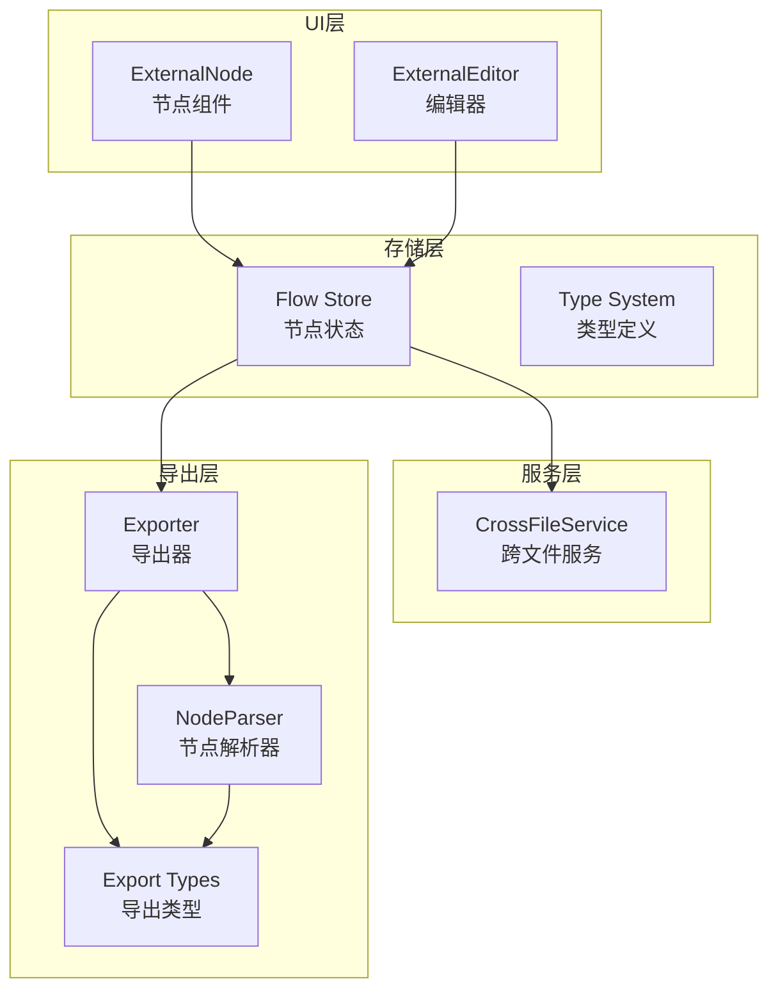
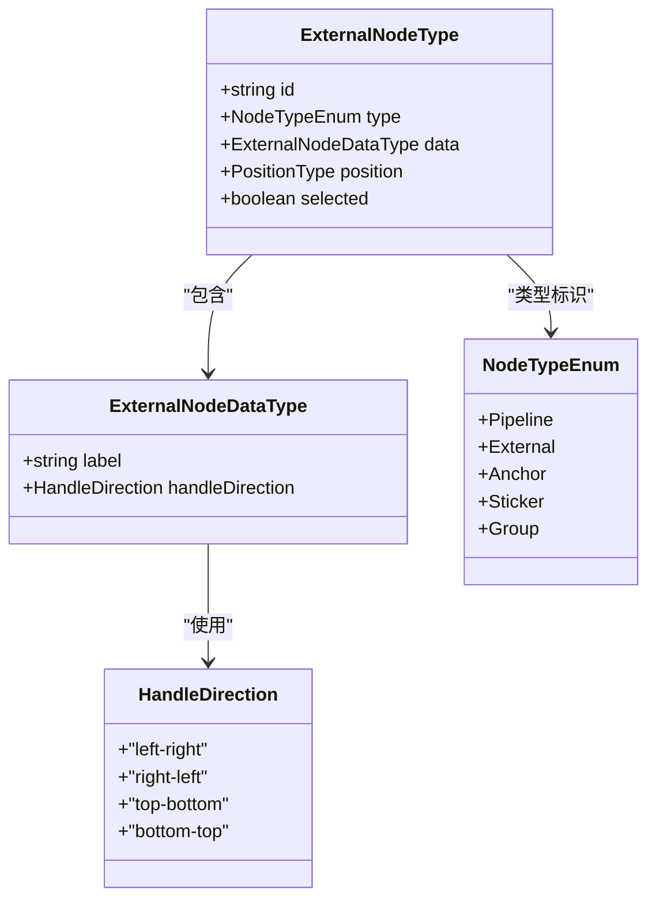
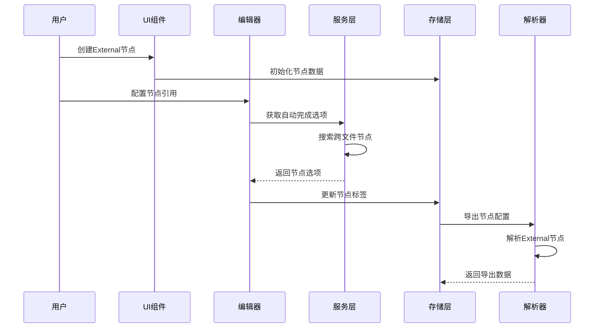
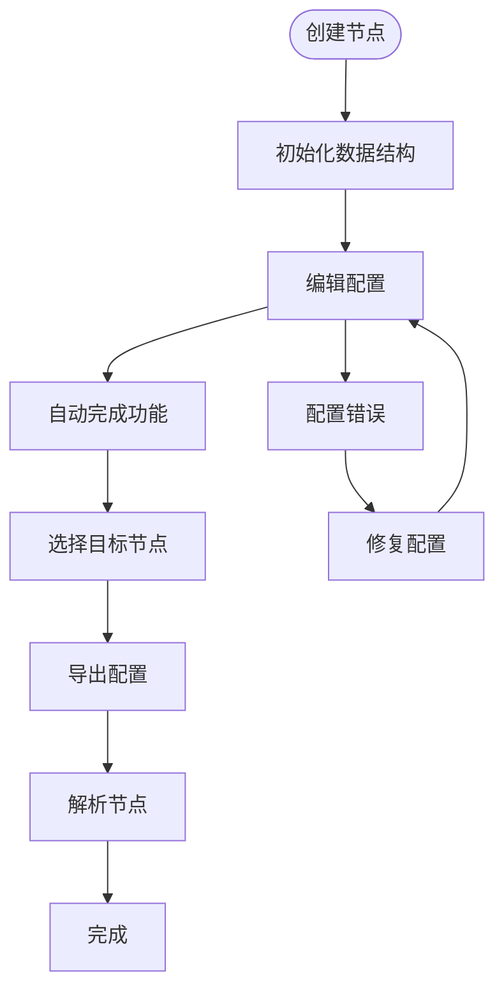
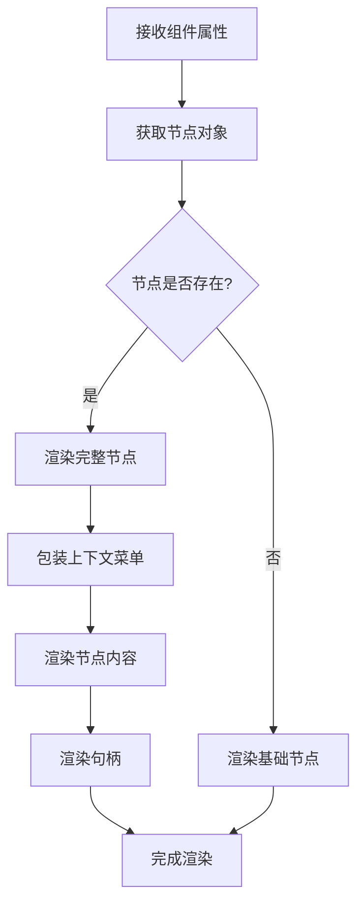
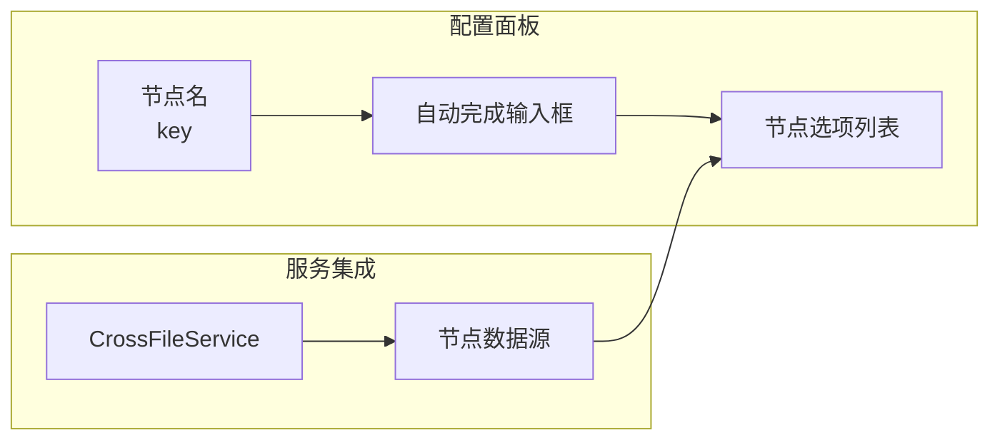
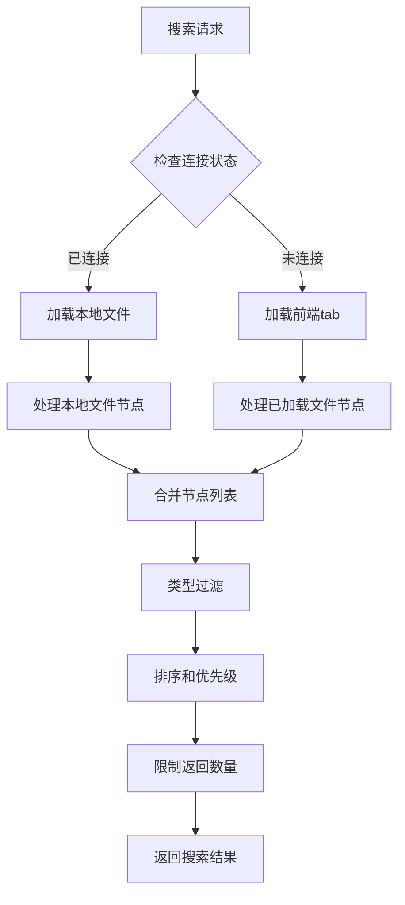
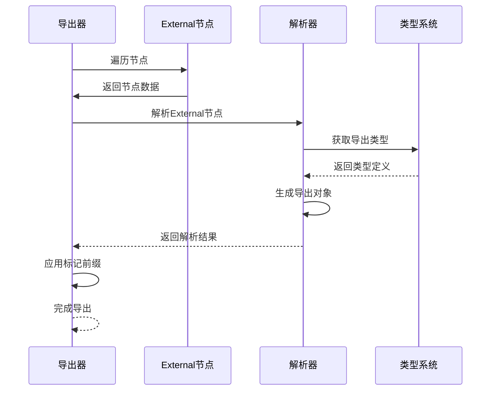
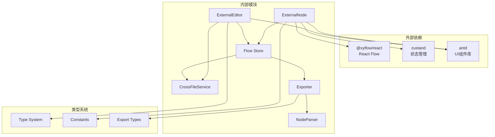
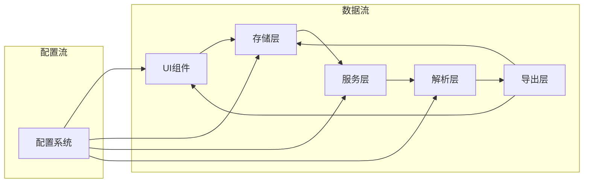

# External节点

<cite>
**本文档引用的文件**
- [ExternalNode.tsx](file://src/components/flow/nodes/ExternalNode.tsx)
- [ExternalEditor.tsx](file://src/components/panels/node-editors/ExternalEditor.tsx)
- [constants.ts](file://src/components/flow/nodes/constants.ts)
- [types.ts](file://src/stores/flow/types.ts)
- [nodeUtils.ts](file://src/stores/flow/utils/nodeUtils.ts)
- [crossFileService.ts](file://src/services/crossFileService.ts)
- [exporter.ts](file://src/core/parser/exporter.ts)
- [nodeParser.ts](file://src/core/parser/nodeParser.ts)
- [types.ts](file://src/core/parser/types.ts)
- [edgeLinker.ts](file://src/core/parser/edgeLinker.ts)
</cite>

## 目录
1. [简介](#简介)
2. [项目结构](#项目结构)
3. [核心组件](#核心组件)
4. [架构总览](#架构总览)
5. [详细组件分析](#详细组件分析)
6. [依赖关系分析](#依赖关系分析)
7. [性能考量](#性能考量)
8. [故障排查指南](#故障排查指南)
9. [结论](#结论)
10. [附录](#附录)

## 简介
External节点是一种特殊的外部引用节点，用于在工作流中指向和使用外部定义的工作流或配置。它通过引用其他文件中的Pipeline节点来实现模块化设计和复用性，避免在当前工作流中重复定义相同的功能逻辑。External节点的核心价值在于：
- 模块化设计：将通用功能封装到独立的Pipeline节点中，便于复用
- 配置解耦：通过引用机制实现工作流间的配置共享
- 维护简化：一处修改，多处生效
- 工作流复用：在不同工作流间共享相同的节点定义

## 项目结构
External节点的实现涉及多个层次的组件协作：
- UI层：ExternalNode组件负责节点的可视化展示和交互
- 编辑层：ExternalEditor组件提供节点配置界面
- 存储层：Flow Store管理节点状态和数据
- 服务层：CrossFileService提供跨文件节点搜索和引用功能
- 导出层：Exporter和NodeParser负责节点的序列化和反序列化

**图表来源**
- [ExternalNode.tsx:1-167](file://src/components/flow/nodes/ExternalNode.tsx#L1-L167)
- [ExternalEditor.tsx:1-106](file://src/components/panels/node-editors/ExternalEditor.tsx#L1-L106)
- [crossFileService.ts:1-565](file://src/services/crossFileService.ts#L1-L565)
- [exporter.ts:1-244](file://src/core/parser/exporter.ts#L1-L244)

**章节来源**
- [ExternalNode.tsx:1-167](file://src/components/flow/nodes/ExternalNode.tsx#L1-L167)
- [ExternalEditor.tsx:1-106](file://src/components/panels/node-editors/ExternalEditor.tsx#L1-L106)
- [crossFileService.ts:1-565](file://src/services/crossFileService.ts#L1-L565)

## 核心组件
External节点的核心数据结构和类型定义如下：

### 数据结构定义
External节点的数据结构非常简洁，主要包含以下关键字段：
- `label`: 节点标签，用于显示和引用
- `handleDirection`: 端点方向配置，默认为"left-right"

### 节点类型系统

**图表来源**
- [types.ts:124-128](file://src/stores/flow/types.ts#L124-L128)
- [types.ts:179-191](file://src/stores/flow/types.ts#L179-L191)
- [constants.ts:14-20](file://src/components/flow/nodes/constants.ts#L14-L20)
- [constants.ts:28-35](file://src/components/flow/nodes/constants.ts#L28-L35)

**章节来源**
- [types.ts:124-191](file://src/stores/flow/types.ts#L124-L191)
- [constants.ts:14-47](file://src/components/flow/nodes/constants.ts#L14-L47)

## 架构总览
External节点的架构设计体现了清晰的关注点分离和职责划分：

### 整体架构流程

**图表来源**
- [ExternalNode.tsx:29-145](file://src/components/flow/nodes/ExternalNode.tsx#L29-L145)
- [ExternalEditor.tsx:8-105](file://src/components/panels/node-editors/ExternalEditor.tsx#L8-L105)
- [crossFileService.ts:531-560](file://src/services/crossFileService.ts#L531-L560)
- [exporter.ts:94-98](file://src/core/parser/exporter.ts#L94-L98)

### 节点生命周期

**图表来源**
- [nodeUtils.ts:58-85](file://src/stores/flow/utils/nodeUtils.ts#L58-L85)
- [ExternalEditor.tsx:46-60](file://src/components/panels/node-editors/ExternalEditor.tsx#L46-L60)
- [exporter.ts:94-98](file://src/core/parser/exporter.ts#L94-L98)

## 详细组件分析

### ExternalNode组件分析
ExternalNode是External节点的UI组件，负责节点的可视化展示和用户交互。

#### 组件特性
- **响应式设计**：根据节点选中状态和焦点透明度动态调整显示效果
- **上下文菜单**：提供右键菜单功能，支持节点操作
- **句柄渲染**：根据handleDirection配置渲染相应的输入输出句柄
- **状态管理**：集成React Flow的状态管理和Zustand的状态订阅

#### 渲染逻辑

**图表来源**
- [ExternalNode.tsx:29-145](file://src/components/flow/nodes/ExternalNode.tsx#L29-L145)

**章节来源**
- [ExternalNode.tsx:1-167](file://src/components/flow/nodes/ExternalNode.tsx#L1-L167)

### ExternalEditor编辑器分析
ExternalEditor提供了External节点的配置界面，主要功能包括自动完成功能和节点标签设置。

#### 编辑器功能
- **自动完成功能**：集成CrossFileService提供跨文件节点搜索
- **搜索过滤**：支持关键词搜索和模糊匹配
- **选项渲染**：自定义下拉选项的显示格式
- **实时更新**：支持搜索值变化时的实时过滤

#### 配置界面布局

**图表来源**
- [ExternalEditor.tsx:62-103](file://src/components/panels/node-editors/ExternalEditor.tsx#L62-L103)
- [crossFileService.ts:531-560](file://src/services/crossFileService.ts#L531-L560)

**章节来源**
- [ExternalEditor.tsx:1-106](file://src/components/panels/node-editors/ExternalEditor.tsx#L1-L106)

### CrossFileService跨文件服务分析
CrossFileService是External节点引用机制的核心服务，提供跨文件节点搜索、跳转和自动完成功能。

#### 服务能力
- **节点发现**：扫描本地文件和前端tab中的所有节点
- **跨文件导航**：支持在不同文件间跳转到指定节点
- **自动完成功能**：提供节点名的智能提示
- **节点解析**：支持带前缀和不带前缀的节点名解析

#### 节点搜索流程

**图表来源**
- [crossFileService.ts:68-199](file://src/services/crossFileService.ts#L68-L199)
- [crossFileService.ts:207-268](file://src/services/crossFileService.ts#L207-L268)

**章节来源**
- [crossFileService.ts:1-565](file://src/services/crossFileService.ts#L1-L565)

### 导出机制分析
External节点的导出机制确保了节点引用的正确性和一致性。

#### 导出规则
- **标记前缀**：使用`$__mpe_external_`前缀标识External节点
- **文件关联**：导出时包含文件名信息，确保引用的完整性
- **位置信息**：保存节点的位置和端点方向配置
- **条件导出**：只有在配置处理模式允许时才导出

#### 导出流程

**图表来源**
- [exporter.ts:94-98](file://src/core/parser/exporter.ts#L94-L98)
- [nodeParser.ts:154-172](file://src/core/parser/nodeParser.ts#L154-L172)
- [types.ts:18-21](file://src/core/parser/types.ts#L18-L21)

**章节来源**
- [exporter.ts:1-244](file://src/core/parser/exporter.ts#L1-L244)
- [nodeParser.ts:149-172](file://src/core/parser/nodeParser.ts#L149-L172)
- [types.ts:15-21](file://src/core/parser/types.ts#L15-L21)

## 依赖关系分析
External节点的依赖关系体现了模块化的架构设计：

### 组件依赖图

**图表来源**
- [ExternalNode.tsx:1-12](file://src/components/flow/nodes/ExternalNode.tsx#L1-L12)
- [ExternalEditor.tsx:1-6](file://src/components/panels/node-editors/ExternalEditor.tsx#L1-L6)
- [crossFileService.ts:1-15](file://src/services/crossFileService.ts#L1-L15)
- [exporter.ts:1-35](file://src/core/parser/exporter.ts#L1-L35)

### 数据流向

**图表来源**
- [ExternalNode.tsx:29-145](file://src/components/flow/nodes/ExternalNode.tsx#L29-L145)
- [ExternalEditor.tsx:8-105](file://src/components/panels/node-editors/ExternalEditor.tsx#L8-L105)
- [crossFileService.ts:531-560](file://src/services/crossFileService.ts#L531-L560)

**章节来源**
- [ExternalNode.tsx:1-167](file://src/components/flow/nodes/ExternalNode.tsx#L1-L167)
- [ExternalEditor.tsx:1-106](file://src/components/panels/node-editors/ExternalEditor.tsx#L1-L106)
- [crossFileService.ts:1-565](file://src/services/crossFileService.ts#L1-L565)

## 性能考量
External节点的性能优化主要体现在以下几个方面：

### 渲染优化
- **memo化组件**：使用React.memo避免不必要的重新渲染
- **浅比较**：ExternalNodeMemo进行基础属性的浅比较
- **计算缓存**：useMemo缓存计算结果，减少重复计算

### 数据访问优化
- **状态订阅**：使用useShallow进行浅比较的状态订阅
- **批量更新**：支持批量设置节点数据
- **选择性渲染**：根据节点相关性动态调整渲染策略

### 内存管理
- **组件卸载**：合理管理组件的生命周期
- **事件清理**：及时清理事件监听器
- **资源释放**：避免内存泄漏

## 故障排查指南
针对External节点可能出现的问题提供排查指导：

### 常见问题及解决方案

#### 节点引用失效
**问题表现**：External节点无法找到引用的目标节点
**排查步骤**：
1. 检查目标节点是否存在于目标文件中
2. 验证节点标签是否正确
3. 确认文件连接状态
4. 检查节点前缀配置

#### 自动完成功能异常
**问题表现**：自动完成下拉框无数据显示
**排查步骤**：
1. 确认CrossFileService连接状态
2. 检查文件加载情况
3. 验证节点搜索权限
4. 查看控制台错误信息

#### 导出失败
**问题表现**：导出时External节点配置丢失
**排查步骤**：
1. 检查导出配置模式设置
2. 验证节点数据完整性
3. 确认标记前缀正确应用
4. 检查解析器版本兼容性

**章节来源**
- [crossFileService.ts:59-61](file://src/services/crossFileService.ts#L59-L61)
- [exporter.ts:44-55](file://src/core/parser/exporter.ts#L44-L55)

## 结论
External节点作为工作流系统中的重要组件，通过其简洁而强大的设计实现了模块化和复用性的统一。其核心优势包括：

### 设计优势
- **简洁性**：数据结构简单明了，易于理解和维护
- **灵活性**：支持多种引用方式和配置选项
- **扩展性**：良好的架构设计便于功能扩展
- **稳定性**：完善的错误处理和边界条件处理

### 应用价值
- **提高效率**：通过复用现有节点减少重复工作
- **降低复杂度**：模块化设计简化了工作流结构
- **增强维护性**：集中管理提升了系统的可维护性
- **促进标准化**：统一的引用机制促进了最佳实践

External节点的设计充分体现了现代前端架构的最佳实践，为复杂工作流系统的构建提供了坚实的基础。

## 附录

### 实际应用场景
1. **通用功能复用**：将常见的识别和动作逻辑封装为独立节点
2. **工作流模板**：创建可复用的工作流模板供多个项目使用
3. **模块化开发**：按功能模块划分工作流，提升团队协作效率
4. **配置共享**：在多个工作流间共享相同的配置和参数

### 使用建议
- 合理规划节点命名，避免冲突
- 建立标准的节点分类和命名规范
- 定期维护和更新外部引用
- 建立节点变更的影响评估机制