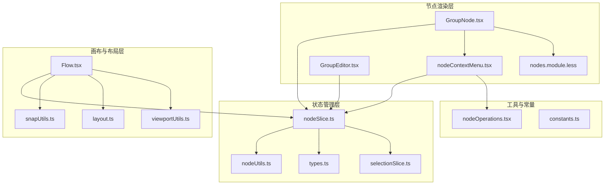
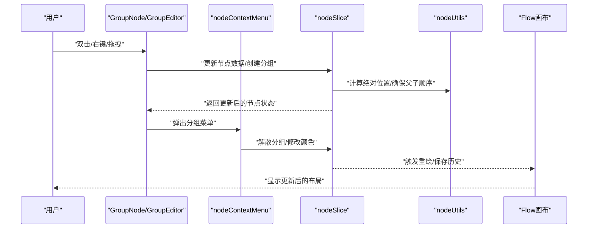
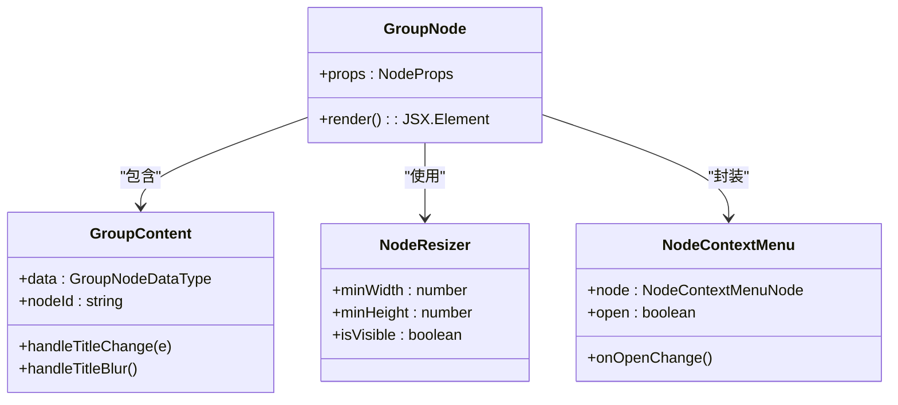
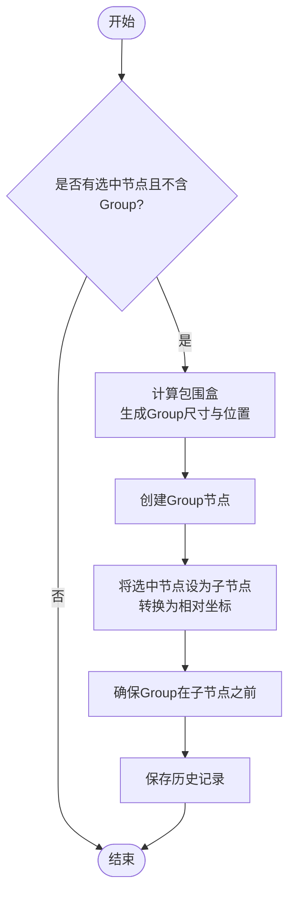
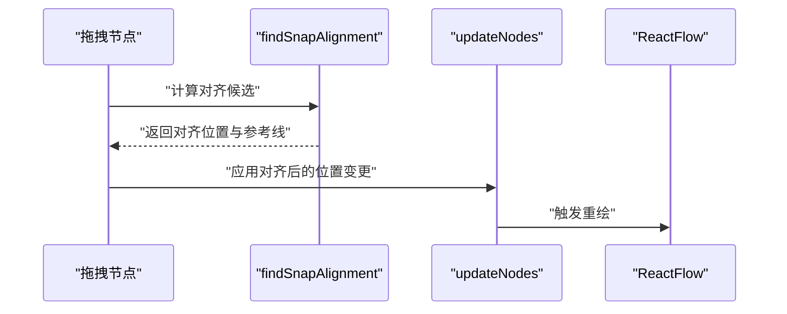
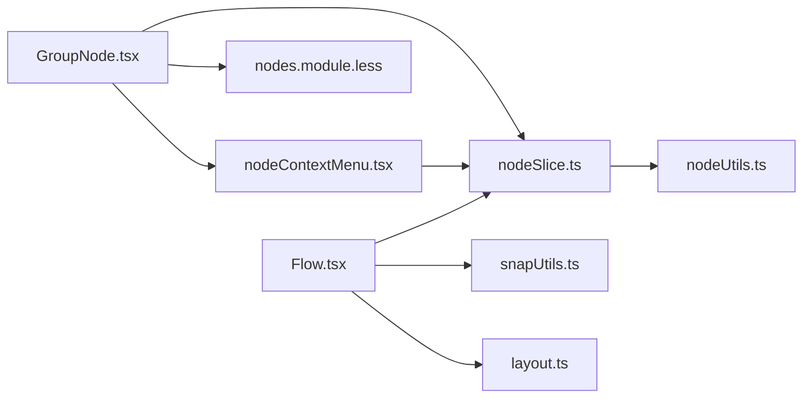

# Group节点

<cite>
**本文档引用的文件**
- [GroupNode.tsx](file://src/components/flow/nodes/GroupNode.tsx)
- [GroupEditor.tsx](file://src/components/panels/node-editors/GroupEditor.tsx)
- [nodeContextMenu.tsx](file://src/components/flow/nodes/nodeContextMenu.tsx)
- [nodeOperations.tsx](file://src/components/flow/nodes/utils/nodeOperations.tsx)
- [nodeUtils.ts](file://src/stores/flow/utils/nodeUtils.ts)
- [nodeSlice.ts](file://src/stores/flow/slices/nodeSlice.ts)
- [types.ts](file://src/stores/flow/types.ts)
- [constants.ts](file://src/components/flow/nodes/constants.ts)
- [nodes.module.less](file://src/styles/nodes.module.less)
- [Flow.tsx](file://src/components/Flow.tsx)
- [selectionSlice.ts](file://src/stores/flow/slices/selectionSlice.ts)
- [layout.ts](file://src/core/layout.ts)
- [snapUtils.ts](file://src/core/snapUtils.ts)
- [viewportUtils.ts](file://src/stores/flow/utils/viewportUtils.ts)
</cite>

## 目录
1. [简介](#简介)
2. [项目结构](#项目结构)
3. [核心组件](#核心组件)
4. [架构总览](#架构总览)
5. [详细组件分析](#详细组件分析)
6. [依赖关系分析](#依赖关系分析)
7. [性能考量](#性能考量)
8. [故障排查指南](#故障排查指南)
9. [结论](#结论)
10. [附录](#附录)

## 简介
Group节点是工作流编辑器中的分组容器节点，用于将多个相关节点组合在一起，实现工作流的模块化与层次化管理。它提供分组创建、解散、颜色主题、标题编辑、父子节点关系维护、磁吸对齐、自动拖拽挂靠等功能，并通过统一的状态管理与UI交互，支撑复杂工作流场景下的组织与协作。

## 项目结构
Group节点涉及的前端文件主要分布在以下模块：
- 节点渲染与交互：GroupNode.tsx、nodeContextMenu.tsx、nodes.module.less
- 编辑器面板：GroupEditor.tsx
- 状态管理：nodeSlice.ts、nodeUtils.ts、types.ts、selectionSlice.ts
- 画布与布局：Flow.tsx、layout.ts、snapUtils.ts、viewportUtils.ts
- 工具函数：nodeOperations.tsx、constants.ts

图表来源
- [GroupNode.tsx:1-184](file://src/components/flow/nodes/GroupNode.tsx#L1-L184)
- [nodeContextMenu.tsx:1-586](file://src/components/flow/nodes/nodeContextMenu.tsx#L1-L586)
- [GroupEditor.tsx:1-97](file://src/components/panels/node-editors/GroupEditor.tsx#L1-L97)
- [nodeSlice.ts:1-691](file://src/stores/flow/slices/nodeSlice.ts#L1-L691)
- [nodeUtils.ts:1-335](file://src/stores/flow/utils/nodeUtils.ts#L1-L335)
- [Flow.tsx:1-542](file://src/components/Flow.tsx#L1-L542)
- [layout.ts:109-141](file://src/core/layout.ts#L109-L141)
- [snapUtils.ts:109-161](file://src/core/snapUtils.ts#L109-L161)
- [viewportUtils.ts:1-53](file://src/stores/flow/utils/viewportUtils.ts#L1-L53)

章节来源
- [GroupNode.tsx:1-184](file://src/components/flow/nodes/GroupNode.tsx#L1-L184)
- [nodeContextMenu.tsx:1-586](file://src/components/flow/nodes/nodeContextMenu.tsx#L1-L586)
- [GroupEditor.tsx:1-97](file://src/components/panels/node-editors/GroupEditor.tsx#L1-L97)
- [nodeSlice.ts:1-691](file://src/stores/flow/slices/nodeSlice.ts#L1-L691)
- [nodeUtils.ts:1-335](file://src/stores/flow/utils/nodeUtils.ts#L1-L335)
- [Flow.tsx:1-542](file://src/components/Flow.tsx#L1-L542)
- [layout.ts:109-141](file://src/core/layout.ts#L109-L141)
- [snapUtils.ts:109-161](file://src/core/snapUtils.ts#L109-L161)
- [viewportUtils.ts:1-53](file://src/stores/flow/utils/viewportUtils.ts#L1-L53)

## 核心组件
- GroupNode组件：负责Group节点的渲染、标题编辑、颜色主题、尺寸调整、右键菜单集成。
- GroupEditor面板：提供分组名称与颜色的主题化编辑入口。
- nodeContextMenu：为Group节点提供“分组颜色”、“解散分组”、“删除分组”等专用菜单项。
- nodeSlice：实现分组创建、解散、父子节点挂靠/脱离、批量更新等核心逻辑。
- nodeUtils：提供创建Group节点、确保父子顺序、计算绝对位置等工具方法。
- Flow画布：集成磁吸对齐、自动拖拽挂靠、对齐布局、视图适配等能力。

章节来源
- [GroupNode.tsx:112-161](file://src/components/flow/nodes/GroupNode.tsx#L112-L161)
- [GroupEditor.tsx:20-96](file://src/components/panels/node-editors/GroupEditor.tsx#L20-L96)
- [nodeContextMenu.tsx:370-418](file://src/components/flow/nodes/nodeContextMenu.tsx#L370-L418)
- [nodeSlice.ts:523-690](file://src/stores/flow/slices/nodeSlice.ts#L523-L690)
- [nodeUtils.ts:277-334](file://src/stores/flow/utils/nodeUtils.ts#L277-L334)
- [Flow.tsx:296-413](file://src/components/Flow.tsx#L296-L413)

## 架构总览
Group节点的架构围绕“状态驱动的节点模型”展开，GroupNode作为UI组件与状态层交互，通过nodeSlice协调节点增删改、父子关系维护与历史记录；Flow画布提供拖拽、磁吸、对齐等交互能力；GroupEditor与右键菜单提供便捷编辑入口。

图表来源
- [GroupNode.tsx:112-161](file://src/components/flow/nodes/GroupNode.tsx#L112-L161)
- [nodeContextMenu.tsx:370-418](file://src/components/flow/nodes/nodeContextMenu.tsx#L370-L418)
- [nodeSlice.ts:523-690](file://src/stores/flow/slices/nodeSlice.ts#L523-L690)
- [nodeUtils.ts:192-213](file://src/stores/flow/utils/nodeUtils.ts#L192-L213)
- [Flow.tsx:296-413](file://src/components/Flow.tsx#L296-L413)

## 详细组件分析

### GroupNode组件
- 渲染结构：包含可调整尺寸的容器、标题栏输入、内容区占位。
- 主题系统：基于颜色主题映射生成背景、边框、头部背景与文本颜色。
- 交互行为：支持标题编辑、右键菜单、尺寸调整、选中态样式。
- 与状态层：通过useFlowStore更新节点数据，保存历史记录。

图表来源
- [GroupNode.tsx:112-161](file://src/components/flow/nodes/GroupNode.tsx#L112-L161)
- [GroupNode.tsx:52-109](file://src/components/flow/nodes/GroupNode.tsx#L52-L109)

章节来源
- [GroupNode.tsx:1-184](file://src/components/flow/nodes/GroupNode.tsx#L1-L184)

### GroupEditor编辑器
- 字段：名称、颜色主题。
- 行为：实时更新节点数据并保存历史，支持清空输入。

章节来源
- [GroupEditor.tsx:1-97](file://src/components/panels/node-editors/GroupEditor.tsx#L1-L97)

### 右键菜单（Group专用）
- 菜单项：分组颜色（五种主题）、解散分组、删除分组。
- 行为：切换颜色、调用ungroupNodes、删除分组（先解散子节点）。

章节来源
- [nodeContextMenu.tsx:370-418](file://src/components/flow/nodes/nodeContextMenu.tsx#L370-L418)

### 分组创建与管理（nodeSlice）
- 创建分组：计算选中节点包围盒，生成Group节点，设置父子关系，保证Group在子节点之前。
- 解散分组：将子节点转为绝对坐标并清除parentId。
- 挂靠/脱离：拖拽时自动检测进入/离开Group范围，进行attach/detach。
- 批量更新：支持批量修改节点数据并保存历史。

图表来源
- [nodeSlice.ts:523-598](file://src/stores/flow/slices/nodeSlice.ts#L523-L598)
- [nodeUtils.ts:317-334](file://src/stores/flow/utils/nodeUtils.ts#L317-L334)

章节来源
- [nodeSlice.ts:523-690](file://src/stores/flow/slices/nodeSlice.ts#L523-L690)
- [nodeUtils.ts:277-334](file://src/stores/flow/utils/nodeUtils.ts#L277-L334)

### 父子节点关系与选择联动
- 父子关系：子节点position为相对坐标，父节点position为绝对坐标；getNodeAbsolutePosition用于计算绝对位置。
- 选择联动：选中子节点时，父节点也应处于可交互状态；拖拽时自动挂靠/脱离。
- 画布交互：拖拽节点时过滤Group节点，避免磁吸对齐影响Group本身。

章节来源
- [nodeUtils.ts:192-213](file://src/stores/flow/utils/nodeUtils.ts#L192-L213)
- [Flow.tsx:361-413](file://src/components/Flow.tsx#L361-L413)

### 布局与对齐（磁吸、对齐、视图适配）
- 磁吸对齐：拖拽节点时计算最近对齐线，提供视觉参考线。
- 对齐工具：支持顶部、底部、居中对齐，批量更新节点位置。
- 视图适配：聚焦节点或选中节点，平滑动画过渡。

图表来源
- [snapUtils.ts:109-161](file://src/core/snapUtils.ts#L109-L161)
- [layout.ts:109-141](file://src/core/layout.ts#L109-L141)
- [viewportUtils.ts:21-53](file://src/stores/flow/utils/viewportUtils.ts#L21-L53)

章节来源
- [snapUtils.ts:109-161](file://src/core/snapUtils.ts#L109-L161)
- [layout.ts:109-141](file://src/core/layout.ts#L109-L141)
- [viewportUtils.ts:21-53](file://src/stores/flow/utils/viewportUtils.ts#L21-L53)

### 展开/收起与可见性控制
- Group节点本身不直接提供“展开/收起”的显式开关；其容器特性通过“标题栏+内容区”呈现，便于在画布中直观感知分组边界。
- 可见性与可编辑性：Group节点的标题栏输入支持编辑，颜色主题可切换；通过右键菜单可解散或删除分组，间接控制内部节点的可见性与可编辑性。

章节来源
- [GroupNode.tsx:52-109](file://src/components/flow/nodes/GroupNode.tsx#L52-L109)
- [nodeContextMenu.tsx:370-418](file://src/components/flow/nodes/nodeContextMenu.tsx#L370-L418)

### 嵌套与多层分组
- 嵌套支持：Group节点可包含其他Group节点，形成多层分组。
- 顺序规则：ensureGroupNodeOrder确保父节点在子节点之前，满足React Flow要求。
- 建议：尽量保持层级不超过3层，避免过度嵌套导致布局复杂度上升。

章节来源
- [nodeUtils.ts:317-334](file://src/stores/flow/utils/nodeUtils.ts#L317-L334)
- [nodeSlice.ts:588-589](file://src/stores/flow/slices/nodeSlice.ts#L588-L589)

### 大型工作流组织最佳实践
- 分层命名：为每个Group设定清晰的标签，结合颜色主题区分功能域。
- 控制层级：限制嵌套层级，优先使用并行分组而非深层嵌套。
- 自动化挂靠：利用拖拽自动挂靠功能，减少手动调整。
- 对齐与磁吸：启用磁吸对齐，提升布局一致性与可读性。
- 团队协作：统一颜色主题与命名规范，定期清理无用分组。

## 依赖关系分析
- 组件耦合：GroupNode与nodeContextMenu强关联，与nodeSlice弱耦合（通过状态更新）。
- 状态依赖：nodeSlice依赖nodeUtils进行父子关系与顺序维护。
- 画布依赖：Flow画布依赖snapUtils与layout工具进行交互与布局。
- UI样式：nodes.module.less提供Group节点专用样式，确保视觉一致性。

图表来源
- [GroupNode.tsx:1-184](file://src/components/flow/nodes/GroupNode.tsx#L1-L184)
- [nodeContextMenu.tsx:1-586](file://src/components/flow/nodes/nodeContextMenu.tsx#L1-L586)
- [nodeSlice.ts:1-691](file://src/stores/flow/slices/nodeSlice.ts#L1-L691)
- [nodeUtils.ts:1-335](file://src/stores/flow/utils/nodeUtils.ts#L1-L335)
- [Flow.tsx:1-542](file://src/components/Flow.tsx#L1-L542)
- [snapUtils.ts:109-161](file://src/core/snapUtils.ts#L109-L161)
- [layout.ts:109-141](file://src/core/layout.ts#L109-L141)

章节来源
- [GroupNode.tsx:1-184](file://src/components/flow/nodes/GroupNode.tsx#L1-L184)
- [nodeContextMenu.tsx:1-586](file://src/components/flow/nodes/nodeContextMenu.tsx#L1-L586)
- [nodeSlice.ts:1-691](file://src/stores/flow/slices/nodeSlice.ts#L1-L691)
- [nodeUtils.ts:1-335](file://src/stores/flow/utils/nodeUtils.ts#L1-L335)
- [Flow.tsx:1-542](file://src/components/Flow.tsx#L1-L542)
- [snapUtils.ts:109-161](file://src/core/snapUtils.ts#L109-L161)
- [layout.ts:109-141](file://src/core/layout.ts#L109-L141)

## 性能考量
- 渲染优化：GroupNodeMemo基于浅比较避免不必要的重渲染。
- 磁吸计算：仅在启用磁吸时计算对齐，且可按视口过滤节点，降低计算开销。
- 历史记录：批量更新时延迟保存历史，减少频繁写入。
- 视图适配：fitView采用异步调度，避免阻塞主线程。

章节来源
- [GroupNode.tsx:163-183](file://src/components/flow/nodes/GroupNode.tsx#L163-L183)
- [Flow.tsx:296-360](file://src/components/Flow.tsx#L296-L360)
- [nodeSlice.ts:392-394](file://src/stores/flow/slices/nodeSlice.ts#L392-L394)
- [viewportUtils.ts:32-52](file://src/stores/flow/utils/viewportUtils.ts#L32-L52)

## 故障排查指南
- 分组无法创建：确认选中节点不含Group节点；检查nodeSlice的groupSelectedNodes逻辑。
- 子节点无法拖入/拖出分组：检查拖拽停止回调中的挂靠/脱离逻辑；确认父节点尺寸与测量值。
- 磁吸无效：检查enableNodeSnap配置；确认过滤条件（排除Group节点）。
- 颜色主题不生效：检查GROUP_COLOR_THEMES映射与GroupNode主题选择逻辑。
- 历史记录异常：确认saveHistory调用时机与延迟参数。

章节来源
- [nodeSlice.ts:523-690](file://src/stores/flow/slices/nodeSlice.ts#L523-L690)
- [Flow.tsx:361-413](file://src/components/Flow.tsx#L361-L413)
- [GroupNode.tsx:13-47](file://src/components/flow/nodes/GroupNode.tsx#L13-L47)

## 结论
Group节点通过清晰的容器语义、灵活的颜色主题与便捷的编辑入口，有效支撑了复杂工作流的模块化与层次化组织。配合磁吸对齐、自动挂靠与历史记录机制，既提升了编辑效率，又保证了布局的一致性与可追溯性。遵循最佳实践与团队规范，可在大型项目中实现高效协作与可持续维护。

## 附录
- 相关常量与类型：节点类型、句柄方向、颜色主题等定义。
- 工具函数：节点创建、绝对位置计算、顺序保证等。

章节来源
- [constants.ts:1-47](file://src/components/flow/nodes/constants.ts#L1-L47)
- [types.ts:151-163](file://src/stores/flow/types.ts#L151-L163)
- [nodeUtils.ts:277-334](file://src/stores/flow/utils/nodeUtils.ts#L277-L334)