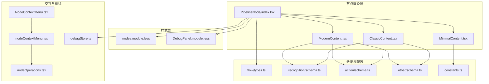
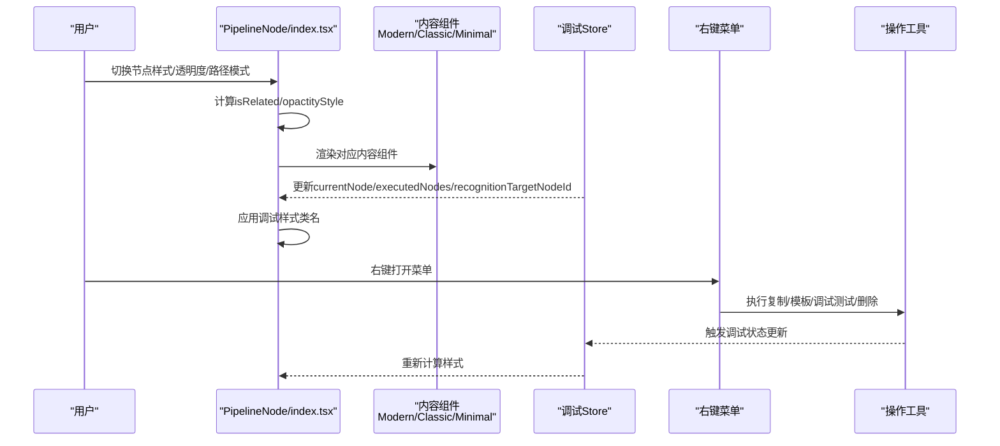
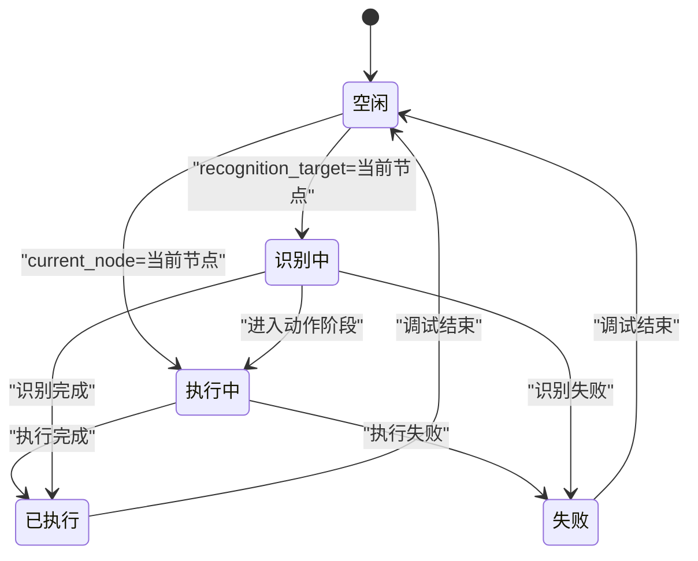
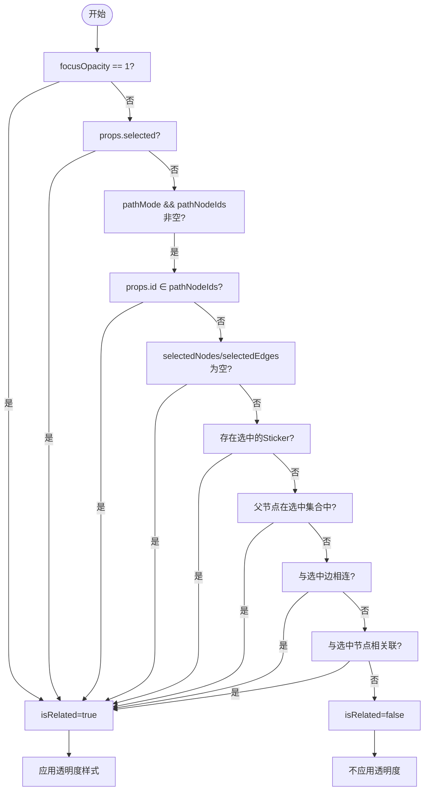
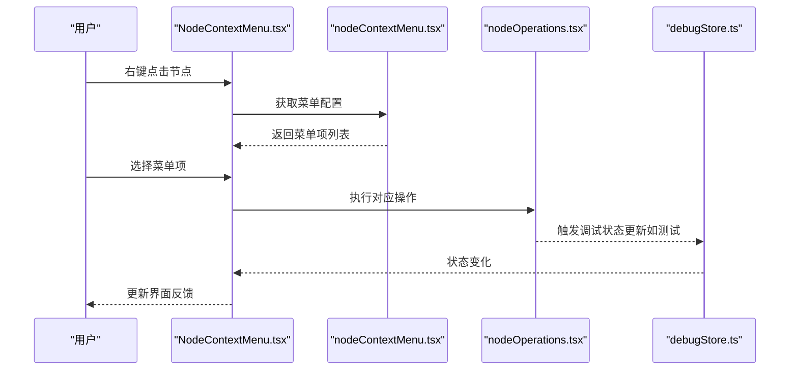
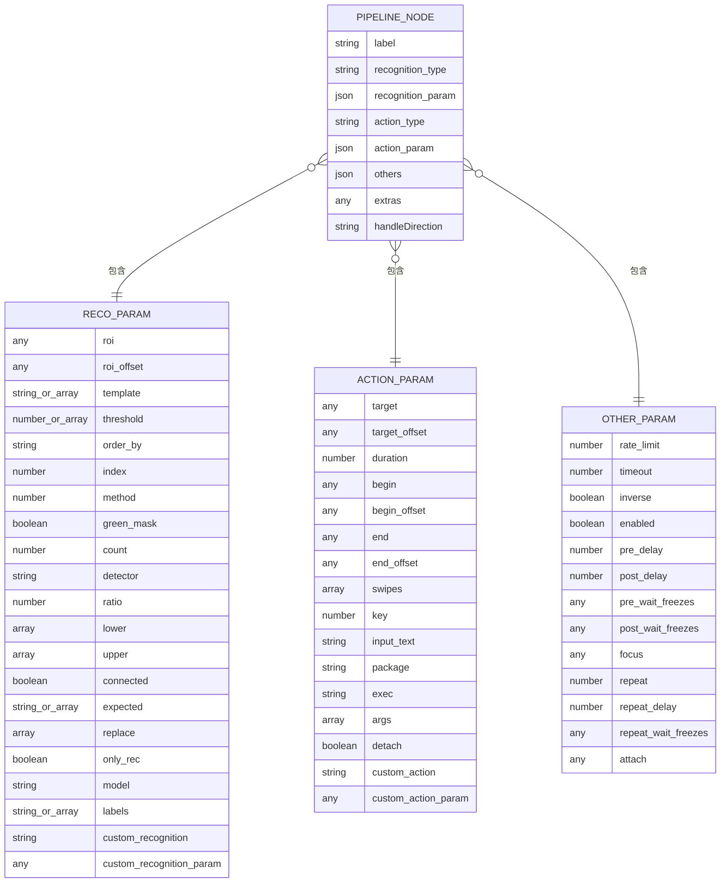
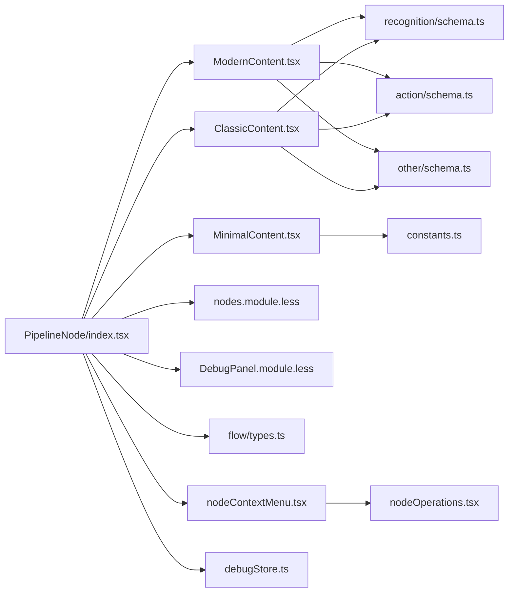

# Pipeline节点

<cite>
**本文档引用的文件**
- [PipelineNode/index.tsx](file://src/components/flow/nodes/PipelineNode/index.tsx)
- [PipelineNode/ModernContent.tsx](file://src/components/flow/nodes/PipelineNode/ModernContent.tsx)
- [PipelineNode/ClassicContent.tsx](file://src/components/flow/nodes/PipelineNode/ClassicContent.tsx)
- [PipelineNode/MinimalContent.tsx](file://src/components/flow/nodes/PipelineNode/MinimalContent.tsx)
- [nodes.module.less](file://src/styles/nodes.module.less)
- [DebugPanel.module.less](file://src/styles/DebugPanel.module.less)
- [flow/types.ts](file://src/stores/flow/types.ts)
- [recognition/schema.ts](file://src/core/fields/recognition/schema.ts)
- [action/schema.ts](file://src/core/fields/action/schema.ts)
- [other/schema.ts](file://src/core/fields/other/schema.ts)
- [nodeContextMenu.tsx](file://src/components/flow/nodes/nodeContextMenu.tsx)
- [NodeContextMenu.tsx](file://src/components/flow/nodes/components/NodeContextMenu.tsx)
- [nodeOperations.tsx](file://src/components/flow/nodes/utils/nodeOperations.tsx)
- [debugStore.ts](file://src/stores/debugStore.ts)
- [constants.ts](file://src/components/flow/nodes/constants.ts)
</cite>

## 目录
1. [简介](#简介)
2. [项目结构](#项目结构)
3. [核心组件](#核心组件)
4. [架构总览](#架构总览)
5. [详细组件分析](#详细组件分析)
6. [依赖关系分析](#依赖关系分析)
7. [性能考量](#性能考量)
8. [故障排查指南](#故障排查指南)
9. [结论](#结论)

## 简介
Pipeline节点是工作流编辑器中的核心节点，承载“识别 + 动作 + 其他配置”的三段式数据结构，负责在调试与运行时驱动自动化流程。本文档系统阐述其三种显示模式（Modern、Classic、Minimal）的差异与适用场景、交互行为（右键菜单、选中状态、拖拽处理、上下文操作）、调试状态可视化（执行中、已执行、识别中、失败）、焦点透明度与路径模式高亮逻辑，以及节点数据结构与字段配置方法，并提供性能优化建议与最佳实践。

## 项目结构
Pipeline节点位于Flow画布的节点体系中，采用模块化组织：
- 节点渲染：根据用户配置切换Modern/Classic/Minimal三种内容组件
- 调试状态：通过全局调试Store驱动节点视觉反馈
- 交互：右键菜单统一管理复制、模板、调试测试、删除等操作
- 样式：通过CSS Modules与调试样式模块实现不同状态的视觉提示

**图表来源**
- [PipelineNode/index.tsx:1-255](file://src/components/flow/nodes/PipelineNode/index.tsx#L1-L255)
- [PipelineNode/ModernContent.tsx:1-248](file://src/components/flow/nodes/PipelineNode/ModernContent.tsx#L1-L248)
- [PipelineNode/ClassicContent.tsx:1-84](file://src/components/flow/nodes/PipelineNode/ClassicContent.tsx#L1-L84)
- [PipelineNode/MinimalContent.tsx:1-58](file://src/components/flow/nodes/PipelineNode/MinimalContent.tsx#L1-L58)
- [nodes.module.less:1-694](file://src/styles/nodes.module.less#L1-L694)
- [DebugPanel.module.less:1-798](file://src/styles/DebugPanel.module.less#L1-L798)
- [flow/types.ts:107-122](file://src/stores/flow/types.ts#L107-L122)
- [recognition/schema.ts:1-276](file://src/core/fields/recognition/schema.ts#L1-L276)
- [action/schema.ts:1-299](file://src/core/fields/action/schema.ts#L1-L299)
- [other/schema.ts:1-363](file://src/core/fields/other/schema.ts#L1-L363)
- [nodeContextMenu.tsx:1-586](file://src/components/flow/nodes/nodeContextMenu.tsx#L1-L586)
- [NodeContextMenu.tsx:1-171](file://src/components/flow/nodes/components/NodeContextMenu.tsx#L1-L171)
- [nodeOperations.tsx:1-184](file://src/components/flow/nodes/utils/nodeOperations.tsx#L1-L184)
- [debugStore.ts:143-221](file://src/stores/debugStore.ts#L143-L221)

**章节来源**
- [PipelineNode/index.tsx:1-255](file://src/components/flow/nodes/PipelineNode/index.tsx#L1-L255)
- [nodes.module.less:1-694](file://src/styles/nodes.module.less#L1-L694)
- [DebugPanel.module.less:1-798](file://src/styles/DebugPanel.module.less#L1-L798)

## 核心组件
- 节点容器与状态计算
  - 读取全局配置（节点样式、焦点透明度）
  - 计算选中状态、边连接关系、分组父子关系、路径模式高亮
  - 根据调试Store状态应用视觉反馈（执行中、识别中、已执行、失败）
  - 渲染对应内容组件（Modern/Classic/Minimal）
- 内容组件
  - Modern：分栏展示识别/动作/其他字段，支持模板图片预览
  - Classic：列表式展示识别/动作/其他字段
  - Minimal：极简图标+颜色标识，适合大规模布局
- 交互与调试
  - 右键菜单：复制节点名、复制Reco JSON、保存为模板、调试测试、删除等
  - 调试状态：通过动画与边框强调当前执行/识别节点，失败节点高亮

**章节来源**
- [PipelineNode/index.tsx:21-194](file://src/components/flow/nodes/PipelineNode/index.tsx#L21-L194)
- [PipelineNode/ModernContent.tsx:29-247](file://src/components/flow/nodes/PipelineNode/ModernContent.tsx#L29-L247)
- [PipelineNode/ClassicContent.tsx:11-83](file://src/components/flow/nodes/PipelineNode/ClassicContent.tsx#L11-L83)
- [PipelineNode/MinimalContent.tsx:10-57](file://src/components/flow/nodes/PipelineNode/MinimalContent.tsx#L10-L57)
- [nodeContextMenu.tsx:369-585](file://src/components/flow/nodes/nodeContextMenu.tsx#L369-L585)
- [NodeContextMenu.tsx:23-171](file://src/components/flow/nodes/components/NodeContextMenu.tsx#L23-L171)
- [debugStore.ts:143-221](file://src/stores/debugStore.ts#L143-L221)

## 架构总览
Pipeline节点的渲染与交互遵循以下流程：
- 用户配置变更（样式、透明度、路径模式）触发节点类名与透明度计算
- 调试Store状态变化（当前节点、识别目标、执行历史）驱动节点视觉反馈
- 右键菜单根据节点类型与调试模式动态生成，调用操作工具函数执行具体动作

**图表来源**
- [PipelineNode/index.tsx:35-155](file://src/components/flow/nodes/PipelineNode/index.tsx#L35-L155)
- [nodeContextMenu.tsx:369-585](file://src/components/flow/nodes/nodeContextMenu.tsx#L369-L585)
- [nodeOperations.tsx:1-184](file://src/components/flow/nodes/utils/nodeOperations.tsx#L1-L184)
- [debugStore.ts:437-795](file://src/stores/debugStore.ts#L437-L795)

## 详细组件分析

### 显示模式对比与适用场景
- Modern（现代风格）
  - 特点：分栏展示识别/动作/其他字段，支持模板图片预览，适合需要详细查看参数的场景
  - 适用：参数较多、需要模板辅助理解的节点
- Classic（经典风格）
  - 特点：列表式展示，简洁直观，适合参数较少或追求紧凑布局的场景
  - 适用：参数简单、节点密集的流程
- Minimal（极简风格）
  - 特点：仅图标+颜色标识，节点尺寸小，适合大规模流程图
  - 适用：流程图规模大、需要快速浏览整体逻辑

**章节来源**
- [PipelineNode/ModernContent.tsx:29-247](file://src/components/flow/nodes/PipelineNode/ModernContent.tsx#L29-L247)
- [PipelineNode/ClassicContent.tsx:11-83](file://src/components/flow/nodes/PipelineNode/ClassicContent.tsx#L11-L83)
- [PipelineNode/MinimalContent.tsx:10-57](file://src/components/flow/nodes/PipelineNode/MinimalContent.tsx#L10-L57)

### 调试状态显示机制
- 执行中：当前节点高亮脉冲边框
- 识别中：当前节点高亮脉冲边框（橙色，优先于执行中）
- 已执行：节点半透明并显示勾选标记
- 失败：节点边框红色，背景浅红

**图表来源**
- [PipelineNode/index.tsx:125-144](file://src/components/flow/nodes/PipelineNode/index.tsx#L125-L144)
- [debugStore.ts:437-795](file://src/stores/debugStore.ts#L437-L795)
- [DebugPanel.module.less:184-246](file://src/styles/DebugPanel.module.less#L184-L246)

**章节来源**
- [PipelineNode/index.tsx:125-144](file://src/components/flow/nodes/PipelineNode/index.tsx#L125-L144)
- [DebugPanel.module.less:184-246](file://src/styles/DebugPanel.module.less#L184-L246)
- [debugStore.ts:143-221](file://src/stores/debugStore.ts#L143-L221)

### 焦点透明度系统与路径模式高亮
- 透明度来源：来自全局配置的focusOpacity
- 高亮判定（isRelated）：
  - focusOpacity为1或节点被选中时始终高亮
  - 路径模式下仅高亮路径节点
  - 无选中节点时默认高亮
  - 选中便签节点时不触发聚焦效果
  - 与选中边/父节点关联的节点高亮
- 透明度样式：当不满足高亮条件时应用opacity

**图表来源**
- [PipelineNode/index.tsx:55-115](file://src/components/flow/nodes/PipelineNode/index.tsx#L55-L115)

**章节来源**
- [PipelineNode/index.tsx:55-115](file://src/components/flow/nodes/PipelineNode/index.tsx#L55-L115)

### 交互行为与右键菜单
- 右键菜单生成：根据节点类型与调试模式动态构建
- 常用操作：
  - 复制节点名（含前缀拼接）
  - 复制Reco JSON（仅Pipeline）
  - 保存为模板（仅Pipeline）
  - 设为调试开始节点（仅Pipeline）
  - 从此节点开始调试（仅Pipeline）
  - 测试此节点/测试识别/测试动作（仅Pipeline）
  - 删除节点
- 菜单项可见性与禁用：根据节点类型、调试状态、资源路径等条件动态控制

**图表来源**
- [NodeContextMenu.tsx:23-171](file://src/components/flow/nodes/components/NodeContextMenu.tsx#L23-L171)
- [nodeContextMenu.tsx:369-585](file://src/components/flow/nodes/nodeContextMenu.tsx#L369-L585)
- [nodeOperations.tsx:1-184](file://src/components/flow/nodes/utils/nodeOperations.tsx#L1-L184)
- [debugStore.ts:275-415](file://src/stores/debugStore.ts#L275-L415)

**章节来源**
- [NodeContextMenu.tsx:23-171](file://src/components/flow/nodes/components/NodeContextMenu.tsx#L23-L171)
- [nodeContextMenu.tsx:369-585](file://src/components/flow/nodes/nodeContextMenu.tsx#L369-L585)
- [nodeOperations.tsx:1-184](file://src/components/flow/nodes/utils/nodeOperations.tsx#L1-L184)

### 节点数据结构详解
Pipeline节点数据结构由三大部分组成：

- 识别参数（recognition.param）
  - ROI/偏移、模板路径、阈值、排序方式、索引、特征/颜色/OCR/神经网络等字段
  - 支持组合识别（all_of/any_of）与自定义识别
- 动作参数（action.param）
  - 点击/长按/滑动/滚动/触控/按键/输入/应用/命令/截图等
  - 支持多点触控、多段滑动、延迟与等待画面静止
- 其他配置（others）
  - 速率限制、超时、反转、启用、最大命中次数、前后延迟、等待画面静止、锚点、关注消息、重复执行等

**图表来源**
- [flow/types.ts:107-122](file://src/stores/flow/types.ts#L107-L122)
- [flow/types.ts:43-102](file://src/stores/flow/types.ts#L43-L102)
- [flow/types.ts:69-88](file://src/stores/flow/types.ts#L69-L88)
- [flow/types.ts:90-102](file://src/stores/flow/types.ts#L90-L102)
- [recognition/schema.ts:1-276](file://src/core/fields/recognition/schema.ts#L1-L276)
- [action/schema.ts:1-299](file://src/core/fields/action/schema.ts#L1-L299)
- [other/schema.ts:1-363](file://src/core/fields/other/schema.ts#L1-L363)

**章节来源**
- [flow/types.ts:107-122](file://src/stores/flow/types.ts#L107-L122)
- [recognition/schema.ts:1-276](file://src/core/fields/recognition/schema.ts#L1-L276)
- [action/schema.ts:1-299](file://src/core/fields/action/schema.ts#L1-L299)
- [other/schema.ts:1-363](file://src/core/fields/other/schema.ts#L1-L363)

## 依赖关系分析
- 组件耦合
  - PipelineNode与内容组件为组合关系，通过配置切换渲染
  - 调试样式与节点类名强绑定，避免跨组件污染
  - 右键菜单与操作工具解耦，便于扩展新操作
- 外部依赖
  - ReactFlow实例用于节点定位与拖拽
  - Zustand Store提供全局状态（配置、调试、文件、模板）
  - 后端协议用于调试启动与事件推送

**图表来源**
- [PipelineNode/index.tsx:1-255](file://src/components/flow/nodes/PipelineNode/index.tsx#L1-L255)
- [PipelineNode/ModernContent.tsx:1-248](file://src/components/flow/nodes/PipelineNode/ModernContent.tsx#L1-L248)
- [PipelineNode/ClassicContent.tsx:1-84](file://src/components/flow/nodes/PipelineNode/ClassicContent.tsx#L1-L84)
- [PipelineNode/MinimalContent.tsx:1-58](file://src/components/flow/nodes/PipelineNode/MinimalContent.tsx#L1-L58)
- [flow/types.ts:107-122](file://src/stores/flow/types.ts#L107-L122)
- [recognition/schema.ts:1-276](file://src/core/fields/recognition/schema.ts#L1-L276)
- [action/schema.ts:1-299](file://src/core/fields/action/schema.ts#L1-L299)
- [other/schema.ts:1-363](file://src/core/fields/other/schema.ts#L1-L363)
- [nodeContextMenu.tsx:1-586](file://src/components/flow/nodes/nodeContextMenu.tsx#L1-L586)
- [nodeOperations.tsx:1-184](file://src/components/flow/nodes/utils/nodeOperations.tsx#L1-L184)
- [debugStore.ts:143-221](file://src/stores/debugStore.ts#L143-L221)
- [constants.ts:1-47](file://src/components/flow/nodes/constants.ts#L1-L47)

**章节来源**
- [PipelineNode/index.tsx:1-255](file://src/components/flow/nodes/PipelineNode/index.tsx#L1-L255)
- [nodeContextMenu.tsx:1-586](file://src/components/flow/nodes/nodeContextMenu.tsx#L1-L586)
- [nodeOperations.tsx:1-184](file://src/components/flow/nodes/utils/nodeOperations.tsx#L1-L184)
- [debugStore.ts:143-221](file://src/stores/debugStore.ts#L143-L221)

## 性能考量
- 渲染优化
  - 使用memo包裹内容组件与节点容器，减少不必要的重渲染
  - 通过useMemo计算isRelated与样式，避免频繁计算
  - 仅在必要时渲染模板图片与详细字段
- 调试状态
  - 限制识别记录与执行历史的最大条数，超限时按比例清理
  - 识别详情采用懒加载与缓存，控制内存占用
- 交互与布局
  - Minimal模式降低节点尺寸与层级复杂度，提升大规模流程图的渲染性能
  - 合理使用路径模式与焦点透明度，避免过度高亮导致的重绘

**章节来源**
- [PipelineNode/index.tsx:196-254](file://src/components/flow/nodes/PipelineNode/index.tsx#L196-L254)
- [PipelineNode/ModernContent.tsx:44-49](file://src/components/flow/nodes/PipelineNode/ModernContent.tsx#L44-L49)
- [debugStore.ts:10-21](file://src/stores/debugStore.ts#L10-L21)

## 故障排查指南
- 调试无法启动
  - 检查LocalBridge连接状态与控制器连接
  - 确认资源路径已配置且文件已保存
  - 查看调试错误信息与状态机
- 节点未高亮
  - 确认是否处于路径模式或存在选中节点
  - 检查focusOpacity是否为1
  - 确认节点是否与选中边/父节点关联
- 右键菜单异常
  - 检查节点类型与调试模式
  - 确认资源路径与控制器状态
  - 查看操作返回的消息提示

**章节来源**
- [nodeContextMenu.tsx:113-176](file://src/components/flow/nodes/nodeContextMenu.tsx#L113-L176)
- [debugStore.ts:295-398](file://src/stores/debugStore.ts#L295-L398)

## 结论
Pipeline节点通过清晰的数据结构与灵活的显示模式，为工作流设计提供了强大的表达能力。配合完善的调试状态可视化与交互体系，开发者可以在复杂流程中高效定位问题、优化参数。建议在大规模流程中优先采用Minimal模式，在参数调试阶段使用Modern模式，并合理利用焦点透明度与路径模式提升可读性与性能。