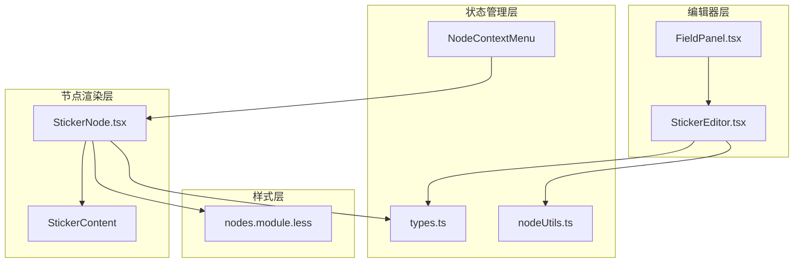
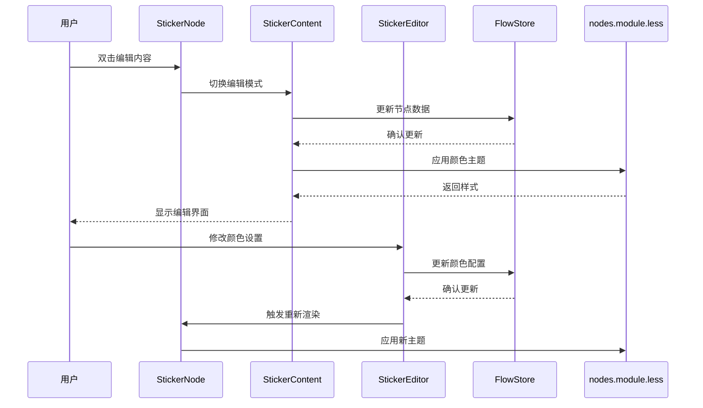
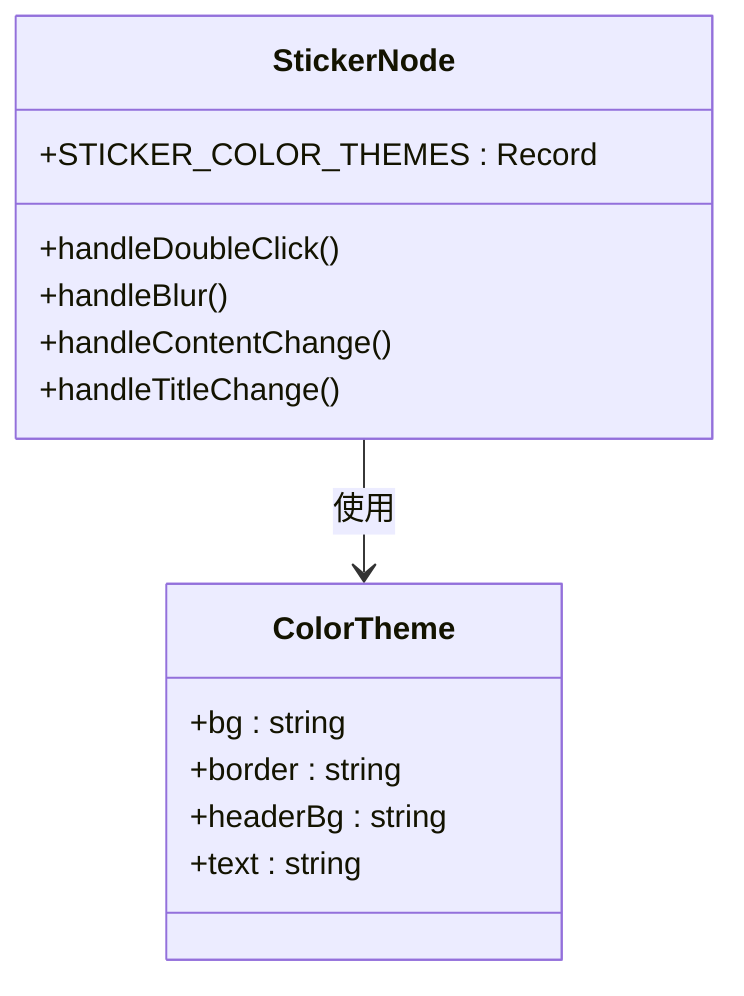
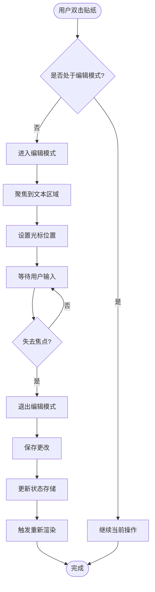
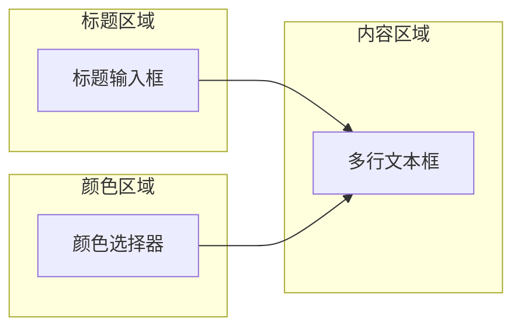
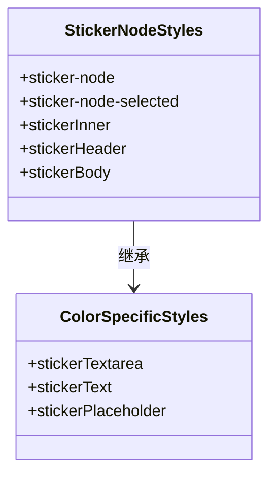
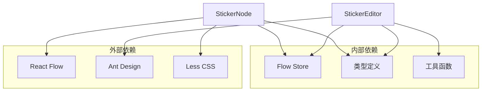
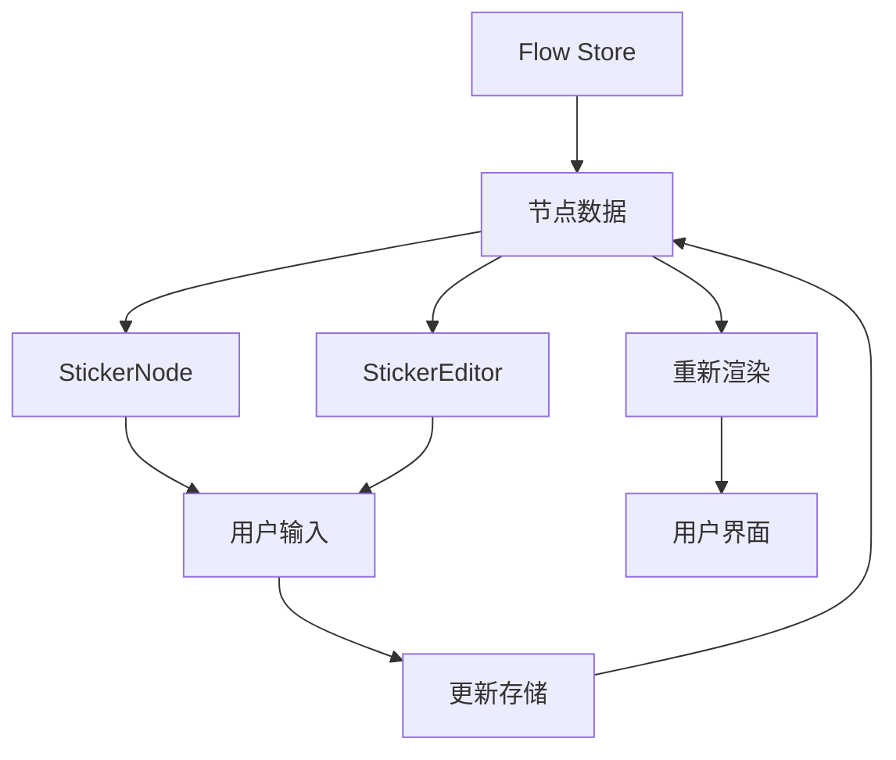

# Sticker节点

<cite>
**本文档引用的文件**
- [StickerNode.tsx](file://src/components/flow/nodes/StickerNode.tsx)
- [StickerEditor.tsx](file://src/components/panels/node-editors/StickerEditor.tsx)
- [nodes.module.less](file://src/styles/nodes.module.less)
- [types.ts](file://src/stores/flow/types.ts)
- [nodeUtils.ts](file://src/stores/flow/utils/nodeUtils.ts)
- [nodeContextMenu.tsx](file://src/components/flow/nodes/nodeContextMenu.tsx)
- [FieldPanel.tsx](file://src/components/panels/main/FieldPanel.tsx)
</cite>

## 目录
1. [简介](#简介)
2. [项目结构](#项目结构)
3. [核心组件](#核心组件)
4. [架构总览](#架构总览)
5. [详细组件分析](#详细组件分析)
6. [依赖关系分析](#依赖关系分析)
7. [性能考虑](#性能考虑)
8. [故障排除指南](#故障排除指南)
9. [结论](#结论)
10. [附录](#附录)

## 简介
Sticker节点是工作流编辑器中的贴纸标记节点，用于在流程图中添加注释、说明和视觉提示。它是一个完全非功能性节点，不参与流程执行，但通过丰富的视觉设计和交互能力帮助团队成员更好地理解、组织和维护复杂的工作流。

该节点的核心设计理念是提供轻量级的标注能力，支持多种颜色主题、可编辑的内容区域、拖拽调整尺寸等功能，同时保持与工作流编辑器整体设计的一致性。

## 项目结构
Sticker节点的实现分布在多个关键模块中：

**图表来源**
- [StickerNode.tsx:1-237](file://src/components/flow/nodes/StickerNode.tsx#L1-L237)
- [StickerEditor.tsx:1-132](file://src/components/panels/node-editors/StickerEditor.tsx#L1-L132)
- [nodes.module.less:539-630](file://src/styles/nodes.module.less#L539-L630)

**章节来源**
- [StickerNode.tsx:1-237](file://src/components/flow/nodes/StickerNode.tsx#L1-L237)
- [StickerEditor.tsx:1-132](file://src/components/panels/node-editors/StickerEditor.tsx#L1-L132)
- [nodes.module.less:539-630](file://src/styles/nodes.module.less#L539-L630)

## 核心组件
Sticker节点由三个主要组件构成：

### 主要组件职责
1. **StickerNode**: 负责节点的整体渲染和交互逻辑
2. **StickerContent**: 处理具体的贴纸内容显示和编辑功能
3. **StickerEditor**: 提供字段面板中的编辑界面

### 数据模型
Sticker节点的数据结构包含三个核心字段：
- `label`: 节点标题（用于显示和标识）
- `content`: 贴纸正文内容（支持多行文本）
- `color`: 颜色主题（支持5种预设颜色）

**章节来源**
- [types.ts:144-149](file://src/stores/flow/types.ts#L144-L149)
- [nodeUtils.ts:145-157](file://src/stores/flow/utils/nodeUtils.ts#L145-L157)

## 架构总览
Sticker节点采用分层架构设计，确保了良好的可维护性和扩展性：

**图表来源**
- [StickerNode.tsx:70-99](file://src/components/flow/nodes/StickerNode.tsx#L70-L99)
- [StickerEditor.tsx:58-64](file://src/components/panels/node-editors/StickerEditor.tsx#L58-L64)
- [nodes.module.less:539-630](file://src/styles/nodes.module.less#L539-L630)

## 详细组件分析

### StickerNode组件分析
StickerNode是节点的主要渲染组件，负责处理用户交互和状态管理。

#### 核心功能特性
1. **颜色主题系统**: 支持5种预设颜色主题（黄色、绿色、蓝色、粉色、紫色）
2. **双击编辑**: 支持双击进入编辑模式
3. **尺寸调整**: 提供拖拽调整节点大小的功能
4. **上下文菜单**: 集成完整的右键菜单功能

#### 颜色主题配置

**图表来源**
- [StickerNode.tsx:14-48](file://src/components/flow/nodes/StickerNode.tsx#L14-L48)
- [StickerNode.tsx:165-213](file://src/components/flow/nodes/StickerNode.tsx#L165-L213)

#### 编辑交互流程

**图表来源**
- [StickerNode.tsx:70-107](file://src/components/flow/nodes/StickerNode.tsx#L70-L107)
- [StickerNode.tsx:80-83](file://src/components/flow/nodes/StickerNode.tsx#L80-L83)

**章节来源**
- [StickerNode.tsx:53-162](file://src/components/flow/nodes/StickerNode.tsx#L53-L162)
- [StickerNode.tsx:165-213](file://src/components/flow/nodes/StickerNode.tsx#L165-L213)

### StickerEditor组件分析
StickerEditor提供专门的字段面板编辑界面，支持更直观的配置操作。

#### 编辑器功能
1. **标题编辑**: 支持修改贴纸标题
2. **颜色选择**: 提供5种颜色主题选择
3. **内容编辑**: 支持多行文本编辑，自动调整高度

#### 编辑器界面布局

**图表来源**
- [StickerEditor.tsx:67-129](file://src/components/panels/node-editors/StickerEditor.tsx#L67-L129)

**章节来源**
- [StickerEditor.tsx:21-131](file://src/components/panels/node-editors/StickerEditor.tsx#L21-L131)

### 样式系统分析
Sticker节点采用模块化样式设计，支持响应式主题切换：

#### 样式层次结构
1. **基础样式**: 定义节点的基本外观
2. **主题样式**: 根据颜色主题动态应用样式
3. **交互样式**: 处理选中、悬停等交互状态

#### 样式继承关系

**图表来源**
- [nodes.module.less:539-630](file://src/styles/nodes.module.less#L539-L630)

**章节来源**
- [nodes.module.less:539-630](file://src/styles/nodes.module.less#L539-L630)

## 依赖关系分析

### 组件间依赖关系

**图表来源**
- [StickerNode.tsx:1-11](file://src/components/flow/nodes/StickerNode.tsx#L1-L11)
- [StickerEditor.tsx:1-9](file://src/components/panels/node-editors/StickerEditor.tsx#L1-L9)

### 数据流依赖

**图表来源**
- [types.ts:285-309](file://src/stores/flow/types.ts#L285-L309)
- [nodeUtils.ts:145-157](file://src/stores/flow/utils/nodeUtils.ts#L145-L157)

**章节来源**
- [types.ts:1-362](file://src/stores/flow/types.ts#L1-L362)
- [nodeUtils.ts:145-157](file://src/stores/flow/utils/nodeUtils.ts#L145-L157)

## 性能考虑
Sticker节点在设计时充分考虑了性能优化：

### 渲染优化
1. **memo包装**: 使用React.memo避免不必要的重新渲染
2. **条件渲染**: 仅在需要时渲染编辑界面
3. **样式缓存**: 颜色主题信息进行缓存复用

### 内存管理
1. **事件处理器**: 使用useCallback稳定事件处理器引用
2. **状态分离**: 将编辑状态与显示状态分离
3. **引用管理**: 合理使用useRef管理DOM引用

## 故障排除指南

### 常见问题及解决方案
1. **编辑功能失效**
   - 检查节点是否被选中
   - 确认没有其他元素阻止事件传播
   - 验证Flow Store的状态更新

2. **颜色主题不生效**
   - 检查颜色值是否在有效范围内
   - 确认样式类名正确应用
   - 验证CSS变量是否正确加载

3. **尺寸调整异常**
   - 检查NodeResizer配置
   - 确认最小尺寸限制设置
   - 验证容器样式设置

**章节来源**
- [StickerNode.tsx:215-236](file://src/components/flow/nodes/StickerNode.tsx#L215-L236)
- [StickerEditor.tsx:58-64](file://src/components/panels/node-editors/StickerEditor.tsx#L58-L64)

## 结论
Sticker节点作为工作流编辑器中的重要辅助组件，通过其简洁而强大的设计实现了以下目标：

1. **增强可读性**: 通过颜色编码和文本标注提升工作流的可理解性
2. **提高协作效率**: 为团队成员提供统一的标注标准和工具
3. **保持设计一致性**: 与整体UI设计风格无缝集成
4. **确保性能稳定**: 通过合理的架构设计保证良好的用户体验

该节点的设计体现了现代前端开发的最佳实践，既满足了功能需求，又保持了良好的可维护性和扩展性。

## 附录

### 使用场景示例
1. **流程说明标注**: 在关键决策点添加解释性文字
2. **团队协作标记**: 标识需要特别注意的节点或步骤
3. **版本变更提示**: 标记已修改或待审查的节点
4. **资源说明**: 添加相关的参考资料或链接说明

### 最佳实践建议
1. **颜色使用规范**: 建议为不同类型的标注使用不同的颜色主题
2. **内容简洁明了**: 标注内容应简洁有力，避免冗长
3. **定期清理**: 定期清理过时或重复的标注
4. **团队约定**: 建立团队内部的标注规范和使用约定