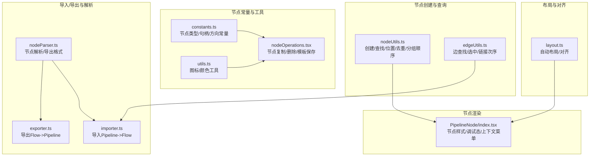
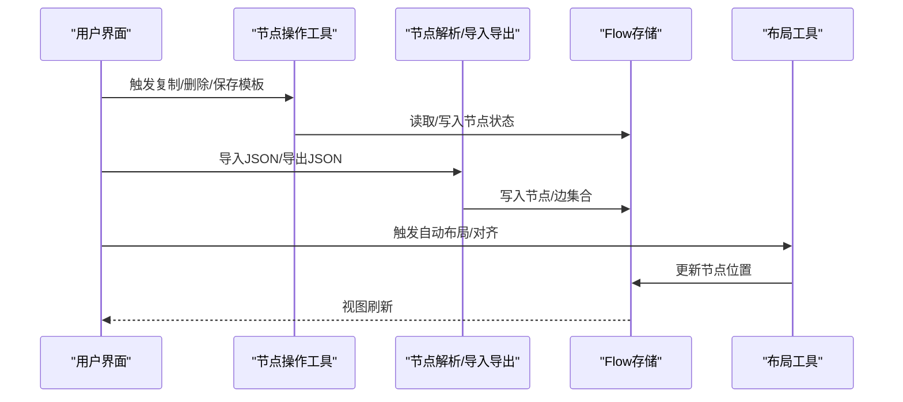
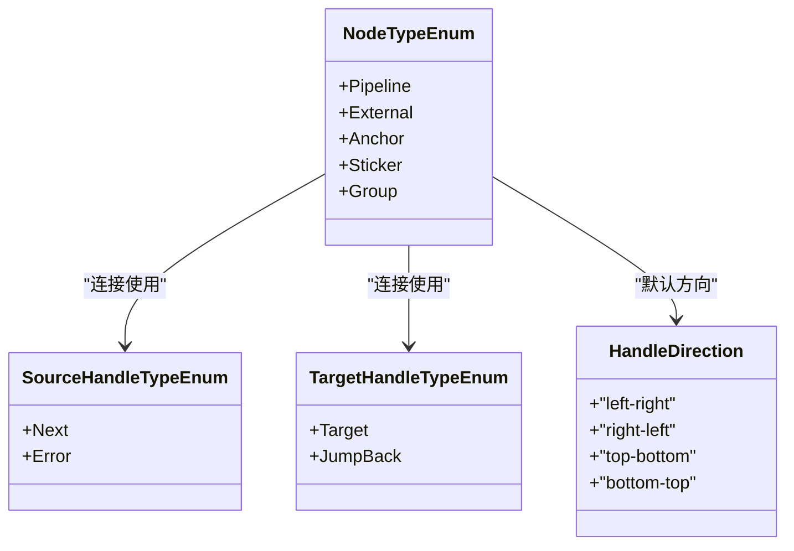
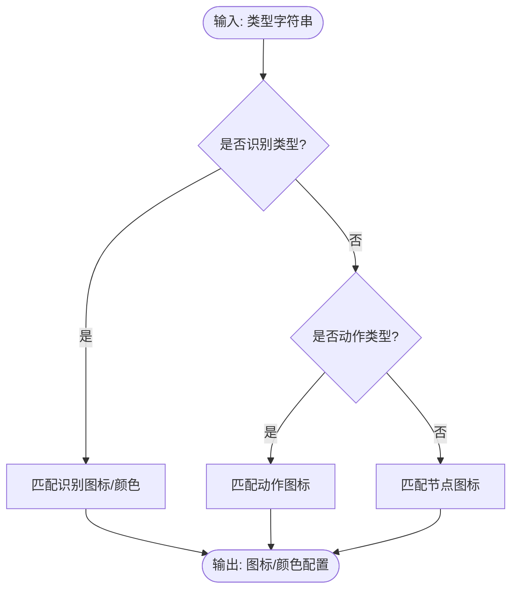
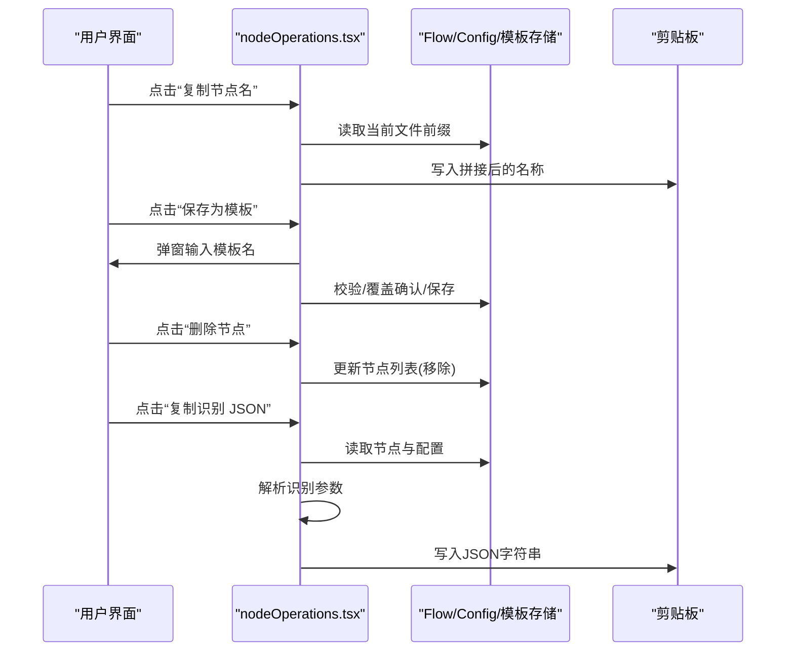
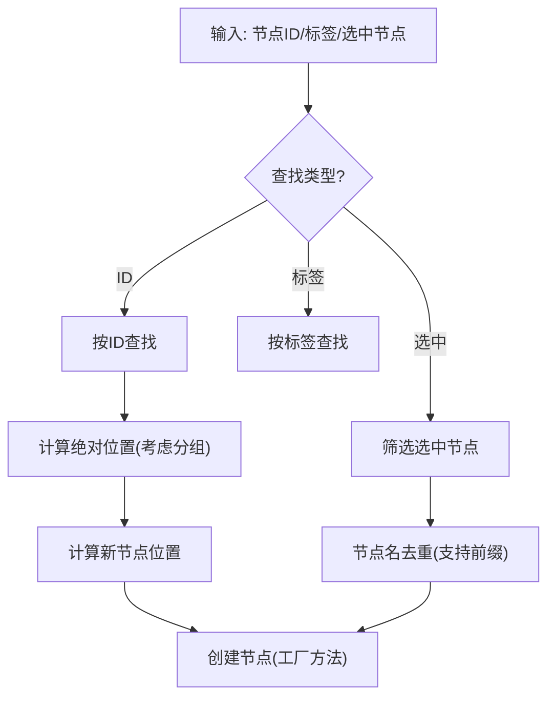
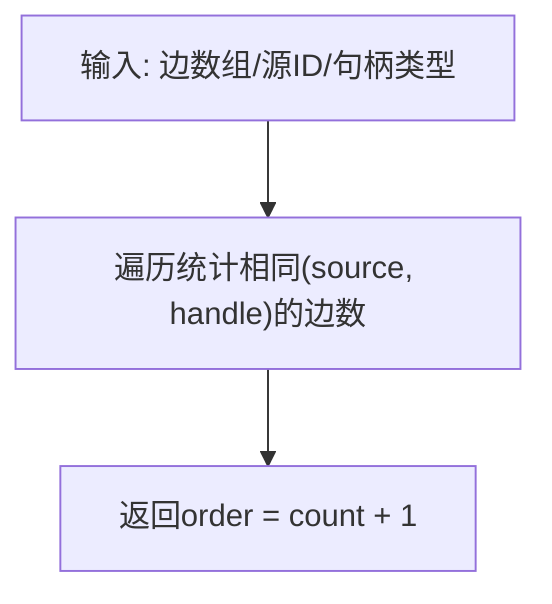
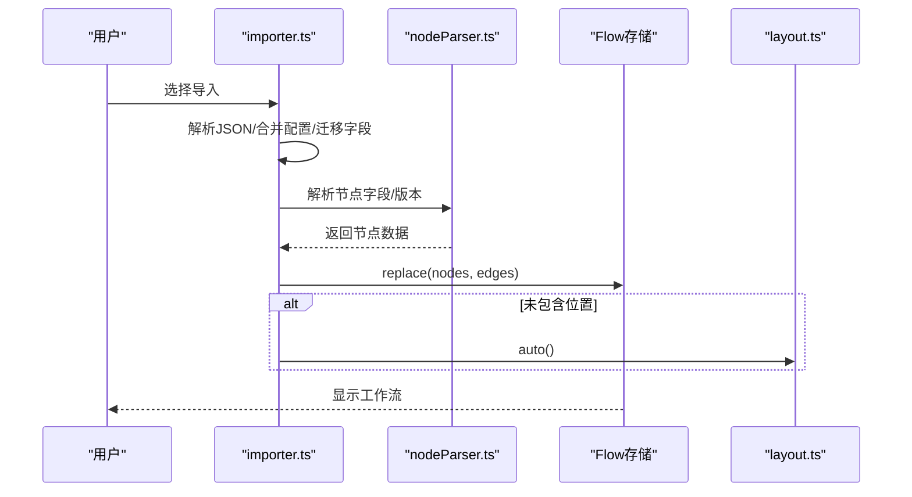
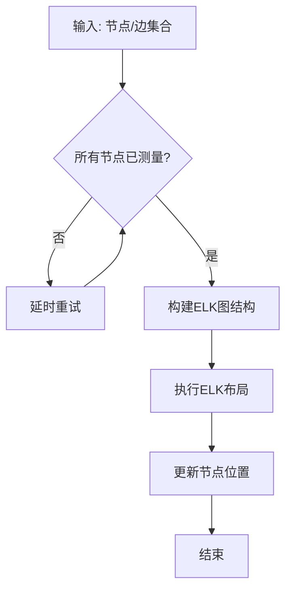
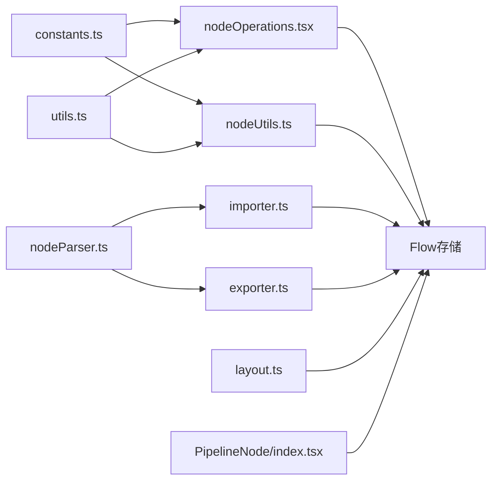

# 节点工具集

<cite>
**本文档引用的文件**
- [constants.ts](file://src/components/flow/nodes/constants.ts)
- [utils.ts](file://src/components/flow/nodes/utils.ts)
- [nodeOperations.tsx](file://src/components/flow/nodes/utils/nodeOperations.tsx)
- [index.ts](file://src/components/flow/nodes/index.ts)
- [nodeUtils.ts](file://src/stores/flow/utils/nodeUtils.ts)
- [edgeUtils.ts](file://src/stores/flow/utils/edgeUtils.ts)
- [nodeParser.ts](file://src/core/parser/nodeParser.ts)
- [importer.ts](file://src/core/parser/importer.ts)
- [exporter.ts](file://src/core/parser/exporter.ts)
- [layout.ts](file://src/core/layout.ts)
- [PipelineNode/index.tsx](file://src/components/flow/nodes/PipelineNode/index.tsx)
</cite>

## 目录
1. [简介](#简介)
2. [项目结构](#项目结构)
3. [核心组件](#核心组件)
4. [架构总览](#架构总览)
5. [详细组件分析](#详细组件分析)
6. [依赖分析](#依赖分析)
7. [性能考虑](#性能考虑)
8. [故障排查指南](#故障排查指南)
9. [结论](#结论)
10. [附录](#附录)

## 简介
本文件系统性梳理“节点工具集”的设计与实现，涵盖节点类型与常量、节点创建/删除/复制/移动等操作、节点验证与校验、节点序列化与反序列化、节点布局与对齐、以及扩展开发指南。文档面向不同技术背景的读者，既提供高层概览，也给出代码级的可视化与来源标注，便于快速定位实现细节。

## 项目结构
节点工具集主要分布在以下模块：
- 节点常量与图标/颜色工具：src/components/flow/nodes
- 节点操作工具：src/components/flow/nodes/utils
- 节点创建与查询工具：src/stores/flow/utils
- 边工具：src/stores/flow/utils/edgeUtils.ts
- 导入/导出与节点解析：src/core/parser
- 布局与对齐：src/core/layout.ts
- 节点渲染与样式：src/components/flow/nodes/PipelineNode

图表来源
- [constants.ts:1-47](file://src/components/flow/nodes/constants.ts#L1-L47)
- [utils.ts:1-139](file://src/components/flow/nodes/utils.ts#L1-L139)
- [nodeOperations.tsx:1-184](file://src/components/flow/nodes/utils/nodeOperations.tsx#L1-L184)
- [nodeUtils.ts:1-335](file://src/stores/flow/utils/nodeUtils.ts#L1-L335)
- [edgeUtils.ts:1-32](file://src/stores/flow/utils/edgeUtils.ts#L1-L32)
- [nodeParser.ts:1-372](file://src/core/parser/nodeParser.ts#L1-L372)
- [importer.ts:1-508](file://src/core/parser/importer.ts#L1-L508)
- [exporter.ts:1-244](file://src/core/parser/exporter.ts#L1-L244)
- [layout.ts:1-142](file://src/core/layout.ts#L1-L142)
- [PipelineNode/index.tsx:1-255](file://src/components/flow/nodes/PipelineNode/index.tsx#L1-L255)

章节来源
- [constants.ts:1-47](file://src/components/flow/nodes/constants.ts#L1-L47)
- [utils.ts:1-139](file://src/components/flow/nodes/utils.ts#L1-L139)
- [nodeOperations.tsx:1-184](file://src/components/flow/nodes/utils/nodeOperations.tsx#L1-L184)
- [nodeUtils.ts:1-335](file://src/stores/flow/utils/nodeUtils.ts#L1-L335)
- [edgeUtils.ts:1-32](file://src/stores/flow/utils/edgeUtils.ts#L1-L32)
- [nodeParser.ts:1-372](file://src/core/parser/nodeParser.ts#L1-L372)
- [importer.ts:1-508](file://src/core/parser/importer.ts#L1-L508)
- [exporter.ts:1-244](file://src/core/parser/exporter.ts#L1-L244)
- [layout.ts:1-142](file://src/core/layout.ts#L1-L142)
- [PipelineNode/index.tsx:1-255](file://src/components/flow/nodes/PipelineNode/index.tsx#L1-L255)

## 核心组件
- 节点类型与句柄方向常量：定义节点类型枚举、源/目标句柄类型、句柄方向及默认值，支撑节点渲染与连接逻辑。
- 节点图标与颜色工具：按识别/动作/节点类型返回图标配置与极简风格颜色方案，统一视觉呈现。
- 节点操作工具：提供复制节点名、保存为模板、删除节点、复制识别 JSON 等常用操作。
- 节点创建与查询工具：封装创建 Pipeline/External/Anchor/Sticker/Group 节点的工厂方法；提供查找、选中过滤、绝对位置计算、新节点位置计算、节点名去重、分组顺序保证等。
- 边工具：提供边查找、选中过滤、同一源点下链接次序计算。
- 导入/导出与解析：将外部 JSON 流水线导入为 Flow 节点/边，或将 Flow 导出为流水线对象/字符串；解析节点字段、版本迁移、位置与端点方向导出。
- 布局与对齐：基于 ELKJS 的自动布局与对齐（顶部/底部/居中）。
- 节点渲染：根据配置切换经典/现代/极简样式，结合调试态与焦点透明度，提供上下文菜单。

章节来源
- [constants.ts:13-47](file://src/components/flow/nodes/constants.ts#L13-L47)
- [utils.ts:14-139](file://src/components/flow/nodes/utils.ts#L14-L139)
- [nodeOperations.tsx:12-184](file://src/components/flow/nodes/utils/nodeOperations.tsx#L12-L184)
- [nodeUtils.ts:14-335](file://src/stores/flow/utils/nodeUtils.ts#L14-L335)
- [edgeUtils.ts:4-32](file://src/stores/flow/utils/edgeUtils.ts#L4-L32)
- [nodeParser.ts:16-372](file://src/core/parser/nodeParser.ts#L16-L372)
- [importer.ts:151-508](file://src/core/parser/importer.ts#L151-L508)
- [exporter.ts:42-244](file://src/core/parser/exporter.ts#L42-L244)
- [layout.ts:6-142](file://src/core/layout.ts#L6-L142)
- [PipelineNode/index.tsx:21-255](file://src/components/flow/nodes/PipelineNode/index.tsx#L21-L255)

## 架构总览
节点工具集围绕“常量/工具—创建/查询—导入/导出—布局—渲染”五条主线协作，形成从数据到界面的闭环。

图表来源
- [nodeOperations.tsx:12-184](file://src/components/flow/nodes/utils/nodeOperations.tsx#L12-L184)
- [importer.ts:155-508](file://src/core/parser/importer.ts#L155-L508)
- [exporter.ts:42-244](file://src/core/parser/exporter.ts#L42-L244)
- [layout.ts:41-142](file://src/core/layout.ts#L41-L142)

## 详细组件分析

### 节点类型与常量
- 节点类型枚举：Pipeline、External、Anchor、Sticker、Group。
- 句柄方向：left-right、right-left、top-bottom、bottom-top，默认 left-right。
- 源/目标句柄类型：Next、Error、Target、JumpBack。
- 导出配置标记：用于在导出对象中携带位置与端点方向等元信息。

图表来源
- [constants.ts:13-47](file://src/components/flow/nodes/constants.ts#L13-L47)

章节来源
- [constants.ts:13-47](file://src/components/flow/nodes/constants.ts#L13-L47)

### 图标与颜色工具
- 识别类型图标：根据识别算法类型返回图标名与尺寸。
- 动作类型图标：根据动作类型返回图标名与尺寸。
- 节点类型图标：根据节点类型返回图标名与尺寸。
- 极简节点颜色：按识别类型返回主色与背景色，便于主题化与一致性。

图表来源
- [utils.ts:14-139](file://src/components/flow/nodes/utils.ts#L14-L139)

章节来源
- [utils.ts:14-139](file://src/components/flow/nodes/utils.ts#L14-L139)

### 节点操作工具
- 复制节点名：拼接文件前缀（Pipeline 类型），写入剪贴板。
- 保存为模板：弹窗输入模板名，进行长度与唯一性校验，支持覆盖确认。
- 删除节点：通过 Flow 存储移除指定节点。
- 复制识别 JSON：仅 Pipeline 节点可用，解析识别参数并按配置缩进复制到剪贴板。

图表来源
- [nodeOperations.tsx:12-184](file://src/components/flow/nodes/utils/nodeOperations.tsx#L12-L184)

章节来源
- [nodeOperations.tsx:12-184](file://src/components/flow/nodes/utils/nodeOperations.tsx#L12-L184)

### 节点创建与查询工具
- 创建工厂：createPipelineNode、createExternalNode、createAnchorNode、createStickerNode、createGroupNode，支持默认值与可选扩展数据。
- 查询与筛选：按 ID/标签查找节点；筛选选中节点；计算绝对位置（考虑分组父子关系）。
- 新节点位置：基于选中节点最右侧或画布中心计算新节点初始位置。
- 节点名去重：支持导出配置下的前缀拼接与重复检测。
- 分组顺序：确保 Group 节点在子节点之前出现，满足渲染要求。

图表来源
- [nodeUtils.ts:14-335](file://src/stores/flow/utils/nodeUtils.ts#L14-L335)

章节来源
- [nodeUtils.ts:14-335](file://src/stores/flow/utils/nodeUtils.ts#L14-L335)

### 边工具
- 边查找与选中过滤：辅助 UI 与交互逻辑。
- 链接次序：统计同一源点、同类型句柄的边数量，用于生成稳定顺序编号。

图表来源
- [edgeUtils.ts:17-32](file://src/stores/flow/utils/edgeUtils.ts#L17-L32)

章节来源
- [edgeUtils.ts:1-32](file://src/stores/flow/utils/edgeUtils.ts#L1-L32)

### 节点解析与序列化
- 导入流程：从剪贴板或字符串读取 JSON，合并外部配置，解析节点字段与版本，迁移旧字段，建立边与分组子节点关系，自动布局。
- 导出流程：按顺序导出节点，生成 next/on_error 链接，导出配置（可选），支持分离模式。
- 节点解析：识别/动作字段按版本匹配参数模式，过滤空 focus，保留 extras，导出位置与端点方向。

图表来源
- [importer.ts:155-508](file://src/core/parser/importer.ts#L155-L508)
- [nodeParser.ts:16-372](file://src/core/parser/nodeParser.ts#L16-L372)
- [layout.ts:41-107](file://src/core/layout.ts#L41-L107)

章节来源
- [importer.ts:155-508](file://src/core/parser/importer.ts#L155-L508)
- [exporter.ts:42-244](file://src/core/parser/exporter.ts#L42-L244)
- [nodeParser.ts:16-372](file://src/core/parser/nodeParser.ts#L16-L372)

### 布局与对齐
- 自动布局：基于 ELKJS 的分层布局算法，等待节点测量完成，批量更新节点位置。
- 对齐：支持顶部对齐、底部对齐、水平居中对齐，生成位置变更并回写存储。

图表来源
- [layout.ts:46-107](file://src/core/layout.ts#L46-L107)

章节来源
- [layout.ts:6-142](file://src/core/layout.ts#L6-L142)

### 节点渲染与样式
- 样式切换：根据配置在 classic/modern/minimal 之间切换。
- 调试态：执行中/正在识别/失败等状态叠加样式。
- 焦点透明度：非相关节点按配置降低透明度，突出路径或选中。
- 上下文菜单：统一的右键菜单入口，承载复制/删除/模板等操作。

章节来源
- [PipelineNode/index.tsx:21-255](file://src/components/flow/nodes/PipelineNode/index.tsx#L21-L255)

## 依赖分析
- 节点常量与工具被节点操作、节点创建、渲染组件广泛依赖。
- 导入/导出依赖节点解析与边链接器，同时依赖 Flow 存储与配置存储。
- 布局工具依赖 Flow 存储以获取节点/边状态，并回写位置。
- 渲染组件依赖配置存储与调试存储，以响应样式与状态变化。

图表来源
- [constants.ts:1-47](file://src/components/flow/nodes/constants.ts#L1-L47)
- [utils.ts:1-139](file://src/components/flow/nodes/utils.ts#L1-L139)
- [nodeOperations.tsx:1-184](file://src/components/flow/nodes/utils/nodeOperations.tsx#L1-L184)
- [nodeUtils.ts:1-335](file://src/stores/flow/utils/nodeUtils.ts#L1-L335)
- [nodeParser.ts:1-372](file://src/core/parser/nodeParser.ts#L1-L372)
- [importer.ts:1-508](file://src/core/parser/importer.ts#L1-L508)
- [exporter.ts:1-244](file://src/core/parser/exporter.ts#L1-L244)
- [layout.ts:1-142](file://src/core/layout.ts#L1-L142)
- [PipelineNode/index.tsx:1-255](file://src/components/flow/nodes/PipelineNode/index.tsx#L1-L255)

章节来源
- [index.ts:1-26](file://src/components/flow/nodes/index.ts#L1-L26)

## 性能考虑
- 自动布局：ELKJS 计算复杂度与节点/边数量相关，建议在节点较多时延迟触发或分批布局。
- 节点测量：自动布局前需等待节点测量完成，避免重复计算。
- 导入/导出：大对象解析与字符串化可能阻塞 UI，建议在后台线程或分片处理。
- 渲染优化：节点组件使用浅比较与 memo 化减少重渲染。

## 故障排查指南
- 导入失败：检查 JSON 格式与版本兼容性，关注控制台错误与弹窗提示。
- 导出失败：若存在重复节点名，导出会报错并列出重复项，需先修正。
- 复制识别 JSON 失败：仅 Pipeline 节点支持，且节点配置需有效。
- 模板保存冲突：名称为空或超长会报错，已存在名称会弹出覆盖确认。

章节来源
- [importer.ts:498-508](file://src/core/parser/importer.ts#L498-L508)
- [exporter.ts:44-56](file://src/core/parser/exporter.ts#L44-L56)
- [nodeOperations.tsx:155-183](file://src/components/flow/nodes/utils/nodeOperations.tsx#L155-L183)

## 结论
节点工具集通过清晰的常量与工具层、完善的节点生命周期管理、严谨的导入导出解析与版本迁移、以及高效的自动布局与对齐能力，形成了稳定可靠的节点系统。遵循本文档的扩展指南，可在保持一致性的同时安全地新增工具函数与实用程序。

## 附录

### 扩展开发指南
- 新增节点类型
  - 在节点常量中定义新类型枚举与默认句柄方向。
  - 在节点索引中注册新类型的节点组件。
  - 在节点创建工具中增加对应的工厂方法。
  - 在导入/导出解析中处理新类型节点的解析与序列化。
- 新增节点操作
  - 在节点操作工具中新增函数，并调用相应存储接口。
  - 在渲染组件中绑定操作入口（按钮/菜单）。
- 新增图标/颜色
  - 在图标工具中新增类型到图标/颜色的映射。
  - 在渲染组件中应用新配置。
- 新增布局策略
  - 在布局工具中新增对齐/分布策略，并在 UI 中暴露开关。
- 新增校验规则
  - 在导入解析中扩展字段校验与迁移逻辑，必要时在导出时补充默认值。