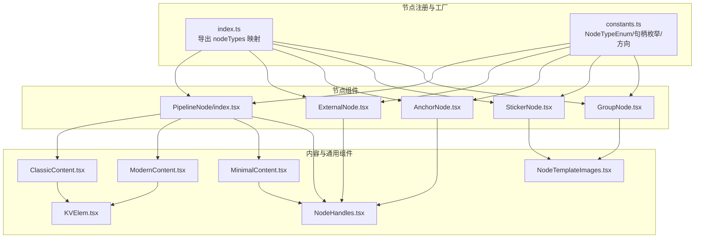
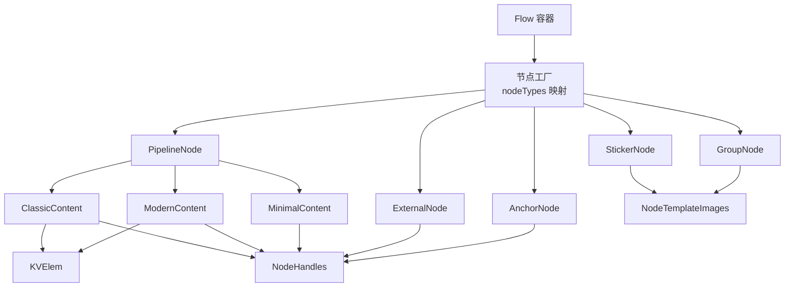
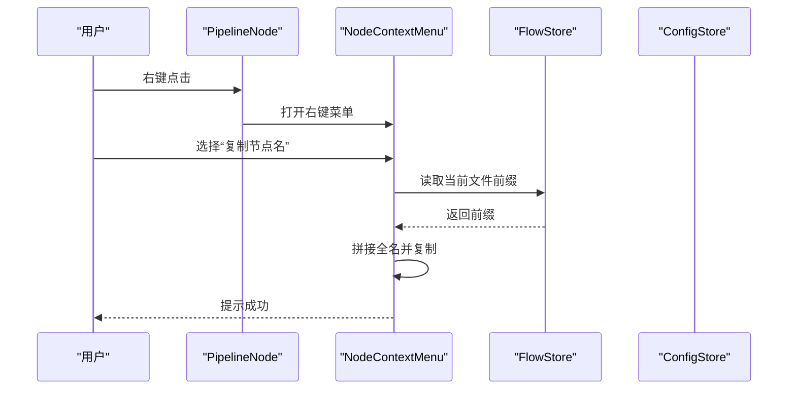
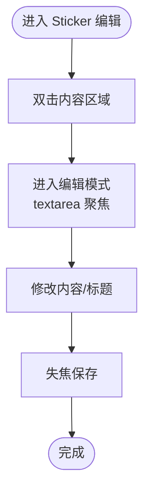
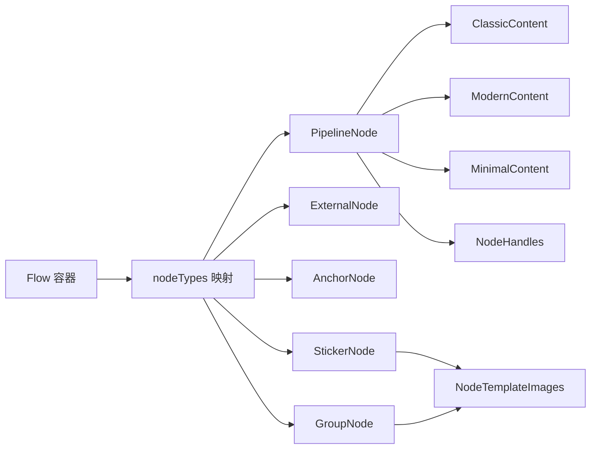

# 节点系统

<cite>
**本文档引用的文件**
- [src/components/flow/nodes/index.ts](file://src/components/flow/nodes/index.ts)
- [src/components/flow/nodes/constants.ts](file://src/components/flow/nodes/constants.ts)
- [src/components/flow/nodes/utils.ts](file://src/components/flow/nodes/utils.ts)
- [src/components/flow/nodes/nodeContextMenu.tsx](file://src/components/flow/nodes/nodeContextMenu.tsx)
- [src/components/flow/nodes/PipelineNode/index.tsx](file://src/components/flow/nodes/PipelineNode/index.tsx)
- [src/components/flow/nodes/PipelineNode/ClassicContent.tsx](file://src/components/flow/nodes/PipelineNode/ClassicContent.tsx)
- [src/components/flow/nodes/PipelineNode/ModernContent.tsx](file://src/components/flow/nodes/PipelineNode/ModernContent.tsx)
- [src/components/flow/nodes/PipelineNode/MinimalContent.tsx](file://src/components/flow/nodes/PipelineNode/MinimalContent.tsx)
- [src/components/flow/nodes/ExternalNode.tsx](file://src/components/flow/nodes/ExternalNode.tsx)
- [src/components/flow/nodes/AnchorNode.tsx](file://src/components/flow/nodes/AnchorNode.tsx)
- [src/components/flow/nodes/StickerNode.tsx](file://src/components/flow/nodes/StickerNode.tsx)
- [src/components/flow/nodes/GroupNode.tsx](file://src/components/flow/nodes/GroupNode.tsx)
- [src/components/flow/nodes/components/NodeHandles.tsx](file://src/components/flow/nodes/components/NodeHandles.tsx)
- [src/components/flow/nodes/components/KVElem.tsx](file://src/components/flow/nodes/components/KVElem.tsx)
- [src/components/flow/nodes/components/NodeTemplateImages.tsx](file://src/components/flow/nodes/components/NodeTemplateImages.tsx)
- [src/components/flow/nodes/utils/nodeOperations.tsx](file://src/components/flow/nodes/utils/nodeOperations.tsx)
</cite>

## 目录
1. [简介](#简介)
2. [项目结构](#项目结构)
3. [核心组件](#核心组件)
4. [架构总览](#架构总览)
5. [详细组件分析](#详细组件分析)
6. [依赖分析](#依赖分析)
7. [性能考虑](#性能考虑)
8. [故障排查指南](#故障排查指南)
9. [结论](#结论)
10. [附录](#附录)

## 简介
本文件系统化梳理 MaaPipelineEditor 的节点系统，涵盖节点类型、数据结构、渲染方式、交互行为与配置选项；解释节点工厂模式与动态组件创建；阐述节点生命周期、状态同步与事件处理机制；提供扩展开发指南与性能优化建议。目标是帮助开发者快速理解并高效扩展节点体系。

## 项目结构
节点系统位于前端 src/components/flow/nodes 目录，按“类型 + 内容 + 组件”的层次组织：
- 类型与常量：统一定义节点类型枚举、句柄类型与方向配置
- 节点组件：PipelineNode、ExternalNode、AnchorNode、StickerNode、GroupNode
- 内容组件：针对 PipelineNode 的 Classic/Modern/Minimal 三种风格
- 通用组件：句柄、键值展示、模板图片预览、右键菜单
- 工具与操作：图标映射、节点操作（复制、保存模板、删除、复制 Reco JSON）

图表来源
- [src/components/flow/nodes/index.ts:1-26](file://src/components/flow/nodes/index.ts#L1-L26)
- [src/components/flow/nodes/constants.ts:1-47](file://src/components/flow/nodes/constants.ts#L1-L47)
- [src/components/flow/nodes/PipelineNode/index.tsx:1-255](file://src/components/flow/nodes/PipelineNode/index.tsx#L1-L255)
- [src/components/flow/nodes/ExternalNode.tsx:1-167](file://src/components/flow/nodes/ExternalNode.tsx#L1-L167)
- [src/components/flow/nodes/AnchorNode.tsx:1-169](file://src/components/flow/nodes/AnchorNode.tsx#L1-L169)
- [src/components/flow/nodes/StickerNode.tsx:1-237](file://src/components/flow/nodes/StickerNode.tsx#L1-L237)
- [src/components/flow/nodes/GroupNode.tsx:1-184](file://src/components/flow/nodes/GroupNode.tsx#L1-L184)
- [src/components/flow/nodes/PipelineNode/ClassicContent.tsx:1-84](file://src/components/flow/nodes/PipelineNode/ClassicContent.tsx#L1-L84)
- [src/components/flow/nodes/PipelineNode/ModernContent.tsx:1-248](file://src/components/flow/nodes/PipelineNode/ModernContent.tsx#L1-L248)
- [src/components/flow/nodes/PipelineNode/MinimalContent.tsx:1-58](file://src/components/flow/nodes/PipelineNode/MinimalContent.tsx#L1-L58)
- [src/components/flow/nodes/components/NodeHandles.tsx:1-254](file://src/components/flow/nodes/components/NodeHandles.tsx#L1-L254)
- [src/components/flow/nodes/components/KVElem.tsx:1-20](file://src/components/flow/nodes/components/KVElem.tsx#L1-L20)
- [src/components/flow/nodes/components/NodeTemplateImages.tsx:1-120](file://src/components/flow/nodes/components/NodeTemplateImages.tsx#L1-L120)

章节来源
- [src/components/flow/nodes/index.ts:1-26](file://src/components/flow/nodes/index.ts#L1-L26)
- [src/components/flow/nodes/constants.ts:1-47](file://src/components/flow/nodes/constants.ts#L1-L47)

## 核心组件
- 节点类型与句柄
  - 节点类型：Pipeline、External、Anchor、Sticker、Group
  - 句柄类型：SourceHandleTypeEnum（next、on_error），TargetHandleTypeEnum（target、jump_back）
  - 句柄方向：left-right、right-left、top-bottom、bottom-top，默认 left-right
- 节点工厂
  - 通过 nodeTypes 映射将 NodeTypeEnum 与对应组件关联，供 Flow 容器按类型动态渲染
- 内容风格
  - PipelineNode 支持 classic、modern、minimal 三种风格，按配置切换
- 通用组件
  - NodeHandles：根据方向自动计算位置与样式，支持垂直/水平布局
  - KVElem：键值对展示，用于参数列表
  - NodeTemplateImages：基于 WebSocket 资源协议请求并缓存图片，按比例缩放展示

章节来源
- [src/components/flow/nodes/constants.ts:1-47](file://src/components/flow/nodes/constants.ts#L1-L47)
- [src/components/flow/nodes/index.ts:1-26](file://src/components/flow/nodes/index.ts#L1-L26)
- [src/components/flow/nodes/PipelineNode/ClassicContent.tsx:1-84](file://src/components/flow/nodes/PipelineNode/ClassicContent.tsx#L1-L84)
- [src/components/flow/nodes/PipelineNode/ModernContent.tsx:1-248](file://src/components/flow/nodes/PipelineNode/ModernContent.tsx#L1-L248)
- [src/components/flow/nodes/PipelineNode/MinimalContent.tsx:1-58](file://src/components/flow/nodes/PipelineNode/MinimalContent.tsx#L1-L58)
- [src/components/flow/nodes/components/NodeHandles.tsx:1-254](file://src/components/flow/nodes/components/NodeHandles.tsx#L1-L254)
- [src/components/flow/nodes/components/KVElem.tsx:1-20](file://src/components/flow/nodes/components/KVElem.tsx#L1-L20)
- [src/components/flow/nodes/components/NodeTemplateImages.tsx:1-120](file://src/components/flow/nodes/components/NodeTemplateImages.tsx#L1-L120)

## 架构总览
节点系统采用“工厂 + 组合 + 通用组件”架构：
- 工厂层：index.ts 暴露 nodeTypes 映射，Flow 容器据此渲染
- 类型层：各节点组件封装自身数据、样式与交互
- 内容层：PipelineNode 的多种风格内容组件复用通用 UI 组件
- 交互层：右键菜单统一管理，结合 Store 进行状态变更与历史记录

图表来源
- [src/components/flow/nodes/index.ts:1-26](file://src/components/flow/nodes/index.ts#L1-L26)
- [src/components/flow/nodes/PipelineNode/index.tsx:1-255](file://src/components/flow/nodes/PipelineNode/index.tsx#L1-L255)
- [src/components/flow/nodes/ExternalNode.tsx:1-167](file://src/components/flow/nodes/ExternalNode.tsx#L1-L167)
- [src/components/flow/nodes/AnchorNode.tsx:1-169](file://src/components/flow/nodes/AnchorNode.tsx#L1-L169)
- [src/components/flow/nodes/StickerNode.tsx:1-237](file://src/components/flow/nodes/StickerNode.tsx#L1-L237)
- [src/components/flow/nodes/GroupNode.tsx:1-184](file://src/components/flow/nodes/GroupNode.tsx#L1-L184)
- [src/components/flow/nodes/PipelineNode/ClassicContent.tsx:1-84](file://src/components/flow/nodes/PipelineNode/ClassicContent.tsx#L1-L84)
- [src/components/flow/nodes/PipelineNode/ModernContent.tsx:1-248](file://src/components/flow/nodes/PipelineNode/ModernContent.tsx#L1-L248)
- [src/components/flow/nodes/PipelineNode/MinimalContent.tsx:1-58](file://src/components/flow/nodes/PipelineNode/MinimalContent.tsx#L1-L58)
- [src/components/flow/nodes/components/NodeHandles.tsx:1-254](file://src/components/flow/nodes/components/NodeHandles.tsx#L1-L254)
- [src/components/flow/nodes/components/KVElem.tsx:1-20](file://src/components/flow/nodes/components/KVElem.tsx#L1-L20)
- [src/components/flow/nodes/components/NodeTemplateImages.tsx:1-120](file://src/components/flow/nodes/components/NodeTemplateImages.tsx#L1-L120)

## 详细组件分析

### Pipeline 节点（主要工作流节点）
- 数据结构要点
  - 包含识别（recognition）、动作（action）、其他（others）、额外（extras）、句柄方向（handleDirection）等字段
  - 支持通过配置开关控制是否显示详细字段与模板图片
- 渲染方式
  - 根据配置选择 Classic/Modern/Minimal 三种内容组件
  - Modern 风格支持识别/动作/其他三段式展示，自动映射图标与颜色
  - Minimal 风格以图标+标签+极简边框呈现，颜色随识别类型变化
- 交互行为
  - 支持右键菜单：复制节点名、复制 Reco JSON、保存为模板、设置端点位置、调试相关操作
  - 调试态下根据执行历史高亮“已执行/执行中/识别中/失败”
- 性能与优化
  - 使用 memo 与浅比较避免不必要重渲染
  - 通过 useShallow 仅订阅相关状态，减少无关更新
  - 模板图片请求带防抖与缓存，避免频繁网络请求

图表来源
- [src/components/flow/nodes/PipelineNode/index.tsx:1-255](file://src/components/flow/nodes/PipelineNode/index.tsx#L1-L255)
- [src/components/flow/nodes/nodeContextMenu.tsx:1-586](file://src/components/flow/nodes/nodeContextMenu.tsx#L1-L586)
- [src/components/flow/nodes/utils/nodeOperations.tsx:1-184](file://src/components/flow/nodes/utils/nodeOperations.tsx#L1-L184)

章节来源
- [src/components/flow/nodes/PipelineNode/index.tsx:1-255](file://src/components/flow/nodes/PipelineNode/index.tsx#L1-L255)
- [src/components/flow/nodes/PipelineNode/ClassicContent.tsx:1-84](file://src/components/flow/nodes/PipelineNode/ClassicContent.tsx#L1-L84)
- [src/components/flow/nodes/PipelineNode/ModernContent.tsx:1-248](file://src/components/flow/nodes/PipelineNode/ModernContent.tsx#L1-L248)
- [src/components/flow/nodes/PipelineNode/MinimalContent.tsx:1-58](file://src/components/flow/nodes/PipelineNode/MinimalContent.tsx#L1-L58)
- [src/components/flow/nodes/utils.ts:1-139](file://src/components/flow/nodes/utils.ts#L1-L139)

### External 节点（外部引用节点）
- 数据结构要点
  - 包含标签与句柄方向
- 渲染方式
  - 简洁标题 + 自定义句柄布局（target/jump_back）
- 交互行为
  - 支持右键菜单：复制节点名、删除
  - 支持拖拽调整位置与连接

章节来源
- [src/components/flow/nodes/ExternalNode.tsx:1-167](file://src/components/flow/nodes/ExternalNode.tsx#L1-L167)
- [src/components/flow/nodes/components/NodeHandles.tsx:135-190](file://src/components/flow/nodes/components/NodeHandles.tsx#L135-L190)

### Anchor 节点（锚点定位节点）
- 数据结构要点
  - 包含标签与句柄方向
- 渲染方式
  - 简洁标题 + 自定义句柄布局（target/jump_back）
- 交互行为
  - 支持右键菜单：复制节点名、删除

章节来源
- [src/components/flow/nodes/AnchorNode.tsx:1-169](file://src/components/flow/nodes/AnchorNode.tsx#L1-L169)
- [src/components/flow/nodes/components/NodeHandles.tsx:194-254](file://src/components/flow/nodes/components/NodeHandles.tsx#L194-L254)

### Sticker 节点（贴纸标记节点）
- 数据结构要点
  - 包含标签、内容、颜色主题（yellow/green/blue/pink/purple）
- 渲染方式
  - 可调整大小的便签卡片，支持双击编辑内容
  - 不受“聚焦透明度”影响，始终可见
- 交互行为
  - 支持右键菜单：复制便签内容、设置颜色、删除
  - 标题可直接编辑

图表来源
- [src/components/flow/nodes/StickerNode.tsx:1-237](file://src/components/flow/nodes/StickerNode.tsx#L1-L237)

章节来源
- [src/components/flow/nodes/StickerNode.tsx:1-237](file://src/components/flow/nodes/StickerNode.tsx#L1-L237)

### Group 节点（分组容器节点）
- 数据结构要点
  - 包含标签、颜色主题（blue/green/purple/orange/gray）
- 渲染方式
  - 可调整大小的分组容器，支持编辑标题
  - 不受“聚焦透明度”影响，始终可见
- 交互行为
  - 支持右键菜单：设置分组颜色、解散分组、删除分组

章节来源
- [src/components/flow/nodes/GroupNode.tsx:1-184](file://src/components/flow/nodes/GroupNode.tsx#L1-L184)

### 句柄系统（HandleDirection 与 NodeHandles）
- 句柄方向
  - left-right：左入右出（默认）
  - right-left：右入左出
  - top-bottom：上入下出
  - bottom-top：下入上出
- 句柄组件
  - PipelineNodeHandles：提供 target、jump_back、next、on_error 四类句柄
  - ExternalNodeHandles/AnchorNodeHandles：提供 target、jump_back 两类句柄
  - 根据方向自动计算位置与样式，支持垂直/水平布局

章节来源
- [src/components/flow/nodes/constants.ts:22-47](file://src/components/flow/nodes/constants.ts#L22-L47)
- [src/components/flow/nodes/components/NodeHandles.tsx:1-254](file://src/components/flow/nodes/components/NodeHandles.tsx#L1-L254)

### 右键菜单与节点操作
- 菜单能力
  - 通用：复制节点名、复制便签内容（Sticker）、复制 Reco JSON（Pipeline）、保存为模板（Pipeline）、设置端点位置、删除
  - 调试模式：从此节点开始调试、设为调试开始节点、测试此节点/识别/动作
  - 分组：设置分组颜色、解散分组、删除分组
- 操作实现
  - 复制节点名：拼接文件前缀后复制
  - 保存模板：弹窗输入模板名，校验并写入模板库
  - 删除节点：调用 FlowStore 更新节点集合
  - 复制 Reco JSON：解析节点为导出格式，提取 recognition 并复制 JSON

章节来源
- [src/components/flow/nodes/nodeContextMenu.tsx:1-586](file://src/components/flow/nodes/nodeContextMenu.tsx#L1-L586)
- [src/components/flow/nodes/utils/nodeOperations.tsx:1-184](file://src/components/flow/nodes/utils/nodeOperations.tsx#L1-L184)

## 依赖分析
- 节点工厂与 Flow 容器
  - Flow 容器通过 nodeTypes 映射按类型渲染对应节点组件
- 节点内部依赖
  - PipelineNode 依赖内容组件与句柄组件，同时消费 ConfigStore 与 FlowStore 的状态
  - Sticker/Group 节点依赖 Resizer 与右键菜单组件
- 通用依赖
  - NodeHandles 依赖句柄方向配置
  - NodeTemplateImages 依赖 WebSocket 资源协议与本地缓存

图表来源
- [src/components/flow/nodes/index.ts:1-26](file://src/components/flow/nodes/index.ts#L1-L26)
- [src/components/flow/nodes/PipelineNode/index.tsx:1-255](file://src/components/flow/nodes/PipelineNode/index.tsx#L1-L255)
- [src/components/flow/nodes/StickerNode.tsx:1-237](file://src/components/flow/nodes/StickerNode.tsx#L1-L237)
- [src/components/flow/nodes/GroupNode.tsx:1-184](file://src/components/flow/nodes/GroupNode.tsx#L1-L184)
- [src/components/flow/nodes/components/NodeHandles.tsx:1-254](file://src/components/flow/nodes/components/NodeHandles.tsx#L1-L254)
- [src/components/flow/nodes/components/NodeTemplateImages.tsx:1-120](file://src/components/flow/nodes/components/NodeTemplateImages.tsx#L1-L120)

## 性能考虑
- 渲染优化
  - 使用 memo 与浅比较（如 PipelineNodeMemo/ExternalNodeMemo/AnchorNodeMemo/StickerNodeMemo/GroupNodeMemo）降低重渲染
  - 使用 useShallow 仅订阅必要状态，避免全局状态变更导致的重渲染
- 图片与资源
  - NodeTemplateImages 对图片请求进行防抖与缓存，限制最大高度与宽度，避免大图影响布局
- 交互响应
  - 句柄方向变更通过 updateNodeInternals 强制刷新，确保视觉与逻辑一致
- 建议
  - 大量节点场景下，优先使用 Minimal 风格以降低 DOM 体积
  - 控制“显示详细字段”与“模板图片”开关，避免不必要的渲染与请求

[本节为通用性能建议，无需特定文件引用]

## 故障排查指南
- 句柄方向不生效
  - 检查 handleDirection 是否正确传入，确认 NodeHandles 已触发 updateNodeInternals
- 模板图片不显示
  - 确认 WebSocket 连接正常、资源路径有效、缓存中有数据
- 右键菜单不可用
  - 检查节点类型是否在 nodeTypes 映射中，确认 NodeContextMenu 组件已包裹节点根元素
- 复制模板失败
  - 检查模板名合法性与唯一性，查看模板库写入结果

章节来源
- [src/components/flow/nodes/components/NodeHandles.tsx:47-59](file://src/components/flow/nodes/components/NodeHandles.tsx#L47-L59)
- [src/components/flow/nodes/components/NodeTemplateImages.tsx:37-61](file://src/components/flow/nodes/components/NodeTemplateImages.tsx#L37-L61)
- [src/components/flow/nodes/nodeContextMenu.tsx:369-585](file://src/components/flow/nodes/nodeContextMenu.tsx#L369-L585)
- [src/components/flow/nodes/utils/nodeOperations.tsx:146-183](file://src/components/flow/nodes/utils/nodeOperations.tsx#L146-L183)

## 结论
节点系统通过清晰的类型划分、灵活的内容风格与强大的通用组件，实现了高可扩展与易维护的可视化工作流编辑体验。借助工厂模式与右键菜单统一入口，开发者可以便捷地扩展新节点类型并集成到现有生态中。

[本节为总结，无需特定文件引用]

## 附录

### 节点类型与数据结构概览
- PipelineNode
  - 字段：label、recognition、action、others、extras、handleDirection
  - 风格：classic/modern/minimal
- ExternalNode
  - 字段：label、handleDirection
- AnchorNode
  - 字段：label、handleDirection
- StickerNode
  - 字段：label、content、color
- GroupNode
  - 字段：label、color

章节来源
- [src/components/flow/nodes/PipelineNode/ClassicContent.tsx:18-48](file://src/components/flow/nodes/PipelineNode/ClassicContent.tsx#L18-L48)
- [src/components/flow/nodes/PipelineNode/ModernContent.tsx:66-94](file://src/components/flow/nodes/PipelineNode/ModernContent.tsx#L66-L94)
- [src/components/flow/nodes/StickerNode.tsx:13-48](file://src/components/flow/nodes/StickerNode.tsx#L13-L48)
- [src/components/flow/nodes/GroupNode.tsx:12-47](file://src/components/flow/nodes/GroupNode.tsx#L12-L47)

### 扩展开发指南（新增节点类型）
- 步骤
  1) 定义数据结构与默认值（参考现有节点）
  2) 实现节点组件与内容组件（可复用 NodeHandles/KVElem）
  3) 在 constants.ts 中注册 NodeTypeEnum
  4) 在 index.ts 中加入 nodeTypes 映射
  5) 如需右键菜单能力，完善 nodeContextMenu.tsx 的菜单配置
  6) 如需模板/图片等能力，复用 NodeTemplateImages 与模板存储
- 注意事项
  - 使用 memo 与浅比较优化渲染
  - 严格区分“句柄方向”与“节点方向”，确保视觉与逻辑一致
  - 保持与 FlowStore 的交互最小化，避免过度订阅

章节来源
- [src/components/flow/nodes/constants.ts:13-20](file://src/components/flow/nodes/constants.ts#L13-L20)
- [src/components/flow/nodes/index.ts:8-14](file://src/components/flow/nodes/index.ts#L8-L14)
- [src/components/flow/nodes/nodeContextMenu.tsx:369-585](file://src/components/flow/nodes/nodeContextMenu.tsx#L369-L585)
- [src/components/flow/nodes/components/NodeHandles.tsx:1-254](file://src/components/flow/nodes/components/NodeHandles.tsx#L1-L254)
- [src/components/flow/nodes/components/NodeTemplateImages.tsx:1-120](file://src/components/flow/nodes/components/NodeTemplateImages.tsx#L1-L120)