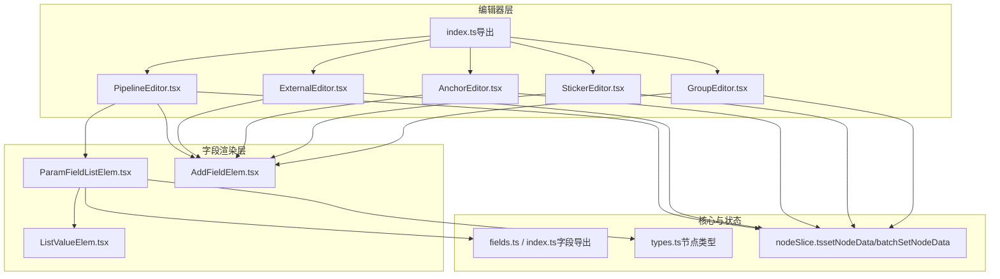
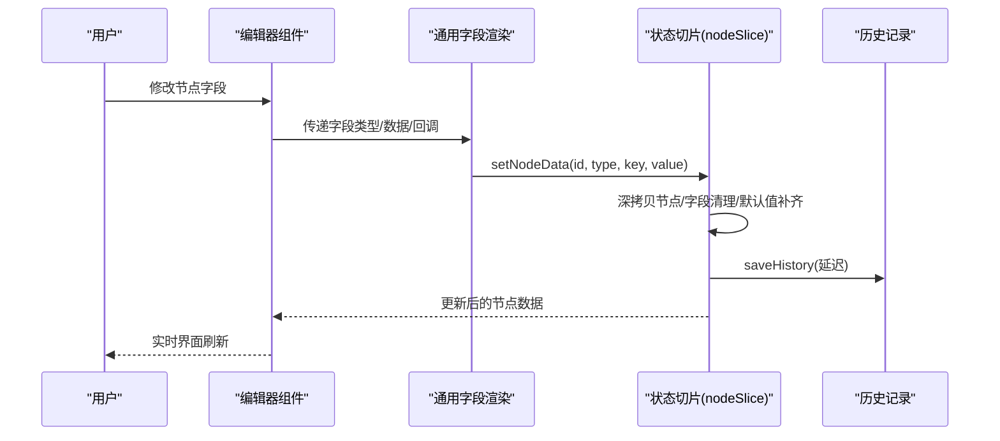
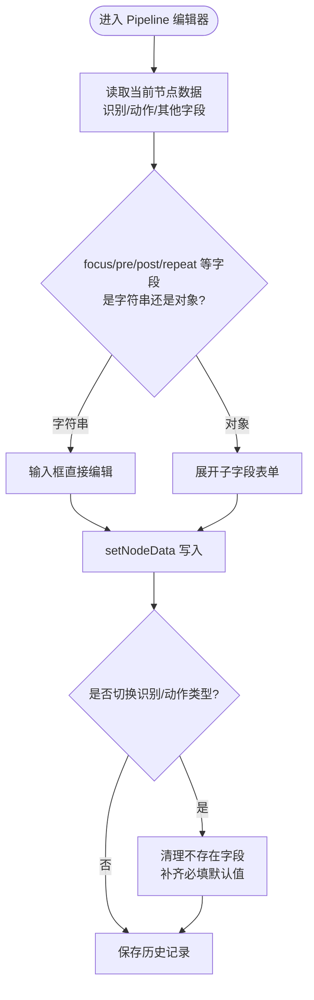
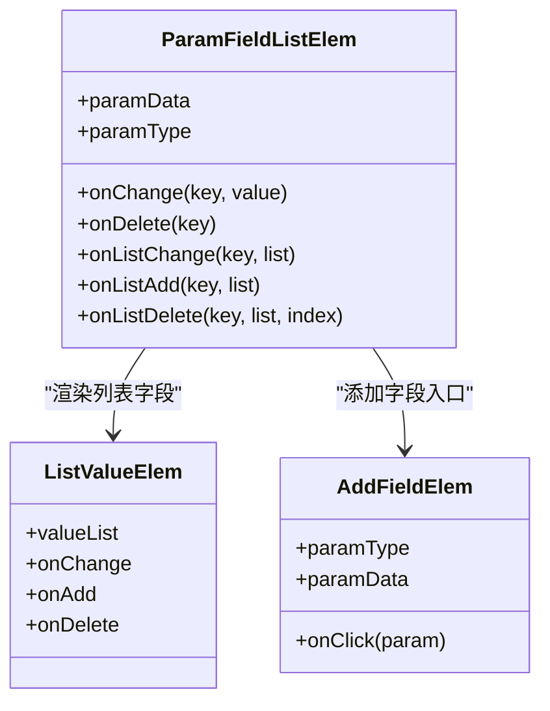
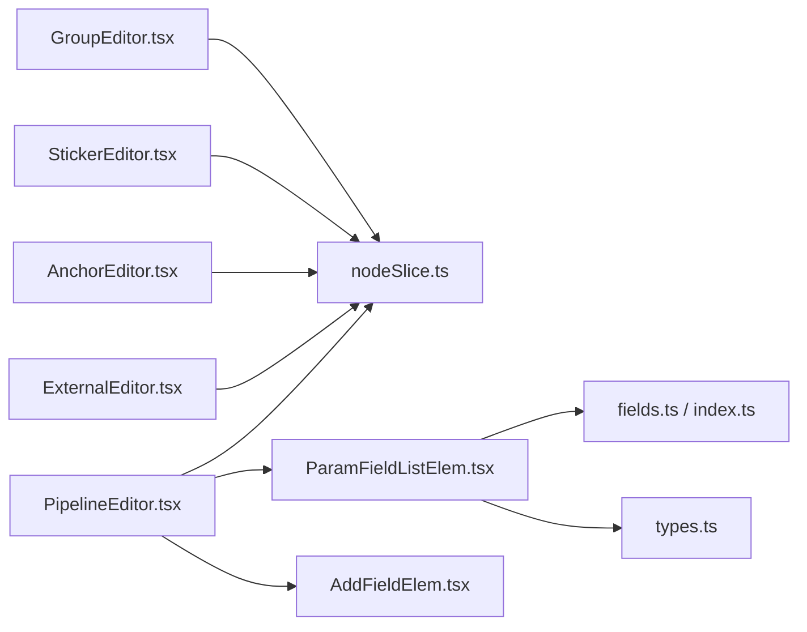

# 节点编辑器

<cite>
**本文引用的文件**
- [PipelineEditor.tsx](file://src/components/panels/node-editors/PipelineEditor.tsx)
- [ExternalEditor.tsx](file://src/components/panels/node-editors/ExternalEditor.tsx)
- [AnchorEditor.tsx](file://src/components/panels/node-editors/AnchorEditor.tsx)
- [StickerEditor.tsx](file://src/components/panels/node-editors/StickerEditor.tsx)
- [GroupEditor.tsx](file://src/components/panels/node-editors/GroupEditor.tsx)
- [index.ts](file://src/components/panels/node-editors/index.ts)
- [ParamFieldListElem.tsx](file://src/components/panels/field/items/ParamFieldListElem.tsx)
- [AddFieldElem.tsx](file://src/components/panels/field/items/AddFieldElem.tsx)
- [ListValueElem.tsx](file://src/components/panels/field/items/ListValueElem.tsx)
- [fields.ts](file://src/core/fields.ts)
- [index.ts（字段导出）](file://src/core/fields/index.ts)
- [types.ts（节点类型）](file://src/stores/flow/types.ts)
- [nodeSlice.ts](file://src/stores/flow/slices/nodeSlice.ts)
</cite>

## 目录
1. [简介](#简介)
2. [项目结构](#项目结构)
3. [核心组件](#核心组件)
4. [架构总览](#架构总览)
5. [详细组件分析](#详细组件分析)
6. [依赖关系分析](#依赖关系分析)
7. [性能考量](#性能考量)
8. [故障排查指南](#故障排查指南)
9. [结论](#结论)
10. [附录](#附录)

## 简介
本文件系统性梳理 MaaPipelineEditor 的“节点编辑器”体系，覆盖 Pipeline 编辑器、External 编辑器、Anchor 编辑器、Sticker 编辑器、Group 编辑器等。重点解释界面布局与控件组织、数据绑定机制（双向同步）、字段校验与逻辑检查、属性配置（必填/默认值/可选）、扩展开发指南以及用户体验与无障碍支持策略。

## 项目结构
节点编辑器位于前端组件层，通过统一的编辑器入口按节点类型动态加载对应编辑器；字段渲染与交互由通用字段面板组件负责；底层数据通过全局状态管理（Zustand）与节点切片（nodeSlice）进行持久化与一致性维护。

图表来源
- [index.ts:1-6](file://src/components/panels/node-editors/index.ts#L1-L6)
- [PipelineEditor.tsx:1-949](file://src/components/panels/node-editors/PipelineEditor.tsx#L1-L949)
- [ParamFieldListElem.tsx:1-775](file://src/components/panels/field/items/ParamFieldListElem.tsx#L1-L775)
- [AddFieldElem.tsx:1-62](file://src/components/panels/field/items/AddFieldElem.tsx#L1-L62)
- [ListValueElem.tsx:1-149](file://src/components/panels/field/items/ListValueElem.tsx#L1-L149)
- [fields.ts:1-2](file://src/core/fields.ts#L1-L2)
- [index.ts（字段导出）:1-45](file://src/core/fields/index.ts#L1-L45)
- [types.ts（节点类型）:1-362](file://src/stores/flow/types.ts#L1-L362)
- [nodeSlice.ts:290-516](file://src/stores/flow/slices/nodeSlice.ts#L290-L516)

章节来源
- [index.ts:1-6](file://src/components/panels/node-editors/index.ts#L1-L6)

## 核心组件
- Pipeline 编辑器：负责识别算法、动作类型及其参数的配置，支持“字符串 focus”与“结构化 focus”的双向切换，支持“前置/后置/重复等待冻结”等复杂字段的整数与对象模式切换。
- External 编辑器：提供跨文件节点名的自动补全输入，用于外部引用节点。
- Anchor 编辑器：提供重定向节点名输入，并在编译时自动添加特定前缀。
- Sticker 编辑器：提供便签标题、颜色主题与正文内容编辑。
- Group 编辑器：提供分组名称与颜色主题编辑。

章节来源
- [PipelineEditor.tsx:1-949](file://src/components/panels/node-editors/PipelineEditor.tsx#L1-L949)
- [ExternalEditor.tsx:1-106](file://src/components/panels/node-editors/ExternalEditor.tsx#L1-L106)
- [AnchorEditor.tsx:1-106](file://src/components/panels/node-editors/AnchorEditor.tsx#L1-L106)
- [StickerEditor.tsx:1-132](file://src/components/panels/node-editors/StickerEditor.tsx#L1-L132)
- [GroupEditor.tsx:1-97](file://src/components/panels/node-editors/GroupEditor.tsx#L1-L97)

## 架构总览
编辑器采用“编辑器组件 + 通用字段渲染 + 状态切片”的分层架构：
- 编辑器组件：根据节点类型渲染专属表单，绑定 UI 事件到全局状态。
- 通用字段渲染：ParamFieldListElem 统一处理字段类型、快捷工具、列表增删改、JSON 解析与提交。
- 状态切片：nodeSlice 提供 setNodeData/batchSetNodeData，负责深拷贝、字段清理与默认值注入、必填字段补齐、错误状态更新与历史记录保存。

图表来源
- [PipelineEditor.tsx:24-99](file://src/components/panels/node-editors/PipelineEditor.tsx#L24-L99)
- [ParamFieldListElem.tsx:72-775](file://src/components/panels/field/items/ParamFieldListElem.tsx#L72-L775)
- [nodeSlice.ts:290-394](file://src/stores/flow/slices/nodeSlice.ts#L290-L394)

## 详细组件分析

### Pipeline 编辑器
- 界面设计
  - 表单分为“节点名”、“识别算法”、“识别字段”、“动作类型”、“动作字段”、“其他字段”、“前置等待冻结”、“后置等待冻结”、“重复等待冻结”等区块。
  - 使用 Popover 展示字段说明；使用 AddFieldElem 提供“添加字段”入口；使用 ParamFieldListElem 渲染字段值与快捷工具。
- 数据绑定
  - 通过 useFlowStore 的 setNodeData 将 UI 输入写入节点数据树（recognition/action/others），并自动处理字段清理与默认值补齐。
  - 特殊字段如 focus、pre/post/repeat_wait_freezes 支持“字符串/对象”两种模式的双向切换，切换时弹窗确认以避免数据丢失。
- 字段校验与逻辑
  - 当类型切换时，依据字段 schema 清理不存在的字段并补齐必填默认值。
  - 通过错误存储检测节点名重复并提示。
- 用户体验
  - 支持快捷工具（ROI、OCR、模板、颜色、偏移、位移）一键采集与回填。
  - 列表字段支持增删与本地编辑（失焦提交）。

图表来源
- [PipelineEditor.tsx:102-306](file://src/components/panels/node-editors/PipelineEditor.tsx#L102-L306)
- [nodeSlice.ts:333-353](file://src/stores/flow/slices/nodeSlice.ts#L333-L353)

章节来源
- [PipelineEditor.tsx:1-949](file://src/components/panels/node-editors/PipelineEditor.tsx#L1-L949)
- [nodeSlice.ts:290-394](file://src/stores/flow/slices/nodeSlice.ts#L290-L394)

### External 编辑器
- 界面设计
  - 单一输入框，使用 AutoComplete 提供跨文件节点名建议，支持搜索过滤与自定义渲染。
- 数据绑定
  - 通过 setNodeData 更新节点 label，同时清空搜索状态。
- 用户体验
  - 下拉选项展示节点名与文件路径，便于快速定位。

章节来源
- [ExternalEditor.tsx:1-106](file://src/components/panels/node-editors/ExternalEditor.tsx#L1-L106)

### Anchor 编辑器
- 界面设计
  - 与 External 编辑器类似，使用 AutoComplete 提供节点名建议。
- 数据绑定
  - 通过 setNodeData 更新节点 label。
- 用户体验
  - 提示编译时会添加特定前缀，帮助用户理解行为。

章节来源
- [AnchorEditor.tsx:1-106](file://src/components/panels/node-editors/AnchorEditor.tsx#L1-L106)

### Sticker 编辑器
- 界面设计
  - 标题、颜色主题、正文三段式布局；颜色主题固定枚举；正文使用多行文本框。
- 数据绑定
  - 通过 setNodeData 更新 direct/sticker 路径下的字段；颜色变更后调用 saveHistory 保存历史。
- 用户体验
  - 支持清空输入，颜色变更即时生效并保存历史。

章节来源
- [StickerEditor.tsx:1-132](file://src/components/panels/node-editors/StickerEditor.tsx#L1-L132)

### Group 编辑器
- 界面设计
  - 名称与颜色主题两段式布局；颜色主题固定枚举。
- 数据绑定
  - 通过 setNodeData 更新 direct 路径下的字段；颜色变更后保存历史。
- 用户体验
  - 简洁直观，适合快速分组命名与着色。

章节来源
- [GroupEditor.tsx:1-97](file://src/components/panels/node-editors/GroupEditor.tsx#L1-L97)

### 通用字段渲染与交互（ParamFieldListElem）
- 字段类型适配
  - 支持字符串、数字、布尔、列表（字符串/整数/浮点/XYWH/对象等）、图片路径、Any 等多种类型；根据 FieldTypeEnum 渲染不同输入控件。
- 快捷工具
  - 针对 roi/roi_offset/ocr/template/color/delta 等字段提供一键采集工具，需设备连接成功才可用。
- 列表字段
  - ListValueElem 支持增删与本地编辑（失焦提交），并提供快捷工具图标组合。
- JSON 解析
  - Any 类型字段支持 JSON 文本输入，失焦时尝试解析为对象/数组，失败则回退为字符串。

图表来源
- [ParamFieldListElem.tsx:72-775](file://src/components/panels/field/items/ParamFieldListElem.tsx#L72-L775)
- [ListValueElem.tsx:60-149](file://src/components/panels/field/items/ListValueElem.tsx#L60-L149)
- [AddFieldElem.tsx:12-62](file://src/components/panels/field/items/AddFieldElem.tsx#L12-L62)

章节来源
- [ParamFieldListElem.tsx:1-775](file://src/components/panels/field/items/ParamFieldListElem.tsx#L1-L775)
- [ListValueElem.tsx:1-149](file://src/components/panels/field/items/ListValueElem.tsx#L1-L149)
- [AddFieldElem.tsx:1-62](file://src/components/panels/field/items/AddFieldElem.tsx#L1-L62)

## 依赖关系分析
- 编辑器组件依赖
  - 编辑器组件依赖全局状态切片（useFlowStore）中的 setNodeData/batchSetNodeData 进行数据写入。
  - Pipeline 编辑器额外依赖字段 schema（recoFields/actionFields/otherFieldSchema）与通用字段渲染组件。
- 字段定义
  - 字段类型与默认值来源于 core/fields 导出的 schema 与工厂方法，ParamFieldListElem 依据这些定义渲染 UI 并执行类型转换。
- 类型约束
  - 节点数据结构在 flow/types.ts 中定义，确保编辑器与状态切片之间的类型一致。

图表来源
- [PipelineEditor.tsx:1-949](file://src/components/panels/node-editors/PipelineEditor.tsx#L1-L949)
- [ExternalEditor.tsx:1-106](file://src/components/panels/node-editors/ExternalEditor.tsx#L1-L106)
- [AnchorEditor.tsx:1-106](file://src/components/panels/node-editors/AnchorEditor.tsx#L1-L106)
- [StickerEditor.tsx:1-132](file://src/components/panels/node-editors/StickerEditor.tsx#L1-L132)
- [GroupEditor.tsx:1-97](file://src/components/panels/node-editors/GroupEditor.tsx#L1-L97)
- [ParamFieldListElem.tsx:1-775](file://src/components/panels/field/items/ParamFieldListElem.tsx#L1-L775)
- [AddFieldElem.tsx:1-62](file://src/components/panels/field/items/AddFieldElem.tsx#L1-L62)
- [fields.ts:1-2](file://src/core/fields.ts#L1-L2)
- [index.ts（字段导出）:1-45](file://src/core/fields/index.ts#L1-L45)
- [types.ts（节点类型）:1-362](file://src/stores/flow/types.ts#L1-L362)
- [nodeSlice.ts:290-516](file://src/stores/flow/slices/nodeSlice.ts#L290-L516)

章节来源
- [types.ts（节点类型）:107-235](file://src/stores/flow/types.ts#L107-L235)
- [nodeSlice.ts:290-516](file://src/stores/flow/slices/nodeSlice.ts#L290-L516)

## 性能考量
- 渲染优化
  - 编辑器组件广泛使用 memo 与 useMemo，减少不必要的重渲染。
  - ParamFieldListElem 对列表字段采用本地编辑（失焦提交）降低频繁更新带来的抖动。
- 状态更新
  - setNodeData/batchSetNodeData 采用深拷贝与局部更新策略，避免全量重绘。
  - 保存历史记录时按场景设置延迟，避免高频操作导致历史栈膨胀。
- 设备工具
  - 快捷工具仅在设备连接状态下启用，避免无效请求与 UI 卡顿。

章节来源
- [PipelineEditor.tsx:22-24](file://src/components/panels/node-editors/PipelineEditor.tsx#L22-L24)
- [ParamFieldListElem.tsx:115-196](file://src/components/panels/field/items/ParamFieldListElem.tsx#L115-L196)
- [nodeSlice.ts:290-394](file://src/stores/flow/slices/nodeSlice.ts#L290-L394)

## 故障排查指南
- 字段类型不匹配
  - 现象：修改字段后未生效或报错。
  - 排查：确认字段类型与 FieldTypeEnum 是否一致；Any 类型字段需保证 JSON 可解析。
  - 参考：[ParamFieldListElem.tsx:584-608](file://src/components/panels/field/items/ParamFieldListElem.tsx#L584-L608)
- 必填字段缺失
  - 现象：切换识别/动作类型后某些字段消失或报错。
  - 排查：类型切换时会自动补齐必填默认值；若仍异常，检查字段 schema 与默认值映射。
  - 参考：[nodeSlice.ts:333-353](file://src/stores/flow/slices/nodeSlice.ts#L333-L353)
- 节点名重复
  - 现象：编辑器右侧面板出现重复节点名错误提示。
  - 排查：检查 isExportConfig 与 prefix 配置，确保节点名唯一。
  - 参考：[nodeSlice.ts:377-390](file://src/stores/flow/slices/nodeSlice.ts#L377-L390)
- 快捷工具不可用
  - 现象：点击快捷工具无反应。
  - 排查：确认设备连接状态；仅在连接成功时允许打开 ROI/OCR/模板/颜色/偏移/位移等工具。
  - 参考：[ParamFieldListElem.tsx:115-196](file://src/components/panels/field/items/ParamFieldListElem.tsx#L115-L196)

章节来源
- [ParamFieldListElem.tsx:115-196](file://src/components/panels/field/items/ParamFieldListElem.tsx#L115-L196)
- [nodeSlice.ts:377-390](file://src/stores/flow/slices/nodeSlice.ts#L377-L390)

## 结论
节点编辑器通过“编辑器组件 + 通用字段渲染 + 状态切片”的清晰分层，实现了高度一致且可扩展的节点配置体验。其数据绑定机制确保 UI 与节点配置的双向同步，字段校验与逻辑检查保障了配置的正确性，而丰富的快捷工具与列表交互提升了编辑效率。对于新增节点类型，只需在字段 schema 中补充定义并按现有模式编写编辑器组件即可快速接入。

## 附录

### 数据绑定机制（setNodeData）
- 深拷贝与局部更新：避免直接修改原对象导致的副作用。
- 字段清理与默认值：类型切换时清理不存在字段并补齐必填默认值。
- 错误状态与历史记录：重复节点名检测与历史保存。

章节来源
- [nodeSlice.ts:290-516](file://src/stores/flow/slices/nodeSlice.ts#L290-L516)

### 字段校验与逻辑检查
- 类型切换：依据字段 schema 清理/补齐字段。
- 快捷工具：设备连接状态检查与工具弹窗确认。
- 列表字段：本地编辑（失焦提交）与 JSON 解析容错。

章节来源
- [ParamFieldListElem.tsx:115-196](file://src/components/panels/field/items/ParamFieldListElem.tsx#L115-L196)
- [nodeSlice.ts:333-353](file://src/stores/flow/slices/nodeSlice.ts#L333-L353)

### 属性配置（必填/默认值/可选）
- 必填字段：在类型切换时自动补齐。
- 默认值：来自字段 schema 的 required_default 映射。
- 可选字段：通过 AddFieldElem 动态添加。

章节来源
- [nodeSlice.ts:333-353](file://src/stores/flow/slices/nodeSlice.ts#L333-L353)
- [AddFieldElem.tsx:12-62](file://src/components/panels/field/items/AddFieldElem.tsx#L12-L62)

### 扩展开发指南（新增节点类型）
- 步骤
  - 在 core/fields/schema 中定义字段类型与默认值。
  - 在 stores/flow/types.ts 中新增节点数据类型与接口。
  - 在 node-editors 目录新增编辑器组件，遵循现有模式（输入绑定、字段渲染、错误提示）。
  - 在 node-editors/index.ts 中导出新编辑器。
  - 在 nodeSlice 中完善 setNodeData/batchSetNodeData 的分支逻辑（如需）。
- 示例参考
  - Pipeline 编辑器：[PipelineEditor.tsx:1-949](file://src/components/panels/node-editors/PipelineEditor.tsx#L1-L949)
  - 通用字段渲染：[ParamFieldListElem.tsx:1-775](file://src/components/panels/field/items/ParamFieldListElem.tsx#L1-L775)

章节来源
- [index.ts（字段导出）:1-45](file://src/core/fields/index.ts#L1-L45)
- [types.ts（节点类型）:107-235](file://src/stores/flow/types.ts#L107-L235)
- [index.ts:1-6](file://src/components/panels/node-editors/index.ts#L1-L6)

### 用户体验与无障碍支持
- 交互反馈
  - Popover 字段说明、快捷工具图标、删除/添加图标均提供明确视觉反馈。
- 可访问性
  - 使用标准输入控件与语义化标签，确保键盘导航与屏幕阅读器友好。
  - 提供禁用状态提示（如设备未连接时禁用快捷工具）。

章节来源
- [ParamFieldListElem.tsx:398-417](file://src/components/panels/field/items/ParamFieldListElem.tsx#L398-L417)
- [PipelineEditor.tsx:310-328](file://src/components/panels/node-editors/PipelineEditor.tsx#L310-L328)