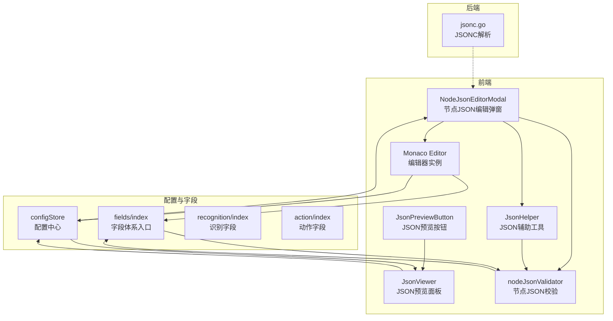
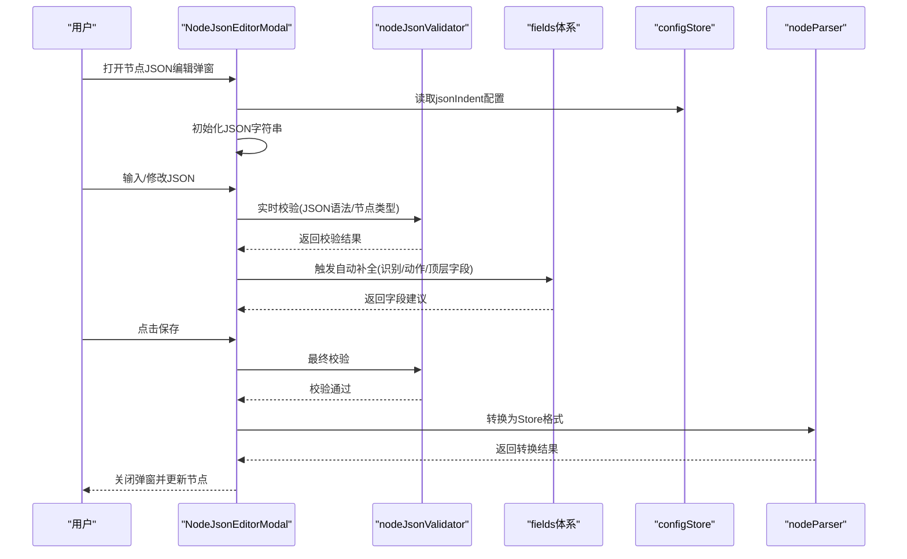
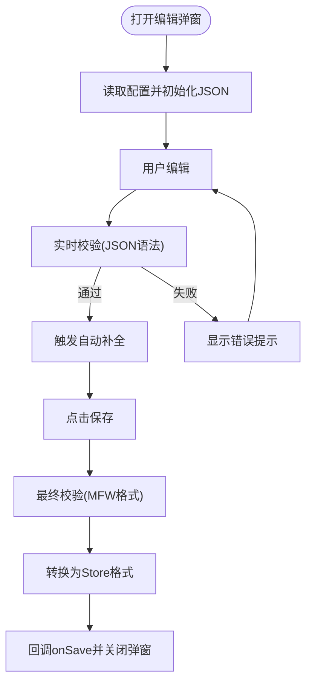
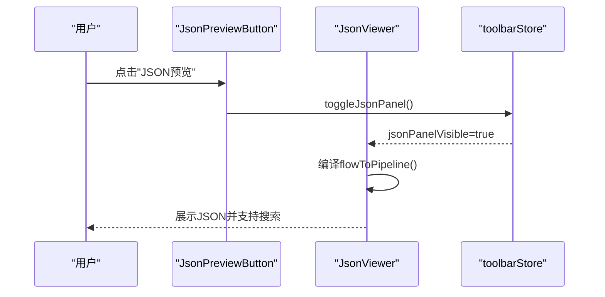
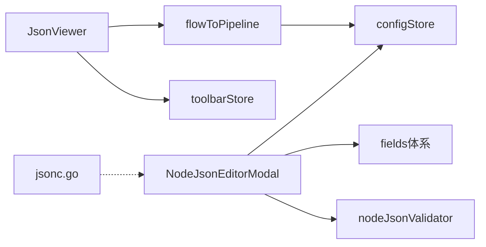

# JSON编辑能力

<cite>
**本文档引用的文件**
- [src/utils/jsonHelper.ts](file://src/utils/jsonHelper.ts)
- [src/utils/nodeJsonValidator.ts](file://src/utils/nodeJsonValidator.ts)
- [src/components/modals/NodeJsonEditorModal.tsx](file://src/components/modals/NodeJsonEditorModal.tsx)
- [src/components/JsonViewer.tsx](file://src/components/JsonViewer.tsx)
- [src/stores/configStore.ts](file://src/stores/configStore.ts)
- [src/core/fields/index.ts](file://src/core/fields/index.ts)
- [src/core/fields/recognition/index.ts](file://src/core/fields/recognition/index.ts)
- [src/core/fields/action/index.ts](file://src/core/fields/action/index.ts)
- [src/components/panels/toolbar/JsonPreviewButton.tsx](file://src/components/panels/toolbar/JsonPreviewButton.tsx)
- [src/styles/FloatingJsonPanel.module.less](file://src/styles/FloatingJsonPanel.module.less)
- [LocalBridge/internal/utils/jsonc.go](file://LocalBridge/internal/utils/jsonc.go)
- [src/core/parser/nodeParser.ts](file://src/core/parser/nodeParser.ts)
- [LocalBridge/test-json/base/pipeline/dbg测试.json](file://LocalBridge/test-json/base/pipeline/dbg测试.json)
- [LocalBridge/test-json/base/default_pipeline.json](file://LocalBridge/test-json/base/default_pipeline.json)
</cite>

## 目录
1. [简介](#简介)
2. [项目结构](#项目结构)
3. [核心组件](#核心组件)
4. [架构总览](#架构总览)
5. [详细组件分析](#详细组件分析)
6. [依赖关系分析](#依赖关系分析)
7. [性能考虑](#性能考虑)
8. [故障排除指南](#故障排除指南)
9. [结论](#结论)

## 简介
本文件系统性阐述 MaaPipelineEditor 中的 JSON 编辑能力，涵盖实时 JSON 编辑器、智能自动补全、语法校验、格式化、以及 JSON 预览面板等核心功能。通过对前端 Monaco 编辑器与后端 JSONC 解析工具的整合，用户可以在可视化流程图之外，直接以结构化的 JSON 方式精确编辑节点数据，并获得即时的语义提示与错误反馈。

## 项目结构
围绕 JSON 编辑能力的关键模块分布如下：
- 前端编辑器与预览
  - 节点 JSON 编辑弹窗：提供 Monaco 编辑器、自动补全、实时校验与保存
  - JSON 预览浮动面板：展示编译后的完整 Pipeline JSON，支持搜索高亮与导航
- 核心工具与校验
  - JSON 辅助工具：对象判断、字符串转 JSON、安全序列化
  - 节点 JSON 校验：按节点类型进行字段完整性与类型校验
- 配置与字段体系
  - 配置中心：统一管理 JSON 缩进、导出策略等
  - 字段体系：识别/动作/其他字段的 Schema 与参数键集合
- 后端 JSONC 支持
  - JSONC 解析：支持行注释、块注释与尾随逗号

**图表来源**
- [src/components/modals/NodeJsonEditorModal.tsx:1-464](file://src/components/modals/NodeJsonEditorModal.tsx#L1-L464)
- [src/components/JsonViewer.tsx:1-280](file://src/components/JsonViewer.tsx#L1-L280)
- [src/stores/configStore.ts:1-284](file://src/stores/configStore.ts#L1-L284)
- [src/utils/jsonHelper.ts:1-28](file://src/utils/jsonHelper.ts#L1-L28)
- [src/utils/nodeJsonValidator.ts:1-280](file://src/utils/nodeJsonValidator.ts#L1-L280)
- [src/core/fields/index.ts:1-46](file://src/core/fields/index.ts#L1-L46)
- [LocalBridge/internal/utils/jsonc.go:1-30](file://LocalBridge/internal/utils/jsonc.go#L1-L30)

**章节来源**
- [src/components/modals/NodeJsonEditorModal.tsx:1-464](file://src/components/modals/NodeJsonEditorModal.tsx#L1-L464)
- [src/components/JsonViewer.tsx:1-280](file://src/components/JsonViewer.tsx#L1-L280)
- [src/stores/configStore.ts:1-284](file://src/stores/configStore.ts#L1-L284)
- [src/utils/jsonHelper.ts:1-28](file://src/utils/jsonHelper.ts#L1-L28)
- [src/utils/nodeJsonValidator.ts:1-280](file://src/utils/nodeJsonValidator.ts#L1-L280)
- [src/core/fields/index.ts:1-46](file://src/core/fields/index.ts#L1-L46)
- [LocalBridge/internal/utils/jsonc.go:1-30](file://LocalBridge/internal/utils/jsonc.go#L1-L30)

## 核心组件
- 节点 JSON 编辑弹窗：基于 Monaco Editor 提供 JSON 语法高亮、自动补全、实时校验与保存；支持格式化与错误提示。
- JSON 预览面板：将当前流程编译为 Pipeline JSON，提供搜索高亮、匹配计数与导航。
- JSONC 解析：后端提供 JSONC 解析能力，支持注释与尾随逗号，提升配置灵活性。
- 配置中心：统一管理 JSON 缩进、导出策略、字段排序等影响 JSON 输出质量的参数。

**章节来源**
- [src/components/modals/NodeJsonEditorModal.tsx:271-461](file://src/components/modals/NodeJsonEditorModal.tsx#L271-L461)
- [src/components/JsonViewer.tsx:113-277](file://src/components/JsonViewer.tsx#L113-L277)
- [LocalBridge/internal/utils/jsonc.go:9-30](file://LocalBridge/internal/utils/jsonc.go#L9-L30)
- [src/stores/configStore.ts:101-155](file://src/stores/configStore.ts#L101-L155)

## 架构总览
JSON 编辑能力由“前端编辑器 + 校验工具 + 字段体系 + 配置中心 + 后端解析”构成闭环。编辑器负责输入与交互，校验确保数据合法性，字段体系提供智能补全，配置中心决定输出格式，后端 JSONC 解析增强兼容性。

**图表来源**
- [src/components/modals/NodeJsonEditorModal.tsx:279-336](file://src/components/modals/NodeJsonEditorModal.tsx#L279-L336)
- [src/utils/nodeJsonValidator.ts:15-56](file://src/utils/nodeJsonValidator.ts#L15-L56)
- [src/core/fields/index.ts:42-46](file://src/core/fields/index.ts#L42-L46)
- [src/stores/configStore.ts:192-192](file://src/stores/configStore.ts#L192-L192)
- [src/core/parser/nodeParser.ts:31-159](file://src/core/parser/nodeParser.ts#L31-L159)

## 详细组件分析

### 节点 JSON 编辑弹窗（Monaco Editor 集成）
- 功能要点
  - 基于 Monaco Editor 的 JSON 语法高亮与格式化
  - 实时语法校验与错误提示
  - 智能自动补全：根据当前上下文动态提供识别类型、动作类型与字段键
  - 保存前最终校验与格式化
- 自动补全机制
  - 识别/动作值上下文：当光标位于 `"recognition":"...` 或 `"action":"...` 时，提供对应类型列表
  - 字段键上下文：根据顶层字段、识别参数与动作参数动态组合建议
  - 上下文解析：解析当前 JSON 文本，提取 recognition 与 action 值以决定补全范围
- 保存流程
  - 校验 JSON 语法
  - 将 MFW 格式转换为 Store 格式
  - 回调 onSave 完成节点数据更新

**图表来源**
- [src/components/modals/NodeJsonEditorModal.tsx:288-336](file://src/components/modals/NodeJsonEditorModal.tsx#L288-L336)
- [src/utils/nodeJsonValidator.ts:49-58](file://src/utils/nodeJsonValidator.ts#L49-L58)

**章节来源**
- [src/components/modals/NodeJsonEditorModal.tsx:1-464](file://src/components/modals/NodeJsonEditorModal.tsx#L1-L464)
- [src/utils/nodeJsonValidator.ts:1-280](file://src/utils/nodeJsonValidator.ts#L1-L280)

### JSON 预览面板（浮动视图与搜索）
- 功能要点
  - 编译当前流程为 Pipeline JSON 并展示
  - 支持关键词搜索与高亮，提供匹配总数与导航
  - 刷新按钮手动重新编译
  - 与其他右侧面板联动，避免冲突显示
- 技术实现
  - 使用 ReactJsonView 展示结构化 JSON
  - 搜索采用防抖策略，正则匹配并标记高亮
  - 通过 flowToPipeline 编译流程，过滤特殊标记字段

**图表来源**
- [src/components/panels/toolbar/JsonPreviewButton.tsx:11-29](file://src/components/panels/toolbar/JsonPreviewButton.tsx#L11-L29)
- [src/components/JsonViewer.tsx:113-180](file://src/components/JsonViewer.tsx#L113-L180)

**章节来源**
- [src/components/JsonViewer.tsx:1-280](file://src/components/JsonViewer.tsx#L1-L280)
- [src/components/panels/toolbar/JsonPreviewButton.tsx:1-33](file://src/components/panels/toolbar/JsonPreviewButton.tsx#L1-L33)

### JSONC 解析（后端支持）
- 能力说明
  - 支持行注释（// ...）、块注释（/* ... */）与尾随逗号
  - 通过 hujson 标准化后再使用标准 JSON 解析器
- 应用场景
  - 在导入或配置文件中提供更灵活的注释与排版
  - 与前端 JSON 编辑形成互补，满足不同用户的书写习惯

**章节来源**
- [LocalBridge/internal/utils/jsonc.go:9-30](file://LocalBridge/internal/utils/jsonc.go#L9-L30)

### 配置中心与字段体系
- 配置中心
  - 统一管理 jsonIndent、导出策略、字段排序等
  - 影响编辑器缩进与导出 JSON 的格式
- 字段体系
  - 识别字段、动作字段与其它字段的 Schema 与参数键集合
  - 为自动补全提供数据源，确保字段名与描述准确

**章节来源**
- [src/stores/configStore.ts:101-155](file://src/stores/configStore.ts#L101-L155)
- [src/core/fields/index.ts:1-46](file://src/core/fields/index.ts#L1-L46)
- [src/core/fields/recognition/index.ts:1-3](file://src/core/fields/recognition/index.ts#L1-L3)
- [src/core/fields/action/index.ts:1-7](file://src/core/fields/action/index.ts#L1-L7)

## 依赖关系分析
- 组件耦合
  - NodeJsonEditorModal 依赖 nodeJsonValidator、fields 体系与 configStore
  - JsonViewer 依赖 toolbarStore 与编译函数，间接依赖配置中心
  - jsonc.go 作为后端工具，与前端编辑器解耦
- 数据流向
  - 用户输入 → Monaco 编辑器 → 实时校验 → 自动补全 → 保存转换 → Store 更新
  - 流程数据 → 编译 → JSON 预览 → 搜索高亮

**图表来源**
- [src/components/modals/NodeJsonEditorModal.tsx:21-27](file://src/components/modals/NodeJsonEditorModal.tsx#L21-L27)
- [src/utils/nodeJsonValidator.ts:1-7](file://src/utils/nodeJsonValidator.ts#L1-L7)
- [src/components/JsonViewer.tsx:23-29](file://src/components/JsonViewer.tsx#L23-L29)
- [LocalBridge/internal/utils/jsonc.go:1-7](file://LocalBridge/internal/utils/jsonc.go#L1-L7)

**章节来源**
- [src/components/modals/NodeJsonEditorModal.tsx:1-464](file://src/components/modals/NodeJsonEditorModal.tsx#L1-L464)
- [src/components/JsonViewer.tsx:1-280](file://src/components/JsonViewer.tsx#L1-L280)
- [src/utils/nodeJsonValidator.ts:1-280](file://src/utils/nodeJsonValidator.ts#L1-L280)
- [src/stores/configStore.ts:1-284](file://src/stores/configStore.ts#L1-L284)
- [LocalBridge/internal/utils/jsonc.go:1-30](file://LocalBridge/internal/utils/jsonc.go#L1-L30)

## 性能考虑
- 编辑器渲染
  - 合理设置编辑器选项（如自动换行、最小化缩略图）以平衡性能与体验
- 实时校验
  - 采用防抖策略减少频繁解析带来的开销
- 搜索高亮
  - 正则匹配与 DOM 操作需注意大数据量时的滚动性能
- 编译流程
  - 预览面板仅在可见时编译，避免不必要的计算

## 故障排除指南
- JSON 语法错误
  - 现象：编辑器显示红色错误提示
  - 排查：检查括号、引号、逗号是否匹配；确认字段键使用双引号
  - 参考：实时校验与最终校验均会抛出具体错误信息
- 自动补全无效
  - 现象：输入引号后无建议
  - 排查：确认光标处于键或值上下文；检查 recognition/action 是否存在且正确
- 保存失败
  - 现象：点击保存后仍显示错误
  - 排查：核对节点类型对应的必填字段；检查字段类型与枚举值
- JSON 预览空白或异常
  - 现象：面板无内容或报错
  - 排查：确认流程中存在有效节点；检查编译函数是否正常执行

**章节来源**
- [src/components/modals/NodeJsonEditorModal.tsx:298-336](file://src/components/modals/NodeJsonEditorModal.tsx#L298-L336)
- [src/utils/nodeJsonValidator.ts:15-56](file://src/utils/nodeJsonValidator.ts#L15-L56)
- [src/components/JsonViewer.tsx:113-180](file://src/components/JsonViewer.tsx#L113-L180)

## 结论
本项目的 JSON 编辑能力通过“智能编辑器 + 严格校验 + 丰富补全 + 灵活配置”的组合，实现了既高效又安全的节点数据编辑体验。前端 Monaco 编辑器与后端 JSONC 支持相辅相成，既能满足专业用户的精细控制需求，又能保持良好的易用性与可维护性。建议在团队协作中结合 JSON 预览与搜索功能，进一步提升配置效率与一致性。