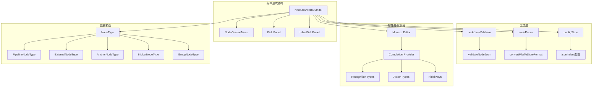
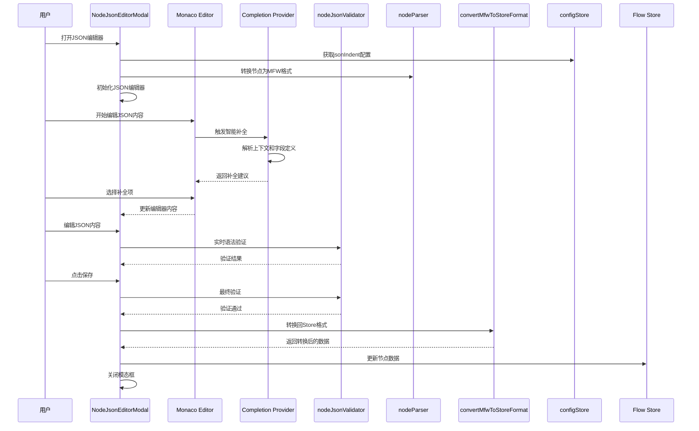
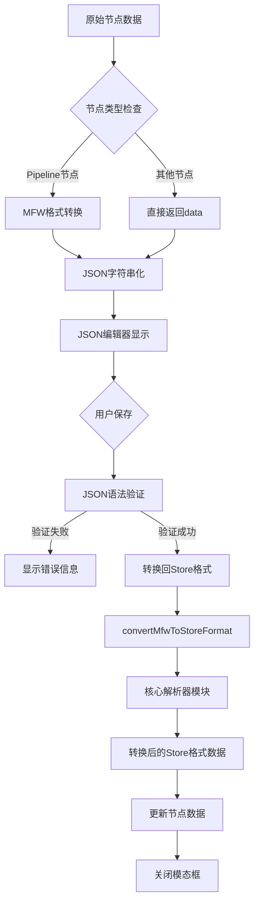
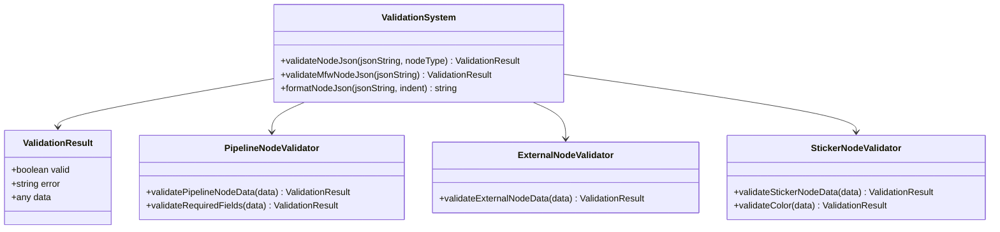
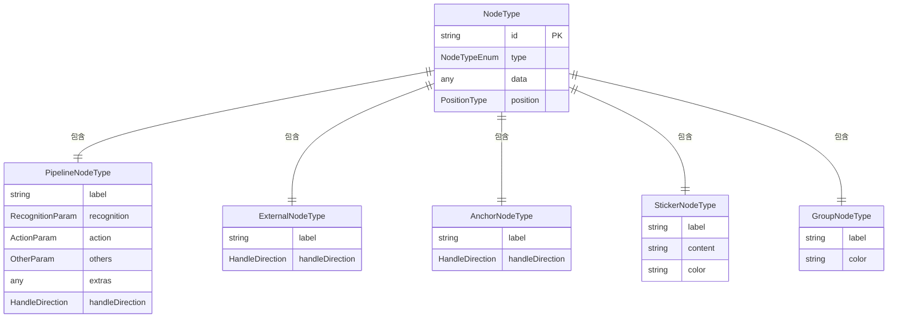
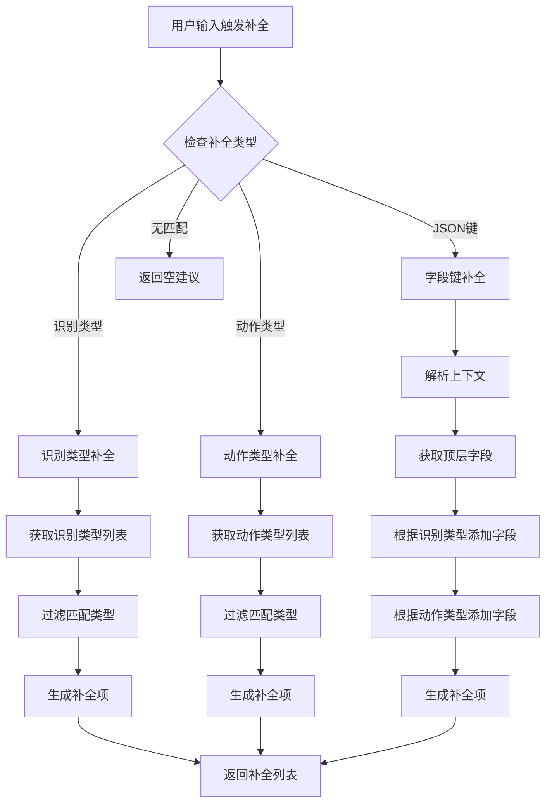

# 节点JSON编辑器模态框

<cite>
**本文档引用的文件**
- [NodeJsonEditorModal.tsx](file://src/components/modals/NodeJsonEditorModal.tsx)
- [nodeJsonValidator.ts](file://src/utils/nodeJsonValidator.ts)
- [nodeParser.ts](file://src/core/parser/nodeParser.ts)
- [configStore.ts](file://src/stores/configStore.ts)
- [types.ts](file://src/stores/flow/types.ts)
- [NodeContextMenu.tsx](file://src/components/flow/nodes/components/NodeContextMenu.tsx)
- [FieldPanel.tsx](file://src/components/panels/main/FieldPanel.tsx)
- [InlineFieldPanel.tsx](file://src/components/panels/main/InlineFieldPanel.tsx)
- [jsonHelper.ts](file://src/utils/jsonHelper.ts)
- [fields.ts](file://src/core/fields/action/fields.ts)
- [fields.ts](file://src/core/fields/recognition/fields.ts)
- [index.ts](file://src/core/fields/index.ts)
- [package.json](file://package.json)
</cite>

## 更新摘要
**变更内容**
- 新增Monaco Editor智能补全功能，包括JSON键自动补全、识别类型补全、动作类型补全等IDE级交互功能
- 实现了上下文感知的自动补全，根据当前JSON结构动态提供字段建议
- 集成了MaaFramework字段定义，提供准确的字段描述和文档
- 增强了编辑器的IDE级体验，提升用户编辑效率

## 目录
1. [简介](#简介)
2. [项目结构](#项目结构)
3. [核心组件](#核心组件)
4. [架构概览](#架构概览)
5. [详细组件分析](#详细组件分析)
6. [智能补全功能](#智能补全功能)
7. [依赖关系分析](#依赖关系分析)
8. [性能考虑](#性能考虑)
9. [故障排除指南](#故障排除指南)
10. [结论](#结论)

## 简介

节点JSON编辑器模态框是MAA Pipeline Editor中的一个重要功能模块，允许用户直接编辑节点的JSON数据。该组件提供了直观的JSON编辑界面，支持实时语法验证、格式化和保存功能，为高级用户和开发者提供了灵活的节点配置方式。

**更新** 新增了Monaco Editor智能补全功能，包括JSON键自动补全、识别类型补全、动作类型补全等IDE级交互功能。该功能通过上下文感知的自动补全机制，根据当前JSON结构和MaaFramework字段定义，为用户提供准确的字段建议和智能提示。

该模态框主要服务于以下场景：
- 高级用户需要直接编辑节点配置
- 开发者需要精确控制节点参数
- 需要批量修改或复制节点配置
- 进行节点配置的备份和恢复
- 需要IDE级的编辑体验和智能提示

## 项目结构

节点JSON编辑器模态框位于前端组件系统的核心位置，与整个应用的架构紧密集成。经过架构分离后，数据转换逻辑现在更加清晰地分布在相应的模块中：



**图表来源**
- [NodeJsonEditorModal.tsx:1-464](file://src/components/modals/NodeJsonEditorModal.tsx#L1-L464)
- [nodeJsonValidator.ts:1-280](file://src/utils/nodeJsonValidator.ts#L1-L280)
- [nodeParser.ts:389-467](file://src/core/parser/nodeParser.ts#L389-L467)

**章节来源**
- [NodeJsonEditorModal.tsx:1-464](file://src/components/modals/NodeJsonEditorModal.tsx#L1-L464)
- [configStore.ts:1-276](file://src/stores/configStore.ts#L1-L276)

## 核心组件

### NodeJsonEditorModal 组件

NodeJsonEditorModal是整个功能的核心组件，采用React.memo优化性能，提供完整的JSON编辑功能。

**主要特性：**
- 实时JSON语法验证
- 自动格式化功能
- 多种节点类型的兼容性
- 配置驱动的缩进设置
- 完整的错误处理机制
- **新增** Monaco Editor智能补全功能

**组件接口：**
```typescript
interface NodeJsonEditorModalProps {
  open: boolean;
  onClose: () => void;
  node: NodeType | null;
  onSave: (nodeData: any) => void;
}
```

**更新** 组件现在通过核心解析器模块访问 convertMfwToStoreFormat 函数，实现了更好的模块分离。同时集成了Monaco Editor的智能补全功能，提供IDE级的编辑体验。

**章节来源**
- [NodeJsonEditorModal.tsx:17-22](file://src/components/modals/NodeJsonEditorModal.tsx#L17-L22)
- [NodeJsonEditorModal.tsx:132-139](file://src/components/modals/NodeJsonEditorModal.tsx#L132-L139)

## 架构概览

节点JSON编辑器模态框在整个应用架构中扮演着关键角色，连接了UI层、业务逻辑层和数据存储层。经过架构分离后，数据转换逻辑现在更加清晰：



**图表来源**
- [NodeJsonEditorModal.tsx:324-341](file://src/components/modals/NodeJsonEditorModal.tsx#L324-L341)
- [nodeJsonValidator.ts:15-56](file://src/utils/nodeJsonValidator.ts#L15-L56)
- [nodeParser.ts:389-467](file://src/core/parser/nodeParser.ts#L389-L467)

## 详细组件分析

### 数据转换机制

节点JSON编辑器实现了复杂的双向数据转换机制，确保不同格式之间的正确转换。经过架构分离后，转换逻辑现在更加模块化：



**图表来源**
- [NodeJsonEditorModal.tsx:324-341](file://src/components/modals/NodeJsonEditorModal.tsx#L324-L341)
- [NodeJsonEditorModal.tsx:284-290](file://src/components/modals/NodeJsonEditorModal.tsx#L284-L290)

### 验证系统

系统实现了多层次的验证机制，确保数据的完整性和正确性：



**图表来源**
- [nodeJsonValidator.ts:15-280](file://src/utils/nodeJsonValidator.ts#L15-L280)

**章节来源**
- [nodeJsonValidator.ts:15-280](file://src/utils/nodeJsonValidator.ts#L15-L280)

### 编辑器配置

JSON编辑器采用了高度定制化的配置，提供最佳的用户体验：

**编辑器选项配置：**
- `minimap`: 关闭缩略图
- `scrollBeyondLastLine`: 禁止滚动到最后一行后继续
- `wordWrap`: 启用自动换行
- `formatOnPaste`: 粘贴时自动格式化
- `formatOnType`: 输入时自动格式化
- `lineNumbers`: 显示行号
- `renderWhitespace`: 仅渲染选区空白字符
- `automaticLayout`: 自动布局调整
- `fontSize`: 14像素字体大小
- `tabSize`: 动态制表符大小（来自配置）
- `insertSpaces`: 使用空格代替制表符

**更新** 编辑器现在集成了Monaco Editor的智能补全功能，通过注册CompletionItemProvider提供IDE级的编辑体验。

**章节来源**
- [NodeJsonEditorModal.tsx:362-374](file://src/components/modals/NodeJsonEditorModal.tsx#L362-L374)

### 节点类型支持

系统支持多种节点类型的JSON编辑，每种类型都有特定的验证规则：



**图表来源**
- [types.ts:107-235](file://src/stores/flow/types.ts#L107-L235)

**章节来源**
- [types.ts:107-235](file://src/stores/flow/types.ts#L107-L235)

## 智能补全功能

**更新** 新增了完整的Monaco Editor智能补全功能，提供IDE级的编辑体验。

### 补全提供者架构

智能补全功能通过Monaco Editor的CompletionItemProvider接口实现，提供了三种主要的补全类型：



**图表来源**
- [NodeJsonEditorModal.tsx:156-269](file://src/components/modals/NodeJsonEditorModal.tsx#L156-L269)

### 上下文感知补全

智能补全系统能够根据当前的JSON上下文提供准确的建议：

#### 识别类型补全
当用户在`"recognition"`字段值位置输入时，系统会提供所有可用的识别类型：
- DirectHit
- OCR
- TemplateMatch
- ColorMatch
- Custom
- FeatureMatch
- And
- Or
- NeuralNetworkClassify
- NeuralNetworkDetect

#### 动作类型补全
当用户在`"action"`字段值位置输入时，系统会提供所有可用的动作类型：
- DoNothing
- Click
- Custom
- Swipe
- Scroll
- ClickKey
- LongPress
- MultiSwipe
- TouchDown
- TouchMove
- TouchUp
- LongPressKey
- KeyDown
- KeyUp
- InputText
- StartApp
- StopApp
- StopTask
- Command
- Shell
- Screencap
- Key

#### 字段键补全
系统会根据当前的识别类型和动作类型动态提供字段键：
- 顶层字段：`recognition`, `action`, `next`, `on_error`
- 其他字段：从`otherFieldSchemaKeyList`获取
- 识别字段：根据识别类型动态添加
- 动作字段：根据动作类型动态添加

**章节来源**
- [NodeJsonEditorModal.tsx:65-103](file://src/components/modals/NodeJsonEditorModal.tsx#L65-L103)
- [NodeJsonEditorModal.tsx:156-269](file://src/components/modals/NodeJsonEditorModal.tsx#L156-L269)

### 字段定义集成

智能补全功能集成了完整的MaaFramework字段定义，提供准确的字段描述和文档：

#### 识别字段配置
每个识别类型都包含详细的参数定义和描述：
- ROI区域设置
- 阈值配置
- 模板匹配参数
- OCR识别参数
- 颜色匹配参数
- 自定义识别参数

#### 动作字段配置
每个动作类型都包含详细的参数定义和描述：
- 目标坐标设置
- 持续时间配置
- 按键操作参数
- 文本输入参数
- 应用控制参数
- 命令执行参数

**章节来源**
- [fields.ts:1-149](file://src/core/fields/action/fields.ts#L1-L149)
- [fields.ts:1-115](file://src/core/fields/recognition/fields.ts#L1-L115)
- [index.ts:1-45](file://src/core/fields/index.ts#L1-L45)

## 依赖关系分析

节点JSON编辑器模态框与多个系统组件存在紧密的依赖关系。经过架构分离后，依赖关系更加清晰：

```mermaid
graph TB
subgraph "外部依赖"
A[Ant Design Modal]
B[Monaco Editor]
C[Zustand Store]
D[@monaco-editor/react]
E[monaco-editor]
end
subgraph "内部模块"
F[NodeJsonEditorModal]
G[nodeJsonValidator]
H[nodeParser]
I[configStore]
J[flow types]
K[fields definition]
end
subgraph "调用关系"
L[NodeContextMenu]
M[FieldPanel]
N[InlineFieldPanel]
end
F --> A
F --> B
F --> C
F --> D
F --> E
F --> G
F --> H
F --> I
F --> J
F --> K
L --> F
M --> F
N --> F
H --> convertMfwToStoreFormat
K --> recoFields
K --> actionFields
```

**图表来源**
- [NodeJsonEditorModal.tsx:1-464](file://src/components/modals/NodeJsonEditorModal.tsx#L1-L464)
- [NodeContextMenu.tsx:215-220](file://src/components/flow/nodes/components/NodeContextMenu.tsx#L215-L220)
- [FieldPanel.tsx:549-554](file://src/components/panels/main/FieldPanel.tsx#L549-L554)

**章节来源**
- [NodeJsonEditorModal.tsx:1-464](file://src/components/modals/NodeJsonEditorModal.tsx#L1-L464)
- [NodeContextMenu.tsx:215-220](file://src/components/flow/nodes/components/NodeContextMenu.tsx#L215-L220)

## 性能考虑

节点JSON编辑器模态框在设计时充分考虑了性能优化：

### React.memo优化
- 使用`React.memo`包装组件，避免不必要的重新渲染
- 通过`useCallback`缓存回调函数，减少函数重建
- 使用`useEffect`合理管理副作用，避免重复计算

### 内存管理
- 编辑器内容使用`useState`管理，及时清理未使用的状态
- 配置变更通过`useConfigStore`订阅，避免全局状态污染
- 组件卸载时自动清理编辑器实例和补全提供者

### 渲染优化
- Monaco编辑器按需加载，提升初始渲染性能
- JSON格式化操作异步执行，避免阻塞主线程
- 错误处理采用防抖机制，减少频繁的UI更新

**更新** 智能补全功能通过懒加载和上下文感知机制优化性能，只在需要时提供补全建议，避免不必要的计算开销。

### 补全性能优化
- 使用Set数据结构去重字段键
- 实现智能排序机制，优先显示匹配的补全项
- 通过正则表达式快速判断补全触发条件
- 缓存字段定义和类型信息，避免重复查询

**章节来源**
- [NodeJsonEditorModal.tsx:252-266](file://src/components/modals/NodeJsonEditorModal.tsx#L252-L266)

## 故障排除指南

### 常见问题及解决方案

**JSON语法错误**
- 症状：保存按钮禁用，底部显示错误信息
- 原因：JSON字符串格式不正确
- 解决方案：点击"格式化"按钮自动修复，或手动修正语法错误

**节点类型不匹配**
- 症状：转换过程中出现类型错误
- 原因：编辑的JSON不符合目标节点类型规范
- 解决方案：检查节点类型，确保字段结构正确

**编辑器无法加载**
- 症状：模态框打开但编辑器不显示
- 原因：Monaco Editor资源加载失败
- 解决方案：检查网络连接，重新加载页面

**转换函数不可用**
- 症状：保存时出现函数不存在的错误
- 原因：convertMfwToStoreFormat 函数已移动到核心解析器模块
- 解决方案：确保正确的导入路径，使用新的模块化结构

**智能补全不工作**
- 症状：输入时没有出现补全建议
- 压缩原因：补全提供者注册失败或上下文检测错误
- 解决方案：检查Monaco Editor版本兼容性，确认字段定义正确加载

**补全建议不准确**
- 症状：补全建议与当前上下文不符
- 原因：上下文解析逻辑错误或字段定义缺失
- 解决方案：检查JSON结构，确认识别类型和动作类型正确设置

**章节来源**
- [NodeJsonEditorModal.tsx:324-341](file://src/components/modals/NodeJsonEditorModal.tsx#L324-L341)
- [NodeJsonEditorModal.tsx:336](file://src/components/modals/NodeJsonEditorModal.tsx#L336)

## 结论

节点JSON编辑器模态框是一个功能完整、设计精良的组件，它为MAA Pipeline Editor提供了强大的节点配置能力。通过精心设计的数据转换机制、多层次的验证系统和优化的性能架构，该组件能够满足从普通用户到高级开发者的各种需求。

**更新** 新增的Monaco Editor智能补全功能显著提升了编辑体验，提供了IDE级的交互功能。该功能通过上下文感知的自动补全机制，根据当前的JSON结构和MaaFramework字段定义，为用户提供准确的字段建议和智能提示。

经过架构分离后，convertMfwToStoreFormat 函数现在位于核心解析器模块中，这提升了代码的模块化程度和可维护性。该组件的主要优势包括：

- **易用性**：直观的JSON编辑界面和实时验证
- **智能化**：Monaco Editor智能补全功能，提供IDE级体验
- **灵活性**：支持多种节点类型和配置选项
- **可靠性**：完善的错误处理和数据验证机制
- **性能**：优化的渲染和内存管理策略
- **模块化**：清晰的职责分离和依赖关系

未来可以考虑的功能增强：
- 支持JSON Schema验证
- 添加撤销/重做功能
- 实现更丰富的代码补全规则
- 增加JSON模板库
- 集成更多IDE级功能如代码折叠、语法高亮等

**更新** 智能补全功能的引入标志着节点JSON编辑器从简单的文本编辑器升级为功能完备的IDE级工具，大幅提升了用户的编辑效率和准确性。