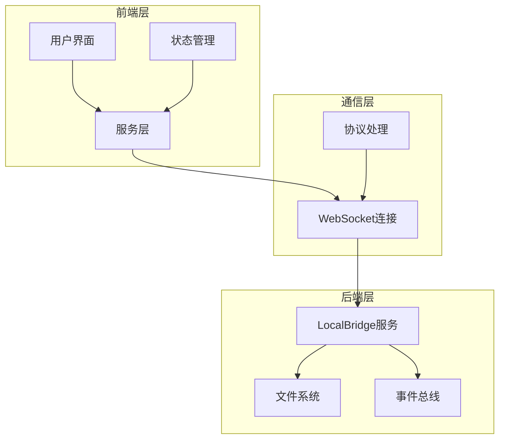
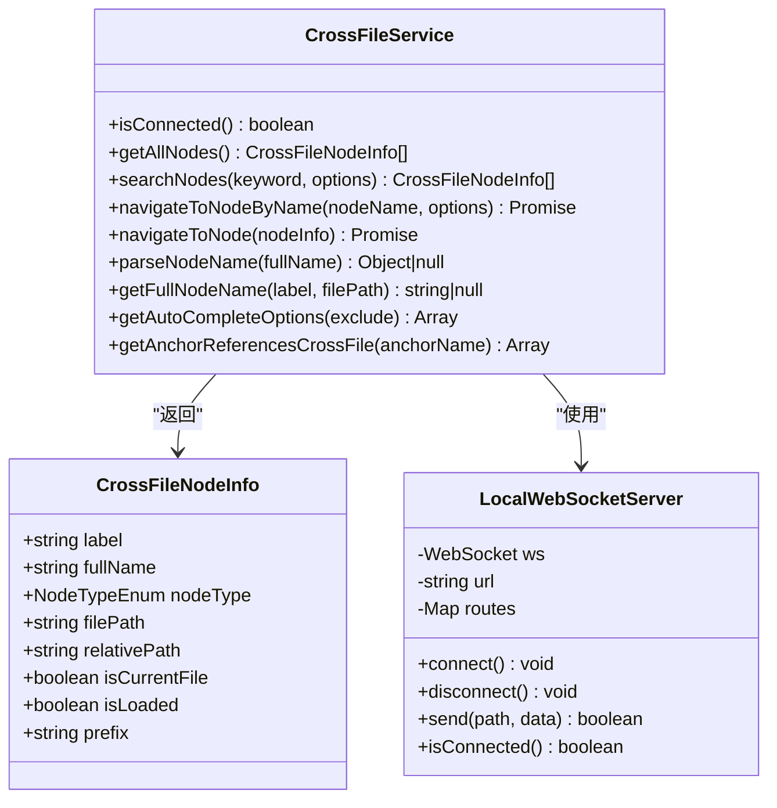
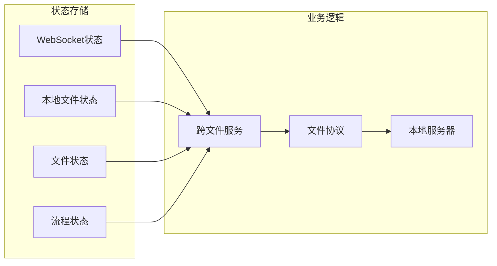
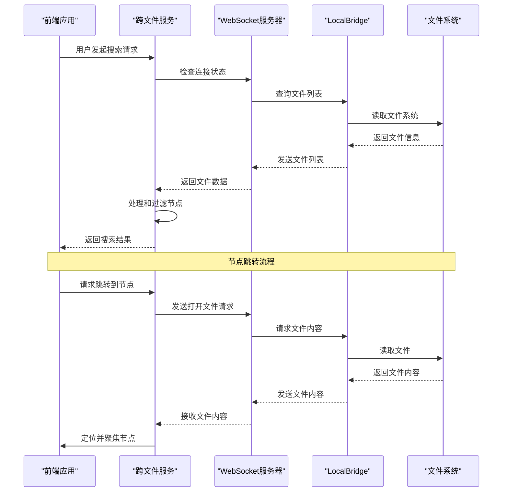
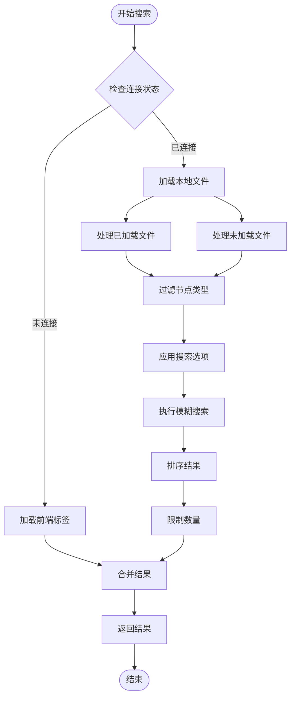
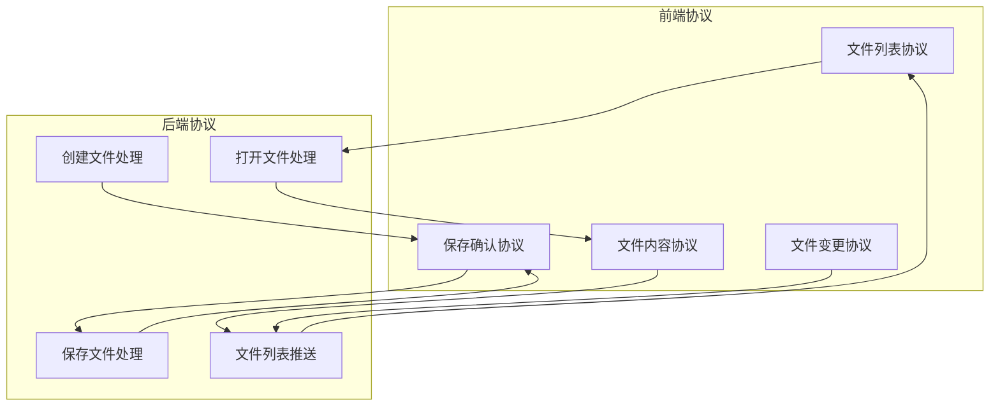
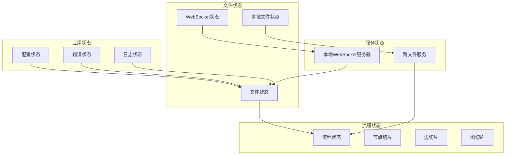

# 跨文件服务系统

<cite>
**本文档引用的文件**
- [crossFileService.ts](file://src/services/crossFileService.ts)
- [server.ts](file://src/services/server.ts)
- [wsStore.ts](file://src/stores/wsStore.ts)
- [localFileStore.ts](file://src/stores/localFileStore.ts)
- [fileStore.ts](file://src/stores/fileStore.ts)
- [constants.ts](file://src/components/flow/nodes/constants.ts)
- [nodeNameHelper.ts](file://src/utils/nodeNameHelper.ts)
- [FileProtocol.ts](file://src/services/protocols/FileProtocol.ts)
- [file_handler.go](file://LocalBridge/internal/protocol/file/file_handler.go)
- [main.go](file://LocalBridge/cmd/lb/main.go)
- [index.ts](file://src/services/index.ts)
</cite>

## 目录
1. [简介](#简介)
2. [项目结构](#项目结构)
3. [核心组件](#核心组件)
4. [架构概览](#架构概览)
5. [详细组件分析](#详细组件分析)
6. [依赖关系分析](#依赖关系分析)
7. [性能考虑](#性能考虑)
8. [故障排除指南](#故障排除指南)
9. [结论](#结论)

## 简介

跨文件服务系统是一个强大的文件管理和节点导航解决方案，专为MaaPipelineEditor设计。该系统提供了无缝的跨文件节点搜索、跳转和自动完成功能，允许用户在多个Pipeline文件之间轻松导航和引用节点。

系统的核心优势包括：
- 实时跨文件节点搜索和跳转
- 智能节点自动完成功能
- 支持本地文件和远程文件的统一管理
- 前端多标签页场景下的文件导航
- 完整的文件变更监控和同步机制

## 项目结构

该项目采用模块化的三层架构设计：

**图表来源**
- [crossFileService.ts:55-729](file://src/services/crossFileService.ts#L55-L729)
- [server.ts:20-333](file://src/services/server.ts#L20-L333)
- [main.go:183-440](file://LocalBridge/cmd/lb/main.go#L183-L440)

**章节来源**
- [crossFileService.ts:1-729](file://src/services/crossFileService.ts#L1-L729)
- [server.ts:1-373](file://src/services/server.ts#L1-L373)
- [main.go:1-90](file://LocalBridge/cmd/lb/main.go#L1-L90)

## 核心组件

### 跨文件服务核心类

CrossFileService是系统的核心组件，负责处理所有跨文件相关的操作：

**图表来源**
- [crossFileService.ts:55-729](file://src/services/crossFileService.ts#L55-L729)
- [server.ts:20-333](file://src/services/server.ts#L20-L333)

### 状态管理系统

系统采用Zustand状态管理库，提供高效的状态管理：

**图表来源**
- [wsStore.ts:7-24](file://src/stores/wsStore.ts#L7-L24)
- [localFileStore.ts:61-124](file://src/stores/localFileStore.ts#L61-L124)
- [fileStore.ts:300-330](file://src/stores/fileStore.ts#L300-L330)

**章节来源**
- [crossFileService.ts:55-729](file://src/services/crossFileService.ts#L55-L729)
- [wsStore.ts:1-24](file://src/stores/wsStore.ts#L1-L24)
- [localFileStore.ts:1-339](file://src/stores/localFileStore.ts#L1-L339)
- [fileStore.ts:1-800](file://src/stores/fileStore.ts#L1-L800)

## 架构概览

系统采用客户端-服务器架构，通过WebSocket实现双向通信：

**图表来源**
- [crossFileService.ts:323-516](file://src/services/crossFileService.ts#L323-L516)
- [FileProtocol.ts:109-141](file://src/services/protocols/FileProtocol.ts#L109-L141)
- [file_handler.go:67-137](file://LocalBridge/internal/protocol/file/file_handler.go#L67-L137)

## 详细组件分析

### 跨文件服务实现

CrossFileService提供了完整的跨文件节点管理功能：

#### 节点搜索算法

**图表来源**
- [crossFileService.ts:207-268](file://src/services/crossFileService.ts#L207-L268)

#### 节点跳转机制

系统支持多种跳转场景：

1. **当前文件内跳转**：直接在当前文件中定位节点
2. **同一文件夹内跳转**：在已加载的文件间切换
3. **跨文件跳转**：通过LocalBridge加载远程文件并跳转

**章节来源**
- [crossFileService.ts:323-516](file://src/services/crossFileService.ts#L323-L516)
- [crossFileService.ts:616-698](file://src/services/crossFileService.ts#L616-L698)

### WebSocket通信协议

系统实现了完整的WebSocket通信协议栈：

**图表来源**
- [FileProtocol.ts:44-68](file://src/services/protocols/FileProtocol.ts#L44-L68)
- [file_handler.go:48-64](file://LocalBridge/internal/protocol/file/file_handler.go#L48-L64)

**章节来源**
- [server.ts:20-333](file://src/services/server.ts#L20-L333)
- [FileProtocol.ts:1-607](file://src/services/protocols/FileProtocol.ts#L1-L607)
- [file_handler.go:1-328](file://LocalBridge/internal/protocol/file/file_handler.go#L1-L328)

### 状态管理架构

系统采用分层状态管理模式：

**图表来源**
- [fileStore.ts:300-330](file://src/stores/fileStore.ts#L300-L330)
- [localFileStore.ts:61-124](file://src/stores/localFileStore.ts#L61-L124)
- [wsStore.ts:7-24](file://src/stores/wsStore.ts#L7-L24)

**章节来源**
- [fileStore.ts:1-800](file://src/stores/fileStore.ts#L1-L800)
- [localFileStore.ts:1-339](file://src/stores/localFileStore.ts#L1-L339)
- [wsStore.ts:1-24](file://src/stores/wsStore.ts#L1-L24)

## 依赖关系分析

系统具有清晰的依赖层次结构：

```mermaid
graph TB
subgraph "核心依赖"
Zustand[Zustand状态管理]
WebSocket[WebSocket API]
Antd[Ant Design UI]
end
subgraph "业务逻辑"
CrossFileService[跨文件服务]
FileProtocol[文件协议]
LocalBridge[LocalBridge服务]
end
subgraph "工具库"
JsoncParser[JSONC解析器]
DndKit[DnD拖拽库]
React[React框架]
end
subgraph "系统接口"
FileSystem[文件系统API]
EventBus[事件总线]
Logger[日志系统]
end
Zustand --> CrossFileService
WebSocket --> FileProtocol
Antd --> CrossFileService
CrossFileService --> FileProtocol
FileProtocol --> LocalBridge
JsoncParser --> FileProtocol
DndKit --> CrossFileService
React --> CrossFileService
LocalBridge --> FileSystem
LocalBridge --> EventBus
LocalBridge --> Logger
```

**图表来源**
- [crossFileService.ts:6-16](file://src/services/crossFileService.ts#L6-L16)
- [server.ts:1-17](file://src/services/server.ts#L1-L17)
- [main.go:3-16](file://LocalBridge/cmd/lb/main.go#L3-L16)

**章节来源**
- [crossFileService.ts:1-729](file://src/services/crossFileService.ts#L1-L729)
- [server.ts:1-373](file://src/services/server.ts#L1-L373)
- [main.go:1-90](file://LocalBridge/cmd/lb/main.go#L1-L90)

## 性能考虑

### 优化策略

1. **连接池管理**：WebSocket连接采用单例模式，避免重复连接
2. **状态缓存**：本地文件列表和节点信息采用内存缓存
3. **异步处理**：文件操作采用异步模式，避免阻塞UI线程
4. **增量更新**：文件变更采用增量更新策略

### 性能监控

系统内置了完整的性能监控机制：

- 连接状态监控
- 文件操作延迟统计
- 搜索性能指标
- 内存使用情况

## 故障排除指南

### 常见问题及解决方案

#### 连接问题

**问题**：无法连接到LocalBridge服务
**解决方案**：
1. 检查LocalBridge服务是否正常运行
2. 验证端口配置（默认9066）
3. 确认防火墙设置允许连接

#### 文件加载问题

**问题**：文件无法加载或显示为空
**解决方案**：
1. 检查文件路径是否正确
2. 验证文件权限设置
3. 确认文件编码格式

#### 搜索功能异常

**问题**：节点搜索结果不准确
**解决方案**：
1. 检查节点标签是否包含特殊字符
2. 验证前缀配置是否正确
3. 确认搜索关键词格式

**章节来源**
- [server.ts:104-251](file://src/services/server.ts#L104-L251)
- [crossFileService.ts:447-516](file://src/services/crossFileService.ts#L447-L516)

## 结论

跨文件服务系统是一个功能完整、架构清晰的文件管理和节点导航解决方案。系统的主要特点包括：

1. **强大的跨文件能力**：支持多文件节点搜索、跳转和自动完成
2. **高效的通信机制**：基于WebSocket的实时双向通信
3. **灵活的状态管理**：采用Zustand实现高性能状态管理
4. **完善的错误处理**：提供全面的错误监控和恢复机制
5. **良好的扩展性**：模块化设计便于功能扩展和维护

该系统为MaaPipelineEditor提供了坚实的文件管理基础，显著提升了用户的多文件工作体验。通过合理的架构设计和性能优化，系统能够在大型项目中保持稳定的性能表现。