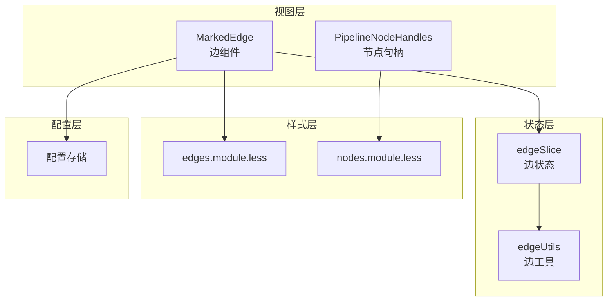
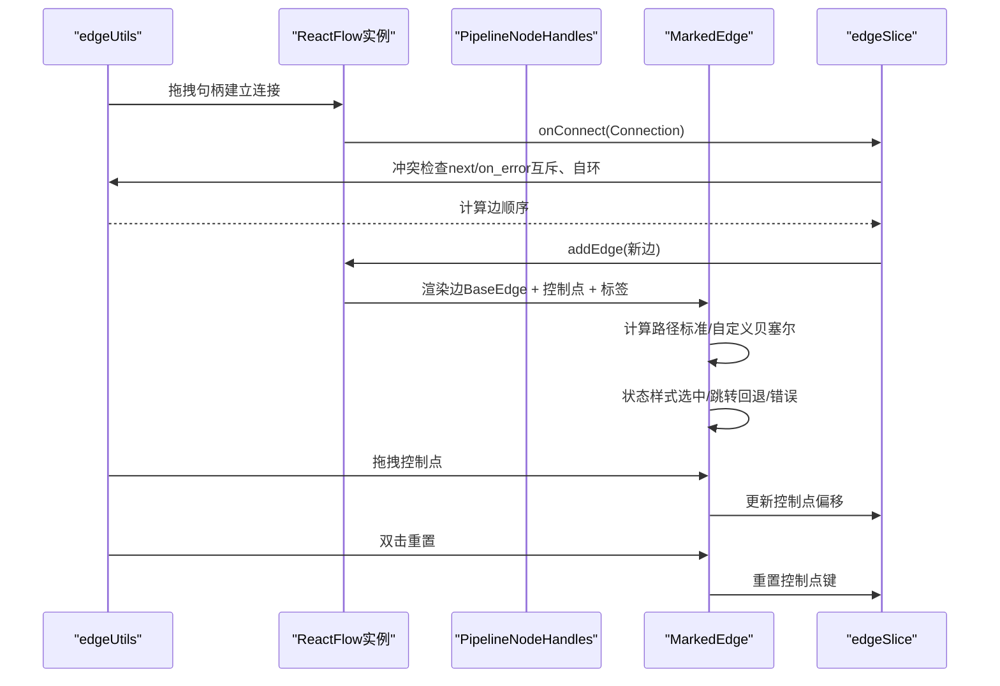
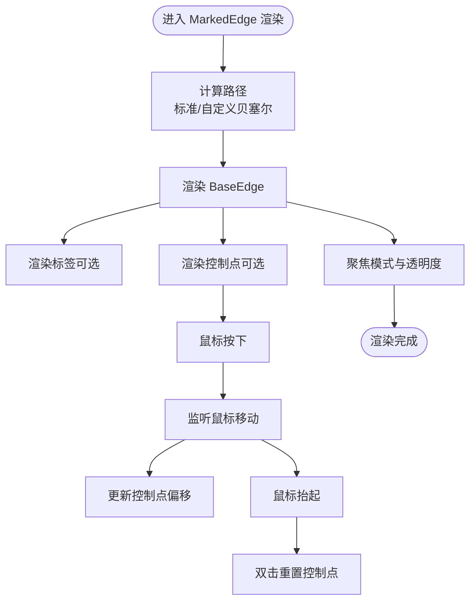
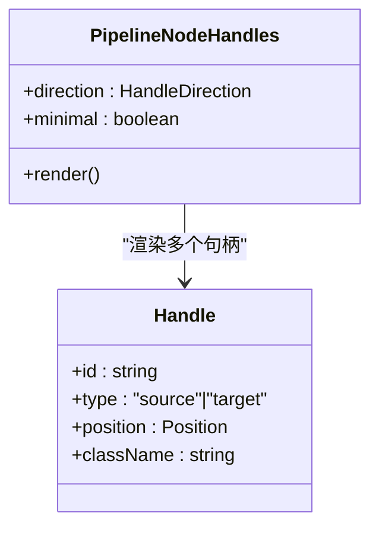
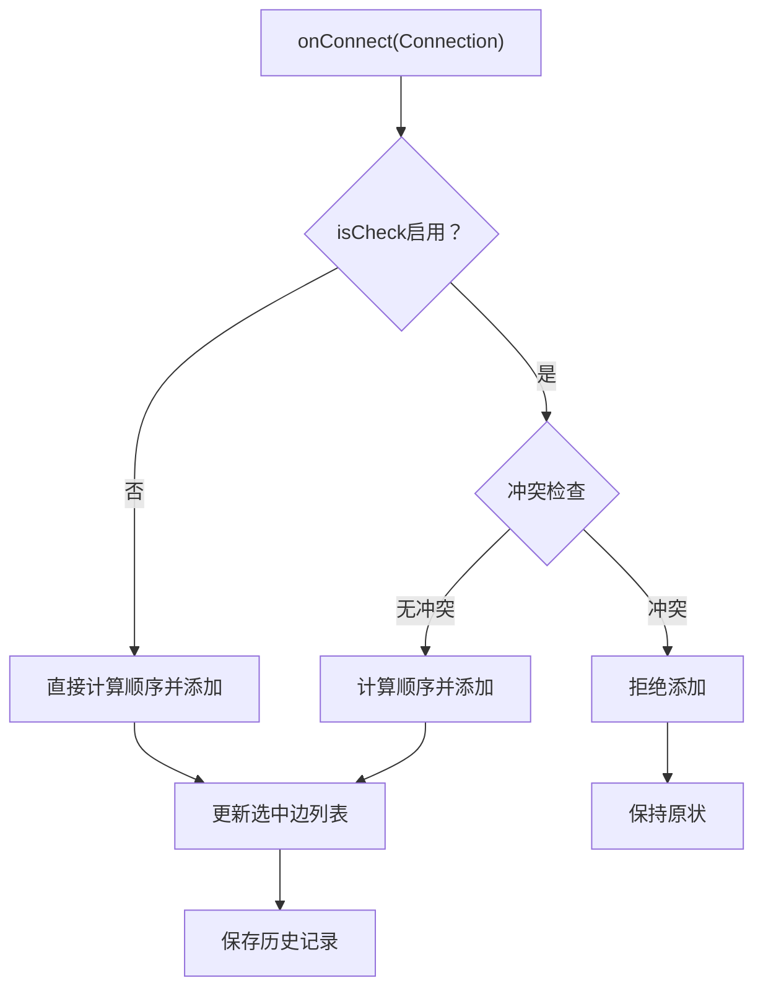
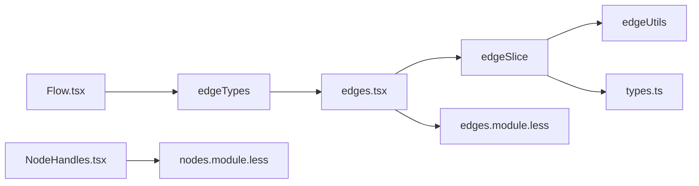

# 连接系统

<cite>
**本文档引用的文件**
- [edges.tsx](file://src/components/flow/edges.tsx)
- [NodeHandles.tsx](file://src/components/flow/nodes/components/NodeHandles.tsx)
- [constants.ts](file://src/components/flow/nodes/constants.ts)
- [edgeSlice.ts](file://src/stores/flow/slices/edgeSlice.ts)
- [edgeUtils.ts](file://src/stores/flow/utils/edgeUtils.ts)
- [edges.module.less](file://src/styles/edges.module.less)
- [nodes.module.less](file://src/styles/nodes.module.less)
- [Flow.tsx](file://src/components/Flow.tsx)
- [types.ts](file://src/stores/flow/types.ts)
- [pathSlice.ts](file://src/stores/flow/slices/pathSlice.ts)
- [EdgePanel.tsx](file://src/components/panels/main/EdgePanel.tsx)
- [edgeLinker.ts](file://src/core/parser/edgeLinker.ts)
</cite>

## 目录
1. [简介](#简介)
2. [项目结构](#项目结构)
3. [核心组件](#核心组件)
4. [架构总览](#架构总览)
5. [详细组件分析](#详细组件分析)
6. [依赖关系分析](#依赖关系分析)
7. [性能考量](#性能考量)
8. [故障排查指南](#故障排查指南)
9. [结论](#结论)

## 简介
本文件面向MaaPipelineEditor的连接系统，围绕“边（Edge）”与“节点句柄（Handle）”两大核心展开，系统性阐述：
- 边的实现原理：连接线绘制、样式定制、交互行为（拖拽控制点、标签渲染、聚焦效果）
- 节点句柄系统：输入句柄、输出句柄的配置与使用，支持多方向布局
- 连接验证机制：冲突检查（next与on_error互斥、自环限制）、边顺序管理
- 边的状态管理：选中、hover、跳转回退、错误等视觉反馈
- 连接的创建、删除、修改操作细节
- 连接样式定制指南：线条样式、箭头类型、颜色主题
- 性能优化与复杂网络图处理策略

## 项目结构
连接系统主要由以下层次构成：
- 视图层：边组件负责渲染与交互；节点句柄组件负责端点渲染
- 状态层：Zustand slice维护边列表、边数据、边顺序、控制点重置键
- 工具层：边工具函数负责查找、筛选、排序
- 样式层：Less模块化定义边与句柄的外观
- 配置层：全局配置影响边标签显示、控制点显示、聚焦透明度等

图表来源
- [edges.tsx:188-525](file://src/components/flow/edges.tsx#L188-L525)
- [NodeHandles.tsx:37-131](file://src/components/flow/nodes/components/NodeHandles.tsx#L37-L131)
- [edgeSlice.ts:16-221](file://src/stores/flow/slices/edgeSlice.ts#L16-L221)
- [edgeUtils.ts:1-32](file://src/stores/flow/utils/edgeUtils.ts#L1-L32)
- [edges.module.less:1-98](file://src/styles/edges.module.less#L1-L98)
- [nodes.module.less:316-537](file://src/styles/nodes.module.less#L316-L537)

章节来源
- [edges.tsx:1-530](file://src/components/flow/edges.tsx#L1-L530)
- [NodeHandles.tsx:1-254](file://src/components/flow/nodes/components/NodeHandles.tsx#L1-L254)
- [edgeSlice.ts:1-222](file://src/stores/flow/slices/edgeSlice.ts#L1-L222)
- [edgeUtils.ts:1-32](file://src/stores/flow/utils/edgeUtils.ts#L1-L32)
- [edges.module.less:1-98](file://src/styles/edges.module.less#L1-L98)
- [nodes.module.less:316-537](file://src/styles/nodes.module.less#L316-L537)

## 核心组件
- MarkedEdge：自定义边组件，基于@xyflow/react的BaseEdge，支持：
  - 自定义贝塞尔曲线路径（标准与带控制点的两套算法）
  - 可拖拽控制点调整曲线形状，双击重置
  - 标签渲染与透明度控制
  - 选中态、next/error、jumpback等状态样式
- PipelineNodeHandles：节点句柄组件，提供：
  - 输入句柄（target、jump_back）与输出句柄（next、error）
  - 支持四种方向布局（左右、右左、上下、下上）
  - 极简风格与常规风格两种外观
- edgeSlice：边状态管理，提供：
  - 添加边（含冲突检查、顺序计算）
  - 更新边数据（attributes）
  - 更新边顺序（label）
  - 删除边后的顺序补偿
  - 控制点重置键
- 边工具：查找、筛选、顺序计算
- 样式：边、标签、控制点、句柄的CSS类定义

章节来源
- [edges.tsx:188-525](file://src/components/flow/edges.tsx#L188-L525)
- [NodeHandles.tsx:37-131](file://src/components/flow/nodes/components/NodeHandles.tsx#L37-L131)
- [edgeSlice.ts:16-221](file://src/stores/flow/slices/edgeSlice.ts#L16-L221)
- [edgeUtils.ts:1-32](file://src/stores/flow/utils/edgeUtils.ts#L1-L32)
- [edges.module.less:1-98](file://src/styles/edges.module.less#L1-L98)
- [nodes.module.less:316-537](file://src/styles/nodes.module.less#L316-L537)

## 架构总览
连接系统采用“视图-状态-工具-样式”的分层设计，通过@xyflow/react提供的节点与边渲染能力，结合Zustand进行状态管理，最终以Less样式完成视觉呈现。

图表来源
- [Flow.tsx:248-262](file://src/components/Flow.tsx#L248-L262)
- [edgeSlice.ts:150-210](file://src/stores/flow/slices/edgeSlice.ts#L150-L210)
- [edges.tsx:250-346](file://src/components/flow/edges.tsx#L250-L346)
- [edgeUtils.ts:17-31](file://src/stores/flow/utils/edgeUtils.ts#L17-L31)

章节来源
- [Flow.tsx:193-542](file://src/components/Flow.tsx#L193-L542)
- [edgeSlice.ts:16-221](file://src/stores/flow/slices/edgeSlice.ts#L16-L221)
- [edges.tsx:188-525](file://src/components/flow/edges.tsx#L188-L525)

## 详细组件分析

### 边（Edge）实现原理
- 路径计算
  - 标准贝塞尔曲线：根据源/目标节点方向自动计算切线长度与控制点，保证连线平滑
  - 自定义贝塞尔曲线：支持拖拽控制点，动态调整曲线曲率，避免过近或过远导致的视觉拥挤
- 标签与控制点
  - 标签随路径居中显示，受“显示边标签”配置控制
  - 控制点可拖拽调整曲线，双击重置；拖拽时高亮显示
- 状态样式
  - 选中态：加粗描边
  - next/error：不同颜色区分
  - jumpback：特殊橙色强调
  - 聚焦模式：根据选中节点/边或路径模式调整透明度
- 交互行为
  - 屏幕坐标到flow坐标转换，确保拖拽精度
  - 支持鼠标按下、移动、抬起事件链路
  - 双击重置控制点，触发状态更新

图表来源
- [edges.tsx:250-346](file://src/components/flow/edges.tsx#L250-L346)
- [edges.module.less:44-97](file://src/styles/edges.module.less#L44-L97)

章节来源
- [edges.tsx:188-525](file://src/components/flow/edges.tsx#L188-L525)
- [edges.module.less:1-98](file://src/styles/edges.module.less#L1-L98)

### 节点句柄（Handle）系统
- 句柄类型
  - 输入句柄：target（普通输入）、jump_back（跳转回退）
  - 输出句柄：next（正常流转）、error（错误流转）
- 方向配置
  - 支持四种方向：left-right、right-left、top-bottom、bottom-top
  - 根据方向自动映射到Position.Left/Right/Top/Bottom，并决定水平/垂直样式
- 样式风格
  - 常规风格：矩形端点，hover放大
  - 极简风格：圆形端点，hover放大并投影
- 位置更新
  - 当方向变化时，通过useUpdateNodeInternals强制刷新句柄位置

图表来源
- [NodeHandles.tsx:37-131](file://src/components/flow/nodes/components/NodeHandles.tsx#L37-L131)
- [constants.ts:1-47](file://src/components/flow/nodes/constants.ts#L1-L47)

章节来源
- [NodeHandles.tsx:1-254](file://src/components/flow/nodes/components/NodeHandles.tsx#L1-L254)
- [constants.ts:1-47](file://src/components/flow/nodes/constants.ts#L1-L47)
- [nodes.module.less:316-537](file://src/styles/nodes.module.less#L316-L537)

### 连接验证机制
- 冲突检查
  - next与on_error不能同时指向同一目标节点
  - on_error自环（source===target且sourceHandle===on_error）禁止
- 边顺序管理
  - 同一source+sourceHandle的多条边按label顺序排列
  - 删除边后，后续边label递减补偿
- 添加边流程
  - 可选isCheck开关，默认启用冲突检查
  - 计算当前source+sourceHandle下的边数量作为新边label
  - 通过@xyflow/react的addEdge统一接入

图表来源
- [edgeSlice.ts:150-210](file://src/stores/flow/slices/edgeSlice.ts#L150-L210)
- [edgeUtils.ts:17-31](file://src/stores/flow/utils/edgeUtils.ts#L17-L31)

章节来源
- [edgeSlice.ts:16-221](file://src/stores/flow/slices/edgeSlice.ts#L16-L221)
- [edgeUtils.ts:1-32](file://src/stores/flow/utils/edgeUtils.ts#L1-L32)

### 边的状态管理与视觉反馈
- 选中状态：边描边加粗
- hover状态：控制点显隐与hover态样式
- 错误状态：error输出句柄对应红色
- 跳转回退：jump_back目标句柄对应橙色
- 聚焦模式：根据选中节点/边或路径模式调整透明度，突出相关连接
- 调试模式：当源与目标节点均被执行时，边标记为已执行

章节来源
- [edges.tsx:413-451](file://src/components/flow/edges.tsx#L413-L451)
- [edges.module.less:40-61](file://src/styles/edges.module.less#L40-L61)

### 连接的创建、删除、修改
- 创建：Flow.onConnect -> edgeSlice.addEdge -> @xyflow/addEdge -> ReactFlow渲染
- 删除：ReactFlow删除边 -> edgeSlice.updateEdges -> 补偿后续边label
- 修改：拖拽控制点更新控制点偏移 -> 重新计算路径 -> 视觉更新；设置边数据通过setEdgeData

章节来源
- [Flow.tsx:248-262](file://src/components/Flow.tsx#L248-L262)
- [edgeSlice.ts:24-61](file://src/stores/flow/slices/edgeSlice.ts#L24-L61)

### 连接样式定制指南
- 线条样式
  - 描边宽度、虚线动画、过渡效果
  - 选中态加粗描边
- 箭头类型
  - 使用@xyflow/react默认箭头；可通过路径样式微调
- 颜色主题
  - next：绿色
  - error：红色
  - jumpback：橙色
  - jumpback+error：紫色
- 控制点
  - 圆形、半透明背景、hover显隐
- 标签
  - 白色半透明背景、边框、选中态放大与加粗

章节来源
- [edges.module.less:1-98](file://src/styles/edges.module.less#L1-L98)
- [nodes.module.less:316-537](file://src/styles/nodes.module.less#L316-L537)

### 复杂网络图的处理策略
- 聚焦模式：通过焦点透明度与相关性判断，降低无关连接的视觉干扰
- 路径模式：DFS遍历所有可达路径，高亮路径上的节点与边，辅助分析
- 控制点：允许手动调整曲线，缓解密集连接的遮挡问题
- 性能建议：减少不必要的重渲染，合理使用memo与useMemo；在大量边场景下谨慎开启标签与控制点

章节来源
- [edges.tsx:370-411](file://src/components/flow/edges.tsx#L370-L411)
- [pathSlice.ts:9-87](file://src/stores/flow/slices/pathSlice.ts#L9-L87)

## 依赖关系分析
- 视图层依赖状态层与样式层
- edgeSlice依赖edgeUtils与@xyflow/react
- MarkedEdge依赖配置存储、调试存储、节点方向信息
- Flow组件注册edgeTypes与nodeTypes，统一管理连接与渲染

图表来源
- [Flow.tsx:464-470](file://src/components/Flow.tsx#L464-L470)
- [edges.tsx:527-529](file://src/components/flow/edges.tsx#L527-L529)
- [edgeSlice.ts:1-14](file://src/stores/flow/slices/edgeSlice.ts#L1-L14)
- [types.ts:27-38](file://src/stores/flow/types.ts#L27-L38)

章节来源
- [Flow.tsx:193-542](file://src/components/Flow.tsx#L193-L542)
- [edgeSlice.ts:1-221](file://src/stores/flow/slices/edgeSlice.ts#L1-L221)
- [edges.tsx:1-530](file://src/components/flow/edges.tsx#L1-L530)

## 性能考量
- 路径计算复杂度
  - 标准贝塞尔：O(1)，计算量小
  - 自定义贝塞尔：每次拖拽触发，但仅局部重绘
- 边顺序更新
  - 删除边时批量补偿label，避免重复渲染
- 聚焦与透明度
  - 通过isRelated与focusOpacity减少不必要的样式变更
- 大规模网络
  - 建议在复杂场景下关闭边标签与控制点，或采用路径模式聚焦关键路径

[本节为通用性能讨论，无需特定文件来源]

## 故障排查指南
- 无法创建连接
  - 检查是否触发了冲突检查（next与on_error互斥、自环）
  - 确认句柄方向与节点类型匹配
- 连接顺序异常
  - 删除边后label未补偿：确认edgeSlice.updateEdges逻辑
- 控制点不可见
  - 检查配置项“显示边控制点”
  - 确认边处于拖拽态或存在偏移
- 样式不生效
  - 检查CSS类名拼写与覆盖优先级
  - 确认主题变量（如@next-color）正确注入

章节来源
- [edgeSlice.ts:150-210](file://src/stores/flow/slices/edgeSlice.ts#L150-L210)
- [edges.tsx:341-346](file://src/components/flow/edges.tsx#L341-L346)
- [edges.module.less:63-97](file://src/styles/edges.module.less#L63-L97)

## 结论
MaaPipelineEditor的连接系统通过清晰的分层设计与完善的验证机制，实现了稳定、可定制、可交互的边与句柄体系。其核心优势在于：
- 可视化的路径编辑（控制点拖拽）
- 丰富的状态样式与聚焦模式
- 完备的冲突检查与顺序管理
- 易于扩展的样式与配置体系

在复杂网络图场景下，建议结合路径模式与性能优化策略，以获得更佳的用户体验。