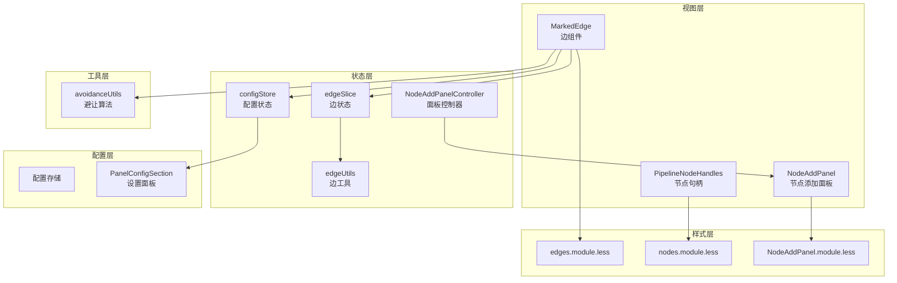
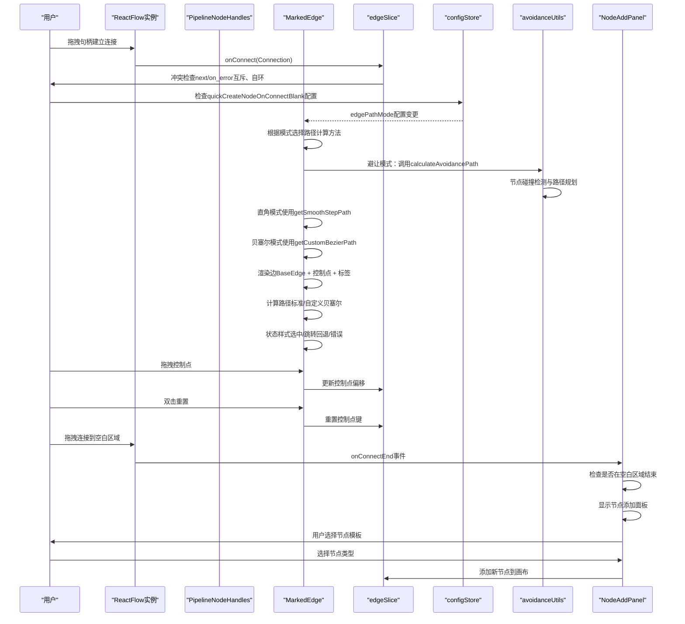
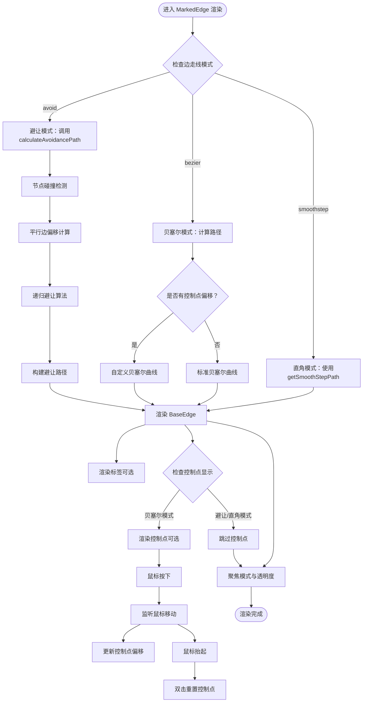
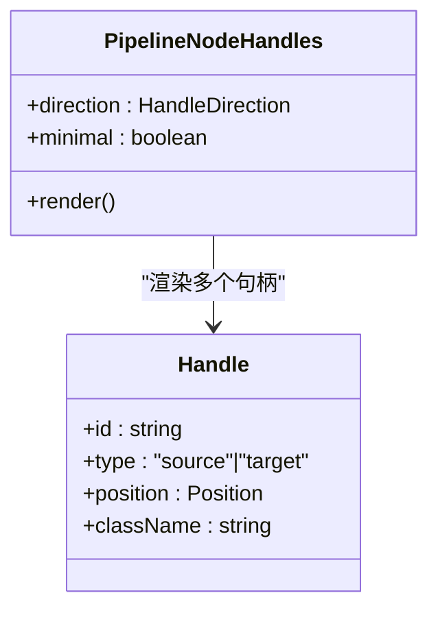
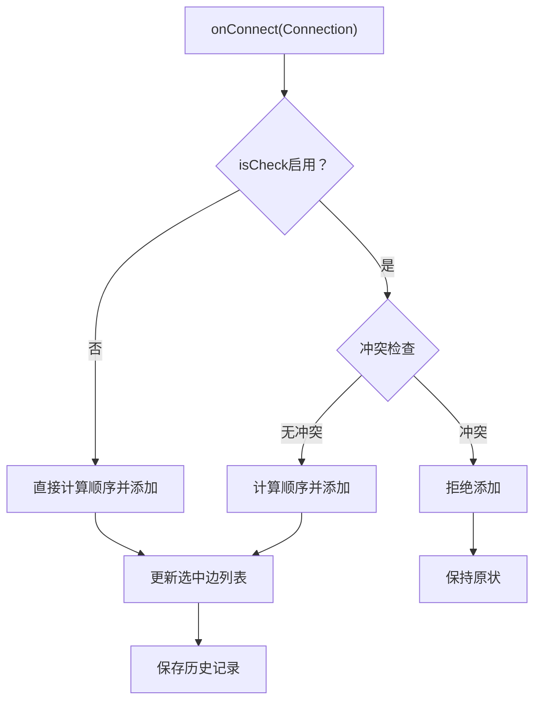
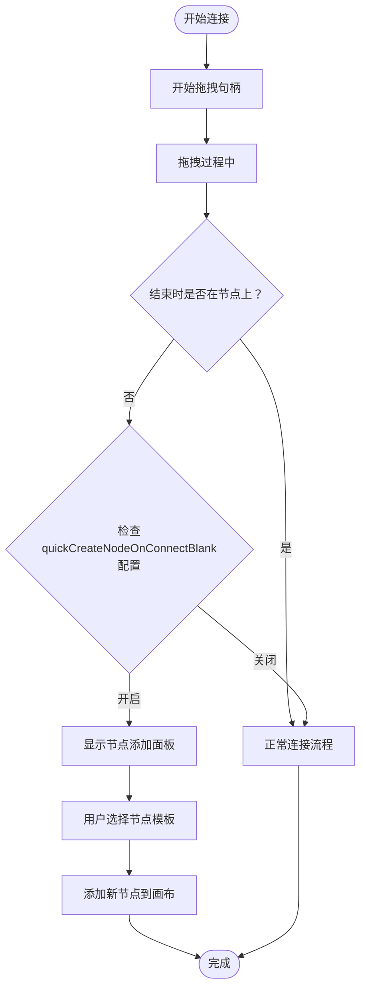
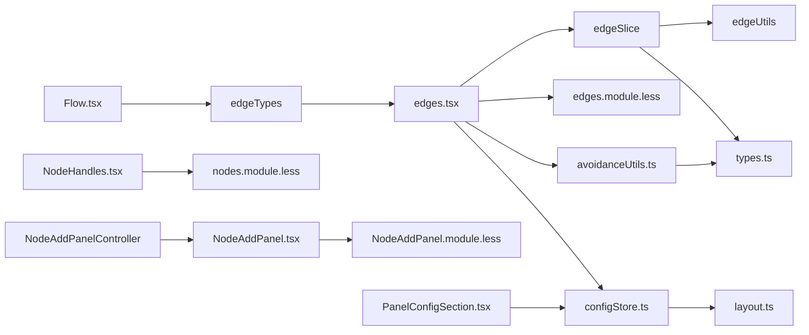

# 连接系统

<cite>
**本文档引用的文件**
- [edges.tsx](file://src/components/flow/edges.tsx)
- [NodeHandles.tsx](file://src/components/flow/nodes/components/NodeHandles.tsx)
- [constants.ts](file://src/components/flow/nodes/constants.ts)
- [edgeSlice.ts](file://src/stores/flow/slices/edgeSlice.ts)
- [edgeUtils.ts](file://src/stores/flow/utils/edgeUtils.ts)
- [avoidanceUtils.ts](file://src/core/avoidanceUtils.ts)
- [edges.module.less](file://src/styles/edges.module.less)
- [nodes.module.less](file://src/styles/nodes.module.less)
- [Flow.tsx](file://src/components/Flow.tsx)
- [types.ts](file://src/stores/flow/types.ts)
- [pathSlice.ts](file://src/stores/flow/slices/pathSlice.ts)
- [EdgePanel.tsx](file://src/components/panels/main/EdgePanel.tsx)
- [edgeLinker.ts](file://src/core/parser/edgeLinker.ts)
- [PanelConfigSection.tsx](file://src/components/panels/config/PanelConfigSection.tsx)
- [configStore.ts](file://src/stores/configStore.ts)
- [layout.ts](file://src/core/layout.ts)
- [NodeAddPanel.tsx](file://src/components/panels/main/NodeAddPanel.tsx)
</cite>

## 更新摘要
**变更内容**
- 新增智能节点创建功能：拖拽连接到空白画布区域会自动打开节点创建面板
- 新增 quickCreateNodeOnConnectBlank 配置项，支持用户控制此功能
- 新增 NodeAddPanel 组件，提供节点模板选择和预览功能
- 增强连接交互体验，提升用户操作效率

## 目录
1. [简介](#简介)
2. [项目结构](#项目结构)
3. [核心组件](#核心组件)
4. [架构总览](#架构总览)
5. [详细组件分析](#详细组件分析)
6. [依赖关系分析](#依赖关系分析)
7. [性能考量](#性能考量)
8. [故障排查指南](#故障排查指南)
9. [结论](#结论)

## 简介
本文件面向MaaPipelineEditor的连接系统，围绕"边（Edge）"与"节点句柄（Handle）"两大核心展开，系统性阐述：
- 边的实现原理：连接线绘制、样式定制、交互行为（拖拽控制点、标签渲染、聚焦效果）
- 节点句柄系统：输入句柄、输出句柄的配置与使用，支持多方向布局
- 连接验证机制：冲突检查（next与on_error互斥、自环限制）、边顺序管理
- 边的状态管理：选中、hover、跳转回退、错误等视觉反馈
- 连接的创建、删除、修改操作细节
- 连接样式定制指南：线条样式、箭头类型、颜色主题
- **新增**：智能节点创建功能，拖拽连接到空白画布区域自动打开节点创建面板
- **新增**：NodeAddPanel节点模板选择面板，提供丰富的节点类型选择
- **新增**：quickCreateNodeOnConnectBlank配置项，支持用户控制智能创建行为
- **新增**：增强的连接交互体验，提升用户操作效率
- **新增**：避让路由模式功能，支持智能路径规划和节点避让
- 性能优化与复杂网络图处理策略

## 项目结构
连接系统主要由以下层次构成：
- 视图层：边组件负责渲染与交互；节点句柄组件负责端点渲染；节点添加面板提供模板选择
- 状态层：Zustand slice维护边列表、边数据、边顺序、控制点重置键
- 工具层：边工具函数负责查找、筛选、排序；避让算法工具提供智能路径计算
- 样式层：Less模块化定义边与句柄的外观
- 配置层：全局配置影响边标签显示、控制点显示、聚焦透明度、边走线模式、智能创建功能等

**图表来源**
- [edges.tsx:296-439](file://src/components/flow/edges.tsx#L296-L439)
- [NodeHandles.tsx:37-131](file://src/components/flow/nodes/components/NodeHandles.tsx#L37-L131)
- [edgeSlice.ts:16-221](file://src/stores/flow/slices/edgeSlice.ts#L16-L221)
- [edgeUtils.ts:1-32](file://src/stores/flow/utils/edgeUtils.ts#L1-L32)
- [avoidanceUtils.ts:1-778](file://src/core/avoidanceUtils.ts#L1-L778)
- [edges.module.less:1-98](file://src/styles/edges.module.less#L1-L98)
- [nodes.module.less:316-537](file://src/styles/nodes.module.less#L316-L537)
- [NodeAddPanel.tsx:1-699](file://src/components/panels/main/NodeAddPanel.tsx#L1-L699)
- [PanelConfigSection.tsx:154-181](file://src/components/panels/config/PanelConfigSection.tsx#L154-L181)
- [configStore.ts:95-129](file://src/stores/configStore.ts#L95-L129)

**章节来源**
- [edges.tsx:1-675](file://src/components/flow/edges.tsx#L1-L675)
- [NodeHandles.tsx:1-254](file://src/components/flow/nodes/components/NodeHandles.tsx#L1-L254)
- [edgeSlice.ts:1-222](file://src/stores/flow/slices/edgeSlice.ts#L1-L222)
- [edgeUtils.ts:1-32](file://src/stores/flow/utils/edgeUtils.ts#L1-L32)
- [avoidanceUtils.ts:1-778](file://src/core/avoidanceUtils.ts#L1-L778)
- [edges.module.less:1-98](file://src/styles/edges.module.less#L1-L98)
- [nodes.module.less:316-537](file://src/styles/nodes.module.less#L316-L537)
- [NodeAddPanel.tsx:1-699](file://src/components/panels/main/NodeAddPanel.tsx#L1-L699)
- [PanelConfigSection.tsx:154-181](file://src/components/panels/config/PanelConfigSection.tsx#L154-L181)
- [configStore.ts:95-129](file://src/stores/configStore.ts#L95-L129)

## 核心组件
- MarkedEdge：自定义边组件，基于@xyflow/react的BaseEdge，支持：
  - **新增**：避让模式（avoid）智能路径规划，自动绕过节点障碍物
  - **新增**：直角走线模式（smoothstep）和贝塞尔曲线模式（bezier）两种路径计算
  - 自定义贝塞尔曲线路径（标准与带控制点的两套算法）
  - 可拖拽控制点调整曲线形状，双击重置
  - 标签渲染与透明度控制
  - 选中态、next/error、jumpback等状态样式
- PipelineNodeHandles：节点句柄组件，提供：
  - 输入句柄（target、jump_back）与输出句柄（next、error）
  - 支持四种方向布局（左右、右左、上下、下上）
  - 极简风格与常规风格两种外观
- edgeSlice：边状态管理，提供：
  - 添加边（含冲突检查、顺序计算）
  - 更新边数据（attributes）
  - 更新边顺序（label）
  - 删除边后的顺序补偿
  - 控制点重置键
- **新增**：NodeAddPanel：节点添加面板，提供：
  - 节点模板选择与预览
  - 搜索过滤功能
  - 快捷键操作支持
  - 粘贴板节点导入
  - 自定义模板管理
- **新增**：NodeAddPanelController：面板控制器，管理面板显示与位置
- 边工具：查找、筛选、顺序计算
- 避让算法工具：节点碰撞检测、平行边偏移计算、递归避让算法
- 样式：边、标签、控制点、句柄、节点面板的CSS类定义

**章节来源**
- [edges.tsx:296-439](file://src/components/flow/edges.tsx#L296-L439)
- [NodeHandles.tsx:37-131](file://src/components/flow/nodes/components/NodeHandles.tsx#L37-L131)
- [edgeSlice.ts:16-221](file://src/stores/flow/slices/edgeSlice.ts#L16-L221)
- [NodeAddPanel.tsx:277-699](file://src/components/panels/main/NodeAddPanel.tsx#L277-L699)
- [edgeUtils.ts:1-32](file://src/stores/flow/utils/edgeUtils.ts#L1-L32)
- [avoidanceUtils.ts:689-777](file://src/core/avoidanceUtils.ts#L689-L777)
- [edges.module.less:1-98](file://src/styles/edges.module.less#L1-L98)
- [nodes.module.less:316-537](file://src/styles/nodes.module.less#L316-L537)

## 架构总览
连接系统采用"视图-状态-工具-样式"的分层设计，通过@xyflow/react提供的节点与边渲染能力，结合Zustand进行状态管理，最终以Less样式完成视觉呈现。新增的避让算法工具提供了智能路径规划能力，智能节点创建功能提升了用户体验。

**图表来源**
- [Flow.tsx:248-262](file://src/components/Flow.tsx#L248-L262)
- [edgeSlice.ts:150-210](file://src/stores/flow/slices/edgeSlice.ts#L150-L210)
- [edges.tsx:362-427](file://src/components/flow/edges.tsx#L362-L427)
- [edgeUtils.ts:17-31](file://src/stores/flow/utils/edgeUtils.ts#L17-L31)
- [avoidanceUtils.ts:689-777](file://src/core/avoidanceUtils.ts#L689-L777)
- [PanelConfigSection.tsx:154-181](file://src/components/panels/config/PanelConfigSection.tsx#L154-L181)
- [NodeAddPanel.tsx:350-378](file://src/components/panels/main/NodeAddPanel.tsx#L350-L378)

**章节来源**
- [Flow.tsx:193-542](file://src/components/Flow.tsx#L193-L542)
- [edgeSlice.ts:16-221](file://src/stores/flow/slices/edgeSlice.ts#L16-L221)
- [edges.tsx:1-675](file://src/components/flow/edges.tsx#L1-L675)

## 详细组件分析

### 边（Edge）实现原理
- 路径计算
  - **新增**：避让模式（avoid）：智能路径规划，自动检测节点碰撞并计算最优绕行路径
  - **新增**：直角走线模式（smoothstep）：使用getSmoothStepPath生成阶梯状折线，路径规整清晰
  - 标准贝塞尔曲线：根据源/目标节点方向自动计算切线长度与控制点，保证连线平滑
  - 自定义贝塞尔曲线：支持拖拽控制点，动态调整曲线曲率，避免过近或过远导致的视觉拥挤
- 标签与控制点
  - 标签随路径居中显示，受"显示边标签"配置控制
  - **新增**：控制点仅在贝塞尔模式下显示和可用，避让和直角模式下禁用控制点拖拽
  - 控制点可拖拽调整曲线，双击重置；拖拽时高亮显示
- 状态样式
  - 选中态：加粗描边
  - next/error：不同颜色区分
  - jumpback：特殊橙色强调
  - 聚焦模式：根据选中节点/边或路径模式调整透明度
- 交互行为
  - 屏幕坐标到flow坐标转换，确保拖拽精度
  - 支持鼠标按下、移动、抬起事件链路
  - 双击重置控制点，触发状态更新

**图表来源**
- [edges.tsx:362-427](file://src/components/flow/edges.tsx#L362-L427)
- [avoidanceUtils.ts:379-576](file://src/core/avoidanceUtils.ts#L379-L576)
- [edges.module.less:63-97](file://src/styles/edges.module.less#L63-L97)
- [edges.tsx:430-439](file://src/components/flow/edges.tsx#L430-L439)
- [edges.tsx:565-577](file://src/components/flow/edges.tsx#L565-L577)

**章节来源**
- [edges.tsx:296-439](file://src/components/flow/edges.tsx#L296-L439)
- [avoidanceUtils.ts:1-778](file://src/core/avoidanceUtils.ts#L1-L778)
- [edges.module.less:1-98](file://src/styles/edges.module.less#L1-L98)

### 节点句柄（Handle）系统
- 句柄类型
  - 输入句柄：target（普通输入）、jump_back（跳转回退）
  - 输出句柄：next（正常流转）、error（错误流转）
- 方向配置
  - 支持四种方向：left-right、right-left、top-bottom、bottom-top
  - 根据方向自动映射到Position.Left/Right/Top/Bottom，并决定水平/垂直样式
- 样式风格
  - 常规风格：矩形端点，hover放大
  - 极简风格：圆形端点，hover放大并投影
- 位置更新
  - 当方向变化时，通过useUpdateNodeInternals强制刷新句柄位置

**图表来源**
- [NodeHandles.tsx:37-131](file://src/components/flow/nodes/components/NodeHandles.tsx#L37-L131)
- [constants.ts:1-47](file://src/components/flow/nodes/constants.ts#L1-L47)

**章节来源**
- [NodeHandles.tsx:1-254](file://src/components/flow/nodes/components/NodeHandles.tsx#L1-L254)
- [constants.ts:1-47](file://src/components/flow/nodes/constants.ts#L1-L47)
- [nodes.module.less:316-537](file://src/styles/nodes.module.less#L316-L537)

### 连接验证机制
- 冲突检查
  - next与on_error不能同时指向同一目标节点
  - on_error自环（source===target且sourceHandle===on_error）禁止
- 边顺序管理
  - 同一source+sourceHandle的多条边按label顺序排列
  - 删除边后，后续边label递减补偿
- 添加边流程
  - 可选isCheck开关，默认启用冲突检查
  - 计算当前source+sourceHandle下的边数量作为新边label
  - 通过@xyflow/react的addEdge统一接入

**图表来源**
- [edgeSlice.ts:150-210](file://src/stores/flow/slices/edgeSlice.ts#L150-L210)
- [edgeUtils.ts:17-31](file://src/stores/flow/utils/edgeUtils.ts#L17-L31)

**章节来源**
- [edgeSlice.ts:16-221](file://src/stores/flow/slices/edgeSlice.ts#L16-L221)
- [edgeUtils.ts:1-32](file://src/stores/flow/utils/edgeUtils.ts#L1-L32)

### 智能节点创建功能
- **新增**：当拖拽连接线到画布空白区域时，自动弹出节点添加面板
- **新增**：quickCreateNodeOnConnectBlank配置项，用户可控制此功能的启用/禁用
- **新增**：NodeAddPanel组件，提供节点模板选择、搜索过滤、预览等功能
- **新增**：支持键盘快捷键操作（上下箭头选择、Enter确认、Esc关闭）
- **新增**：支持从粘贴板导入节点，提高工作效率

**图表来源**
- [Flow.tsx:276-325](file://src/components/Flow.tsx#L276-L325)
- [NodeAddPanel.tsx:350-378](file://src/components/panels/main/NodeAddPanel.tsx#L350-L378)
- [PanelConfigSection.tsx:317-344](file://src/components/panels/config/PanelConfigSection.tsx#L317-L344)

**章节来源**
- [Flow.tsx:276-325](file://src/components/Flow.tsx#L276-L325)
- [NodeAddPanel.tsx:277-699](file://src/components/panels/main/NodeAddPanel.tsx#L277-L699)
- [PanelConfigSection.tsx:317-344](file://src/components/panels/config/PanelConfigSection.tsx#L317-L344)
- [configStore.ts:190](file://src/stores/configStore.ts#L190)

### 边的状态管理与视觉反馈
- 选中状态：边描边加粗
- hover状态：控制点显隐与hover态样式
- 错误状态：error输出句柄对应红色
- 跳转回退：jump_back目标句柄对应橙色
- 聚焦模式：根据选中节点/边或路径模式调整透明度，突出相关连接
- 调试模式：当源与目标节点均被执行时，边标记为已执行

**章节来源**
- [edges.tsx:413-451](file://src/components/flow/edges.tsx#L413-L451)
- [edges.module.less:40-61](file://src/styles/edges.module.less#L40-L61)

### 连接的创建、删除、修改
- 创建：Flow.onConnect -> edgeSlice.addEdge -> @xyflow/addEdge -> ReactFlow渲染
- 删除：ReactFlow删除边 -> edgeSlice.updateEdges -> 补偿后续边label
- 修改：拖拽控制点更新控制点偏移 -> 重新计算路径 -> 视觉更新；设置边数据通过setEdgeData

**章节来源**
- [Flow.tsx:248-262](file://src/components/Flow.tsx#L248-L262)
- [edgeSlice.ts:24-61](file://src/stores/flow/slices/edgeSlice.ts#L24-L61)

### 连接样式定制指南
- 线条样式
  - 描边宽度、虚线动画、过渡效果
  - 选中态加粗描边
- 箭头类型
  - 使用@xyflow/react默认箭头；可通过路径样式微调
- 颜色主题
  - next：绿色
  - error：红色
  - jumpback：橙色
  - jumpback+error：紫色
- **新增**：边走线模式
  - 曲线模式：使用贝塞尔曲线，线条平滑流畅
  - 直角模式：使用阶梯状折线，路径规整清晰
  - 避让模式：智能路径规划，自动绕过节点障碍物
- **新增**：智能节点创建
  - quickCreateNodeOnConnectBlank：控制是否启用智能创建功能
  - NodeAddPanel：提供节点模板选择与预览
- 控制点
  - 圆形、半透明背景、hover显隐
  - **仅在曲线模式下可用**
- 标签
  - 白色半透明背景、边框、选中态放大与加粗

**章节来源**
- [edges.module.less:1-98](file://src/styles/edges.module.less#L1-L98)
- [nodes.module.less:316-537](file://src/styles/nodes.module.less#L316-L537)
- [PanelConfigSection.tsx:154-181](file://src/components/panels/config/PanelConfigSection.tsx#L154-L181)
- [configStore.ts:95-129](file://src/stores/configStore.ts#L95-L129)

### 复杂网络图的处理策略
- 聚焦模式：通过焦点透明度与相关性判断，降低无关连接的视觉干扰
- 路径模式：DFS遍历所有可达路径，高亮路径上的节点与边，辅助分析
- 控制点：允许手动调整曲线，缓解密集连接的遮挡问题
- **新增**：避让模式：智能路径规划，自动绕过节点障碍物，适合复杂网络图
- **新增**：直角走线模式：在复杂网络中提供更规整的视觉布局
- **新增**：智能节点创建：提升复杂网络图的创建效率
- 性能建议：减少不必要的重渲染，合理使用memo与useMemo；在大量边场景下谨慎开启标签与控制点

**章节来源**
- [edges.tsx:370-411](file://src/components/flow/edges.tsx#L370-L411)
- [pathSlice.ts:9-87](file://src/stores/flow/slices/pathSlice.ts#L9-L87)

### 边走线模式配置系统
- **新增**：设置面板中的边走线模式选项
  - 曲线：使用贝塞尔曲线连接节点，线条平滑流畅
  - 直角：使用阶梯状折线连接节点，路径规整清晰
  - 避让：智能路径规划，自动绕过节点障碍物
- **新增**：配置状态管理
  - edgePathMode：控制当前使用的边路径模式
  - 默认值：bezier（贝塞尔曲线）
- **新增**：运行时切换
  - 用户可在设置面板中实时切换边走线模式
  - 切换后立即影响所有现有边的渲染

**章节来源**
- [PanelConfigSection.tsx:154-181](file://src/components/panels/config/PanelConfigSection.tsx#L154-L181)
- [configStore.ts:95-129](file://src/stores/configStore.ts#L95-L129)
- [edges.tsx:300-310](file://src/components/flow/edges.tsx#L300-L310)

### 避让算法系统
- **新增**：智能避让路径计算
  - 节点碰撞检测：使用Cohen-Sutherland算法思想检测线段与矩形相交
  - 平行边偏移计算：多条边连接相同节点时自动分散避免重叠
  - 递归避让算法：深度优先搜索最优绕行路径，支持最大递归深度限制
  - 自循环路径计算：特殊处理节点自连接情况
- **新增**：避让配置参数
  - maxRecursionDepth：最大递归深度，默认3
  - avoidMargin：避让边距，默认20像素
  - cornerRadius：转角圆角半径，默认8像素
  - directLineMaxDistance：直线连接最大距离，默认200像素
  - edgeOffsetStep：边之间避让的偏移步长，默认15像素
- **新增**：路径构建与优化
  - 支持直角转角圆角处理
  - 路径中点计算用于标签定位
  - 多种绕行策略（上、下、左、右）选择最短路径

**章节来源**
- [avoidanceUtils.ts:1-778](file://src/core/avoidanceUtils.ts#L1-L778)
- [edges.tsx:241-294](file://src/components/flow/edges.tsx#L241-L294)

### NodeAddPanel节点添加面板
- **新增**：节点模板选择与预览
  - 支持内置模板和自定义模板
  - 模板描述信息显示
  - 参数预览功能
- **新增**：搜索与过滤
  - 实时搜索节点模板
  - 支持关键词匹配
- **新增**：快捷键操作
  - 上下箭头键选择模板
  - Enter键确认添加
  - Esc键关闭面板
- **新增**：粘贴板集成
  - 支持从剪贴板导入节点
  - 粘贴多个节点到指定位置
- **新增**：自定义模板管理
  - 删除自定义模板
  - 模板分类标识

**章节来源**
- [NodeAddPanel.tsx:277-699](file://src/components/panels/main/NodeAddPanel.tsx#L277-L699)

## 依赖关系分析
- 视图层依赖状态层与样式层
- edgeSlice依赖edgeUtils与@xyflow/react
- MarkedEdge依赖配置存储、调试存储、节点方向信息
- Flow组件注册edgeTypes与nodeTypes，统一管理连接与渲染
- **新增**：configStore提供边走线模式配置
- **新增**：PanelConfigSection提供用户界面配置
- **新增**：avoidanceUtils提供智能避让算法支持
- **新增**：NodeAddPanel提供智能节点创建功能
- **新增**：NodeAddPanelController管理面板显示状态

**图表来源**
- [Flow.tsx:464-470](file://src/components/Flow.tsx#L464-L470)
- [edges.tsx:527-529](file://src/components/flow/edges.tsx#L527-L529)
- [edgeSlice.ts:1-14](file://src/stores/flow/slices/edgeSlice.ts#L1-L14)
- [types.ts:27-38](file://src/stores/flow/types.ts#L27-L38)
- [PanelConfigSection.tsx:154-181](file://src/components/panels/config/PanelConfigSection.tsx#L154-L181)
- [configStore.ts:95-129](file://src/stores/configStore.ts#L95-L129)
- [layout.ts:32](file://src/core/layout.ts#L32)
- [avoidanceUtils.ts:5-6](file://src/core/avoidanceUtils.ts#L5-L6)

**章节来源**
- [Flow.tsx:193-675](file://src/components/Flow.tsx#L193-L675)
- [edgeSlice.ts:1-221](file://src/stores/flow/slices/edgeSlice.ts#L1-L221)
- [edges.tsx:1-675](file://src/components/flow/edges.tsx#L1-L675)
- [PanelConfigSection.tsx:154-181](file://src/components/panels/config/PanelConfigSection.tsx#L154-L181)
- [configStore.ts:95-129](file://src/stores/configStore.ts#L95-L129)
- [avoidanceUtils.ts:1-778](file://src/core/avoidanceUtils.ts#L1-L778)

## 性能考量
- 路径计算复杂度
  - 避让模式：递归算法，时间复杂度取决于节点密度和递归深度
  - 直角模式（smoothstep）：使用getSmoothStepPath，计算效率高
  - 标准贝塞尔：O(1)，计算量小
  - 自定义贝塞尔：每次拖拽触发，但仅局部重绘
- 边顺序更新
  - 删除边时批量补偿label，避免重复渲染
- 聚焦与透明度
  - 通过isRelated与focusOpacity减少不必要的样式变更
- **新增**：智能节点创建性能优化
  - 面板延迟加载，仅在需要时显示
  - 模板搜索使用防抖机制，减少频繁渲染
  - 预览组件使用memo优化，避免重复计算
- **新增**：避让模式性能优化
  - 节点碰撞检测使用快速排斥试验减少计算量
  - 支持最大递归深度限制，防止无限递归
  - 平行边偏移计算避免路径重叠
- **新增**：直角走线模式性能优势
  - 直角路径计算简单，适合大规模网络图
  - 减少曲线计算开销，提升渲染性能
- 大规模网络
  - 建议在复杂场景下使用避让或直角模式，或关闭边标签与控制点

**章节来源**
- [avoidanceUtils.ts:379-576](file://src/core/avoidanceUtils.ts#L379-L576)
- [edges.tsx:370-411](file://src/components/flow/edges.tsx#L370-L411)
- [pathSlice.ts:9-87](file://src/stores/flow/slices/pathSlice.ts#L9-L87)
- [NodeAddPanel.tsx:446-478](file://src/components/panels/main/NodeAddPanel.tsx#L446-L478)

## 故障排查指南
- 无法创建连接
  - 检查是否触发了冲突检查（next与on_error互斥、自环）
  - 确认句柄方向与节点类型匹配
- 连接顺序异常
  - 删除边后label未补偿：确认edgeSlice.updateEdges逻辑
- 控制点不可见
  - **新增**：检查边走线模式是否为避让或直角模式
  - 检查配置项"显示边控制点"
  - 确认边处于拖拽态或存在偏移
- 样式不生效
  - 检查CSS类名拼写与覆盖优先级
  - 确认主题变量（如@next-color）正确注入
- **新增**：智能节点创建问题
  - 检查quickCreateNodeOnConnectBlank配置是否启用
  - 确认拖拽连接线是否在空白区域结束
  - 验证NodeAddPanel组件是否正确渲染
  - 检查键盘快捷键是否正常响应
- **新增**：NodeAddPanel功能异常
  - 确认面板位置计算逻辑
  - 检查模板搜索功能
  - 验证粘贴板导入功能
  - 确认自定义模板管理功能
- **新增**：避让模式问题
  - 确认边走线模式设置为"避让"
  - 检查节点碰撞检测是否正确
  - 验证递归深度限制设置是否合理
  - 确认避让边距和偏移配置符合预期
- **新增**：直角模式问题
  - 确认边走线模式设置为"直角"
  - 检查getSmoothStepPath是否正确调用
  - 验证直角路径的borderRadius设置为0

**章节来源**
- [edgeSlice.ts:150-210](file://src/stores/flow/slices/edgeSlice.ts#L150-L210)
- [edges.tsx:430-439](file://src/components/flow/edges.tsx#L430-L439)
- [edges.module.less:63-97](file://src/styles/edges.module.less#L63-L97)
- [avoidanceUtils.ts:689-777](file://src/core/avoidanceUtils.ts#L689-L777)
- [edges.tsx:300-310](file://src/components/flow/edges.tsx#L300-L310)
- [NodeAddPanel.tsx:350-378](file://src/components/panels/main/NodeAddPanel.tsx#L350-L378)

## 结论
MaaPipelineEditor的连接系统通过清晰的分层设计与完善的验证机制，实现了稳定、可定制、可交互的边与句柄体系。其核心优势在于：
- 可视化的路径编辑（控制点拖拽）
- 丰富的状态样式与聚焦模式
- 完备的冲突检查与顺序管理
- 易于扩展的样式与配置体系
- **新增**：灵活的边走线模式选择，支持曲线、直角和避让三种视觉风格
- **新增**：智能节点创建功能，显著提升用户体验和操作效率
- **新增**：NodeAddPanel节点模板选择面板，提供直观的节点创建体验
- **新增**：智能避让算法，自动检测节点碰撞并计算最优绕行路径
- **新增**：直角走线模式在复杂网络图中的性能优势

在复杂网络图场景下，建议结合路径模式与性能优化策略，以获得更佳的用户体验。智能节点创建功能特别适合需要快速构建工作流的场景，NodeAddPanel面板提供了丰富的节点类型选择和便捷的操作方式。避让模式特别适合需要智能路径规划的场景，直角模式适合需要规整布局的场景，而贝塞尔曲线模式则更适合追求流畅视觉效果的应用。