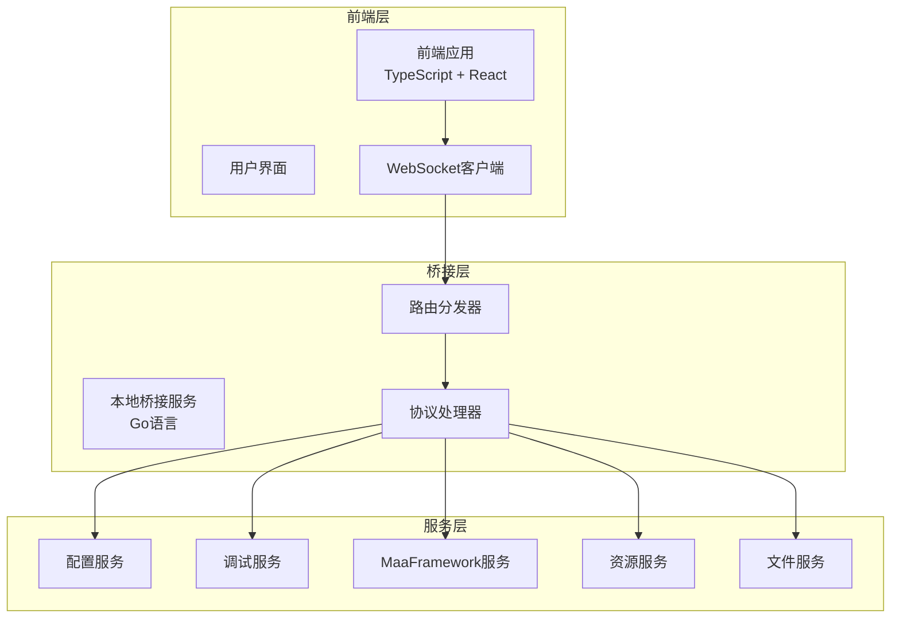
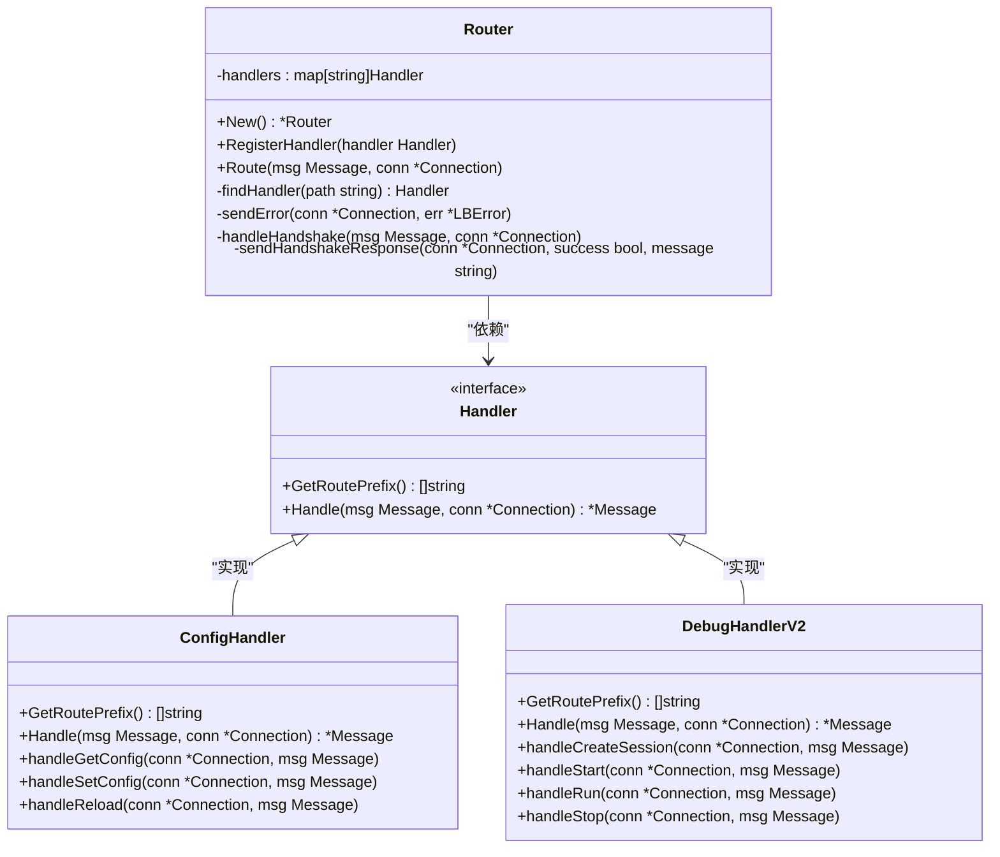
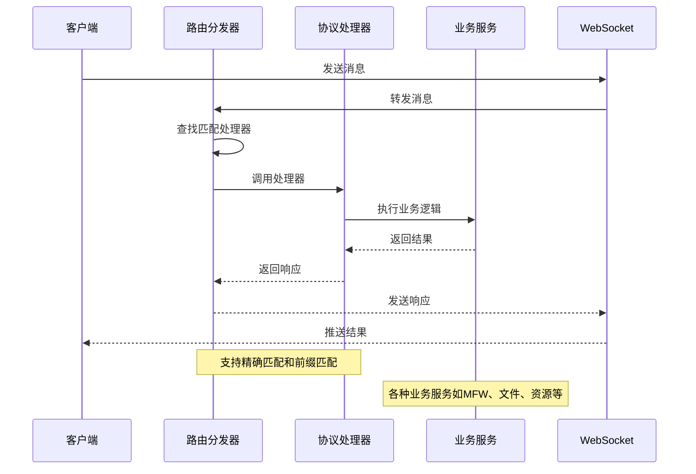
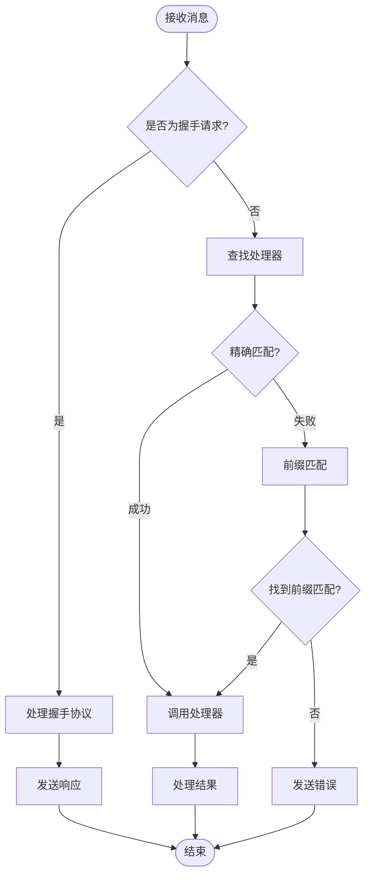
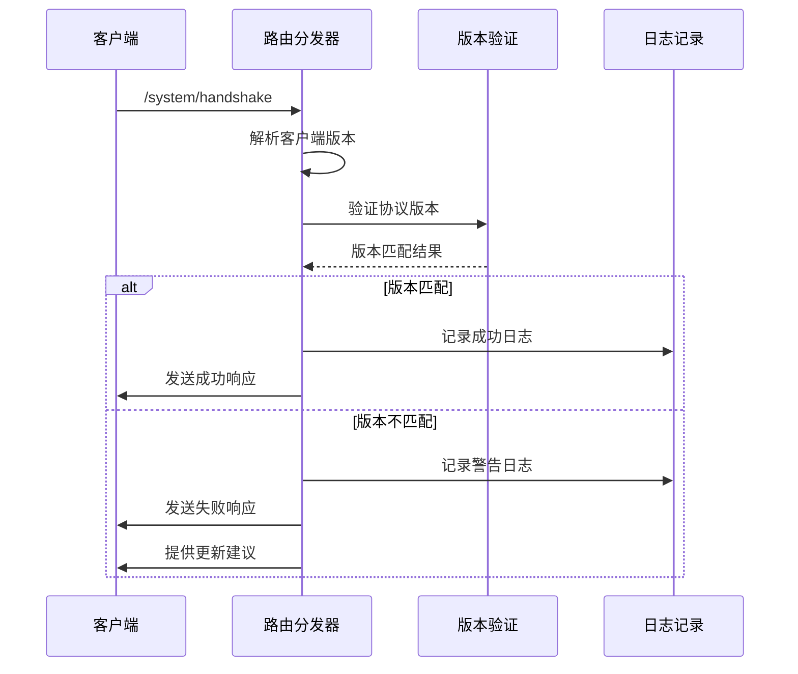
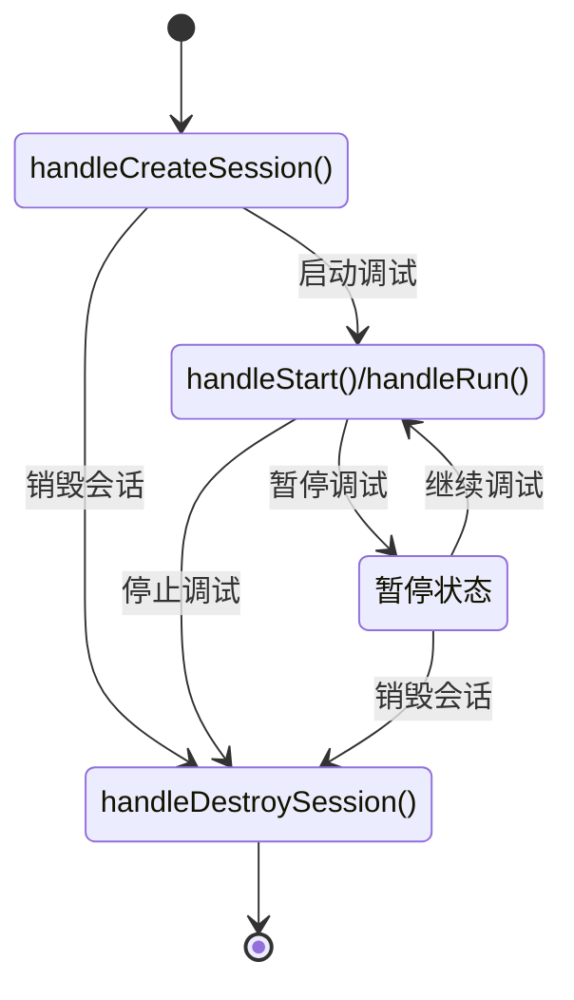
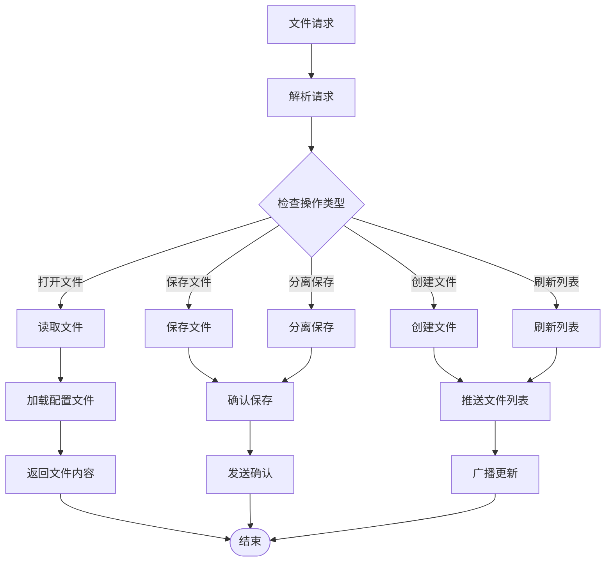
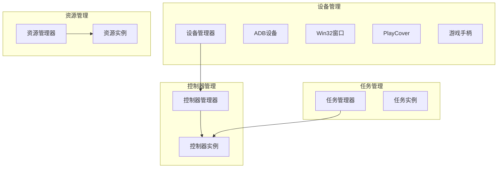
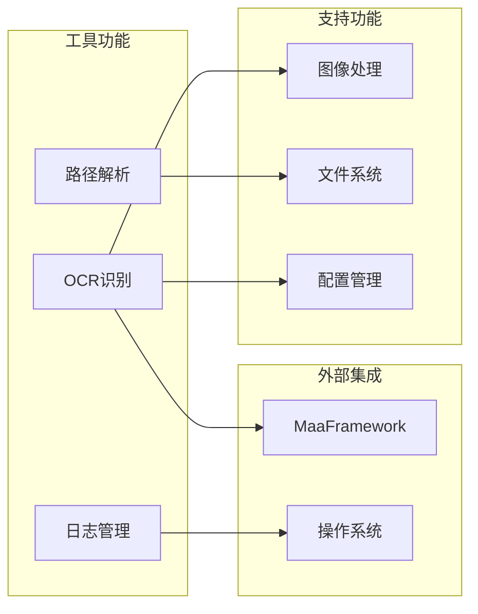
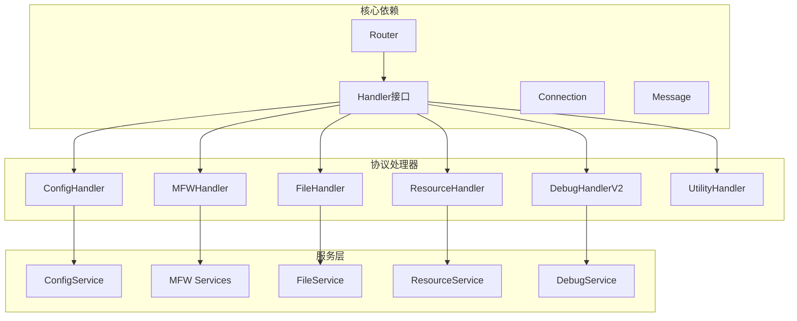

# 高级路由算法

<cite>
**本文档引用的文件**
- [router.go](file://LocalBridge/internal/router/router.go)
- [handler.go](file://LocalBridge/internal/protocol/config/handler.go)
- [handler.go](file://LocalBridge/internal/protocol/debug/handler_v2.go)
- [file_handler.go](file://LocalBridge/internal/protocol/file/file_handler.go)
- [handler.go](file://LocalBridge/internal/protocol/mfw/handler.go)
- [handler.go](file://LocalBridge/internal/protocol/resource/handler.go)
- [handler.go](file://LocalBridge/internal/protocol/utility/handler.go)
- [app.go](file://Extremer/app.go)
- [types.ts](file://src/core/parser/types.ts)
- [index.ts](file://src/core/parser/index.ts)
</cite>

## 目录
1. [简介](#简介)
2. [项目结构](#项目结构)
3. [核心组件](#核心组件)
4. [架构概览](#架构概览)
5. [详细组件分析](#详细组件分析)
6. [依赖分析](#依赖分析)
7. [性能考虑](#性能考虑)
8. [故障排除指南](#故障排除指南)
9. [结论](#结论)

## 简介

高级路由算法是MaaPipelineEditor项目中的核心通信机制，负责在本地桥接服务(LocalBridge)与前端应用之间建立高效、可靠的双向通信通道。该算法采用基于路径前缀的智能路由策略，支持精确匹配和前缀匹配两种模式，能够动态处理来自不同协议处理器的消息请求。

该项目采用Go语言构建，结合TypeScript前端界面，实现了完整的本地服务与Web前端的无缝集成。路由算法不仅处理基础的HTTP请求，还支持WebSocket实时通信，为复杂的管道编辑器提供了强大的后端支撑。

## 项目结构

项目采用模块化的三层架构设计：



**图表来源**
- [router.go:28-31](file://LocalBridge/internal/router/router.go#L28-L31)
- [app.go:291-297](file://Extremer/app.go#L291-L297)

**章节来源**
- [router.go:1-151](file://LocalBridge/internal/router/router.go#L1-L151)
- [app.go:1-620](file://Extremer/app.go#L1-L620)

## 核心组件

### 路由分发器(Router)

路由分发器是整个系统的核心组件，负责接收来自客户端的消息并将其分发到相应的协议处理器。其设计采用了接口抽象和多态机制，支持动态注册和注销处理器。



**图表来源**
- [router.go:19-31](file://LocalBridge/internal/router/router.go#L19-L31)
- [handler.go:12-23](file://LocalBridge/internal/protocol/config/handler.go#L12-L23)
- [handler.go:16-33](file://LocalBridge/internal/protocol/debug/handler_v2.go#L16-L33)

### 协议处理器体系

系统实现了多种协议处理器，每种处理器专注于特定的功能领域：

| 协议名称 | 路由前缀 | 功能范围 | 处理器数量 |
|---------|----------|----------|------------|
| Config | `/etl/config/` | 配置管理 | 1个 |
| Debug | `/mpe/debug/` | 调试控制 | 1个 |
| File | `/etl/open_file`, `/etl/save_file`, 等 | 文件操作 | 1个 |
| MFW | `/etl/mfw/` | MaaFramework集成 | 1个 |
| Resource | `/etl/get_image`, `/etl/get_images`, 等 | 资源管理 | 1个 |
| Utility | `/etl/utility/` | 工具功能 | 1个 |

**章节来源**
- [router.go:41-47](file://LocalBridge/internal/router/router.go#L41-L47)
- [handler.go:20-23](file://LocalBridge/internal/protocol/config/handler.go#L20-L23)
- [handler.go:30-33](file://LocalBridge/internal/protocol/debug/handler_v2.go#L30-L33)

## 架构概览

高级路由算法采用事件驱动的异步架构，支持高并发的消息处理：



**图表来源**
- [router.go:50-76](file://LocalBridge/internal/router/router.go#L50-L76)
- [handler.go:28-117](file://LocalBridge/internal/protocol/mfw/handler.go#L28-L117)

## 详细组件分析

### 路由匹配算法

路由匹配算法实现了双重匹配策略，确保消息能够准确路由到目标处理器：



**图表来源**
- [router.go:78-93](file://LocalBridge/internal/router/router.go#L78-L93)
- [router.go:49-76](file://LocalBridge/internal/router/router.go#L49-L76)

### 握手协议处理

握手协议是路由系统的重要组成部分，负责验证客户端版本兼容性和建立安全连接：



**图表来源**
- [router.go:107-133](file://LocalBridge/internal/router/router.go#L107-L133)
- [router.go:135-150](file://LocalBridge/internal/router/router.go#L135-L150)

### 配置协议处理器

配置协议处理器提供完整的配置管理功能，支持动态配置更新和热重载：

```mermaid
classDiagram
class ConfigHandler {
+GetRoutePrefix() []string
+Handle(msg Message, conn *Connection) *Message
+handleGetConfig(conn *Connection, msg Message)
+handleSetConfig(conn *Connection, msg Message)
+handleReload(conn *Connection, msg Message)
-toStringSlice(slice []interface{}) []string
-sendError(conn *Connection, err *LBError)
-sendConfigError(conn *Connection, code, message string, detail interface{})
}
class ConfigService {
+GetGlobal() *Config
+Save() error
+GetConfigFilePath() string
}
class EventBus {
+Publish(event Event, data interface{})
}
ConfigHandler --> ConfigService : "使用"
ConfigHandler --> EventBus : "发布事件"
```

**图表来源**
- [handler.go:12-47](file://LocalBridge/internal/protocol/config/handler.go#L12-L47)
- [handler.go:70-171](file://LocalBridge/internal/protocol/config/handler.go#L70-L171)

**章节来源**
- [handler.go:1-237](file://LocalBridge/internal/protocol/config/handler.go#L1-L237)

### 调试协议处理器V2

调试协议处理器V2提供了完整的调试会话管理功能：



**图表来源**
- [handler.go:85-137](file://LocalBridge/internal/protocol/debug/handler_v2.go#L85-L137)
- [handler.go:227-294](file://LocalBridge/internal/protocol/debug/handler_v2.go#L227-L294)

**章节来源**
- [handler.go:1-520](file://LocalBridge/internal/protocol/debug/handler_v2.go#L1-L520)

### 文件协议处理器

文件协议处理器实现了完整的文件操作功能，包括文件读取、保存、创建和列表管理：



**图表来源**
- [file_handler.go:66-137](file://LocalBridge/internal/protocol/file/file_handler.go#L66-L137)
- [file_handler.go:243-247](file://LocalBridge/internal/protocol/file/file_handler.go#L243-L247)

**章节来源**
- [file_handler.go:1-328](file://LocalBridge/internal/protocol/file/file_handler.go#L1-L328)

### MFW协议处理器

MFW协议处理器集成了MaaFramework的强大功能，支持多种设备控制和任务管理：



**图表来源**
- [handler.go:12-21](file://LocalBridge/internal/protocol/mfw/handler.go#L12-L21)
- [handler.go:119-117](file://LocalBridge/internal/protocol/mfw/handler.go#L119-L117)

**章节来源**
- [handler.go:1-800](file://LocalBridge/internal/protocol/mfw/handler.go#L1-L800)

### 资源协议处理器

资源协议处理器提供了高效的资源管理和图片获取功能：

```mermaid
classDiagram
class ResourceHandler {
+GetRoutePrefix() []string
+Handle(msg Message, conn *Connection) *Message
+handleGetImage(msg Message, conn *Connection) *Message
+handleGetImages(msg Message, conn *Connection) *Message
+handleGetImageList(msg Message, conn *Connection) *Message
+handleRefreshResources(msg Message, conn *Connection) *Message
-getImageData(relativePath string) GetImageResponse
-getMimeType(path string) string
-getImageSize(path string) (int, int)
-parseData(data interface{}, target interface{}) *LBError
-sendError(conn *Connection, err *LBError)
}
class ResourceService {
+FindImage(relativePath string) (string, string, bool)
+GetImageList(pipelinePath string) ([]ImageInfo, string, bool)
+GetBundleList() BundleList
+Scan() error
}
ResourceHandler --> ResourceService : "使用"
```

**图表来源**
- [handler.go:22-53](file://LocalBridge/internal/protocol/resource/handler.go#L22-L53)
- [handler.go:139-182](file://LocalBridge/internal/protocol/resource/handler.go#L139-L182)

**章节来源**
- [handler.go:1-272](file://LocalBridge/internal/protocol/resource/handler.go#L1-L272)

### 工具协议处理器

工具协议处理器提供了实用的功能，包括OCR识别、路径解析和日志管理：



**图表来源**
- [handler.go:24-41](file://LocalBridge/internal/protocol/utility/handler.go#L24-L41)
- [handler.go:452-514](file://LocalBridge/internal/protocol/utility/handler.go#L452-L514)

**章节来源**
- [handler.go:1-694](file://LocalBridge/internal/protocol/utility/handler.go#L1-L694)

## 依赖分析

系统采用松耦合的设计原则，各组件之间的依赖关系清晰明确：



**图表来源**
- [router.go:1-11](file://LocalBridge/internal/router/router.go#L1-L11)
- [handler.go:1-10](file://LocalBridge/internal/protocol/config/handler.go#L1-L10)

**章节来源**
- [router.go:1-11](file://LocalBridge/internal/router/router.go#L1-L11)
- [handler.go:1-10](file://LocalBridge/internal/protocol/config/handler.go#L1-L10)

## 性能考虑

高级路由算法在设计时充分考虑了性能优化：

### 内存管理
- 使用sync.Map优化处理器查找性能
- 实现连接池减少资源分配开销
- 采用对象复用避免频繁GC

### 网络优化
- 支持WebSocket长连接减少握手开销
- 实现消息队列处理高并发请求
- 采用异步处理避免阻塞

### 缓存策略
- 配置文件缓存减少磁盘I/O
- 资源列表缓存提升响应速度
- 图像数据缓存优化图片访问

## 故障排除指南

### 常见问题及解决方案

| 问题类型 | 症状 | 可能原因 | 解决方案 |
|---------|------|----------|----------|
| 路由错误 | 404错误 | 路由前缀不匹配 | 检查处理器注册 |
| 握手失败 | 连接被拒绝 | 版本不兼容 | 更新客户端版本 |
| 处理器异常 | 500错误 | 处理器实现错误 | 检查处理器逻辑 |
| 资源访问失败 | 404错误 | 资源路径无效 | 验证资源配置 |

### 调试技巧

1. **启用详细日志**：在配置中设置日志级别为DEBUG
2. **监控连接状态**：使用WebSocket调试工具观察连接状态
3. **分析处理器负载**：监控各处理器的处理时间和错误率
4. **检查内存使用**：定期检查内存泄漏和对象生命周期

**章节来源**
- [router.go:95-105](file://LocalBridge/internal/router/router.go#L95-L105)
- [handler.go:597-693](file://LocalBridge/internal/protocol/utility/handler.go#L597-L693)

## 结论

高级路由算法作为MaaPipelineEditor项目的核心通信机制，展现了优秀的架构设计和实现质量。通过采用接口抽象、事件驱动和异步处理等现代软件工程实践，该算法不仅提供了高性能的消息路由能力，还具备良好的可扩展性和可维护性。

算法的主要优势包括：
- **灵活的路由策略**：支持精确匹配和前缀匹配，适应复杂的消息路由需求
- **模块化设计**：协议处理器独立实现，便于功能扩展和维护
- **高性能实现**：优化的数据结构和算法，支持高并发场景
- **完善的错误处理**：全面的错误捕获和恢复机制

未来可以在以下方面进一步优化：
- 实现更智能的负载均衡机制
- 增加路由规则的动态配置能力
- 优化大规模消息处理的性能表现
- 增强路由系统的监控和诊断功能