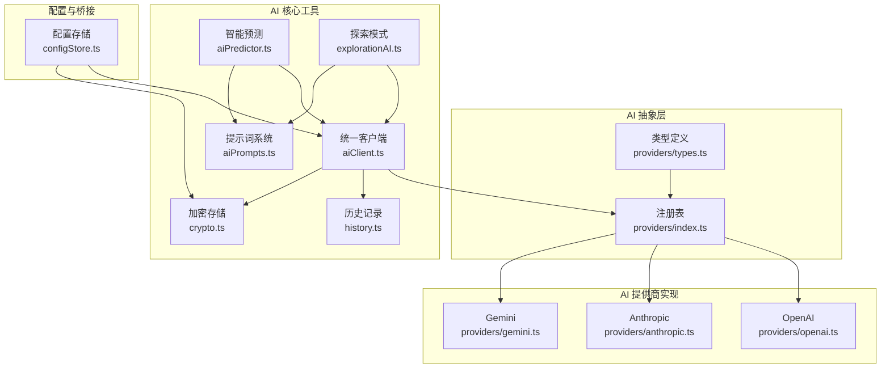
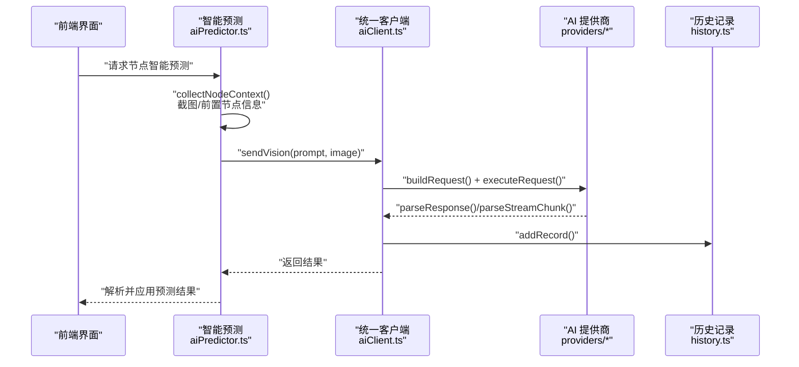
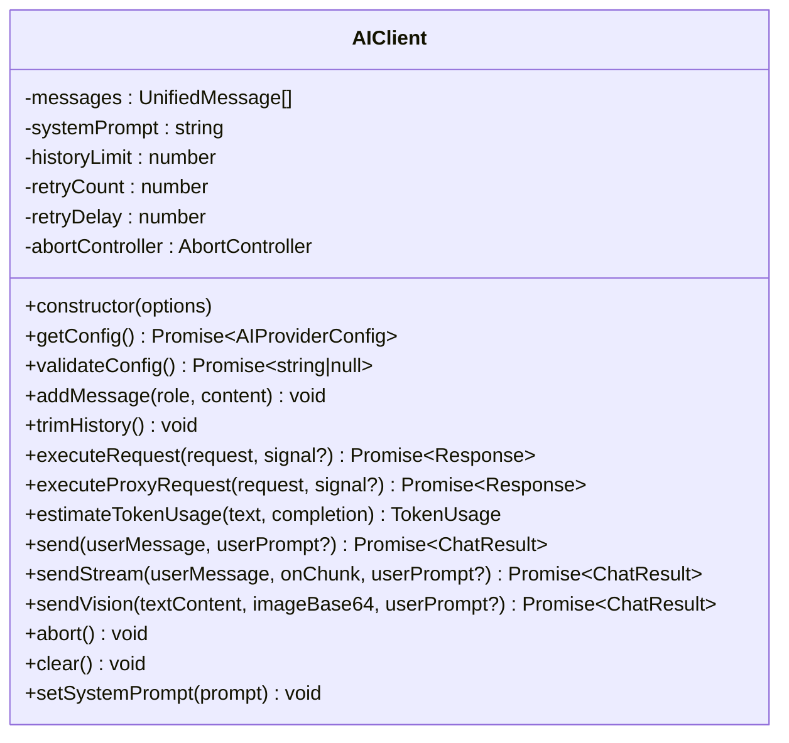
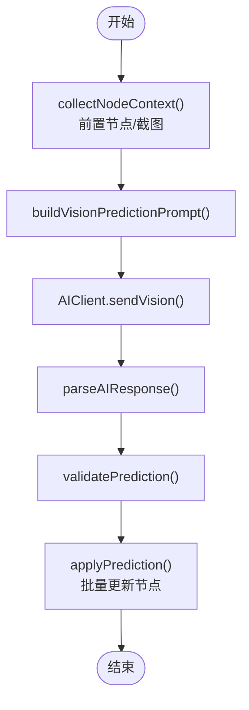
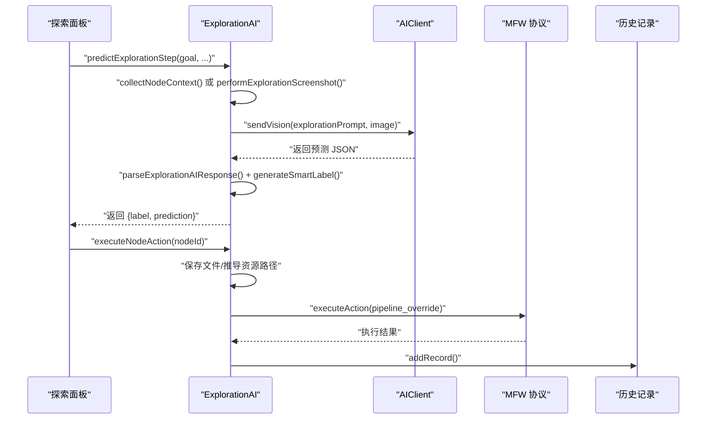
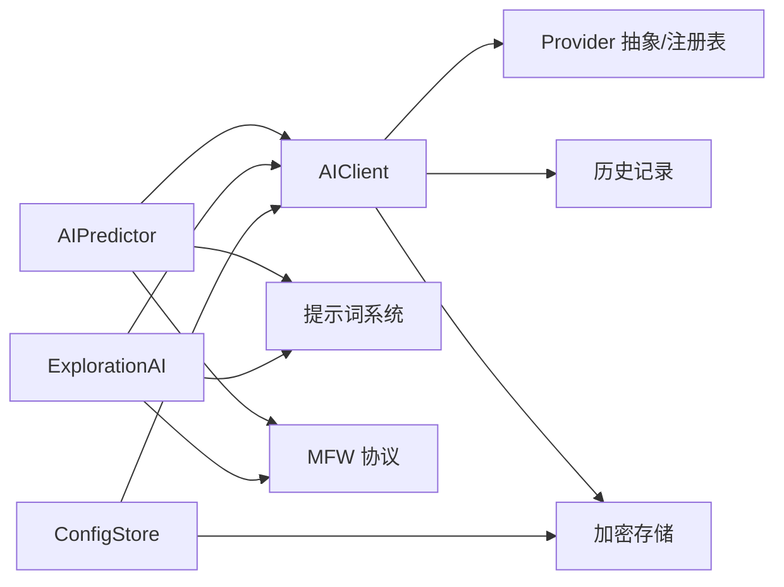

# AI助手集成

<cite>
**本文档引用的文件**
- [aiClient.ts](file://src/utils/ai/aiClient.ts)
- [aiPredictor.ts](file://src/utils/ai/aiPredictor.ts)
- [explorationAI.ts](file://src/utils/ai/explorationAI.ts)
- [history.ts](file://src/utils/ai/history.ts)
- [aiPrompts.ts](file://src/utils/ai/aiPrompts.ts)
- [crypto.ts](file://src/utils/ai/crypto.ts)
- [providers/index.ts](file://src/utils/ai/providers/index.ts)
- [providers/openai.ts](file://src/utils/ai/providers/openai.ts)
- [providers/anthropic.ts](file://src/utils/ai/providers/anthropic.ts)
- [providers/gemini.ts](file://src/utils/ai/providers/gemini.ts)
- [providers/types.ts](file://src/utils/ai/providers/types.ts)
- [configStore.ts](file://src/stores/configStore.ts)
</cite>

## 目录
1. [简介](#简介)
2. [项目结构](#项目结构)
3. [核心组件](#核心组件)
4. [架构总览](#架构总览)
5. [详细组件分析](#详细组件分析)
6. [依赖关系分析](#依赖关系分析)
7. [性能考虑](#性能考虑)
8. [故障排查指南](#故障排查指南)
9. [结论](#结论)
10. [附录](#附录)

## 简介
本项目实现了面向 MaaFramework Pipeline 的 AI 助手集成，涵盖多 AI 厂商支持、智能预测算法、提示词系统、探索模式决策、历史记录管理以及安全加密存储。本文档从架构、组件、数据流、算法到扩展与优化策略进行全面解读，帮助开发者理解并高效使用与扩展 AI 能力。

## 项目结构
AI 相关代码集中在 `src/utils/ai` 目录，采用“抽象层 + 多提供商 + 工具函数”的分层设计：
- 抽象层：统一的 Provider 接口与注册表，屏蔽各厂商差异
- 多提供商：OpenAI、Anthropic、Gemini 以及自定义兼容实现
- 工具函数：提示词构建、历史记录、加密存储、预测与探索算法
- 配置与桥接：与前端配置存储、本地服务代理、设备截图等集成



图表来源
- [providers/types.ts:1-98](file://src/utils/ai/providers/types.ts#L1-L98)
- [providers/index.ts:1-93](file://src/utils/ai/providers/index.ts#L1-L93)
- [providers/openai.ts:1-170](file://src/utils/ai/providers/openai.ts#L1-L170)
- [providers/anthropic.ts:1-205](file://src/utils/ai/providers/anthropic.ts#L1-L205)
- [providers/gemini.ts:1-197](file://src/utils/ai/providers/gemini.ts#L1-L197)
- [aiClient.ts:1-520](file://src/utils/ai/aiClient.ts#L1-L520)
- [aiPredictor.ts:1-583](file://src/utils/ai/aiPredictor.ts#L1-L583)
- [explorationAI.ts:1-567](file://src/utils/ai/explorationAI.ts#L1-L567)
- [history.ts:1-68](file://src/utils/ai/history.ts#L1-L68)
- [aiPrompts.ts:1-445](file://src/utils/ai/aiPrompts.ts#L1-L445)
- [crypto.ts:1-120](file://src/utils/ai/crypto.ts#L1-L120)
- [configStore.ts:1-440](file://src/stores/configStore.ts#L1-L440)

章节来源
- [providers/types.ts:1-98](file://src/utils/ai/providers/types.ts#L1-L98)
- [providers/index.ts:1-93](file://src/utils/ai/providers/index.ts#L1-L93)
- [aiClient.ts:1-520](file://src/utils/ai/aiClient.ts#L1-L520)
- [aiPredictor.ts:1-583](file://src/utils/ai/aiPredictor.ts#L1-L583)
- [explorationAI.ts:1-567](file://src/utils/ai/explorationAI.ts#L1-L567)
- [history.ts:1-68](file://src/utils/ai/history.ts#L1-L68)
- [aiPrompts.ts:1-445](file://src/utils/ai/aiPrompts.ts#L1-L445)
- [crypto.ts:1-120](file://src/utils/ai/crypto.ts#L1-L120)
- [configStore.ts:1-440](file://src/stores/configStore.ts#L1-L440)

## 核心组件
- 统一 AI 客户端（AIClient）：封装消息历史、重试、代理转发、CORS 适配、流式/非流式响应、Vision 图像输入、Token 用量估算与历史记录写入
- 智能预测（AIPredictor）：节点上下文采集、截图获取、提示词构建、AI 预测解析、结果校验与应用
- 探索模式（ExplorationAI）：基于目标的节点预测、智能标签生成、节点动作执行
- 提示词系统（aiPrompts）：协议规范、示例、用户提示词构建、搜索提示词
- 历史记录（history）：全局 AI 交互记录的增删查与订阅
- 加密存储（crypto）：基于浏览器指纹派生密钥的 API Key 加密/解密
- 多提供商（providers）：抽象接口 + OpenAI/Anthropic/Gemini 实现 + 注册表与自动检测

章节来源
- [aiClient.ts:45-520](file://src/utils/ai/aiClient.ts#L45-L520)
- [aiPredictor.ts:1-583](file://src/utils/ai/aiPredictor.ts#L1-L583)
- [explorationAI.ts:1-567](file://src/utils/ai/explorationAI.ts#L1-L567)
- [aiPrompts.ts:1-445](file://src/utils/ai/aiPrompts.ts#L1-L445)
- [history.ts:1-68](file://src/utils/ai/history.ts#L1-L68)
- [crypto.ts:1-120](file://src/utils/ai/crypto.ts#L1-L120)
- [providers/index.ts:1-93](file://src/utils/ai/providers/index.ts#L1-L93)

## 架构总览
AI 功能通过统一客户端对接多提供商，结合提示词系统与历史记录，形成从“上下文采集 → 提示词构建 → AI 推理 → 结果解析与校验 → 应用到节点”的闭环；探索模式在此基础上增加目标驱动的预测与执行。



图表来源
- [aiPredictor.ts:311-342](file://src/utils/ai/aiPredictor.ts#L311-L342)
- [aiClient.ts:287-391](file://src/utils/ai/aiClient.ts#L287-L391)
- [providers/openai.ts:108-169](file://src/utils/ai/providers/openai.ts#L108-L169)
- [history.ts:32-41](file://src/utils/ai/history.ts#L32-L41)

## 详细组件分析

### 统一 AI 客户端（AIClient）
- 职责：维护消息历史、配置校验、代理/直连切换、CORS 适配、重试策略、流式/非流式响应、Vision 图像输入、Token 用量估算、历史记录写入
- 关键机制：
  - 历史裁剪：按系统消息与用户/助手消息比例维持上限
  - 代理转发：通过本地服务协议将请求转发，规避浏览器 CORS 限制
  - 错误处理：区分 CORS 类错误与网络错误，提供用户友好提示
  - 估算用量：基于字符长度估算 Prompt/Completion Token
- 方法族：send/sendStream/sendVision/abort/clear/setSystemPrompt



图表来源
- [aiClient.ts:45-520](file://src/utils/ai/aiClient.ts#L45-L520)

章节来源
- [aiClient.ts:45-520](file://src/utils/ai/aiClient.ts#L45-L520)

### 智能预测算法（AIPredictor）
- 职责：节点上下文采集、截图获取、提示词构建、AI 预测、结果解析与校验、应用到节点
- 上下文采集：前置节点类型与连接关系、节点 JSON、截图
- 截图流程：通过 MFW 协议请求截图，带超时与结果校验
- 预测流程：构建 Vision 提示词 → 调用 AIClient → 解析 JSON → 校验类型与参数
- 校验规则：识别/动作类型合法性、参数集合有效性、互斥参数排除、特殊类型约束（如 DirectHit 无参数）



图表来源
- [aiPredictor.ts:172-342](file://src/utils/ai/aiPredictor.ts#L172-L342)
- [aiPrompts.ts:402-410](file://src/utils/ai/aiPrompts.ts#L402-L410)

章节来源
- [aiPredictor.ts:172-583](file://src/utils/ai/aiPredictor.ts#L172-L583)
- [aiPrompts.ts:338-444](file://src/utils/ai/aiPrompts.ts#L338-L444)

### 探索模式 AI（ExplorationAI）
- 职责：目标驱动的节点预测、智能标签生成、节点动作执行
- 预测差异：使用探索提示词，强调目标描述与可交互元素识别
- 标签生成：若 AI 未返回 label，则从 reasoning 或动作/识别类型智能生成
- 执行流程：保存文件 → 推导资源路径 → 构建 pipeline_override → 通过 MFW 协议执行



图表来源
- [explorationAI.ts:70-231](file://src/utils/ai/explorationAI.ts#L70-L231)
- [explorationAI.ts:344-518](file://src/utils/ai/explorationAI.ts#L344-L518)

章节来源
- [explorationAI.ts:1-567](file://src/utils/ai/explorationAI.ts#L1-L567)

### 提示词系统与上下文管理
- 协议规范：统一的 Pipeline 协议速查、关键约束、命名语义映射、单节点设计模式
- 示例引导：大量正确/错误示例，指导输出格式与参数选择
- 用户提示词：根据节点上下文动态构建，包含前置节点 JSON、连接类型、分析要求与输出格式
- 搜索提示词：节点检索助手，仅返回最匹配节点名称

章节来源
- [aiPrompts.ts:1-445](file://src/utils/ai/aiPrompts.ts#L1-L445)

### 历史记录管理
- 数据结构：包含时间戳、用户提示词、实际消息、响应内容、成功标志、错误信息、图像信息、Token 用量等
- 管理器：支持添加、查询、清空、订阅变更
- 与客户端集成：每次请求完成后写入历史记录，便于回溯与诊断

章节来源
- [history.ts:1-68](file://src/utils/ai/history.ts#L1-L68)
- [aiClient.ts:249-256](file://src/utils/ai/aiClient.ts#L249-L256)

### 多提供商支持机制
- 抽象接口：统一 buildRequest、parseResponse、parseStreamChunk 等方法
- 注册表：集中管理提供商，支持按类型获取与 UI 选项
- 自动检测：根据 URL 推断提供商类型
- 兼容实现：Custom Provider 与 OpenAI 格式完全一致，便于第三方兼容

```mermaid
classDiagram
class AIProvider {
<<interface>>
+type : AIProviderType
+displayName : string
+defaultBaseUrl : string
+models : string[]
+visionModels : string[]
+buildRequest(messages, config, options) ProviderRequest
+parseResponse(responseBody) {content, usage?}
+parseStreamChunk(line) string|null
+parseStreamUsage?(finalData) TokenUsage
}
class OpenAIProvider
class AnthropicProvider
class GeminiProvider
class CustomProvider
AIProvider <|.. OpenAIProvider
AIProvider <|.. AnthropicProvider
AIProvider <|.. GeminiProvider
OpenAIProvider <|-- CustomProvider
```

图表来源
- [providers/types.ts:61-98](file://src/utils/ai/providers/types.ts#L61-L98)
- [providers/index.ts:18-42](file://src/utils/ai/providers/index.ts#L18-L42)
- [providers/openai.ts:86-170](file://src/utils/ai/providers/openai.ts#L86-L170)
- [providers/anthropic.ts:85-205](file://src/utils/ai/providers/anthropic.ts#L85-L205)
- [providers/gemini.ts:75-197](file://src/utils/ai/providers/gemini.ts#L75-L197)

章节来源
- [providers/types.ts:1-98](file://src/utils/ai/providers/types.ts#L1-L98)
- [providers/index.ts:1-93](file://src/utils/ai/providers/index.ts#L1-L93)
- [providers/openai.ts:1-170](file://src/utils/ai/providers/openai.ts#L1-L170)
- [providers/anthropic.ts:1-205](file://src/utils/ai/providers/anthropic.ts#L1-L205)
- [providers/gemini.ts:1-197](file://src/utils/ai/providers/gemini.ts#L1-L197)

### 加密存储与配置
- API Key 加密：基于浏览器指纹派生密钥（PBKDF2 + AES-GCM），密文前缀标识
- 配置存储：Zustand 状态管理，自动加密/解密，支持缓存持久化与迁移
- 代理开关：根据配置决定直连或通过本地服务代理转发

章节来源
- [crypto.ts:1-120](file://src/utils/ai/crypto.ts#L1-L120)
- [configStore.ts:1-440](file://src/stores/configStore.ts#L1-L440)
- [aiClient.ts:135-180](file://src/utils/ai/aiClient.ts#L135-L180)

## 依赖关系分析
- 组件耦合：
  - AIClient 依赖 Provider 抽象与注册表，与历史记录与加密模块松耦合
  - AIPredictor/ExplorationAI 依赖 AIClient 与提示词系统，与设备截图协议耦合
  - 提示词系统与协议规范相互独立，便于维护
- 外部依赖：
  - 浏览器 Web Crypto API（加密）
  - 本地服务 WebSocket 协议（代理转发）
  - MFW 设备截图协议（探索模式执行）



图表来源
- [aiClient.ts:1-18](file://src/utils/ai/aiClient.ts#L1-L18)
- [providers/index.ts:1-16](file://src/utils/ai/providers/index.ts#L1-L16)
- [history.ts:1-68](file://src/utils/ai/history.ts#L1-L68)
- [crypto.ts:1-120](file://src/utils/ai/crypto.ts#L1-L120)
- [aiPredictor.ts:1-18](file://src/utils/ai/aiPredictor.ts#L1-L18)
- [explorationAI.ts:1-18](file://src/utils/ai/explorationAI.ts#L1-L18)
- [configStore.ts:1-440](file://src/stores/configStore.ts#L1-L440)

章节来源
- [aiClient.ts:1-18](file://src/utils/ai/aiClient.ts#L1-L18)
- [providers/index.ts:1-16](file://src/utils/ai/providers/index.ts#L1-L16)
- [aiPredictor.ts:1-18](file://src/utils/ai/aiPredictor.ts#L1-L18)
- [explorationAI.ts:1-18](file://src/utils/ai/explorationAI.ts#L1-L18)
- [configStore.ts:1-440](file://src/stores/configStore.ts#L1-L440)

## 性能考虑
- Token 估算：以字符长度估算 Prompt/Completion Token，辅助成本控制
- 历史裁剪：限制非系统消息数量，降低上下文长度与往返时间
- 重试策略：指数退避与最大重试次数，避免瞬时网络波动影响
- 代理转发：在浏览器受限环境下通过本地服务绕过 CORS，提高成功率
- 视觉输入：合理使用 ROI 限定识别区域，减少误识别与计算开销
- 流式响应：优先使用流式接口，改善用户体验与首字延迟

## 故障排查指南
- CORS 相关错误：客户端会识别浏览器 CORS 错误并提示启用本地服务代理或调整 API 跨域设置
- 配置缺失：API URL、API Key、模型名称缺失时直接返回错误，检查配置存储与加密状态
- 代理不可用：确认本地服务连接状态，代理请求失败时回退直连
- 截图失败：检查设备连接状态与截图协议回调，必要时增加超时与重试
- AI 返回格式异常：解析失败时抛出异常，建议检查提示词构建与模型输出稳定性

章节来源
- [aiClient.ts:113-133](file://src/utils/ai/aiClient.ts#L113-L133)
- [aiClient.ts:203-282](file://src/utils/ai/aiClient.ts#L203-L282)
- [explorationAI.ts:523-566](file://src/utils/ai/explorationAI.ts#L523-L566)

## 结论
本项目通过抽象层与多提供商机制，实现了跨厂商的统一 AI 能力；借助完善的提示词系统、历史记录与加密存储，保障了易用性与安全性；智能预测与探索模式将 AI 从“问答”拓展到“工程化配置”，显著提升了工作流节点构建效率。建议在生产环境中结合代理转发、合理的重试与超时策略，并持续优化提示词与参数校验规则。

## 附录

### 开发指南与最佳实践（提供商扩展）
- 新增提供商步骤：
  1) 在 providers 目录新增实现文件，导出符合 AIProvider 接口的对象
  2) 在 providers/index.ts 中注册到 providerRegistry，并补充 UI 选项
  3) 如需自动检测，完善 detectProviderFromUrl 的 URL 匹配逻辑
  4) 在 AIClient 中无需修改即可使用新提供商
- 最佳实践：
  - 严格遵循统一消息格式与 Vision 图像封装
  - 提供默认模型与 Vision 模型清单，便于 UI 展示
  - 实现 parseStreamUsage（如可用）以获得更准确的 Token 统计
  - 保持错误处理一致性，返回可读性强的错误信息

章节来源
- [providers/types.ts:61-98](file://src/utils/ai/providers/types.ts#L61-L98)
- [providers/index.ts:18-77](file://src/utils/ai/providers/index.ts#L18-L77)
- [providers/openai.ts:86-170](file://src/utils/ai/providers/openai.ts#L86-L170)
- [providers/anthropic.ts:85-205](file://src/utils/ai/providers/anthropic.ts#L85-L205)
- [providers/gemini.ts:75-197](file://src/utils/ai/providers/gemini.ts#L75-L197)