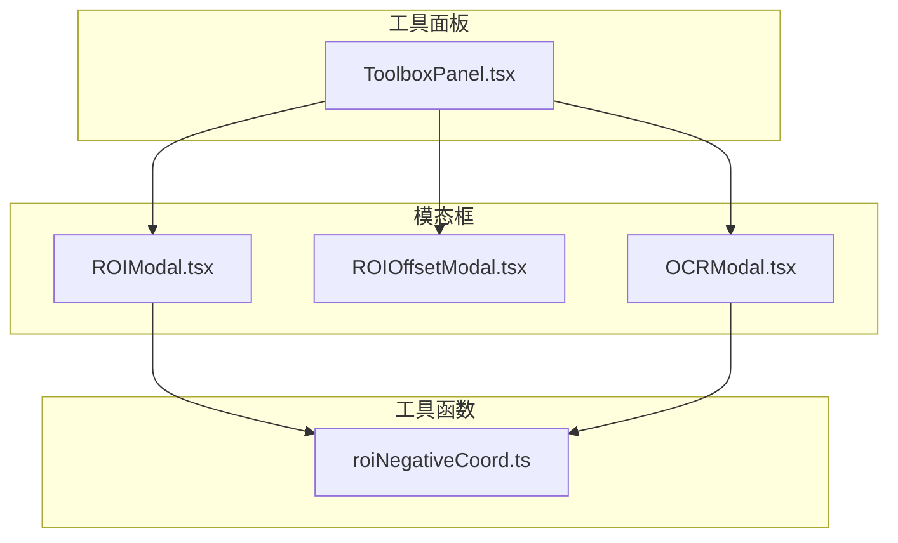
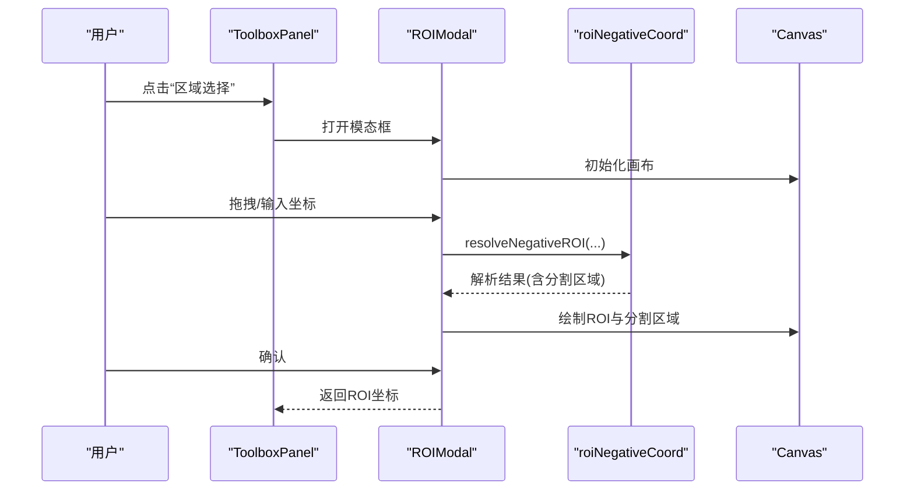
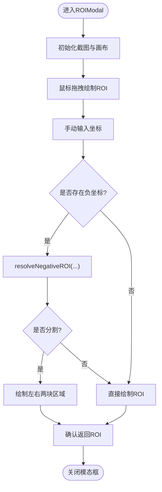
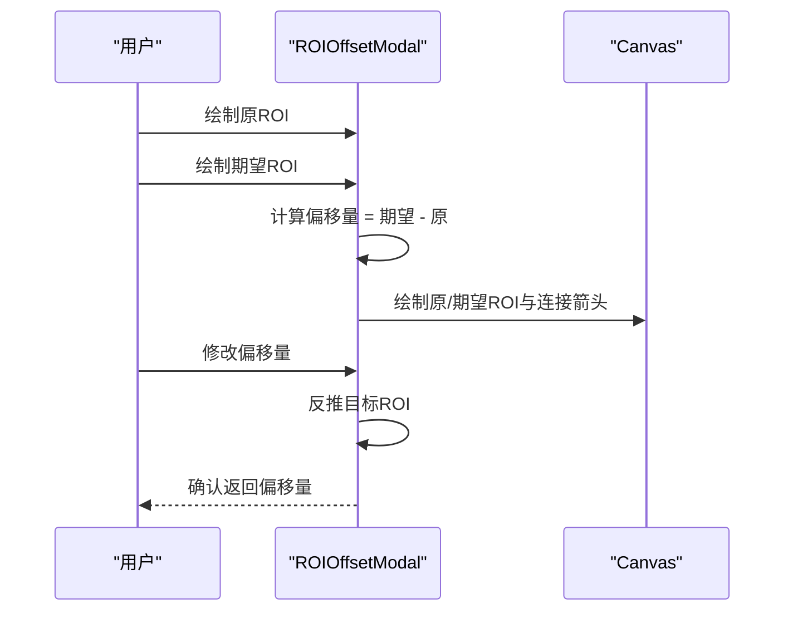
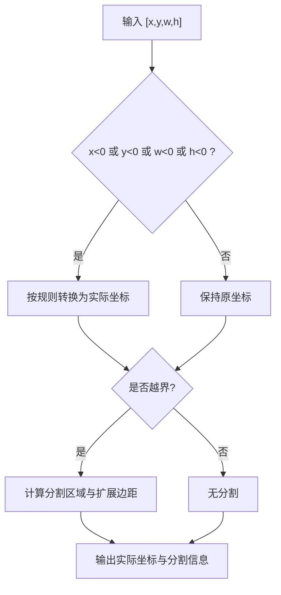
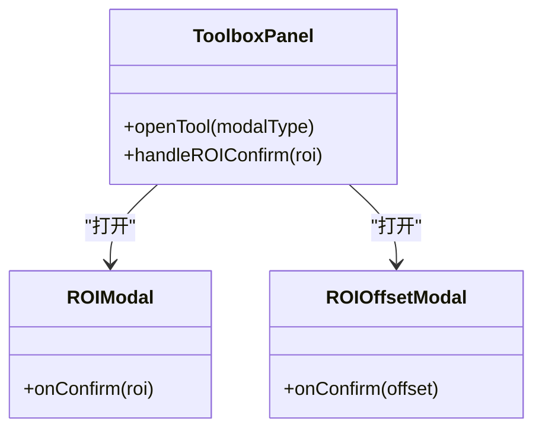
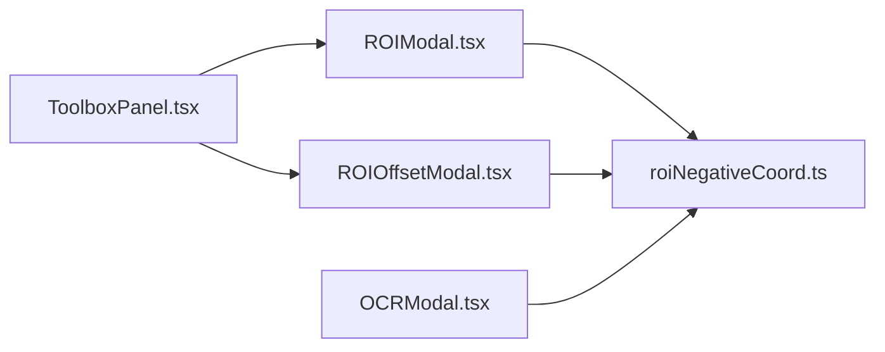

# ROI区域操作工具

<cite>
**本文引用的文件**
- [ROIModal.tsx](file://src/components/modals/ROIModal.tsx)
- [ROIOffsetModal.tsx](file://src/components/modals/ROIOffsetModal.tsx)
- [roiNegativeCoord.ts](file://src/utils/data/roiNegativeCoord.ts)
- [ToolboxPanel.tsx](file://src/components/panels/tools/ToolboxPanel.tsx)
- [ParamFieldListElem.tsx](file://src/components/panels/field/items/ParamFieldListElem.tsx)
- [OCRModal.tsx](file://src/components/modals/OCRModal.tsx)
</cite>

## 目录
1. [简介](#简介)
2. [项目结构](#项目结构)
3. [核心组件](#核心组件)
4. [架构总览](#架构总览)
5. [详细组件分析](#详细组件分析)
6. [依赖关系分析](#依赖关系分析)
7. [性能考虑](#性能考虑)
8. [故障排查指南](#故障排查指南)
9. [结论](#结论)
10. [附录](#附录)

## 简介
本文件系统性梳理了“ROI区域操作工具”的实现与使用，覆盖以下主题：
- ROI坐标系统的数学原理与负坐标处理机制
- ROI模态框的用户交互设计与操作流程
- 偏移量计算算法与边界检测逻辑
- ROI工具面板的功能特性与使用场景
- ROI数据的序列化与反序列化处理建议
- 性能优化技巧与内存管理策略
- 扩展开发与自定义配置方法

## 项目结构
ROI相关功能主要由三部分构成：
- ROI工具面板：提供入口与统一调度
- ROI模态框：支持拖拽框选、手动输入、负坐标解析与可视化
- ROI偏移计算模态框：支持原ROI与期望ROI对比、偏移量计算与可视化
- 负坐标解析工具：提供标准化的负坐标解析、边界检测与分割逻辑

图示来源
- [ToolboxPanel.tsx:49-93](file://src/components/panels/tools/ToolboxPanel.tsx#L49-L93)
- [ROIModal.tsx:1-564](file://src/components/modals/ROIModal.tsx#L1-L564)
- [ROIOffsetModal.tsx:1-937](file://src/components/modals/ROIOffsetModal.tsx#L1-L937)
- [roiNegativeCoord.ts:1-313](file://src/utils/data/roiNegativeCoord.ts#L1-L313)

章节来源
- [ToolboxPanel.tsx:49-93](file://src/components/panels/tools/ToolboxPanel.tsx#L49-L93)
- [ROIModal.tsx:1-564](file://src/components/modals/ROIModal.tsx#L1-L564)
- [ROIOffsetModal.tsx:1-937](file://src/components/modals/ROIOffsetModal.tsx#L1-L937)
- [roiNegativeCoord.ts:1-313](file://src/utils/data/roiNegativeCoord.ts#L1-L313)

## 核心组件
- ROI区域配置模态框：支持拖拽框选、手动输入坐标、负坐标解析与可视化、分割区域展示
- ROI偏移计算模态框：支持原ROI与期望ROI对比、偏移量计算、箭头可视化、工具栏操作
- 负坐标解析工具：提供标准的负坐标解析、边界检测、分割区域计算与扩展边距标注

章节来源
- [ROIModal.tsx:13-44](file://src/components/modals/ROIModal.tsx#L13-L44)
- [ROIOffsetModal.tsx:15-80](file://src/components/modals/ROIOffsetModal.tsx#L15-L80)
- [roiNegativeCoord.ts:11-45](file://src/utils/data/roiNegativeCoord.ts#L11-L45)

## 架构总览
ROI工具通过工具箱面板统一入口，打开对应模态框进行交互；模态框内部依赖负坐标解析工具完成坐标转换与边界检测，并在Canvas上进行可视化渲染。

图示来源
- [ToolboxPanel.tsx:134-160](file://src/components/panels/tools/ToolboxPanel.tsx#L134-L160)
- [ROIModal.tsx:47-121](file://src/components/modals/ROIModal.tsx#L47-L121)
- [roiNegativeCoord.ts:55-178](file://src/utils/data/roiNegativeCoord.ts#L55-L178)

## 详细组件分析

### ROI区域配置模态框（ROIModal）
- 功能要点
  - 支持拖拽绘制ROI矩形，自动根据起点与终点计算x/y/宽高
  - 支持手动输入x/y/宽/高，精度为整数
  - 负坐标解析：当存在负数时，调用负坐标解析工具，支持从右/下边缘计算、w/h为0延伸至边缘、w/h为负数时视为右下角
  - 可视化：绘制原始矩形与分割后的左右两块区域（若超出边界）
  - 提供提示信息与坐标说明，辅助用户理解负坐标规则

图示来源
- [ROIModal.tsx:47-121](file://src/components/modals/ROIModal.tsx#L47-L121)
- [roiNegativeCoord.ts:55-178](file://src/utils/data/roiNegativeCoord.ts#L55-L178)

章节来源
- [ROIModal.tsx:13-44](file://src/components/modals/ROIModal.tsx#L13-L44)
- [ROIModal.tsx:47-121](file://src/components/modals/ROIModal.tsx#L47-L121)
- [ROIModal.tsx:207-232](file://src/components/modals/ROIModal.tsx#L207-L232)
- [ROIModal.tsx:303-348](file://src/components/modals/ROIModal.tsx#L303-L348)

### ROI偏移计算模态框（ROIOffsetModal）
- 功能要点
  - 支持分别绘制“原ROI”与“期望ROI”，并以不同颜色标注
  - 自动计算偏移量：偏移量 = 期望ROI - 原ROI（逐分量）
  - 可视化：绘制连接线与箭头，直观表达偏移方向与幅度
  - 工具栏：支持交换原/期望ROI、复制目标到原ROI、使用节点初始ROI重置原ROI等
  - 支持直接编辑偏移量并反推目标ROI

图示来源
- [ROIOffsetModal.tsx:51-64](file://src/components/modals/ROIOffsetModal.tsx#L51-L64)
- [ROIOffsetModal.tsx:148-189](file://src/components/modals/ROIOffsetModal.tsx#L148-L189)
- [ROIOffsetModal.tsx:393-463](file://src/components/modals/ROIOffsetModal.tsx#L393-L463)

章节来源
- [ROIOffsetModal.tsx:15-80](file://src/components/modals/ROIOffsetModal.tsx#L15-L80)
- [ROIOffsetModal.tsx:51-64](file://src/components/modals/ROIOffsetModal.tsx#L51-L64)
- [ROIOffsetModal.tsx:393-463](file://src/components/modals/ROIOffsetModal.tsx#L393-L463)
- [ROIOffsetModal.tsx:527-541](file://src/components/modals/ROIOffsetModal.tsx#L527-L541)

### 负坐标解析工具（roiNegativeCoord）
- 数学原理
  - x为负：从右边缘计算，x_actual = width + x
  - y为负：从下边缘计算，y_actual = height + y
  - w为0：延伸至右边缘，w_actual = width - x
  - w为负：取绝对值，且(x,y)视为右下角，w_actual = |w|，x_actual -= w_actual
  - h同理
- 边界检测与分割
  - 计算是否越界（左/上/右/下），并统计需要的扩展边距
  - 若超出右/下边界，则将ROI分割为“左上角虚拟区域”与“右下角实际区域”，用于可视化与后续处理

图示来源
- [roiNegativeCoord.ts:55-178](file://src/utils/data/roiNegativeCoord.ts#L55-L178)

章节来源
- [roiNegativeCoord.ts:11-45](file://src/utils/data/roiNegativeCoord.ts#L11-L45)
- [roiNegativeCoord.ts:55-178](file://src/utils/data/roiNegativeCoord.ts#L55-L178)
- [roiNegativeCoord.ts:183-206](file://src/utils/data/roiNegativeCoord.ts#L183-L206)

### ROI工具面板（ToolboxPanel）
- 功能特性
  - 提供“区域选择”“偏移测量”等工具入口
  - 统一检查连接状态，确保设备可用
  - 打开对应模态框并接收确认结果，进行消息提示

图示来源
- [ToolboxPanel.tsx:134-160](file://src/components/panels/tools/ToolboxPanel.tsx#L134-L160)
- [ToolboxPanel.tsx:193-200](file://src/components/panels/tools/ToolboxPanel.tsx#L193-L200)

章节来源
- [ToolboxPanel.tsx:49-93](file://src/components/panels/tools/ToolboxPanel.tsx#L49-L93)
- [ToolboxPanel.tsx:134-160](file://src/components/panels/tools/ToolboxPanel.tsx#L134-L160)
- [ToolboxPanel.tsx:193-200](file://src/components/panels/tools/ToolboxPanel.tsx#L193-L200)

### 与参数字段面板的集成（ParamFieldListElem）
- 在字段面板中可直接打开“偏移测量”工具，便于在节点参数编辑时进行ROI偏移校准

章节来源
- [ParamFieldListElem.tsx:187-199](file://src/components/panels/field/items/ParamFieldListElem.tsx#L187-L199)

## 依赖关系分析
- ROIModal与ROIOffsetModal均依赖负坐标解析工具进行坐标转换与可视化
- 工具箱面板负责统一调度，决定何时打开相应模态框
- OCR模态框同样复用负坐标解析工具，体现跨组件的一致性

图示来源
- [ToolboxPanel.tsx:9-38](file://src/components/panels/tools/ToolboxPanel.tsx#L9-L38)
- [ROIModal.tsx:8-11](file://src/components/modals/ROIModal.tsx#L8-L11)
- [ROIOffsetModal.tsx:1-13](file://src/components/modals/ROIOffsetModal.tsx#L1-L13)
- [OCRModal.tsx:25-27](file://src/components/modals/OCRModal.tsx#L25-L27)

章节来源
- [ToolboxPanel.tsx:9-38](file://src/components/panels/tools/ToolboxPanel.tsx#L9-L38)
- [ROIModal.tsx:8-11](file://src/components/modals/ROIModal.tsx#L8-L11)
- [ROIOffsetModal.tsx:1-13](file://src/components/modals/ROIOffsetModal.tsx#L1-L13)
- [OCRModal.tsx:25-27](file://src/components/modals/OCRModal.tsx#L25-L27)

## 性能考虑
- Canvas重绘优化
  - 合并绘制：先清空画布，再绘制背景图与ROI，避免重复绘制
  - 条件重绘：仅在rectangle或图片加载完成后触发重绘
  - 参考路径：[ROIModal.tsx:47-121](file://src/components/modals/ROIModal.tsx#L47-L121)、[ROIOffsetModal.tsx:83-192](file://src/components/modals/ROIOffsetModal.tsx#L83-L192)
- 负坐标解析复杂度
  - 解析过程为O(1)，包含常数次分支判断与边界计算，适合高频调用
  - 参考路径：[roiNegativeCoord.ts:55-178](file://src/utils/data/roiNegativeCoord.ts#L55-L178)
- 内存管理
  - Canvas尺寸与图片尺寸一致，避免额外缓冲区
  - 使用临时变量存储中间结果，减少闭包捕获与频繁对象创建
  - 参考路径：[ROIModal.tsx:288-301](file://src/components/modals/ROIModal.tsx#L288-L301)、[ROIOffsetModal.tsx:510-523](file://src/components/modals/ROIOffsetModal.tsx#L510-L523)
- 交互流畅性
  - 鼠标事件中仅更新状态，不执行昂贵操作
  - 缩放/平移与拖拽互斥，避免状态冲突
  - 参考路径：[ROIModal.tsx:131-204](file://src/components/modals/ROIModal.tsx#L131-L204)、[ROIOffsetModal.tsx:202-287](file://src/components/modals/ROIOffsetModal.tsx#L202-L287)

## 故障排查指南
- 无法确认ROI
  - 检查是否已框选或输入坐标，确认按钮在rectangle存在时启用
  - 参考路径：[ROIModal.tsx:218-232](file://src/components/modals/ROIModal.tsx#L218-L232)
- 偏移量为空
  - 确保已同时设置“原ROI”与“期望ROI”
  - 参考路径：[ROIOffsetModal.tsx:368-380](file://src/components/modals/ROIOffsetModal.tsx#L368-L380)
- 负坐标未生效
  - 确认输入的x/y/w/h是否为负数或0，查看解析后的分割区域
  - 参考路径：[ROIModal.tsx:500-557](file://src/components/modals/ROIModal.tsx#L500-L557)、[roiNegativeCoord.ts:55-178](file://src/utils/data/roiNegativeCoord.ts#L55-L178)
- 设备未连接
  - 工具箱面板会拦截未连接状态并提示，请先连接设备
  - 参考路径：[ToolboxPanel.tsx:124-131](file://src/components/panels/tools/ToolboxPanel.tsx#L124-L131)

章节来源
- [ROIModal.tsx:218-232](file://src/components/modals/ROIModal.tsx#L218-L232)
- [ROIOffsetModal.tsx:368-380](file://src/components/modals/ROIOffsetModal.tsx#L368-L380)
- [ToolboxPanel.tsx:124-131](file://src/components/panels/tools/ToolboxPanel.tsx#L124-L131)

## 结论
ROI区域操作工具通过清晰的UI与稳健的负坐标解析，实现了灵活而可靠的区域选择与偏移计算能力。其模块化设计便于扩展与维护，同时在性能与内存方面提供了明确的优化方向。

## 附录

### ROI坐标系统与负坐标处理规范
- x为负：从右边缘计算
- y为负：从下边缘计算
- w为0：延伸至右边缘
- h为0：延伸至下边缘
- w为负：取绝对值，且(x,y)视为右下角
- h为负：取绝对值，且(x,y)视为右下角

章节来源
- [roiNegativeCoord.ts:4-9](file://src/utils/data/roiNegativeCoord.ts#L4-L9)
- [ROIModal.tsx:346-362](file://src/components/modals/ROIModal.tsx#L346-L362)

### ROI数据的序列化与反序列化建议
- 序列化：将[x, y, w, h]数组序列化为JSON数组，便于存储与传输
- 反序列化：从JSON恢复为数组，再交由模态框或解析工具处理
- 注意：若涉及负坐标，应确保在写入/读取时保留符号信息，避免二次解析错误

章节来源
- [ROIModal.tsx:224-230](file://src/components/modals/ROIModal.tsx#L224-L230)
- [ROIOffsetModal.tsx:58-64](file://src/components/modals/ROIOffsetModal.tsx#L58-L64)

### 扩展开发与自定义配置
- 新增工具入口：在工具箱面板配置中添加新工具项，绑定图标与回调
  - 参考路径：[ToolboxPanel.tsx:49-93](file://src/components/panels/tools/ToolboxPanel.tsx#L49-L93)
- 自定义模态框：遵循现有模态框的生命周期与Canvas渲染模式，复用负坐标解析工具
  - 参考路径：[ROIModal.tsx:244-285](file://src/components/modals/ROIModal.tsx#L244-L285)、[ROIOffsetModal.tsx:466-507](file://src/components/modals/ROIOffsetModal.tsx#L466-L507)
- 参数面板集成：在字段面板中增加打开工具的入口，提升工作流效率
  - 参考路径：[ParamFieldListElem.tsx:187-199](file://src/components/panels/field/items/ParamFieldListElem.tsx#L187-L199)