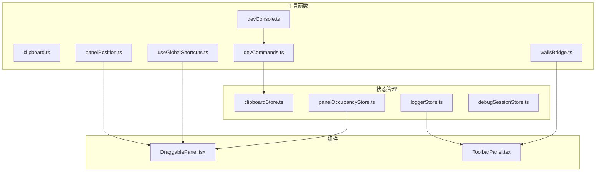
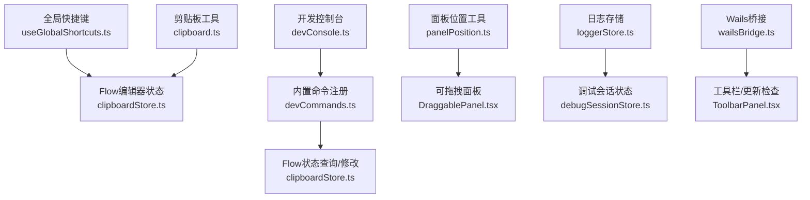
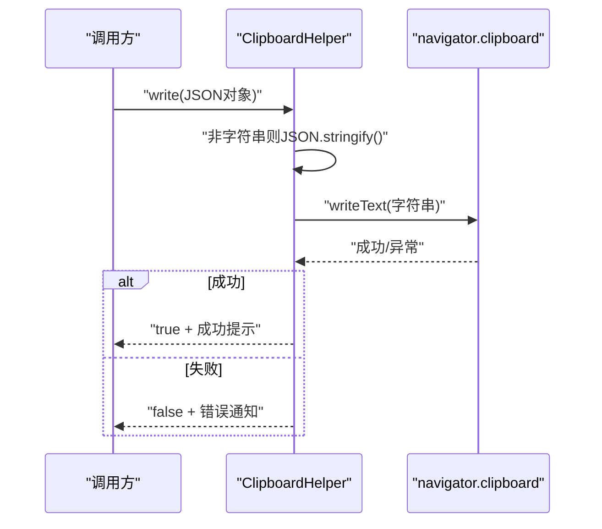
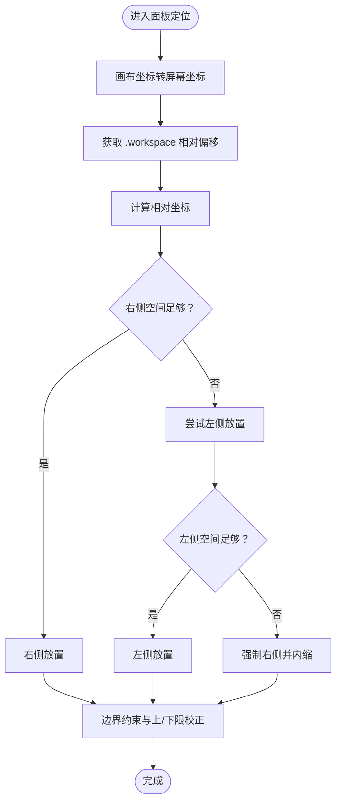
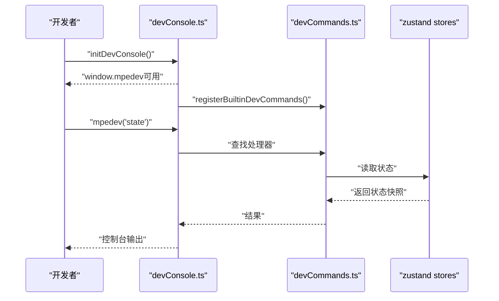
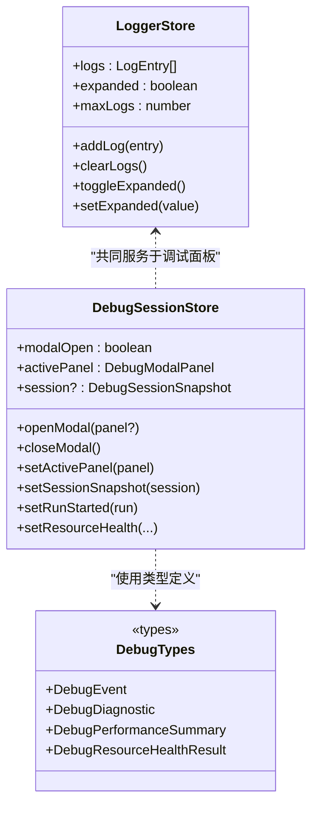
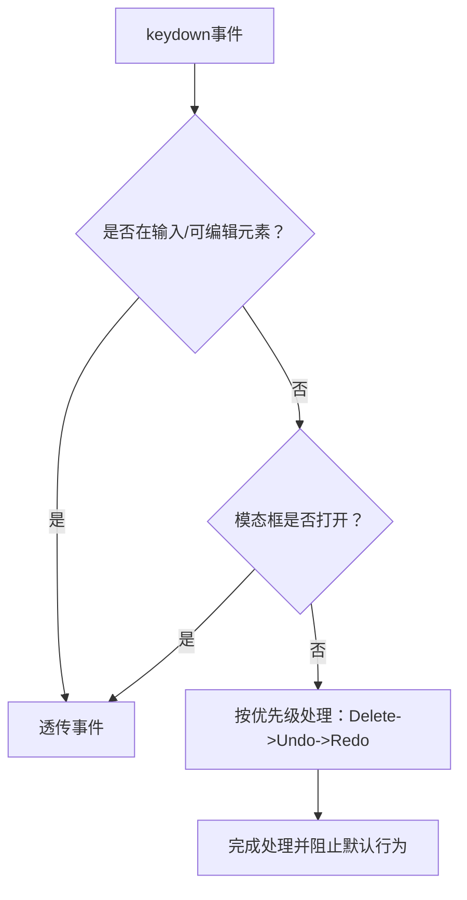
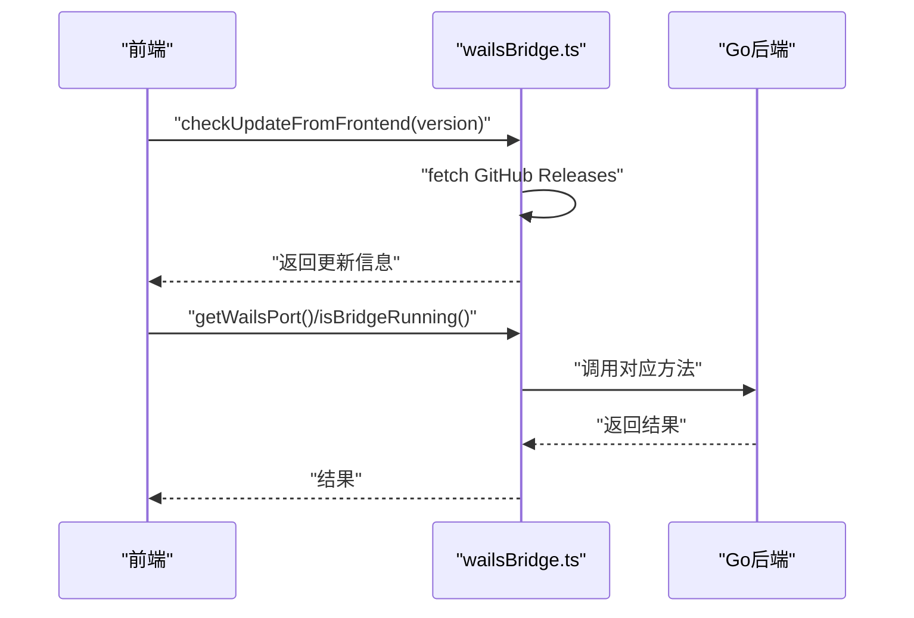
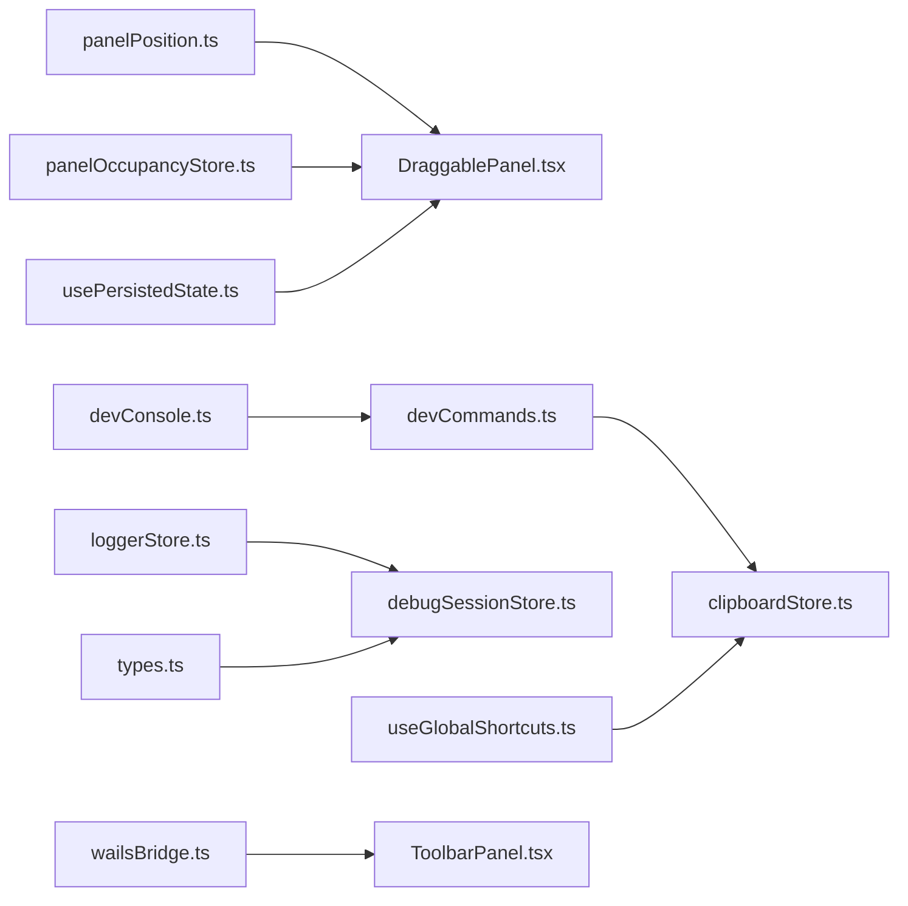

# UI工具与交互

<cite>
**本文引用的文件**
- [clipboard.ts](file://src/utils/ui/clipboard.ts)
- [panelPosition.ts](file://src/utils/ui/panelPosition.ts)
- [devCommands.ts](file://src/utils/devCommands.ts)
- [devConsole.ts](file://src/utils/devConsole.ts)
- [clipboardStore.ts](file://src/stores/clipboardStore.ts)
- [panelOccupancyStore.ts](file://src/stores/panelOccupancyStore.ts)
- [usePersistedState.ts](file://src/hooks/usePersistedState.ts)
- [DraggablePanel.tsx](file://src/components/panels/common/DraggablePanel.tsx)
- [loggerStore.ts](file://src/stores/loggerStore.ts)
- [debugSessionStore.ts](file://src/stores/debugSessionStore.ts)
- [types.ts](file://src/features/debug/types.ts)
- [ToolbarPanel.tsx](file://src/components/panels/main/ToolbarPanel.tsx)
- [useGlobalShortcuts.ts](file://src/hooks/useGlobalShortcuts.ts)
- [wailsBridge.ts](file://src/utils/wailsBridge.ts)
</cite>

## 目录
1. [引言](#引言)
2. [项目结构](#项目结构)
3. [核心组件](#核心组件)
4. [架构总览](#架构总览)
5. [详细组件分析](#详细组件分析)
6. [依赖分析](#依赖分析)
7. [性能考虑](#性能考虑)
8. [故障排查指南](#故障排查指南)
9. [结论](#结论)
10. [附录](#附录)

## 引言
本文件聚焦于UI工具与交互层的关键能力，包括：
- 剪贴板工具的跨平台实现与数据格式处理
- 面板位置管理的状态持久化与布局算法
- 开发命令系统的命令注册与执行机制
- 开发控制台的日志管理与调试功能
- 用户体验优化策略与扩展开发方法
- 性能监控与用户体验改进建议

通过对仓库中前端React组件、工具函数、状态管理与调试体系的系统梳理，帮助开发者快速理解并高效扩展UI交互能力。

## 项目结构
UI工具与交互主要分布在以下模块：
- 工具函数层：剪贴板、面板位置、开发控制台、全局快捷键、Wails桥接
- 状态管理层：剪贴板内存、面板占用互斥、日志、调试会话等
- 组件层：可拖拽面板、工具栏等
- 调试类型定义：统一调试协议与状态模型

**图表来源**
- [clipboard.ts:1-64](file://src/utils/ui/clipboard.ts#L1-L64)
- [panelPosition.ts:1-263](file://src/utils/ui/panelPosition.ts#L1-L263)
- [devConsole.ts:1-52](file://src/utils/devConsole.ts#L1-L52)
- [devCommands.ts:1-75](file://src/utils/devCommands.ts#L1-L75)
- [clipboardStore.ts:1-51](file://src/stores/clipboardStore.ts#L1-L51)
- [panelOccupancyStore.ts:1-136](file://src/stores/panelOccupancyStore.ts#L1-L136)
- [loggerStore.ts:1-46](file://src/stores/loggerStore.ts#L1-L46)
- [debugSessionStore.ts:1-260](file://src/stores/debugSessionStore.ts#L1-L260)
- [DraggablePanel.tsx:1-178](file://src/components/panels/common/DraggablePanel.tsx#L1-L178)
- [ToolbarPanel.tsx:1-22](file://src/components/panels/main/ToolbarPanel.tsx#L1-L22)
- [useGlobalShortcuts.ts:1-169](file://src/hooks/useGlobalShortcuts.ts#L1-L169)
- [wailsBridge.ts:1-387](file://src/utils/wailsBridge.ts#L1-L387)

**章节来源**
- [clipboard.ts:1-64](file://src/utils/ui/clipboard.ts#L1-L64)
- [panelPosition.ts:1-263](file://src/utils/ui/panelPosition.ts#L1-L263)
- [devConsole.ts:1-52](file://src/utils/devConsole.ts#L1-L52)
- [devCommands.ts:1-75](file://src/utils/devCommands.ts#L1-L75)
- [clipboardStore.ts:1-51](file://src/stores/clipboardStore.ts#L1-L51)
- [panelOccupancyStore.ts:1-136](file://src/stores/panelOccupancyStore.ts#L1-L136)
- [loggerStore.ts:1-46](file://src/stores/loggerStore.ts#L1-L46)
- [debugSessionStore.ts:1-260](file://src/stores/debugSessionStore.ts#L1-L260)
- [DraggablePanel.tsx:1-178](file://src/components/panels/common/DraggablePanel.tsx#L1-L178)
- [ToolbarPanel.tsx:1-22](file://src/components/panels/main/ToolbarPanel.tsx#L1-L22)
- [useGlobalShortcuts.ts:1-169](file://src/hooks/useGlobalShortcuts.ts#L1-L169)
- [wailsBridge.ts:1-387](file://src/utils/wailsBridge.ts#L1-L387)

## 核心组件
- 剪贴板工具：提供跨平台写入/读取文本的能力，并对非字符串内容进行序列化；同时提供内部剪贴板状态管理，支持复制节点与边。
- 面板位置管理：封装画布坐标与屏幕坐标的转换、边界约束、嵌入跟随与连接中点定位算法，并提供拖拽面板的位置持久化与默认位置计算。
- 开发命令系统：通过注册机制暴露调试命令，支持查询状态、选择节点、修改配置等；提供开发标志位与统一的控制台入口。
- 开发控制台：集中记录日志、管理日志面板展开状态与容量，配合调试会话状态驱动可视化面板。
- 全局快捷键：在非输入场景下拦截撤销/重做与删除键，保证编辑器交互一致性。
- Wails桥接：检测运行环境、事件监听、后端能力调用与更新检查，支撑桌面端能力。

**章节来源**
- [clipboard.ts:1-64](file://src/utils/ui/clipboard.ts#L1-L64)
- [panelPosition.ts:1-263](file://src/utils/ui/panelPosition.ts#L1-L263)
- [devConsole.ts:1-52](file://src/utils/devConsole.ts#L1-L52)
- [devCommands.ts:1-75](file://src/utils/devCommands.ts#L1-L75)
- [clipboardStore.ts:1-51](file://src/stores/clipboardStore.ts#L1-L51)
- [loggerStore.ts:1-46](file://src/stores/loggerStore.ts#L1-L46)
- [debugSessionStore.ts:1-260](file://src/stores/debugSessionStore.ts#L1-L260)
- [useGlobalShortcuts.ts:1-169](file://src/hooks/useGlobalShortcuts.ts#L1-L169)
- [wailsBridge.ts:1-387](file://src/utils/wailsBridge.ts#L1-L387)

## 架构总览
UI工具与交互采用“工具函数 + 状态管理 + 组件”的分层设计，围绕用户操作与调试需求构建：

**图表来源**
- [useGlobalShortcuts.ts:1-169](file://src/hooks/useGlobalShortcuts.ts#L1-L169)
- [devConsole.ts:1-52](file://src/utils/devConsole.ts#L1-L52)
- [devCommands.ts:1-75](file://src/utils/devCommands.ts#L1-L75)
- [clipboardStore.ts:1-51](file://src/stores/clipboardStore.ts#L1-L51)
- [panelPosition.ts:1-263](file://src/utils/ui/panelPosition.ts#L1-L263)
- [DraggablePanel.tsx:1-178](file://src/components/panels/common/DraggablePanel.tsx#L1-L178)
- [clipboard.ts:1-64](file://src/utils/ui/clipboard.ts#L1-L64)
- [loggerStore.ts:1-46](file://src/stores/loggerStore.ts#L1-L46)
- [debugSessionStore.ts:1-260](file://src/stores/debugSessionStore.ts#L1-L260)
- [wailsBridge.ts:1-387](file://src/utils/wailsBridge.ts#L1-L387)
- [ToolbarPanel.tsx:1-22](file://src/components/panels/main/ToolbarPanel.tsx#L1-L22)

## 详细组件分析

### 剪贴板工具与数据格式处理
- 跨平台写入/读取：基于浏览器原生navigator.clipboard接口，自动将非字符串内容序列化为JSON字符串后再写入；读取时返回纯文本。
- 内部剪贴板：使用zustand维护节点与边的复制缓存，提供copy/paste/hasContent等操作，配合消息提示提升反馈质量。
- 数据格式策略：统一以字符串形式写入，便于跨应用粘贴；读取后由调用方自行解析，避免强耦合。

**图表来源**
- [clipboard.ts:3-23](file://src/utils/ui/clipboard.ts#L3-L23)

**章节来源**
- [clipboard.ts:1-64](file://src/utils/ui/clipboard.ts#L1-L64)
- [clipboardStore.ts:1-51](file://src/stores/clipboardStore.ts#L1-L51)

### 面板位置管理与布局算法
- 坐标转换：canvasToScreen与screenToCanvas在缩放与平移的视口状态下进行双向转换，确保拖拽与定位一致。
- 边界约束：constrainPosition根据最小可见宽高与视口尺寸限制面板位置，防止面板完全移出可视区。
- 嵌入跟随与连接中点：calculateEmbeddedPosition与calculateEdgeEmbeddedPosition分别针对节点与边的中点计算相对“.workspace”的坐标，并在右侧/左侧与上下边界进行回退与微调。
- 拖拽面板：DraggablePanel通过zustand存储面板位置，结合usePersistedState实现本地持久化；拖拽过程实时更新，松开后写回状态。
- 面板互斥：panelOccupancyStore通过区域与反应策略（关闭/隐藏/偏移）管理右侧/左侧/底部区域的活跃面板，避免冲突。

**图表来源**
- [panelPosition.ts:93-157](file://src/utils/ui/panelPosition.ts#L93-L157)
- [panelPosition.ts:171-231](file://src/utils/ui/panelPosition.ts#L171-L231)

**章节来源**
- [panelPosition.ts:1-263](file://src/utils/ui/panelPosition.ts#L1-L263)
- [DraggablePanel.tsx:1-178](file://src/components/panels/common/DraggablePanel.tsx#L1-L178)
- [panelOccupancyStore.ts:1-136](file://src/stores/panelOccupancyStore.ts#L1-L136)
- [usePersistedState.ts:1-37](file://src/hooks/usePersistedState.ts#L1-L37)

### 开发命令系统：注册与执行机制
- 控制台入口：initDevConsole在window上挂载mpedev，按需延迟加载内置命令注册。
- 命令注册：registerDevCommand将命令名映射到处理器；registerBuiltinDevCommands注册节点、边、配置、选择节点、清空选择、状态查看与开发标志等常用命令。
- 参数校验与错误处理：命令执行包裹try/catch，异常时打印错误并返回undefined；对非法参数给出使用提示。
- 开发标志：setDevFlag/getDevFlag支持动态开关调试特性并通过自定义事件广播变更。

**图表来源**
- [devConsole.ts:42-51](file://src/utils/devConsole.ts#L42-L51)
- [devCommands.ts:6-74](file://src/utils/devCommands.ts#L6-L74)

**章节来源**
- [devConsole.ts:1-52](file://src/utils/devConsole.ts#L1-L52)
- [devCommands.ts:1-75](file://src/utils/devCommands.ts#L1-L75)

### 开发控制台：日志管理与调试功能
- 日志存储：useLoggerStore维护日志列表、展开状态与最大容量，支持添加、清理与切换展开状态。
- 调试会话：useDebugSessionStore管理调试模态、活动面板、节点选择、会话快照、运行状态、资源健康与能力清单等，提供丰富的调试面板与诊断能力。
- 类型定义：types.ts提供调试协议的完整类型模型，涵盖事件、诊断、性能摘要、截图、代理测试等。

**图表来源**
- [loggerStore.ts:21-45](file://src/stores/loggerStore.ts#L21-L45)
- [debugSessionStore.ts:82-255](file://src/stores/debugSessionStore.ts#L82-L255)
- [types.ts:145-481](file://src/features/debug/types.ts#L145-L481)

**章节来源**
- [loggerStore.ts:1-46](file://src/stores/loggerStore.ts#L1-L46)
- [debugSessionStore.ts:1-260](file://src/stores/debugSessionStore.ts#L1-L260)
- [types.ts:1-481](file://src/features/debug/types.ts#L1-L481)

### 全局快捷键与用户体验优化
- 快捷键拦截：useGlobalShortcuts在非输入与非模态场景下拦截撤销/重做与Delete键，确保编辑器内的行为一致性。
- 反馈提示：成功/失败时通过消息组件反馈，减少歧义。
- 删除键重定向：Delete键在特定环境下重定向为Backspace，兼容不同平台的行为差异。

**图表来源**
- [useGlobalShortcuts.ts:143-148](file://src/hooks/useGlobalShortcuts.ts#L143-L148)

**章节来源**
- [useGlobalShortcuts.ts:1-169](file://src/hooks/useGlobalShortcuts.ts#L1-L169)

### Wails桥接与桌面端能力
- 环境检测：isWailsEnvironment判断是否在Wails环境中运行。
- 事件监听：onWailsEvent/offWailsEvent提供事件订阅与取消。
- 后端能力：GetPort、IsBridgeRunning、GetWorkDir、SetRootDir、RestartBridge、GetVersion、CheckUpdate、GetUpdateDownloadURL等。
- 前端更新检查：checkUpdateFromFrontend直接调用GitHub Releases API，按平台匹配Extremer包下载地址。

**图表来源**
- [wailsBridge.ts:292-331](file://src/utils/wailsBridge.ts#L292-L331)
- [wailsBridge.ts:92-126](file://src/utils/wailsBridge.ts#L92-L126)

**章节来源**
- [wailsBridge.ts:1-387](file://src/utils/wailsBridge.ts#L1-L387)

## 依赖分析
- 组件与工具的耦合度低，通过状态管理与类型定义解耦。
- 面板位置工具与DraggablePanel存在直接依赖；面板互斥系统与面板组件存在协作关系。
- 开发命令系统依赖各store以读取/修改状态；调试会话store依赖类型定义与日志store。
- 全局快捷键与Flow编辑器状态交互，避免在输入场景下干扰。

**图表来源**
- [panelPosition.ts:1-263](file://src/utils/ui/panelPosition.ts#L1-L263)
- [DraggablePanel.tsx:1-178](file://src/components/panels/common/DraggablePanel.tsx#L1-L178)
- [panelOccupancyStore.ts:1-136](file://src/stores/panelOccupancyStore.ts#L1-L136)
- [usePersistedState.ts:1-37](file://src/hooks/usePersistedState.ts#L1-L37)
- [devConsole.ts:1-52](file://src/utils/devConsole.ts#L1-L52)
- [devCommands.ts:1-75](file://src/utils/devCommands.ts#L1-L75)
- [clipboardStore.ts:1-51](file://src/stores/clipboardStore.ts#L1-L51)
- [loggerStore.ts:1-46](file://src/stores/loggerStore.ts#L1-L46)
- [debugSessionStore.ts:1-260](file://src/stores/debugSessionStore.ts#L1-L260)
- [types.ts:1-481](file://src/features/debug/types.ts#L1-L481)
- [useGlobalShortcuts.ts:1-169](file://src/hooks/useGlobalShortcuts.ts#L1-L169)
- [wailsBridge.ts:1-387](file://src/utils/wailsBridge.ts#L1-L387)
- [ToolbarPanel.tsx:1-22](file://src/components/panels/main/ToolbarPanel.tsx#L1-L22)

**章节来源**
- [panelPosition.ts:1-263](file://src/utils/ui/panelPosition.ts#L1-L263)
- [DraggablePanel.tsx:1-178](file://src/components/panels/common/DraggablePanel.tsx#L1-L178)
- [panelOccupancyStore.ts:1-136](file://src/stores/panelOccupancyStore.ts#L1-L136)
- [usePersistedState.ts:1-37](file://src/hooks/usePersistedState.ts#L1-L37)
- [devConsole.ts:1-52](file://src/utils/devConsole.ts#L1-L52)
- [devCommands.ts:1-75](file://src/utils/devCommands.ts#L1-L75)
- [clipboardStore.ts:1-51](file://src/stores/clipboardStore.ts#L1-L51)
- [loggerStore.ts:1-46](file://src/stores/loggerStore.ts#L1-L46)
- [debugSessionStore.ts:1-260](file://src/stores/debugSessionStore.ts#L1-L260)
- [types.ts:1-481](file://src/features/debug/types.ts#L1-L481)
- [useGlobalShortcuts.ts:1-169](file://src/hooks/useGlobalShortcuts.ts#L1-L169)
- [wailsBridge.ts:1-387](file://src/utils/wailsBridge.ts#L1-L387)
- [ToolbarPanel.tsx:1-22](file://src/components/panels/main/ToolbarPanel.tsx#L1-L22)

## 性能考虑
- 面板拖拽节流：panelPosition.ts提供throttle函数，建议在高频事件（如滚动、窗口大小变化）中使用，降低重绘压力。
- 状态持久化：usePersistedState对localStorage读写进行容错处理，避免异常影响主流程。
- 日志容量控制：loggerStore限制最大日志条数，避免无限增长导致内存压力。
- 调试会话状态：debugSessionStore按需更新状态，避免不必要的全局重渲染。
- 剪贴板写入：clipboard.ts对非字符串内容进行序列化，避免大对象频繁转换带来的开销。

[本节为通用指导，无需列出具体文件来源]

## 故障排查指南
- 剪贴板写入失败：检查浏览器权限与HTTPS环境；查看错误通知并确认内容类型。
- 面板位置异常：确认“.workspace”元素存在；检查视口状态与边界约束逻辑；验证拖拽范围。
- 开发命令不可用：确认initDevConsole已执行；检查命令名拼写；查看控制台输出的可用命令列表。
- 调试会话无响应：检查资源健康与能力清单状态；核对会话快照与运行状态；查看最后错误信息。
- 全局快捷键无效：确认当前焦点不在输入框；检查模态框状态；验证事件冒泡是否被阻断。
- Wails桥接异常：确认isWailsEnvironment返回true；检查后端方法是否存在；查看网络与权限设置。

**章节来源**
- [clipboard.ts:13-22](file://src/utils/ui/clipboard.ts#L13-L22)
- [panelPosition.ts:112-118](file://src/utils/ui/panelPosition.ts#L112-L118)
- [devConsole.ts:22-36](file://src/utils/devConsole.ts#L22-L36)
- [debugSessionStore.ts:143-145](file://src/stores/debugSessionStore.ts#L143-L145)
- [useGlobalShortcuts.ts:82-103](file://src/hooks/useGlobalShortcuts.ts#L82-L103)
- [wailsBridge.ts:68-86](file://src/utils/wailsBridge.ts#L68-L86)

## 结论
本UI工具与交互体系以工具函数与状态管理为核心，围绕剪贴板、面板布局、开发控制台与调试会话构建了清晰的职责边界。通过跨平台剪贴板、智能面板定位、可扩展的开发命令系统与完善的日志/调试能力，显著提升了编辑器的可用性与可维护性。建议在后续迭代中持续关注性能优化与跨平台兼容性，进一步完善扩展点与自动化测试。

[本节为总结性内容，无需列出具体文件来源]

## 附录
- 扩展开发建议
  - 新增剪贴板用途：在clipboard.ts基础上新增专用写入方法，或在clipboardStore中增加多格式支持。
  - 面板布局扩展：在panelPosition.ts中新增定位策略（如吸附、网格对齐），并在DraggablePanel中接入新策略。
  - 开发命令扩展：在devCommands.ts中注册新命令，必要时引入新的store以读取/修改状态。
  - 日志与调试：在loggerStore中增加过滤与导出能力，在debugSessionStore中扩展面板与指标。
  - 快捷键扩展：在useGlobalShortcuts.ts中新增组合键处理，避免与系统快捷键冲突。
  - Wails能力扩展：在wailsBridge.ts中新增后端方法调用与事件订阅，适配新平台特性。

[本节为实践建议，无需列出具体文件来源]