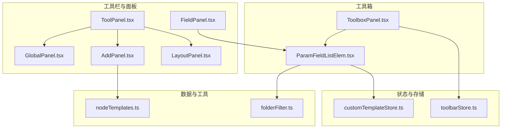
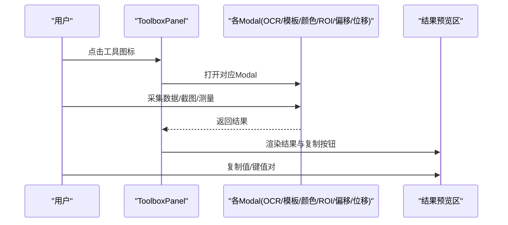
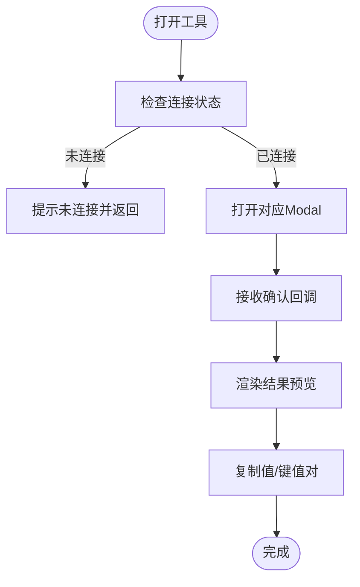
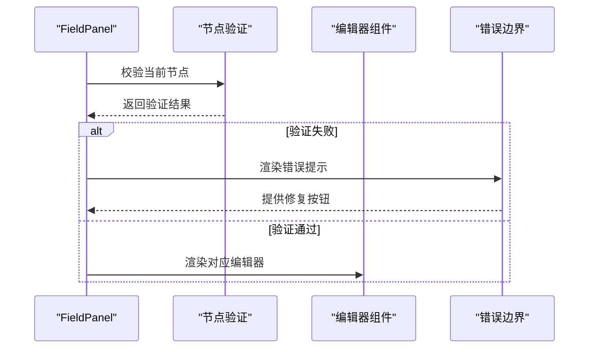
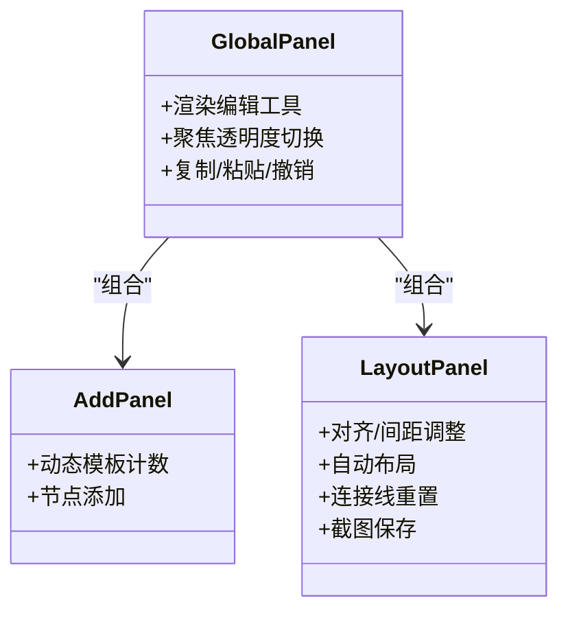
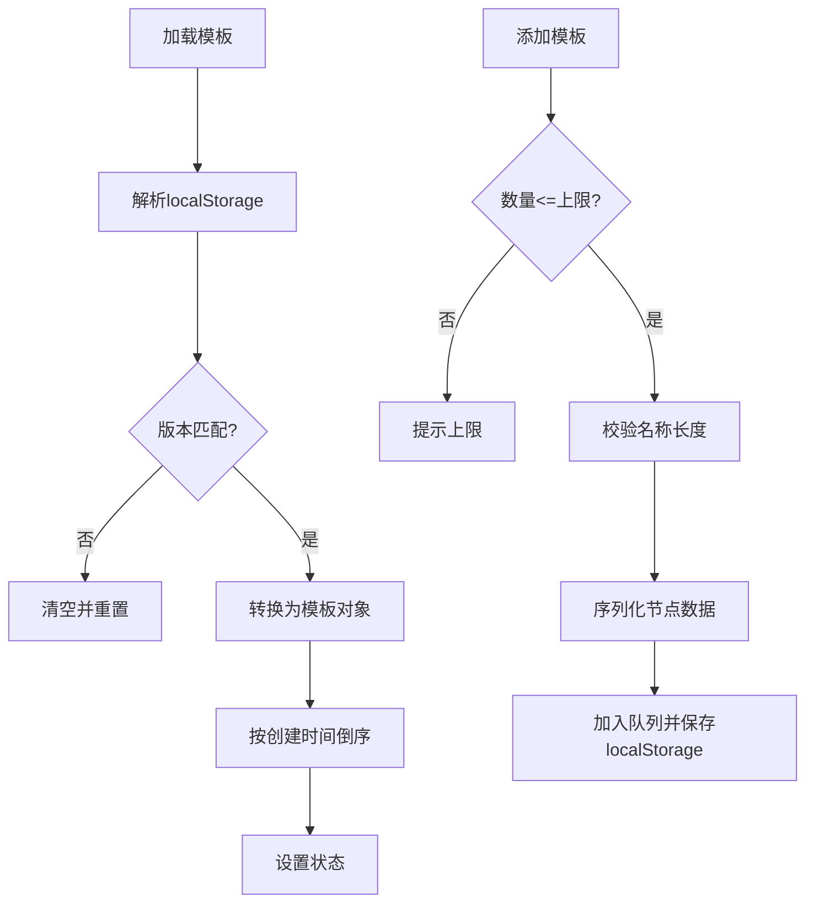
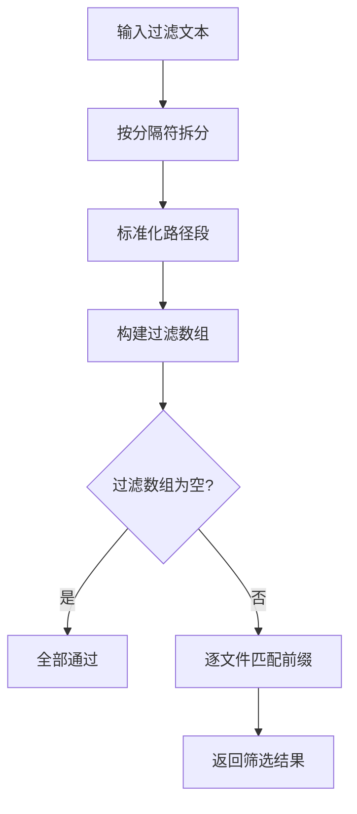
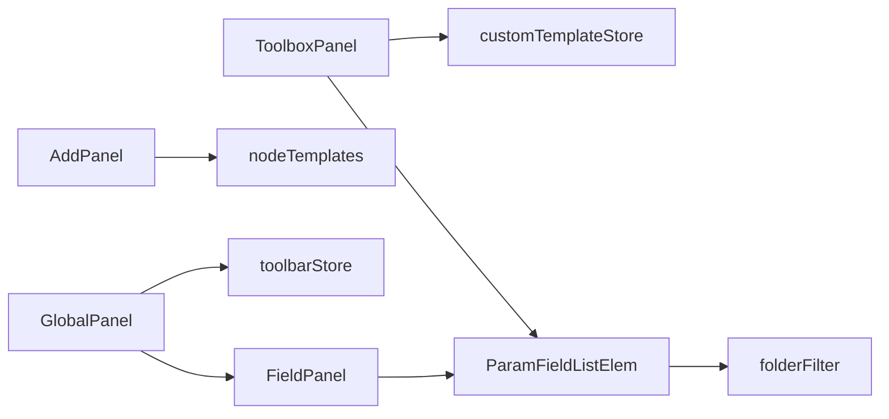

# 字段快捷工具

<cite>
**本文引用的文件**
- [ToolboxPanel.tsx](file://src/components/panels/tools/ToolboxPanel.tsx)
- [ToolPanel.tsx](file://src/components/panels/tools/ToolPanel.tsx)
- [GlobalPanel.tsx](file://src/components/panels/tools/GlobalPanel.tsx)
- [AddPanel.tsx](file://src/components/panels/tools/AddPanel.tsx)
- [LayoutPanel.tsx](file://src/components/panels/tools/LayoutPanel.tsx)
- [FieldPanel.tsx](file://src/components/panels/main/FieldPanel.tsx)
- [ParamFieldListElem.tsx](file://src/components/panels/field/items/ParamFieldListElem.tsx)
- [customTemplateStore.ts](file://src/stores/customTemplateStore.ts)
- [toolbarStore.ts](file://src/stores/toolbarStore.ts)
- [folderFilter.ts](file://src/utils/file/folderFilter.ts)
- [config.go](file://LocalBridge/internal/config/config.go)
- [nodeTemplates.ts](file://src/data/nodeTemplates.ts)
- [index.ts](file://src/components/panels/field/tools/index.ts)
</cite>

## 目录
1. [简介](#简介)
2. [项目结构](#项目结构)
3. [核心组件](#核心组件)
4. [架构总览](#架构总览)
5. [详细组件分析](#详细组件分析)
6. [依赖分析](#依赖分析)
7. [性能考虑](#性能考虑)
8. [故障排查指南](#故障排查指南)
9. [结论](#结论)
10. [附录](#附录)

## 简介
本文件围绕“字段快捷工具”展开，系统性阐述字段面板工具栏的实现架构与按钮管理机制、路径选择器的文件系统遍历与过滤逻辑、工具箱面板的功能组织与界面设计、自定义模板存储的持久化机制与数据结构、字段快捷工具的配置管理与动态加载策略，并提供工具面板的扩展开发与自定义工具集成方法，以及性能优化与用户体验改进建议。

## 项目结构
字段快捷工具涉及前端面板组件、状态管理、工具箱与字段编辑器、本地服务配置与文件过滤等模块。整体采用 React + Zustand 的组合，工具栏与面板通过状态驱动渲染，工具箱通过懒加载 Modal 组织交互，字段面板通过编辑器组件承载具体字段配置。

**图表来源**
- [ToolPanel.tsx:1-11](file://src/components/panels/tools/ToolPanel.tsx#L1-L11)
- [GlobalPanel.tsx:206-340](file://src/components/panels/tools/GlobalPanel.tsx#L206-L340)
- [AddPanel.tsx:45-112](file://src/components/panels/tools/AddPanel.tsx#L45-L112)
- [LayoutPanel.tsx:26-206](file://src/components/panels/tools/LayoutPanel.tsx#L26-L206)
- [FieldPanel.tsx:103-491](file://src/components/panels/main/FieldPanel.tsx#L103-L491)
- [ToolboxPanel.tsx:110-525](file://src/components/panels/tools/ToolboxPanel.tsx#L110-L525)
- [ParamFieldListElem.tsx:39-65](file://src/components/panels/field/items/ParamFieldListElem.tsx#L39-L65)
- [customTemplateStore.ts:1-326](file://src/stores/customTemplateStore.ts#L1-L326)
- [toolbarStore.ts:1-95](file://src/stores/toolbarStore.ts#L1-L95)
- [nodeTemplates.ts:1-108](file://src/data/nodeTemplates.ts#L1-L108)
- [folderFilter.ts:1-45](file://src/utils/file/folderFilter.ts#L1-L45)

**章节来源**
- [ToolPanel.tsx:1-11](file://src/components/panels/tools/ToolPanel.tsx#L1-L11)
- [ToolboxPanel.tsx:110-525](file://src/components/panels/tools/ToolboxPanel.tsx#L110-L525)
- [FieldPanel.tsx:103-491](file://src/components/panels/main/FieldPanel.tsx#L103-L491)

## 核心组件
- 工具箱面板（ToolboxPanel）：提供 OCR、模板截图、颜色取点、区域选择、偏移测量、位移差值等快捷工具，统一入口与结果预览，支持复制值与键值对。
- 字段面板（FieldPanel）：承载节点字段编辑，包含字段配置与邻接信息标签页，支持错误边界与节点修复。
- 工具栏与全局面板（GlobalPanel、AddPanel、LayoutPanel）：提供节点添加、布局、全局编辑与调试入口。
- 自定义模板存储（customTemplateStore）：基于 localStorage 的模板持久化，支持版本控制、导入导出与数量限制。
- 工具栏配置（toolbarStore）：管理默认导入/导出动作，持久化到 localStorage。
- 路径过滤（folderFilter）：解析与匹配相对路径过滤规则，用于文件列表筛选。
- 节点模板（nodeTemplates）：内置节点模板集合，支持动态展示数量随画布高度变化。

**章节来源**
- [ToolboxPanel.tsx:110-525](file://src/components/panels/tools/ToolboxPanel.tsx#L110-L525)
- [FieldPanel.tsx:103-491](file://src/components/panels/main/FieldPanel.tsx#L103-L491)
- [GlobalPanel.tsx:206-340](file://src/components/panels/tools/GlobalPanel.tsx#L206-L340)
- [AddPanel.tsx:45-112](file://src/components/panels/tools/AddPanel.tsx#L45-L112)
- [LayoutPanel.tsx:26-206](file://src/components/panels/tools/LayoutPanel.tsx#L26-L206)
- [customTemplateStore.ts:1-326](file://src/stores/customTemplateStore.ts#L1-L326)
- [toolbarStore.ts:1-95](file://src/stores/toolbarStore.ts#L1-L95)
- [folderFilter.ts:1-45](file://src/utils/file/folderFilter.ts#L1-L45)
- [nodeTemplates.ts:1-108](file://src/data/nodeTemplates.ts#L1-L108)

## 架构总览
字段快捷工具由“工具箱 + 字段面板 + 工具栏”三层协作构成。工具箱负责采集输入与生成结果，字段面板负责呈现与编辑字段，工具栏提供全局操作入口。状态通过 Zustand 管理，工具箱与字段面板通过懒加载 Modal 降低首屏负载。

**图表来源**
- [ToolboxPanel.tsx:134-216](file://src/components/panels/tools/ToolboxPanel.tsx#L134-L216)
- [ToolboxPanel.tsx:465-520](file://src/components/panels/tools/ToolboxPanel.tsx#L465-L520)

## 详细组件分析

### 工具箱面板（ToolboxPanel）
- 工具配置：通过常量表定义工具键、标签、图标与 Modal 类型，集中管理工具清单。
- 连接检查：在打开工具前校验本地服务连接状态，未连接则提示。
- 结果预览：根据最后一次工具结果渲染文本/坐标/颜色等，支持复制值与键值对。
- 懒加载 Modal：按需加载各工具 Modal，减少初始包体与内存占用。

**图表来源**
- [ToolboxPanel.tsx:125-160](file://src/components/panels/tools/ToolboxPanel.tsx#L125-L160)
- [ToolboxPanel.tsx:162-216](file://src/components/panels/tools/ToolboxPanel.tsx#L162-L216)
- [ToolboxPanel.tsx:318-437](file://src/components/panels/tools/ToolboxPanel.tsx#L318-L437)

**章节来源**
- [ToolboxPanel.tsx:110-525](file://src/components/panels/tools/ToolboxPanel.tsx#L110-L525)

### 字段面板（FieldPanel）
- 错误边界：捕获编辑器渲染异常，提供修复建议与一键修复。
- 节点验证：对节点数据进行校验与修复，维护面板稳定性。
- 内容渲染：根据节点类型切换不同编辑器组件，支持遮罩层显示进度。
- 邻接信息：提供邻接节点信息查看，辅助理解节点关系。

**图表来源**
- [FieldPanel.tsx:192-204](file://src/components/panels/main/FieldPanel.tsx#L192-L204)
- [FieldPanel.tsx:240-287](file://src/components/panels/main/FieldPanel.tsx#L240-L287)

**章节来源**
- [FieldPanel.tsx:103-491](file://src/components/panels/main/FieldPanel.tsx#L103-L491)

### 工具栏与全局面板（GlobalPanel、AddPanel、LayoutPanel）
- 全局面板：提供聚焦透明度、复制/粘贴、撤销等常用操作，支持禁用态提示。
- 添加面板：根据画布高度动态计算模板数量，避免溢出与遮挡。
- 布局面板：提供对齐、间距调整、自动布局、连接线重置与截图保存等能力，支持嵌入模式权限控制。

**图表来源**
- [GlobalPanel.tsx:206-340](file://src/components/panels/tools/GlobalPanel.tsx#L206-L340)
- [AddPanel.tsx:45-112](file://src/components/panels/tools/AddPanel.tsx#L45-L112)
- [LayoutPanel.tsx:26-206](file://src/components/panels/tools/LayoutPanel.tsx#L26-L206)

**章节来源**
- [GlobalPanel.tsx:125-167](file://src/components/panels/tools/GlobalPanel.tsx#L125-L167)
- [AddPanel.tsx:45-112](file://src/components/panels/tools/AddPanel.tsx#L45-L112)
- [LayoutPanel.tsx:62-164](file://src/components/panels/tools/LayoutPanel.tsx#L62-L164)

### 字段快捷工具（字段面板中的快捷按钮）
- 快捷工具映射：针对特定字段键（如 roi、roi_offset、expected、template、lower/upper、dx/dy）映射到对应工具图标与类型。
- 交互流程：点击字段项旁的快捷按钮，触发相应 Modal，完成后回填字段值或坐标。

**图表来源**
- [ParamFieldListElem.tsx:39-65](file://src/components/panels/field/items/ParamFieldListElem.tsx#L39-L65)

**章节来源**
- [ParamFieldListElem.tsx:39-65](file://src/components/panels/field/items/ParamFieldListElem.tsx#L39-L65)

### 自定义模板存储（customTemplateStore）
- 数据结构：版本号 + 模板数组，模板包含标签、节点类型、序列化数据与创建时间。
- 持久化：localStorage 存储，版本不匹配时清空并提示迁移。
- 能力：加载、添加、删除、更新、导出、导入、去重与数量限制。
- 性能：按创建时间倒序排序，避免频繁重排。

**图表来源**
- [customTemplateStore.ts:50-94](file://src/stores/customTemplateStore.ts#L50-L94)
- [customTemplateStore.ts:96-170](file://src/stores/customTemplateStore.ts#L96-L170)
- [customTemplateStore.ts:212-265](file://src/stores/customTemplateStore.ts#L212-L265)

**章节来源**
- [customTemplateStore.ts:1-326](file://src/stores/customTemplateStore.ts#L1-L326)

### 工具栏配置（toolbarStore）
- 默认导入/导出动作：从 localStorage 读取默认值，若无效则回退到默认值。
- 类型校验：严格校验动作枚举，保证配置安全。
- 状态更新：变更后立即持久化，确保下次启动生效。

**章节来源**
- [toolbarStore.ts:38-79](file://src/stores/toolbarStore.ts#L38-L79)
- [toolbarStore.ts:81-95](file://src/stores/toolbarStore.ts#L81-L95)

### 路径选择器与文件系统遍历（folderFilter）
- 过滤规则：支持英文逗号、分号、中文分号与换行分隔，标准化路径段大小写与斜杠。
- 匹配逻辑：将相对路径标准化后判断是否以目标前缀开头，实现“子目录包含”匹配。
- 文件筛选：对本地文件列表按过滤规则进行筛选，返回匹配结果。

**图表来源**
- [folderFilter.ts:16-21](file://src/utils/file/folderFilter.ts#L16-L21)
- [folderFilter.ts:23-32](file://src/utils/file/folderFilter.ts#L23-L32)
- [folderFilter.ts:34-45](file://src/utils/file/folderFilter.ts#L34-L45)

**章节来源**
- [folderFilter.ts:1-45](file://src/utils/file/folderFilter.ts#L1-L45)

### 节点模板与动态加载（nodeTemplates）
- 模板定义：包含标签、图标、节点类型与默认数据工厂函数。
- 动态展示：根据画布高度计算可显示模板数量，避免遮挡与滚动负担。
- 添加面板：按模板数量切片渲染，底部提供“更多模板”提示。

**章节来源**
- [nodeTemplates.ts:1-108](file://src/data/nodeTemplates.ts#L1-L108)
- [AddPanel.tsx:45-57](file://src/components/panels/tools/AddPanel.tsx#L45-L57)

## 依赖分析
- 组件耦合：ToolboxPanel 与 FieldPanel 通过 Modal 与状态解耦；GlobalPanel/LayoutPanel/AddPanel 通过 ToolPanel 聚合。
- 状态依赖：customTemplateStore 与 toolbarStore 作为独立状态源，被工具箱与全局面板消费。
- 工具依赖：字段快捷工具依赖 MFW 连接状态与 Modal 组件；路径过滤依赖本地文件信息。

**图表来源**
- [ToolboxPanel.tsx:1-525](file://src/components/panels/tools/ToolboxPanel.tsx#L1-L525)
- [FieldPanel.tsx:1-491](file://src/components/panels/main/FieldPanel.tsx#L1-L491)
- [GlobalPanel.tsx:1-340](file://src/components/panels/tools/GlobalPanel.tsx#L1-L340)
- [AddPanel.tsx:1-112](file://src/components/panels/tools/AddPanel.tsx#L1-L112)
- [customTemplateStore.ts:1-326](file://src/stores/customTemplateStore.ts#L1-L326)
- [toolbarStore.ts:1-95](file://src/stores/toolbarStore.ts#L1-L95)
- [folderFilter.ts:1-45](file://src/utils/file/folderFilter.ts#L1-L45)
- [nodeTemplates.ts:1-108](file://src/data/nodeTemplates.ts#L1-L108)

**章节来源**
- [ToolPanel.tsx:1-11](file://src/components/panels/tools/ToolPanel.tsx#L1-L11)
- [index.ts:1-5](file://src/components/panels/field/tools/index.ts#L1-L5)

## 性能考虑
- 懒加载与分割渲染：ToolboxPanel 对 Modal 采用懒加载，AddPanel 动态裁剪模板数量，降低首屏与滚动成本。
- 状态最小化：Zustand 精准订阅，避免无关重渲染；工具箱结果预览仅在有结果时渲染。
- 数据持久化：localStorage 读写在后台执行，模板导入/导出批量处理，避免阻塞主线程。
- 过滤优化：folderFilter 标准化与前缀匹配为 O(n) 级别，适合中等规模文件列表。

[本节为通用性能建议，不直接分析具体文件，故无章节来源]

## 故障排查指南
- 工具箱不可用：检查连接状态，确保本地服务已连接；若未连接，工具箱会阻止打开。
- 模板加载失败：版本不匹配将清空并提示迁移；损坏数据会被清理并恢复默认。
- 节点编辑异常：使用错误边界提供的“尝试修复节点”按钮；若仍失败，建议删除并重建节点。
- 路径过滤无效：确认过滤文本使用正确分隔符，且路径标准化后前缀一致。

**章节来源**
- [ToolboxPanel.tsx:125-131](file://src/components/panels/tools/ToolboxPanel.tsx#L125-L131)
- [customTemplateStore.ts:88-94](file://src/stores/customTemplateStore.ts#L88-L94)
- [FieldPanel.tsx:40-100](file://src/components/panels/main/FieldPanel.tsx#L40-L100)
- [folderFilter.ts:16-21](file://src/utils/file/folderFilter.ts#L16-L21)

## 结论
字段快捷工具通过“工具箱 + 字段面板 + 工具栏”的协同设计，实现了从数据采集到字段回填的闭环。借助懒加载、动态模板与状态持久化，系统在可用性与性能之间取得平衡。自定义模板与路径过滤进一步增强了可扩展性与易用性。建议后续在大规模文件场景下对路径过滤与模板渲染做进一步缓存与虚拟化优化。

[本节为总结性内容，不直接分析具体文件，故无章节来源]

## 附录

### 工具面板扩展与自定义工具集成
- 新增工具：在工具箱配置表中添加新工具项，定义键、标签、图标与 Modal 类型。
- 集成 Modal：在工具箱中引入新的 Modal 组件并处理确认回调，更新结果预览与复制逻辑。
- 字段映射：在字段项中为新字段键添加快捷工具映射，确保点击后能正确打开对应 Modal。
- 权限与连接：在打开工具前调用连接检查，必要时提供禁用态提示。

**章节来源**
- [ToolboxPanel.tsx:50-93](file://src/components/panels/tools/ToolboxPanel.tsx#L50-L93)
- [ToolboxPanel.tsx:134-160](file://src/components/panels/tools/ToolboxPanel.tsx#L134-L160)
- [ParamFieldListElem.tsx:39-65](file://src/components/panels/field/items/ParamFieldListElem.tsx#L39-L65)

### 字段工具的配置管理与动态加载策略
- 配置持久化：通过 toolbarStore 管理默认导入/导出动作，确保跨会话一致性。
- 动态模板：AddPanel 根据画布高度动态计算模板数量，避免 UI 抖动与遮挡。
- 模板加载：customTemplateStore 在应用启动时加载模板，版本不匹配自动迁移。

**章节来源**
- [toolbarStore.ts:38-79](file://src/stores/toolbarStore.ts#L38-L79)
- [AddPanel.tsx:36-43](file://src/components/panels/tools/AddPanel.tsx#L36-L43)
- [customTemplateStore.ts:50-94](file://src/stores/customTemplateStore.ts#L50-L94)

### 路径选择器的文件系统遍历与过滤逻辑
- 规则解析：支持多种分隔符，统一路径大小写与斜杠，避免平台差异。
- 匹配策略：以标准化后的相对路径为基准，判断是否以目标前缀开头，实现“包含”语义。
- 列表筛选：对本地文件列表逐一匹配，返回符合条件的结果集。

**章节来源**
- [folderFilter.ts:16-32](file://src/utils/file/folderFilter.ts#L16-L32)
- [folderFilter.ts:34-45](file://src/utils/file/folderFilter.ts#L34-L45)

### 工具箱面板的功能组织与用户界面设计
- 工具网格：固定尺寸卡片，悬停缩放与点击反馈，提升交互感知。
- 结果预览：按工具类型渲染文本/坐标/颜色等，支持复制值与键值对两种格式。
- Wiki 触发：工具项包装器在 hover/focus 时显示帮助触发器，便于学习与查阅。

**章节来源**
- [ToolboxPanel.tsx:440-462](file://src/components/panels/tools/ToolboxPanel.tsx#L440-L462)
- [ToolboxPanel.tsx:318-437](file://src/components/panels/tools/ToolboxPanel.tsx#L318-L437)
- [ToolboxPanel.module.less:1-78](file://src/styles/panels/ToolboxPanel.module.less#L1-L78)