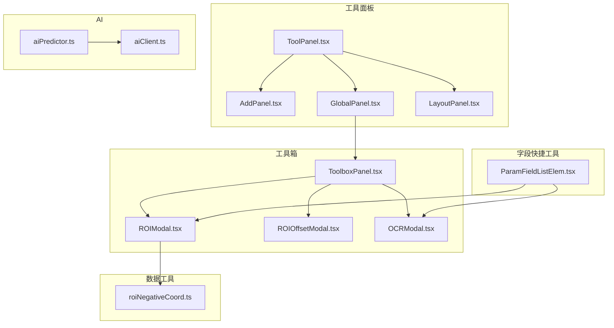
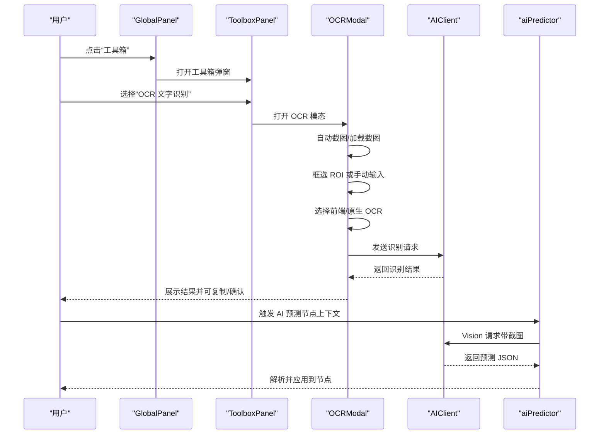
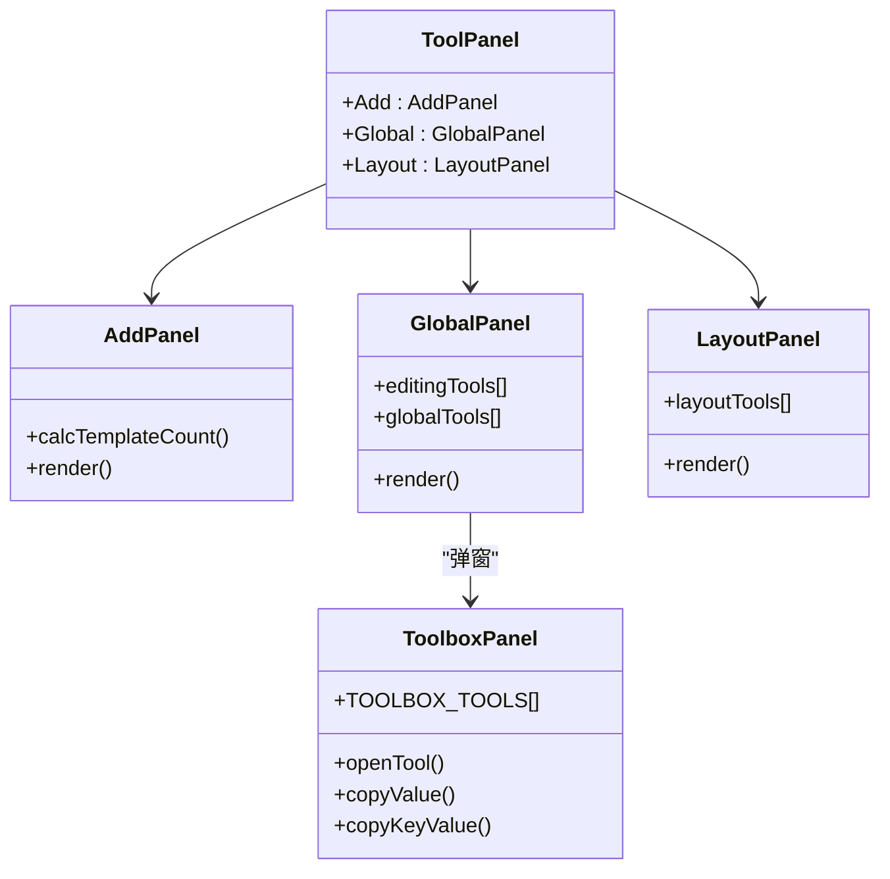
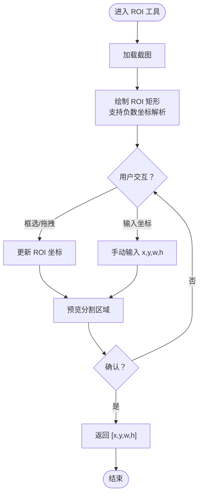
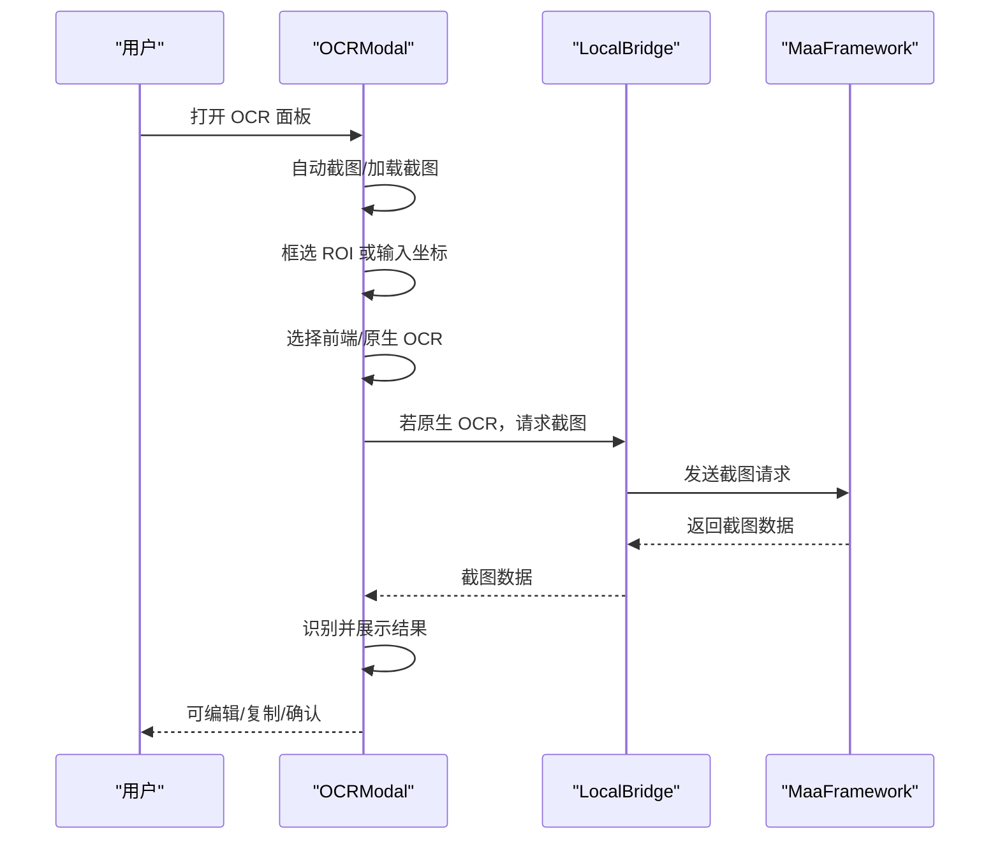
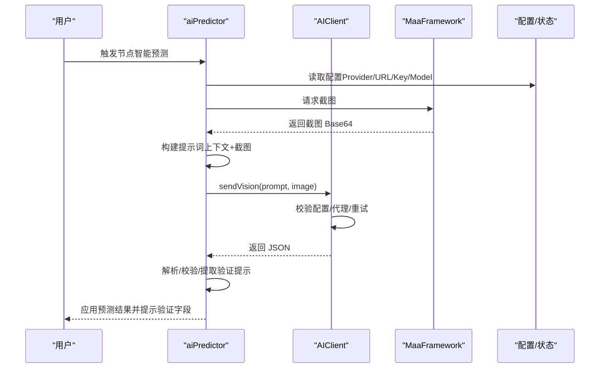
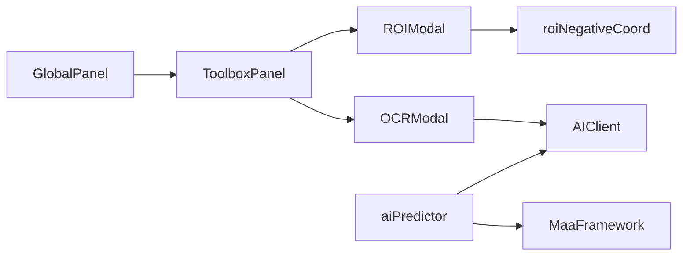

# 工具与实用程序

<cite>
**本文引用的文件**
- [ToolPanel.tsx](file://src/components/panels/tools/ToolPanel.tsx)
- [AddPanel.tsx](file://src/components/panels/tools/AddPanel.tsx)
- [GlobalPanel.tsx](file://src/components/panels/tools/GlobalPanel.tsx)
- [LayoutPanel.tsx](file://src/components/panels/tools/LayoutPanel.tsx)
- [ToolboxPanel.tsx](file://src/components/panels/tools/ToolboxPanel.tsx)
- [ROIModal.tsx](file://src/components/modals/ROIModal.tsx)
- [ROIOffsetModal.tsx](file://src/components/modals/ROIOffsetModal.tsx)
- [OCRModal.tsx](file://src/components/modals/OCRModal.tsx)
- [ParamFieldListElem.tsx](file://src/components/panels/field/items/ParamFieldListElem.tsx)
- [aiClient.ts](file://src/utils/ai/aiClient.ts)
- [aiPredictor.ts](file://src/utils/ai/aiPredictor.ts)
- [roiNegativeCoord.ts](file://src/utils/data/roiNegativeCoord.ts)
- [ToolboxPanel.module.less](file://src/styles/panels/ToolboxPanel.module.less)
- [ToolPanel.module.less](file://src/styles/panels/ToolPanel.module.less)
- [field快捷工具.md](file://docsite/docs/01.指南/20.本地服务/20.字段快捷工具.md)
</cite>

## 目录
1. [简介](#简介)
2. [项目结构](#项目结构)
3. [核心组件](#核心组件)
4. [架构总览](#架构总览)
5. [详细组件分析](#详细组件分析)
6. [依赖分析](#依赖分析)
7. [性能考量](#性能考量)
8. [故障排查指南](#故障排查指南)
9. [结论](#结论)
10. [附录](#附录)

## 简介
本文件面向工具与实用程序模块，系统性梳理以下能力与实现细节：
- AI 助手集成与智能补全：统一客户端、多厂商 Provider、代理转发、加密存储、流式/非流式响应、历史记录与令牌用量估算。
- ROI 操作工具：负数坐标解析、区域绘制与可视化、偏移计算、位移差值测量。
- 截图与 OCR：前端 OCR（Tesseract.js）与原生 OCR（MaaFramework）双通道，截图预览、坐标回填、结果复制。
- 字段快捷工具：在字段面板内为特定字段提供“快捷工具”入口，联动 ROI/OCR/模板/取色/偏移/位移等工具。
- 工具面板架构与扩展机制：工具面板分层（添加、全局、布局）、工具箱弹窗、结果复制、连接状态校验。
- 工具开发与自定义：新增工具的最小改动路径、Modal 与 Panel 的协作模式、样式与交互规范。
- 性能优化与用户体验：延迟加载、防抖、进度提示、即时反馈、轻量化交互。

## 项目结构
工具与实用程序相关代码主要分布在以下位置：
- 工具面板与工具箱：src/components/panels/tools/* 与 src/components/panels/tools/ToolboxPanel.tsx
- ROI/OCR 等模态：src/components/modals/*
- 字段面板快捷工具：src/components/panels/field/items/ParamFieldListElem.tsx
- AI 客户端与预测：src/utils/ai/*
- ROI 负数坐标工具：src/utils/data/roiNegativeCoord.ts
- 样式：src/styles/panels/*

图表来源
- [ToolPanel.tsx:1-11](file://src/components/panels/tools/ToolPanel.tsx#L1-L11)
- [AddPanel.tsx:1-112](file://src/components/panels/tools/AddPanel.tsx#L1-L112)
- [GlobalPanel.tsx:1-341](file://src/components/panels/tools/GlobalPanel.tsx#L1-L341)
- [LayoutPanel.tsx:1-206](file://src/components/panels/tools/LayoutPanel.tsx#L1-L206)
- [ToolboxPanel.tsx:1-525](file://src/components/panels/tools/ToolboxPanel.tsx#L1-L525)
- [ROIModal.tsx:1-564](file://src/components/modals/ROIModal.tsx#L1-L564)
- [ROIOffsetModal.tsx:527-861](file://src/components/modals/ROIOffsetModal.tsx#L527-L861)
- [OCRModal.tsx:54-125](file://src/components/modals/OCRModal.tsx#L54-L125)
- [ParamFieldListElem.tsx:1-44](file://src/components/panels/field/items/ParamFieldListElem.tsx#L1-L44)
- [aiClient.ts:1-520](file://src/utils/ai/aiClient.ts#L1-L520)
- [aiPredictor.ts:1-583](file://src/utils/ai/aiPredictor.ts#L1-L583)
- [roiNegativeCoord.ts:1-313](file://src/utils/data/roiNegativeCoord.ts#L1-L313)

章节来源
- [ToolPanel.tsx:1-11](file://src/components/panels/tools/ToolPanel.tsx#L1-L11)
- [ToolboxPanel.tsx:1-525](file://src/components/panels/tools/ToolboxPanel.tsx#L1-L525)

## 核心组件
- 工具面板聚合：ToolPanel.tsx 将 AddPanel、GlobalPanel、LayoutPanel 三个面板聚合导出，形成统一入口。
- 工具箱面板：ToolboxPanel.tsx 提供 OCR、模板截图、颜色取点、区域选择、偏移测量、位移差值等工具入口，支持结果复制与键值对复制。
- ROI 工具：ROIModal.tsx 支持鼠标框选、坐标输入、负数坐标解析与可视化、结果回填。
- OCR 工具：OCRModal.tsx 支持前端 OCR（Tesseract.js）与原生 OCR（MaaFramework），自动截图、识别、结果编辑与回填。
- 字段快捷工具：ParamFieldListElem.tsx 在字段输入旁提供快捷工具按钮，联动 ROI/OCR/模板/取色/偏移/位移等。
- AI 客户端：aiClient.ts 提供统一的聊天接口，支持多厂商 Provider、代理转发、加密存储、重试与错误格式化。
- AI 预测：aiPredictor.ts 提供节点上下文采集、截图、提示词构建、Vision 预测、结果解析与校验、批量应用。

章节来源
- [ToolPanel.tsx:1-11](file://src/components/panels/tools/ToolPanel.tsx#L1-L11)
- [ToolboxPanel.tsx:1-525](file://src/components/panels/tools/ToolboxPanel.tsx#L1-L525)
- [ROIModal.tsx:1-564](file://src/components/modals/ROIModal.tsx#L1-L564)
- [OCRModal.tsx:54-125](file://src/components/modals/OCRModal.tsx#L54-L125)
- [ParamFieldListElem.tsx:1-44](file://src/components/panels/field/items/ParamFieldListElem.tsx#L1-L44)
- [aiClient.ts:1-520](file://src/utils/ai/aiClient.ts#L1-L520)
- [aiPredictor.ts:1-583](file://src/utils/ai/aiPredictor.ts#L1-L583)

## 架构总览
工具体系采用“面板 + 弹窗 + Modal”的分层设计：
- 面板层：工具面板负责入口与分组，提供全局操作、布局与添加节点等能力。
- 工具箱层：ToolboxPanel 作为弹窗容器，集中管理各类工具 Modal。
- 工具层：各 Modal 负责具体交互与数据回填，如 ROI、OCR、模板、颜色、偏移、位移等。
- 数据与算法层：ROI 负数坐标解析、AI 客户端与预测逻辑、字段快捷工具联动。

图表来源
- [GlobalPanel.tsx:277-333](file://src/components/panels/tools/GlobalPanel.tsx#L277-L333)
- [ToolboxPanel.tsx:110-160](file://src/components/panels/tools/ToolboxPanel.tsx#L110-L160)
- [OCRModal.tsx:54-125](file://src/components/modals/OCRModal.tsx#L54-L125)
- [aiClient.ts:203-282](file://src/utils/ai/aiClient.ts#L203-L282)
- [aiPredictor.ts:311-342](file://src/utils/ai/aiPredictor.ts#L311-L342)

## 详细组件分析

### 工具面板架构与扩展机制
- 分层设计：ToolPanel.tsx 聚合 Add/Global/Layout 三类面板，便于按需组合与扩展。
- 扩展方式：新增面板只需在 ToolPanel.tsx 中注册并在布局中引用；工具箱新增工具只需在 ToolboxPanel.tsx 的配置数组中加入条目，并引入对应 Modal。
- 样式规范：ToolPanel.module.less 与 ToolboxPanel.module.less 提供统一的图标尺寸、间距与交互反馈样式。

图表来源
- [ToolPanel.tsx:1-11](file://src/components/panels/tools/ToolPanel.tsx#L1-L11)
- [AddPanel.tsx:36-43](file://src/components/panels/tools/AddPanel.tsx#L36-L43)
- [GlobalPanel.tsx:101-204](file://src/components/panels/tools/GlobalPanel.tsx#L101-L204)
- [LayoutPanel.tsx:62-164](file://src/components/panels/tools/LayoutPanel.tsx#L62-L164)
- [ToolboxPanel.tsx:49-111](file://src/components/panels/tools/ToolboxPanel.tsx#L49-L111)

章节来源
- [ToolPanel.tsx:1-11](file://src/components/panels/tools/ToolPanel.tsx#L1-L11)
- [ToolboxPanel.module.less:1-78](file://src/styles/panels/ToolboxPanel.module.less#L1-L78)
- [ToolPanel.module.less:1-78](file://src/styles/panels/ToolPanel.module.less#L1-L78)

### ROI 操作工具与算法
- 负数坐标解析：roiNegativeCoord.ts 提供 resolveNegativeROI，支持 x/y 从右/下边缘计算，w/h=0 延伸至边缘，w/h<0 视 (x,y) 为右下角。
- 可视化与交互：ROIModal.tsx 在 Canvas 上绘制 ROI 区域，支持鼠标框选、拖拽平移、滚轮缩放、负数坐标分割区域高亮。
- 结果回填：确认后将 [x,y,w,h] 回填至字段或工具调用方。

图表来源
- [ROIModal.tsx:46-121](file://src/components/modals/ROIModal.tsx#L46-L121)
- [roiNegativeCoord.ts:55-178](file://src/utils/data/roiNegativeCoord.ts#L55-L178)

章节来源
- [ROIModal.tsx:1-564](file://src/components/modals/ROIModal.tsx#L1-L564)
- [roiNegativeCoord.ts:1-313](file://src/utils/data/roiNegativeCoord.ts#L1-L313)

### 截图与 OCR 功能
- 前端 OCR（Tesseract.js）：OCRModal.tsx 支持在当前截图上裁剪 ROI 并进行识别，适合稳定、快速、多语言混合识别。
- 原生 OCR（MaaFramework）：通过 LocalBridge 与设备控制器交互，重新截取当前窗口画面，适合本地模型与特定场景。
- 用户交互：自动截图、手动刷新、框选 ROI、选择识别模式、编辑结果、确认回填。

图表来源
- [OCRModal.tsx:54-125](file://src/components/modals/OCRModal.tsx#L54-L125)
- [OCRModal.tsx:769-809](file://src/components/modals/OCRModal.tsx#L769-L809)

章节来源
- [OCRModal.tsx:54-125](file://src/components/modals/OCRModal.tsx#L54-L125)
- [OCRModal.tsx:769-809](file://src/components/modals/OCRModal.tsx#L769-L809)
- [field快捷工具.md:96-133](file://docsite/docs/01.指南/20.本地服务/20.字段快捷工具.md#L96-L133)

### 字段快捷工具的配置与使用
- 快捷工具配置：ParamFieldListElem.tsx 定义 QUICK_TOOLS 映射，针对 roi/target/begin/end 等字段提供“区域选择”等快捷入口。
- 调用链路：点击快捷工具图标 -> 打开对应 Modal（如 ROIModal/OCRModal）-> 交互完成 -> 回填字段值。
- 与工具箱协同：字段面板快捷工具与工具箱中的同名工具共享交互体验与数据格式。

章节来源
- [ParamFieldListElem.tsx:1-44](file://src/components/panels/field/items/ParamFieldListElem.tsx#L1-L44)
- [ParamFieldListElem.tsx:369-711](file://src/components/panels/field/items/ParamFieldListElem.tsx#L369-L711)

### AI 助手集成与智能补全
- 统一客户端：AIClient 封装多厂商 Provider、代理转发、加密存储、重试与错误格式化、历史记录与令牌用量估算。
- 预测流程：aiPredictor 收集节点上下文（前置节点、连接类型、截图）、构建 Vision 提示词、调用 AIClient、解析 JSON、校验类型与字段、批量应用到节点。
- 交互反馈：支持进度回调、错误提示、历史记录持久化。

图表来源
- [aiPredictor.ts:172-251](file://src/utils/ai/aiPredictor.ts#L172-L251)
- [aiPredictor.ts:311-342](file://src/utils/ai/aiPredictor.ts#L311-L342)
- [aiClient.ts:203-282](file://src/utils/ai/aiClient.ts#L203-L282)

章节来源
- [aiClient.ts:1-520](file://src/utils/ai/aiClient.ts#L1-L520)
- [aiPredictor.ts:1-583](file://src/utils/ai/aiPredictor.ts#L1-L583)

## 依赖分析
- 组件耦合
  - GlobalPanel 依赖 ToolboxPanel（懒加载），ToolboxPanel 再依赖各工具 Modal。
  - ParamFieldListElem 与多个 Modal 直接交互，形成“字段快捷工具”闭环。
  - ROIModal 依赖 roiNegativeCoord 工具函数。
- 外部依赖
  - LocalBridge/WS：用于 AI 代理转发与设备截图。
  - MaaFramework：设备连接、截图、控制器交互。
  - Tesseract.js：前端 OCR 识别（在 OCRModal 中使用）。

图表来源
- [GlobalPanel.tsx:13-38](file://src/components/panels/tools/GlobalPanel.tsx#L13-L38)
- [ToolboxPanel.tsx:9-38](file://src/components/panels/tools/ToolboxPanel.tsx#L9-L38)
- [ROIModal.tsx:1-12](file://src/components/modals/ROIModal.tsx#L1-L12)
- [OCRModal.tsx:54-76](file://src/components/modals/OCRModal.tsx#L54-L76)
- [roiNegativeCoord.ts:1-313](file://src/utils/data/roiNegativeCoord.ts#L1-L313)
- [aiClient.ts:1-520](file://src/utils/ai/aiClient.ts#L1-L520)
- [aiPredictor.ts:1-583](file://src/utils/ai/aiPredictor.ts#L1-L583)

章节来源
- [GlobalPanel.tsx:13-38](file://src/components/panels/tools/GlobalPanel.tsx#L13-L38)
- [ToolboxPanel.tsx:9-38](file://src/components/panels/tools/ToolboxPanel.tsx#L9-L38)
- [ROIModal.tsx:1-12](file://src/components/modals/ROIModal.tsx#L1-L12)
- [OCRModal.tsx:54-76](file://src/components/modals/OCRModal.tsx#L54-L76)
- [roiNegativeCoord.ts:1-313](file://src/utils/data/roiNegativeCoord.ts#L1-L313)
- [aiClient.ts:1-520](file://src/utils/ai/aiClient.ts#L1-L520)
- [aiPredictor.ts:1-583](file://src/utils/ai/aiPredictor.ts#L1-L583)

## 性能考量
- 懒加载与分块：工具箱 Modal 采用 React.lazy/Suspense，仅在打开时加载，降低初始包体与首屏压力。
- 进度与提示：AI 预测与 OCR 识别提供进度回调与即时反馈，避免用户等待焦虑。
- 代理与重试：AIClient 支持 LocalBridge 代理与重试策略，缓解网络波动与 CORS 问题。
- 轻量化交互：工具箱结果区支持“复制值/键值对”，减少重复输入与错误率。
- ROI 绘制优化：Canvas 绘制仅在坐标变化或图片加载后重绘，避免频繁重绘。

章节来源
- [ToolboxPanel.tsx:1-525](file://src/components/panels/tools/ToolboxPanel.tsx#L1-L525)
- [aiClient.ts:135-180](file://src/utils/ai/aiClient.ts#L135-L180)
- [ROIModal.tsx:46-121](file://src/components/modals/ROIModal.tsx#L46-L121)

## 故障排查指南
- AI 请求失败
  - 检查配置：API URL、API Key、模型名称是否齐全。
  - CORS 问题：开启 LocalBridge 代理或允许跨域。
  - 重试与取消：支持重试与 Abort 控制，避免长时间阻塞。
- OCR 识别异常
  - 前端 OCR：首次加载模型耗时较长，后续更快；确保截图清晰、ROI 准确。
  - 原生 OCR：注意窗口更新导致的不一致，建议使用前端 OCR。
- ROI 坐标异常
  - 负数坐标：x/y 从右/下边缘计算，w/h=0 延伸至边缘，w/h<0 视为右下角。
  - 分割区域：超出屏幕范围时会分割为左上与右下两块，注意坐标映射。
- 工具箱不可用
  - 未连接设备：检查 LocalBridge 与设备连接状态，提示“请先连接本地服务与设备”。

章节来源
- [aiClient.ts:79-133](file://src/utils/ai/aiClient.ts#L79-L133)
- [OCRModal.tsx:54-125](file://src/components/modals/OCRModal.tsx#L54-L125)
- [roiNegativeCoord.ts:55-178](file://src/utils/data/roiNegativeCoord.ts#L55-L178)
- [ToolboxPanel.tsx:124-131](file://src/components/panels/tools/ToolboxPanel.tsx#L124-L131)

## 结论
本工具与实用程序体系通过“面板 + 工具箱 + Modal”的分层设计，实现了从全局操作到具体工具的完整闭环。AI 助手集成提供上下文感知的智能补全，ROI/OCR 工具支持负数坐标与多通道识别，字段快捷工具将高频操作下沉到输入控件旁，显著提升配置效率与准确性。配合懒加载、代理转发、进度反馈与结果复制等机制，整体具备良好的性能与用户体验。

## 附录
- 新增工具开发指引
  - 在 ToolboxPanel.tsx 的 TOOLBOX_TOOLS 中新增条目，定义图标、标签与 modalType。
  - 在工具箱中引入对应 Modal，并在 openTool 分支中打开。
  - 在 handleXxxConfirm 中处理确认回调，设置 lastResult 并提示成功。
  - 在 copyValue/copyKeyValue 中添加对应类型的复制逻辑。
  - 如涉及截图或设备交互，先检查连接状态并提示错误。
- 字段快捷工具扩展
  - 在 QUICK_TOOLS 中为字段名添加映射，选择对应快捷工具类型。
  - 在 ParamFieldListElem.tsx 中处理点击事件，打开相应 Modal 并回填结果。
- 样式与交互
  - 使用 ToolPanel.module.less/ToolboxPanel.module.less 的统一样式变量与交互反馈。
  - 保持图标尺寸、间距与 hover/active 状态一致，确保一致性与可发现性。

章节来源
- [ToolboxPanel.tsx:49-111](file://src/components/panels/tools/ToolboxPanel.tsx#L49-L111)
- [ToolboxPanel.tsx:217-316](file://src/components/panels/tools/ToolboxPanel.tsx#L217-L316)
- [ParamFieldListElem.tsx:39-44](file://src/components/panels/field/items/ParamFieldListElem.tsx#L39-L44)
- [ToolPanel.module.less:1-78](file://src/styles/panels/ToolPanel.module.less#L1-L78)
- [ToolboxPanel.module.less:1-78](file://src/styles/panels/ToolboxPanel.module.less#L1-L78)