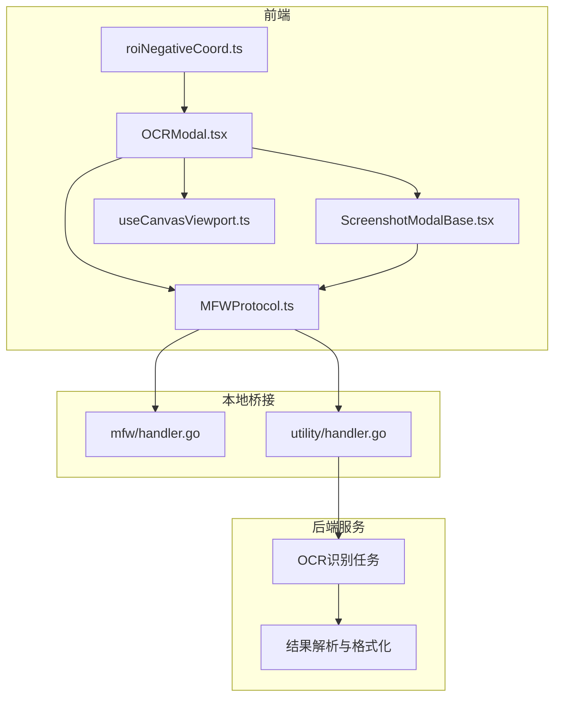
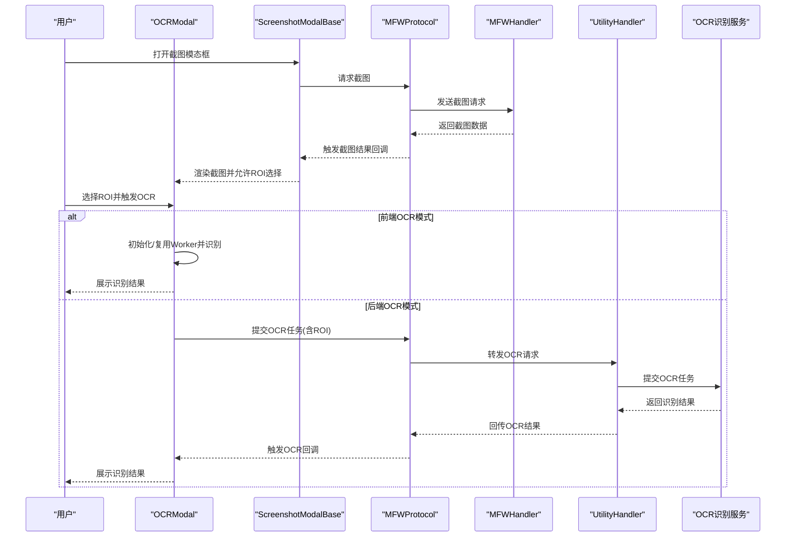
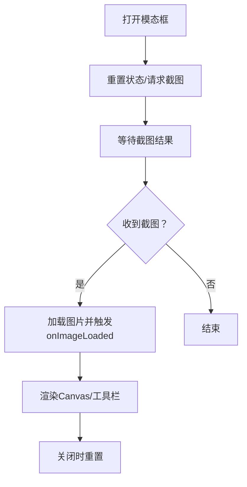
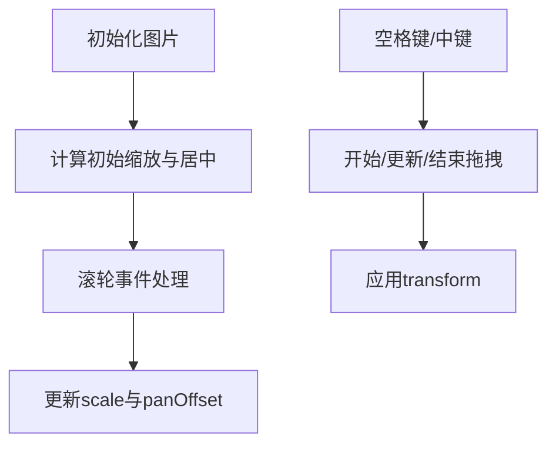
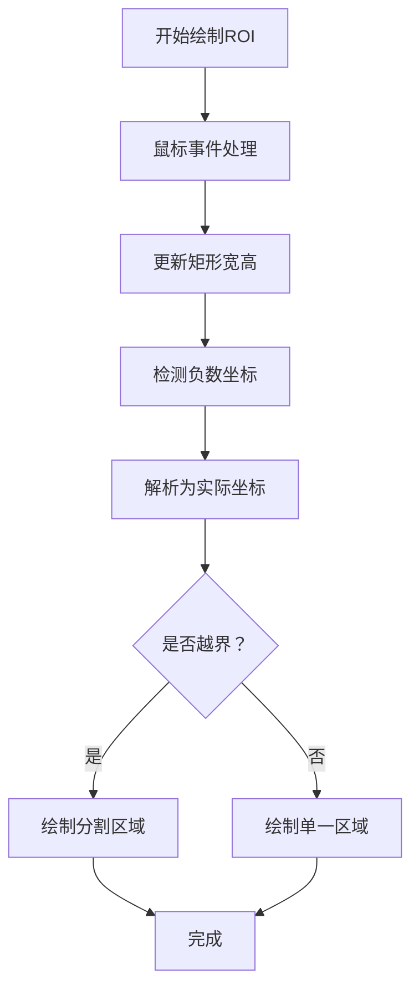
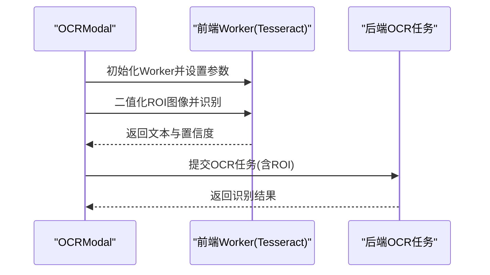
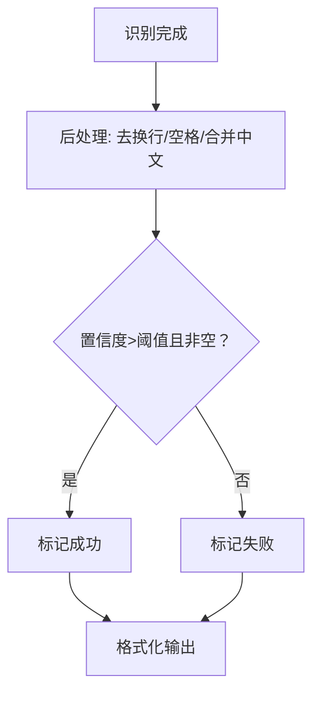
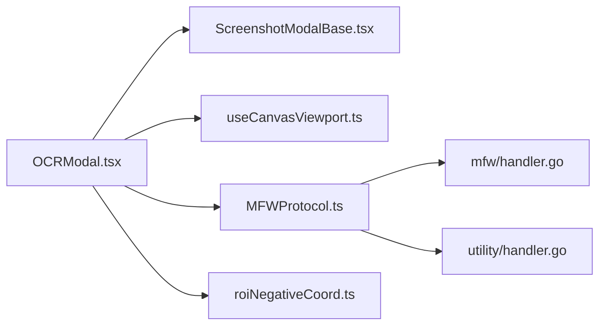

# 截图与OCR工具

<cite>
**本文档引用的文件**
- [OCRModal.tsx](file://src/components/modals/OCRModal.tsx)
- [ScreenshotModalBase.tsx](file://src/components/modals/ScreenshotModalBase.tsx)
- [useCanvasViewport.ts](file://src/hooks/useCanvasViewport.ts)
- [MFWProtocol.ts](file://src/services/protocols/MFWProtocol.ts)
- [handler.go](file://LocalBridge/internal/protocol/mfw/handler.go)
- [handler.go](file://LocalBridge/internal/protocol/utility/handler.go)
- [roiNegativeCoord.ts](file://src/utils/data/roiNegativeCoord.ts)
- [Recognition Result Handling.md](file://dev/instructions/maafw-golang-binding/Recognition Result Handling.md)
- [PipelineProtocol.md](file://dev/instructions/maafw-guide/3.1-PipelineProtocol.md)
- [aiPredictor.ts](file://src/utils/ai/aiPredictor.ts)
</cite>

## 目录
1. [引言](#引言)
2. [项目结构](#项目结构)
3. [核心组件](#核心组件)
4. [架构总览](#架构总览)
5. [详细组件分析](#详细组件分析)
6. [依赖关系分析](#依赖关系分析)
7. [性能考虑](#性能考虑)
8. [故障排查指南](#故障排查指南)
9. [结论](#结论)
10. [附录](#附录)

## 引言
本文件面向截图与OCR工具的技术文档，围绕前端截图模态框、图像捕获机制、OCR识别引擎集成与流程、用户交互设计、结果后处理与格式化、性能优化与内存策略、配置参数调优与准确率提升方法，以及扩展开发与自定义识别模型集成进行系统化阐述。目标是帮助开发者与使用者全面理解并高效使用该工具链。

## 项目结构
本工具位于多模块协作的前端应用中，主要涉及：
- 截图与OCR交互层：位于前端组件层，负责用户交互、截图请求、ROI选择、OCR识别与结果显示。
- 视口控制层：封装缩放、平移、滚轮缩放、空格拖拽等交互行为。
- 本地桥接层：通过WebSocket协议与本地服务通信，实现截图与OCR任务提交、结果回调。
- 本地服务层：负责资源加载、任务调度与OCR执行，并返回结果。

**图表来源**
- [OCRModal.tsx:56-1103](file://src/components/modals/OCRModal.tsx#L56-L1103)
- [ScreenshotModalBase.tsx:78-405](file://src/components/modals/ScreenshotModalBase.tsx#L78-L405)
- [useCanvasViewport.ts:69-307](file://src/hooks/useCanvasViewport.ts#L69-L307)
- [MFWProtocol.ts:1-835](file://src/services/protocols/MFWProtocol.ts#L1-L835)
- [handler.go:414-448](file://LocalBridge/internal/protocol/mfw/handler.go#L414-L448)
- [handler.go:215-324](file://LocalBridge/internal/protocol/utility/handler.go#L215-L324)

**章节来源**
- [OCRModal.tsx:56-1103](file://src/components/modals/OCRModal.tsx#L56-L1103)
- [ScreenshotModalBase.tsx:78-405](file://src/components/modals/ScreenshotModalBase.tsx#L78-L405)
- [useCanvasViewport.ts:69-307](file://src/hooks/useCanvasViewport.ts#L69-L307)
- [MFWProtocol.ts:1-835](file://src/services/protocols/MFWProtocol.ts#L1-L835)
- [handler.go:414-448](file://LocalBridge/internal/protocol/mfw/handler.go#L414-L448)
- [handler.go:215-324](file://LocalBridge/internal/protocol/utility/handler.go#L215-L324)

## 核心组件
- 截图模态框基座：统一处理截图请求、图片加载、视口控制与工具栏渲染，为各具体模态提供一致的交互体验。
- OCR模态框：在截图基础上支持ROI选择、前后端双模式OCR识别、结果展示与后处理。
- 视口控制Hook：集中处理缩放、平移、滚轮缩放、空格拖拽、中键拖拽等交互。
- 本地协议与桥接：封装MFW与Utility协议的消息收发、回调注册与结果分发。
- ROI负数坐标解析：支持负数坐标与越界ROI的解析与可视化提示。

**章节来源**
- [ScreenshotModalBase.tsx:78-405](file://src/components/modals/ScreenshotModalBase.tsx#L78-L405)
- [OCRModal.tsx:56-1103](file://src/components/modals/OCRModal.tsx#L56-L1103)
- [useCanvasViewport.ts:69-307](file://src/hooks/useCanvasViewport.ts#L69-L307)
- [MFWProtocol.ts:1-835](file://src/services/protocols/MFWProtocol.ts#L1-L835)
- [roiNegativeCoord.ts:55-178](file://src/utils/data/roiNegativeCoord.ts#L55-L178)

## 架构总览
整体架构采用“前端组件 + 本地桥接 + 本地服务”的三层设计：
- 前端负责用户交互与界面渲染；
- 本地桥接负责协议封装与消息路由；
- 本地服务负责资源加载与任务执行。

**图表来源**
- [OCRModal.tsx:56-1103](file://src/components/modals/OCRModal.tsx#L56-L1103)
- [ScreenshotModalBase.tsx:124-196](file://src/components/modals/ScreenshotModalBase.tsx#L124-L196)
- [MFWProtocol.ts:246-295](file://src/services/protocols/MFWProtocol.ts#L246-L295)
- [handler.go:414-448](file://LocalBridge/internal/protocol/mfw/handler.go#L414-L448)
- [handler.go:215-324](file://LocalBridge/internal/protocol/utility/handler.go#L215-L324)

## 详细组件分析

### 截图模态框基座（ScreenshotModalBase）
- 功能职责
  - 统一管理截图请求与结果回调，确保每次打开模态框时刷新截图。
  - 提供视口控制能力（缩放、平移、滚轮缩放），并暴露工具栏与Canvas渲染接口给子组件。
  - 提供左右分栏布局：左侧为截图预览区，右侧为参数配置区。
- 关键流程
  - 打开时清理状态并请求截图；
  - 监听截图结果回调，设置图片并触发子组件onImageLoaded；
  - 关闭时重置视口与内部状态。

**图表来源**
- [ScreenshotModalBase.tsx:124-196](file://src/components/modals/ScreenshotModalBase.tsx#L124-L196)

**章节来源**
- [ScreenshotModalBase.tsx:78-405](file://src/components/modals/ScreenshotModalBase.tsx#L78-L405)

### 视口控制Hook（useCanvasViewport）
- 功能职责
  - 统一处理缩放、平移、滚轮缩放、空格拖拽、中键拖拽等交互；
  - 计算初始缩放与居中偏移，保证大图适配容器；
  - 提供光标样式辅助与状态重置。
- 性能要点
  - 通过transform与scale减少DOM重排；
  - 限定缩放范围，避免过度放大导致的性能问题。

**图表来源**
- [useCanvasViewport.ts:123-187](file://src/hooks/useCanvasViewport.ts#L123-L187)

**章节来源**
- [useCanvasViewport.ts:69-307](file://src/hooks/useCanvasViewport.ts#L69-L307)

### ROI选择与负数坐标解析
- ROI选择
  - 支持鼠标拖拽绘制矩形，实时绘制ROI区域；
  - 支持手动输入坐标，自动校验与重绘。
- 负数坐标解析
  - 支持负数x/y、w/h=0或负数的灵活表达；
  - 自动计算实际坐标、越界情况与需要的扩展边距；
  - 可在Canvas上可视化提示扩展区域与边界线。

**图表来源**
- [OCRModal.tsx:450-501](file://src/components/modals/OCRModal.tsx#L450-L501)
- [roiNegativeCoord.ts:55-178](file://src/utils/data/roiNegativeCoord.ts#L55-L178)

**章节来源**
- [OCRModal.tsx:418-501](file://src/components/modals/OCRModal.tsx#L418-L501)
- [roiNegativeCoord.ts:55-178](file://src/utils/data/roiNegativeCoord.ts#L55-L178)

### OCR识别流程与双模式支持
- 前端OCR（Tesseract.js）
  - 首次使用时初始化Worker并设置PSM/OEM参数；
  - 对ROI区域进行二值化处理，提高识别稳定性；
  - 识别完成后进行文本后处理（去多余空白、合并中文字符间空格等），并根据置信度判定成功与否。
- 后端OCR（MaaFramework）
  - 通过协议提交OCR任务，包含ROI与节点配置；
  - 等待任务完成并接收结果回调；
  - 本地服务负责资源加载与任务执行。

**图表来源**
- [OCRModal.tsx:176-258](file://src/components/modals/OCRModal.tsx#L176-L258)
- [OCRModal.tsx:260-330](file://src/components/modals/OCRModal.tsx#L260-L330)
- [handler.go:304-324](file://LocalBridge/internal/protocol/utility/handler.go#L304-L324)

**章节来源**
- [OCRModal.tsx:176-258](file://src/components/modals/OCRModal.tsx#L176-L258)
- [OCRModal.tsx:260-330](file://src/components/modals/OCRModal.tsx#L260-L330)
- [handler.go:215-324](file://LocalBridge/internal/protocol/utility/handler.go#L215-L324)

### OCR结果后处理与格式化
- 文本后处理
  - 去除多余换行与多余空格，合并中文字符间的空格；
  - 基于置信度与非空判断决定识别成功状态。
- 结果格式化
  - 以字符串形式返回识别文本；
  - 在后端模式下，遵循MaaFramework结果解析规范，便于后续节点消费。

**图表来源**
- [OCRModal.tsx:227-245](file://src/components/modals/OCRModal.tsx#L227-L245)
- [Recognition Result Handling.md:136-247](file://dev/instructions/maafw-golang-binding/Recognition Result Handling.md#L136-L247)

**章节来源**
- [OCRModal.tsx:227-245](file://src/components/modals/OCRModal.tsx#L227-L245)
- [Recognition Result Handling.md:136-247](file://dev/instructions/maafw-golang-binding/Recognition Result Handling.md#L136-L247)

### 用户交互设计与操作便捷性
- 截图预览区
  - 支持滚轮缩放、空格拖拽、中键拖拽；
  - 适配窗口自动缩放，提供缩放百分比提示。
- ROI选择区
  - 实时绘制ROI，支持负数坐标与越界提示；
  - 提供坐标输入与自动校验。
- OCR模式切换
  - 前端/后端双模式，首开模型加载提示，识别状态可视化反馈。

**章节来源**
- [ScreenshotModalBase.tsx:225-325](file://src/components/modals/ScreenshotModalBase.tsx#L225-L325)
- [OCRModal.tsx:684-714](file://src/components/modals/OCRModal.tsx#L684-L714)

## 依赖关系分析
- 组件耦合
  - OCRModal依赖ScreenshotModalBase提供截图与视口控制；
  - OCRModal依赖MFWProtocol进行截图与OCR任务提交；
  - 视口控制独立于业务，复用性强。
- 外部依赖
  - 前端OCR使用tesseract.js，需注意模型加载与WebAssembly运行时；
  - 本地服务依赖MaaFramework资源目录结构与模型文件。

**图表来源**
- [OCRModal.tsx:56-1103](file://src/components/modals/OCRModal.tsx#L56-L1103)
- [ScreenshotModalBase.tsx:78-405](file://src/components/modals/ScreenshotModalBase.tsx#L78-L405)
- [useCanvasViewport.ts:69-307](file://src/hooks/useCanvasViewport.ts#L69-L307)
- [MFWProtocol.ts:1-835](file://src/services/protocols/MFWProtocol.ts#L1-L835)
- [handler.go:414-448](file://LocalBridge/internal/protocol/mfw/handler.go#L414-L448)
- [handler.go:215-324](file://LocalBridge/internal/protocol/utility/handler.go#L215-L324)
- [roiNegativeCoord.ts:55-178](file://src/utils/data/roiNegativeCoord.ts#L55-L178)

**章节来源**
- [OCRModal.tsx:56-1103](file://src/components/modals/OCRModal.tsx#L56-L1103)
- [ScreenshotModalBase.tsx:78-405](file://src/components/modals/ScreenshotModalBase.tsx#L78-L405)
- [useCanvasViewport.ts:69-307](file://src/hooks/useCanvasViewport.ts#L69-L307)
- [MFWProtocol.ts:1-835](file://src/services/protocols/MFWProtocol.ts#L1-L835)
- [handler.go:414-448](file://LocalBridge/internal/protocol/mfw/handler.go#L414-L448)
- [handler.go:215-324](file://LocalBridge/internal/protocol/utility/handler.go#L215-L324)
- [roiNegativeCoord.ts:55-178](file://src/utils/data/roiNegativeCoord.ts#L55-L178)

## 性能考虑
- 前端OCR
  - 首次初始化Worker时进行模型加载，建议在空闲时段或预热；
  - 二值化步骤在Canvas上完成，避免重复解码与内存拷贝；
  - 识别过程应避免频繁触发，可通过防抖策略降低CPU占用。
- 视口控制
  - 使用transform缩放与平移，避免重排；
  - 限定缩放范围，防止过大scale导致渲染压力。
- 本地服务
  - 资源加载阶段严格校验模型文件完整性；
  - 任务提交后等待完成，避免并发过多任务造成阻塞。

**章节来源**
- [OCRModal.tsx:176-258](file://src/components/modals/OCRModal.tsx#L176-L258)
- [useCanvasViewport.ts:123-187](file://src/hooks/useCanvasViewport.ts#L123-L187)
- [handler.go:215-248](file://LocalBridge/internal/protocol/utility/handler.go#L215-L248)

## 故障排查指南
- 截图失败
  - 检查控制器连接状态与controller_id有效性；
  - 确认截图请求发送成功并等待回调。
- OCR初始化失败
  - 检查OCR资源目录结构与必需文件（det.onnx、rec.onnx、keys.txt）；
  - 确认资源加载成功且Tasker已初始化。
- 识别结果为空或置信度低
  - 调整ROI范围，确保文字清晰；
  - 切换OCR模式（前端/后端）对比效果；
  - 调整OCR阈值与排序策略（后端模式）。

**章节来源**
- [MFWProtocol.ts:246-295](file://src/services/protocols/MFWProtocol.ts#L246-L295)
- [handler.go:414-448](file://LocalBridge/internal/protocol/mfw/handler.go#L414-L448)
- [handler.go:287-324](file://LocalBridge/internal/protocol/utility/handler.go#L287-L324)

## 结论
本工具通过统一的截图模态框与视口控制，结合前端与后端双OCR模式，提供了灵活高效的截图与文字识别能力。配合ROI负数坐标解析与结果后处理，能够满足复杂场景下的识别需求。通过合理的性能优化与配置调优，可在保证准确率的同时提升用户体验。

## 附录

### OCR配置参数与调优建议
- 前端OCR（Tesseract.js）
  - PSM（页面分割模式）：针对单行/单块/稀疏文本选择合适模式；
  - OEM（引擎模式）：优先使用LSTM引擎以获得更高精度；
  - 二值化：对低质量图像进行预处理，提升识别稳定性。
- 后端OCR（MaaFramework）
  - roi/roi_offset：精确定位识别区域；
  - expected/threshold：设定期望匹配与置信度阈值；
  - replace：对常见误识别进行替换；
  - order_by/index：控制结果排序与索引；
  - only_rec：仅识别模式需精确ROI；
  - model：指定模型文件夹（rec.onnx/det.onnx/keys.txt）；
  - color_filter：基于颜色节点进行二值化预处理。

**章节来源**
- [OCRModal.tsx:205-217](file://src/components/modals/OCRModal.tsx#L205-L217)
- [PipelineProtocol.md:605-645](file://dev/instructions/maafw-guide/3.1-PipelineProtocol.md#L605-L645)

### 扩展开发与自定义识别模型集成
- 自定义OCR模型
  - 在后端模式下，通过设置model参数指向自定义模型文件夹；
  - 确保模型文件齐全并通过资源加载校验。
- 自定义识别算法
  - 可参考OCR节点协议扩展自定义识别类型；
  - 在结果解析与格式化环节保持一致性，便于后续节点消费。

**章节来源**
- [PipelineProtocol.md:605-645](file://dev/instructions/maafw-guide/3.1-PipelineProtocol.md#L605-L645)
- [Recognition Result Handling.md:136-247](file://dev/instructions/maafw-golang-binding/Recognition Result Handling.md#L136-L247)