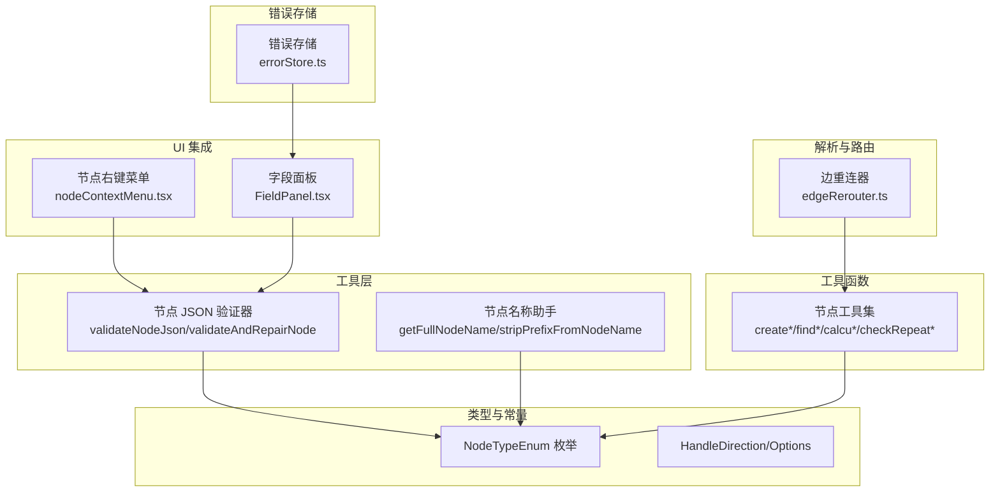
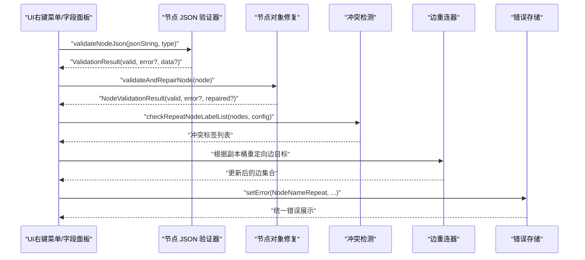
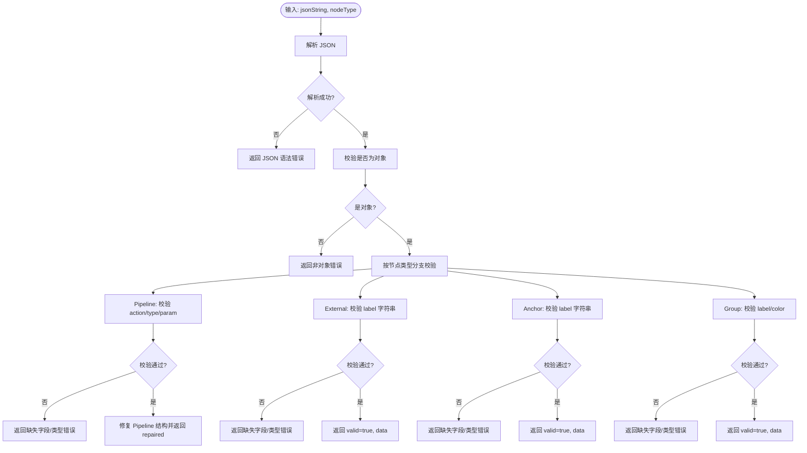
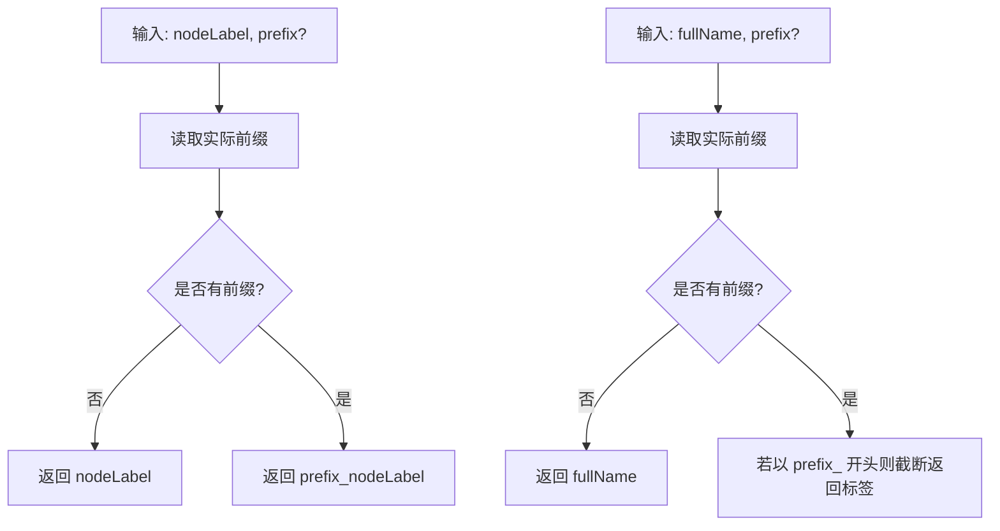
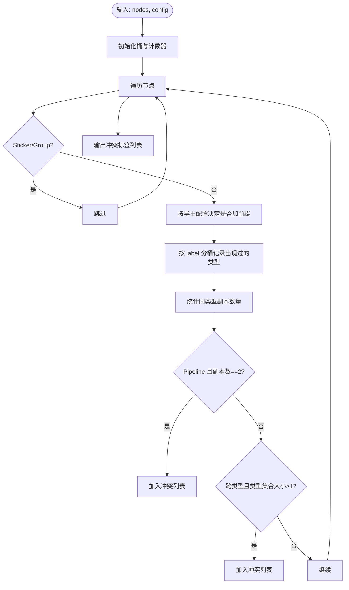
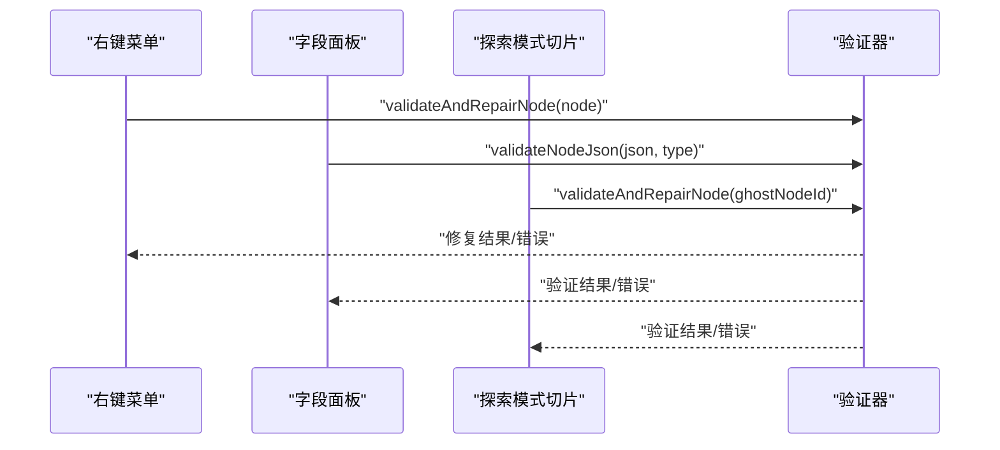
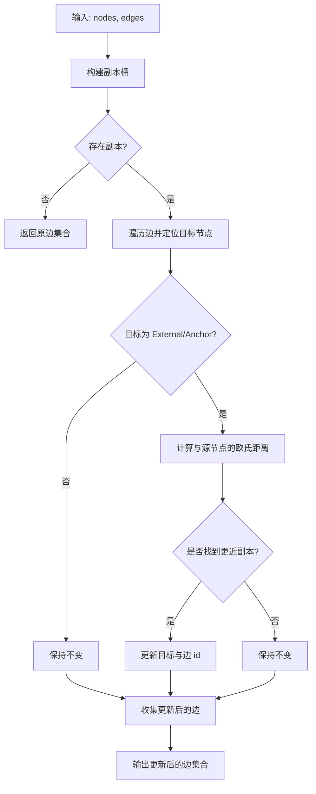
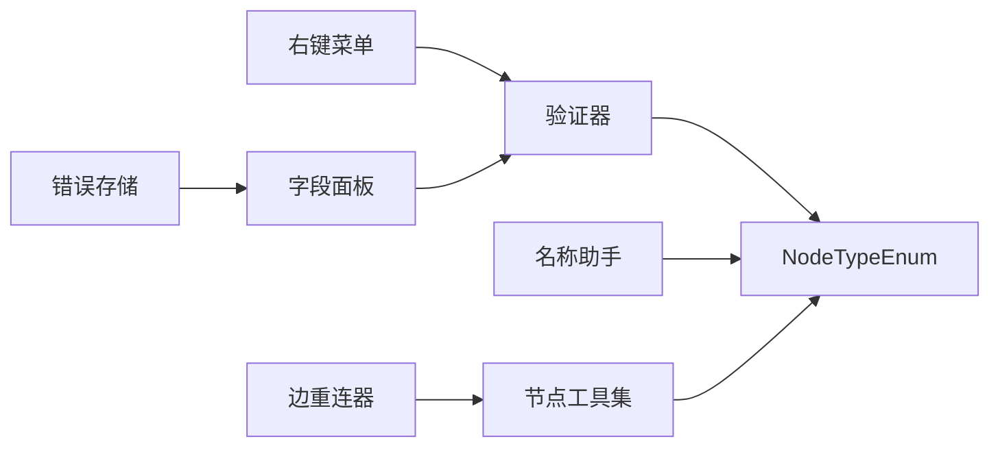

# 节点工具与验证

<cite>
**本文引用的文件**
- [nodeJsonValidator.ts](file://src/utils/node/nodeJsonValidator.ts)
- [nodeNameHelper.ts](file://src/utils/node/nodeNameHelper.ts)
- [constants.ts](file://src/components/flow/nodes/constants.ts)
- [utils.ts](file://src/components/flow/nodes/utils.ts)
- [nodeUtils.ts](file://src/stores/flow/utils/nodeUtils.ts)
- [nodeContextMenu.tsx](file://src/components/flow/nodes/nodeContextMenu.tsx)
- [FieldPanel.tsx](file://src/components/panels/main/FieldPanel.tsx)
- [explorationSlice.ts](file://src/stores/flow/slices/explorationSlice.ts)
- [edgeRerouter.ts](file://src/core/parser/edgeRerouter.ts)
- [errorStore.ts](file://src/stores/errorStore.ts)
</cite>

## 目录
1. [简介](#简介)
2. [项目结构](#项目结构)
3. [核心组件](#核心组件)
4. [架构总览](#架构总览)
5. [详细组件分析](#详细组件分析)
6. [依赖关系分析](#依赖关系分析)
7. [性能考量](#性能考量)
8. [故障排查指南](#故障排查指南)
9. [结论](#结论)
10. [附录](#附录)

## 简介
本文件聚焦于“节点工具与验证”的技术文档，系统阐述：
- 节点 JSON 验证器的规则定义与验证逻辑
- 节点名称助手的命名规范与冲突检测机制
- 节点工具函数的实现原理与使用场景
- 节点常量定义的组织结构与管理策略
- 节点验证在工作流中的作用与重要性
- 节点工具的扩展开发与自定义验证规则实现方法
- 节点工具的性能优化与错误处理最佳实践

## 项目结构
围绕节点工具与验证的相关模块分布如下：
- 工具层：节点 JSON 验证、节点名称助手
- 类型与常量：节点类型枚举、句柄方向等
- 工具函数：节点创建、查找、位置计算、冲突检测、分组顺序保证等
- UI 集成：节点右键菜单、字段面板对验证结果的展示与交互
- 解析与路由：边重连以适配同名副本的重定向逻辑
- 错误存储：统一错误类型与错误聚合

图表来源
- [nodeJsonValidator.ts:1-367](file://src/utils/node/nodeJsonValidator.ts#L1-L367)
- [nodeNameHelper.ts:1-43](file://src/utils/node/nodeNameHelper.ts#L1-L43)
- [constants.ts:1-47](file://src/components/flow/nodes/constants.ts#L1-L47)
- [utils.ts:1-139](file://src/components/flow/nodes/utils.ts#L1-L139)
- [nodeUtils.ts:1-339](file://src/stores/flow/utils/nodeUtils.ts#L1-L339)
- [nodeContextMenu.tsx:1-701](file://src/components/flow/nodes/nodeContextMenu.tsx#L1-L701)
- [FieldPanel.tsx:54-234](file://src/components/panels/main/FieldPanel.tsx#L54-L234)
- [edgeRerouter.ts:37-88](file://src/core/parser/edgeRerouter.ts#L37-L88)
- [errorStore.ts:1-38](file://src/stores/errorStore.ts#L1-L38)

章节来源
- [nodeJsonValidator.ts:1-367](file://src/utils/node/nodeJsonValidator.ts#L1-L367)
- [nodeNameHelper.ts:1-43](file://src/utils/node/nodeNameHelper.ts#L1-L43)
- [constants.ts:1-47](file://src/components/flow/nodes/constants.ts#L1-L47)
- [utils.ts:1-139](file://src/components/flow/nodes/utils.ts#L1-L139)
- [nodeUtils.ts:1-339](file://src/stores/flow/utils/nodeUtils.ts#L1-L339)
- [nodeContextMenu.tsx:1-701](file://src/components/flow/nodes/nodeContextMenu.tsx#L1-L701)
- [FieldPanel.tsx:54-234](file://src/components/panels/main/FieldPanel.tsx#L54-L234)
- [edgeRerouter.ts:37-88](file://src/core/parser/edgeRerouter.ts#L37-L88)
- [errorStore.ts:1-38](file://src/stores/errorStore.ts#L1-L38)

## 核心组件
- 节点 JSON 验证器：负责校验 JSON 字符串格式、对象结构以及按节点类型检查必填字段；同时提供节点对象的修复能力。
- 节点名称助手：提供带前缀与去前缀的节点名处理，统一命名规范。
- 节点工具集：封装节点创建、查找、位置计算、冲突检测、分组顺序保证等常用操作。
- 节点常量与类型：统一节点类型、句柄方向等基础定义。
- UI 集成：在右键菜单与字段面板中触发验证、展示修复提示与错误信息。
- 边重连器：基于副本检测结果，自动将边目标重定向到最近的同名副本，提升可读性与正确性。
- 错误存储：集中管理错误类型与消息，便于统一展示与定位。

章节来源
- [nodeJsonValidator.ts:1-367](file://src/utils/node/nodeJsonValidator.ts#L1-L367)
- [nodeNameHelper.ts:1-43](file://src/utils/node/nodeNameHelper.ts#L1-L43)
- [nodeUtils.ts:1-339](file://src/stores/flow/utils/nodeUtils.ts#L1-L339)
- [constants.ts:1-47](file://src/components/flow/nodes/constants.ts#L1-L47)
- [utils.ts:1-139](file://src/components/flow/nodes/utils.ts#L1-L139)
- [nodeContextMenu.tsx:1-701](file://src/components/flow/nodes/nodeContextMenu.tsx#L1-L701)
- [FieldPanel.tsx:54-234](file://src/components/panels/main/FieldPanel.tsx#L54-L234)
- [edgeRerouter.ts:37-88](file://src/core/parser/edgeRerouter.ts#L37-L88)
- [errorStore.ts:1-38](file://src/stores/errorStore.ts#L1-L38)

## 架构总览
节点工具与验证在系统中的关键流转如下：
- 用户在节点右键菜单或字段面板中进行编辑与调试
- 触发节点 JSON 验证或节点对象修复
- 若存在冲突（如同名），通过冲突检测与边重连器进行修正
- 错误信息通过错误存储与 UI 展示反馈给用户

图表来源
- [nodeContextMenu.tsx:224-231](file://src/components/flow/nodes/nodeContextMenu.tsx#L224-L231)
- [FieldPanel.tsx:196-234](file://src/components/panels/main/FieldPanel.tsx#L196-L234)
- [nodeJsonValidator.ts:103-144](file://src/utils/node/nodeJsonValidator.ts#L103-L144)
- [nodeUtils.ts:231-279](file://src/stores/flow/utils/nodeUtils.ts#L231-L279)
- [edgeRerouter.ts:50-87](file://src/core/parser/edgeRerouter.ts#L50-L87)
- [errorStore.ts:1-38](file://src/stores/errorStore.ts#L1-L38)

## 详细组件分析

### 节点 JSON 验证器
- 功能职责
  - 校验 JSON 字符串格式与对象结构
  - 按节点类型检查必填字段与类型约束
  - 对 Pipeline 节点进行结构完整性修复
  - 提供格式化 JSON 的辅助能力
- 关键规则
  - JSON 语法错误捕获与错误信息返回
  - 对象类型校验（排除数组与 null）
  - Pipeline 节点：校验 action 对象及其 type/param
  - External/Anchor/Group 节点：校验 label 字段类型
  - Group 节点：校验 color 字段取值范围
- 修复策略
  - Pipeline 节点：补全缺失的 recognition/action/others/extras 结构
  - 返回修复后的节点对象与提示信息
- 使用场景
  - 导入/粘贴节点 JSON 时的即时校验
  - 字段面板编辑过程中的实时验证
  - 调试前的数据一致性保障

图表来源
- [nodeJsonValidator.ts:103-217](file://src/utils/node/nodeJsonValidator.ts#L103-L217)
- [nodeJsonValidator.ts:219-352](file://src/utils/node/nodeJsonValidator.ts#L219-L352)

章节来源
- [nodeJsonValidator.ts:1-367](file://src/utils/node/nodeJsonValidator.ts#L1-L367)

### 节点名称助手
- 功能职责
  - 统一节点标签与前缀的拼接逻辑
  - 从完整节点名中移除前缀，获取原始标签
- 命名规范
  - 支持可选前缀，默认从当前文件配置中读取
  - 前缀与标签使用下划线连接
- 使用场景
  - 导出配置时为 Pipeline 节点添加前缀
  - 运行时节点名建议与自动补全
  - 冲突检测时对标签进行规范化处理

图表来源
- [nodeNameHelper.ts:14-43](file://src/utils/node/nodeNameHelper.ts#L14-L43)

章节来源
- [nodeNameHelper.ts:1-43](file://src/utils/node/nodeNameHelper.ts#L1-L43)

### 节点工具函数
- 节点创建
  - Pipeline/External/Anchor/Sticker/Group 节点的工厂函数，支持默认值与模板数据合并
- 节点查询
  - 按 id/label 查询节点，获取选中节点集合
- 位置计算
  - 基于选中节点与画布视口，计算新节点的插入位置
- 冲突检测
  - 按 label 分桶统计类型集合，区分“视觉副本”与“真实冲突”
  - Pipeline 与自身重复、跨类型同 label 视为冲突
  - 导出配置时可为 Pipeline 节点自动加前缀
- 分组顺序保证
  - 确保 Group 节点排在子节点之前，满足渲染与层级要求

图表来源
- [nodeUtils.ts:231-279](file://src/stores/flow/utils/nodeUtils.ts#L231-L279)

章节来源
- [nodeUtils.ts:1-339](file://src/stores/flow/utils/nodeUtils.ts#L1-L339)

### 节点常量定义
- 节点类型枚举：Pipeline、External、Anchor、Sticker、Group
- 句柄方向枚举与选项：left-right、right-left、top-bottom、bottom-top
- 默认句柄方向与选项列表，用于 UI 选择与渲染

章节来源
- [constants.ts:1-47](file://src/components/flow/nodes/constants.ts#L1-L47)

### 节点图标与颜色配置
- 识别类型、动作类型、节点类型的图标映射
- 极简节点颜色配置：按识别类型分类的颜色主题

章节来源
- [utils.ts:1-139](file://src/components/flow/nodes/utils.ts#L1-L139)

### UI 集成与工作流中的作用
- 右键菜单
  - 支持复制节点名、编辑 JSON、复制 Reco JSON、保存为模板、设置端点位置、分组颜色等
  - 在调试模式下，结合资源预检与运行模式进行节点运行控制
- 字段面板
  - 实时验证节点 JSON 并展示修复提示
  - 当节点数据损坏时，提供删除重建的建议
- 探索模式
  - 执行节点动作前进行验证，失败时回退到审核状态并显示错误

图表来源
- [nodeContextMenu.tsx:224-231](file://src/components/flow/nodes/nodeContextMenu.tsx#L224-L231)
- [FieldPanel.tsx:196-234](file://src/components/panels/main/FieldPanel.tsx#L196-L234)
- [explorationSlice.ts:120-167](file://src/stores/flow/slices/explorationSlice.ts#L120-L167)
- [nodeJsonValidator.ts:21-95](file://src/utils/node/nodeJsonValidator.ts#L21-L95)

章节来源
- [nodeContextMenu.tsx:1-701](file://src/components/flow/nodes/nodeContextMenu.tsx#L1-L701)
- [FieldPanel.tsx:54-234](file://src/components/panels/main/FieldPanel.tsx#L54-L234)
- [explorationSlice.ts:120-167](file://src/stores/flow/slices/explorationSlice.ts#L120-L167)

### 边重连与副本检测
- 基于副本桶检测是否存在同名副本
- 对外部/锚点节点，选择距离源节点最近的副本作为目标
- 更新边 id 以避免重复连接

图表来源
- [edgeRerouter.ts:37-88](file://src/core/parser/edgeRerouter.ts#L37-L88)

章节来源
- [edgeRerouter.ts:37-88](file://src/core/parser/edgeRerouter.ts#L37-L88)

## 依赖关系分析
- 节点 JSON 验证器依赖节点类型枚举与节点类型定义
- 节点名称助手依赖文件配置（前缀）
- 节点工具集依赖节点类型枚举与坐标工具
- 右键菜单与字段面板依赖验证器与错误存储
- 边重连器依赖节点工具集与副本检测结果

图表来源
- [nodeJsonValidator.ts:1-3](file://src/utils/node/nodeJsonValidator.ts#L1-L3)
- [nodeNameHelper.ts:6-17](file://src/utils/node/nodeNameHelper.ts#L6-L17)
- [nodeUtils.ts:1-13](file://src/stores/flow/utils/nodeUtils.ts#L1-L13)
- [nodeContextMenu.tsx:1-38](file://src/components/flow/nodes/nodeContextMenu.tsx#L1-L38)
- [FieldPanel.tsx:54-234](file://src/components/panels/main/FieldPanel.tsx#L54-L234)
- [edgeRerouter.ts:47-87](file://src/core/parser/edgeRerouter.ts#L47-L87)
- [errorStore.ts:1-38](file://src/stores/errorStore.ts#L1-L38)

章节来源
- [nodeJsonValidator.ts:1-3](file://src/utils/node/nodeJsonValidator.ts#L1-L3)
- [nodeNameHelper.ts:6-17](file://src/utils/node/nodeNameHelper.ts#L6-L17)
- [nodeUtils.ts:1-13](file://src/stores/flow/utils/nodeUtils.ts#L1-L13)
- [nodeContextMenu.tsx:1-38](file://src/components/flow/nodes/nodeContextMenu.tsx#L1-L38)
- [FieldPanel.tsx:54-234](file://src/components/panels/main/FieldPanel.tsx#L54-L234)
- [edgeRerouter.ts:47-87](file://src/core/parser/edgeRerouter.ts#L47-L87)
- [errorStore.ts:1-38](file://src/stores/errorStore.ts#L1-L38)

## 性能考量
- 验证器
  - JSON 解析与对象校验为 O(n) 操作，n 为节点数据规模
  - Pipeline 修复采用浅拷贝与条件赋值，避免深度遍历
- 冲突检测
  - 使用哈希表与集合进行分桶与类型记录，时间复杂度 O(m)，m 为节点数量
  - 副本计数与去重集合减少重复报告
- 边重连
  - 基于副本桶与欧氏距离选择最优目标，整体复杂度 O(e + b)，e 为边数，b 为副本桶数量
- UI 展示
  - 字段面板在验证失败时提供“尝试修复”按钮，降低用户负担
  - 错误存储统一聚合，避免重复渲染

[本节为通用性能讨论，无需特定文件引用]

## 故障排查指南
- 节点 JSON 校验失败
  - 检查 JSON 语法与对象结构
  - 根据错误提示补齐缺失字段或修正字段类型
- 节点对象修复
  - 若返回 repaired，优先使用修复后的节点
  - 若无法修复，建议删除节点并重新创建
- 冲突检测
  - 若出现“节点名重复”，检查导出配置前缀设置
  - 区分“视觉副本”与“真实冲突”，避免不必要的阻断
- 边连接异常
  - 检查是否存在同名副本，启用边重连器自动修正
- 调试运行失败
  - 确认资源预检通过与调试能力可用
  - 检查覆盖配置与运行参数

章节来源
- [FieldPanel.tsx:54-234](file://src/components/panels/main/FieldPanel.tsx#L54-L234)
- [nodeUtils.ts:231-279](file://src/stores/flow/utils/nodeUtils.ts#L231-L279)
- [edgeRerouter.ts:37-88](file://src/core/parser/edgeRerouter.ts#L37-L88)
- [errorStore.ts:1-38](file://src/stores/errorStore.ts#L1-L38)

## 结论
节点工具与验证体系通过“结构化规则 + 自动修复 + 冲突检测 + 边重连”的闭环，确保工作流的稳定性与可维护性。命名助手与常量定义提供了统一的规范与可扩展性，UI 集成与错误存储提升了用户体验与问题定位效率。建议在扩展新节点类型或自定义验证规则时，遵循现有接口与错误模型，保持验证逻辑的清晰与可测试性。

[本节为总结性内容，无需特定文件引用]

## 附录

### 节点验证在工作流中的作用与重要性
- 数据一致性：防止无效或不完整的节点数据进入执行阶段
- 可维护性：统一的命名与结构规范降低协作成本
- 可视化质量：边重连与冲突检测提升图的可读性
- 调试体验：在调试前进行预检，减少运行时错误

[本节为概念性说明，无需特定文件引用]

### 扩展开发与自定义验证规则实现方法
- 新增节点类型
  - 在节点类型枚举中添加新类型
  - 在验证器中新增对应类型的数据校验函数
  - 在字段面板与右键菜单中完善 UI 行为
- 自定义验证规则
  - 在验证器中扩展 validateNodeJson 的分支
  - 为修复场景提供 repair 逻辑与提示信息
- 命名与冲突策略
  - 使用节点名称助手统一前缀处理
  - 在冲突检测中明确“视觉副本”与“真实冲突”的判定边界

章节来源
- [constants.ts:14-20](file://src/components/flow/nodes/constants.ts#L14-L20)
- [nodeJsonValidator.ts:127-143](file://src/utils/node/nodeJsonValidator.ts#L127-L143)
- [nodeNameHelper.ts:14-43](file://src/utils/node/nodeNameHelper.ts#L14-L43)
- [nodeUtils.ts:231-279](file://src/stores/flow/utils/nodeUtils.ts#L231-L279)

### 性能优化与错误处理最佳实践
- 性能优化
  - 使用哈希表与集合进行快速查找与去重
  - 避免深度拷贝与不必要的遍历
  - 在 UI 层延迟计算与缓存结果
- 错误处理
  - 明确错误类型与错误消息，便于用户理解
  - 提供“尝试修复”与“删除重建”等恢复路径
  - 在调试与导出等关键流程中前置校验

[本节为通用最佳实践，无需特定文件引用]