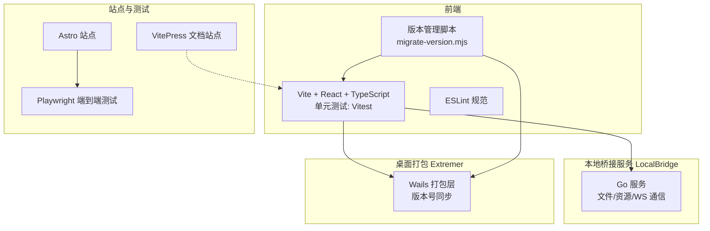
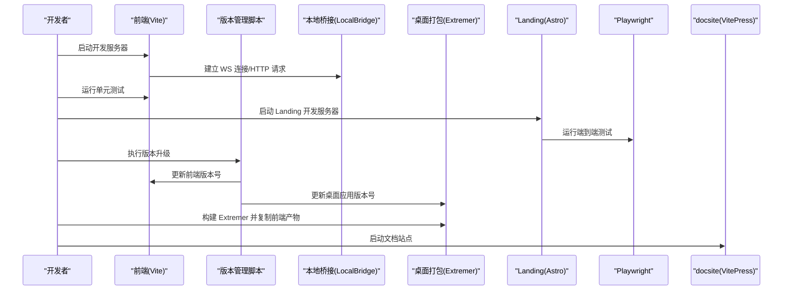
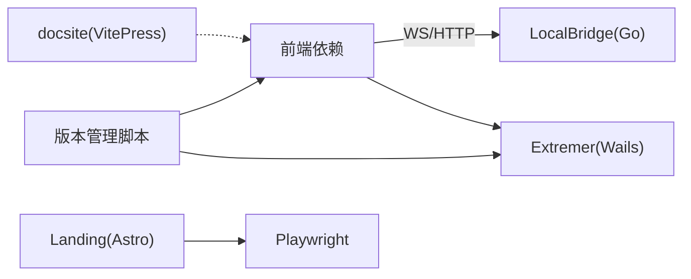

# 开发与测试

<cite>
**本文引用的文件**   
- [README.md](file://README.md)
- [package.json](file://package.json)
- [eslint.config.js](file://eslint.config.js)
- [vite.config.ts](file://vite.config.ts)
- [tsconfig.json](file://tsconfig.json)
- [tsconfig.app.json](file://tsconfig.app.json)
- [tsconfig.node.json](file://tsconfig.node.json)
- [Landing/playwright.config.ts](file://Landing/playwright.config.ts)
- [LocalBridge/go.mod](file://LocalBridge/go.mod)
- [Extremer/go.mod](file://Extremer/go.mod)
- [scripts/migrate-version.mjs](file://scripts/migrate-version.mjs)
- [scripts/migrate-version.ps1](file://scripts/migrate-version.ps1)
- [src/stores/configStore.ts](file://src/stores/configStore.ts)
- [Extremer/main.go](file://Extremer/main.go)
- [Extremer/wails.json](file://Extremer/wails.json)
- [Extremer/build/darwin/Info.plist](file://Extremer/build/darwin/Info.plist)
- [Extremer/build/windows/wails.exe.manifest](file://Extremer/build/windows/wails.exe.manifest)
</cite>

## 目录
1. [简介](#简介)
2. [项目结构](#项目结构)
3. [核心组件](#核心组件)
4. [架构总览](#架构总览)
5. [详细组件分析](#详细组件分析)
6. [版本管理与迁移系统](#版本管理与迁移系统)
7. [依赖分析](#依赖分析)
8. [性能考虑](#性能考虑)
9. [故障排查指南](#故障排查指南)
10. [结论](#结论)
11. [附录](#附录)

## 简介
本指南面向参与 MaaPipelineEditor（MPE）开发与测试的工程师与测试人员，覆盖开发环境搭建、工具链与调试命令、代码规范与风格、单元与集成测试策略、CI/CD 与自动化部署、性能与基准测试方法，以及代码审查与质量保障最佳实践。文档以仓库现有配置与脚本为基础，结合前端 Vite/React/TypeScript、后端 Go（LocalBridge/Extremer）、以及端到端测试 Playwright 的实际实现进行说明。

**更新** 新增版本管理与迁移系统的完整文档，包括自动化的版本号同步机制。

## 项目结构
MPE 采用前后端分离架构：
- 前端工程位于根目录，基于 Vite + React 19 + TypeScript，使用 Vitest 进行单元测试，ESLint 规范代码风格。
- 本地桥接服务 LocalBridge 为 Go 语言实现，提供文件扫描、资源管理、WebSocket 通信等能力。
- Extremer 为桌面应用打包层，基于 Wails，负责将前端产物嵌入桌面应用。
- Landing 为独立的静态站点工程，使用 Astro + Playwright 进行端到端测试。
- docsite 为文档站点工程，使用 VitePress。
- **新增** scripts 目录包含版本管理脚本，确保所有版本号的一致性和准确性。



**图表来源**
- [package.json:1-75](file://package.json#L1-L75)
- [vite.config.ts:1-66](file://vite.config.ts#L1-L66)
- [eslint.config.js:1-41](file://eslint.config.js#L1-L41)
- [LocalBridge/go.mod:1-38](file://LocalBridge/go.mod#L1-L38)
- [Extremer/go.mod:1-39](file://Extremer/go.mod#L1-L39)
- [Landing/playwright.config.ts:1-31](file://Landing/playwright.config.ts#L1-L31)
- [scripts/migrate-version.mjs:1-307](file://scripts/migrate-version.mjs#L1-L307)

**章节来源**
- [README.md:31-92](file://README.md#L31-L92)
- [package.json:6-23](file://package.json#L6-L23)
- [vite.config.ts:14-65](file://vite.config.ts#L14-L65)
- [eslint.config.js:8-40](file://eslint.config.js#L8-L40)
- [tsconfig.json:1-8](file://tsconfig.json#L1-L8)
- [tsconfig.app.json:1-27](file://tsconfig.app.json#L1-L27)
- [tsconfig.node.json:1-26](file://tsconfig.node.json#L1-L26)
- [LocalBridge/go.mod:1-38](file://LocalBridge/go.mod#L1-L38)
- [Extremer/go.mod:1-39](file://Extremer/go.mod#L1-L39)
- [Landing/playwright.config.ts:1-31](file://Landing/playwright.config.ts#L1-L31)

## 核心组件
- 开发服务器与构建
  - 前端开发服务器：Vite，默认监听 127.0.0.1:3000，支持多模式（stable/preview/extremer 等）。
  - 构建产物：Vite 输出到 dist，支持按依赖拆分代码块（如 monaco-editor、tesseract.js 等）。
- 测试与覆盖率
  - 单元测试：Vitest + happy-dom，开启全局测试环境与覆盖率报告（text/json/html/lcov）。
  - 端到端测试：Playwright（Landing 工程），预览服务器作为被测目标。
- 代码规范
  - ESLint + TypeScript ESLint，推荐规则集，忽略特定目录（dist、第三方站点缓存、图标字体等）。
  - TS 严格模式与未使用检查，确保类型安全与代码整洁。
- 本地桥接服务
  - Go 服务，提供文件/资源/事件总线/日志等能力，使用 WebSocket 与前端通信。
- 桌面打包层
  - Wails 应用，将前端产物复制到 Extremer 前端目录并打包为桌面应用。
- **新增** 版本管理系统
  - 自动化版本号同步：通过 migrate-version.mjs 脚本确保所有版本号位置保持一致。
  - 支持交互式和批量版本升级，具备预览和确认机制。
- 文档与站点
  - docsite 使用 VitePress，Landing 使用 Astro，二者均通过独立脚本启动与构建。

**章节来源**
- [package.json:6-23](file://package.json#L6-L23)
- [vite.config.ts:14-65](file://vite.config.ts#L14-L65)
- [eslint.config.js:8-40](file://eslint.config.js#L8-L40)
- [tsconfig.app.json:19-23](file://tsconfig.app.json#L19-L23)
- [tsconfig.node.json:16-22](file://tsconfig.node.json#L16-L22)
- [LocalBridge/go.mod:1-38](file://LocalBridge/go.mod#L1-L38)
- [Extremer/go.mod:1-39](file://Extremer/go.mod#L1-L39)
- [Landing/playwright.config.ts:1-31](file://Landing/playwright.config.ts#L1-L31)

## 架构总览
MPE 的典型开发与测试流水线如下：



**图表来源**
- [package.json:8-14](file://package.json#L8-L14)
- [vite.config.ts:16-19](file://vite.config.ts#L16-L19)
- [Landing/playwright.config.ts:24-29](file://Landing/playwright.config.ts#L24-L29)
- [Extremer/go.mod:1-39](file://Extremer/go.mod#L1-L39)
- [scripts/migrate-version.mjs:163-301](file://scripts/migrate-version.mjs#L163-L301)

## 详细组件分析

### 开发环境搭建与配置
- 前端
  - 安装依赖后，使用 Vite 启动开发服务器；可通过不同模式（stable/preview/extremer）调整 base 路径与行为。
  - ESLint 配置启用推荐规则，并对特定目录忽略处理；TS 严格模式开启未使用变量/参数等检查。
- 本地桥接服务
  - 使用 Go 模块管理依赖，包含 WebSocket、文件系统监控、日志、配置解析等。
- 桌面打包层
  - Wails 应用，Go 版本与依赖明确，用于将前端产物打包为桌面应用。
- 站点与测试
  - Landing 使用 Astro，Playwright 配置为预览服务器提供被测目标，支持 GitHub CI 报告与 HTML 报告。
- **新增** 版本管理脚本
  - Node.js 脚本，支持交互式版本升级和批量替换。
  - PowerShell 包装器，解决 Windows 控制台中文编码问题。
  - 自动检测和预览所有版本号变更，确保一致性。

**章节来源**
- [vite.config.ts:5-13](file://vite.config.ts#L5-L13)
- [eslint.config.js:17-39](file://eslint.config.js#L17-L39)
- [tsconfig.app.json:18-23](file://tsconfig.app.json#L18-L23)
- [LocalBridge/go.mod:1-38](file://LocalBridge/go.mod#L1-L38)
- [Extremer/go.mod:1-39](file://Extremer/go.mod#L1-L39)
- [Landing/playwright.config.ts:1-31](file://Landing/playwright.config.ts#L1-L31)
- [scripts/migrate-version.mjs:1-307](file://scripts/migrate-version.mjs#L1-L307)
- [scripts/migrate-version.ps1:1-34](file://scripts/migrate-version.ps1#L1-L34)

### 开发工具与调试命令
- 前端常用命令
  - 启动开发服务器、构建、预览、清理、发布标签等。
  - 启动 Landing 独立站点、文档站点的开发与构建。
- 本地桥接服务
  - 通过脚本启动 LocalBridge 服务，便于本地联调。
- **新增** 版本管理命令
  - `yarn migrate`：交互式版本升级，提示输入目标版本。
  - `yarn migrate 1.8.0`：指定目标版本（仍需确认）。
  - `yarn migrate 1.8.0 --yes`：指定目标版本并跳过确认。
  - PowerShell 用户使用 `./scripts/migrate-version.ps1`。
- 调试要点
  - 前端：Vite 主机与端口固定，便于浏览器调试；Monaco 编辑器与 OCR 依赖单独分包，利于按需加载。
  - 本地桥接：关注日志输出、WebSocket 连接状态、文件扫描与资源解析。
  - 版本管理：脚本提供详细的变更预览，支持确认机制，避免意外修改。

**章节来源**
- [package.json:6-23](file://package.json#L6-L23)
- [vite.config.ts:16-19](file://vite.config.ts#L16-L19)
- [scripts/migrate-version.mjs:5-9](file://scripts/migrate-version.mjs#L5-L9)
- [scripts/migrate-version.ps1:7-11](file://scripts/migrate-version.ps1#L7-L11)

### 代码规范与风格指南
- ESLint 配置
  - 推荐规则集启用，忽略 dist、第三方站点缓存、图标字体等目录。
  - 对未使用表达式、未使用变量等给出警告级别提示。
- TypeScript 严格模式
  - 严格启用未使用局部变量/参数、switch 贯穿、副作用导入等检查。
- 建议补充
  - 明确团队风格偏好（例如禁用 any、统一命名约定、注释规范等），并在 CI 中强制执行。

**章节来源**
- [eslint.config.js:8-40](file://eslint.config.js#L8-L40)
- [tsconfig.app.json:18-23](file://tsconfig.app.json#L18-L23)
- [tsconfig.node.json:16-22](file://tsconfig.node.json#L16-L22)

### 单元测试与集成测试策略
- 单元测试（Vitest）
  - 使用 happy-dom 作为 DOM 环境，开启全局测试配置与覆盖率报告。
  - 覆盖率排除 node_modules、tests、dist、配置文件与类型声明等。
- 端到端测试（Playwright）
  - Landing 工程使用 Playwright，预览服务器作为被测目标，支持 Chromium 设备集合。
  - CI 下启用 GitHub 报告与 HTML 报告，失败时保留 trace 信息。
- 集成测试建议
  - 以 LocalBridge 为后端，前端通过 WS/HTTP 与其交互，编写端到端场景覆盖关键流程（文件扫描、资源解析、调试会话等）。

**章节来源**
- [vite.config.ts:47-63](file://vite.config.ts#L47-L63)
- [Landing/playwright.config.ts:1-31](file://Landing/playwright.config.ts#L1-L31)

### CI/CD 流程与自动化部署
- 当前仓库未包含 .github/workflows 目录，无法直接确认具体流水线配置。
- 建议的通用策略
  - 触发条件：push 到主分支、PR、tag。
  - 步骤建议：安装依赖、代码检查（ESLint）、单元测试（含覆盖率）、端到端测试、构建前端与文档站点、构建桌面应用（Extremer）、制品上传与发布。
  - 产物：Web 前端产物、文档站点、桌面应用安装包。
- 与现有脚本的衔接
  - 使用 package.json 中的脚本作为流水线步骤入口，确保命令在 CI 环境可用。
- **新增** 版本管理集成
  - 在发布流程中集成版本升级脚本，确保所有版本号同步更新。
  - 支持自动化版本号生成和验证。

**章节来源**
- [package.json:6-23](file://package.json#L6-L23)

### 性能测试与基准测试
- 前端性能
  - 依赖分包策略（monaco-editor、tesseract.js 等）有助于首屏与交互性能；建议结合浏览器性能分析工具进行页面渲染与网络请求分析。
- 本地桥接性能
  - 文件扫描与资源解析可能涉及大量 I/O，建议在 CI 中加入基准测试（如扫描 N 个文件耗时），并记录指标。
- 建议的基准指标
  - 页面首屏时间、首次有效绘制、资源包大小、测试覆盖率阈值、端到端用例执行时长。

**章节来源**
- [vite.config.ts:21-41](file://vite.config.ts#L21-L41)

### 代码审查与质量保证最佳实践
- 代码审查
  - 关注功能正确性、边界条件、错误处理、可维护性与可测试性。
  - 强制执行 ESLint 与 TS 严格模式，避免 any 与未使用变量。
- 质量保障
  - 覆盖率阈值建议在 CI 中设置（如语句/分支/函数/行不低于 80%），失败则阻断合并。
  - 端到端测试在关键路径上必须通过，失败时保留 trace 以便回溯。
  - 本地桥接服务的日志与错误处理需完善，便于定位问题。
- **新增** 版本管理质量控制
  - 版本升级前强制预览所有变更，确保准确性。
  - 支持批量版本号同步，避免版本不一致问题。
  - 提供详细的变更日志和回滚机制。

**章节来源**
- [eslint.config.js:29-38](file://eslint.config.js#L29-L38)
- [tsconfig.app.json:19-23](file://tsconfig.app.json#L19-L23)
- [Landing/playwright.config.ts:13-17](file://Landing/playwright.config.ts#L13-L17)

## 版本管理与迁移系统

### 系统概述
MaaPipelineEditor 引入了完整的版本管理与迁移系统，通过自动化脚本确保所有版本号位置保持一致，避免手动修改导致的版本不一致问题。

### 核心组件
- **migrate-version.mjs**：主要版本迁移脚本，支持交互式和精确替换。
- **migrate-version.ps1**：PowerShell 包装器，解决 Windows 控制台中文编码问题。
- **TARGETS 配置**：定义所有需要同步的版本号位置。

### 支持的版本号位置
脚本自动检测和更新以下位置的版本号：

1. **前端版本**：`src/stores/configStore.ts`
   - 全局配置中的版本号
   - 用于显示应用当前版本

2. **桌面应用版本**：`Extremer/main.go`
   - Go 代码中的版本变量

3. **Wails 配置版本**：`Extremer/wails.json`
   - productVersion 字段

4. **Windows 清单版本**：`Extremer/build/windows/wails.exe.manifest`
   - assemblyIdentity version 属性

5. **macOS Info.plist 版本**：`Extremer/build/darwin/Info.plist`
   - CFBundleVersion 和 CFBundleShortVersionString

6. **package.json 发布版本**：`package.json`
   - release 和 retag 字段

### 功能特性
- **上下文锚定**：每个目标都通过精确的上下文正则表达式定位，避免全局替换的风险
- **交互式操作**：支持交互模式和批量模式，提供详细的变更预览
- **预览机制**：执行前强制预览所有变更，确认后才落盘
- **错误处理**：检测阶段任一失败则整体中止，确保数据完整性
- **跨平台支持**：提供 Node.js 和 PowerShell 两种执行方式

### 使用方法
```bash
# 交互模式：提示输入目标版本
yarn migrate

# 指定目标版本（仍需确认）
yarn migrate 1.8.0

# 指定目标版本并跳过确认
yarn migrate 1.8.0 --yes

# 直接运行 Node.js 脚本
node scripts/migrate-version.mjs
```

### PowerShell 用户
```powershell
# Windows 用户使用 PowerShell 包装器
./scripts/migrate-version.ps1
./scripts/migrate-version.ps1 1.8.0
./scripts/migrate-version.ps1 1.8.0 -y
```

### 预览输出示例
脚本提供详细的变更预览，包括：
- 当前版本和目标版本
- 每个变更的具体位置（文件名、行号、目标描述）
- 变更前后的对比
- 总变更数量和涉及文件数

### 安全特性
- **仅项目内部版本**：绝不触碰第三方依赖版本
- **精确替换**：通过上下文锚定避免误替换
- **确认机制**：所有变更都需要人工确认
- **原子操作**：按文件分组写入，每文件只写一次

**章节来源**
- [scripts/migrate-version.mjs:1-307](file://scripts/migrate-version.mjs#L1-L307)
- [scripts/migrate-version.ps1:1-34](file://scripts/migrate-version.ps1#L1-L34)
- [package.json:20](file://package.json#L20)
- [src/stores/configStore.ts:9](file://src/stores/configStore.ts#L9)
- [Extremer/main.go:24](file://Extremer/main.go#L24)
- [Extremer/wails.json:13](file://Extremer/wails.json#L13)
- [Extremer/build/darwin/Info.plist:14](file://Extremer/build/darwin/Info.plist#L14)
- [Extremer/build/darwin/Info.plist:18](file://Extremer/build/darwin/Info.plist#L18)
- [Extremer/build/windows/wails.exe.manifest:6](file://Extremer/build/windows/wails.exe.manifest#L6)

## 依赖分析
- 前端依赖
  - React 19、Ant Design 6、React Flow、Monaco Editor、Tesseract.js、Zustand 等。
- 本地桥接服务依赖
  - maa-framework-go、websocket、fsnotify、logrus、cobra、viper 等。
- 桌面打包层依赖
  - Wails v2、go-version 等。
- 测试与站点
  - Vitest、happy-dom、Playwright、Astro、VitePress。
- **新增** 版本管理依赖
  - Node.js 18+（用于脚本执行）
  - readline/promises（Node.js 内置模块）



**图表来源**
- [package.json:24-49](file://package.json#L24-L49)
- [LocalBridge/go.mod:5-16](file://LocalBridge/go.mod#L5-L16)
- [Extremer/go.mod:5-8](file://Extremer/go.mod#L5-L8)
- [Landing/playwright.config.ts:1-31](file://Landing/playwright.config.ts#L1-L31)
- [scripts/migrate-version.mjs:18-22](file://scripts/migrate-version.mjs#L18-L22)

**章节来源**
- [package.json:24-73](file://package.json#L24-L73)
- [LocalBridge/go.mod:1-38](file://LocalBridge/go.mod#L1-L38)
- [Extremer/go.mod:1-39](file://Extremer/go.mod#L1-L39)

## 性能考虑
- 代码分割与懒加载
  - 通过 Rollup manualChunks 将大型依赖拆分为独立 chunk，降低首屏体积。
- 测试性能
  - Vitest 使用 happy-dom，减少真实 DOM 初始化成本；覆盖率报告仅针对业务代码。
- 端到端测试
  - 预览服务器复用，避免重复启动成本；失败重试与 trace 保留提升定位效率。
- **新增** 版本管理性能
  - 文件缓存机制：同一文件只读取一次，提高执行效率。
  - 按文件分组写入：每文件只写一次，避免重复 IO 操作。
  - 上下文锚定：精确匹配减少不必要的字符串处理。

**章节来源**
- [vite.config.ts:21-41](file://vite.config.ts#L21-L41)
- [vite.config.ts:47-63](file://vite.config.ts#L47-L63)
- [Landing/playwright.config.ts:24-29](file://Landing/playwright.config.ts#L24-L29)
- [scripts/migrate-version.mjs:97-104](file://scripts/migrate-version.mjs#L97-L104)
- [scripts/migrate-version.mjs:280-286](file://scripts/migrate-version.mjs#L280-L286)

## 故障排查指南
- 前端常见问题
  - 端口占用：修改 Vite server.port 或更换端口。
  - 资源路径异常：根据模式调整 base，确保静态资源访问正确。
- 本地桥接服务
  - WebSocket 连接失败：检查服务是否启动、防火墙与跨域策略。
  - 文件扫描异常：确认权限与路径配置，查看日志输出。
- 端到端测试
  - 预览服务器未就绪：增大 webServer.timeout 或检查命令行输出。
  - 截图/OCR 失败：确认依赖安装与环境变量。
- **新增** 版本管理问题
  - Node.js 版本过低：确保使用 Node.js 18+。
  - Windows 中文乱码：使用 PowerShell 包装器或设置正确的控制台编码。
  - 权限不足：确保对目标文件具有读写权限。
  - 文件格式错误：检查目标文件是否符合预期格式。
  - 变更冲突：如果多个版本同时修改，先手动同步再执行脚本。

**章节来源**
- [vite.config.ts:16-19](file://vite.config.ts#L16-L19)
- [Landing/playwright.config.ts:24-29](file://Landing/playwright.config.ts#L24-L29)
- [scripts/migrate-version.ps1:16-18](file://scripts/migrate-version.ps1#L16-L18)
- [scripts/migrate-version.mjs:27-30](file://scripts/migrate-version.mjs#L27-L30)

## 结论
本指南基于仓库现有配置与脚本，给出了 MPE 的开发与测试实践路线：以 Vite/React/TypeScript 为核心，结合 Vitest 与 Playwright 构建完善的测试体系；通过 ESLint 与 TS 严格模式保障代码质量；借助 LocalBridge 与 Extremer 实现本地能力与桌面打包。**新增的版本管理与迁移系统**进一步提升了项目的自动化水平和质量保证能力，通过精确的版本号同步机制确保所有版本信息的一致性。建议在 CI 中补齐流水线配置，完善覆盖率阈值与端到端用例，持续提升交付质量与稳定性。

## 附录
- 快速命令清单
  - 启动前端开发：yarn dev
  - 构建前端：yarn build
  - 运行单元测试：yarn vitest
  - 运行覆盖率：yarn vitest --coverage
  - 启动 Landing：yarn landing
  - 启动 Landing 测试：yarn landing:test
  - 启动文档站点：yarn doc
  - 启动本地桥接服务：yarn server
  - 构建 Extremer：yarn build:extremer
  - **新增** 版本升级：yarn migrate
  - **新增** 指定版本升级：yarn migrate 1.8.0
  - **新增** 跳过确认升级：yarn migrate 1.8.0 --yes

**章节来源**
- [package.json:6-23](file://package.json#L6-L23)