# Extremer 桌面应用程序

<cite>
**本文档引用的文件**
- [Extremer/main.go](file://Extremer/main.go)
- [Extremer/app.go](file://Extremer/app.go)
- [Extremer/internal/splash/splash.go](file://Extremer/internal/splash/splash.go)
- [Extremer/internal/splash/splash_windows.go](file://Extremer/internal/splash/splash_windows.go)
- [Extremer/internal/splash/splash_other.go](file://Extremer/internal/splash/splash_other.go)
- [Extremer/config/default.json](file://Extremer/config/default.json)
- [Extremer/wails.json](file://Extremer/wails.json)
- [Extremer/go.mod](file://Extremer/go.mod)
- [Extremer/internal/bridge/subprocess.go](file://Extremer/internal/bridge/subprocess.go)
- [Extremer/internal/ports/allocator.go](file://Extremer/internal/ports/allocator.go)
- [Extremer/internal/updater/updater.go](file://Extremer/internal/updater/updater.go)
- [LocalBridge/internal/config/config.go](file://LocalBridge/internal/config/config.go)
- [LocalBridge/internal/paths/paths.go](file://LocalBridge/internal/paths/paths.go)
- [LocalBridge/config/default.json](file://LocalBridge/config/default.json)
- [src/utils/wailsBridge.ts](file://src/utils/wailsBridge.ts)
- [src/services/server.ts](file://src/services/server.ts)
- [src/App.tsx](file://src/App.tsx)
- [package.json](file://package.json)
- [vite.config.ts](file://vite.config.ts)
</cite>

## 更新摘要
**变更内容**
- 新增启动画面系统章节，详细介绍跨平台启动画面实现
- 在应用程序生命周期管理中添加启动画面集成流程
- 更新架构概览，体现启动画面的跨平台实现架构
- 添加启动画面配置和消息更新机制说明

## 目录
1. [简介](#简介)
2. [项目结构](#项目结构)
3. [核心组件](#核心组件)
4. [启动画面系统](#启动画面系统)
5. [配置系统](#配置系统)
6. [架构概览](#架构概览)
7. [详细组件分析](#详细组件分析)
8. [依赖关系分析](#依赖关系分析)
9. [性能考虑](#性能考虑)
10. [故障排除指南](#故障排除指南)
11. [结论](#结论)

## 简介

Extremer 是 MaaPipelineEditor (MPE) 项目中的桌面应用程序组件，基于 Wails 框架构建，为用户提供本地化的 MaaFramework Pipeline 可视化编辑体验。该应用程序通过 Go 后端与 React 前端的深度集成，提供了完整的本地服务扩展能力。

MPE 是一款专注于 MaaFramework Pipeline 工作流的可视化编辑工具，旨在让用户通过拖拽和配置的方式高效构建、调试和分享自动化流程。应用程序支持多种平台，包括 Windows、macOS 和 Linux，并提供了丰富的本地服务功能。

**更新** 新增跨平台启动画面功能，为 Windows 用户提供专业的启动体验，同时保持非 Windows 平台的简洁实现。

## 项目结构

Extremer 项目采用模块化架构设计，主要分为以下几个核心部分：

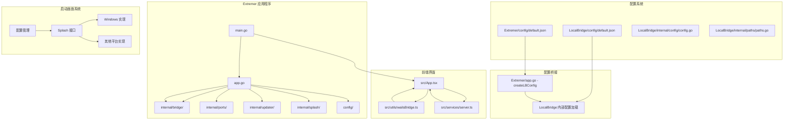

**图表来源**
- [Extremer/main.go](file://Extremer/main.go#L1-L88)
- [Extremer/app.go](file://Extremer/app.go#L1-L459)
- [Extremer/internal/splash/splash.go](file://Extremer/internal/splash/splash.go#L1-L35)
- [Extremer/config/default.json](file://Extremer/config/default.json#L1-L33)

### 核心目录结构

项目采用清晰的分层架构：

- **Extremer/**: 应用程序主目录，包含 Go 后端代码、启动画面实现和配置文件
- **src/**: React 前端源码，包含组件、服务和工具
- **LocalBridge/**: 本地服务实现，提供文件管理、截图等本地功能
- **docsite/**: 文档站点源码
- **instructions/**: 开发文档和指南

**章节来源**
- [Extremer/main.go](file://Extremer/main.go#L1-L88)
- [Extremer/wails.json](file://Extremer/wails.json#L1-L18)

## 核心组件

Extremer 应用程序的核心组件包括应用程序主结构、启动画面系统、子进程管理器、端口分配器和更新机制。

### 应用程序主结构

App 结构体是整个应用程序的核心控制器，负责管理应用程序生命周期和资源协调：

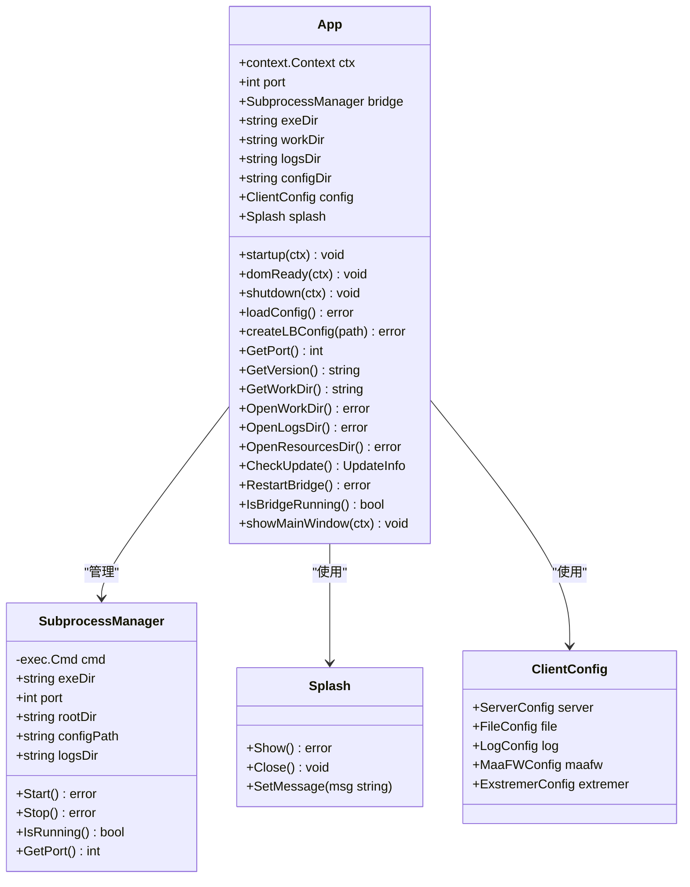

**图表来源**
- [Extremer/app.go](file://Extremer/app.go#L50-L62)
- [Extremer/internal/bridge/subprocess.go](file://Extremer/internal/bridge/subprocess.go#L12-L23)
- [Extremer/internal/splash/splash.go](file://Extremer/internal/splash/splash.go#L3-L11)

### 启动画面系统

启动画面系统提供跨平台的启动体验，支持 Windows 平台的专业启动画面和非 Windows 平台的空实现。

**章节来源**
- [Extremer/app.go](file://Extremer/app.go#L61)
- [Extremer/internal/splash/splash.go](file://Extremer/internal/splash/splash.go#L1-L35)

### 子进程管理器

LocalBridge 子进程管理器负责启动和管理本地服务进程，提供文件管理、截图工具和流程调试等本地功能。

**章节来源**
- [Extremer/app.go](file://Extremer/app.go#L268-L274)
- [Extremer/internal/bridge/subprocess.go](file://Extremer/internal/bridge/subprocess.go#L37-L100)

## 启动画面系统

Extremer 应用程序集成了专业的启动画面功能，为 Windows 用户提供流畅的启动体验，同时保持非 Windows 平台的简洁实现。

### 启动画面架构

启动画面系统采用接口抽象和平台特定实现的设计模式：

```mermaid
classDiagram
class Splash {
<<interface>>
+Show() error
+Close() void
+SetMessage(msg string)
}
class windowsSplash {
-Config cfg
-uintptr hwnd
-*uint16 className
-string message
-int progress
-RWMutex mu
-bool closed
-chan struct{} closeChan
+Show() error
+Close() void
+SetMessage(msg string)
-onPaint(hwnd uintptr) void
-onTimer(hwnd uintptr) void
-createFont(height int32, fontName string) uintptr
}
class noopSplash {
-Config cfg
+Show() error
+Close() void
+SetMessage(msg string)
}
class Config {
+string Title
+string Message
+int Width
+int Height
}
Splash <|.. windowsSplash : "实现"
Splash <|.. noopSplash : "实现"
windowsSplash --> Config : "使用"
noopSplash --> Config : "使用"
```

**图表来源**
- [Extremer/internal/splash/splash.go](file://Extremer/internal/splash/splash.go#L3-L34)
- [Extremer/internal/splash/splash_windows.go](file://Extremer/internal/splash/splash_windows.go#L133-L143)
- [Extremer/internal/splash/splash_other.go](file://Extremer/internal/splash/splash_other.go#L6-L14)

### Windows 平台启动画面实现

Windows 平台的启动画面使用原生 Win32 API 实现，提供专业的视觉效果：

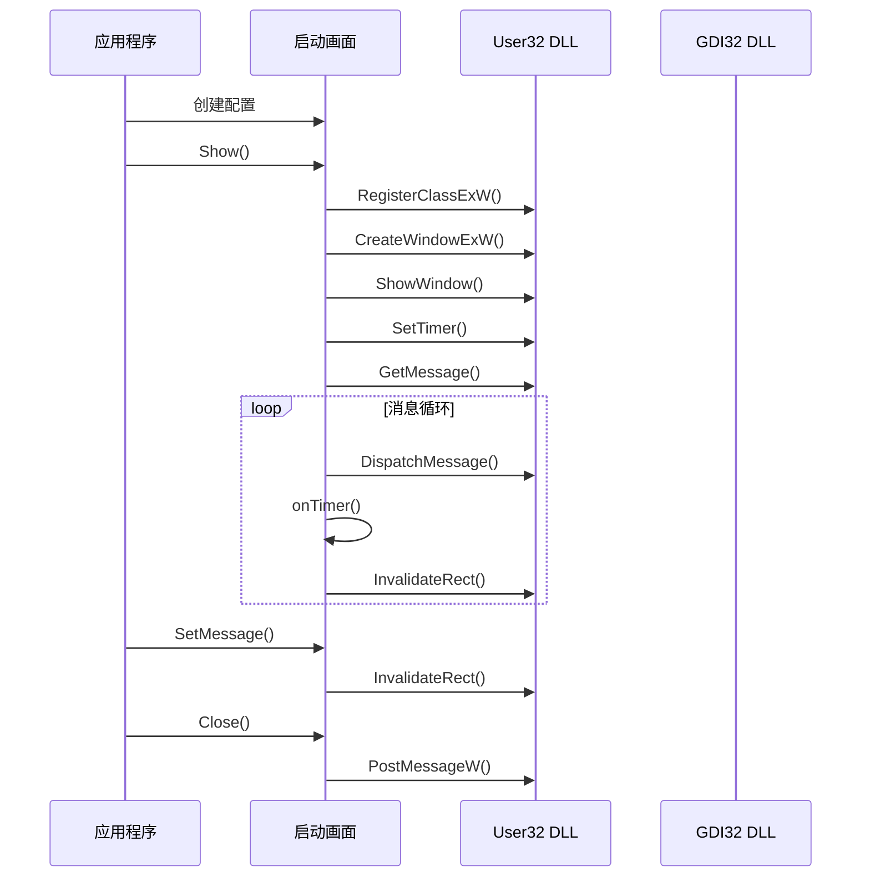

**图表来源**
- [Extremer/internal/splash/splash_windows.go](file://Extremer/internal/splash/splash_windows.go#L157-L230)
- [Extremer/internal/splash/splash_windows.go](file://Extremer/internal/splash/splash_windows.go#L259-L281)

### 启动画面配置管理

启动画面使用统一的配置结构，支持自定义标题、消息和尺寸：

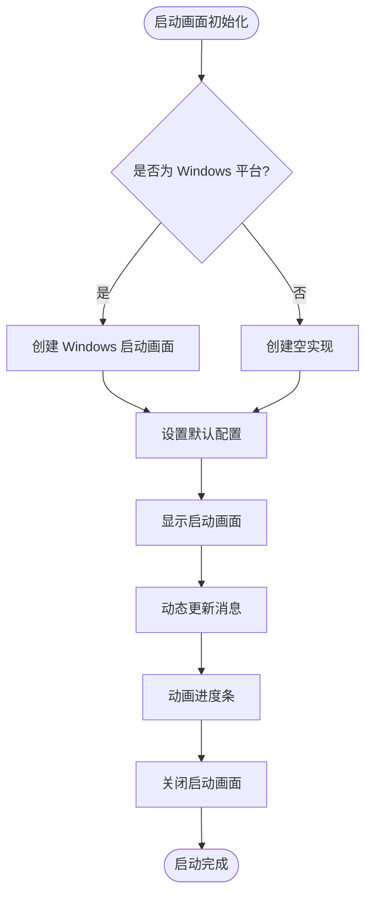

**图表来源**
- [Extremer/internal/splash/splash.go](file://Extremer/internal/splash/splash.go#L21-L29)
- [Extremer/internal/splash/splash.go](file://Extremer/internal/splash/splash.go#L31-L34)

### 启动画面集成流程

启动画面与应用程序生命周期的集成流程：

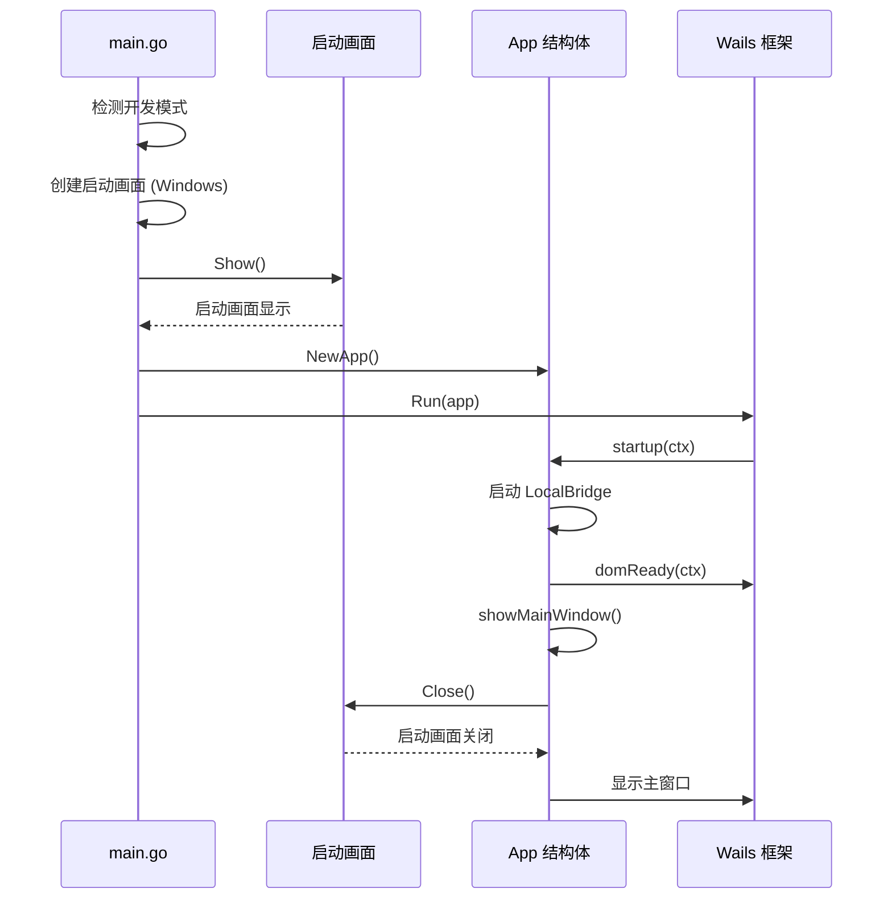

**图表来源**
- [Extremer/main.go](file://Extremer/main.go#L34-L54)
- [Extremer/app.go](file://Extremer/app.go#L180-L281)
- [Extremer/app.go](file://Extremer/app.go#L345-L356)

**章节来源**
- [Extremer/internal/splash/splash.go](file://Extremer/internal/splash/splash.go#L1-L35)
- [Extremer/internal/splash/splash_windows.go](file://Extremer/internal/splash/splash_windows.go#L1-L402)
- [Extremer/internal/splash/splash_other.go](file://Extremer/internal/splash/splash_other.go#L1-L30)
- [Extremer/main.go](file://Extremer/main.go#L34-L54)
- [Extremer/app.go](file://Extremer/app.go#L345-L356)

## 配置系统

Extremer 和 LocalBridge 都具有完善的配置系统，支持多种配置文件格式和自动路径解析功能。

### Extremer 配置系统

Extremer 应用程序支持两种配置文件格式：`config.json` 和 `default.json`，并具备自动路径解析功能。

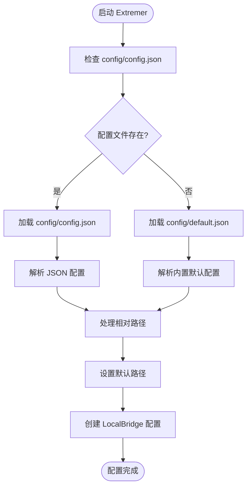

**图表来源**
- [Extremer/app.go](file://Extremer/app.go#L79-L122)
- [Extremer/config/default.json](file://Extremer/config/default.json#L1-L33)

### LocalBridge 配置系统

LocalBridge 使用 Viper 库实现配置管理，支持多种配置格式和环境变量覆盖。

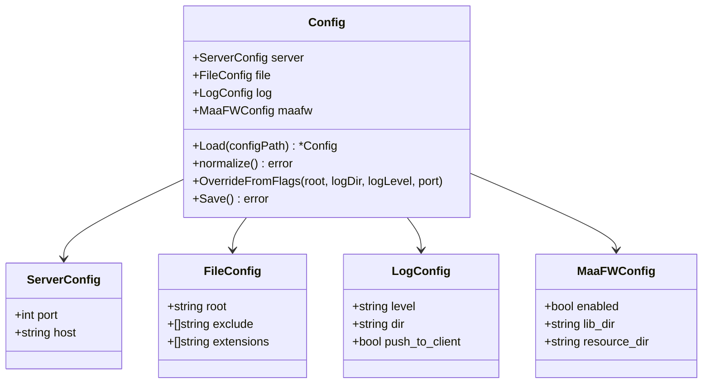

**图表来源**
- [LocalBridge/internal/config/config.go](file://LocalBridge/internal/config/config.go#L13-L46)

### 配置桥接机制

Extremer 通过配置桥接机制将自身配置传递给 LocalBridge，确保两个组件使用一致的配置。

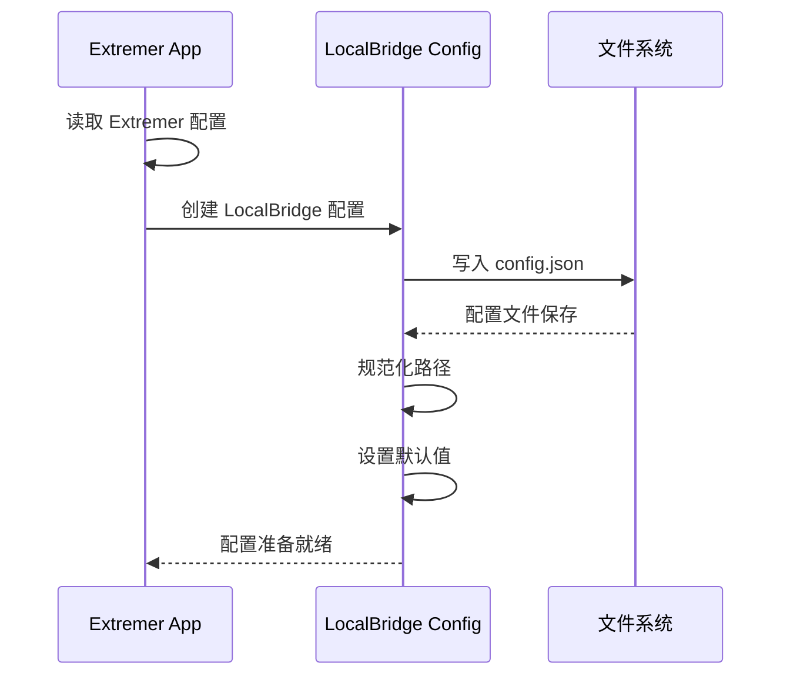

**图表来源**
- [Extremer/app.go](file://Extremer/app.go#L284-L312)
- [LocalBridge/internal/config/config.go](file://LocalBridge/internal/config/config.go#L51-L93)

### 自动路径解析

配置系统具备强大的路径解析功能，支持相对路径转换为绝对路径、默认路径设置和平台特定的路径处理。

**章节来源**
- [Extremer/app.go](file://Extremer/app.go#L79-L122)
- [LocalBridge/internal/config/config.go](file://LocalBridge/internal/config/config.go#L121-L178)
- [LocalBridge/internal/paths/paths.go](file://LocalBridge/internal/paths/paths.go#L151-L170)

## 架构概览

Extremer 采用了现代化的桌面应用程序架构，结合了 Go 后端的强大能力和 React 前端的用户体验优势，并集成了专业的启动画面系统。

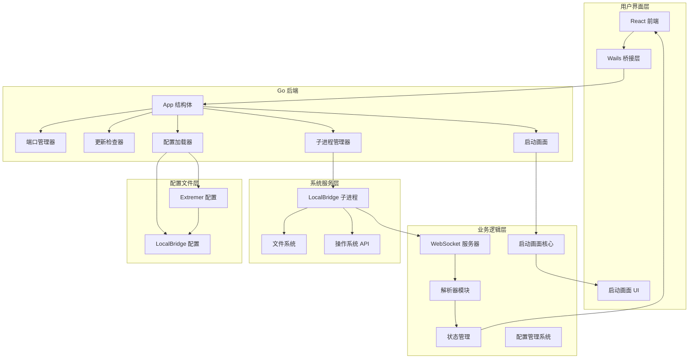

**图表来源**
- [Extremer/app.go](file://Extremer/app.go#L50-L62)
- [Extremer/internal/splash/splash.go](file://Extremer/internal/splash/splash.go#L3-L11)
- [src/services/server.ts](file://src/services/server.ts#L20-L334)

### 数据流架构

应用程序的数据流遵循清晰的层次结构：

1. **启动画面显示**: Windows 平台显示专业启动画面
2. **前端交互**: 用户通过 React 组件进行操作
3. **Wails 桥接**: 前端通过 Wails 桥接调用 Go 后端方法
4. **业务逻辑**: Go 后端处理业务逻辑并管理子进程
5. **配置管理**: Extremer 配置系统加载和桥接配置
6. **系统服务**: LocalBridge 提供本地功能支持
7. **状态同步**: 通过 WebSocket 实现前后端状态同步
8. **启动画面关闭**: LocalBridge 就绪后关闭启动画面

**章节来源**
- [src/utils/wailsBridge.ts](file://src/utils/wailsBridge.ts#L1-L129)
- [src/services/server.ts](file://src/services/server.ts#L1-L374)

## 详细组件分析

### 应用程序生命周期管理

应用程序的生命周期管理是通过 Wails 框架提供的回调机制实现的，现已集成了启动画面系统：

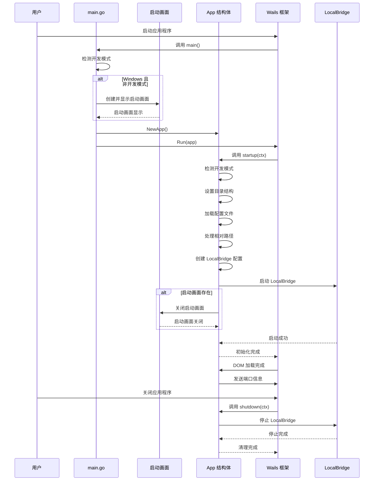

**图表来源**
- [Extremer/main.go](file://Extremer/main.go#L26-L88)
- [Extremer/app.go](file://Extremer/app.go#L180-L356)

### 端口管理系统

端口分配器确保应用程序能够获得稳定的网络端口用于本地服务通信：

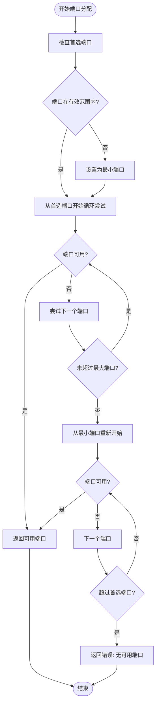

**图表来源**
- [Extremer/internal/ports/allocator.go](file://Extremer/internal/ports/allocator.go#L15-L41)

**章节来源**
- [Extremer/internal/ports/allocator.go](file://Extremer/internal/ports/allocator.go#L1-L62)

### 更新检查机制

应用程序内置了自动更新检查功能，支持跨平台的版本管理：

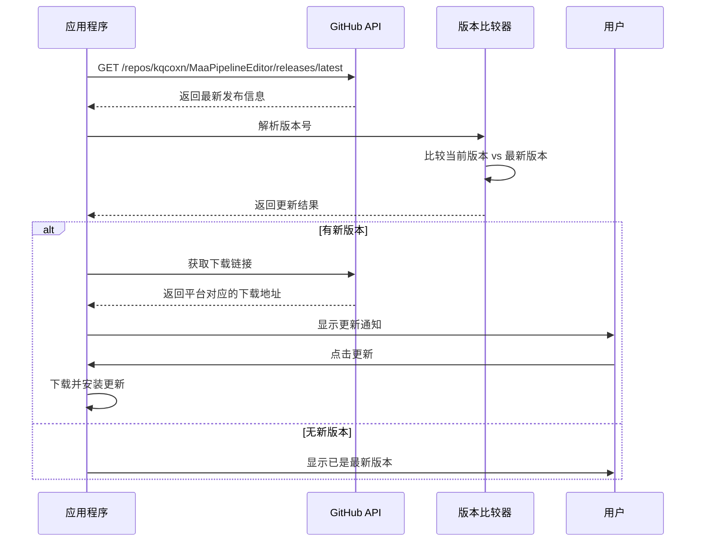

**图表来源**
- [Extremer/internal/updater/updater.go](file://Extremer/internal/updater/updater.go#L43-L99)

**章节来源**
- [Extremer/internal/updater/updater.go](file://Extremer/internal/updater/updater.go#L1-L151)

### 前后端通信架构

应用程序通过 Wails 框架实现了高效的前后端通信：

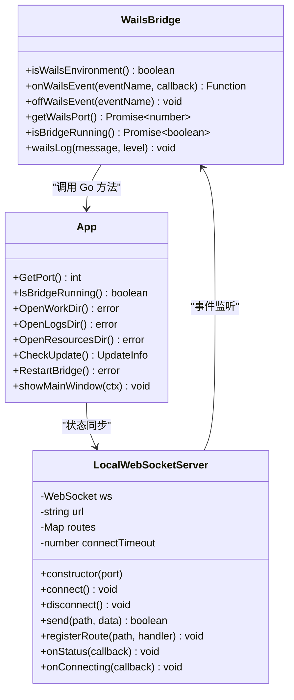

**图表来源**
- [src/utils/wailsBridge.ts](file://src/utils/wailsBridge.ts#L1-L129)
- [src/services/server.ts](file://src/services/server.ts#L20-L334)

**章节来源**
- [src/utils/wailsBridge.ts](file://src/utils/wailsBridge.ts#L1-L129)
- [src/services/server.ts](file://src/services/server.ts#L1-L374)

## 依赖关系分析

Extremer 应用程序的依赖关系体现了清晰的分层架构和模块化设计原则。

```mermaid
graph TB
subgraph "外部依赖"
Wails[Wails v2.11.0]
GoVersion[go-version v1.7.0]
WebSocket[gorilla/websocket v1.5.3]
Viper[Viper v1.18.2]
Endecoding[encoding/json]
End
subgraph "内部模块"
Bridge[internal/bridge]
Ports[internal/ports]
Updater[internal/updater]
Splash[internal/splash]
Utils[utils/wailsBridge]
Services[services/server]
Config[internal/config]
Paths[internal/paths]
end
subgraph "应用程序"
Main[main.go]
App[app.go]
ConfigFile[config/default.json]
ExtremerConfig[Extremer 配置]
LocalBridgeConfig[LocalBridge 配置]
SplashConfig[启动画面配置]
end
Main --> App
App --> Bridge
App --> Ports
App --> Updater
App --> Splash
App --> Utils
Utils --> Services
Services --> WebSocket
App --> Config
App --> Paths
Config --> Viper
Config --> Endecoding
Main --> Wails
App --> GoVersion
Services --> WebSocket
ExtremerConfig --> LocalBridgeConfig
SplashConfig --> Splash
```

**图表来源**
- [Extremer/go.mod](file://Extremer/go.mod#L5-L8)
- [Extremer/main.go](file://Extremer/main.go#L3-L16)
- [LocalBridge/internal/config/config.go](file://LocalBridge/internal/config/config.go#L3-L11)

### 核心依赖分析

应用程序的主要依赖包括：

- **Wails 框架**: 提供跨平台桌面应用程序开发能力
- **Go 版本比较库**: 支持语义化版本号比较
- **WebSocket 库**: 实现前后端实时通信
- **Viper 配置库**: 支持多种配置格式和环境变量
- **启动画面库**: 提供跨平台启动画面支持
- **内部模块**: 提供特定功能的封装

**章节来源**
- [Extremer/go.mod](file://Extremer/go.mod#L1-L39)

## 性能考虑

Extremer 应用程序在设计时充分考虑了性能优化和用户体验：

### 内存管理
- 使用 sync.Mutex 确保子进程管理器的线程安全
- 合理的资源清理和连接池管理
- 避免内存泄漏的及时资源释放

### 网络性能
- WebSocket 连接超时机制防止阻塞
- 异步事件处理避免 UI 阻塞
- 连接状态监控和自动重连机制

### 资源优化
- 端口范围限制减少冲突
- 条件加载和懒初始化
- 缓存策略优化频繁操作

### 启动画面性能优化
- Windows 平台使用原生 API 实现高性能绘制
- 启动画面独立线程避免阻塞主应用
- 动画帧率优化和资源最小化
- 非 Windows 平台使用空实现避免额外开销

### 配置性能优化
- 配置文件缓存机制
- 异步配置加载
- 路径解析结果缓存

## 故障排除指南

### 常见问题及解决方案

**本地服务无法启动**
1. 检查 LocalBridge 可执行文件是否存在
2. 验证端口占用情况
3. 确认工作目录权限
4. 查看日志文件获取详细错误信息

**WebSocket 连接失败**
1. 验证端口号正确性
2. 检查防火墙设置
3. 确认 LocalBridge 正在运行
4. 查看浏览器开发者工具网络面板

**更新检查失败**
1. 检查网络连接
2. 验证 GitHub API 可访问性
3. 查看代理设置
4. 清除缓存后重试

**配置加载失败**
1. 检查配置文件格式是否正确
2. 验证配置文件权限
3. 确认路径解析是否正确
4. 查看配置文件是否存在

**启动画面显示问题**
1. 检查 Windows 平台兼容性
2. 验证启动画面配置参数
3. 查看系统资源是否充足
4. 确认开发模式检测逻辑

**章节来源**
- [Extremer/internal/bridge/subprocess.go](file://Extremer/internal/bridge/subprocess.go#L55-L58)
- [src/services/server.ts](file://src/services/server.ts#L127-L160)

## 结论

Extremer 桌面应用程序展现了现代桌面应用开发的最佳实践，通过 Go 后端的强大功能、React 前端的优秀用户体验以及专业的启动画面系统相结合，为用户提供了完整的 MaaFramework Pipeline 编辑解决方案。

应用程序的主要优势包括：

- **模块化架构**: 清晰的分层设计便于维护和扩展
- **跨平台支持**: 基于 Wails 框架实现真正的跨平台部署
- **本地服务集成**: 通过 LocalBridge 提供丰富的本地功能
- **智能更新机制**: 自动化的版本管理和更新检查
- **配置系统**: 完善的配置管理，支持多种配置格式和自动路径解析
- **配置桥接**: 有效的配置传递机制，确保组件间配置一致性
- **启动画面系统**: 专业的跨平台启动体验，提升用户体验
- **性能优化**: 合理的资源管理和异步处理机制

**更新** 新增的启动画面系统为 Windows 用户提供了专业的启动体验，通过原生 Win32 API 实现流畅的动画效果和专业的视觉设计，同时保持非 Windows 平台的简洁实现，体现了良好的跨平台设计理念。

该应用程序为 MaaFramework 生态系统提供了重要的桌面端工具，满足了资源开发者对高效、易用的可视化编辑工具的需求。通过持续的功能完善和性能优化，Extremer 有望成为 MPE 生态系统中的重要组成部分。