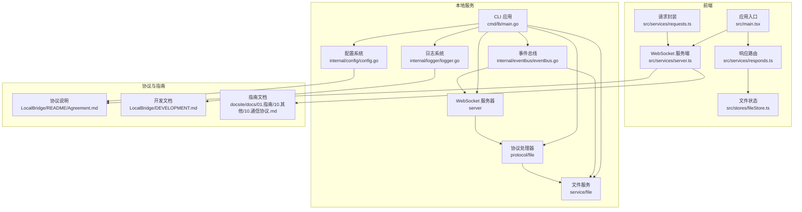
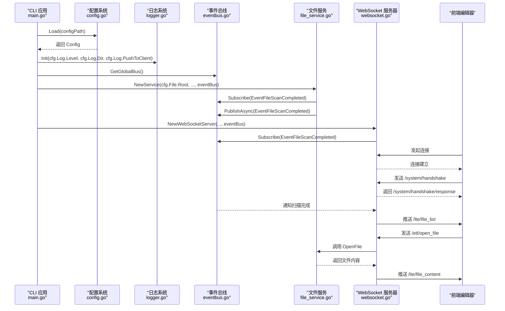
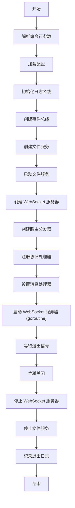
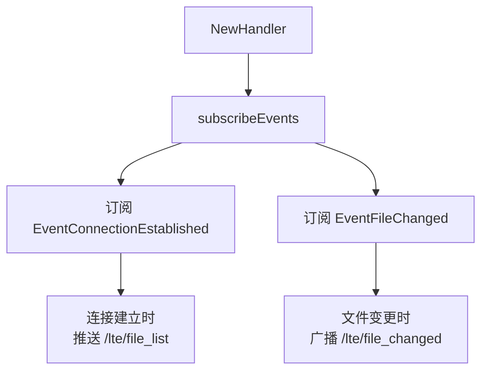
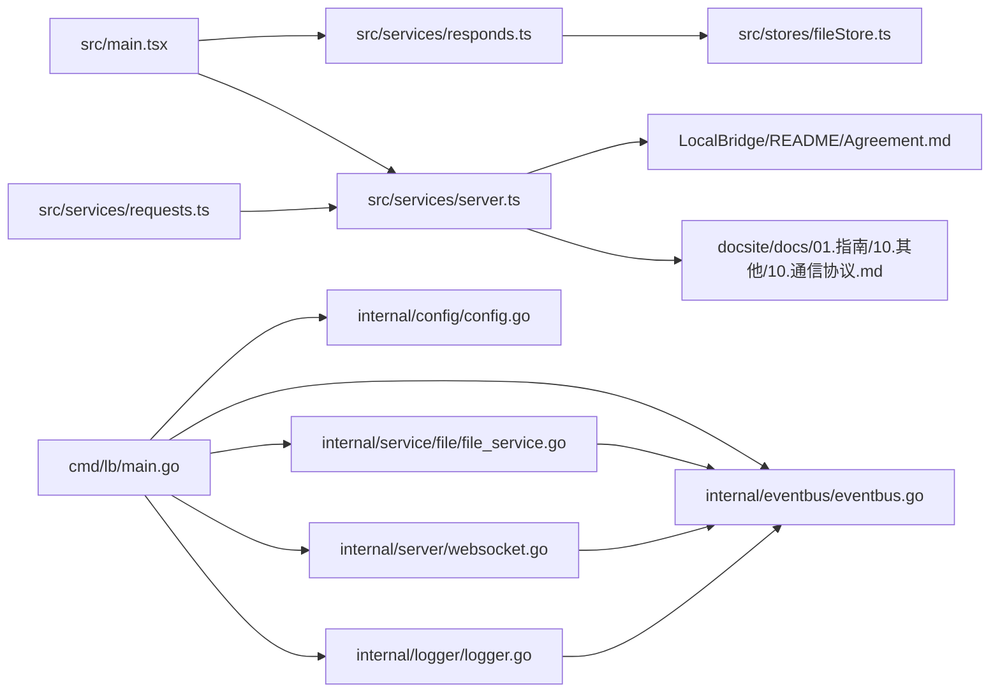

# LocalBridge 通信协议

<cite>
**本文引用的文件**
- [LocalBridge/Agreement.md](file://LocalBridge/Agreement.md)
- [LocalBridge/internal/protocol/file/file_handler.go](file://LocalBridge/internal/protocol/file/file_handler.go)
- [LocalBridge/internal/service/file/file_service.go](file://LocalBridge/internal/service/file/file_service.go)
- [LocalBridge/pkg/models/message.go](file://LocalBridge/pkg/models/message.go)
- [src/services/protocols/FileProtocol.ts](file://src/services/protocols/FileProtocol.ts)
- [docsite/docs/01.指南/10.其他/10.通信协议.md](file://docsite/docs/01.指南/10.其他/10.通信协议.md)
- [LocalBridge/internal/server/websocket.go](file://LocalBridge/internal/server/websocket.go)
- [LocalBridge/internal/protocol/mfw/handler.go](file://LocalBridge/internal/protocol/mfw/handler.go)
- [LocalBridge/pkg/models/mfw.go](file://LocalBridge/pkg/models/mfw.go)
- [LocalBridge/internal/mfw/device_manager.go](file://LocalBridge/internal/mfw/device_manager.go)
- [LocalBridge/internal/mfw/controller_manager.go](file://LocalBridge/internal/mfw/controller_manager.go)
- [LocalBridge/internal/mfw/task_manager.go](file://LocalBridge/internal/mfw/task_manager.go)
- [LocalBridge/internal/mfw/resource_manager.go](file://LocalBridge/internal/mfw/resource_manager.go)
- [LocalBridge/internal/mfw/types.go](file://LocalBridge/internal/mfw/types.go)
</cite>

## 更新摘要
**变更内容**
- 新增了对 WebSocket 握手协议的详细说明，包括 `/system/handshake` 和 `/system/handshake/response` 路由。
- 在“通用协议”章节中增加了“版本兼容性检查”小节，描述握手流程和协议版本验证机制。
- 更新了“架构总览”序列图，体现握手阶段的消息交互。
- 扩展了“消息与数据模型”章节，增加握手请求与响应的数据结构定义。
- 在“前端实现要点”中补充了前端发起握手请求的逻辑说明。
- **新增 MaaFramework (MFW) 协议的详细说明**，涵盖设备管理、控制器操作和任务执行等核心API，包括设备发现、控制器创建与连接、截图传输、基础操作、任务提交与状态查询等功能。

## 目录
1. [简介](#简介)
2. [项目结构](#项目结构)
3. [核心组件](#核心组件)
4. [架构总览](#架构总览)
5. [详细组件分析](#详细组件分析)
6. [依赖关系分析](#依赖关系分析)
7. [性能考量](#性能考量)
8. [故障排查指南](#故障排查指南)
9. [结论](#结论)
10. [附录](#附录)

## 简介
本文档系统性梳理 LocalBridge（简称 LB）通信协议，覆盖连接管理、消息规范、文件协议、日志协议、事件总线、配置系统、CLI 应用以及前端 WebSocket 服务端实现。文档结合仓库内的协议说明、开发文档与前端实现，帮助开发者理解并正确集成本地服务与前端编辑器之间的双向通信。本次更新重点新增了文件创建协议和文件列表刷新协议的详细说明，并完善了文件状态管理功能的描述。**本次更新新增了 WebSocket 握手协议，用于在连接建立初期进行前后端协议版本兼容性检查，确保通信协议的一致性。** **同时，本次更新全面引入了 MaaFramework (MFW) 协议的详细说明，为调试器和参数传输提供了完整的底层能力封装。**

**Section sources**
- [LocalBridge/Agreement.md](file://LocalBridge/Agreement.md#L1-L300)
- [docsite/docs/01.指南/10.其他/10.通信协议.md](file://docsite/docs/01.指南/10.其他/10.通信协议.md#L1-L166)

## 项目结构
围绕 LocalBridge 通信协议的相关文件分布如下：
- 协议说明：LocalBridge/README/Agreement.md（本地文件协议、日志协议、WebSocket API 路由）
- 开发文档：LocalBridge/DEVELOPMENT.md（分层架构、模块化组件、构建运行）
- 配置文件：LocalBridge/config/default.json（默认配置）
- 配置系统：LocalBridge/internal/config/config.go（配置加载与解析）
- CLI 入口：LocalBridge/cmd/lb/main.go（应用生命周期管理）
- 日志系统：LocalBridge/internal/logger/logger.go（日志初始化与推送）
- 事件总线：LocalBridge/internal/eventbus/eventbus.go（模块间通信）
- 指南文档：docsite/docs/01.指南/10.其他/10.通信协议.md（MPE 侧通信协议与示例）
- 前端 WebSocket 服务端：src/services/server.ts（连接、消息路由、发送、状态管理）
- 前端请求封装：src/services/requests.ts（主动发送 Pipeline）
- 前端响应路由：src/services/responds.ts（接收服务端 Pipeline 并导入编辑器）
- 类型定义：src/services/type.ts（消息处理器与路由接口）
- 服务导出入口：src/services/index.ts
- 应用初始化：src/main.tsx（注册响应路由与初始化）
- 文件状态管理：src/stores/fileStore.ts（文件标签页与路径配置）



**Diagram sources**
- [LocalBridge/cmd/lb/main.go](file://LocalBridge/cmd/lb/main.go#L1-L128)
- [LocalBridge/internal/config/config.go](file://LocalBridge/internal/config/config.go#L1-L157)
- [LocalBridge/internal/logger/logger.go](file://LocalBridge/internal/logger/logger.go#L1-L127)
- [LocalBridge/internal/eventbus/eventbus.go](file://LocalBridge/internal/eventbus/eventbus.go#L1-L81)
- [LocalBridge/README/Agreement.md](file://LocalBridge/README/Agreement.md#L1-L191)
- [LocalBridge/DEVELOPMENT.md](file://LocalBridge/DEVELOPMENT.md#L1-L178)
- [src/main.tsx](file://src/main.tsx#L1-L23)
- [src/services/server.ts](file://src/services/server.ts#L1-L214)
- [src/services/requests.ts](file://src/services/requests.ts#L1-L46)
- [src/services/responds.ts](file://src/services/responds.ts#L1-L69)
- [src/stores/fileStore.ts](file://src/stores/fileStore.ts#L1-L255)

## 核心组件
- **CLI 应用 (main.go)**
  - 作为应用入口，负责解析命令行参数、加载配置、初始化日志、事件总线、文件服务、WebSocket 服务器等核心组件。
  - 实现优雅退出，监听中断信号。
- **配置系统 (config.go)**
  - 支持从配置文件（default.json）和命令行参数加载配置。
  - 提供默认值、路径规范化、配置覆盖等功能。
  - 配置项包括服务器端口、文件根目录、排除列表、日志级别与目录、日志推送开关等。
- **日志系统 (logger.go)**
  - 基于 logrus 实现，支持分级输出（DEBUG, INFO, WARN, ERROR）。
  - 可同时输出到控制台和文件（按日期命名）。
  - 支持通过 `push_to_client` 配置项将日志推送到前端客户端。
- **事件总线 (eventbus.go)**
  - 基于发布-订阅模式，实现模块间解耦。
  - 提供全局事件总线实例，支持同步和异步发布事件。
  - 定义了文件扫描完成、文件变更、连接建立/关闭等事件类型。
- **文件服务 (file_service.go, scanner.go, watcher.go)**
  - **文件扫描**: 递归扫描根目录，支持 .json 和 .jsonc 文件，可配置排除目录，构建文件索引。
  - **文件监听**: 基于 fsnotify 实现，监听文件的创建、修改、删除事件，包含防抖处理。
  - 通过事件总线通知其他模块文件变更。
- **协议处理器 (file_handler.go)**
  - 实现文件相关协议（/etl/open_file, /etl/save_file, /etl/create_file, /etl/refresh_file_list 等）的处理逻辑。
  - 作为路由分发器的处理器，接收消息并调用文件服务。
- **WebSocket 服务器 (websocket.go)**
  - 基于 gorilla/websocket 实现，管理连接、消息收发。
  - 与路由分发器集成，将收到的消息分发给对应的协议处理器。
  - 支持广播和单播消息发送。
  - **新增版本握手功能**: 在连接建立后，通过 `/system/handshake` 和 `/system/handshake/response` 路由进行协议版本协商，确保前后端通信协议兼容。

**Section sources**
- [LocalBridge/cmd/lb/main.go](file://LocalBridge/cmd/lb/main.go#L1-L128)
- [LocalBridge/config/default.json](file://LocalBridge/config/default.json#L1-L29)
- [LocalBridge/internal/config/config.go](file://LocalBridge/internal/config/config.go#L1-L157)
- [LocalBridge/internal/logger/logger.go](file://LocalBridge/internal/logger/logger.go#L1-L127)
- [LocalBridge/internal/eventbus/eventbus.go](file://LocalBridge/internal/eventbus/eventbus.go#L1-L81)
- [LocalBridge/DEVELOPMENT.md](file://LocalBridge/DEVELOPMENT.md#L1-L178)

## 架构总览
LocalBridge 通信架构以 WebSocket 为基础，采用分层设计，各模块通过事件总线解耦。CLI 应用作为入口，协调配置、日志、事件总线、文件服务和 WebSocket 服务器的初始化。文件服务负责文件的扫描、监听和操作，并通过事件总线通知 WebSocket 服务器推送文件列表或变更通知。前端通过 WebSocket 与本地服务进行双向通信。**在连接建立后，会立即进行版本握手，验证协议兼容性。**



**Diagram sources**
- [LocalBridge/cmd/lb/main.go](file://LocalBridge/cmd/lb/main.go#L52-L127)
- [LocalBridge/internal/config/config.go](file://LocalBridge/internal/config/config.go#L49-L87)
- [LocalBridge/internal/logger/logger.go](file://LocalBridge/internal/logger/logger.go#L22-L65)
- [LocalBridge/internal/eventbus/eventbus.go](file://LocalBridge/internal/eventbus/eventbus.go#L70-L81)
- [LocalBridge/internal/service/file/file_service.go](file://LocalBridge/internal/service/file/file_service.go#L77-L89)
- [LocalBridge/internal/server/websocket.go](file://LocalBridge/internal/server/websocket.go#L95-L105)

## 详细组件分析

### CLI 应用 (main.go)
- **初始化流程**
  1. 解析命令行参数（--config, --root, --port, --log-dir, --log-level）。
  2. 加载配置（优先级：命令行 > 配置文件 > 默认值）。
  3. 初始化日志系统。
  4. 创建全局事件总线。
  5. 创建文件服务并启动（执行扫描和监听）。
  6. 创建 WebSocket 服务器和路由分发器。
  7. 注册文件协议处理器。
  8. 启动 WebSocket 服务器（goroutine）。
  9. 监听退出信号，执行优雅关闭。
- **依赖注入**
  - 通过构造函数将配置、事件总线、WebSocket 服务器等依赖注入到各模块。



**Diagram sources**
- [LocalBridge/cmd/lb/main.go](file://LocalBridge/cmd/lb/main.go#L52-L127)

**Section sources**
- [LocalBridge/cmd/lb/main.go](file://LocalBridge/cmd/lb/main.go#L1-L128)
- [LocalBridge/DEVELOPMENT.md](file://LocalBridge/DEVELOPMENT.md#L66-L170)

### 配置系统 (config.go)
- **配置加载**
  - 使用 viper 库，支持 JSON 配置文件。
  - 查找路径：`./config/default.json` 或 `./default.json`。
  - 未找到配置文件时使用默认值。
- **配置结构**
  ```go
  type Config struct {
    Server ServerConfig `mapstructure:"server"`
    File   FileConfig   `mapstructure:"file"`
    Log    LogConfig    `mapstructure:"log"`
    MaaFW  MaaFWConfig  `mapstructure:"maafw"`
  }
  ```
- **路径规范化**
  - 将相对路径转换为绝对路径。
  - 验证根目录是否存在。
- **命令行覆盖**
  - `OverrideFromFlags` 方法允许命令行参数覆盖配置文件中的值。

**Section sources**
- [LocalBridge/config/default.json](file://LocalBridge/config/default.json#L1-L29)
- [LocalBridge/internal/config/config.go](file://LocalBridge/internal/config/config.go#L1-L157)

### 日志系统 (logger.go)
- **初始化**
  - 设置日志级别（从配置读取）。
  - 创建日志目录和按日期命名的日志文件。
  - 使用 `io.MultiWriter` 同时输出到控制台和文件。
- **日志推送**
  - 当 `cfg.Log.PushToClient` 为 true 时，添加 `PushHook`。
  - `PushHook` 在记录 INFO、WARN、ERROR 级别日志时，通过 `LogPushFunc` 回调将日志推送到 WebSocket 客户端。
- **便捷方法**
  - 提供 `Info`, `Warn`, `Error`, `Debug` 等全局函数，支持模块名和格式化输出。

**Section sources**
- [LocalBridge/internal/logger/logger.go](file://LocalBridge/internal/logger/logger.go#L1-L127)
- [LocalBridge/internal/config/config.go](file://LocalBridge/internal/config/config.go#L24-L29)

### 事件总线 (eventbus.go)
- **核心功能**
  - `Subscribe`: 订阅特定类型的事件。
  - `Publish`: 同步发布事件，调用所有订阅者的处理函数。
  - `PublishAsync`: 异步发布事件（启动 goroutine）。
- **全局实例**
  - `globalBus` 为单例，通过 `GetGlobalBus()` 获取。
- **事件类型**
  - `EventFileScanCompleted`: 文件扫描完成。
  - `EventFileChanged`: 文件内容变更。
  - `EventConnectionEstablished`: 连接建立。
  - `EventConnectionClosed`: 连接关闭。

**Section sources**
- [LocalBridge/internal/eventbus/eventbus.go](file://LocalBridge/internal/eventbus/eventbus.go#L1-L81)
- [LocalBridge/DEVELOPMENT.md](file://LocalBridge/DEVELOPMENT.md#L19-L20)

### 文件服务 (file_service.go, scanner.go, watcher.go)
- **文件扫描 (scanner.go)**
  - 递归遍历根目录，过滤指定扩展名（.json, .jsonc）和排除目录。
  - 构建 `[]File` 列表，包含文件路径、名称、相对路径。
  - 扫描完成后通过事件总线发布 `EventFileScanCompleted` 事件。
- **文件监听 (watcher.go)**
  - 使用 `fsnotify.Watcher` 监听根目录及其子目录。
  - 对 `Create`, `Write`, `Remove` 事件进行防抖（300ms 窗口期）。
  - 事件触发后发布 `EventFileChanged` 事件。
- **文件操作**
  - 提供 `OpenFile`, `SaveFile`, `CreateFile` 等方法，封装 JSON 读写和路径安全验证。
  - **新增 `CreateFile` 方法**: 接收目录路径、文件名和可选的初始内容，在指定目录下创建新文件。会验证路径安全性、文件名合法性，并检查文件名冲突。创建成功后，将新文件信息添加到内存索引中。

**Section sources**
- [LocalBridge/internal/service/file/file_service.go](file://LocalBridge/internal/service/file/file_service.go#L1-L245)
- [LocalBridge/internal/service/file/scanner.go](file://LocalBridge/internal/service/file/scanner.go#L1-L100)
- [LocalBridge/internal/service/file/watcher.go](file://LocalBridge/internal/service/file/watcher.go#L1-L100)
- [LocalBridge/DEVELOPMENT.md](file://LocalBridge/DEVELOPMENT.md#L24-L43)

### 协议处理器 (file_handler.go)
- **核心功能**
  - 实现 `/etl/open_file`, `/etl/save_file`, `/etl/create_file`, `/etl/refresh_file_list` 等文件操作协议。
  - 作为路由分发器的处理器，接收消息并调用文件服务。
- **事件订阅逻辑**
  - **连接建立事件**: 订阅 `EventConnectionEstablished` 事件，当有新客户端连接时，立即推送当前的文件列表（`/lte/file_list`）。
  - **文件变更事件**: 订阅 `EventFileChanged` 事件，当文件被创建、修改或删除时，向所有客户端广播文件变化通知（`/lte/file_changed`）。
  - 这种分离的订阅逻辑确保了文件列表的推送与文件变更通知的推送是独立且互不干扰的。
- **新增协议处理**
  - **`/etl/create_file`**: 处理前端发来的创建文件请求。调用 `fileService.CreateFile` 方法创建文件，成功后调用 `pushFileList()` 重新向所有客户端推送更新后的文件列表。
  - **`/etl/refresh_file_list`**: 处理前端发来的刷新文件列表请求。直接调用 `pushFileList()` 重新向所有客户端推送当前文件列表。



**Section sources**
- [LocalBridge/internal/protocol/file/file_handler.go](file://LocalBridge/internal/protocol/file/file_handler.go#L1-L222)
- [LocalBridge/internal/eventbus/eventbus.go](file://LocalBridge/internal/eventbus/eventbus.go#L77-L78)

### 消息与数据模型 (pkg/models)
- **WebSocket 消息结构**
  - 所有消息均采用统一的 `Message` 结构，包含 `path` (路由) 和 `data` (数据) 两个字段。
  - **Message**: `{ path: string, data: any }`
- **核心数据模型**
  - **ErrorData**: 错误消息，包含 `code` (错误码), `message` (描述), `detail` (可选详情)。
  - **FileInfo**: 文件基本信息，包含 `file_path` (绝对路径), `file_name` (文件名), `relative_path` (相对路径)。
  - **FileListData**: 文件列表数据，包含 `root` (根目录) 和 `files` (FileInfo 数组)。
  - **FileContentData**: 文件内容数据，包含 `file_path` 和 `content` (JSON 对象)。
  - **FileChangedData**: 文件变化通知，包含 `type` ("created", "modified", "deleted") 和 `file_path`。
  - **OpenFileRequest**: 打开文件请求，包含 `file_path`。
  - **SaveFileRequest**: 保存文件请求，包含 `file_path` 和 `content`。
  - **CreateFileRequest**: 新增的创建文件请求，包含 `file_name` (文件名), `directory` (目录绝对路径), `content` (可选的初始内容)。
  - **SaveFileAckData**: 保存文件确认，包含 `file_path` 和 `status` ("ok")。
  - **LogData**: 日志数据，包含 `level`, `module`, `message`, `timestamp`。
  - **HandshakeRequest**: 握手请求，包含 `client_version` (客户端协议版本)。
  - **HandshakeResponseData**: 握手响应，包含 `server_version` (服务端协议版本), `compatible` (布尔值，表示版本是否兼容), `message` (可选的描述信息)。
- **文件内部模型**
  - **File**: 本地文件模型，包含 `AbsPath`, `RelPath`, `Name`, `LastModified`。
  - **ToFileInfo()**: `File` 结构体的方法，用于将其转换为对外的 `FileInfo` 结构。

**Section sources**
- [LocalBridge/pkg/models/message.go](file://LocalBridge/pkg/models/message.go#L1-L72)
- [LocalBridge/pkg/models/file.go](file://LocalBridge/pkg/models/file.go#L1-L19)

### MaaFramework (MFW) 协议
MaaFramework (MFW) 协议是 LocalBridge 的核心扩展，为 MaaMpeGoDebugger 提供了与 MaaFramework 底层能力交互的 WebSocket 接口。该协议基于 `maa-framework-go` API 实现，支持设备连接、控制器管理、截图传输、任务执行等核心功能。

#### MFW 协议处理器 (mfw/handler.go)
MFW 协议处理器 (`MFWHandler`) 是处理所有 MFW 相关消息的核心组件。它通过 `Handle` 方法根据消息的 `path` 字段分发到不同的处理函数。

- **路由前缀**: `/etl/mfw/`
- **核心处理逻辑**:
  - **设备管理**: 处理 `/etl/mfw/refresh_adb_devices` 和 `/etl/mfw/refresh_win32_windows` 请求，调用 `DeviceManager` 获取设备列表并推送 `/lte/mfw/adb_devices` 或 `/lte/mfw/win32_windows`。
  - **控制器管理**: 处理 `/etl/mfw/create_adb_controller`、`/etl/mfw/create_win32_controller` 和 `/etl/mfw/disconnect_controller` 请求，调用 `ControllerManager` 创建或断开控制器，并推送 `controller_created` 或 `controller_status` 事件。
  - **控制器操作**: 处理 `/etl/mfw/controller_click`、`/etl/mfw/controller_swipe` 等操作请求，调用 `ControllerManager` 执行相应操作，并通过 `controller_operation_result` 返回结果。
  - **任务管理**: 处理 `/etl/mfw/submit_task`、`/etl/mfw/query_task_status` 和 `/etl/mfw/stop_task` 请求，调用 `TaskManager` 提交、查询和停止任务。
  - **资源管理**: 处理 `/etl/mfw/load_resource` 请求，调用 `ResourceManager` 加载资源包。

**Section sources**
- [LocalBridge/internal/protocol/mfw/handler.go](file://LocalBridge/internal/protocol/mfw/handler.go#L1-L536)

#### 设备管理
设备管理功能允许前端发现并获取可用的 ADB 设备和 Win32 窗体。

- **设备发现**:
  - **ADB 设备**: 通过 `/etl/mfw/refresh_adb_devices` 请求刷新 ADB 设备列表。服务端调用 `DeviceManager.RefreshAdbDevices()` 获取设备信息，并通过 `/lte/mfw/adb_devices` 推送包含 `adb_path`, `address`, `screencap_methods`, `input_methods` 等信息的设备列表。
  - **Win32 窗体**: 通过 `/etl/mfw/refresh_win32_windows` 请求刷新 Win32 窗体列表。服务端调用 `DeviceManager.RefreshWin32Windows()` 获取窗体信息，并通过 `/lte/mfw/win32_windows` 推送包含 `hwnd`, `class_name`, `window_name` 等信息的窗体列表。

**Section sources**
- [LocalBridge/internal/mfw/device_manager.go](file://LocalBridge/internal/mfw/device_manager.go#L1-L74)
- [LocalBridge/Agreement.md](file://LocalBridge/Agreement.md#L282-L343)

#### 控制器操作
控制器操作是 MFW 协议的核心，允许前端对连接的设备执行各种交互。

- **控制器创建**:
  - **ADB 控制器**: 通过 `/etl/mfw/create_adb_controller` 请求创建 ADB 控制器，需提供 `adb_path`, `address`, `screencap_method`, `input_method` 等参数。创建成功后返回 `controller_id`。
  - **Win32 控制器**: 通过 `/etl/mfw/create_win32_controller` 请求创建 Win32 控制器，需提供 `hwnd`, `screencap_method`, `input_method` 等参数。
- **基础操作**:
  - **点击**: `/etl/mfw/controller_click`，指定 `controller_id` 和坐标 `(x, y)`。
  - **滑动**: `/etl/mfw/controller_swipe`，指定起点 `(x1, y1)`、终点 `(x2, y2)` 和持续时间 `duration`。
  - **输入文本**: `/etl/mfw/controller_input_text`，指定 `controller_id` 和 `text`。
  - **应用控制**: `/etl/mfw/controller_start_app` 和 `/etl/mfw/controller_stop_app`，用于启动和停止应用。
- **操作结果**: 所有操作的结果通过 `/lte/mfw/controller_operation_result` 事件返回，包含 `controller_id`, `operation`, `success`, `status` 等信息。

**Section sources**
- [LocalBridge/internal/mfw/controller_manager.go](file://LocalBridge/internal/mfw/controller_manager.go#L1-L344)
- [LocalBridge/Agreement.md](file://LocalBridge/Agreement.md#L345-L547)

#### 任务执行
任务执行功能允许前端提交 MaaFramework 任务并监控其状态。

- **任务提交**: 通过 `/etl/mfw/submit_task` 请求提交任务，需提供 `controller_id`, `resource_path`, `entry` (入口节点) 和可选的 `override` 参数。提交成功后返回 `task_id`。
- **状态查询**: 通过 `/etl/mfw/query_task_status` 请求查询任务状态，返回 `task_id`, `status` (如 "Running", "Success") 和 `detail` 信息。
- **任务停止**: 通过 `/etl/mfw/stop_task` 请求停止正在执行的任务。

**Section sources**
- [LocalBridge/internal/mfw/task_manager.go](file://LocalBridge/internal/mfw/task_manager.go#L1-L86)
- [LocalBridge/Agreement.md](file://LocalBridge/Agreement.md#L549-L621)

#### 资源管理
资源管理功能用于加载和管理 MaaFramework 的资源包。

- **加载资源**: 通过 `/etl/mfw/load_resource` 请求加载指定路径的资源包。加载成功后通过 `/lte/mfw/resource_loaded` 返回 `resource_id` 和 `hash`。

**Section sources**
- [LocalBridge/internal/mfw/resource_manager.go](file://LocalBridge/internal/mfw/resource_manager.go#L1-L79)
- [LocalBridge/Agreement.md](file://LocalBridge/Agreement.md#L664-L689)

### 协议与实现对照
- **协议来源**
  - `LocalBridge/README/Agreement.md`：定义了 `/lte/*`（LB→MPE）、`/etl/*`（MPE→LB）、`/ack/*` 确认消息与 `/error` 错误消息等路由。
  - `docsite/docs/01.指南/10.其他/10.通信协议.md`：定义了 `/etc/send_pipeline`（MPE→LB）与 `/cte/send_pipeline`（LB→MPE）等路由。
- **实际实现**
  - 前端请求封装使用的是 `/etc/send_pipeline`，响应路由处理的是 `/cte/send_pipeline`。
  - 两者与协议中的 `/etl/*`、`/lte/*` 命名不一致，但语义一致（编辑器→本地服务 vs 本地服务→编辑器）。
  - 新增的日志推送功能通过事件总线和 `PushHook` 实现，当 `push_to_client` 为启用时，日志会以特定格式推送到前端。
  - **新增协议实现**: `/etl/create_file` 和 `/etl/refresh_file_list` 已在 `file_handler.go` 中实现，并在 `Agreement.md` 中明确定义。
  - **新增握手协议**: 在 `websocket.go` 中定义了 `ProtocolVersion` 常量和 `/system/handshake` 路由，用于在连接建立后进行版本兼容性检查。
  - **新增 MFW 协议实现**: `mfw/handler.go` 实现了完整的 MFW 协议，包括设备管理、控制器操作、任务执行和资源管理等 API。

**Section sources**
- [LocalBridge/README/Agreement.md](file://LocalBridge/README/Agreement.md#L36-L191)
- [docsite/docs/01.指南/10.其他/10.通信协议.md](file://docsite/docs/01.指南/10.其他/10.通信协议.md#L106-L113)
- [src/services/requests.ts](file://src/services/requests.ts#L1-L46)
- [src/services/responds.ts](file://src/services/responds.ts#L1-L69)
- [LocalBridge/internal/logger/logger.go](file://LocalBridge/internal/logger/logger.go#L59-L98)
- [LocalBridge/internal/server/websocket.go](file://LocalBridge/internal/server/websocket.go#L15-L22)
- [LocalBridge/internal/protocol/mfw/handler.go](file://LocalBridge/internal/protocol/mfw/handler.go#L1-L536)

## 依赖关系分析
- **入口初始化**
  - `src/main.tsx` 中注册响应路由并初始化 WebSocket 服务。
  - `cmd/lb/main.go` 是本地服务的入口，协调所有模块的启动。
- **组件耦合**
  - `LocalWebSocketServer` 与 `MessageHandler` 接口解耦，便于扩展路由。
  - 响应路由依赖文件状态管理，实现文件切换与导入。
  - 文件服务通过事件总线与 WebSocket 服务器通信，实现松耦合。
- **协议依赖**
  - 协议文件与指南文档共同定义了消息格式与路由，前端实现需与之对齐。
  - 配置系统为日志推送、文件扫描等行为提供可配置性。



**Diagram sources**
- [src/main.tsx](file://src/main.tsx#L1-L23)
- [src/services/server.ts](file://src/services/server.ts#L1-L214)
- [src/services/requests.ts](file://src/services/requests.ts#L1-L46)
- [src/services/responds.ts](file://src/services/responds.ts#L1-L69)
- [src/stores/fileStore.ts](file://src/stores/fileStore.ts#L1-L255)
- [LocalBridge/README/Agreement.md](file://LocalBridge/README/Agreement.md#L1-L191)
- [docsite/docs/01.指南/10.其他/10.通信协议.md](file://docsite/docs/01.指南/10.其他/10.通信协议.md#L1-L216)
- [LocalBridge/cmd/lb/main.go](file://LocalBridge/cmd/lb/main.go#L1-L128)

## 性能考量
- **连接与消息处理**
  - 连接超时 3 秒，避免长时间阻塞 UI；消息解析与路由分发为 O(1) 查找，适合高频消息。
- **文件导入**
  - 导入 Pipeline 时涉及 DOM 状态更新与历史记录初始化，建议在批量导入时减少不必要的重绘。
- **日志推送**
  - 协议支持日志推送，前端可根据配置选择是否接收，避免在调试之外场景产生额外流量。
- **文件监听**
  - 使用 `fsnotify` 提供高效的文件系统事件通知。
  - 防抖机制（300ms）防止短时间内大量事件导致性能问题。

[本节为通用指导，不直接分析具体文件]

## 故障排查指南
- **连接失败**
  - 检查本地服务是否运行于 `ws://localhost:9066`；确认端口占用与防火墙设置。
  - 前端会在连接超时、错误与关闭时分别发出提示，可据此定位问题。
- **发送失败**
  - 确认已连接且路径有效；查看前端错误提示与控制台日志。
- **导入失败**
  - 检查服务端是否正确返回确认消息；核对文件路径与文件名冲突情况。
- **文件状态异常**
  - 若文件名重复或路径不一致，前端会给出警告；可在文件面板中修正。
- **日志未推送**
  - 检查 `config/default.json` 中 `log.push_to_client` 是否为 `true`。
  - 确认日志级别是否匹配（INFO、WARN、ERROR）。

**Section sources**
- [src/services/server.ts](file://src/services/server.ts#L57-L134)
- [src/services/requests.ts](file://src/services/requests.ts#L1-L46)
- [src/services/responds.ts](file://src/services/responds.ts#L1-L69)
- [src/stores/fileStore.ts](file://src/stores/fileStore.ts#L118-L145)
- [LocalBridge/internal/logger/logger.go](file://LocalBridge/internal/logger/logger.go#L60-L62)

## 结论
LocalBridge 通信协议以 WebSocket 为基础，通过明确的消息格式与路由命名，实现了编辑器与本地服务之间的稳定双向通信。新实现的 CLI 应用、配置系统、日志系统、事件总线和文件服务模块，使得系统更加模块化、可配置和易于维护。前端实现了连接管理、消息路由与文件导入逻辑，协议与指南文档提供了清晰的 API 规范。实际开发中需关注路由命名一致性、错误处理和配置管理，确保用户体验与稳定性。

[本节为总结，不直接分析具体文件]

## 附录

### 协议要点摘要
- **连接管理**
  - 协议：WebSocket；默认端口：9066；连接超时：3 秒；不自动重连。
- **消息规范**
  - 统一 JSON 结构：{path, data}；路由命名约定：/lte/*（LB→MPE）、/etl/*（MPE→LB）、/ack/*（确认）、/error（错误）。
- **本地文件协议**
  - 根目录扫描规则、文件列表推送、文件内容返回、文件变化通知、错误码与错误消息格式。
  - **新增协议**:
    - `/etl/create_file`: 请求在指定目录创建新文件。
    - `/etl/refresh_file_list`: 请求刷新并重新推送文件列表。
- **日志协议**
  - CLI 日志格式与 `/lte/log` 推送消息格式（当 `push_to_client` 启用时）。
- **版本兼容性检查**
  - **握手流程**: 连接建立后，前端立即发送 `/system/handshake` 消息，服务端根据 `ProtocolVersion` 常量返回 `/system/handshake/response` 消息，包含兼容性判断结果。
  - **路由**:
    - `/system/handshake` (MPE→LB): 客户端发起握手，携带 `client_version`。
    - `/system/handshake/response` (LB→MPE): 服务端返回握手结果，包含 `server_version`, `compatible`, `message`。
- **MaaFramework (MFW) 协议**
  - **设备管理**: `/etl/mfw/refresh_adb_devices`, `/etl/mfw/refresh_win32_windows`。
  - **控制器操作**: `/etl/mfw/create_adb_controller`, `/etl/mfw/controller_click`, `/etl/mfw/controller_swipe`。
  - **任务执行**: `/etl/mfw/submit_task`, `/etl/mfw/query_task_status`。
  - **资源管理**: `/etl/mfw/load_resource`。
  - **错误码**: `MFW_CONTROLLER_CREATE_FAIL`, `MFW_SCREENCAP_FAILED`, `MFW_TASK_SUBMIT_FAILED` 等。

**Section sources**
- [LocalBridge/README/Agreement.md](file://LocalBridge/README/Agreement.md#L7-L21)
- [LocalBridge/README/Agreement.md](file://LocalBridge/README/Agreement.md#L36-L55)
- [LocalBridge/README/Agreement.md](file://LocalBridge/README/Agreement.md#L60-L105)
- [LocalBridge/README/Agreement.md](file://LocalBridge/README/Agreement.md#L134-L176)
- [LocalBridge/README/Agreement.md](file://LocalBridge/README/Agreement.md#L250-L289)
- [LocalBridge/internal/logger/logger.go](file://LocalBridge/internal/logger/logger.go#L59-L98)
- [LocalBridge/internal/server/websocket.go](file://LocalBridge/internal/server/websocket.go#L15-L22)
- [LocalBridge/README/Agreement.md](file://LocalBridge/README/Agreement.md#L245-L749)

### 前端实现要点
- **初始化**
  - 在应用启动时注册响应路由并初始化 WebSocket。
- **发送 Pipeline**
  - 通过 sendCompiledPipeline 发送 `/etc/send_pipeline`。
- **接收 Pipeline**
  - 通过 registerRespondRoutes 注册 `/cte/send_pipeline`，导入并切换文件。
- **文件状态**
  - 使用 useFileStore 维护文件标签页、路径配置与切换逻辑。
  - **新增文件创建请求**: 通过 `FileProtocol.requestCreateFile()` 方法发送 `/etl/create_file` 请求，包含文件名、目录和可选内容。
- **版本握手**
  - **新增握手逻辑**: 在 WebSocket 连接建立后，前端 `FileProtocol` 会立即发送 `/system/handshake` 消息，携带客户端协议版本，等待服务端的兼容性响应。

**Section sources**
- [src/main.tsx](file://src/main.tsx#L1-L23)
- [src/services/requests.ts](file://src/services/requests.ts#L1-L46)
- [src/services/responds.ts](file://src/services/responds.ts#L1-L69)
- [src/stores/fileStore.ts](file://src/stores/fileStore.ts#L147-L217)
- [src/services/protocols/FileProtocol.ts](file://src/services/protocols/FileProtocol.ts#L218-L233)
- [LocalBridge/internal/server/websocket.go](file://LocalBridge/internal/server/websocket.go#L15-L22)