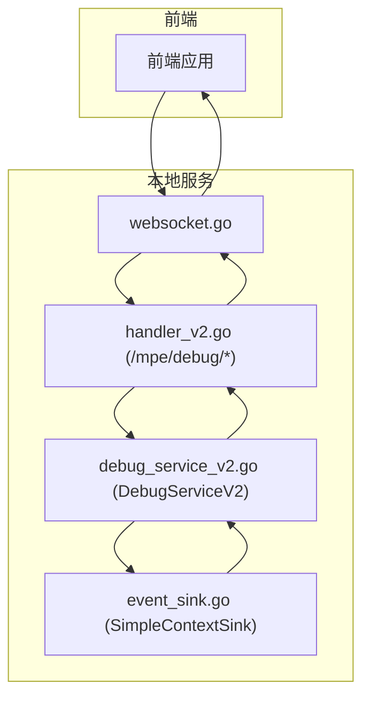
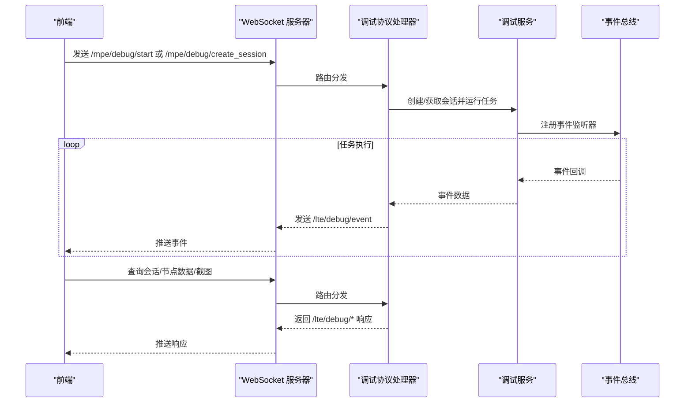
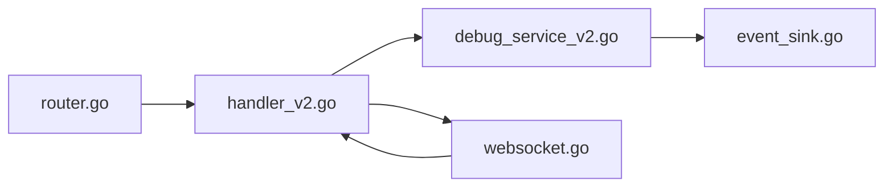

# LocalBridge 通信协议

<cite>
**本文引用的文件**
- [LocalBridge/internal/protocol/debug/handler_v2.go](file://LocalBridge/internal/protocol/debug/handler_v2.go)
- [LocalBridge/internal/mfw/debug_service_v2.go](file://LocalBridge/internal/mfw/debug_service_v2.go)
- [LocalBridge/internal/mfw/event_sink.go](file://LocalBridge/internal/mfw/event_sink.go)
- [LocalBridge/internal/server/websocket.go](file://LocalBridge/internal/server/websocket.go)
- [LocalBridge/internal/router/router.go](file://LocalBridge/internal/router/router.go)
- [docsite/docs/01.指南/100.其他/10.通信协议.md](file://docsite/docs/01.指南/100.其他/10.通信协议.md)
</cite>

## 更新摘要
**变更内容**
- 新增调试协议 V2 的完整路由、消息格式与事件类型说明，覆盖会话管理、调试控制、数据查询与事件推送。
- 明确 /mpe/debug/ 请求路由与 /lte/debug/ 响应路由的对应关系，补充错误响应与成功响应的消息结构。
- 新增调试事件类型与事件数据字段，完善节点执行、识别、动作等事件的传输规范。
- 补充调试协议的处理流程与前后端交互时序，完善协议参考与故障排查指引。

## 目录
1. [简介](#简介)
2. [项目结构](#项目结构)
3. [核心组件](#核心组件)
4. [架构总览](#架构总览)
5. [详细组件分析](#详细组件分析)
6. [依赖关系分析](#依赖关系分析)
7. [性能考量](#性能考量)
8. [故障排查指南](#故障排查指南)
9. [结论](#结论)
10. [附录](#附录)

## 简介
本文档系统性梳理 LocalBridge（简称 LB）通信协议，覆盖连接管理、消息规范、文件协议、日志协议、事件总线、配置系统、CLI 应用以及前端 WebSocket 服务端实现。本次更新重点新增调试协议 V2，提供统一的 /mpe/debug/ 请求路由与 /lte/debug/ 响应路由，涵盖会话管理、调试控制、数据查询与事件推送，完善前端与本地服务之间的调试交互规范。

## 项目结构
围绕调试协议 V2 的相关文件分布如下：
- 协议处理器：LocalBridge/internal/protocol/debug/handler_v2.go
- 调试服务：LocalBridge/internal/mfw/debug_service_v2.go
- 事件总线：LocalBridge/internal/mfw/event_sink.go
- WebSocket 服务器：LocalBridge/internal/server/websocket.go
- 路由接口：LocalBridge/internal/router/router.go

**Diagram sources**
- [LocalBridge/internal/protocol/debug/handler_v2.go](file://LocalBridge/internal/protocol/debug/handler_v2.go#L1-L491)
- [LocalBridge/internal/mfw/debug_service_v2.go](file://LocalBridge/internal/mfw/debug_service_v2.go#L1-L409)
- [LocalBridge/internal/mfw/event_sink.go](file://LocalBridge/internal/mfw/event_sink.go#L1-L365)
- [LocalBridge/internal/server/websocket.go](file://LocalBridge/internal/server/websocket.go#L1-L214)
- [LocalBridge/internal/router/router.go](file://LocalBridge/internal/router/router.go#L1-L80)

## 核心组件
- **调试协议处理器（DebugHandlerV2）**
  - 路由前缀：/mpe/debug/
  - 负责会话管理、调试控制、数据查询与事件推送的路由分发与响应构造。
  - 对外暴露 /lte/debug/ 响应路由，如 /lte/debug/session_created、/lte/debug/started、/lte/debug/event 等。
- **调试服务（DebugServiceV2）**
  - 会话生命周期管理：创建、销毁、列举、查询。
  - 调试控制：启动/运行/停止任务，校验入口节点存在性，异步等待任务完成并上报结果。
  - 状态查询：当前节点、上一个节点、暂停原因、最后错误、已执行节点计数等。
- **事件总线（SimpleContextSink）**
  - 事件类型：节点开始/成功/失败、识别开始/成功/失败、动作开始/成功/失败。
  - 事件数据：包含节点名、节点 ID、任务 ID、识别 ID、动作 ID、时间戳、耗时、详情等。
  - 事件转发：将事件转换为 /lte/debug/event 并通过连接发送给前端。

**Section sources**
- [LocalBridge/internal/protocol/debug/handler_v2.go](file://LocalBridge/internal/protocol/debug/handler_v2.go#L1-L491)
- [LocalBridge/internal/mfw/debug_service_v2.go](file://LocalBridge/internal/mfw/debug_service_v2.go#L1-L409)
- [LocalBridge/internal/mfw/event_sink.go](file://LocalBridge/internal/mfw/event_sink.go#L1-L365)

## 架构总览
调试协议 V2 的交互流程如下：
- 前端发送 /mpe/debug/create_session 或 /mpe/debug/start 创建并启动会话。
- 本地服务创建 DebugSessionV2，注册 SimpleContextSink 事件监听器。
- 任务运行期间，事件通过 /lte/debug/event 推送至前端。
- 前端可查询会话信息、节点数据、截图等。
- 任务完成后，服务端发送 /lte/debug/event 并更新会话状态。

**Diagram sources**
- [LocalBridge/internal/protocol/debug/handler_v2.go](file://LocalBridge/internal/protocol/debug/handler_v2.go#L1-L491)
- [LocalBridge/internal/mfw/debug_service_v2.go](file://LocalBridge/internal/mfw/debug_service_v2.go#L1-L409)
- [LocalBridge/internal/mfw/event_sink.go](file://LocalBridge/internal/mfw/event_sink.go#L1-L365)
- [LocalBridge/internal/server/websocket.go](file://LocalBridge/internal/server/websocket.go#L1-L214)

## 详细组件分析

### 调试协议处理器（handler_v2.go）
- 路由前缀：/mpe/debug/
- 会话管理
  - /mpe/debug/create_session：创建会话，返回 /lte/debug/session_created。
  - /mpe/debug/destroy_session：销毁会话，返回 /lte/debug/session_destroyed。
  - /mpe/debug/list_sessions：列出会话，返回 /lte/debug/sessions。
  - /mpe/debug/get_session：查询会话信息，返回 /lte/debug/session_info。
- 调试控制
  - /mpe/debug/start：自动创建会话并运行任务，返回 /lte/debug/started。
  - /mpe/debug/run：运行任务，返回 /lte/debug/running。
  - /mpe/debug/stop：停止调试，返回 /lte/debug/stopped。
- 数据查询
  - /mpe/debug/get_node_data：获取节点 JSON 数据，返回 /lte/debug/node_data。
  - /mpe/debug/screencap：截图，返回 /lte/debug/screencap。
- 错误处理
  - 未知路由或参数缺失时，返回 /lte/debug/error。

**Section sources**
- [LocalBridge/internal/protocol/debug/handler_v2.go](file://LocalBridge/internal/protocol/debug/handler_v2.go#L1-L491)

### 调试服务（debug_service_v2.go）
- 会话管理
  - CreateSession：加载控制器、资源，初始化 Tasker，创建 DebugSessionV2，注册事件监听器。
  - GetSession/DestroySession/ListSessions：会话查询、销毁与列举。
- 调试控制
  - RunTask：校验入口节点存在性，提交任务并异步等待完成，更新状态并上报结果事件。
  - Stop：停止任务并重置状态。
- 状态查询
  - GetStatus/GetCurrentNode/GetLastNode/GetPauseReason/GetLastError/GetExecutedNodes/GetNodeJSON/GetAdapter：提供会话状态与节点数据查询能力。

**Section sources**
- [LocalBridge/internal/mfw/debug_service_v2.go](file://LocalBridge/internal/mfw/debug_service_v2.go#L1-L409)

### 事件总线（event_sink.go）
- 事件类型
  - 节点：node_starting、node_succeeded、node_failed
  - 识别：reco_starting、reco_succeeded、reco_failed
  - 动作：action_starting、action_succeeded、action_failed
- 事件数据字段
  - type、timestamp、node_name、node_id、task_id、reco_id、action_id、latency(ms)、detail
- 事件转发
  - 将事件转换为 /lte/debug/event 并通过连接发送给前端。

**Section sources**
- [LocalBridge/internal/mfw/event_sink.go](file://LocalBridge/internal/mfw/event_sink.go#L1-L365)

## 依赖关系分析
- 协议处理器依赖调试服务与事件总线，负责消息分发与响应构造。
- 调试服务依赖事件总线进行事件监听与转发。
- WebSocket 服务器与路由接口确保协议一致性与消息路由。
- 前端通过 /lte/debug/* 路由接收事件与响应。

**Diagram sources**
- [LocalBridge/internal/protocol/debug/handler_v2.go](file://LocalBridge/internal/protocol/debug/handler_v2.go#L1-L491)
- [LocalBridge/internal/mfw/debug_service_v2.go](file://LocalBridge/internal/mfw/debug_service_v2.go#L1-L409)
- [LocalBridge/internal/mfw/event_sink.go](file://LocalBridge/internal/mfw/event_sink.go#L1-L365)
- [LocalBridge/internal/server/websocket.go](file://LocalBridge/internal/server/websocket.go#L1-L214)
- [LocalBridge/internal/router/router.go](file://LocalBridge/internal/router/router.go#L1-L80)

## 性能考量
- 事件频率：节点/识别/动作事件可能频繁产生，建议前端按需订阅与去重展示。
- 截图传输：Base64 图像数据较大，建议前端缓存与按需请求。
- 任务并发：避免同时发起多个长耗时任务，合理控制会话数量。

[本节为通用指导，不直接分析具体文件]

## 故障排查指南
- 服务未初始化
  - 现象：收到 /lte/debug/error，提示“MaaFramework 未初始化”。
  - 处理：先初始化 MFW 服务再发起调试请求。
- 参数缺失
  - 现象：收到 /lte/debug/error，提示缺少必需参数。
  - 处理：检查 resource_path、controller_id、session_id、entry 等参数。
- 会话不存在
  - 现象：查询会话或操作会话时报错。
  - 处理：确认会话 ID 是否正确，或重新创建会话。
- 入口节点不存在
  - 现象：运行任务时报错，提示入口节点不存在。
  - 处理：检查资源路径与节点名称是否匹配。

**Section sources**
- [LocalBridge/internal/protocol/debug/handler_v2.go](file://LocalBridge/internal/protocol/debug/handler_v2.go#L1-L491)
- [LocalBridge/internal/mfw/debug_service_v2.go](file://LocalBridge/internal/mfw/debug_service_v2.go#L1-L409)

## 结论
调试协议 V2 为编辑器与本地服务之间的流程级调试提供了标准化通道。通过统一的 /mpe/debug/ 请求与 /lte/debug/ 响应，前端可高效创建会话、运行/停止任务、查询节点数据与截图，并实时接收节点执行、识别与动作事件，从而实现可视化调试与问题定位。

[本节为总结，不直接分析具体文件]

## 附录

### 协议要点摘要
- 连接管理
  - 协议：WebSocket；默认端口：9066；连接超时：3 秒。
- 消息规范
  - 统一 JSON 结构：{path, data}。
- 调试协议 V2
  - 请求路由（/mpe/debug/*）
    - 会话管理：create_session、destroy_session、list_sessions、get_session
    - 调试控制：start、run、stop
    - 数据查询：get_node_data、screencap
  - 响应路由（/lte/debug/*）
    - 会话管理：session_created、session_destroyed、sessions、session_info
    - 调试控制：started、running、stopped
    - 数据查询：node_data、screencap
    - 事件推送：event
    - 错误响应：error

**Section sources**
- [docsite/docs/01.指南/100.其他/10.通信协议.md](file://docsite/docs/01.指南/100.其他/10.通信协议.md#L1-L166)
- [LocalBridge/internal/protocol/debug/handler_v2.go](file://LocalBridge/internal/protocol/debug/handler_v2.go#L1-L491)

### 调试协议 V2 路由与消息格式

#### 会话管理
- /mpe/debug/create_session
  - 请求数据：{resource_path, controller_id}
  - 响应：/lte/debug/session_created {success, session_id}
- /mpe/debug/destroy_session
  - 请求数据：{session_id}
  - 响应：/lte/debug/session_destroyed {success, session_id}
- /mpe/debug/list_sessions
  - 请求数据：{}
  - 响应：/lte/debug/sessions {success, sessions: [{session_id, resource_path, entry_node, status, created_at}]}
- /mpe/debug/get_session
  - 请求数据：{session_id}
  - 响应：/lte/debug/session_info {success, session_id, resource_path, entry_node, status, current_node, last_node, pause_reason, executed_nodes}

**Section sources**
- [LocalBridge/internal/protocol/debug/handler_v2.go](file://LocalBridge/internal/protocol/debug/handler_v2.go#L85-L206)
- [LocalBridge/internal/mfw/debug_service_v2.go](file://LocalBridge/internal/mfw/debug_service_v2.go#L145-L185)

#### 调试控制
- /mpe/debug/start
  - 请求数据：{resource_path, entry, controller_id}
  - 响应：/lte/debug/started {success, session_id}
- /mpe/debug/run
  - 请求数据：{session_id, entry}
  - 响应：/lte/debug/running {success, session_id, entry}
- /mpe/debug/stop
  - 请求数据：{session_id}
  - 响应：/lte/debug/stopped {success, session_id}

**Section sources**
- [LocalBridge/internal/protocol/debug/handler_v2.go](file://LocalBridge/internal/protocol/debug/handler_v2.go#L214-L336)
- [LocalBridge/internal/mfw/debug_service_v2.go](file://LocalBridge/internal/mfw/debug_service_v2.go#L192-L249)

#### 数据查询
- /mpe/debug/get_node_data
  - 请求数据：{session_id, node_name}
  - 响应：/lte/debug/node_data {success, node_name, node_data}
- /mpe/debug/screencap
  - 请求数据：{session_id}
  - 响应：/lte/debug/screencap {success, session_id, image_data}

**Section sources**
- [LocalBridge/internal/protocol/debug/handler_v2.go](file://LocalBridge/internal/protocol/debug/handler_v2.go#L343-L415)
- [LocalBridge/internal/mfw/debug_service_v2.go](file://LocalBridge/internal/mfw/debug_service_v2.go#L303-L305)

#### 事件推送
- /lte/debug/event
  - 数据字段：{event_name, session_id, node_name, node_id, task_id, reco_id, action_id, timestamp, latency, detail}
  - 事件类型：
    - 节点：node_starting、node_succeeded、node_failed
    - 识别：reco_starting、reco_succeeded、reco_failed
    - 动作：action_starting、action_succeeded、action_failed

**Section sources**
- [LocalBridge/internal/protocol/debug/handler_v2.go](file://LocalBridge/internal/protocol/debug/handler_v2.go#L460-L489)
- [LocalBridge/internal/mfw/event_sink.go](file://LocalBridge/internal/mfw/event_sink.go#L19-L51)

#### 错误响应
- /lte/debug/error
  - 数据字段：{success=false, error}

**Section sources**
- [LocalBridge/internal/protocol/debug/handler_v2.go](file://LocalBridge/internal/protocol/debug/handler_v2.go#L431-L440)

### 前端实现要点
- 注册 /lte/debug/* 响应路由，处理会话信息、事件、节点数据与截图。
- 提供创建会话、启动/运行/停止任务、查询节点数据与截图的 API。
- 建议前端实现事件去重、节点计数统计与截图缓存，提升调试体验。

**Section sources**
- [LocalBridge/internal/protocol/debug/handler_v2.go](file://LocalBridge/internal/protocol/debug/handler_v2.go#L1-L491)