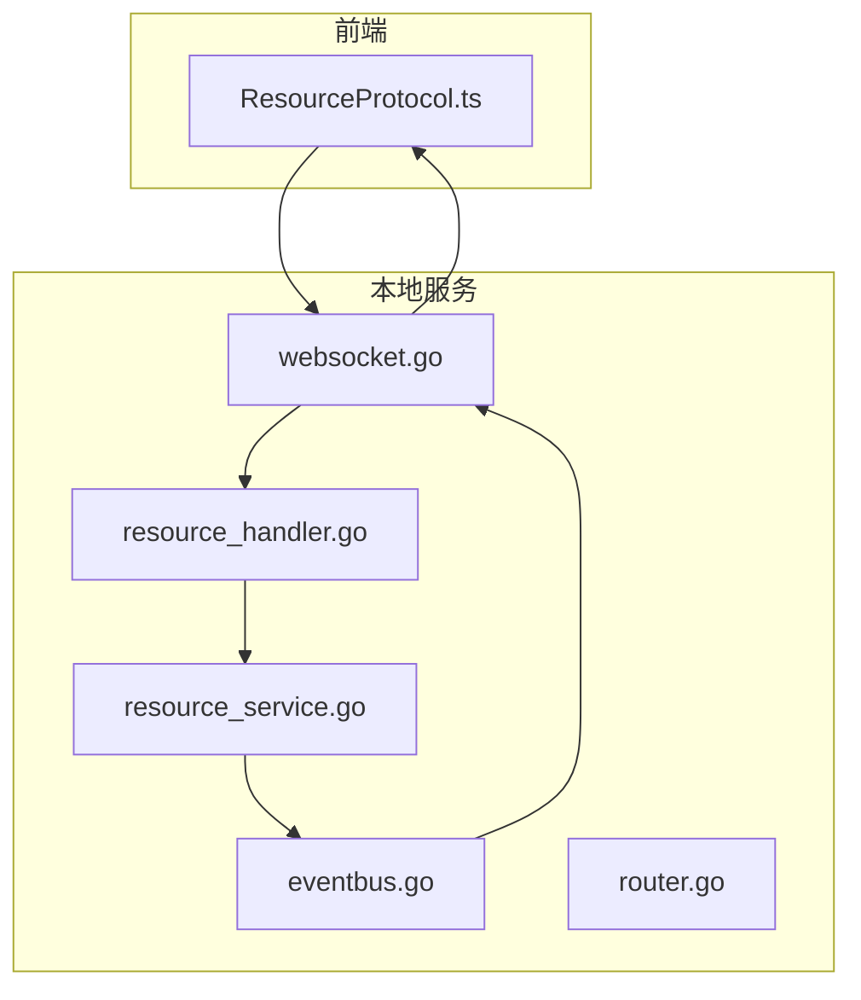
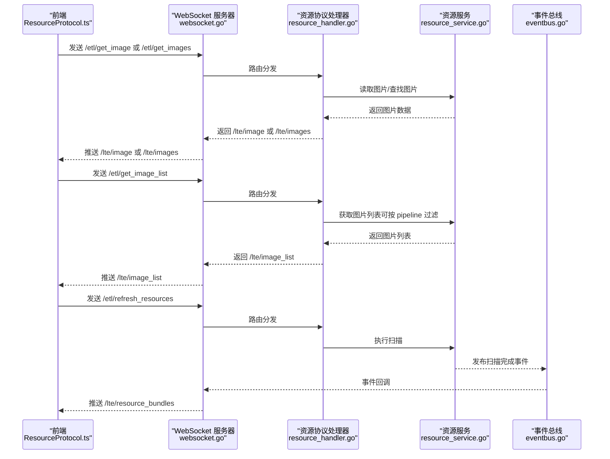
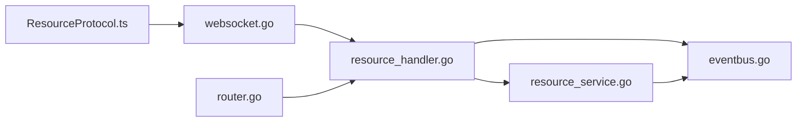

# LocalBridge 通信协议

<cite>
**本文引用的文件**
- [LocalBridge/internal/protocol/resource/handler.go](file://LocalBridge/internal/protocol/resource/handler.go)
- [LocalBridge/internal/service/resource/resource_service.go](file://LocalBridge/internal/service/resource/resource_service.go)
- [LocalBridge/pkg/models/resource.go](file://LocalBridge/pkg/models/resource.go)
- [src/services/protocols/ResourceProtocol.ts](file://src/services/protocols/ResourceProtocol.ts)
- [docsite/docs/01.指南/100.其他/10.通信协议.md](file://docsite/docs/01.指南/100.其他/10.通信协议.md)
- [LocalBridge/internal/server/websocket.go](file://LocalBridge/internal/server/websocket.go)
- [LocalBridge/internal/eventbus/eventbus.go](file://LocalBridge/internal/eventbus/eventbus.go)
- [LocalBridge/internal/router/router.go](file://LocalBridge/internal/router/router.go)
</cite>

## 更新摘要
**变更内容**
- 新增资源协议相关的 WebSocket 消息路径，包括 /etl/get_image、/etl/get_images、/etl/get_image_list、/etl/refresh_resources 及对应的 /lte/ 响应路径。
- 补充了资源协议的处理流程、数据模型与前端实现要点，完善了资源包扫描、图片检索与图片列表生成的完整链路。

## 目录
1. [简介](#简介)
2. [项目结构](#项目结构)
3. [核心组件](#核心组件)
4. [架构总览](#架构总览)
5. [详细组件分析](#详细组件分析)
6. [依赖关系分析](#依赖关系分析)
7. [性能考量](#性能考量)
8. [故障排查指南](#故障排查指南)
9. [结论](#结论)
10. [附录](#附录)

## 简介
本文档系统性梳理 LocalBridge（简称 LB）通信协议，覆盖连接管理、消息规范、文件协议、日志协议、事件总线、配置系统、CLI 应用以及前端 WebSocket 服务端实现。本次更新重点新增资源协议，涵盖资源包扫描、图片获取与图片列表生成的完整流程，新增的 WebSocket 路由包括：
- /etl/get_image：请求单张图片
- /etl/get_images：请求多张图片
- /etl/get_image_list：请求图片列表
- /etl/refresh_resources：刷新资源列表

对应的响应路由为：
- /lte/resource_bundles：推送资源包列表
- /lte/image：推送单张图片
- /lte/images：推送多张图片
- /lte/image_list：推送图片列表

**Section sources**
- [docsite/docs/01.指南/100.其他/10.通信协议.md](file://docsite/docs/01.指南/100.其他/10.通信协议.md#L1-L166)

## 项目结构
围绕资源协议的相关文件分布如下：
- 协议处理器：LocalBridge/internal/protocol/resource/handler.go
- 资源服务：LocalBridge/internal/service/resource/resource_service.go
- 数据模型：LocalBridge/pkg/models/resource.go
- 前端协议封装：src/services/protocols/ResourceProtocol.ts
- 事件总线：LocalBridge/internal/eventbus/eventbus.go
- WebSocket 服务器：LocalBridge/internal/server/websocket.go
- 路由接口：LocalBridge/internal/router/router.go

**Diagram sources**
- [src/services/protocols/ResourceProtocol.ts](file://src/services/protocols/ResourceProtocol.ts#L1-L281)
- [LocalBridge/internal/protocol/resource/handler.go](file://LocalBridge/internal/protocol/resource/handler.go#L1-L272)
- [LocalBridge/internal/service/resource/resource_service.go](file://LocalBridge/internal/service/resource/resource_service.go#L1-L337)
- [LocalBridge/internal/eventbus/eventbus.go](file://LocalBridge/internal/eventbus/eventbus.go#L1-L81)
- [LocalBridge/internal/server/websocket.go](file://LocalBridge/internal/server/websocket.go#L1-L214)
- [LocalBridge/internal/router/router.go](file://LocalBridge/internal/router/router.go#L1-L80)

## 核心组件
- **资源协议处理器（Handler）**
  - 负责注册路由前缀（/etl/get_image、/etl/get_images、/etl/get_image_list、/etl/refresh_resources）。
  - 根据消息路径分发到具体处理函数，返回 /lte/ 响应消息。
  - 订阅连接建立与资源扫描完成事件，推送资源包列表。
- **资源服务（Service）**
  - 扫描根目录，识别资源包（包含 pipeline、image、model、default_pipeline.json 等特征）。
  - 提供图片查找、图片列表生成、资源包列表查询等能力。
- **数据模型（models/resource.go）**
  - 定义资源包、图片请求/响应、图片列表请求/响应等结构体。
- **前端协议封装（ResourceProtocol.ts）**
  - 注册 /lte/ 响应路由，处理资源包列表、单张/批量图片与图片列表。
  - 提供请求单张图片、批量图片、刷新资源列表、获取图片列表等 API。

**Section sources**
- [LocalBridge/internal/protocol/resource/handler.go](file://LocalBridge/internal/protocol/resource/handler.go#L1-L272)
- [LocalBridge/internal/service/resource/resource_service.go](file://LocalBridge/internal/service/resource/resource_service.go#L1-L337)
- [LocalBridge/pkg/models/resource.go](file://LocalBridge/pkg/models/resource.go#L1-L67)
- [src/services/protocols/ResourceProtocol.ts](file://src/services/protocols/ResourceProtocol.ts#L1-L281)

## 架构总览
资源协议的交互流程如下：
- 连接建立后，服务端推送 /lte/resource_bundles，前端更新资源包信息。
- 前端请求 /etl/get_image 或 /etl/get_images，服务端读取图片并返回 /lte/image 或 /lte/images。
- 前端请求 /etl/get_image_list，服务端根据 pipeline 路径决定是否过滤到当前资源包的图片，并返回 /lte/image_list。
- 前端请求 /etl/refresh_resources，服务端重新扫描并推送最新的 /lte/resource_bundles。

**Diagram sources**
- [src/services/protocols/ResourceProtocol.ts](file://src/services/protocols/ResourceProtocol.ts#L1-L281)
- [LocalBridge/internal/protocol/resource/handler.go](file://LocalBridge/internal/protocol/resource/handler.go#L1-L272)
- [LocalBridge/internal/service/resource/resource_service.go](file://LocalBridge/internal/service/resource/resource_service.go#L1-L337)
- [LocalBridge/internal/eventbus/eventbus.go](file://LocalBridge/internal/eventbus/eventbus.go#L1-L81)
- [LocalBridge/internal/server/websocket.go](file://LocalBridge/internal/server/websocket.go#L1-L214)

## 详细组件分析

### 资源协议处理器（resource_handler.go）
- 路由前缀
  - /etl/get_image：获取单张图片
  - /etl/get_images：批量获取图片
  - /etl/get_image_list：获取图片列表
  - /etl/refresh_resources：刷新资源列表
- 处理逻辑
  - /etl/get_image：解析请求，调用 getImageData，返回 /lte/image。
  - /etl/get_images：解析相对路径数组，逐个获取图片，返回 /lte/images。
  - /etl/get_image_list：根据 pipeline_path 决定是否过滤到当前资源包，返回 /lte/image_list。
  - /etl/refresh_resources：触发资源扫描，推送 /lte/resource_bundles。
- 响应与错误
  - 成功时返回对应 /lte/ 路由消息。
  - 解析失败或读取失败时返回 /error 消息。

**Section sources**
- [LocalBridge/internal/protocol/resource/handler.go](file://LocalBridge/internal/protocol/resource/handler.go#L1-L272)

### 资源服务（resource_service.go）
- 资源包识别
  - 检查目录是否包含 pipeline、image、model 或 default_pipeline.json，满足其一即视为资源包。
  - 记录资源包的绝对路径、相对路径、名称及 image 目录。
- 图片查找
  - 在所有资源包的 image 目录中按相对路径查找图片，返回绝对路径、资源包名与是否找到。
- 图片列表生成
  - 支持两种模式：
    - 全局：遍历所有资源包的 image 目录，返回全部图片并标注来源。
    - 过滤：根据 pipeline_path 查找所属资源包，仅返回该资源包的图片。
- 资源包列表
  - 返回根目录、资源包数组与 image 目录列表。

**Section sources**
- [LocalBridge/internal/service/resource/resource_service.go](file://LocalBridge/internal/service/resource/resource_service.go#L1-L337)

### 数据模型（resource.go）
- 资源包信息：包含绝对路径、相对路径、名称、是否包含 pipeline/image/model、默认 pipeline 文件、image 目录等。
- 资源包列表数据：根目录、资源包数组、image 目录数组。
- 图片请求/响应：
  - 单张：请求包含 relative_path；响应包含 success、relative_path、absolute_path、bundle_name、base64、mime_type、width、height、message。
  - 批量：请求包含 relative_paths；响应包含 images 数组。
- 图片列表请求/响应：
  - 请求包含 pipeline_path（可选）；响应包含 images（每项含 relative_path、bundle_name）、bundle_name（当前资源包名，可选）、is_filtered（是否过滤）。

**Section sources**
- [LocalBridge/pkg/models/resource.go](file://LocalBridge/pkg/models/resource.go#L1-L67)

### 前端实现要点（ResourceProtocol.ts）
- 注册路由
  - /lte/resource_bundles：更新本地资源包信息与 image 目录。
  - /lte/image：缓存单张图片（base64、mime、尺寸、来源）。
  - /lte/images：批量处理图片缓存。
  - /lte/image_list：更新图片列表与过滤状态。
- 请求 API
  - requestImage：发送 /etl/get_image。
  - requestImages：发送 /etl/get_images。
  - requestRefreshResources：发送 /etl/refresh_resources。
  - requestImageList：发送 /etl/get_image_list，携带 pipeline_path（可选）。

**Section sources**
- [src/services/protocols/ResourceProtocol.ts](file://src/services/protocols/ResourceProtocol.ts#L1-L281)

## 依赖关系分析
- 协议处理器依赖资源服务与事件总线，负责消息分发与响应。
- 资源服务依赖事件总线发布扫描完成事件，驱动前端更新。
- 前端协议封装依赖 WebSocket 服务器进行消息收发。
- 路由接口定义处理器的路由前缀，保证协议一致性。

**Diagram sources**
- [LocalBridge/internal/protocol/resource/handler.go](file://LocalBridge/internal/protocol/resource/handler.go#L1-L272)
- [LocalBridge/internal/service/resource/resource_service.go](file://LocalBridge/internal/service/resource/resource_service.go#L1-L337)
- [LocalBridge/internal/eventbus/eventbus.go](file://LocalBridge/internal/eventbus/eventbus.go#L1-L81)
- [LocalBridge/internal/server/websocket.go](file://LocalBridge/internal/server/websocket.go#L1-L214)
- [LocalBridge/internal/router/router.go](file://LocalBridge/internal/router/router.go#L1-L80)
- [src/services/protocols/ResourceProtocol.ts](file://src/services/protocols/ResourceProtocol.ts#L1-L281)

## 性能考量
- 图片读取与编码：Base64 编码与尺寸解析可能带来 CPU 与内存开销，建议前端缓存与去重请求。
- 批量请求：/etl/get_images 可显著降低往返次数，提升加载效率。
- 资源扫描：扫描多层级目录与大量文件时，建议限制扫描深度与忽略目录，避免阻塞。

[本节为通用指导，不直接分析具体文件]

## 故障排查指南
- 图片未找到
  - 检查 relative_path 是否正确，确认资源包内 image 目录结构。
- 读取失败
  - 检查文件权限与路径有效性，查看 /lte/image 响应中的 message 字段。
- 资源包列表不更新
  - 确认 /etl/refresh_resources 已发送，服务端是否成功扫描并推送 /lte/resource_bundles。
- 图片列表为空
  - 若提供了 pipeline_path，确认其是否位于某个资源包内；否则返回全部图片。

**Section sources**
- [LocalBridge/internal/protocol/resource/handler.go](file://LocalBridge/internal/protocol/resource/handler.go#L1-L272)
- [LocalBridge/internal/service/resource/resource_service.go](file://LocalBridge/internal/service/resource/resource_service.go#L1-L337)
- [src/services/protocols/ResourceProtocol.ts](file://src/services/protocols/ResourceProtocol.ts#L1-L281)

## 结论
资源协议为编辑器与本地服务之间的图片与资源包交互提供了标准化通道。通过统一的 /etl/* 请求与 /lte/* 响应，前端可高效获取图片、浏览图片列表并管理资源包。配合事件总线与 WebSocket 服务器，实现了低延迟、可扩展的资源管理能力。

[本节为总结，不直接分析具体文件]

## 附录

### 协议要点摘要
- 连接管理
  - 协议：WebSocket；默认端口：9066；连接超时：3 秒。
- 消息规范
  - 统一 JSON 结构：{path, data}。
- 资源协议
  - 请求路由：
    - /etl/get_image：请求单张图片（data: {relative_path}）
    - /etl/get_images：请求多张图片（data: {relative_paths}）
    - /etl/get_image_list：请求图片列表（data: {pipeline_path?}）
    - /etl/refresh_resources：刷新资源列表（data: {}）
  - 响应路由：
    - /lte/resource_bundles：推送资源包列表（data: {root, bundles, image_dirs}）
    - /lte/image：推送单张图片（data: {success, relative_path, absolute_path?, bundle_name?, base64?, mime_type?, width?, height?, message?}）
    - /lte/images：推送多张图片（data: {images: [...]}）
    - /lte/image_list：推送图片列表（data: {images: [{relative_path, bundle_name}], bundle_name?, is_filtered?}）

**Section sources**
- [docsite/docs/01.指南/100.其他/10.通信协议.md](file://docsite/docs/01.指南/100.其他/10.通信协议.md#L1-L166)
- [LocalBridge/internal/protocol/resource/handler.go](file://LocalBridge/internal/protocol/resource/handler.go#L1-L272)
- [LocalBridge/internal/service/resource/resource_service.go](file://LocalBridge/internal/service/resource/resource_service.go#L1-L337)
- [LocalBridge/pkg/models/resource.go](file://LocalBridge/pkg/models/resource.go#L1-L67)
- [src/services/protocols/ResourceProtocol.ts](file://src/services/protocols/ResourceProtocol.ts#L1-L281)

### 前端实现要点
- 注册 /lte/ 响应路由，处理资源包列表、单张/批量图片与图片列表。
- 提供 requestImage、requestImages、requestRefreshResources、requestImageList 等 API。
- 建议前端实现图片缓存与去重请求，提升加载性能。

**Section sources**
- [src/services/protocols/ResourceProtocol.ts](file://src/services/protocols/ResourceProtocol.ts#L1-L281)