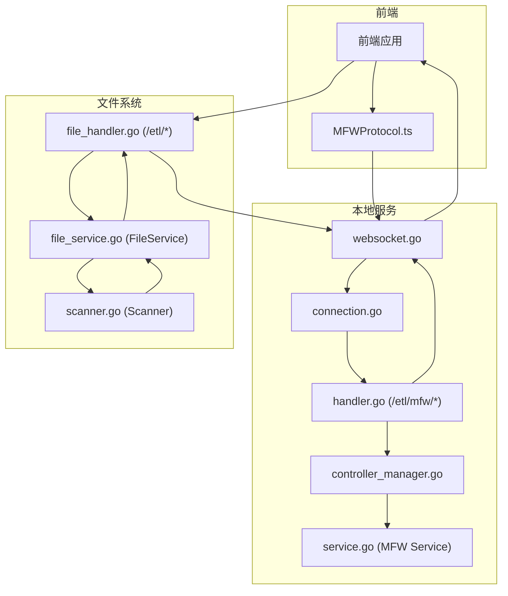
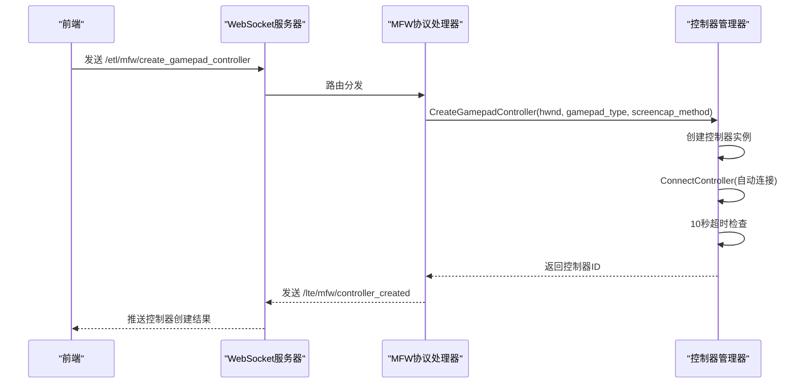
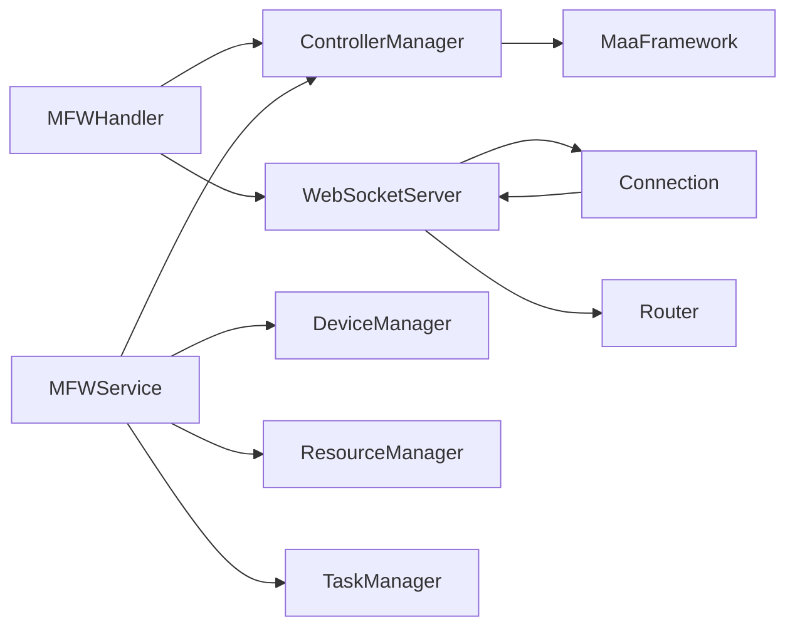

# LocalBridge 通信协议

<cite>
**本文引用的文件**
- [LocalBridge/internal/protocol/mfw/handler.go](file://LocalBridge/internal/protocol/mfw/handler.go)
- [LocalBridge/internal/mfw/controller_manager.go](file://LocalBridge/internal/mfw/controller_manager.go)
- [LocalBridge/internal/server/websocket.go](file://LocalBridge/internal/server/websocket.go)
- [LocalBridge/internal/server/connection.go](file://LocalBridge/internal/server/connection.go)
- [LocalBridge/internal/mfw/service.go](file://LocalBridge/internal/mfw/service.go)
- [LocalBridge/internal/protocol/file/file_handler.go](file://LocalBridge/internal/protocol/file/file_handler.go)
- [LocalBridge/internal/service/file/file_service.go](file://LocalBridge/internal/service/file/file_service.go)
- [LocalBridge/internal/service/file/scanner.go](file://LocalBridge/internal/service/file/scanner.go)
- [LocalBridge/pkg/models/file.go](file://LocalBridge/pkg/models/file.go)
- [LocalBridge/pkg/models/message.go](file://LocalBridge/pkg/models/message.go)
- [src/services/protocols/MFWProtocol.ts](file://src/services/protocols/MFWProtocol.ts)
- [docsite/docs/01.指南/100.其他/10.通信协议.md](file://docsite/docs/01.指南/100.其他/10.通信协议.md)
</cite>

## 更新摘要
**变更内容**
- 新增游戏手柄控制器端点支持，包括创建、按键点击、触摸操作等功能
- 增强连接超时检查机制，支持控制器连接超时检测和自动断开
- 完善自动Agent断开功能，支持非活跃控制器的自动清理
- 扩展MFW协议处理器，支持新的游戏手柄控制操作

## 目录
1. [简介](#简介)
2. [项目结构](#项目结构)
3. [核心组件](#核心组件)
4. [架构总览](#架构总览)
5. [详细组件分析](#详细组件分析)
6. [依赖关系分析](#依赖关系分析)
7. [性能考量](#性能考量)
8. [故障排查指南](#故障排查指南)
9. [结论](#结论)
10. [附录](#附录)

## 简介
本文档系统性梳理 LocalBridge（简称 LB）通信协议，覆盖连接管理、消息规范、文件协议、日志协议、事件总线、配置系统、CLI 应用以及前端 WebSocket 服务端实现。本次更新重点新增游戏手柄控制器端点支持，包括创建虚拟游戏手柄、按键点击、触摸操作等功能，同时完善连接超时检查机制和自动Agent断开功能，提升控制器管理的稳定性和可靠性。

## 项目结构
围绕游戏手柄控制器和连接管理的相关文件分布如下：
- MFW协议处理器：LocalBridge/internal/protocol/mfw/handler.go
- 控制器管理器：LocalBridge/internal/mfw/controller_manager.go
- WebSocket服务器：LocalBridge/internal/server/websocket.go
- 连接管理：LocalBridge/internal/server/connection.go
- MFW服务：LocalBridge/internal/mfw/service.go
- 文件协议处理器：LocalBridge/internal/protocol/file/file_handler.go
- 文件服务：LocalBridge/internal/service/file/file_service.go
- 文件扫描器：LocalBridge/internal/service/file/scanner.go
- 模型定义：LocalBridge/pkg/models/file.go, LocalBridge/pkg/models/message.go
- 前端协议：src/services/protocols/MFWProtocol.ts

**Diagram sources**
- [LocalBridge/internal/protocol/mfw/handler.go](file://LocalBridge/internal/protocol/mfw/handler.go#L1-L694)
- [LocalBridge/internal/mfw/controller_manager.go](file://LocalBridge/internal/mfw/controller_manager.go#L1-L702)
- [LocalBridge/internal/server/websocket.go](file://LocalBridge/internal/server/websocket.go#L1-L179)
- [LocalBridge/internal/server/connection.go](file://LocalBridge/internal/server/connection.go#L1-L96)
- [LocalBridge/internal/mfw/service.go](file://LocalBridge/internal/mfw/service.go#L1-L193)
- [LocalBridge/internal/protocol/file/file_handler.go](file://LocalBridge/internal/protocol/file/file_handler.go#L1-L310)
- [LocalBridge/internal/service/file/file_service.go](file://LocalBridge/internal/service/file/file_service.go#L1-L250)
- [LocalBridge/internal/service/file/scanner.go](file://LocalBridge/internal/service/file/scanner.go#L1-L177)
- [src/services/protocols/MFWProtocol.ts](file://src/services/protocols/MFWProtocol.ts#L1-L574)

## 核心组件
- **MFW协议处理器（MFWHandler）**
  - 路由前缀：/etl/mfw/
  - 支持设备管理、控制器管理、任务管理、资源管理等功能
  - 新增游戏手柄控制器端点：/etl/mfw/create_gamepad_controller、/etl/mfw/controller_click_key、/etl/mfw/controller_touch_gamepad
- **控制器管理器（ControllerManager）**
  - 支持多种控制器类型：ADB、Win32、PlayCover、Gamepad
  - 增强连接超时检查机制，支持10秒超时检测
  - 实现非活跃控制器自动清理功能
- **WebSocket服务器（WebSocketServer）**
  - 默认端口：9066
  - HTTP超时设置：ReadTimeout 10秒，WriteTimeout 10秒
  - 支持连接注册、注销和广播功能
- **连接管理（Connection）**
  - 发送队列容量：256
  - 支持消息发送、读取和写入协程管理
- **MFW服务（Service）**
  - 管理设备、控制器、资源、任务四个子系统
  - 支持服务初始化、关闭和状态检查

**Section sources**
- [LocalBridge/internal/protocol/mfw/handler.go](file://LocalBridge/internal/protocol/mfw/handler.go#L24-L99)
- [LocalBridge/internal/mfw/controller_manager.go](file://LocalBridge/internal/mfw/controller_manager.go#L21-L31)
- [LocalBridge/internal/server/websocket.go](file://LocalBridge/internal/server/websocket.go#L36-L58)
- [LocalBridge/internal/server/connection.go](file://LocalBridge/internal/server/connection.go#L13-L29)
- [LocalBridge/internal/mfw/service.go](file://LocalBridge/internal/mfw/service.go#L16-L34)

## 架构总览
游戏手柄控制器功能的交互流程如下：
- 前端发送 /etl/mfw/create_gamepad_controller 创建游戏手柄控制器
- 本地服务调用 ControllerManager.CreateGamepadController 创建控制器实例
- 自动调用 ConnectController 进行连接，包含10秒超时检查
- 成功创建后返回 /lte/mfw/controller_created 响应
- 前端通过 /lte/mfw/controller_status 接收控制器状态更新

**Diagram sources**
- [LocalBridge/internal/protocol/mfw/handler.go](file://LocalBridge/internal/protocol/mfw/handler.go#L266-L303)
- [LocalBridge/internal/mfw/controller_manager.go](file://LocalBridge/internal/mfw/controller_manager.go#L159-L211)

## 详细组件分析

### MFW协议处理器（handler.go）
- **路由前缀**：/etl/mfw/
- **新增游戏手柄控制器端点**
  - /etl/mfw/create_gamepad_controller：创建游戏手柄控制器
  - /etl/mfw/controller_click_key：点击游戏手柄按键
  - /etl/mfw/controller_touch_gamepad：游戏手柄触摸操作
- **控制器管理**
  - 自动连接：创建控制器后自动调用 ConnectController
  - 状态更新：发送 /lte/mfw/controller_status 响应
- **错误处理**：统一的错误响应格式，包含错误代码和详细信息

**Section sources**
- [LocalBridge/internal/protocol/mfw/handler.go](file://LocalBridge/internal/protocol/mfw/handler.go#L51-L77)
- [LocalBridge/internal/protocol/mfw/handler.go](file://LocalBridge/internal/protocol/mfw/handler.go#L266-L303)
- [LocalBridge/internal/protocol/mfw/handler.go](file://LocalBridge/internal/protocol/mfw/handler.go#L472-L516)

### 控制器管理器（controller_manager.go）
- **游戏手柄控制器创建**
  - 支持Xbox360和DualShock4两种类型
  - 可选窗口句柄参数，用于截图功能
  - 自动解析截图方法参数
- **连接超时检查**
  - 异步连接机制，使用select等待连接完成
  - 10秒超时检测，超时后记录警告日志
  - 连接完成后检查控制器状态
- **非活跃控制器清理**
  - CleanupInactive方法定期清理超时控制器
  - LastActiveAt时间戳跟踪控制器活跃状态
  - 自动销毁控制器实例并释放资源

**Section sources**
- [LocalBridge/internal/mfw/controller_manager.go](file://LocalBridge/internal/mfw/controller_manager.go#L159-L211)
- [LocalBridge/internal/mfw/controller_manager.go](file://LocalBridge/internal/mfw/controller_manager.go#L214-L264)
- [LocalBridge/internal/mfw/controller_manager.go](file://LocalBridge/internal/mfw/controller_manager.go#L578-L593)

### WebSocket服务器（websocket.go）
- **服务器配置**
  - 默认端口：9066
  - ReadTimeout：10秒，WriteTimeout：10秒
  - 支持跨域访问（CheckOrigin返回true）
- **连接管理**
  - 连接注册和注销协程
  - 事件总线集成，发布连接建立和关闭事件
  - 广播功能支持向所有连接发送消息
- **HTTP服务器**
  - 基于gorilla/websocket库
  - 支持动态在线服务地址生成

**Section sources**
- [LocalBridge/internal/server/websocket.go](file://LocalBridge/internal/server/websocket.go#L36-L58)
- [LocalBridge/internal/server/websocket.go](file://LocalBridge/internal/server/websocket.go#L75-L93)
- [LocalBridge/internal/server/websocket.go](file://LocalBridge/internal/server/websocket.go#L115-L142)

### 连接管理（connection.go）
- **连接生命周期**
  - 读取协程：处理客户端消息，解析JSON格式
  - 写入协程：异步发送消息到客户端
  - 自动清理：连接断开时关闭发送通道
- **消息处理**
  - JSON序列化和反序列化
  - 发送队列容量限制，避免内存溢出
  - 错误处理和日志记录

**Section sources**
- [LocalBridge/internal/server/connection.go](file://LocalBridge/internal/server/connection.go#L32-L59)
- [LocalBridge/internal/server/connection.go](file://LocalBridge/internal/server/connection.go#L79-L95)

### MFW服务（service.go）
- **服务初始化**
  - MaaFramework框架初始化
  - 支持中文路径处理（Windows系统）
  - 日志目录配置和路径转换
- **服务管理**
  - Shutdown方法优雅关闭所有子系统
  - StopAll任务停止和资源卸载
  - DisconnectAll控制器断开和清理
- **状态检查**
  - IsInitialized方法检查服务状态
  - 线程安全的状态访问

**Section sources**
- [LocalBridge/internal/mfw/service.go](file://LocalBridge/internal/mfw/service.go#L37-L133)
- [LocalBridge/internal/mfw/service.go](file://LocalBridge/internal/mfw/service.go#L136-L165)
- [LocalBridge/internal/mfw/service.go](file://LocalBridge/internal/mfw/service.go#L188-L193)

### 前端协议（MFWProtocol.ts）
- **游戏手柄控制器API**
  - createGamepadController：创建游戏手柄控制器
  - disconnectController：断开控制器连接
  - requestScreencap：请求截图功能
- **连接状态管理**
  - 自动清除控制器状态（连接断开时）
  - 记录最后一次连接设备信息
  - 连接状态变化事件处理
- **回调机制**
  - screencapCallbacks：截图结果回调
  - ocrCallbacks：OCR识别回调
  - imagePathCallbacks：图片路径解析回调

**Section sources**
- [src/services/protocols/MFWProtocol.ts](file://src/services/protocols/MFWProtocol.ts#L392-L417)
- [src/services/protocols/MFWProtocol.ts](file://src/services/protocols/MFWProtocol.ts#L422-L431)
- [src/services/protocols/MFWProtocol.ts](file://src/services/protocols/MFWProtocol.ts#L43-L54)

## 依赖关系分析
- MFW协议处理器依赖控制器管理器进行控制器操作，负责消息路由和响应构造
- 控制器管理器依赖MaaFramework库进行实际的控制器操作
- WebSocket服务器提供连接管理，连接管理器负责消息发送和接收
- MFW服务协调各个子系统的初始化和关闭
- 前端协议通过WebSocket与本地服务通信，实现控制器管理功能

**Diagram sources**
- [LocalBridge/internal/protocol/mfw/handler.go](file://LocalBridge/internal/protocol/mfw/handler.go#L12-L21)
- [LocalBridge/internal/mfw/controller_manager.go](file://LocalBridge/internal/mfw/controller_manager.go#L13-L17)
- [LocalBridge/internal/server/websocket.go](file://LocalBridge/internal/server/websocket.go#L36-L46)
- [LocalBridge/internal/server/connection.go](file://LocalBridge/internal/server/connection.go#L13-L19)
- [LocalBridge/internal/mfw/service.go](file://LocalBridge/internal/mfw/service.go#L16-L23)

## 性能考量
- **连接超时**：控制器连接超时设置为10秒，平衡了响应速度和稳定性
- **内存管理**：非活跃控制器自动清理，避免内存泄漏
- **消息队列**：连接发送队列容量256，防止消息积压导致内存占用过高
- **HTTP超时**：ReadTimeout和WriteTimeout均为10秒，确保服务器响应及时性
- **资源清理**：服务关闭时自动断开所有控制器，释放系统资源

## 故障排查指南
- **游戏手柄控制器创建失败**
  - 现象：/error响应，包含"ViGEm驱动未安装"错误
  - 处理：安装ViGEm Bus Driver后重试
- **控制器连接超时**
  - 现象：日志显示"控制器连接超时！"
  - 处理：检查目标设备是否正常，重新创建控制器
- **连接断开自动清理**
  - 现象：长时间无操作后控制器自动断开
  - 处理：重新创建控制器或调整非活跃超时时间
- **WebSocket连接异常**
  - 现象：连接建立后立即断开
  - 处理：检查端口占用情况，确认防火墙设置

**Section sources**
- [LocalBridge/internal/mfw/controller_manager.go](file://LocalBridge/internal/mfw/controller_manager.go#L193-L194)
- [LocalBridge/internal/mfw/controller_manager.go](file://LocalBridge/internal/mfw/controller_manager.go#L246-L247)
- [LocalBridge/internal/mfw/controller_manager.go](file://LocalBridge/internal/mfw/controller_manager.go#L590-L591)

## 结论
本次更新显著增强了LocalBridge的控制器管理能力，特别是游戏手柄控制器的支持。通过新增的/etl/mfw/create_gamepad_controller、/etl/mfw/controller_click_key、/etl/mfw/controller_touch_gamepad等端点，实现了完整的游戏手柄控制功能。同时，完善的连接超时检查机制和自动Agent断开功能，确保了系统的稳定性和资源的有效利用。配合前端MFWProtocol的完整API支持，为用户提供了便捷的游戏手柄控制体验。

## 附录

### MFW协议要点摘要
- **连接管理**
  - 协议：WebSocket；默认端口：9066；HTTP超时：10秒
  - 连接超时检查：控制器连接超时10秒
  - 自动清理：非活跃控制器自动断开
- **消息规范**
  - 统一JSON结构：{path, data}
  - 错误响应格式：{code, message, detail}
- **MFW协议**
  - 请求路由（/etl/mfw/*）
    - 设备管理：refresh_adb_devices, refresh_win32_windows
    - 控制器管理：create_gamepad_controller, disconnect_controller
    - 操作控制：controller_click_key, controller_touch_gamepad
  - 响应路由（/lte/mfw/*）
    - 控制器状态：controller_created, controller_status
    - 操作结果：controller_operation_result

**Section sources**
- [docsite/docs/01.指南/100.其他/10.通信协议.md](file://docsite/docs/01.指南/100.其他/10.通信协议.md#L1-L166)
- [LocalBridge/internal/protocol/mfw/handler.go](file://LocalBridge/internal/protocol/mfw/handler.go#L44-L99)

### 游戏手柄控制器端点

#### 创建游戏手柄控制器
- **路由**：/etl/mfw/create_gamepad_controller
- **请求数据**：
  - hwnd：窗口句柄（可选）
  - gamepad_type：手柄类型（Xbox360或DualShock4）
  - screencap_method：截图方法
- **响应**：/lte/mfw/controller_created
  - success：创建是否成功
  - controller_id：控制器唯一标识
  - type：控制器类型（gamepad）

#### 游戏手柄按键操作
- **路由**：/etl/mfw/controller_click_key
- **请求数据**：
  - controller_id：控制器ID
  - keycode：按键代码
- **响应**：/lte/mfw/controller_operation_result
  - operation：click_key
  - success：操作是否成功

#### 游戏手柄触摸操作
- **路由**：/etl/mfw/controller_touch_gamepad
- **请求数据**：
  - controller_id：控制器ID
  - contact：接触点ID
  - x, y：坐标位置
  - pressure：压力值
  - action：操作类型（down/move/up）
- **响应**：/lte/mfw/controller_operation_result
  - operation：touch_gamepad
  - success：操作是否成功

**Section sources**
- [LocalBridge/internal/protocol/mfw/handler.go](file://LocalBridge/internal/protocol/mfw/handler.go#L266-L303)
- [LocalBridge/internal/protocol/mfw/handler.go](file://LocalBridge/internal/protocol/mfw/handler.go#L472-L490)
- [LocalBridge/internal/protocol/mfw/handler.go](file://LocalBridge/internal/protocol/mfw/handler.go#L492-L516)

### 连接超时检查机制
- **控制器连接超时**：10秒超时检测，超时后记录警告日志
- **HTTP连接超时**：ReadTimeout和WriteTimeout均为10秒
- **非活跃清理**：定期检查控制器LastActiveAt时间戳
- **自动断开**：超过超时时间的控制器自动断开连接

**Section sources**
- [LocalBridge/internal/mfw/controller_manager.go](file://LocalBridge/internal/mfw/controller_manager.go#L242-L247)
- [LocalBridge/internal/server/websocket.go](file://LocalBridge/internal/server/websocket.go#L78-L80)
- [LocalBridge/internal/mfw/controller_manager.go](file://LocalBridge/internal/mfw/controller_manager.go#L584-L591)

### 自动Agent断开功能
- **服务关闭断开**：Shutdown时自动断开所有控制器
- **非活跃清理**：CleanupInactive方法定期清理超时控制器
- **连接断开事件**：前端自动清除控制器状态
- **资源释放**：断开时销毁控制器实例并释放内存

**Section sources**
- [LocalBridge/internal/mfw/service.go](file://LocalBridge/internal/mfw/service.go#L149-L150)
- [LocalBridge/internal/mfw/controller_manager.go](file://LocalBridge/internal/mfw/controller_manager.go#L596-L611)
- [src/services/protocols/MFWProtocol.ts](file://src/services/protocols/MFWProtocol.ts#L45-L54)

### 文件协议与MFW协议对比
- **文件协议**：/etl/ 前缀，主要用于文件管理
- **MFW协议**：/etl/mfw/ 前缀，主要用于MaaFramework相关操作
- **路由分离**：避免命名冲突，便于功能模块化
- **响应区分**：文件协议使用/lte/file_*，MFW协议使用/lte/mfw_*

**Section sources**
- [LocalBridge/internal/protocol/file/file_handler.go](file://LocalBridge/internal/protocol/file/file_handler.go#L24-L26)
- [LocalBridge/internal/protocol/mfw/handler.go](file://LocalBridge/internal/protocol/mfw/handler.go#L24-L26)