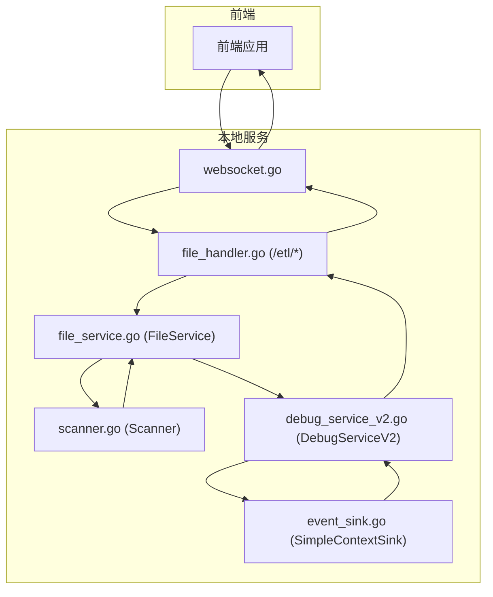
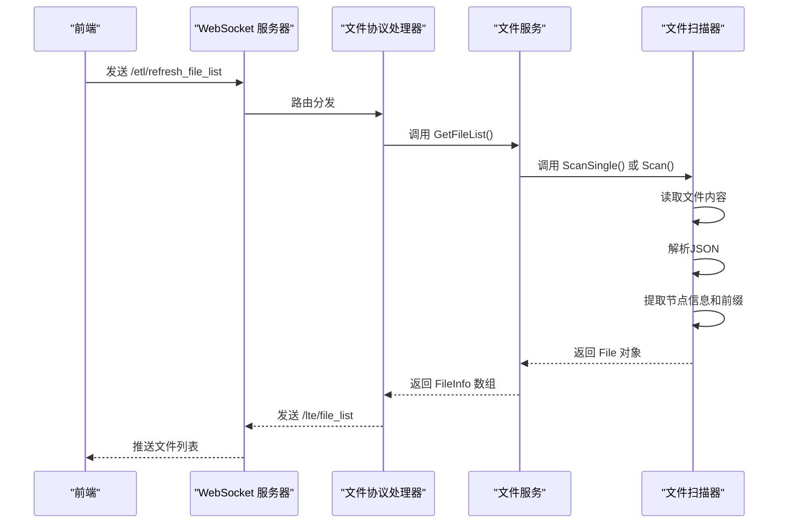
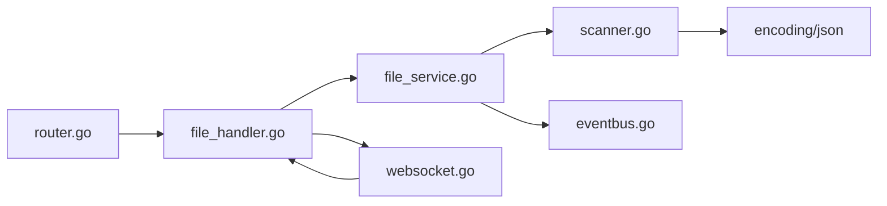

# LocalBridge 通信协议

<cite>
**本文引用的文件**
- [LocalBridge/internal/protocol/debug/handler_v2.go](file://LocalBridge/internal/protocol/debug/handler_v2.go)
- [LocalBridge/internal/mfw/debug_service_v2.go](file://LocalBridge/internal/mfw/debug_service_v2.go)
- [LocalBridge/internal/mfw/event_sink.go](file://LocalBridge/internal/mfw/event_sink.go)
- [LocalBridge/internal/server/websocket.go](file://LocalBridge/internal/server/websocket.go)
- [LocalBridge/internal/router/router.go](file://LocalBridge/internal/router/router.go)
- [LocalBridge/internal/protocol/file/file_handler.go](file://LocalBridge/internal/protocol/file/file_handler.go)
- [LocalBridge/internal/service/file/scanner.go](file://LocalBridge/internal/service/file/scanner.go)
- [LocalBridge/internal/service/file/file_service.go](file://LocalBridge/internal/service/file/file_service.go)
- [LocalBridge/pkg/models/file.go](file://LocalBridge/pkg/models/file.go)
- [LocalBridge/pkg/models/message.go](file://LocalBridge/pkg/models/message.go)
- [docsite/docs/01.指南/100.其他/10.通信协议.md](file://docsite/docs/01.指南/100.其他/10.通信协议.md)
</cite>

## 更新摘要
**变更内容**
- 新增文件扫描功能增强，支持从 pipeline 文件中提取节点信息和前缀配置
- 新增 JSON 解析能力，返回结构化的 FileNode 对象
- 新增文件协议处理器，支持文件列表刷新和文件内容获取
- 完善文件服务的扫描、监听和事件推送机制

## 目录
1. [简介](#简介)
2. [项目结构](#项目结构)
3. [核心组件](#核心组件)
4. [架构总览](#架构总览)
5. [详细组件分析](#详细组件分析)
6. [依赖关系分析](#依赖关系分析)
7. [性能考量](#性能考量)
8. [故障排查指南](#故障排查指南)
9. [结论](#结论)
10. [附录](#附录)

## 简介
本文档系统性梳理 LocalBridge（简称 LB）通信协议，覆盖连接管理、消息规范、文件协议、日志协议、事件总线、配置系统、CLI 应用以及前端 WebSocket 服务端实现。本次更新重点新增文件扫描功能增强，提供从 pipeline 文件中提取节点信息和前缀配置的能力，完善前端与本地服务之间的文件管理交互规范。

## 项目结构
围绕文件扫描功能的相关文件分布如下：
- 文件协议处理器：LocalBridge/internal/protocol/file/file_handler.go
- 文件服务：LocalBridge/internal/service/file/file_service.go
- 文件扫描器：LocalBridge/internal/service/file/scanner.go
- 模型定义：LocalBridge/pkg/models/file.go, LocalBridge/pkg/models/message.go
- 调试协议处理器：LocalBridge/internal/protocol/debug/handler_v2.go
- 调试服务：LocalBridge/internal/mfw/debug_service_v2.go
- 事件总线：LocalBridge/internal/mfw/event_sink.go
- WebSocket 服务器：LocalBridge/internal/server/websocket.go
- 路由接口：LocalBridge/internal/router/router.go

**Diagram sources**
- [LocalBridge/internal/protocol/file/file_handler.go](file://LocalBridge/internal/protocol/file/file_handler.go#L1-L310)
- [LocalBridge/internal/service/file/file_service.go](file://LocalBridge/internal/service/file/file_service.go#L1-L250)
- [LocalBridge/internal/service/file/scanner.go](file://LocalBridge/internal/service/file/scanner.go#L1-L177)
- [LocalBridge/internal/protocol/debug/handler_v2.go](file://LocalBridge/internal/protocol/debug/handler_v2.go#L1-L491)
- [LocalBridge/internal/mfw/debug_service_v2.go](file://LocalBridge/internal/mfw/debug_service_v2.go#L1-L409)
- [LocalBridge/internal/mfw/event_sink.go](file://LocalBridge/internal/mfw/event_sink.go#L1-L365)
- [LocalBridge/internal/server/websocket.go](file://LocalBridge/internal/server/websocket.go#L1-L214)
- [LocalBridge/internal/router/router.go](file://LocalBridge/internal/router/router.go#L1-L80)

## 核心组件
- **文件协议处理器（FileHandler）**
  - 路由前缀：/etl/
  - 负责文件操作的路由分发与响应构造，包括打开文件、保存文件、分离保存、创建文件和刷新文件列表。
  - 对外暴露 /lte/ 响应路由，如 /lte/file_list、/lte/file_content、/lte/file_changed 等。
- **文件服务（FileService）**
  - 文件扫描：遍历根目录，过滤指定扩展名，解析 JSON 文件中的节点信息和前缀配置。
  - 文件监听：监控文件系统变化，实时更新文件索引。
  - 文件操作：读取、保存、创建文件，支持 JSON 序列化。
- **文件扫描器（Scanner）**
  - JSON 解析：读取文件内容并解析为 JSON 对象。
  - 节点提取：从 JSON 对象的顶层键值对中提取节点信息。
  - 前缀解析：从 `$mpe` 配置中提取文件前缀。
- **事件总线（SimpleContextSink）**
  - 事件类型：节点开始/成功/失败、识别开始/成功/失败、动作开始/成功/失败。
  - 事件数据：包含节点名、节点 ID、任务 ID、识别 ID、动作 ID、时间戳、耗时、详情等。
  - 事件转发：将事件转换为 /lte/debug/event 并通过连接发送给前端。

**Section sources**
- [LocalBridge/internal/protocol/file/file_handler.go](file://LocalBridge/internal/protocol/file/file_handler.go#L1-L310)
- [LocalBridge/internal/service/file/file_service.go](file://LocalBridge/internal/service/file/file_service.go#L1-L250)
- [LocalBridge/internal/service/file/scanner.go](file://LocalBridge/internal/service/file/scanner.go#L1-L177)
- [LocalBridge/internal/mfw/event_sink.go](file://LocalBridge/internal/mfw/event_sink.go#L1-L365)

## 架构总览
文件扫描功能的交互流程如下：
- 前端发送 /etl/refresh_file_list 刷新文件列表。
- 本地服务调用 FileService.Start() 进行初始扫描。
- Scanner.ParseFileNodes() 解析 JSON 文件，提取节点信息和前缀配置。
- FileService.GetFileList() 返回结构化的文件信息。
- 前端通过 /lte/file_list 接收文件列表，包含每个文件的节点数组和前缀。

**Diagram sources**
- [LocalBridge/internal/protocol/file/file_handler.go](file://LocalBridge/internal/protocol/file/file_handler.go#L235-L282)
- [LocalBridge/internal/service/file/file_service.go](file://LocalBridge/internal/service/file/file_service.go#L80-L90)
- [LocalBridge/internal/service/file/scanner.go](file://LocalBridge/internal/service/file/scanner.go#L104-L137)

## 详细组件分析

### 文件协议处理器（file_handler.go）
- 路由前缀：/etl/
- 文件操作
  - /etl/open_file：打开文件，返回文件内容和配置信息。
  - /etl/save_file：保存文件，支持 JSON 内容写入。
  - /etl/save_separated：分离保存，分别保存 pipeline 文件和配置文件。
  - /etl/create_file：创建新文件，支持自定义初始内容。
  - /etl/refresh_file_list：刷新文件列表，推送最新的文件信息。
- 错误处理
  - 文件读写错误、JSON 解析错误、权限错误等统一处理并返回 /error 响应。

**Section sources**
- [LocalBridge/internal/protocol/file/file_handler.go](file://LocalBridge/internal/protocol/file/file_handler.go#L1-L310)

### 文件服务（file_service.go）
- 文件扫描
  - Start：初始扫描根目录，构建文件索引，发布扫描完成事件。
  - Scan：递归遍历目录，过滤排除列表和扩展名，解析文件节点。
- 文件操作
  - ReadFile/SaveFile：安全的文件读写操作，验证路径安全性。
  - CreateFile：创建新文件，支持默认空对象内容。
- 文件监听
  - handleFileChange：处理文件创建、修改、删除事件，更新索引并发布事件。

**Section sources**
- [LocalBridge/internal/service/file/file_service.go](file://LocalBridge/internal/service/file/file_service.go#L1-L250)

### 文件扫描器（scanner.go）
- 文件遍历
  - Scan：使用 filepath.Walk 递归遍历根目录，跳过排除目录。
  - ScanSingle：扫描单个文件，支持动态文件添加。
- JSON 解析
  - parseFileNodes：读取文件内容，解析为 JSON 对象。
  - 节点提取：遍历顶层键值对，跳过以 $ 开头的特殊键，提取节点信息。
  - 前缀解析：从 `$mpe` 配置对象中提取 `prefix` 字段。
- 扩展名过滤
  - hasValidExtension：过滤 `.mpe.json` 分离配置文件，只处理标准 JSON 文件。

**Section sources**
- [LocalBridge/internal/service/file/scanner.go](file://LocalBridge/internal/service/file/scanner.go#L1-L177)

### 模型定义
- **FileNode**
  - Label：节点标签（JSON 键名）
  - Prefix：文件前缀（从 `$mpe.prefix` 提取）
- **File**
  - AbsPath：文件绝对路径
  - RelPath：相对路径
  - Name：文件名
  - LastModified：最后修改时间
  - Nodes：节点列表（FileNode 数组）
  - Prefix：文件前缀
- **FileInfo**
  - FilePath：文件绝对路径
  - FileName：文件名
  - RelativePath：相对路径
  - Nodes：节点列表（FileNode 数组）
  - Prefix：文件前缀

**Section sources**
- [LocalBridge/pkg/models/file.go](file://LocalBridge/pkg/models/file.go#L1-L29)
- [LocalBridge/pkg/models/message.go](file://LocalBridge/pkg/models/message.go#L16-L22)

## 依赖关系分析
- 文件协议处理器依赖文件服务进行文件操作，负责消息分发与响应构造。
- 文件服务依赖文件扫描器进行文件解析，依赖事件总线进行事件通知。
- 文件扫描器依赖 JSON 解析库进行文件内容解析。
- 调试协议处理器与事件总线相互独立，共同依赖 WebSocket 服务器进行消息传输。
- 前端通过 /lte/ 响应路由接收文件列表、文件内容和调试事件。

**Diagram sources**
- [LocalBridge/internal/protocol/file/file_handler.go](file://LocalBridge/internal/protocol/file/file_handler.go#L1-L310)
- [LocalBridge/internal/service/file/file_service.go](file://LocalBridge/internal/service/file/file_service.go#L1-L250)
- [LocalBridge/internal/service/file/scanner.go](file://LocalBridge/internal/service/file/scanner.go#L1-L177)
- [LocalBridge/internal/server/websocket.go](file://LocalBridge/internal/server/websocket.go#L1-L214)
- [LocalBridge/internal/router/router.go](file://LocalBridge/internal/router/router.go#L1-L80)

## 性能考量
- 文件扫描：使用 filepath.Walk 递归遍历，建议合理设置排除目录减少扫描范围。
- JSON 解析：大文件解析可能影响性能，建议限制文件大小或采用流式解析。
- 事件频率：文件变化事件可能频繁产生，建议前端按需订阅与去重处理。
- 内存使用：文件索引存储在内存中，大量文件可能导致内存占用增加。

## 故障排查指南
- 文件扫描失败
  - 现象：/lte/error，提示文件扫描错误。
  - 处理：检查根目录权限、排除列表配置、扩展名过滤规则。
- JSON 解析错误
  - 现象：/lte/error，提示 JSON 解析失败。
  - 处理：检查文件格式是否为有效 JSON，确认 `$mpe` 配置格式正确。
- 权限不足
  - 现象：/lte/error，提示权限不足。
  - 处理：检查文件路径是否在根目录范围内，确认读写权限。
- 文件不存在
  - 现象：/lte/error，提示文件不存在。
  - 处理：确认文件路径正确，检查文件是否被删除或移动。

**Section sources**
- [LocalBridge/internal/protocol/file/file_handler.go](file://LocalBridge/internal/protocol/file/file_handler.go#L299-L310)
- [LocalBridge/internal/service/file/file_service.go](file://LocalBridge/internal/service/file/file_service.go#L235-L250)

## 结论
文件扫描功能增强了 LocalBridge 的文件管理能力，通过 JSON 解析从 pipeline 文件中提取节点信息和前缀配置，返回结构化的 FileNode 对象。配合文件协议处理器，前端可以实时获取文件列表、节点信息和配置数据，实现高效的文件管理和可视化编辑体验。

## 附录

### 文件协议要点摘要
- 连接管理
  - 协议：WebSocket；默认端口：9066；连接超时：3 秒。
- 消息规范
  - 统一 JSON 结构：{path, data}。
- 文件协议
  - 请求路由（/etl/*）
    - 文件操作：open_file、save_file、save_separated、create_file、refresh_file_list
  - 响应路由（/lte/*）
    - 文件列表：file_list
    - 文件内容：file_content
    - 文件变化：file_changed
    - 确认响应：ack/save_file、ack/save_separated

**Section sources**
- [docsite/docs/01.指南/100.其他/10.通信协议.md](file://docsite/docs/01.指南/100.其他/10.通信协议.md#L1-L166)
- [LocalBridge/internal/protocol/file/file_handler.go](file://LocalBridge/internal/protocol/file/file_handler.go#L37-L64)

### 文件协议路由与消息格式

#### 文件操作
- /etl/open_file
  - 请求数据：{file_path}
  - 响应：/lte/file_content {file_path, content, mpe_config, config_path}
- /etl/save_file
  - 请求数据：{file_path, content}
  - 响应：/ack/save_file {file_path, status}
- /etl/save_separated
  - 请求数据：{pipeline_path, config_path, pipeline, config}
  - 响应：/ack/save_separated {pipeline_path, config_path, status}
- /etl/create_file
  - 请求数据：{directory, file_name, content}
  - 响应：无（触发文件列表刷新）
- /etl/refresh_file_list
  - 请求数据：{}
  - 响应：/lte/file_list {root, files: [FileInfo]}

**Section sources**
- [LocalBridge/internal/protocol/file/file_handler.go](file://LocalBridge/internal/protocol/file/file_handler.go#L67-L239)

#### 文件列表格式
- FileInfo 结构
  - file_path：文件绝对路径
  - file_name：文件名
  - relative_path：相对路径
  - nodes：FileNode 数组
  - prefix：文件前缀
- FileNode 结构
  - label：节点标签（JSON 键名）
  - prefix：文件前缀

**Section sources**
- [LocalBridge/pkg/models/message.go](file://LocalBridge/pkg/models/message.go#L16-L22)
- [LocalBridge/pkg/models/file.go](file://LocalBridge/pkg/models/file.go#L3-L7)

#### 文件扫描流程
- 初始扫描：FileService.Start() 调用 Scanner.Scan()
- 单文件扫描：FileService.CreateFile() 调用 Scanner.ScanSingle()
- JSON 解析：Scanner.parseFileNodes() 解析文件内容
- 节点提取：遍历顶层键值对，跳过 $ 开头的特殊键
- 前缀解析：从 `$mpe` 配置中提取 `prefix` 字段

**Section sources**
- [LocalBridge/internal/service/file/file_service.go](file://LocalBridge/internal/service/file/file_service.go#L46-L63)
- [LocalBridge/internal/service/file/scanner.go](file://LocalBridge/internal/service/file/scanner.go#L140-L176)

### 调试协议 V2 路由与消息格式

#### 会话管理
- /mpe/debug/create_session
  - 请求数据：{resource_path, controller_id}
  - 响应：/lte/debug/session_created {success, session_id}
- /mpe/debug/destroy_session
  - 请求数据：{session_id}
  - 响应：/lte/debug/session_destroyed {success, session_id}
- /mpe/debug/list_sessions
  - 请求数据：{}
  - 响应：/lte/debug/sessions {success, sessions: [{session_id, resource_path, entry_node, status, created_at}]}
- /mpe/debug/get_session
  - 请求数据：{session_id}
  - 响应：/lte/debug/session_info {success, session_id, resource_path, entry_node, status, current_node, last_node, pause_reason, executed_nodes}

**Section sources**
- [LocalBridge/internal/protocol/debug/handler_v2.go](file://LocalBridge/internal/protocol/debug/handler_v2.go#L85-L206)
- [LocalBridge/internal/mfw/debug_service_v2.go](file://LocalBridge/internal/mfw/debug_service_v2.go#L145-L185)

#### 调试控制
- /mpe/debug/start
  - 请求数据：{resource_path, entry, controller_id}
  - 响应：/lte/debug/started {success, session_id}
- /mpe/debug/run
  - 请求数据：{session_id, entry}
  - 响应：/lte/debug/running {success, session_id, entry}
- /mpe/debug/stop
  - 请求数据：{session_id}
  - 响应：/lte/debug/stopped {success, session_id}

**Section sources**
- [LocalBridge/internal/protocol/debug/handler_v2.go](file://LocalBridge/internal/protocol/debug/handler_v2.go#L214-L336)
- [LocalBridge/internal/mfw/debug_service_v2.go](file://LocalBridge/internal/mfw/debug_service_v2.go#L192-L249)

#### 数据查询
- /mpe/debug/get_node_data
  - 请求数据：{session_id, node_name}
  - 响应：/lte/debug/node_data {success, node_name, node_data}
- /mpe/debug/screencap
  - 请求数据：{session_id}
  - 响应：/lte/debug/screencap {success, session_id, image_data}

**Section sources**
- [LocalBridge/internal/protocol/debug/handler_v2.go](file://LocalBridge/internal/protocol/debug/handler_v2.go#L343-L415)
- [LocalBridge/internal/mfw/debug_service_v2.go](file://LocalBridge/internal/mfw/debug_service_v2.go#L303-L305)

#### 事件推送
- /lte/debug/event
  - 数据字段：{event_name, session_id, node_name, node_id, task_id, reco_id, action_id, timestamp, latency, detail}
  - 事件类型：
    - 节点：node_starting、node_succeeded、node_failed
    - 识别：reco_starting、reco_succeeded、reco_failed
    - 动作：action_starting、action_succeeded、action_failed

**Section sources**
- [LocalBridge/internal/protocol/debug/handler_v2.go](file://LocalBridge/internal/protocol/debug/handler_v2.go#L460-L489)
- [LocalBridge/internal/mfw/event_sink.go](file://LocalBridge/internal/mfw/event_sink.go#L19-L51)

#### 错误响应
- /lte/debug/error
  - 数据字段：{success=false, error}

**Section sources**
- [LocalBridge/internal/protocol/debug/handler_v2.go](file://LocalBridge/internal/protocol/debug/handler_v2.go#L431-L440)

### 前端实现要点
- 注册 /lte/* 响应路由，处理文件列表、文件内容、文件变化和调试事件。
- 实现文件扫描功能，支持刷新文件列表、获取节点信息和前缀配置。
- 提供文件操作 API，包括打开、保存、分离保存、创建文件等功能。
- 建议前端实现文件列表缓存、节点信息去重和配置文件智能识别。

**Section sources**
- [LocalBridge/internal/protocol/file/file_handler.go](file://LocalBridge/internal/protocol/file/file_handler.go#L1-L310)
- [LocalBridge/internal/protocol/debug/handler_v2.go](file://LocalBridge/internal/protocol/debug/handler_v2.go#L1-L491)