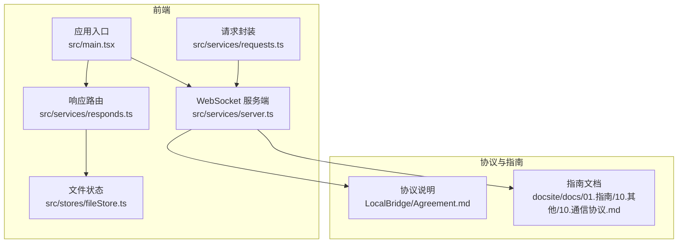
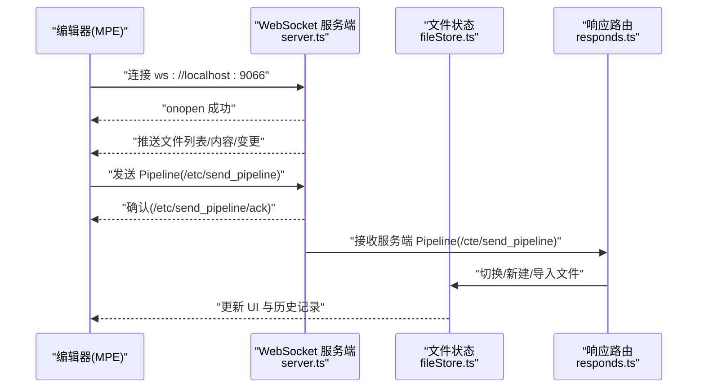
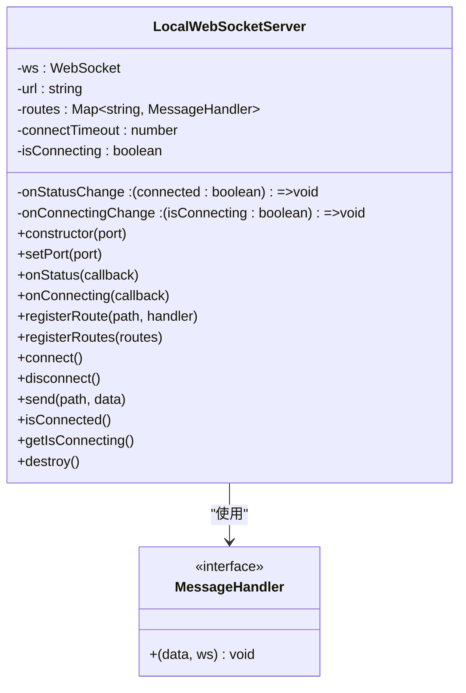
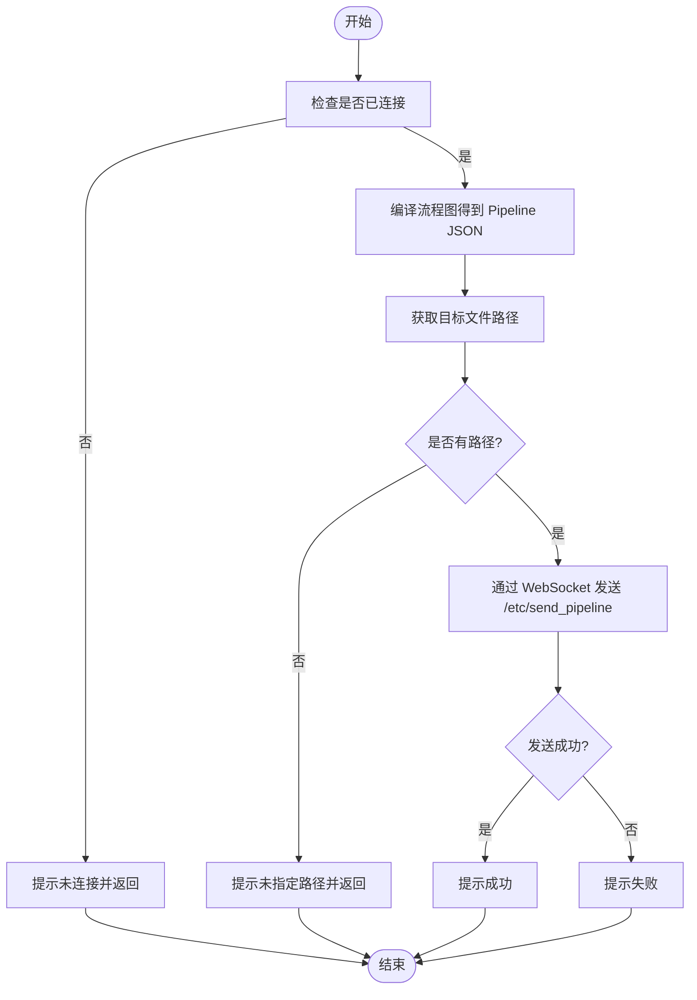
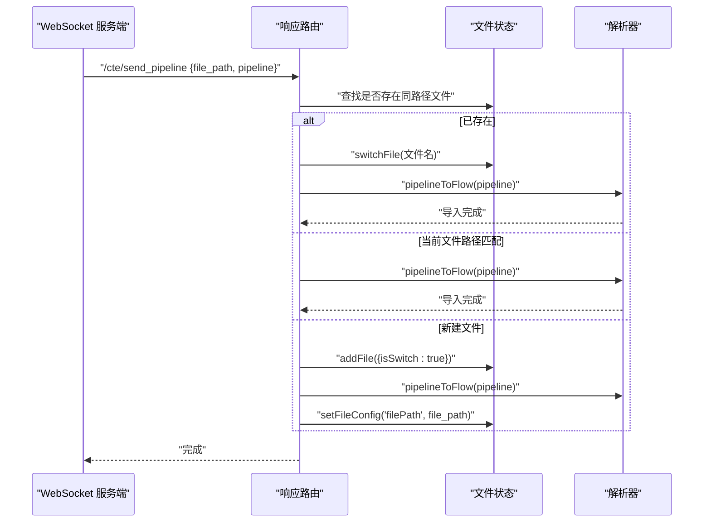
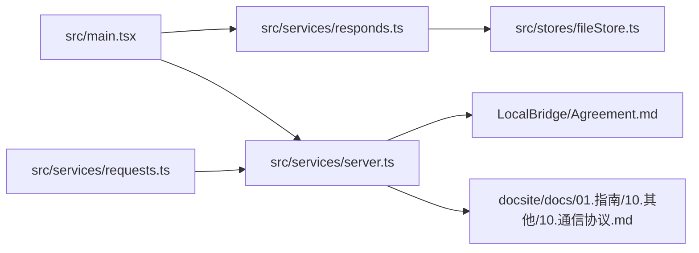

# LocalBridge 通信协议

<cite>
**本文引用的文件**
- [LocalBridge/Agreement.md](file://LocalBridge/Agreement.md)
- [docsite/docs/01.指南/10.其他/10.通信协议.md](file://docsite/docs/01.指南/10.其他/10.通信协议.md)
- [src/services/server.ts](file://src/services/server.ts)
- [src/services/requests.ts](file://src/services/requests.ts)
- [src/services/responds.ts](file://src/services/responds.ts)
- [src/services/type.ts](file://src/services/type.ts)
- [src/services/index.ts](file://src/services/index.ts)
- [src/main.tsx](file://src/main.tsx)
- [src/stores/fileStore.ts](file://src/stores/fileStore.ts)
</cite>

## 目录
1. [简介](#简介)
2. [项目结构](#项目结构)
3. [核心组件](#核心组件)
4. [架构总览](#架构总览)
5. [详细组件分析](#详细组件分析)
6. [依赖关系分析](#依赖关系分析)
7. [性能考量](#性能考量)
8. [故障排查指南](#故障排查指南)
9. [结论](#结论)
10. [附录](#附录)

## 简介
本文件系统性梳理 LocalBridge（简称 LB）通信协议，覆盖连接管理、消息规范、文件协议、日志协议以及前端 WebSocket 服务端实现。文档同时结合仓库内的协议说明与前端实现，帮助开发者理解并正确集成本地服务与前端编辑器之间的双向通信。

## 项目结构
围绕 LocalBridge 通信协议的相关文件分布如下：
- 协议说明：LocalBridge/Agreement.md（本地文件协议、日志协议、WebSocket API 路由）
- 指南文档：docsite/docs/01.指南/10.其他/10.通信协议.md（MPE 侧通信协议与示例）
- 前端 WebSocket 服务端：src/services/server.ts（连接、消息路由、发送、状态管理）
- 前端请求封装：src/services/requests.ts（主动发送 Pipeline）
- 前端响应路由：src/services/responds.ts（接收服务端 Pipeline 并导入编辑器）
- 类型定义：src/services/type.ts（消息处理器与路由接口）
- 服务导出入口：src/services/index.ts
- 应用初始化：src/main.tsx（注册响应路由与初始化）
- 文件状态管理：src/stores/fileStore.ts（文件标签页与路径配置）

图表来源
- [src/main.tsx](file://src/main.tsx#L1-L23)
- [src/services/server.ts](file://src/services/server.ts#L1-L214)
- [src/services/requests.ts](file://src/services/requests.ts#L1-L46)
- [src/services/responds.ts](file://src/services/responds.ts#L1-L69)
- [src/stores/fileStore.ts](file://src/stores/fileStore.ts#L1-L255)
- [LocalBridge/Agreement.md](file://LocalBridge/Agreement.md#L1-L289)
- [docsite/docs/01.指南/10.其他/10.通信协议.md](file://docsite/docs/01.指南/10.其他/10.通信协议.md#L1-L216)

章节来源
- [src/main.tsx](file://src/main.tsx#L1-L23)
- [src/services/server.ts](file://src/services/server.ts#L1-L214)
- [src/services/requests.ts](file://src/services/requests.ts#L1-L46)
- [src/services/responds.ts](file://src/services/responds.ts#L1-L69)
- [src/stores/fileStore.ts](file://src/stores/fileStore.ts#L1-L255)
- [LocalBridge/Agreement.md](file://LocalBridge/Agreement.md#L1-L289)
- [docsite/docs/01.指南/10.其他/10.通信协议.md](file://docsite/docs/01.指南/10.其他/10.通信协议.md#L1-L216)

## 核心组件
- WebSocket 服务端（LocalWebSocketServer）
  - 负责连接建立、断开、消息分发、超时控制、状态回调与发送消息。
  - 默认端口 9066，连接超时 3 秒，不自动重连。
- 请求封装（sendCompiledPipeline）
  - 将当前流程图编译为 Pipeline JSON，并通过 WebSocket 发送到本地服务。
- 响应路由（registerRespondRoutes）
  - 注册服务端到编辑器的消息路由，接收 Pipeline 并导入编辑器，支持切换文件、新建文件、设置文件路径等。
- 文件状态（useFileStore）
  - 维护文件标签页、文件名、文件路径配置、拖拽排序、切换与新增删除等。
- 协议与指南
  - LocalBridge/Agreement.md 提供本地文件协议、日志协议与 WebSocket API 路由。
  - docsite/docs/01.指南/10.其他/10.通信协议.md 提供 MPE 侧通信协议与最小化服务端示例。

章节来源
- [src/services/server.ts](file://src/services/server.ts#L1-L214)
- [src/services/requests.ts](file://src/services/requests.ts#L1-L46)
- [src/services/responds.ts](file://src/services/responds.ts#L1-L69)
- [src/stores/fileStore.ts](file://src/stores/fileStore.ts#L1-L255)
- [LocalBridge/Agreement.md](file://LocalBridge/Agreement.md#L1-L289)
- [docsite/docs/01.指南/10.其他/10.通信协议.md](file://docsite/docs/01.指南/10.其他/10.通信协议.md#L1-L216)

## 架构总览
LocalBridge 通信架构以 WebSocket 为基础，采用“编辑器 → 本地服务”和“本地服务 → 编辑器”的双向消息通道，配合前端路由注册与状态管理，实现文件与 Pipeline 的双向同步。

图表来源
- [src/services/server.ts](file://src/services/server.ts#L57-L134)
- [src/services/responds.ts](file://src/services/responds.ts#L1-L69)
- [src/stores/fileStore.ts](file://src/stores/fileStore.ts#L147-L217)
- [docsite/docs/01.指南/10.其他/10.通信协议.md](file://docsite/docs/01.指南/10.其他/10.通信协议.md#L114-L213)

## 详细组件分析

### WebSocket 服务端（LocalWebSocketServer）
- 连接管理
  - 默认地址 ws://localhost:9066，连接超时 3 秒，不自动重连。
  - 支持 onStatus/onConnecting 回调，维护 isConnecting 状态。
- 消息路由
  - 通过 Map 存储 path → handler，onmessage 解析 JSON 并分发。
  - send(path, data) 将 {path, data} 序列化后发送。
- 生命周期
  - connect()/disconnect()/destroy() 管理连接与资源清理。
- 与协议的映射
  - 协议中约定的路由命名与实际前端实现存在差异（例如 /etc/send_pipeline 与 /cte/send_pipeline），详见“依赖关系分析”。

图表来源
- [src/services/server.ts](file://src/services/server.ts#L1-L214)
- [src/services/type.ts](file://src/services/type.ts#L1-L9)

章节来源
- [src/services/server.ts](file://src/services/server.ts#L1-L214)
- [src/services/type.ts](file://src/services/type.ts#L1-L9)

### 请求封装（sendCompiledPipeline）
- 功能
  - 编译当前流程图为 Pipeline JSON，拼装 {file_path, pipeline}，通过 WebSocket 发送到本地服务。
  - 若未指定 file_path，则从当前文件配置中获取。
- 错误处理
  - 未连接、未指定路径、发送失败时均提示错误。

图表来源
- [src/services/requests.ts](file://src/services/requests.ts#L1-L46)

章节来源
- [src/services/requests.ts](file://src/services/requests.ts#L1-L46)

### 响应路由（registerRespondRoutes）
- 功能
  - 注册 /cte/send_pipeline 路由，接收服务端发送的 Pipeline。
  - 若目标文件已存在或当前文件路径匹配，则切换并导入；否则新建文件并导入，最后设置文件路径配置。
- 与文件状态的交互
  - 使用 useFileStore 切换文件、新增文件、设置文件配置、替换 Flow 等。

图表来源
- [src/services/responds.ts](file://src/services/responds.ts#L1-L69)
- [src/stores/fileStore.ts](file://src/stores/fileStore.ts#L147-L217)

章节来源
- [src/services/responds.ts](file://src/services/responds.ts#L1-L69)
- [src/stores/fileStore.ts](file://src/stores/fileStore.ts#L147-L217)

### 协议与实现对照
- 协议来源
  - LocalBridge/Agreement.md：定义了 /lte/*（LB→MPE）、/etl/*（MPE→LB）、/ack/* 确认消息与 /error 错误消息等路由。
  - docsite/docs/01.指南/10.其他/10.通信协议.md：定义了 /etc/send_pipeline（MPE→LB）与 /cte/send_pipeline（LB→MPE）等路由。
- 实际实现
  - 前端请求封装使用的是 /etc/send_pipeline，响应路由处理的是 /cte/send_pipeline。
  - 两者与协议中的 /etl/*、/lte/* 命名不一致，但语义一致（编辑器→本地服务 vs 本地服务→编辑器）。

章节来源
- [LocalBridge/Agreement.md](file://LocalBridge/Agreement.md#L49-L55)
- [docsite/docs/01.指南/10.其他/10.通信协议.md](file://docsite/docs/01.指南/10.其他/10.通信协议.md#L106-L113)
- [src/services/requests.ts](file://src/services/requests.ts#L1-L46)
- [src/services/responds.ts](file://src/services/responds.ts#L1-L69)

## 依赖关系分析
- 入口初始化
  - src/main.tsx 中注册响应路由并初始化 WebSocket 服务。
- 组件耦合
  - LocalWebSocketServer 与 MessageHandler 接口解耦，便于扩展路由。
  - 响应路由依赖文件状态管理，实现文件切换与导入。
- 协议依赖
  - 协议文件与指南文档共同定义了消息格式与路由，前端实现需与之对齐。

图表来源
- [src/main.tsx](file://src/main.tsx#L1-L23)
- [src/services/server.ts](file://src/services/server.ts#L1-L214)
- [src/services/requests.ts](file://src/services/requests.ts#L1-L46)
- [src/services/responds.ts](file://src/services/responds.ts#L1-L69)
- [src/stores/fileStore.ts](file://src/stores/fileStore.ts#L1-L255)
- [LocalBridge/Agreement.md](file://LocalBridge/Agreement.md#L1-L289)
- [docsite/docs/01.指南/10.其他/10.通信协议.md](file://docsite/docs/01.指南/10.其他/10.通信协议.md#L1-L216)

章节来源
- [src/main.tsx](file://src/main.tsx#L1-L23)
- [src/services/server.ts](file://src/services/server.ts#L1-L214)
- [src/services/requests.ts](file://src/services/requests.ts#L1-L46)
- [src/services/responds.ts](file://src/services/responds.ts#L1-L69)
- [src/stores/fileStore.ts](file://src/stores/fileStore.ts#L1-L255)
- [LocalBridge/Agreement.md](file://LocalBridge/Agreement.md#L1-L289)
- [docsite/docs/01.指南/10.其他/10.通信协议.md](file://docsite/docs/01.指南/10.其他/10.通信协议.md#L1-L216)

## 性能考量
- 连接与消息处理
  - 连接超时 3 秒，避免长时间阻塞 UI；消息解析与路由分发为 O(1) 查找，适合高频消息。
- 文件导入
  - 导入 Pipeline 时涉及 DOM 状态更新与历史记录初始化，建议在批量导入时减少不必要的重绘。
- 日志推送
  - 协议支持日志推送，前端可根据配置选择是否接收，避免在调试之外场景产生额外流量。

[本节为通用指导，不直接分析具体文件]

## 故障排查指南
- 连接失败
  - 检查本地服务是否运行于 ws://localhost:9066；确认端口占用与防火墙设置。
  - 前端会在连接超时、错误与关闭时分别发出提示，可据此定位问题。
- 发送失败
  - 确认已连接且路径有效；查看前端错误提示与控制台日志。
- 导入失败
  - 检查服务端是否正确返回确认消息；核对文件路径与文件名冲突情况。
- 文件状态异常
  - 若文件名重复或路径不一致，前端会给出警告；可在文件面板中修正。

章节来源
- [src/services/server.ts](file://src/services/server.ts#L57-L134)
- [src/services/requests.ts](file://src/services/requests.ts#L1-L46)
- [src/services/responds.ts](file://src/services/responds.ts#L1-L69)
- [src/stores/fileStore.ts](file://src/stores/fileStore.ts#L118-L145)

## 结论
LocalBridge 通信协议以 WebSocket 为基础，通过明确的消息格式与路由命名，实现了编辑器与本地服务之间的稳定双向通信。前端实现了连接管理、消息路由与文件导入逻辑，协议与指南文档提供了清晰的 API 规范。实际开发中需关注路由命名一致性与错误处理，确保用户体验与稳定性。

[本节为总结，不直接分析具体文件]

## 附录

### 协议要点摘要
- 连接管理
  - 协议：WebSocket；默认端口：9066；连接超时：3 秒；不自动重连。
- 消息规范
  - 统一 JSON 结构：{path, data}；路由命名约定：/lte/*（LB→MPE）、/etl/*（MPE→LB）、/ack/*（确认）、/error（错误）。
- 本地文件协议
  - 根目录扫描规则、文件列表推送、文件内容返回、文件变化通知、错误码与错误消息格式。
- 日志协议
  - CLI 日志格式与 /lte/log 推送消息格式。

章节来源
- [LocalBridge/Agreement.md](file://LocalBridge/Agreement.md#L7-L21)
- [LocalBridge/Agreement.md](file://LocalBridge/Agreement.md#L36-L55)
- [LocalBridge/Agreement.md](file://LocalBridge/Agreement.md#L60-L105)
- [LocalBridge/Agreement.md](file://LocalBridge/Agreement.md#L134-L176)
- [LocalBridge/Agreement.md](file://LocalBridge/Agreement.md#L250-L289)

### 前端实现要点
- 初始化
  - 在应用启动时注册响应路由并初始化 WebSocket。
- 发送 Pipeline
  - 通过 sendCompiledPipeline 发送 /etc/send_pipeline。
- 接收 Pipeline
  - 通过 registerRespondRoutes 注册 /cte/send_pipeline，导入并切换文件。
- 文件状态
  - 使用 useFileStore 维护文件标签页、路径配置与切换逻辑。

章节来源
- [src/main.tsx](file://src/main.tsx#L1-L23)
- [src/services/requests.ts](file://src/services/requests.ts#L1-L46)
- [src/services/responds.ts](file://src/services/responds.ts#L1-L69)
- [src/stores/fileStore.ts](file://src/stores/fileStore.ts#L147-L217)