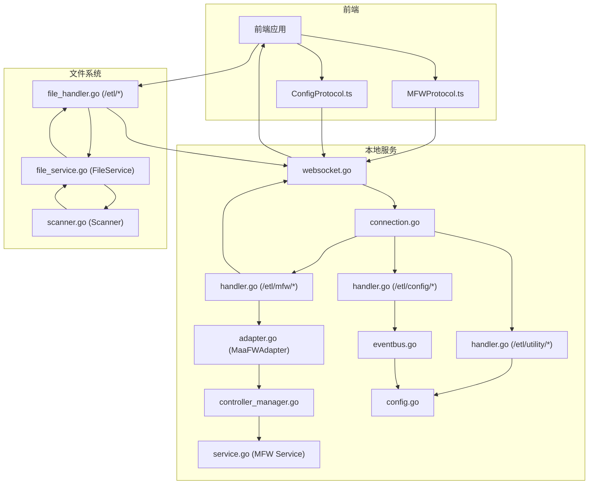
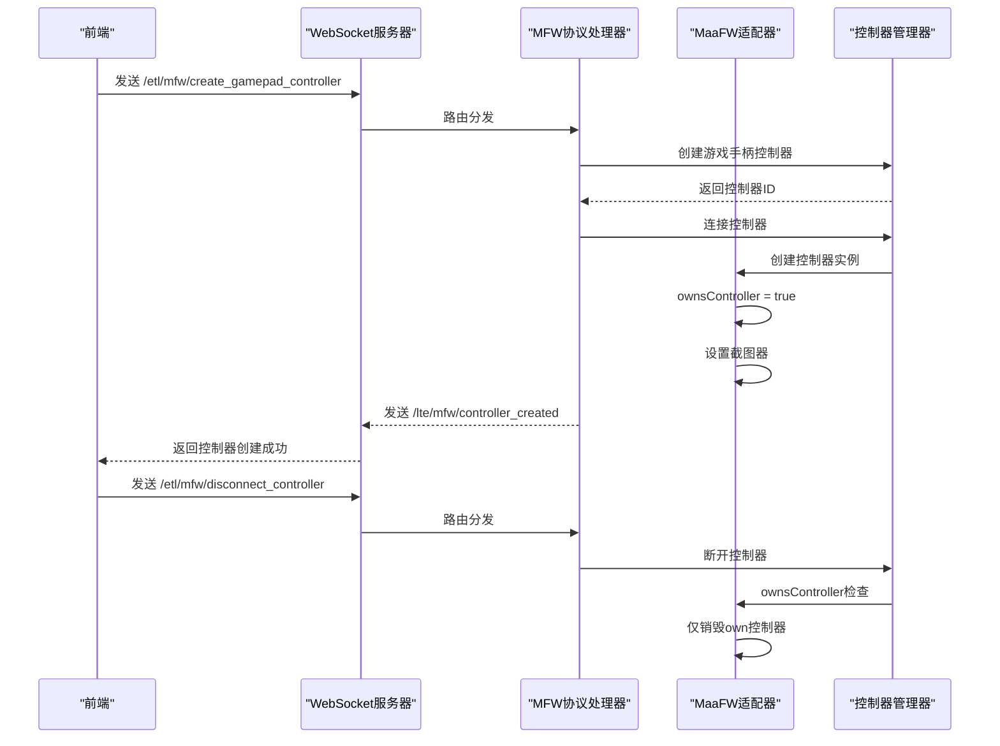
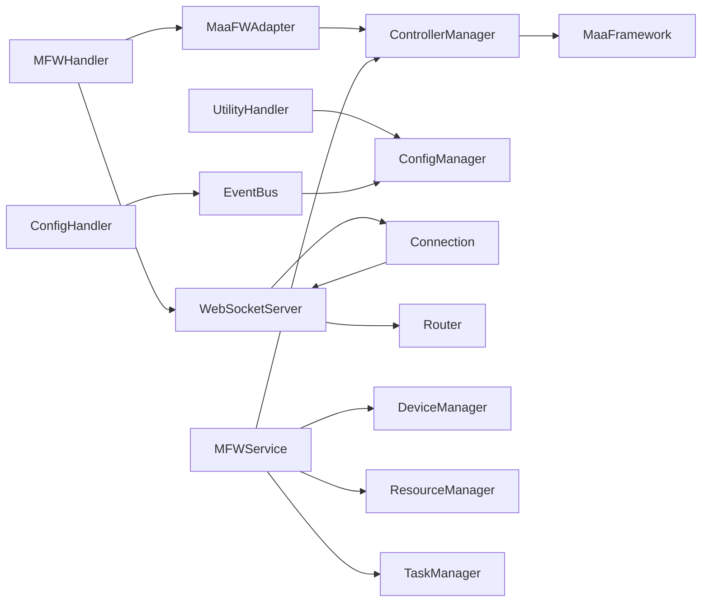

# LocalBridge 通信协议

<cite>
**本文引用的文件**
- [LocalBridge/internal/protocol/mfw/handler.go](file://LocalBridge/internal/protocol/mfw/handler.go)
- [LocalBridge/internal/mfw/adapter.go](file://LocalBridge/internal/mfw/adapter.go)
- [LocalBridge/internal/mfw/controller_manager.go](file://LocalBridge/internal/mfw/controller_manager.go)
- [LocalBridge/internal/server/websocket.go](file://LocalBridge/internal/server/websocket.go)
- [LocalBridge/internal/server/connection.go](file://LocalBridge/internal/server/connection.go)
- [LocalBridge/internal/mfw/service.go](file://LocalBridge/internal/mfw/service.go)
- [LocalBridge/internal/protocol/file/file_handler.go](file://LocalBridge/internal/protocol/file/file_handler.go)
- [LocalBridge/internal/service/file/file_service.go](file://LocalBridge/internal/service/file/file_service.go)
- [LocalBridge/internal/service/file/scanner.go](file://LocalBridge/internal/service/file/scanner.go)
- [LocalBridge/internal/protocol/utility/handler.go](file://LocalBridge/internal/protocol/utility/handler.go)
- [LocalBridge/internal/protocol/config/handler.go](file://LocalBridge/internal/protocol/config/handler.go)
- [LocalBridge/internal/eventbus/eventbus.go](file://LocalBridge/internal/eventbus/eventbus.go)
- [LocalBridge/internal/config/config.go](file://LocalBridge/internal/config/config.go)
- [LocalBridge/pkg/models/file.go](file://LocalBridge/pkg/models/file.go)
- [LocalBridge/pkg/models/message.go](file://LocalBridge/pkg/models/message.go)
- [src/services/protocols/MFWProtocol.ts](file://src/services/protocols/MFWProtocol.ts)
- [src/services/protocols/ConfigProtocol.ts](file://src/services/protocols/ConfigProtocol.ts)
- [docsite/docs/01.指南/100.其他/10.通信协议.md](file://docsite/docs/01.指南/100.其他/10.通信协议.md)
</cite>

## 更新摘要
**变更内容**
- 新增控制器所有权跟踪机制，通过ownsController字段区分适配器创建的控制器和外部借用的控制器
- 改进控制器生命周期管理，支持共享控制器的正确资源管理
- 增强SetController方法的控制器所有权处理逻辑
- 完善调试服务中控制器借用场景的资源清理机制

## 目录
1. [简介](#简介)
2. [项目结构](#项目结构)
3. [核心组件](#核心组件)
4. [架构总览](#架构总览)
5. [详细组件分析](#详细组件分析)
6. [依赖关系分析](#依赖关系分析)
7. [性能考量](#性能考量)
8. [故障排查指南](#故障排查指南)
9. [结论](#结论)
10. [附录](#附录)

## 简介
本文档系统性梳理 LocalBridge（简称 LB）通信协议，覆盖连接管理、消息规范、文件协议、日志协议、事件总线、配置系统、CLI 应用以及前端 WebSocket 服务端实现。本次更新重点新增控制器所有权跟踪机制，通过ownsController字段区分适配器创建的控制器和外部借用的控制器，改进了控制器生命周期管理，提升了系统的资源管理和安全性。

## 项目结构
围绕控制器所有权跟踪和生命周期管理的相关文件分布如下：
- MFW协议处理器：LocalBridge/internal/protocol/mfw/handler.go
- 适配器层：LocalBridge/internal/mfw/adapter.go
- 控制器管理器：LocalBridge/internal/mfw/controller_manager.go
- WebSocket服务器：LocalBridge/internal/server/websocket.go
- 连接管理：LocalBridge/internal/server/connection.go
- MFW服务：LocalBridge/internal/mfw/service.go
- 文件协议处理器：LocalBridge/internal/protocol/file/file_handler.go
- 文件服务：LocalBridge/internal/service/file/file_service.go
- 文件扫描器：LocalBridge/internal/service/file/scanner.go
- Utility协议处理器：LocalBridge/internal/protocol/utility/handler.go
- 配置协议处理器：LocalBridge/internal/protocol/config/handler.go
- 事件总线：LocalBridge/internal/eventbus/eventbus.go
- 配置管理：LocalBridge/internal/config/config.go
- 模型定义：LocalBridge/pkg/models/file.go, LocalBridge/pkg/models/message.go
- 前端协议：src/services/protocols/MFWProtocol.ts, src/services/protocols/ConfigProtocol.ts

**Diagram sources**
- [LocalBridge/internal/protocol/mfw/handler.go](file://LocalBridge/internal/protocol/mfw/handler.go#L1-L694)
- [LocalBridge/internal/mfw/adapter.go](file://LocalBridge/internal/mfw/adapter.go#L1-L813)
- [LocalBridge/internal/mfw/controller_manager.go](file://LocalBridge/internal/mfw/controller_manager.go#L1-L702)
- [LocalBridge/internal/server/websocket.go](file://LocalBridge/internal/server/websocket.go#L1-L179)
- [LocalBridge/internal/server/connection.go](file://LocalBridge/internal/server/connection.go#L1-L96)
- [LocalBridge/internal/mfw/service.go](file://LocalBridge/internal/mfw/service.go#L1-L193)
- [LocalBridge/internal/protocol/file/file_handler.go](file://LocalBridge/internal/protocol/file/file_handler.go#L1-L310)
- [LocalBridge/internal/service/file/file_service.go](file://LocalBridge/internal/service/file/file_service.go#L1-L250)
- [LocalBridge/internal/service/file/scanner.go](file://LocalBridge/internal/service/file/scanner.go#L1-L177)
- [LocalBridge/internal/protocol/utility/handler.go](file://LocalBridge/internal/protocol/utility/handler.go#L1-L693)
- [LocalBridge/internal/protocol/config/handler.go](file://LocalBridge/internal/protocol/config/handler.go#L1-L204)
- [LocalBridge/internal/eventbus/eventbus.go](file://LocalBridge/internal/eventbus/eventbus.go#L1-L83)
- [LocalBridge/internal/config/config.go](file://LocalBridge/internal/config/config.go#L1-L221)
- [src/services/protocols/MFWProtocol.ts](file://src/services/protocols/MFWProtocol.ts#L1-L574)
- [src/services/protocols/ConfigProtocol.ts](file://src/services/protocols/ConfigProtocol.ts#L1-L195)

## 核心组件
- **MFW协议处理器（MFWHandler）**
  - 路由前缀：/etl/mfw/
  - 支持设备管理、控制器管理、任务管理、资源管理等功能
  - 新增游戏手柄控制器端点：/etl/mfw/create_gamepad_controller、/etl/mfw/controller_click_key、/etl/mfw/controller_touch_gamepad
- **适配器层（MaaFWAdapter）**
  - **新增** 控制器所有权跟踪：ownsController字段区分适配器创建和外部借用的控制器
  - 支持控制器创建、设置、连接、断开等完整生命周期管理
  - 提供SetController方法支持外部控制器借用场景
- **Utility协议处理器（UtilityHandler）**
  - 路由前缀：/etl/utility/
  - 新增日志目录访问功能：/etl/utility/open_log
  - 支持OCR识别、图片路径解析等辅助功能
- **配置协议处理器（ConfigHandler）**
  - 路由前缀：/etl/config/
  - 支持配置获取、设置、重载等功能
  - 增强配置重载通知：通过事件总线发布配置重载事件
- **事件总线（EventBus）**
  - 全局事件总线实例，支持同步和异步事件发布
  - 事件类型：config.reload、file.scan.completed、file.changed等
  - 线程安全的事件订阅和发布机制
- **WebSocket服务器（WebSocketServer）**
  - 默认端口：9066
  - HTTP超时设置：ReadTimeout 10秒，WriteTimeout 10秒
  - 支持连接注册、注销和广播功能
- **连接管理（Connection）**
  - 发送队列容量：256
  - 支持消息发送、读取和写入协程管理
- **MFW服务（Service）**
  - 管理设备、控制器、资源、任务四个子系统
  - 支持服务初始化、关闭和状态检查

**Section sources**
- [LocalBridge/internal/protocol/mfw/handler.go](file://LocalBridge/internal/protocol/mfw/handler.go#L24-L99)
- [LocalBridge/internal/mfw/adapter.go](file://LocalBridge/internal/mfw/adapter.go#L25-L50)
- [LocalBridge/internal/protocol/utility/handler.go](file://LocalBridge/internal/protocol/utility/handler.go#L24-L41)
- [LocalBridge/internal/protocol/config/handler.go](file://LocalBridge/internal/protocol/config/handler.go#L1-L204)
- [LocalBridge/internal/eventbus/eventbus.go](file://LocalBridge/internal/eventbus/eventbus.go#L16-L83)
- [LocalBridge/internal/server/websocket.go](file://LocalBridge/internal/server/websocket.go#L36-L58)
- [LocalBridge/internal/server/connection.go](file://LocalBridge/internal/server/connection.go#L13-L29)
- [LocalBridge/internal/mfw/service.go](file://LocalBridge/internal/mfw/service.go#L16-L34)

## 架构总览
控制器所有权跟踪机制的交互流程如下：
- 适配器创建控制器时ownsController设为true，表示完全拥有该控制器
- 外部系统通过SetController借用控制器时ownsController设为false
- 适配器销毁时仅销毁ownsController为true的控制器，避免误删外部控制器
- 调试服务中使用SetController进行控制器借用，确保资源正确管理

**Diagram sources**
- [LocalBridge/internal/protocol/mfw/handler.go](file://LocalBridge/internal/protocol/mfw/handler.go#L266-L303)
- [LocalBridge/internal/mfw/adapter.go](file://LocalBridge/internal/mfw/adapter.go#L109-L111)
- [LocalBridge/internal/mfw/adapter.go](file://LocalBridge/internal/mfw/adapter.go#L680-L686)

## 详细组件分析

### 适配器层（adapter.go）
- **新增控制器所有权跟踪机制**
  - ownsController字段：true表示适配器创建的控制器，false表示外部借用的控制器
  - 控制器创建时ownsController自动设为true
  - SetController方法将ownsController设为false，表示控制器由外部管理
- **控制器生命周期管理**
  - CreateAdbController：创建ADB控制器，ownsController=true
  - CreateWin32Controller：创建Win32控制器，ownsController=true
  - SetController：设置外部控制器，ownsController=false
  - Destroy：仅销毁ownsController=true的控制器
- **资源清理机制**
  - 适配器销毁时检查ownsController标志，避免误删外部控制器
  - 正确清理截图器引用，防止内存泄漏

**Section sources**
- [LocalBridge/internal/mfw/adapter.go](file://LocalBridge/internal/mfw/adapter.go#L25-L50)
- [LocalBridge/internal/mfw/adapter.go](file://LocalBridge/internal/mfw/adapter.go#L65-L118)
- [LocalBridge/internal/mfw/adapter.go](file://LocalBridge/internal/mfw/adapter.go#L120-L167)
- [LocalBridge/internal/mfw/adapter.go](file://LocalBridge/internal/mfw/adapter.go#L169-L185)
- [LocalBridge/internal/mfw/adapter.go](file://LocalBridge/internal/mfw/adapter.go#L651-L692)

### MFW协议处理器（handler.go）
- **路由前缀**：/etl/mfw/
- **新增游戏手柄控制器端点**
  - /etl/mfw/create_gamepad_controller：创建游戏手柄控制器
  - /etl/mfw/controller_click_key：点击游戏手柄按键
  - /etl/mfw/controller_touch_gamepad：游戏手柄触摸操作
- **控制器管理**
  - 自动连接：创建控制器后自动调用 ConnectController
  - 状态更新：发送 /lte/mfw/controller_status 响应
- **错误处理**：统一的错误响应格式，包含错误代码和详细信息

**Section sources**
- [LocalBridge/internal/protocol/mfw/handler.go](file://LocalBridge/internal/protocol/mfw/handler.go#L51-L77)
- [LocalBridge/internal/protocol/mfw/handler.go](file://LocalBridge/internal/protocol/mfw/handler.go#L266-L303)
- [LocalBridge/internal/protocol/mfw/handler.go](file://LocalBridge/internal/protocol/mfw/handler.go#L472-L516)

### 控制器管理器（controller_manager.go）
- **控制器实例管理**
  - ControllerInfo结构体：包含控制器ID、类型、连接状态、时间戳等信息
  - 支持ADB、Win32、PlayCover、Gamepad等多种控制器类型
  - 自动连接机制：创建控制器后自动建立连接
- **连接超时检查**
  - 异步连接机制，使用select等待连接完成
  - 10秒超时检测，超时后记录警告日志
  - 连接完成后检查控制器状态
- **非活跃控制器清理**
  - CleanupInactive方法定期清理超时控制器
  - LastActiveAt时间戳跟踪控制器活跃状态
  - 自动销毁控制器实例并释放资源

**Section sources**
- [LocalBridge/internal/mfw/controller_manager.go](file://LocalBridge/internal/mfw/controller_manager.go#L40-L49)
- [LocalBridge/internal/mfw/controller_manager.go](file://LocalBridge/internal/mfw/controller_manager.go#L159-L211)
- [LocalBridge/internal/mfw/controller_manager.go](file://LocalBridge/internal/mfw/controller_manager.go#L214-L264)
- [LocalBridge/internal/mfw/controller_manager.go](file://LocalBridge/internal/mfw/controller_manager.go#L578-L593)

### Utility协议处理器（handler.go）
- **路由前缀**：/etl/utility/
- **新增日志目录访问功能**
  - /etl/utility/open_log：打开日志目录，支持Windows、macOS、Linux
  - 自动检测日志文件是否存在，支持选中文件功能
- **OCR识别功能**
  - /etl/utility/ocr_recognize：基于MaaFramework的OCR识别
  - 支持ROI区域识别，返回文字内容和边界框
- **图片路径解析**
  - /etl/utility/resolve_image_path：解析图片文件路径
  - 在所有image目录中搜索指定文件，返回最新版本

**Section sources**
- [LocalBridge/internal/protocol/utility/handler.go](file://LocalBridge/internal/protocol/utility/handler.go#L24-L65)
- [LocalBridge/internal/protocol/utility/handler.go](file://LocalBridge/internal/protocol/utility/handler.go#L56-L62)
- [LocalBridge/internal/protocol/utility/handler.go](file://LocalBridge/internal/protocol/utility/handler.go#L596-L692)

### 配置协议处理器（handler.go）
- **路由前缀**：/etl/config/
- **配置管理功能**
  - /etl/config/get：获取当前配置
  - /etl/config/set：设置配置项
  - /etl/config/reload：重载配置并发布事件
- **增强配置重载通知**
  - 重载配置后通过事件总线发布 config.reload 事件
  - 异步通知所有订阅者，支持线程安全的事件处理
- **配置更新处理**
  - 支持服务器、文件、日志、MaaFramework等配置项
  - 自动保存配置并返回更新后的配置数据

**Section sources**
- [LocalBridge/internal/protocol/config/handler.go](file://LocalBridge/internal/protocol/config/handler.go#L1-L204)
- [LocalBridge/internal/protocol/config/handler.go](file://LocalBridge/internal/protocol/config/handler.go#L173-L204)

### 事件总线（eventbus.go）
- **全局事件总线**
  - 单例模式，提供全局事件总线实例
  - 支持同步和异步事件发布，确保线程安全
- **事件类型**
  - EventConfigReload：配置重载事件
  - EventFileScanCompleted：文件扫描完成事件
  - EventFileChanged：文件变化事件
  - EventConnectionEstablished：连接建立事件
  - EventConnectionClosed：连接关闭事件
- **事件处理机制**
  - 读写锁保护事件处理器列表
  - 支持事件订阅和取消订阅
  - 异步发布确保不影响主流程性能

**Section sources**
- [LocalBridge/internal/eventbus/eventbus.go](file://LocalBridge/internal/eventbus/eventbus.go#L16-L83)
- [LocalBridge/internal/eventbus/eventbus.go](file://LocalBridge/internal/eventbus/eventbus.go#L37-L56)

### 配置管理（config.go）
- **配置结构**
  - ServerConfig：服务器配置（端口、主机）
  - FileConfig：文件系统配置（根目录、排除规则、扩展名）
  - LogConfig：日志配置（级别、目录、客户端推送）
  - MaaFWConfig：MaaFramework配置（启用、库目录、资源目录）
- **配置功能**
  - 加载配置文件，支持默认值设置
  - 规范化路径处理，支持相对路径转换
  - 保存配置到文件，保持原有格式
- **配置覆盖**
  - 支持命令行参数覆盖配置
  - 动态更新配置并重新规范化

**Section sources**
- [LocalBridge/internal/config/config.go](file://LocalBridge/internal/config/config.go#L13-L46)
- [LocalBridge/internal/config/config.go](file://LocalBridge/internal/config/config.go#L51-L93)
- [LocalBridge/internal/config/config.go](file://LocalBridge/internal/config/config.go#L121-L178)

### 前端配置协议（ConfigProtocol.ts）
- **配置数据结构**
  - BackendConfig：后端配置数据结构
  - ConfigResponse：配置响应数据结构
- **配置协议功能**
  - requestGetConfig：获取配置数据
  - requestSetConfig：设置配置项
  - requestReload：重载配置
- **事件处理**
  - onConfigData：配置数据回调
  - onReload：重载回调
  - 自动消息提示和错误处理

**Section sources**
- [src/services/protocols/ConfigProtocol.ts](file://src/services/protocols/ConfigProtocol.ts#L8-L38)
- [src/services/protocols/ConfigProtocol.ts](file://src/services/protocols/ConfigProtocol.ts#L125-L194)

### WebSocket服务器（websocket.go）
- **服务器配置**
  - 默认端口：9066
  - ReadTimeout：10秒，WriteTimeout：10秒
  - 支持跨域访问（CheckOrigin返回true）
- **连接管理**
  - 连接注册和注销协程
  - 事件总线集成，发布连接建立和关闭事件
  - 广播功能支持向所有连接发送消息
- **HTTP服务器**
  - 基于gorilla/websocket库
  - 支持动态在线服务地址生成

**Section sources**
- [LocalBridge/internal/server/websocket.go](file://LocalBridge/internal/server/websocket.go#L36-L58)
- [LocalBridge/internal/server/websocket.go](file://LocalBridge/internal/server/websocket.go#L75-L93)
- [LocalBridge/internal/server/websocket.go](file://LocalBridge/internal/server/websocket.go#L115-L142)

### 连接管理（connection.go）
- **连接生命周期**
  - 读取协程：处理客户端消息，解析JSON格式
  - 写入协程：异步发送消息到客户端
  - 自动清理：连接断开时关闭发送通道
- **消息处理**
  - JSON序列化和反序列化
  - 发送队列容量限制，避免内存溢出
  - 错误处理和日志记录

**Section sources**
- [LocalBridge/internal/server/connection.go](file://LocalBridge/internal/server/connection.go#L32-L59)
- [LocalBridge/internal/server/connection.go](file://LocalBridge/internal/server/connection.go#L79-L95)

### MFW服务（service.go）
- **服务初始化**
  - MaaFramework框架初始化
  - 支持中文路径处理（Windows系统）
  - 日志目录配置和路径转换
- **服务管理**
  - Shutdown方法优雅关闭所有子系统
  - StopAll任务停止和资源卸载
  - DisconnectAll控制器断开和清理
- **状态检查**
  - IsInitialized方法检查服务状态
  - 线程安全的状态访问

**Section sources**
- [LocalBridge/internal/mfw/service.go](file://LocalBridge/internal/mfw/service.go#L37-L133)
- [LocalBridge/internal/mfw/service.go](file://LocalBridge/internal/mfw/service.go#L136-L165)
- [LocalBridge/internal/mfw/service.go](file://LocalBridge/internal/mfw/service.go#L188-L193)

### 前端协议（MFWProtocol.ts）
- **游戏手柄控制器API**
  - createGamepadController：创建游戏手柄控制器
  - disconnectController：断开控制器连接
  - requestScreencap：请求截图功能
- **连接状态管理**
  - 自动清除控制器状态（连接断开时）
  - 记录最后一次连接设备信息
  - 连接状态变化事件处理
- **回调机制**
  - screencapCallbacks：截图结果回调
  - ocrCallbacks：OCR识别回调
  - imagePathCallbacks：图片路径解析回调

**Section sources**
- [src/services/protocols/MFWProtocol.ts](file://src/services/protocols/MFWProtocol.ts#L392-L417)
- [src/services/protocols/MFWProtocol.ts](file://src/services/protocols/MFWProtocol.ts#L422-L431)
- [src/services/protocols/MFWProtocol.ts](file://src/services/protocols/MFWProtocol.ts#L43-L54)

## 依赖关系分析
- MFW协议处理器依赖控制器管理器进行控制器操作，负责消息路由和响应构造
- **新增** 适配器层提供控制器所有权跟踪机制，区分适配器创建和外部借用的控制器
- Utility协议处理器依赖配置管理获取日志目录配置，支持跨平台日志目录访问
- 配置协议处理器通过事件总线发布配置重载事件，实现松耦合的通知机制
- 事件总线提供全局事件管理，支持异步事件处理
- WebSocket服务器提供连接管理，连接管理器负责消息发送和接收
- MFW服务协调各个子系统的初始化和关闭
- 前端协议通过WebSocket与本地服务通信，实现控制器管理功能

**Diagram sources**
- [LocalBridge/internal/protocol/mfw/handler.go](file://LocalBridge/internal/protocol/mfw/handler.go#L12-L21)
- [LocalBridge/internal/mfw/adapter.go](file://LocalBridge/internal/mfw/adapter.go#L13-L17)
- [LocalBridge/internal/mfw/controller_manager.go](file://LocalBridge/internal/mfw/controller_manager.go#L13-L17)
- [LocalBridge/internal/protocol/utility/handler.go](file://LocalBridge/internal/protocol/utility/handler.go#L15-L22)
- [LocalBridge/internal/protocol/config/handler.go](file://LocalBridge/internal/protocol/config/handler.go#L1-L10)
- [LocalBridge/internal/eventbus/eventbus.go](file://LocalBridge/internal/eventbus/eventbus.go#L16-L27)
- [LocalBridge/internal/server/websocket.go](file://LocalBridge/internal/server/websocket.go#L36-L46)
- [LocalBridge/internal/server/connection.go](file://LocalBridge/internal/server/connection.go#L13-L19)
- [LocalBridge/internal/mfw/service.go](file://LocalBridge/internal/mfw/service.go#L16-L23)

## 性能考量
- **连接超时**：控制器连接超时设置为10秒，平衡了响应速度和稳定性
- **内存管理**：**新增** 控制器所有权跟踪机制，避免误删外部控制器导致的资源泄漏
- **消息队列**：连接发送队列容量256，防止消息积压导致内存占用过高
- **HTTP超时**：ReadTimeout和WriteTimeout均为10秒，确保服务器响应及时性
- **资源清理**：**改进** 适配器销毁时仅清理ownsController为true的控制器，提高资源管理效率
- **事件处理**：事件总线支持异步发布，避免阻塞主流程
- **日志访问**：跨平台日志目录访问，减少手动查找时间

## 故障排查指南
- **游戏手柄控制器创建失败**
  - 现象：/error响应，包含"ViGEm驱动未安装"错误
  - 处理：安装ViGEm Bus Driver后重试
- **控制器连接超时**
  - 现象：日志显示"控制器连接超时！"
  - 处理：检查目标设备是否正常，重新创建控制器
- **连接断开自动清理**
  - 现象：长时间无操作后控制器自动断开
  - 处理：重新创建控制器或调整非活跃超时时间
- **WebSocket连接异常**
  - 现象：连接建立后立即断开
  - 处理：检查端口占用情况，确认防火墙设置
- **日志目录访问失败**
  - 现象：/lte/utility/log_opened响应中success=false
  - 处理：检查日志目录配置，确认目录存在且可访问
- **配置重载通知失败**
  - 现象：配置重载后无事件通知
  - 处理：检查事件总线状态，确认订阅者正常工作
- **控制器资源泄漏**
  - **新增** 现象：外部借用的控制器被意外销毁
  - 处理：检查ownsController标志，确保SetController正确设置为false

**Section sources**
- [LocalBridge/internal/mfw/controller_manager.go](file://LocalBridge/internal/mfw/controller_manager.go#L193-L194)
- [LocalBridge/internal/mfw/controller_manager.go](file://LocalBridge/internal/mfw/controller_manager.go#L246-L247)
- [LocalBridge/internal/mfw/controller_manager.go](file://LocalBridge/internal/mfw/controller_manager.go#L590-L591)
- [LocalBridge/internal/mfw/adapter.go](file://LocalBridge/internal/mfw/adapter.go#L174-L185)
- [LocalBridge/internal/protocol/utility/handler.go](file://LocalBridge/internal/protocol/utility/handler.go#L614-L624)
- [LocalBridge/internal/protocol/config/handler.go](file://LocalBridge/internal/protocol/config/handler.go#L178-L189)

## 结论
本次更新显著增强了LocalBridge的资源管理和安全性，特别是新增的控制器所有权跟踪机制。通过ownsController字段，系统能够准确区分适配器创建的控制器和外部借用的控制器，避免了资源误删和泄漏问题。这一机制在调试服务中得到了充分验证，支持外部系统对控制器的借用和管理。配合原有的连接超时检查、非活跃控制器清理等机制，形成了完整的控制器生命周期管理体系。通过事件总线发布的配置重载通知和增强的Utility协议功能，为用户提供了更加稳定和高效的本地服务体验。

## 附录

### 控制器所有权跟踪机制

#### ownsController字段设计
- **字段定义**：ownsController bool // 是否拥有控制器（true=自己创建的，false=借用的共享控制器）
- **创建场景**：适配器创建控制器时自动设为true
- **借用场景**：外部系统通过SetController设置控制器时设为false
- **销毁规则**：仅销毁ownsController为true的控制器

#### SetController方法实现
- **参数**：ctrl *maa.Controller, ctrlType string, deviceInfo string
- **逻辑**：设置控制器引用，ownsController=false，表示外部管理
- **清理**：如果之前有控制器且ownsController=true，则销毁旧控制器

#### 调试服务中的控制器借用
- **使用场景**：调试会话需要复用现有控制器实例
- **实现方式**：通过SetController方法借用控制器，ownsController=false
- **资源管理**：调试会话销毁时不会影响外部控制器的生命周期

**Section sources**
- [LocalBridge/internal/mfw/adapter.go](file://LocalBridge/internal/mfw/adapter.go#L38-L40)
- [LocalBridge/internal/mfw/adapter.go](file://LocalBridge/internal/mfw/adapter.go#L109-L111)
- [LocalBridge/internal/mfw/adapter.go](file://LocalBridge/internal/mfw/adapter.go#L169-L185)
- [LocalBridge/internal/mfw/debug_service_v2.go](file://LocalBridge/internal/mfw/debug_service_v2.go#L118-L119)

### MFW协议要点摘要
- **连接管理**
  - 协议：WebSocket；默认端口：9066；HTTP超时：10秒
  - 连接超时检查：控制器连接超时10秒
  - 自动清理：非活跃控制器自动断开
- **消息规范**
  - 统一JSON结构：{path, data}
  - 错误响应格式：{code, message, detail}
- **MFW协议**
  - 请求路由（/etl/mfw/*）
    - 设备管理：refresh_adb_devices, refresh_win32_windows
    - 控制器管理：create_gamepad_controller, disconnect_controller
    - 操作控制：controller_click_key, controller_touch_gamepad
  - 响应路由（/lte/mfw/*）
    - 控制器状态：controller_created, controller_status
    - 操作结果：controller_operation_result

**Section sources**
- [docsite/docs/01.指南/100.其他/10.通信协议.md](file://docsite/docs/01.指南/100.其他/10.通信协议.md#L1-L166)
- [LocalBridge/internal/protocol/mfw/handler.go](file://LocalBridge/internal/protocol/mfw/handler.go#L44-L99)

### Utility协议要点摘要
- **日志目录访问**
  - 路由：/etl/utility/open_log
  - 支持平台：Windows（explorer）、macOS（open）、Linux（xdg-open）
  - 功能：打开日志目录，自动选中maa.log文件
- **OCR识别功能**
  - 路由：/etl/utility/ocr_recognize
  - 支持ROI区域识别，返回文字内容和边界框
- **图片路径解析**
  - 路由：/etl/utility/resolve_image_path
  - 在所有image目录中搜索文件，返回最新版本

**Section sources**
- [LocalBridge/internal/protocol/utility/handler.go](file://LocalBridge/internal/protocol/utility/handler.go#L24-L65)
- [LocalBridge/internal/protocol/utility/handler.go](file://LocalBridge/internal/protocol/utility/handler.go#L596-L692)

### 配置协议要点摘要
- **配置管理**
  - 路由：/etl/config/*
  - 功能：获取配置、设置配置、重载配置
  - 支持：服务器、文件、日志、MaaFramework配置
- **事件通知**
  - 路由：/lte/config/reload
  - 功能：配置重载完成通知
  - 机制：通过事件总线发布config.reload事件
- **前端集成**
  - 路由：/lte/config/data
  - 功能：配置数据推送
  - 回调：onConfigData、onReload

**Section sources**
- [LocalBridge/internal/protocol/config/handler.go](file://LocalBridge/internal/protocol/config/handler.go#L1-L204)
- [src/services/protocols/ConfigProtocol.ts](file://src/services/protocols/ConfigProtocol.ts#L125-L194)

### 事件总线要点摘要
- **全局事件总线**
  - 类型：EventBus
  - 方法：Subscribe、Publish、PublishAsync、Unsubscribe
  - 线程安全：读写锁保护
- **事件类型**
  - config.reload：配置重载事件
  - file.scan.completed：文件扫描完成
  - file.changed：文件变化
  - connection.established：连接建立
  - connection.closed：连接关闭
- **使用场景**
  - 配置重载通知
  - 文件系统监控
  - 连接状态管理

**Section sources**
- [LocalBridge/internal/eventbus/eventbus.go](file://LocalBridge/internal/eventbus/eventbus.go#L16-L83)

### 游戏手柄控制器端点

#### 创建游戏手柄控制器
- **路由**：/etl/mfw/create_gamepad_controller
- **请求数据**：
  - hwnd：窗口句柄（可选）
  - gamepad_type：手柄类型（Xbox360或DualShock4）
  - screencap_method：截图方法
- **响应**：/lte/mfw/controller_created
  - success：创建是否成功
  - controller_id：控制器唯一标识
  - type：控制器类型（gamepad）

#### 游戏手柄按键操作
- **路由**：/etl/mfw/controller_click_key
- **请求数据**：
  - controller_id：控制器ID
  - keycode：按键代码
- **响应**：/lte/mfw/controller_operation_result
  - operation：click_key
  - success：操作是否成功

#### 游戏手柄触摸操作
- **路由**：/etl/mfw/controller_touch_gamepad
- **请求数据**：
  - controller_id：控制器ID
  - contact：接触点ID
  - x, y：坐标位置
  - pressure：压力值
  - action：操作类型（down/move/up）
- **响应**：/lte/mfw/controller_operation_result
  - operation：touch_gamepad
  - success：操作是否成功

**Section sources**
- [LocalBridge/internal/protocol/mfw/handler.go](file://LocalBridge/internal/protocol/mfw/handler.go#L266-L303)
- [LocalBridge/internal/protocol/mfw/handler.go](file://LocalBridge/internal/protocol/mfw/handler.go#L472-L490)
- [LocalBridge/internal/protocol/mfw/handler.go](file://LocalBridge/internal/protocol/mfw/handler.go#L492-L516)

### 日志目录访问端点

#### 打开日志目录
- **路由**：/etl/utility/open_log
- **功能**：根据操作系统打开日志目录
- **平台支持**：
  - Windows：使用explorer打开，支持/ select参数选中文件
  - macOS：使用open命令，支持-R参数选中文件
  - Linux：使用xdg-open打开目录
- **响应**：/lte/utility/log_opened
  - success：操作是否成功
  - message：操作结果描述
  - path：日志文件绝对路径

**Section sources**
- [LocalBridge/internal/protocol/utility/handler.go](file://LocalBridge/internal/protocol/utility/handler.go#L596-L692)

### 配置重载通知机制
- **重载请求**：/etl/config/reload
- **事件发布**：通过事件总线发布EventConfigReload事件
- **异步通知**：使用PublishAsync确保不阻塞主流程
- **前端响应**：/lte/config/reload，包含success和message字段
- **订阅机制**：前端通过onReload回调接收通知

**Section sources**
- [LocalBridge/internal/protocol/config/handler.go](file://LocalBridge/internal/protocol/config/handler.go#L173-L204)
- [LocalBridge/internal/eventbus/eventbus.go](file://LocalBridge/internal/eventbus/eventbus.go#L53-L56)
- [src/services/protocols/ConfigProtocol.ts](file://src/services/protocols/ConfigProtocol.ts#L178-L193)

### 连接超时检查机制
- **控制器连接超时**：10秒超时检测，超时后记录警告日志
- **HTTP连接超时**：ReadTimeout和WriteTimeout均为10秒
- **非活跃清理**：定期检查控制器LastActiveAt时间戳
- **自动断开**：超过超时时间的控制器自动断开连接

**Section sources**
- [LocalBridge/internal/mfw/controller_manager.go](file://LocalBridge/internal/mfw/controller_manager.go#L242-L247)
- [LocalBridge/internal/server/websocket.go](file://LocalBridge/internal/server/websocket.go#L78-L80)
- [LocalBridge/internal/mfw/controller_manager.go](file://LocalBridge/internal/mfw/controller_manager.go#L584-L591)

### 自动Agent断开功能
- **服务关闭断开**：Shutdown时自动断开所有控制器
- **非活跃清理**：CleanupInactive方法定期清理超时控制器
- **连接断开事件**：前端自动清除控制器状态
- **资源释放**：断开时销毁控制器实例并释放内存

**Section sources**
- [LocalBridge/internal/mfw/service.go](file://LocalBridge/internal/mfw/service.go#L149-L150)
- [LocalBridge/internal/mfw/controller_manager.go](file://LocalBridge/internal/mfw/controller_manager.go#L596-L611)
- [src/services/protocols/MFWProtocol.ts](file://src/services/protocols/MFWProtocol.ts#L45-L54)

### 文件协议与MFW协议对比
- **文件协议**：/etl/ 前缀，主要用于文件管理
- **MFW协议**：/etl/mfw/ 前缀，主要用于MaaFramework相关操作
- **Utility协议**：/etl/utility/ 前缀，主要用于辅助功能
- **Config协议**：/etl/config/ 前缀，主要用于配置管理
- **路由分离**：避免命名冲突，便于功能模块化
- **响应区分**：文件协议使用/lte/file_*，MFW协议使用/lte/mfw_*，Utility协议使用/lte/utility_*，Config协议使用/lte/config_*

**Section sources**
- [LocalBridge/internal/protocol/file/file_handler.go](file://LocalBridge/internal/protocol/file/file_handler.go#L24-L26)
- [LocalBridge/internal/protocol/mfw/handler.go](file://LocalBridge/internal/protocol/mfw/handler.go#L24-L26)
- [LocalBridge/internal/protocol/utility/handler.go](file://LocalBridge/internal/protocol/utility/handler.go#L39-L41)
- [LocalBridge/internal/protocol/config/handler.go](file://LocalBridge/internal/protocol/config/handler.go#L1-L10)