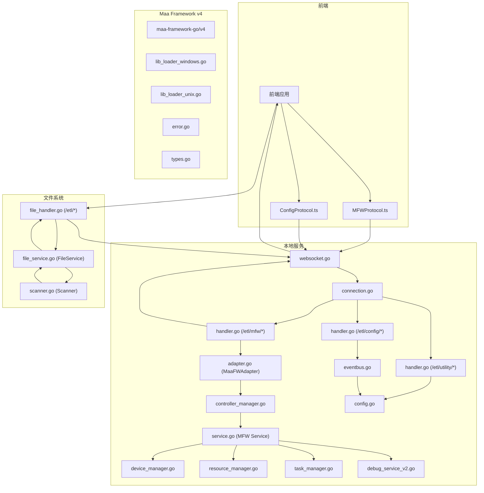
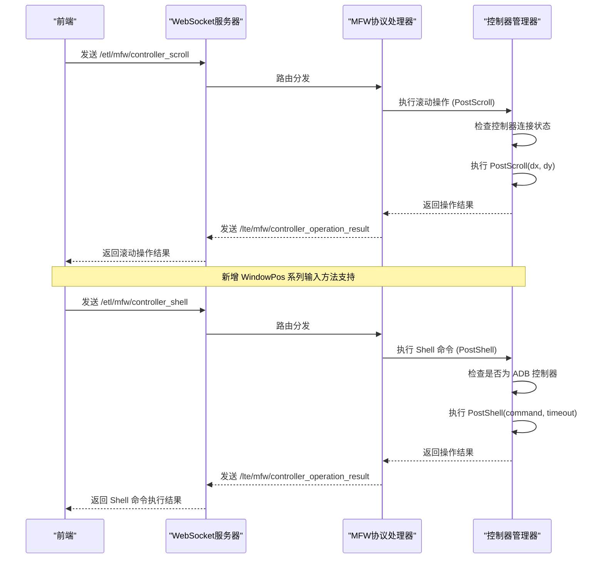
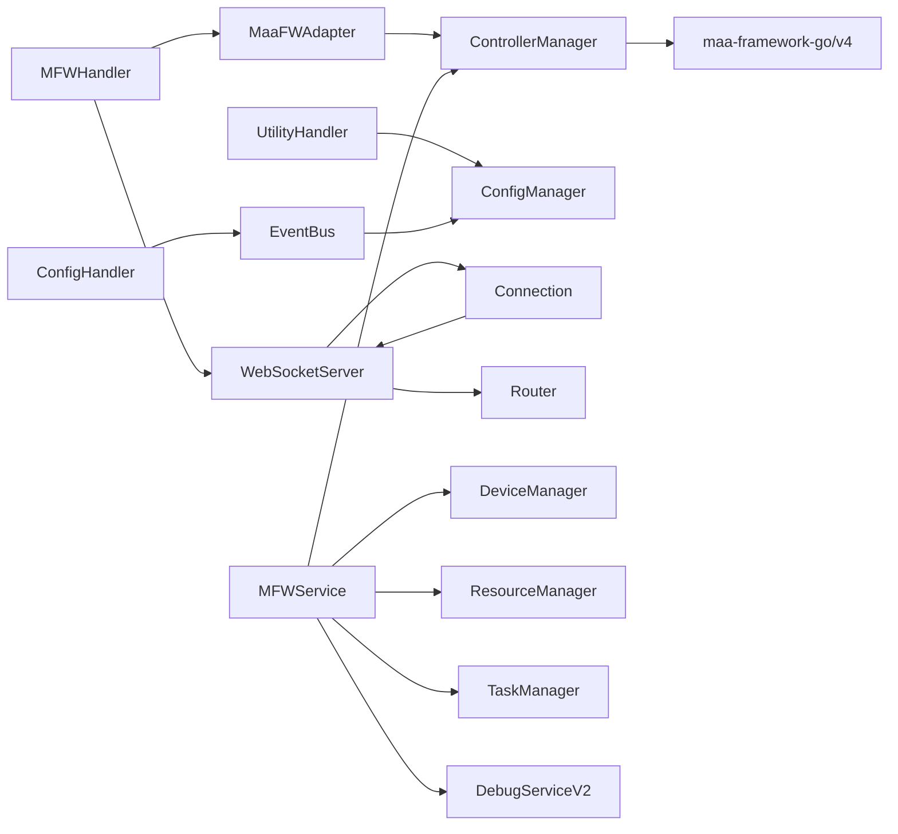

# LocalBridge 通信协议

<cite>
**本文引用的文件**
- [LocalBridge/go.mod](file://LocalBridge/go.mod)
- [LocalBridge/internal/mfw/types.go](file://LocalBridge/internal/mfw/types.go)
- [LocalBridge/internal/mfw/adapter.go](file://LocalBridge/internal/mfw/adapter.go)
- [LocalBridge/internal/mfw/controller_manager.go](file://LocalBridge/internal/mfw/controller_manager.go)
- [LocalBridge/internal/mfw/service.go](file://LocalBridge/internal/mfw/service.go)
- [LocalBridge/internal/mfw/device_manager.go](file://LocalBridge/internal/mfw/device_manager.go)
- [LocalBridge/internal/mfw/resource_manager.go](file://LocalBridge/internal/mfw/resource_manager.go)
- [LocalBridge/internal/mfw/task_manager.go](file://LocalBridge/internal/mfw/task_manager.go)
- [LocalBridge/internal/mfw/error.go](file://LocalBridge/internal/mfw/error.go)
- [LocalBridge/internal/mfw/lib_loader_windows.go](file://LocalBridge/internal/mfw/lib_loader_windows.go)
- [LocalBridge/internal/mfw/lib_loader_unix.go](file://LocalBridge/internal/mfw/lib_loader_unix.go)
- [LocalBridge/internal/mfw/debug_service_v2.go](file://LocalBridge/internal/mfw/debug_service_v2.go)
- [LocalBridge/internal/protocol/mfw/handler.go](file://LocalBridge/internal/protocol/mfw/handler.go)
- [LocalBridge/internal/server/websocket.go](file://LocalBridge/internal/server/websocket.go)
- [LocalBridge/internal/server/connection.go](file://LocalBridge/internal/server/connection.go)
- [LocalBridge/internal/protocol/file/file_handler.go](file://LocalBridge/internal/protocol/file/file_handler.go)
- [LocalBridge/internal/service/file/file_service.go](file://LocalBridge/internal/service/file/file_service.go)
- [LocalBridge/internal/service/file/scanner.go](file://LocalBridge/internal/service/file/scanner.go)
- [LocalBridge/internal/protocol/utility/handler.go](file://LocalBridge/internal/protocol/utility/handler.go)
- [LocalBridge/internal/protocol/config/handler.go](file://LocalBridge/internal/protocol/config/handler.go)
- [LocalBridge/internal/eventbus/eventbus.go](file://LocalBridge/internal/eventbus/eventbus.go)
- [LocalBridge/internal/config/config.go](file://LocalBridge/internal/config/config.go)
- [LocalBridge/pkg/models/file.go](file://LocalBridge/pkg/models/file.go)
- [LocalBridge/pkg/models/message.go](file://LocalBridge/pkg/models/message.go)
- [LocalBridge/pkg/models/mfw.go](file://LocalBridge/pkg/models/mfw.go)
- [src/services/protocols/MFWProtocol.ts](file://src/services/protocols/MFWProtocol.ts)
- [src/services/protocols/ConfigProtocol.ts](file://src/services/protocols/ConfigProtocol.ts)
- [docsite/docs/01.指南/100.其他/10.通信协议.md](file://docsite/docs/01.指南/100.其他/10.通信协议.md)
</cite>

## 更新摘要
**变更内容**
- 新增 WindowPos 系列输入方法支持，包括 Scroll、KeyDown/KeyUp、ClickV2/SwipeV2 等新操作
- 新增 ADB 控制器 Shell 命令执行功能，支持远程命令执行和超时控制
- 更新设备管理器输入方法配置，支持 WindowPos 系列输入方法映射
- 增强控制器操作类型定义，添加新的操作常量
- 完善前端协议支持，新增对应的 API 方法

## 目录
1. [简介](#简介)
2. [项目结构](#项目结构)
3. [核心组件](#核心组件)
4. [架构总览](#架构总览)
5. [详细组件分析](#详细组件分析)
6. [依赖关系分析](#依赖关系分析)
7. [性能考量](#性能考量)
8. [故障排查指南](#故障排查指南)
9. [结论](#结论)
10. [附录](#附录)

## 简介
本文档系统性梳理 LocalBridge（简称 LB）通信协议，覆盖连接管理、消息规范、文件协议、日志协议、事件总线、配置系统、CLI 应用以及前端 WebSocket 服务端实现。本次更新重点反映了应用变更：LocalBridge 控制器管理器新增 WindowPos 系列输入方法支持，包括 Scroll、KeyDown/KeyUp、ClickV2/SwipeV2 等新操作，以及 ADB 控制器的 Shell 命令执行功能。这些新增功能显著增强了 LocalBridge 的输入控制能力和远程管理能力。

## 项目结构
围绕新增的 WindowPos 系列输入方法和 Shell 命令执行功能的相关文件分布如下：
- go.mod 依赖配置：更新到 Maa Framework Go Binding v4
- MFW 协议处理器：LocalBridge/internal/protocol/mfw/handler.go
- 适配器层：LocalBridge/internal/mfw/adapter.go
- 控制器管理器：LocalBridge/internal/mfw/controller_manager.go
- 服务管理器：LocalBridge/internal/mfw/service.go
- 设备管理器：LocalBridge/internal/mfw/device_manager.go
- 资源管理器：LocalBridge/internal/mfw/resource_manager.go
- 任务管理器：LocalBridge/internal/mfw/task_manager.go
- 错误处理：LocalBridge/internal/mfw/error.go
- 动态库加载：LocalBridge/internal/mfw/lib_loader_windows.go, lib_loader_unix.go
- 调试服务：LocalBridge/internal/mfw/debug_service_v2.go
- WebSocket 服务器：LocalBridge/internal/server/websocket.go
- 连接管理：LocalBridge/internal/server/connection.go
- 文件协议处理器：LocalBridge/internal/protocol/file/file_handler.go
- 文件服务：LocalBridge/internal/service/file/file_service.go
- 文件扫描器：LocalBridge/internal/service/file/scanner.go
- Utility 协议处理器：LocalBridge/internal/protocol/utility/handler.go
- 配置协议处理器：LocalBridge/internal/protocol/config/handler.go
- 事件总线：LocalBridge/internal/eventbus/eventbus.go
- 配置管理：LocalBridge/internal/config/config.go
- 模型定义：LocalBridge/pkg/models/file.go, LocalBridge/pkg/models/message.go, LocalBridge/pkg/models/mfw.go
- 前端协议：src/services/protocols/MFWProtocol.ts, src/services/protocols/ConfigProtocol.ts

```mermaid
graph TB
subgraph "前端"
FE["前端应用"]
MFWP["MFWProtocol.ts"]
CFGP["ConfigProtocol.ts"]
end
subgraph "本地服务"
WS["websocket.go"]
CONN["connection.go"]
MFWH["handler.go (/etl/mfw/*)"]
ADP["adapter.go (MaaFWAdapter)"]
CM["controller_manager.go"]
MS["service.go (MFW Service)"]
DM["device_manager.go"]
RM["resource_manager.go"]
TM["task_manager.go"]
DS["debug_service_v2.go"]
UTH["handler.go (/etl/utility/*)"]
CFGH["handler.go (/etl/config/*)"]
EB["eventbus.go"]
CFG["config.go"]
end
subgraph "Maa Framework v4"
MFV4["maa-framework-go/v4"]
LIBWIN["lib_loader_windows.go"]
LIBUNIX["lib_loader_unix.go"]
ERR["error.go"]
TYPES["types.go"]
end
subgraph "文件系统"
FH["file_handler.go (/etl/*)"]
FS["file_service.go (FileService)"]
SC["scanner.go (Scanner)"]
end
FE --> MFWP
FE --> CFGP
MFWP --> WS
CFGP --> WS
WS --> CONN
CONN --> MFWH
CONN --> UTH
CONN --> CFGH
MFWH --> ADP
ADP --> CM
CM --> MS
MS --> DM
MS --> RM
MS --> TM
MS --> DS
UTH --> CFG
CFGH --> EB
EB --> CFG
MFWH --> WS
WS --> FE
FE --> FH
FH --> FS
FS --> SC
SC --> FS
FS --> FH
FH --> WS
```

**Diagram sources**
- [LocalBridge/go.mod](file://LocalBridge/go.mod#L6-L6)
- [LocalBridge/internal/mfw/adapter.go](file://LocalBridge/internal/mfw/adapter.go#L13-L13)
- [LocalBridge/internal/mfw/controller_manager.go](file://LocalBridge/internal/mfw/controller_manager.go#L13-L13)
- [LocalBridge/internal/mfw/service.go](file://LocalBridge/internal/mfw/service.go#L9-L9)
- [LocalBridge/internal/mfw/device_manager.go](file://LocalBridge/internal/mfw/device_manager.go#L7-L7)
- [LocalBridge/internal/mfw/resource_manager.go](file://LocalBridge/internal/mfw/resource_manager.go#L8-L8)
- [LocalBridge/internal/mfw/task_manager.go](file://LocalBridge/internal/mfw/task_manager.go#L7-L7)
- [LocalBridge/internal/mfw/error.go](file://LocalBridge/internal/mfw/error.go#L3-L3)
- [LocalBridge/internal/mfw/lib_loader_windows.go](file://LocalBridge/internal/mfw/lib_loader_windows.go#L8-L8)
- [LocalBridge/internal/mfw/lib_loader_unix.go](file://LocalBridge/internal/mfw/lib_loader_unix.go#L8-L8)
- [LocalBridge/internal/mfw/debug_service_v2.go](file://LocalBridge/internal/mfw/debug_service_v2.go#L9-L9)

## 核心组件
- **MFW 协议处理器（MFWHandler）**
  - 路由前缀：/etl/mfw/
  - 支持设备管理、控制器管理、任务管理、资源管理等功能
  - 新增游戏手柄控制器端点：/etl/mfw/create_gamepad_controller、/etl/mfw/controller_click_key、/etl/mfw/controller_touch_gamepad
  - **新增** Shell 命令执行端点：/etl/mfw/controller_shell
- **适配器层（MaaFWAdapter）**
  - **新增** 控制器所有权跟踪：ownsController 字段区分适配器创建和外部借用的控制器
  - 支持控制器创建、设置、连接、断开等完整生命周期管理
  - 提供 SetController 方法支持外部控制器借用场景
- **Maa Framework v4 集成**
  - 导入路径更新：github.com/MaaXYZ/maa-framework-go/v4
  - 构造函数模式变更：统一使用 NewXxxController 形式
  - 错误处理改进：更详细的错误码和错误信息
- **Utility 协议处理器（UtilityHandler）**
  - 路由前缀：/etl/utility/
  - 新增日志目录访问功能：/etl/utility/open_log
  - 支持 OCR 识别、图片路径解析等辅助功能
- **配置协议处理器（ConfigHandler）**
  - 路由前缀：/etl/config/
  - 支持配置获取、设置、重载等功能
  - 增强配置重载通知：通过事件总线发布配置重载事件
- **事件总线（EventBus）**
  - 全局事件总线实例，支持同步和异步事件发布
  - 事件类型：config.reload、file.scan.completed、file.changed 等
  - 线程安全的事件订阅和发布机制
- **WebSocket 服务器（WebSocketServer）**
  - 默认端口：9066
  - HTTP 超时设置：ReadTimeout 10秒，WriteTimeout 10秒
  - 支持连接注册、注销和广播功能
- **连接管理（Connection）**
  - 发送队列容量：256
  - 支持消息发送、读取和写入协程管理
- **MFW 服务（Service）**
  - 管理设备、控制器、资源、任务四个子系统
  - 支持服务初始化、关闭和状态检查

**Section sources**
- [LocalBridge/internal/protocol/mfw/handler.go](file://LocalBridge/internal/protocol/mfw/handler.go#L85-L91)
- [LocalBridge/internal/mfw/adapter.go](file://LocalBridge/internal/mfw/adapter.go#L25-L50)
- [LocalBridge/go.mod](file://LocalBridge/go.mod#L6-L6)
- [LocalBridge/internal/protocol/utility/handler.go](file://LocalBridge/internal/protocol/utility/handler.go#L24-L41)
- [LocalBridge/internal/protocol/config/handler.go](file://LocalBridge/internal/protocol/config/handler.go#L1-L204)
- [LocalBridge/internal/eventbus/eventbus.go](file://LocalBridge/internal/eventbus/eventbus.go#L16-L83)
- [LocalBridge/internal/server/websocket.go](file://LocalBridge/internal/server/websocket.go#L36-L58)
- [LocalBridge/internal/server/connection.go](file://LocalBridge/internal/server/connection.go#L13-L29)
- [LocalBridge/internal/mfw/service.go](file://LocalBridge/internal/mfw/service.go#L16-L34)

## 架构总览
新增的 WindowPos 系列输入方法和 Shell 命令执行功能的交互流程如下：
- **新增** WindowPos 系列输入方法：支持带光标位置的窗口输入，避免抢占鼠标
- **新增** Shell 命令执行：仅支持 ADB 控制器，提供远程命令执行能力
- **更新** 设备管理器输入方法配置，支持 WindowPos 系列方法映射
- **更新** 控制器操作类型定义，添加新的操作常量

```mermaid
sequenceDiagram
participant FE as "前端"
participant WS as "WebSocket服务器"
participant MFWH as "MFW协议处理器"
participant CM as "控制器管理器"
FE->>WS : 发送 /etl/mfw/controller_scroll
WS->>MFWH : 路由分发
MFWH->>CM : 执行滚动操作 (PostScroll)
CM->>CM : 检查控制器连接状态
CM->>CM : 执行 PostScroll(dx, dy)
CM-->>MFWH : 返回操作结果
MFWH-->>WS : 发送 /lte/mfw/controller_operation_result
WS-->>FE : 返回滚动操作结果
Note over FE,CM : 新增 WindowPos 系列输入方法支持
FE->>WS : 发送 /etl/mfw/controller_shell
WS->>MFWH : 路由分发
MFWH->>CM : 执行 Shell 命令 (PostShell)
CM->>CM : 检查是否为 ADB 控制器
CM->>CM : 执行 PostShell(command, timeout)
CM-->>MFWH : 返回操作结果
MFWH-->>WS : 发送 /lte/mfw/controller_operation_result
WS-->>FE : 返回 Shell 命令执行结果
```

**Diagram sources**
- [LocalBridge/internal/protocol/mfw/handler.go](file://LocalBridge/internal/protocol/mfw/handler.go#L644-L663)
- [LocalBridge/internal/mfw/controller_manager.go](file://LocalBridge/internal/mfw/controller_manager.go#L724-L758)
- [LocalBridge/internal/mfw/controller_manager.go](file://LocalBridge/internal/mfw/controller_manager.go#L904-L942)

## 详细组件分析

### WindowPos 系列输入方法支持

#### 滚动操作（Scroll）
- **新增** 滚动操作支持，仅 Win32 控制器支持
- **路由**：/etl/mfw/controller_scroll
- **参数**：controller_id, dx, dy
- **实现**：调用控制器的 PostScroll 方法执行滚动操作
- **用途**：鼠标滚轮滚动，支持正负值表示滚动方向

#### 按键操作（KeyDown/KeyUp）
- **新增** 按键按下和释放操作
- **路由**：/etl/mfw/controller_key_down, /etl/mfw/controller_key_up
- **参数**：controller_id, keycode
- **实现**：调用控制器的 PostKeyDown 和 PostKeyUp 方法
- **用途**：精确控制键盘按键，支持各种虚拟按键码

#### V2 触摸操作（ClickV2/SwipeV2）
- **新增** 带接触点和压力参数的触摸操作
- **路由**：/etl/mfw/controller_click_v2, /etl/mfw/controller_swipe_v2
- **参数**：controller_id, x, y, contact, pressure（ClickV2）
- **参数**：controller_id, x1, y1, x2, y2, duration, contact, pressure（SwipeV2）
- **实现**：调用控制器的 PostClickV2 和 PostSwipeV2 方法
- **用途**：多点触控、精确压力控制、鼠标按键模拟

#### WindowPos 输入方法映射
- **新增** WindowPos 系列输入方法映射
- **映射规则**：
  - "SendMessageWithWindowPos" → "SendMessageWithCursorPosAndBlockInput"
  - "PostMessageWithWindowPos" → "PostMessageWithCursorPosAndBlockInput"
- **实现**：在创建 Win32 控制器时进行方法名称映射
- **用途**：避免抢占鼠标，通过移动窗口使目标位置与光标重合

**Section sources**
- [LocalBridge/internal/mfw/controller_manager.go](file://LocalBridge/internal/mfw/controller_manager.go#L724-L758)
- [LocalBridge/internal/mfw/controller_manager.go](file://LocalBridge/internal/mfw/controller_manager.go#L760-L830)
- [LocalBridge/internal/mfw/controller_manager.go](file://LocalBridge/internal/mfw/controller_manager.go#L832-L902)
- [LocalBridge/internal/mfw/controller_manager.go](file://LocalBridge/internal/mfw/controller_manager.go#L77-L89)
- [LocalBridge/internal/mfw/device_manager.go](file://LocalBridge/internal/mfw/device_manager.go#L75-L76)

### Shell 命令执行功能

#### Shell 命令执行
- **新增** Shell 命令执行功能，仅支持 ADB 控制器
- **路由**：/etl/mfw/controller_shell
- **参数**：controller_id, command, timeout（可选，默认10秒）
- **实现**：调用控制器的 PostShell 方法执行远程命令
- **错误处理**：非 ADB 控制器返回操作失败错误
- **用途**：远程执行系统命令，支持超时控制

#### 前端协议支持
- **新增** shell 方法支持
- **参数**：controller_id, command, timeout（可选）
- **默认值**：timeout 默认 10000 毫秒（10秒）
- **实现**：通过 WebSocket 发送 /etl/mfw/controller_shell 消息

**Section sources**
- [LocalBridge/internal/mfw/controller_manager.go](file://LocalBridge/internal/mfw/controller_manager.go#L904-L942)
- [LocalBridge/internal/protocol/mfw/handler.go](file://LocalBridge/internal/protocol/mfw/handler.go#L644-L663)
- [LocalBridge/pkg/models/mfw.go](file://LocalBridge/pkg/models/mfw.go#L140-L145)
- [src/services/protocols/MFWProtocol.ts](file://src/services/protocols/MFWProtocol.ts#L745-L761)

### 控制器操作类型更新

#### 新增操作常量
- **新增** OpScroll：滚动操作
- **新增** OpKeyDown：按键按下操作  
- **新增** OpKeyUp：按键释放操作
- **新增** OpClickV2：带接触点的点击操作
- **新增** OpSwipeV2：带接触点的滑动操作
- **新增** OpShell：Shell 命令执行操作

#### 操作结果结构
- **更新** ControllerOperationResult 结构，包含新的操作类型
- **字段**：controller_id, operation, job_id, success, status, error
- **用途**：统一返回各种控制器操作的结果

**Section sources**
- [LocalBridge/internal/mfw/types.go](file://LocalBridge/internal/mfw/types.go#L95-L113)

### 设备管理器输入方法配置更新

#### Win32 输入方法配置
- **更新** 输入方法列表，新增 WindowPos 系列方法
- **方法列表**：
  - Seize, SendMessage, PostMessage
  - LegacyEvent, PostThreadMessage
  - SendMessageWithCursorPos, PostMessageWithCursorPos
  - SendMessageWithWindowPos, PostMessageWithWindowPos
- **用途**：支持不同类型的窗口输入方式，避免鼠标抢占

#### ADB 输入方法配置
- **保持不变** 输入方法列表：
  - AdbShell, MinitouchAndAdbKey, Maatouch, EmulatorExtras
- **用途**：支持 ADB 设备的输入控制

**Section sources**
- [LocalBridge/internal/mfw/device_manager.go](file://LocalBridge/internal/mfw/device_manager.go#L38-L40)
- [LocalBridge/internal/mfw/device_manager.go](file://LocalBridge/internal/mfw/device_manager.go#L75-L76)

### 适配器层（adapter.go）
- **新增控制器所有权跟踪机制**
  - ownsController 字段：true 表示适配器创建的控制器，false 表示外部借用的控制器
  - 控制器创建时 ownsController 自动设为 true
  - SetController 方法将 ownsController 设为 false，表示控制器由外部管理
- **控制器生命周期管理**
  - CreateAdbController：创建 ADB 控制器，ownsController=true
  - CreateWin32Controller：创建 Win32 控制器，ownsController=true
  - SetController：设置外部控制器，ownsController=false
  - Destroy：仅销毁 ownsController=true 的控制器
- **资源清理机制**
  - 适配器销毁时检查 ownsController 标志，避免误删外部控制器
  - 正确清理截图器引用，防止内存泄漏

**Section sources**
- [LocalBridge/internal/mfw/adapter.go](file://LocalBridge/internal/mfw/adapter.go#L25-L50)
- [LocalBridge/internal/mfw/adapter.go](file://LocalBridge/internal/mfw/adapter.go#L65-L118)
- [LocalBridge/internal/mfw/adapter.go](file://LocalBridge/internal/mfw/adapter.go#L120-L167)
- [LocalBridge/internal/mfw/adapter.go](file://LocalBridge/internal/mfw/adapter.go#L169-L185)
- [LocalBridge/internal/mfw/adapter.go](file://LocalBridge/internal/mfw/adapter.go#L651-L692)

### MFW 协议处理器（handler.go）
- **路由前缀**：/etl/mfw/
- **新增游戏手柄控制器端点**
  - /etl/mfw/create_gamepad_controller：创建游戏手柄控制器
  - /etl/mfw/controller_click_key：点击游戏手柄按键
  - /etl/mfw/controller_touch_gamepad：游戏手柄触摸操作
- **新增 Shell 命令执行端点**
  - /etl/mfw/controller_shell：执行 Shell 命令（仅 ADB 控制器）
- **控制器管理**
  - 自动连接：创建控制器后自动调用 ConnectController
  - 状态更新：发送 /lte/mfw/controller_status 响应
- **错误处理**：统一的错误响应格式，包含错误代码和详细信息

**Section sources**
- [LocalBridge/internal/protocol/mfw/handler.go](file://LocalBridge/internal/protocol/mfw/handler.go#L85-L91)
- [LocalBridge/internal/protocol/mfw/handler.go](file://LocalBridge/internal/protocol/mfw/handler.go#L644-L663)

### 控制器管理器（controller_manager.go）
- **控制器实例管理**
  - ControllerInfo 结构体：包含控制器 ID、类型、连接状态、时间戳等信息
  - 支持 ADB、Win32、PlayCover、Gamepad 等多种控制器类型
  - 自动连接机制：创建控制器后自动建立连接
- **连接超时检查**
  - 异步连接机制，使用 select 等待连接完成
  - 10 秒超时检测，超时后记录警告日志
  - 连接完成后检查控制器状态
- **非活跃控制器清理**
  - CleanupInactive 方法定期清理超时控制器
  - LastActiveAt 时间戳跟踪控制器活跃状态
  - 自动销毁控制器实例并释放资源

**Section sources**
- [LocalBridge/internal/mfw/controller_manager.go](file://LocalBridge/internal/mfw/controller_manager.go#L40-L49)
- [LocalBridge/internal/mfw/controller_manager.go](file://LocalBridge/internal/mfw/controller_manager.go#L159-L211)
- [LocalBridge/internal/mfw/controller_manager.go](file://LocalBridge/internal/mfw/controller_manager.go#L214-L264)
- [LocalBridge/internal/mfw/controller_manager.go](file://LocalBridge/internal/mfw/controller_manager.go#L578-L593)

### 设备管理器（device_manager.go）
- **设备发现功能**
  - RefreshAdbDevices：使用 maa.FindAdbDevices API 查找 ADB 设备
  - RefreshWin32Windows：使用 maa.FindDesktopWindows API 查找 Win32 窗体
- **方法支持**
  - ADB：支持 EncodeToFileAndPull、Encode、RawWithGzip、RawByNetcat、MinicapDirect、MinicapStream、EmulatorExtras 等截图方法
  - Win32：支持 GDI、FramePool、DXGIDesktopDup、DXGIDesktopDupWindow、PrintWindow、ScreenDC 等截图方法
  - 输入方法：支持多种输入方式，包括 AdbShell、Minitouch、Maatouch 等

**Section sources**
- [LocalBridge/internal/mfw/device_manager.go](file://LocalBridge/internal/mfw/device_manager.go#L31-L31)
- [LocalBridge/internal/mfw/device_manager.go](file://LocalBridge/internal/mfw/device_manager.go#L67-L67)
- [LocalBridge/internal/mfw/device_manager.go](file://LocalBridge/internal/mfw/device_manager.go#L38-L40)
- [LocalBridge/internal/mfw/device_manager.go](file://LocalBridge/internal/mfw/device_manager.go#L74-L76)

### 资源管理器（resource_manager.go）
- **资源加载**
  - LoadResource：加载单个资源包，支持中文路径处理
  - 支持工作目录切换和短路径转换
- **资源管理**
  - 自动计算资源哈希值
  - 支持资源卸载和批量卸载
  - 线程安全的资源管理

**Section sources**
- [LocalBridge/internal/mfw/resource_manager.go](file://LocalBridge/internal/mfw/resource_manager.go#L27-L105)
- [LocalBridge/internal/mfw/resource_manager.go](file://LocalBridge/internal/mfw/resource_manager.go#L107-L139)

### 任务管理器（task_manager.go）
- **任务提交**
  - SubmitTask：提交新任务，自动生成任务 ID
  - 支持任务状态跟踪和查询
- **任务控制**
  - StopTask：停止指定任务
  - StopAll：停止所有任务
  - 线程安全的任务管理

**Section sources**
- [LocalBridge/internal/mfw/task_manager.go](file://LocalBridge/internal/mfw/task_manager.go#L24-L53)
- [LocalBridge/internal/mfw/task_manager.go](file://LocalBridge/internal/mfw/task_manager.go#L68-L90)

### 服务管理器（service.go）
- **服务初始化**
  - Initialize：初始化 Maa Framework v4，支持中文路径处理
  - 支持工作目录切换和短路径转换
  - 错误处理改进，捕获 panic 并转换为错误
- **服务管理**
  - Shutdown：优雅关闭所有子系统
  - Reload：重新初始化服务
  - 状态检查：IsInitialized 方法检查服务状态

**Section sources**
- [LocalBridge/internal/mfw/service.go](file://LocalBridge/internal/mfw/service.go#L37-L138)
- [LocalBridge/internal/mfw/service.go](file://LocalBridge/internal/mfw/service.go#L140-L170)
- [LocalBridge/internal/mfw/service.go](file://LocalBridge/internal/mfw/service.go#L192-L218)

### 动态库加载机制
- **Windows 平台**
  - 使用 windows.LoadLibrary 加载动态库
  - 支持错误处理和库路径验证
- **Unix 平台**
  - 使用 purego.Dlopen 加载动态库
  - 支持 RTLD_NOW 和 RTLD_GLOBAL 标志
- **平台适配**
  - 通过构建标签区分平台实现
  - 统一的接口抽象

**Section sources**
- [LocalBridge/internal/mfw/lib_loader_windows.go](file://LocalBridge/internal/mfw/lib_loader_windows.go#L12-L20)
- [LocalBridge/internal/mfw/lib_loader_unix.go](file://LocalBridge/internal/mfw/lib_loader_unix.go#L12-L18)

### 调试服务（debug_service_v2.go）
- **会话管理**
  - CreateSession：创建调试会话，支持多资源路径
  - CreateSessionWithOptions：支持更多配置选项
  - DestroySession：销毁调试会话
- **控制器借用**
  - SetController：借用外部控制器，ownsController=false
  - 支持调试会话期间的控制器共享
- **事件处理**
  - ContextSink：事件监听器
  - 事件回调：支持调试事件通知

**Section sources**
- [LocalBridge/internal/mfw/debug_service_v2.go](file://LocalBridge/internal/mfw/debug_service_v2.go#L87-L171)
- [LocalBridge/internal/mfw/debug_service_v2.go](file://LocalBridge/internal/mfw/debug_service_v2.go#L118-L119)

### Utility 协议处理器（handler.go）
- **路由前缀**：/etl/utility/
- **新增日志目录访问功能**
  - /etl/utility/open_log：打开日志目录，支持 Windows、macOS、Linux
  - 自动检测日志文件是否存在，支持选中文件功能
- **OCR 识别功能**
  - /etl/utility/ocr_recognize：基于 MaaFramework 的 OCR 识别
  - 支持 ROI 区域识别，返回文字内容和边界框
- **图片路径解析**
  - /etl/utility/resolve_image_path：解析图片文件路径
  - 在所有 image 目录中搜索指定文件，返回最新版本

**Section sources**
- [LocalBridge/internal/protocol/utility/handler.go](file://LocalBridge/internal/protocol/utility/handler.go#L24-L65)
- [LocalBridge/internal/protocol/utility/handler.go](file://LocalBridge/internal/protocol/utility/handler.go#L56-L62)
- [LocalBridge/internal/protocol/utility/handler.go](file://LocalBridge/internal/protocol/utility/handler.go#L596-L692)

### 配置协议处理器（handler.go）
- **路由前缀**：/etl/config/
- **配置管理功能**
  - /etl/config/get：获取当前配置
  - /etl/config/set：设置配置项
  - /etl/config/reload：重载配置并发布事件
- **增强配置重载通知**
  - 重载配置后通过事件总线发布 config.reload 事件
  - 异步通知所有订阅者，支持线程安全的事件处理
- **配置更新处理**
  - 支持服务器、文件、日志、MaaFramework 等配置项
  - 自动保存配置并返回更新后的配置数据

**Section sources**
- [LocalBridge/internal/protocol/config/handler.go](file://LocalBridge/internal/protocol/config/handler.go#L1-L204)
- [LocalBridge/internal/protocol/config/handler.go](file://LocalBridge/internal/protocol/config/handler.go#L173-L204)

### 事件总线（eventbus.go）
- **全局事件总线**
  - 单例模式，提供全局事件总线实例
  - 支持同步和异步事件发布，确保线程安全
- **事件类型**
  - EventConfigReload：配置重载事件
  - EventFileScanCompleted：文件扫描完成事件
  - EventFileChanged：文件变化事件
  - EventConnectionEstablished：连接建立事件
  - EventConnectionClosed：连接关闭事件
- **事件处理机制**
  - 读写锁保护事件处理器列表
  - 支持事件订阅和取消订阅
  - 异步发布确保不影响主流程性能

**Section sources**
- [LocalBridge/internal/eventbus/eventbus.go](file://LocalBridge/internal/eventbus/eventbus.go#L16-L83)
- [LocalBridge/internal/eventbus/eventbus.go](file://LocalBridge/internal/eventbus/eventbus.go#L37-L56)

### 配置管理（config.go）
- **配置结构**
  - ServerConfig：服务器配置（端口、主机）
  - FileConfig：文件系统配置（根目录、排除规则、扩展名）
  - LogConfig：日志配置（级别、目录、客户端推送）
  - MaaFWConfig：MaaFramework 配置（启用、库目录、资源目录）
- **配置功能**
  - 加载配置文件，支持默认值设置
  - 规范化路径处理，支持相对路径转换
  - 保存配置到文件，保持原有格式
- **配置覆盖**
  - 支持命令行参数覆盖配置
  - 动态更新配置并重新规范化

**Section sources**
- [LocalBridge/internal/config/config.go](file://LocalBridge/internal/config/config.go#L13-L46)
- [LocalBridge/internal/config/config.go](file://LocalBridge/internal/config/config.go#L51-L93)
- [LocalBridge/internal/config/config.go](file://LocalBridge/internal/config/config.go#L121-L178)

### 前端配置协议（ConfigProtocol.ts）
- **配置数据结构**
  - BackendConfig：后端配置数据结构
  - ConfigResponse：配置响应数据结构
- **配置协议功能**
  - requestGetConfig：获取配置数据
  - requestSetConfig：设置配置项
  - requestReload：重载配置
- **事件处理**
  - onConfigData：配置数据回调
  - onReload：重载回调
  - 自动消息提示和错误处理

**Section sources**
- [src/services/protocols/ConfigProtocol.ts](file://src/services/protocols/ConfigProtocol.ts#L8-L38)
- [src/services/protocols/ConfigProtocol.ts](file://src/services/protocols/ConfigProtocol.ts#L125-L194)

### WebSocket 服务器（websocket.go）
- **服务器配置**
  - 默认端口：9066
  - ReadTimeout：10秒，WriteTimeout：10秒
  - 支持跨域访问（CheckOrigin 返回 true）
- **连接管理**
  - 连接注册和注销协程
  - 事件总线集成，发布连接建立和关闭事件
  - 广播功能支持向所有连接发送消息
- **HTTP 服务器**
  - 基于 gorilla/websocket 库
  - 支持动态在线服务地址生成

**Section sources**
- [LocalBridge/internal/server/websocket.go](file://LocalBridge/internal/server/websocket.go#L36-L58)
- [LocalBridge/internal/server/websocket.go](file://LocalBridge/internal/server/websocket.go#L75-L93)
- [LocalBridge/internal/server/websocket.go](file://LocalBridge/internal/server/websocket.go#L115-L142)

### 连接管理（connection.go）
- **连接生命周期**
  - 读取协程：处理客户端消息，解析 JSON 格式
  - 写入协程：异步发送消息到客户端
  - 自动清理：连接断开时关闭发送通道
- **消息处理**
  - JSON 序列化和反序列化
  - 发送队列容量限制，避免内存溢出
  - 错误处理和日志记录

**Section sources**
- [LocalBridge/internal/server/connection.go](file://LocalBridge/internal/server/connection.go#L32-L59)
- [LocalBridge/internal/server/connection.go](file://LocalBridge/internal/server/connection.go#L79-L95)

### 前端协议（MFWProtocol.ts）
- **游戏手柄控制器 API**
  - createGamepadController：创建游戏手柄控制器
  - disconnectController：断开控制器连接
  - requestScreencap：请求截图功能
- **新增** WindowPos 系列输入方法
  - scroll：执行滚动操作
  - keyDown：按键按下
  - keyUp：按键释放
  - clickV2：带接触点的点击
  - swipeV2：带接触点的滑动
- **新增** Shell 命令执行方法
  - shell：执行 Shell 命令（仅 ADB 控制器）
- **连接状态管理**
  - 自动清除控制器状态（连接断开时）
  - 记录最后一次连接设备信息
  - 连接状态变化事件处理
- **回调机制**
  - screencapCallbacks：截图结果回调
  - ocrCallbacks：OCR 识别回调
  - imagePathCallbacks：图片路径解析回调

**Section sources**
- [src/services/protocols/MFWProtocol.ts](file://src/services/protocols/MFWProtocol.ts#L671-L774)

## 依赖关系分析
- MFW 协议处理器依赖控制器管理器进行控制器操作，负责消息路由和响应构造
- **新增** 适配器层提供控制器所有权跟踪机制，区分适配器创建和外部借用的控制器
- **更新** Maa Framework 依赖更新到 v4 版本，提供更好的错误处理和状态管理
- Utility 协议处理器依赖配置管理获取日志目录配置，支持跨平台日志目录访问
- 配置协议处理器通过事件总线发布配置重载事件，实现松耦合的通知机制
- 事件总线提供全局事件管理，支持异步事件处理
- WebSocket 服务器提供连接管理，连接管理器负责消息发送和接收
- MFW 服务协调各个子系统的初始化和关闭
- 前端协议通过 WebSocket 与本地服务通信，实现控制器管理功能

```mermaid
graph LR
MFWH["MFWHandler"] --> ADP["MaaFWAdapter"]
ADP --> CM["ControllerManager"]
MFWH --> WS["WebSocketServer"]
UTH["UtilityHandler"] --> CFG["ConfigManager"]
CFGH["ConfigHandler"] --> EB["EventBus"]
EB --> CFG
CM --> MF["maa-framework-go/v4"]
WS --> CONN["Connection"]
WS --> RT["Router"]
CONN --> WS
MS["MFWService"] --> CM
MS --> DM["DeviceManager"]
MS --> RM["ResourceManager"]
MS --> TM["TaskManager"]
MS --> DS["DebugServiceV2"]
```

**Diagram sources**
- [LocalBridge/internal/protocol/mfw/handler.go](file://LocalBridge/internal/protocol/mfw/handler.go#L12-L21)
- [LocalBridge/internal/mfw/adapter.go](file://LocalBridge/internal/mfw/adapter.go#L13-L17)
- [LocalBridge/internal/mfw/controller_manager.go](file://LocalBridge/internal/mfw/controller_manager.go#L13-L17)
- [LocalBridge/internal/protocol/utility/handler.go](file://LocalBridge/internal/protocol/utility/handler.go#L15-L22)
- [LocalBridge/internal/protocol/config/handler.go](file://LocalBridge/internal/protocol/config/handler.go#L1-L10)
- [LocalBridge/internal/eventbus/eventbus.go](file://LocalBridge/internal/eventbus/eventbus.go#L16-L27)
- [LocalBridge/internal/server/websocket.go](file://LocalBridge/internal/server/websocket.go#L36-L46)
- [LocalBridge/internal/server/connection.go](file://LocalBridge/internal/server/connection.go#L13-L19)
- [LocalBridge/internal/mfw/service.go](file://LocalBridge/internal/mfw/service.go#L16-L23)

## 性能考量
- **连接超时**：控制器连接超时设置为 10 秒，平衡了响应速度和稳定性
- **内存管理**：**新增** 控制器所有权跟踪机制，避免误删外部控制器导致的资源泄漏
- **消息队列**：连接发送队列容量 256，防止消息积压导致内存占用过高
- **HTTP 超时**：ReadTimeout 和 WriteTimeout 均为 10 秒，确保服务器响应及时性
- **资源清理**：**改进** 适配器销毁时仅清理 ownsController 为 true 的控制器，提高资源管理效率
- **事件处理**：事件总线支持异步发布，避免阻塞主流程
- **日志访问**：跨平台日志目录访问，减少手动查找时间
- **动态库加载**：**新增** 平台特定的动态库加载实现，提高库加载效率
- **新增** **WindowPos 输入方法**：避免抢占鼠标，通过移动窗口实现输入，减少对用户操作的影响
- **新增** **Shell 命令执行**：提供远程命令执行能力，支持超时控制，避免长时间阻塞

## 故障排查指南
- **游戏手柄控制器创建失败**
  - 现象：/error 响应，包含"ViGEm 驱动未安装"错误
  - 处理：安装 ViGEm Bus Driver 后重试
- **控制器连接超时**
  - 现象：日志显示"控制器连接超时！"
  - 处理：检查目标设备是否正常，重新创建控制器
- **连接断开自动清理**
  - 现象：长时间无操作后控制器自动断开
  - 处理：重新创建控制器或调整非活跃超时时间
- **WebSocket 连接异常**
  - 现象：连接建立后立即断开
  - 处理：检查端口占用情况，确认防火墙设置
- **日志目录访问失败**
  - 现象：/lte/utility/log_opened 响应中 success=false
  - 处理：检查日志目录配置，确认目录存在且可访问
- **配置重载通知失败**
  - 现象：配置重载后无事件通知
  - 处理：检查事件总线状态，确认订阅者正常工作
- **控制器资源泄漏**
  - **新增** 现象：外部借用的控制器被意外销毁
  - 处理：检查 ownsController 标志，确保 SetController 正确设置为 false
- **Maa Framework 初始化失败**
  - **新增** 现象：服务未初始化，提示库路径未配置
  - 处理：运行 mpelb config set-lib 设置 MaaFramework 库路径后重启服务
- **动态库加载失败**
  - **新增** 现象：Windows 平台加载库失败
  - 处理：检查库文件完整性，确认权限设置
- **新增** **WindowPos 输入方法无效**
  - 现象：滚动或按键操作无响应
  - 处理：确认使用 Win32 控制器，检查输入方法配置
- **新增** **Shell 命令执行失败**
  - 现象：返回"仅支持 ADB 控制器"错误
  - 处理：确认使用 ADB 控制器，检查设备连接状态

**Section sources**
- [LocalBridge/internal/mfw/controller_manager.go](file://LocalBridge/internal/mfw/controller_manager.go#L193-L194)
- [LocalBridge/internal/mfw/controller_manager.go](file://LocalBridge/internal/mfw/controller_manager.go#L246-L247)
- [LocalBridge/internal/mfw/controller_manager.go](file://LocalBridge/internal/mfw/controller_manager.go#L590-L591)
- [LocalBridge/internal/mfw/adapter.go](file://LocalBridge/internal/mfw/adapter.go#L174-L185)
- [LocalBridge/internal/protocol/utility/handler.go](file://LocalBridge/internal/protocol/utility/handler.go#L614-L624)
- [LocalBridge/internal/protocol/config/handler.go](file://LocalBridge/internal/protocol/config/handler.go#L178-L189)
- [LocalBridge/internal/mfw/service.go](file://LocalBridge/internal/mfw/service.go#L34-L41)

## 结论
本次更新显著增强了 LocalBridge 的输入控制能力和远程管理能力，特别是新增的 WindowPos 系列输入方法和 Shell 命令执行功能。WindowPos 系列输入方法支持避免抢占鼠标的操作方式，通过移动窗口使目标位置与光标重合，提供更稳定的输入控制。Shell 命令执行功能为 ADB 控制器提供了远程命令执行能力，支持超时控制和错误处理。这些新增功能与原有的控制器所有权跟踪机制、go binding v4 升级相结合，形成了更加完善和强大的 LocalBridge 通信协议体系。通过事件总线发布的配置重载通知和增强的 Utility 协议功能，为用户提供了更加稳定和高效的本地服务体验。

## 附录

### WindowPos 系列输入方法详细说明

#### 滚动操作（Scroll）
- **路由**：/etl/mfw/controller_scroll
- **请求数据**：
  - controller_id：控制器 ID
  - dx：水平滚动增量
  - dy：垂直滚动增量
- **响应**：/lte/mfw/controller_operation_result
  - operation：scroll
  - success：操作是否成功
- **使用场景**：鼠标滚轮滚动，支持正负值表示滚动方向

#### 按键操作（KeyDown/KeyUp）
- **路由**：/etl/mfw/controller_key_down, /etl/mfw/controller_key_up
- **请求数据**：
  - controller_id：控制器 ID
  - keycode：按键代码
- **响应**：/lte/mfw/controller_operation_result
  - operation：key_down/key_up
  - success：操作是否成功
- **使用场景**：精确控制键盘按键，支持各种虚拟按键码

#### V2 触摸操作（ClickV2/SwipeV2）
- **路由**：/etl/mfw/controller_click_v2, /etl/mfw/controller_swipe_v2
- **请求数据**（ClickV2）：
  - controller_id：控制器 ID
  - x, y：坐标位置
  - contact：接触点 ID
  - pressure：压力值
- **请求数据**（SwipeV2）：
  - controller_id：控制器 ID
  - x1, y1：起始坐标
  - x2, y2：结束坐标
  - duration：持续时间（毫秒）
  - contact：接触点 ID
  - pressure：压力值
- **响应**：/lte/mfw/controller_operation_result
  - operation：click_v2/swipe_v2
  - success：操作是否成功
- **使用场景**：多点触控、精确压力控制、鼠标按键模拟

**Section sources**
- [LocalBridge/internal/protocol/mfw/handler.go](file://LocalBridge/internal/protocol/mfw/handler.go#L671-L743)
- [LocalBridge/internal/mfw/controller_manager.go](file://LocalBridge/internal/mfw/controller_manager.go#L724-L902)

### Shell 命令执行详细说明

#### Shell 命令执行
- **路由**：/etl/mfw/controller_shell
- **请求数据**：
  - controller_id：控制器 ID
  - command：要执行的 Shell 命令
  - timeout：超时时间（毫秒，可选，默认10000）
- **响应**：/lte/mfw/controller_operation_result
  - operation：shell
  - success：操作是否成功
- **使用场景**：远程执行系统命令，支持超时控制
- **限制**：仅支持 ADB 控制器

#### 前端调用示例
- **方法**：shell(params)
- **参数**：controller_id, command, timeout（可选）
- **默认值**：timeout 默认 10000 毫秒（10秒）
- **实现**：通过 WebSocket 发送 /etl/mfw/controller_shell 消息

**Section sources**
- [LocalBridge/internal/protocol/mfw/handler.go](file://LocalBridge/internal/protocol/mfw/handler.go#L644-L663)
- [LocalBridge/pkg/models/mfw.go](file://LocalBridge/pkg/models/mfw.go#L140-L145)
- [src/services/protocols/MFWProtocol.ts](file://src/services/protocols/MFWProtocol.ts#L745-L761)

### 设备管理器输入方法配置

#### Win32 输入方法配置
- **方法列表**：
  - Seize：高兼容性，可能需要管理员权限
  - SendMessage：中等兼容性
  - PostMessage：中等兼容性
  - LegacyEvent：低兼容性
  - PostThreadMessage：低兼容性
  - SendMessageWithCursorPos：短暂移动光标
  - PostMessageWithCursorPos：短暂移动光标
  - SendMessageWithWindowPos：避免抢占鼠标
  - PostMessageWithWindowPos：避免抢占鼠标
- **用途**：支持不同类型的窗口输入方式，避免鼠标抢占

#### ADB 输入方法配置
- **方法列表**：
  - AdbShell：ADB Shell 命令
  - MinitouchAndAdbKey：Minitouch + ADB 键盘
  - Maatouch：Maatouch 输入
  - EmulatorExtras：模拟器扩展
- **用途**：支持 ADB 设备的输入控制

**Section sources**
- [LocalBridge/internal/mfw/device_manager.go](file://LocalBridge/internal/mfw/device_manager.go#L38-L40)
- [LocalBridge/internal/mfw/device_manager.go](file://LocalBridge/internal/mfw/device_manager.go#L75-L76)

### 控制器所有权跟踪机制

#### ownsController 字段设计
- **字段定义**：ownsController bool // 是否拥有控制器（true=自己创建的，false=借用的共享控制器）
- **创建场景**：适配器创建控制器时自动设为 true
- **借用场景**：外部系统通过 SetController 设置控制器时设为 false
- **销毁规则**：仅销毁 ownsController 为 true 的控制器

#### SetController 方法实现
- **参数**：ctrl *maa.Controller, ctrlType string, deviceInfo string
- **逻辑**：设置控制器引用，ownsController=false，表示外部管理
- **清理**：如果之前有控制器且 ownsController=true，则销毁旧控制器

#### 调试服务中的控制器借用
- **使用场景**：调试会话需要复用现有控制器实例
- **实现方式**：通过 SetController 方法借用控制器，ownsController=false
- **资源管理**：调试会话销毁时不会影响外部控制器的生命周期

**Section sources**
- [LocalBridge/internal/mfw/adapter.go](file://LocalBridge/internal/mfw/adapter.go#L38-L40)
- [LocalBridge/internal/mfw/adapter.go](file://LocalBridge/internal/mfw/adapter.go#L109-L111)
- [LocalBridge/internal/mfw/adapter.go](file://LocalBridge/internal/mfw/adapter.go#L169-L185)
- [LocalBridge/internal/mfw/debug_service_v2.go](file://LocalBridge/internal/mfw/debug_service_v2.go#L118-L119)

### MFW 协议要点摘要
- **连接管理**
  - 协议：WebSocket；默认端口：9066；HTTP 超时：10 秒
  - 连接超时检查：控制器连接超时 10 秒
  - 自动清理：非活跃控制器自动断开
- **消息规范**
  - 统一 JSON 结构：{path, data}
  - 错误响应格式：{code, message, detail}
- **MFW 协议**
  - 请求路由（/etl/mfw/*）
    - 设备管理：refresh_adb_devices, refresh_win32_windows
    - 控制器管理：create_gamepad_controller, disconnect_controller
    - 操作控制：controller_click_key, controller_touch_gamepad
    - **新增** 输入控制：controller_scroll, controller_key_down, controller_key_up, controller_click_v2, controller_swipe_v2
    - **新增** 远程执行：controller_shell
  - 响应路由（/lte/mfw/*）
    - 控制器状态：controller_created, controller_status
    - 操作结果：controller_operation_result

**Section sources**
- [docsite/docs/01.指南/100.其他/10.通信协议.md](file://docsite/docs/01.指南/100.其他/10.通信协议.md#L1-L166)
- [LocalBridge/internal/protocol/mfw/handler.go](file://LocalBridge/internal/protocol/mfw/handler.go#L85-L91)

### Utility 协议要点摘要
- **日志目录访问**
  - 路由：/etl/utility/open_log
  - 支持平台：Windows（explorer）、macOS（open）、Linux（xdg-open）
  - 功能：打开日志目录，自动选中 maa.log 文件
- **OCR 识别功能**
  - 路由：/etl/utility/ocr_recognize
  - 支持 ROI 区域识别，返回文字内容和边界框
- **图片路径解析**
  - 路由：/etl/utility/resolve_image_path
  - 在所有 image 目录中搜索文件，返回最新版本

**Section sources**
- [LocalBridge/internal/protocol/utility/handler.go](file://LocalBridge/internal/protocol/utility/handler.go#L24-L65)
- [LocalBridge/internal/protocol/utility/handler.go](file://LocalBridge/internal/protocol/utility/handler.go#L596-L692)

### 配置协议要点摘要
- **配置管理**
  - 路由：/etl/config/*
  - 功能：获取配置、设置配置、重载配置
  - 支持：服务器、文件、日志、MaaFramework 配置
- **事件通知**
  - 路由：/lte/config/reload
  - 功能：配置重载完成通知
  - 机制：通过事件总线发布 config.reload 事件
- **前端集成**
  - 路由：/lte/config/data
  - 功能：配置数据推送
  - 回调：onConfigData、onReload

**Section sources**
- [LocalBridge/internal/protocol/config/handler.go](file://LocalBridge/internal/protocol/config/handler.go#L1-L204)
- [src/services/protocols/ConfigProtocol.ts](file://src/services/protocols/ConfigProtocol.ts#L125-L194)

### 事件总线要点摘要
- **全局事件总线**
  - 类型：EventBus
  - 方法：Subscribe、Publish、PublishAsync、Unsubscribe
  - 线程安全：读写锁保护
- **事件类型**
  - config.reload：配置重载事件
  - file.scan.completed：文件扫描完成
  - file.changed：文件变化
  - connection.established：连接建立
  - connection.closed：连接关闭
- **使用场景**
  - 配置重载通知
  - 文件系统监控
  - 连接状态管理

**Section sources**
- [LocalBridge/internal/eventbus/eventbus.go](file://LocalBridge/internal/eventbus/eventbus.go#L16-L83)

### 游戏手柄控制器端点

#### 创建游戏手柄控制器
- **路由**：/etl/mfw/create_gamepad_controller
- **请求数据**：
  - hwnd：窗口句柄（可选）
  - gamepad_type：手柄类型（Xbox360 或 DualShock4）
  - screencap_method：截图方法
- **响应**：/lte/mfw/controller_created
  - success：创建是否成功
  - controller_id：控制器唯一标识
  - type：控制器类型（gamepad）

#### 游戏手柄按键操作
- **路由**：/etl/mfw/controller_click_key
- **请求数据**：
  - controller_id：控制器 ID
  - keycode：按键代码
- **响应**：/lte/mfw/controller_operation_result
  - operation：click_key
  - success：操作是否成功

#### 游戏手柄触摸操作
- **路由**：/etl/mfw/controller_touch_gamepad
- **请求数据**：
  - controller_id：控制器 ID
  - contact：接触点 ID
  - x, y：坐标位置
  - pressure：压力值
  - action：操作类型（down/move/up）
- **响应**：/lte/mfw/controller_operation_result
  - operation：touch_gamepad
  - success：操作是否成功

**Section sources**
- [LocalBridge/internal/protocol/mfw/handler.go](file://LocalBridge/internal/protocol/mfw/handler.go#L282-L303)
- [LocalBridge/internal/protocol/mfw/handler.go](file://LocalBridge/internal/protocol/mfw/handler.go#L472-L490)
- [LocalBridge/internal/protocol/mfw/handler.go](file://LocalBridge/internal/protocol/mfw/handler.go#L492-L516)

### 日志目录访问端点

#### 打开日志目录
- **路由**：/etl/utility/open_log
- **功能**：根据操作系统打开日志目录
- **平台支持**：
  - Windows：使用 explorer 打开，支持 / select 参数选中文件
  - macOS：使用 open 命令，支持 -R 参数选中文件
  - Linux：使用 xdg-open 打开目录
- **响应**：/lte/utility/log_opened
  - success：操作是否成功
  - message：操作结果描述
  - path：日志文件绝对路径

**Section sources**
- [LocalBridge/internal/protocol/utility/handler.go](file://LocalBridge/internal/protocol/utility/handler.go#L596-L692)

### 配置重载通知机制
- **重载请求**：/etl/config/reload
- **事件发布**：通过事件总线发布 EventConfigReload 事件
- **异步通知**：使用 PublishAsync 确保不阻塞主流程
- **前端响应**：/lte/config/reload，包含 success 和 message 字段
- **订阅机制**：前端通过 onReload 回调接收通知

**Section sources**
- [LocalBridge/internal/protocol/config/handler.go](file://LocalBridge/internal/protocol/config/handler.go#L173-L204)
- [LocalBridge/internal/eventbus/eventbus.go](file://LocalBridge/internal/eventbus/eventbus.go#L53-L56)
- [src/services/protocols/ConfigProtocol.ts](file://src/services/protocols/ConfigProtocol.ts#L178-L193)

### 连接超时检查机制
- **控制器连接超时**：10 秒超时检测，超时后记录警告日志
- **HTTP 连接超时**：ReadTimeout 和 WriteTimeout 均为 10 秒
- **非活跃清理**：定期检查控制器 LastActiveAt 时间戳
- **自动断开**：超过超时时间的控制器自动断开连接

**Section sources**
- [LocalBridge/internal/mfw/controller_manager.go](file://LocalBridge/internal/mfw/controller_manager.go#L242-L247)
- [LocalBridge/internal/server/websocket.go](file://LocalBridge/internal/server/websocket.go#L78-L80)
- [LocalBridge/internal/mfw/controller_manager.go](file://LocalBridge/internal/mfw/controller_manager.go#L584-L591)

### 自动 Agent 断开功能
- **服务关闭断开**：Shutdown 时自动断开所有控制器
- **非活跃清理**：CleanupInactive 方法定期清理超时控制器
- **连接断开事件**：前端自动清除控制器状态
- **资源释放**：断开时销毁控制器实例并释放内存

**Section sources**
- [LocalBridge/internal/mfw/service.go](file://LocalBridge/internal/mfw/service.go#L149-L150)
- [LocalBridge/internal/mfw/controller_manager.go](file://LocalBridge/internal/mfw/controller_manager.go#L596-L611)
- [src/services/protocols/MFWProtocol.ts](file://src/services/protocols/MFWProtocol.ts#L45-L54)

### 文件协议与 MFW 协议对比
- **文件协议**：/etl/ 前缀，主要用于文件管理
- **MFW 协议**：/etl/mfw/ 前缀，主要用于 MaaFramework 相关操作
- **Utility 协议**：/etl/utility/ 前缀，主要用于辅助功能
- **Config 协议**：/etl/config/ 前缀，主要用于配置管理
- **路由分离**：避免命名冲突，便于功能模块化
- **响应区分**：文件协议使用 /lte/file_*，MFW 协议使用 /lte/mfw_*，Utility 协议使用 /lte/utility_*，Config 协议使用 /lte/config_*

**Section sources**
- [LocalBridge/internal/protocol/file/file_handler.go](file://LocalBridge/internal/protocol/file/file_handler.go#L24-L26)
- [LocalBridge/internal/protocol/mfw/handler.go](file://LocalBridge/internal/protocol/mfw/handler.go#L24-L26)
- [LocalBridge/internal/protocol/utility/handler.go](file://LocalBridge/internal/protocol/utility/handler.go#L39-L41)
- [LocalBridge/internal/protocol/config/handler.go](file://LocalBridge/internal/protocol/config/handler.go#L1-L10)