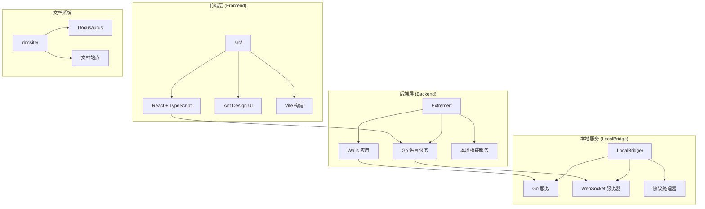
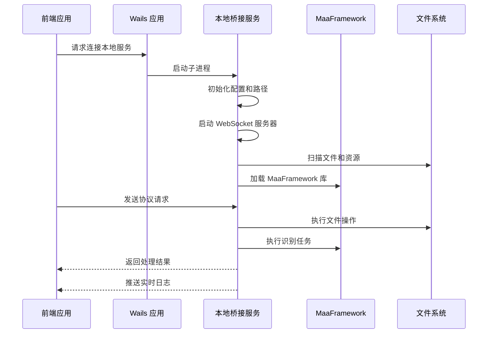
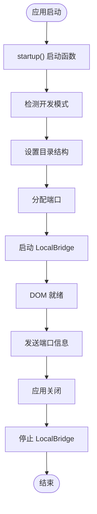
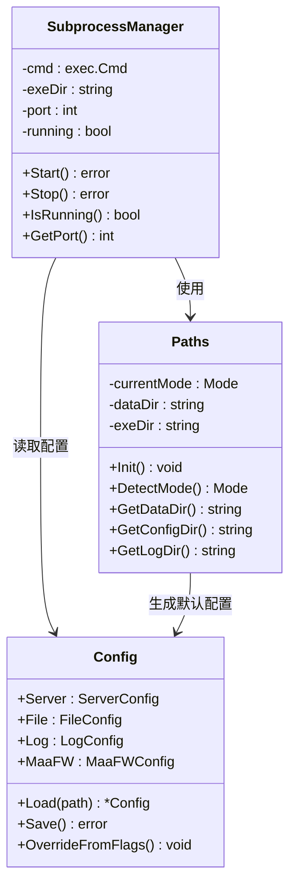
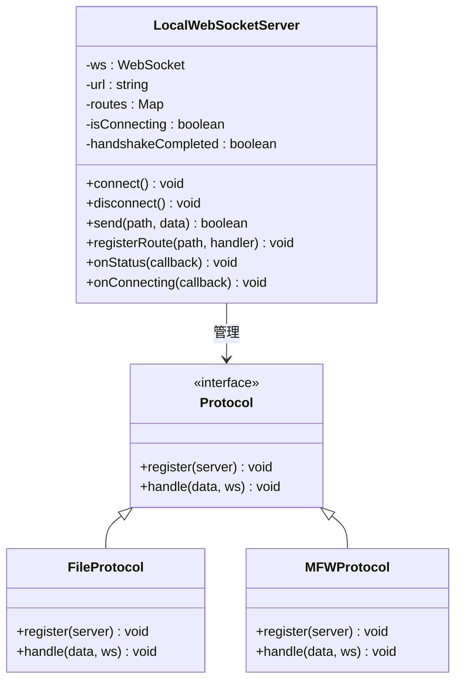
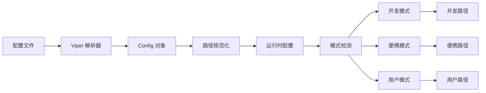
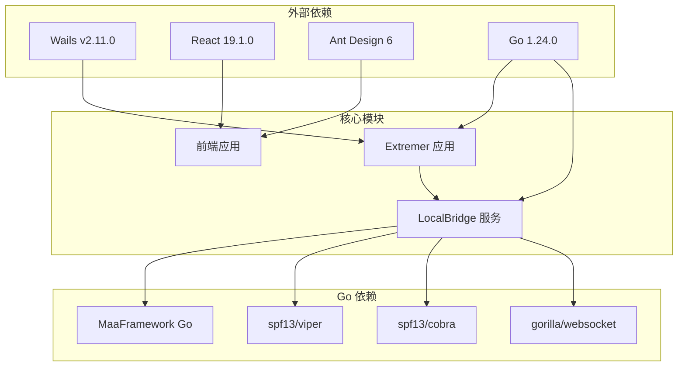

# Wails 框架文档

<cite>
**本文档引用的文件**
- [Extremer/main.go](file://Extremer/main.go)
- [Extremer/app.go](file://Extremer/app.go)
- [Extremer/wails.json](file://Extremer/wails.json)
- [Extremer/internal/bridge/subprocess.go](file://Extremer/internal/bridge/subprocess.go)
- [LocalBridge/cmd/lb/main.go](file://LocalBridge/cmd/lb/main.go)
- [LocalBridge/internal/paths/paths.go](file://LocalBridge/internal/paths/paths.go)
- [LocalBridge/internal/config/config.go](file://LocalBridge/internal/config/config.go)
- [src/App.tsx](file://src/App.tsx)
- [src/main.tsx](file://src/main.tsx)
- [src/services/server.ts](file://src/services/server.ts)
- [package.json](file://package.json)
- [Extremer/go.mod](file://Extremer/go.mod)
- [LocalBridge/go.mod](file://LocalBridge/go.mod)
- [README.md](file://README.md)
</cite>

## 目录
1. [简介](#简介)
2. [项目结构](#项目结构)
3. [核心组件](#核心组件)
4. [架构概览](#架构概览)
5. [详细组件分析](#详细组件分析)
6. [依赖关系分析](#依赖关系分析)
7. [性能考虑](#性能考虑)
8. [故障排除指南](#故障排除指南)
9. [结论](#结论)

## 简介

MaaPipelineEditor (MPE) 是一个基于 Wails 框架开发的跨平台桌面应用程序，专门用于可视化编辑和管理 MaaFramework (MFW) 的 Pipeline 工作流。该项目采用前后端分离架构，结合了现代 Web 技术栈和 Go 语言后端服务。

该应用程序的核心目标是提供一个直观、高效的界面，让用户能够通过拖拽和配置的方式构建、调试和分享 MFW 自动化流程，告别传统的手写 JSON 配置方式。

## 项目结构

项目采用模块化的组织方式，主要包含以下几个核心部分：

**图表来源**
- [Extremer/main.go](file://Extremer/main.go#L23-L65)
- [LocalBridge/cmd/lb/main.go](file://LocalBridge/cmd/lb/main.go#L183-L403)
- [src/main.tsx](file://src/main.tsx#L1-L18)

**章节来源**
- [Extremer/main.go](file://Extremer/main.go#L1-L66)
- [LocalBridge/cmd/lb/main.go](file://LocalBridge/cmd/lb/main.go#L1-L845)
- [src/main.tsx](file://src/main.tsx#L1-L18)

## 核心组件

### Wails 应用主程序

Extremer 目录包含了 Wails 应用的主要入口点，负责应用程序的生命周期管理和与本地服务的协调。

### 本地桥接服务 (LocalBridge)

LocalBridge 是一个独立的 Go 服务，通过 WebSocket 与前端通信，提供文件管理、MaaFramework 集成、资源管理等核心功能。

### 前端 React 应用

基于 React 19 和 TypeScript 构建的现代化前端界面，使用 Ant Design 作为 UI 组件库，提供丰富的可视化编辑功能。

**章节来源**
- [Extremer/app.go](file://Extremer/app.go#L18-L226)
- [LocalBridge/internal/config/config.go](file://LocalBridge/internal/config/config.go#L40-L46)
- [src/App.tsx](file://src/App.tsx#L1-L316)

## 架构概览

整个系统采用分层架构设计，实现了前后端的完全分离：

**图表来源**
- [Extremer/app.go](file://Extremer/app.go#L104-L118)
- [LocalBridge/cmd/lb/main.go](file://LocalBridge/cmd/lb/main.go#L280-L383)
- [src/services/server.ts](file://src/services/server.ts#L105-L252)

## 详细组件分析

### Wails 应用生命周期管理

Wails 应用通过生命周期钩子管理应用程序的启动、运行和关闭过程：

**图表来源**
- [Extremer/app.go](file://Extremer/app.go#L44-L136)

**章节来源**
- [Extremer/app.go](file://Extremer/app.go#L44-L136)
- [Extremer/main.go](file://Extremer/main.go#L23-L65)

### 本地桥接服务架构

LocalBridge 服务采用模块化设计，支持多种运行模式和配置选项：

**图表来源**
- [Extremer/internal/bridge/subprocess.go](file://Extremer/internal/bridge/subprocess.go#L12-L35)
- [LocalBridge/internal/paths/paths.go](file://LocalBridge/internal/paths/paths.go#L15-L32)
- [LocalBridge/internal/config/config.go](file://LocalBridge/internal/config/config.go#L40-L46)

**章节来源**
- [Extremer/internal/bridge/subprocess.go](file://Extremer/internal/bridge/subprocess.go#L12-L127)
- [LocalBridge/internal/paths/paths.go](file://LocalBridge/internal/paths/paths.go#L15-L236)
- [LocalBridge/internal/config/config.go](file://LocalBridge/internal/config/config.go#L40-L221)

### 前端 WebSocket 通信层

前端通过统一的 WebSocket 服务器管理所有与后端的通信：

**图表来源**
- [src/services/server.ts](file://src/services/server.ts#L20-L332)

**章节来源**
- [src/services/server.ts](file://src/services/server.ts#L20-L374)

### 配置管理系统

系统支持多种配置模式和动态配置管理：

**图表来源**
- [LocalBridge/internal/config/config.go](file://LocalBridge/internal/config/config.go#L51-L93)
- [LocalBridge/internal/paths/paths.go](file://LocalBridge/internal/paths/paths.go#L72-L87)

**章节来源**
- [LocalBridge/internal/config/config.go](file://LocalBridge/internal/config/config.go#L51-L221)
- [LocalBridge/internal/paths/paths.go](file://LocalBridge/internal/paths/paths.go#L72-L236)

## 依赖关系分析

项目采用了清晰的依赖层次结构，确保模块间的松耦合：

**图表来源**
- [Extremer/go.mod](file://Extremer/go.mod#L5-L8)
- [LocalBridge/go.mod](file://LocalBridge/go.mod#L5-L15)
- [package.json](file://package.json#L18-L38)

**章节来源**
- [Extremer/go.mod](file://Extremer/go.mod#L1-L39)
- [LocalBridge/go.mod](file://LocalBridge/go.mod#L1-L37)
- [package.json](file://package.json#L1-L63)

## 性能考虑

### 内存管理
- 使用 Go 的 goroutine 和 channel 实现高效的并发处理
- React 19 的并发特性提升前端渲染性能
- WebSocket 连接池管理减少连接开销

### 网络优化
- 协议版本协商避免不必要的兼容性检查
- 消息路由系统减少不必要的事件处理
- 连接超时和重连机制提升用户体验

### 文件系统优化
- 路径缓存减少文件系统访问
- 扫描器异步处理避免阻塞主线程
- 资源管理器智能缓存提高资源访问速度

## 故障排除指南

### 常见问题诊断

1. **连接失败**
   - 检查 LocalBridge 服务是否正常启动
   - 验证端口配置和防火墙设置
   - 查看 WebSocket 连接日志

2. **MaaFramework 集成问题**
   - 确认库文件路径配置正确
   - 检查库版本兼容性
   - 验证资源文件完整性

3. **文件访问权限**
   - 检查工作目录权限设置
   - 验证文件系统访问权限
   - 确认路径规范化处理

**章节来源**
- [src/services/server.ts](file://src/services/server.ts#L128-L251)
- [LocalBridge/cmd/lb/main.go](file://LocalBridge/cmd/lb/main.go#L642-L684)

### 日志和调试

系统提供了多层次的日志记录机制：

- **前端日志**: 通过 wailsBridge 输出到控制台
- **后端日志**: 使用 logrus 记录详细的服务状态
- **WebSocket 日志**: 实时传输日志到前端界面
- **错误处理**: 统一的错误捕获和用户友好的提示

## 结论

MaaPipelineEditor 展示了现代桌面应用开发的最佳实践，通过 Wails 框架实现了 Web 技术与原生应用的完美结合。项目架构清晰、模块化程度高，为复杂的自动化工作流编辑提供了强大的技术基础。

该系统的主要优势包括：
- 完全跨平台支持 (Windows, macOS, Linux)
- 现代化的开发体验和工具链
- 强大的扩展性和插件机制
- 用户友好的可视化编辑界面
- 高效的性能和稳定的运行表现

随着 MaaFramework 生态系统的不断发展，MaaPipelineEditor 也将持续演进，为资源开发者提供更加完善的工作流编辑解决方案。