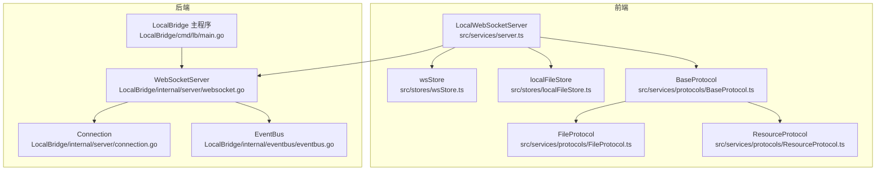
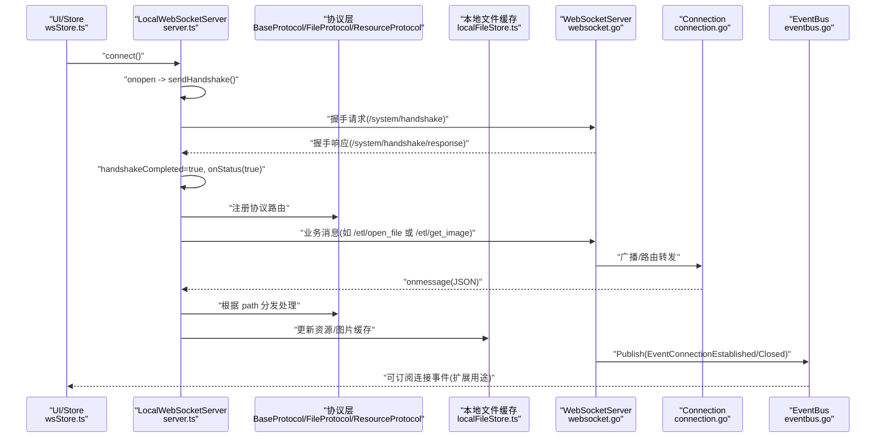
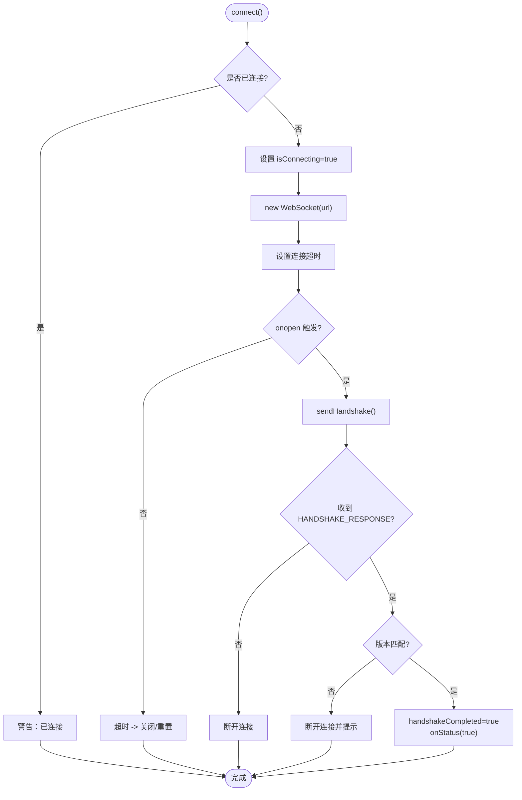
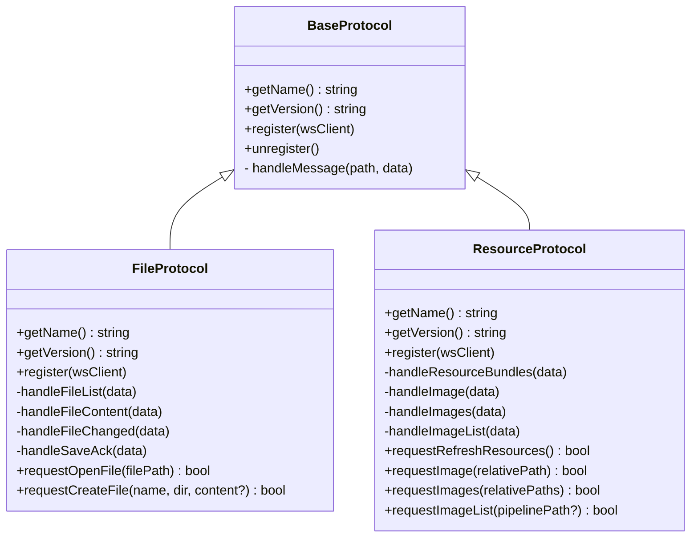
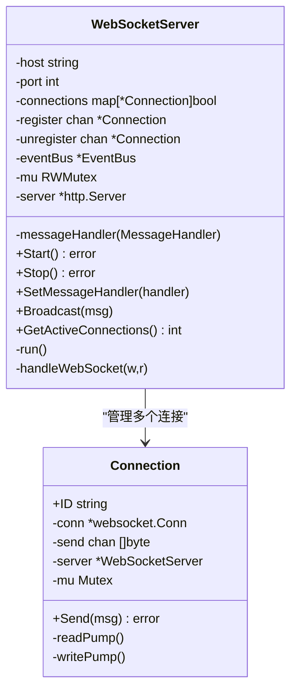
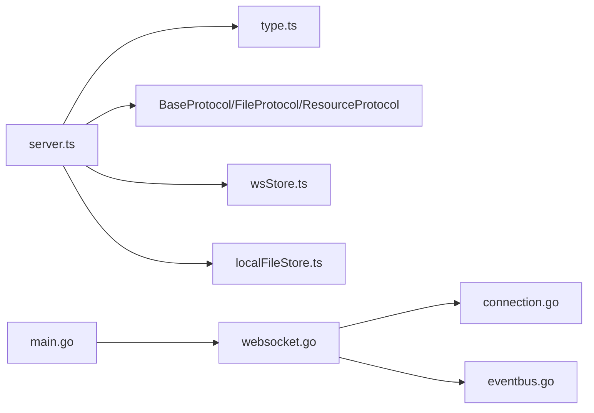

# WebSocket 状态管理

<cite>
**本文引用的文件**
- [server.ts](file://src/services/server.ts)
- [wsStore.ts](file://src/stores/wsStore.ts)
- [BaseProtocol.ts](file://src/services/protocols/BaseProtocol.ts)
- [FileProtocol.ts](file://src/services/protocols/FileProtocol.ts)
- [ResourceProtocol.ts](file://src/services/protocols/ResourceProtocol.ts)
- [websocket.go](file://LocalBridge/internal/server/websocket.go)
- [connection.go](file://LocalBridge/internal/server/connection.go)
- [eventbus.go](file://LocalBridge/internal/eventbus/eventbus.go)
- [main.go](file://LocalBridge/cmd/lb/main.go)
- [localFileStore.ts](file://src/stores/localFileStore.ts)
</cite>

## 目录
1. [简介](#简介)
2. [项目结构](#项目结构)
3. [核心组件](#核心组件)
4. [架构总览](#架构总览)
5. [详细组件分析](#详细组件分析)
6. [依赖关系分析](#依赖关系分析)
7. [性能考量](#性能考量)
8. [故障排查指南](#故障排查指南)
9. [结论](#结论)

## 简介
本文件聚焦于本仓库中的 WebSocket 状态管理，覆盖从浏览器前端到本地桥接服务（Go）的全链路连接生命周期、握手协议、消息路由与状态同步。重点包括：
- 前端 LocalWebSocketServer 的连接状态机与握手流程
- 后端 WebSocketServer 的连接注册/注销、广播与事件总线联动
- 协议层（BaseProtocol/FileProtocol/ResourceProtocol）如何基于路由进行消息分发
- 前端连接状态存储（wsStore）与 UI 层交互
- 新增 ResourceProtocol 对 WebSocket 连接的使用，包括资源相关事件与图片预览流程

## 项目结构
围绕 WebSocket 的关键文件分布如下：
- 前端服务与协议
  - 服务端封装：src/services/server.ts
  - 类型与系统路由：src/services/type.ts
  - 协议基类：src/services/protocols/BaseProtocol.ts
  - 文件协议实现：src/services/protocols/FileProtocol.ts
  - 资源协议实现：src/services/protocols/ResourceProtocol.ts
  - 连接状态存储：src/stores/wsStore.ts
  - 本地文件缓存：src/stores/localFileStore.ts
- 后端服务与事件总线
  - WebSocket 服务器：LocalBridge/internal/server/websocket.go
  - 连接对象：LocalBridge/internal/server/connection.go
  - 事件总线：LocalBridge/internal/eventbus/eventbus.go
  - 本地桥主程序：LocalBridge/cmd/lb/main.go

图表来源
- [server.ts](file://src/services/server.ts#L1-L369)
- [wsStore.ts](file://src/stores/wsStore.ts#L1-L24)
- [BaseProtocol.ts](file://src/services/protocols/BaseProtocol.ts#L1-L39)
- [FileProtocol.ts](file://src/services/protocols/FileProtocol.ts#L1-L248)
- [ResourceProtocol.ts](file://src/services/protocols/ResourceProtocol.ts#L1-L279)
- [websocket.go](file://LocalBridge/internal/server/websocket.go#L35-L175)
- [connection.go](file://LocalBridge/internal/server/connection.go#L12-L96)
- [eventbus.go](file://LocalBridge/internal/eventbus/eventbus.go#L1-L81)
- [main.go](file://LocalBridge/cmd/lb/main.go#L260-L319)
- [localFileStore.ts](file://src/stores/localFileStore.ts#L1-L271)

章节来源
- [server.ts](file://src/services/server.ts#L1-L369)
- [wsStore.ts](file://src/stores/wsStore.ts#L1-L24)
- [BaseProtocol.ts](file://src/services/protocols/BaseProtocol.ts#L1-L39)
- [FileProtocol.ts](file://src/services/protocols/FileProtocol.ts#L1-L248)
- [ResourceProtocol.ts](file://src/services/protocols/ResourceProtocol.ts#L1-L279)
- [websocket.go](file://LocalBridge/internal/server/websocket.go#L35-L175)
- [connection.go](file://LocalBridge/internal/server/connection.go#L12-L96)
- [eventbus.go](file://LocalBridge/internal/eventbus/eventbus.go#L1-L81)
- [main.go](file://LocalBridge/cmd/lb/main.go#L260-L319)
- [localFileStore.ts](file://src/stores/localFileStore.ts#L1-L271)

## 核心组件
- 前端 LocalWebSocketServer
  - 负责 WebSocket 连接生命周期管理、握手协议、消息路由分发、连接状态回调与超时控制。
- 前端 wsStore
  - 管理连接状态（connected/connecting）的轻量状态存储，便于 UI 层绑定。
- 前端协议体系
  - BaseProtocol 定义协议抽象；FileProtocol 实现具体路由处理（文件列表、内容、变更、保存确认等）；ResourceProtocol 实现资源包、图片与图片列表的推送与请求。
- 前端本地文件缓存 localFileStore
  - 存储资源包、图片缓存、图片列表与加载状态，供 ResourceProtocol 使用。
- 后端 WebSocketServer
  - 提供连接升级、注册/注销、广播、活跃连接统计，并通过事件总线发布连接建立/关闭事件。
- 后端 Connection
  - 封装单个连接的读写泵（readPump/writePump）、消息发送队列与异常处理。
- 后端 EventBus
  - 提供事件订阅/发布能力，支持连接事件的异步传播。
- 后端主程序
  - 注册各协议处理器并将消息分发器注入 WebSocketServer。

章节来源
- [server.ts](file://src/services/server.ts#L1-L369)
- [wsStore.ts](file://src/stores/wsStore.ts#L1-L24)
- [BaseProtocol.ts](file://src/services/protocols/BaseProtocol.ts#L1-L39)
- [FileProtocol.ts](file://src/services/protocols/FileProtocol.ts#L1-L248)
- [ResourceProtocol.ts](file://src/services/protocols/ResourceProtocol.ts#L1-L279)
- [websocket.go](file://LocalBridge/internal/server/websocket.go#L35-L175)
- [connection.go](file://LocalBridge/internal/server/connection.go#L12-L96)
- [eventbus.go](file://LocalBridge/internal/eventbus/eventbus.go#L1-L81)
- [main.go](file://LocalBridge/cmd/lb/main.go#L260-L319)
- [localFileStore.ts](file://src/stores/localFileStore.ts#L1-L271)

## 架构总览
下图展示从前端到后端的 WebSocket 状态流转与消息路径。

图表来源
- [server.ts](file://src/services/server.ts#L1-L369)
- [websocket.go](file://LocalBridge/internal/server/websocket.go#L93-L139)
- [connection.go](file://LocalBridge/internal/server/connection.go#L12-L96)
- [eventbus.go](file://LocalBridge/internal/eventbus/eventbus.go#L1-L81)
- [BaseProtocol.ts](file://src/services/protocols/BaseProtocol.ts#L1-L39)
- [FileProtocol.ts](file://src/services/protocols/FileProtocol.ts#L1-L248)
- [ResourceProtocol.ts](file://src/services/protocols/ResourceProtocol.ts#L1-L279)
- [localFileStore.ts](file://src/stores/localFileStore.ts#L1-L271)

## 详细组件分析

### 前端：LocalWebSocketServer 状态机与握手流程
- 连接状态
  - isConnecting：表示连接中状态，用于 UI 提示与防抖。
  - handshakeCompleted：握手完成后才视为“已连接”，避免未完成协议校验即进入业务流程。
  - isConnected() 综合判断 WebSocket OPEN 且握手完成。
- 握手协议
  - 使用 SystemRoutes.HANDSHAKE 发送协议版本，等待 HANDSHAKE_RESPONSE。
  - 若后端要求的版本不匹配，则断开连接并提示用户。
- 生命周期事件
  - onopen：发送握手请求。
  - onmessage：解析 JSON，按 path 分发至已注册的路由处理器。
  - onerror/onclose：清理连接中状态、触发回调、设置断开状态。
- 超时控制
  - 连接超时定时器在 connect() 中创建，超时则主动关闭并回退到未连接状态。
- 路由注册
  - registerRoute/registerRoutes 支持协议模块注册业务路由（如文件协议、资源协议）。

图表来源
- [server.ts](file://src/services/server.ts#L100-L173)
- [server.ts](file://src/services/server.ts#L203-L219)

章节来源
- [server.ts](file://src/services/server.ts#L1-L369)

### 前端：协议层（BaseProtocol/FileProtocol/ResourceProtocol）
- BaseProtocol
  - 抽象协议名、版本与注册/注销接口；提供统一的消息入口（受保护）。
- FileProtocol
  - 注册接收路由：/lte/file_list、/lte/file_content、/lte/file_changed、/ack/save_file
  - 注册发送请求：/etl/open_file、/etl/create_file
  - 处理文件列表、内容、变更与保存确认，结合前端 store 更新 UI 状态与提示。
- ResourceProtocol
  - 注册接收路由：/lte/resource_bundles、/lte/image、/lte/images、/lte/image_list
  - 注册发送请求：/etl/refresh_resources、/etl/get_image、/etl/get_images、/etl/get_image_list
  - 处理资源包列表推送、单张/批量图片数据与图片列表响应；更新本地文件缓存（localFileStore）。
  - 提供请求方法：requestRefreshResources、requestImage、requestImages、requestImageList。

图表来源
- [BaseProtocol.ts](file://src/services/protocols/BaseProtocol.ts#L1-L39)
- [FileProtocol.ts](file://src/services/protocols/FileProtocol.ts#L1-L248)
- [ResourceProtocol.ts](file://src/services/protocols/ResourceProtocol.ts#L1-L279)

章节来源
- [BaseProtocol.ts](file://src/services/protocols/BaseProtocol.ts#L1-L39)
- [FileProtocol.ts](file://src/services/protocols/FileProtocol.ts#L1-L248)
- [ResourceProtocol.ts](file://src/services/protocols/ResourceProtocol.ts#L1-L279)

### 前端：连接状态存储（wsStore）与本地文件缓存（localFileStore）
- wsStore
  - 提供 connected/connecting 两个布尔状态与对应的 setter。
  - 与 LocalWebSocketServer 的 onStatus/onConnecting 回调配合使用，保持状态一致。
- localFileStore
  - 存储资源包列表、图片缓存、图片列表与加载状态。
  - ResourceProtocol 通过该 store 更新资源包信息、图片缓存与图片列表。

章节来源
- [wsStore.ts](file://src/stores/wsStore.ts#L1-L24)
- [localFileStore.ts](file://src/stores/localFileStore.ts#L1-L271)

### 后端：WebSocketServer 与 Connection
- WebSocketServer
  - 维护连接集合、注册/注销通道、消息处理器、事件总线。
  - 启动 run() 协程管理连接生命周期；handleWebSocket() 升级连接并启动读写泵。
  - Broadcast() 对所有连接广播消息；GetActiveConnections() 返回当前活跃连接数。
- Connection
  - readPump() 读取消息并解析为 models.Message，交给服务器的消息处理器。
  - writePump() 循环发送 send 队列中的消息；Send() 将序列化后的消息入队，若队列满则记录告警。
  - 在读取/发送异常时，自动注销连接并关闭底层连接。

图表来源
- [websocket.go](file://LocalBridge/internal/server/websocket.go#L35-L175)
- [connection.go](file://LocalBridge/internal/server/connection.go#L12-L96)

章节来源
- [websocket.go](file://LocalBridge/internal/server/websocket.go#L35-L175)
- [connection.go](file://LocalBridge/internal/server/connection.go#L12-L96)

### 后端：事件总线（EventBus）与主程序
- EventBus
  - 提供 Subscribe/Publish/PublishAsync/Unsubscribe 能力。
  - 在连接建立/关闭时发布事件，可用于跨模块扩展（例如文件扫描完成、文件变更等）。
  - 与 WebSocketServer 的 run() 注册/注销流程联动，发布连接事件。
- LocalBridge 主程序
  - 注册协议处理器（文件、MFW、Utility、Config、Debug、Resource）并将消息分发器注入 WebSocketServer。
  - 启动 WebSocket 服务器并等待退出信号。

章节来源
- [eventbus.go](file://LocalBridge/internal/eventbus/eventbus.go#L1-L81)
- [websocket.go](file://LocalBridge/internal/server/websocket.go#L112-L139)
- [main.go](file://LocalBridge/cmd/lb/main.go#L260-L319)

## 依赖关系分析
- 前端
  - LocalWebSocketServer 依赖 SystemRoutes 与握手类型定义；通过协议模块注册路由；通过 wsStore 同步 UI 状态。
  - FileProtocol 依赖前端 store（文件与本地文件列表），并在消息到达时更新状态。
  - ResourceProtocol 依赖 localFileStore 更新资源包、图片缓存与图片列表。
- 后端
  - WebSocketServer 依赖 gorilla/websocket、eventbus、models；Connection 依赖 websocket 与 models。
  - 事件总线为连接事件提供解耦扩展点。
  - LocalBridge 主程序注册各协议处理器并将消息分发器注入 WebSocketServer。

图表来源
- [server.ts](file://src/services/server.ts#L1-L369)
- [BaseProtocol.ts](file://src/services/protocols/BaseProtocol.ts#L1-L39)
- [FileProtocol.ts](file://src/services/protocols/FileProtocol.ts#L1-L248)
- [ResourceProtocol.ts](file://src/services/protocols/ResourceProtocol.ts#L1-L279)
- [wsStore.ts](file://src/stores/wsStore.ts#L1-L24)
- [localFileStore.ts](file://src/stores/localFileStore.ts#L1-L271)
- [websocket.go](file://LocalBridge/internal/server/websocket.go#L35-L175)
- [connection.go](file://LocalBridge/internal/server/connection.go#L12-L96)
- [eventbus.go](file://LocalBridge/internal/eventbus/eventbus.go#L1-L81)
- [main.go](file://LocalBridge/cmd/lb/main.go#L260-L319)

章节来源
- [server.ts](file://src/services/server.ts#L1-L369)
- [BaseProtocol.ts](file://src/services/protocols/BaseProtocol.ts#L1-L39)
- [FileProtocol.ts](file://src/services/protocols/FileProtocol.ts#L1-L248)
- [ResourceProtocol.ts](file://src/services/protocols/ResourceProtocol.ts#L1-L279)
- [wsStore.ts](file://src/stores/wsStore.ts#L1-L24)
- [localFileStore.ts](file://src/stores/localFileStore.ts#L1-L271)
- [websocket.go](file://LocalBridge/internal/server/websocket.go#L35-L175)
- [connection.go](file://LocalBridge/internal/server/connection.go#L12-L96)
- [eventbus.go](file://LocalBridge/internal/eventbus/eventbus.go#L1-L81)
- [main.go](file://LocalBridge/cmd/lb/main.go#L260-L319)

## 性能考量
- 发送队列容量
  - Connection.send 使用带缓冲的通道，若队列满会丢弃消息并记录告警。建议在高并发场景下评估队列大小与背压策略。
- 广播与锁粒度
  - Broadcast() 使用读锁遍历连接，Send() 使用互斥锁保护发送。建议在大规模连接场景下关注锁竞争与广播成本。
- 读写泵分离
  - readPump/writePump 协程分离，避免阻塞；但需注意异常关闭时的资源释放与事件发布顺序。
- 握手与超时
  - 前端连接超时与握手完成标志，有助于快速失败与减少无效资源占用。
- 图片缓存与去重
  - ResourceProtocol 在请求前检查缓存与“正在请求”状态，避免重复请求与冗余网络流量。

[本节为通用指导，无需特定文件引用]

## 故障排查指南
- 连接超时
  - 现象：onopen 未触发，超时后断开。
  - 排查：确认本地服务端口与进程状态；检查防火墙/代理；查看前端日志与消息提示。
- 协议版本不匹配
  - 现象：握手响应返回 required_version 与前端不一致，自动断开。
  - 排查：升级前端或后端以满足版本要求；核对协议版本常量。
- 消息解析失败
  - 现象：前端 onmessage 解析 JSON 失败或无对应路由处理器。
  - 排查：检查消息格式与 path；确认协议模块已注册对应路由。
- 发送队列满
  - 现象：后端日志出现“发送队列已满，消息被丢弃”。
  - 排查：降低消息频率或增大发送队列容量；优化前端批量发送策略。
- 连接异常关闭
  - 现象：读取/发送错误导致连接注销。
  - 排查：检查网络稳定性；查看后端日志；确认客户端是否主动关闭。
- 资源图片加载失败
  - 现象：/lte/image 推送失败，控制台输出失败信息。
  - 排查：检查后端资源扫描与路径配置；确认前端 pending 状态被正确清除。

章节来源
- [server.ts](file://src/services/server.ts#L124-L173)
- [connection.go](file://LocalBridge/internal/server/connection.go#L31-L96)
- [websocket.go](file://LocalBridge/internal/server/websocket.go#L142-L168)
- [ResourceProtocol.ts](file://src/services/protocols/ResourceProtocol.ts#L1-L279)

## 结论
本项目的 WebSocket 状态管理采用“前端状态机 + 后端连接池 + 协议路由”的清晰分层设计：
- 前端负责连接生命周期、握手协议与消息路由；通过 wsStore 与 UI 状态同步。
- 后端负责连接管理、广播与事件发布；通过事件总线为扩展提供解耦点。
- 协议层以 BaseProtocol 为抽象，FileProtocol 与 ResourceProtocol 作为典型实现，便于扩展更多业务路由。
整体具备良好的可维护性与扩展性，适合在多协议、多连接场景下演进。