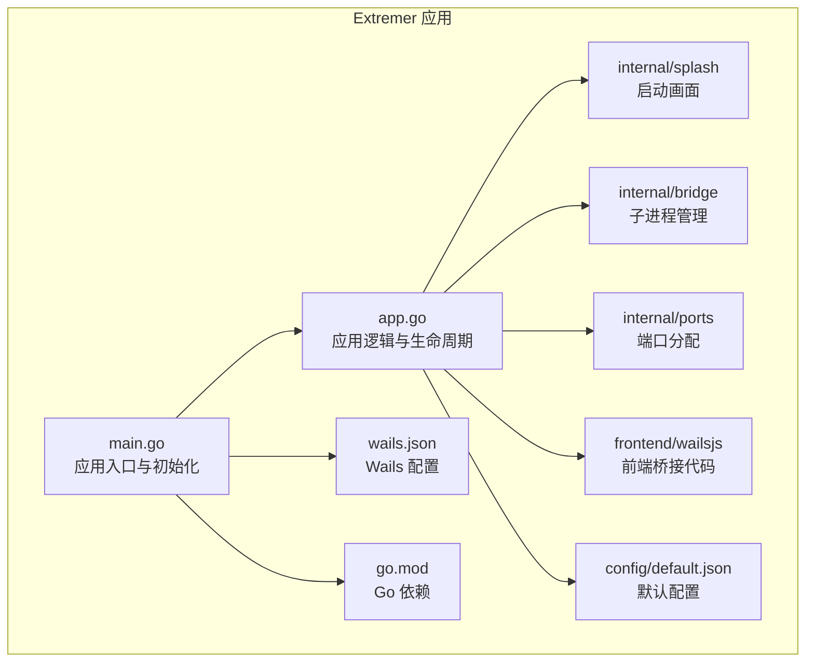
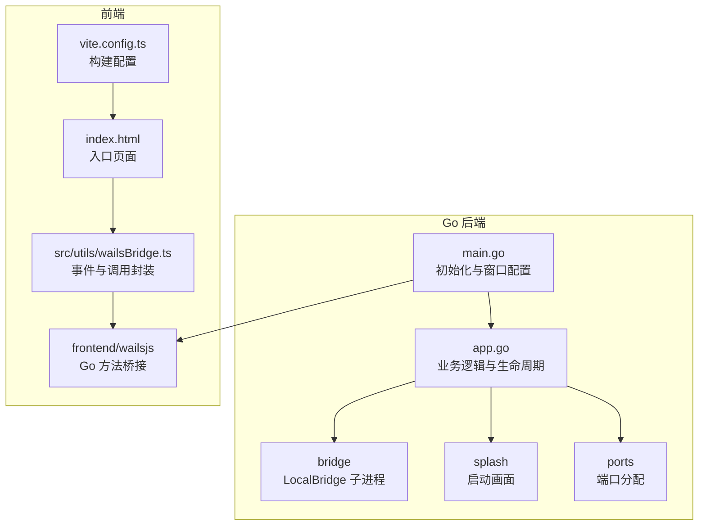
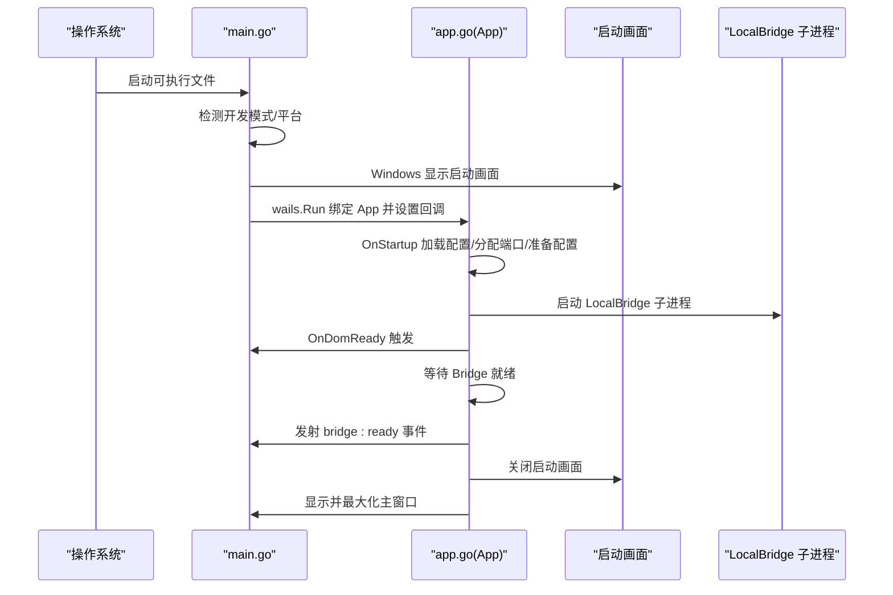
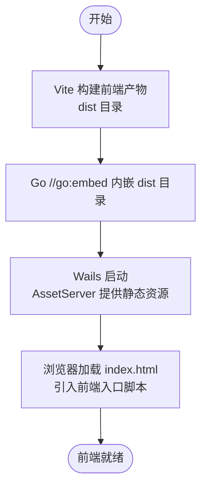
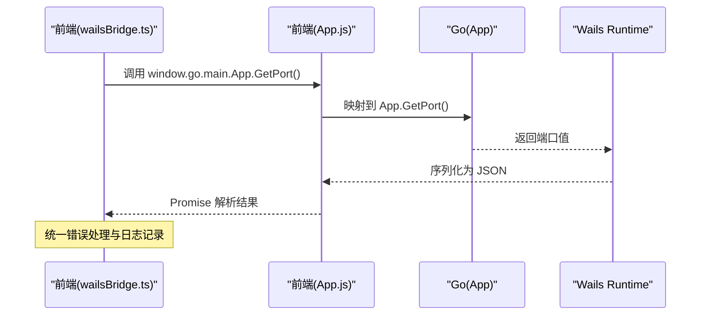
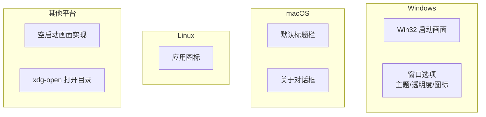
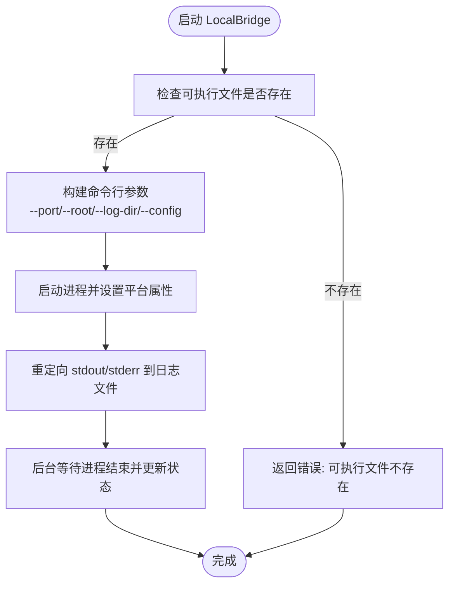
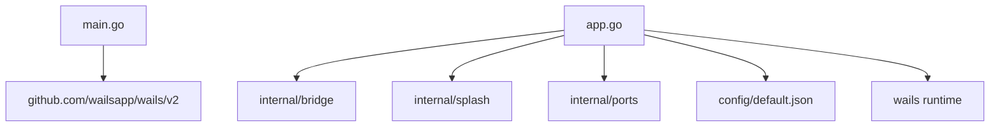

# Wails框架集成

<cite>
**本文档引用的文件**
- [main.go](file://Extremer/main.go)
- [app.go](file://Extremer/app.go)
- [wails.json](file://Extremer/wails.json)
- [go.mod](file://Extremer/go.mod)
- [App.js](file://Extremer/frontend/wailsjs/go/main/App.js)
- [wailsBridge.ts](file://src/utils/wailsBridge.ts)
- [splash.go](file://Extremer/internal/splash/splash.go)
- [splash_windows.go](file://Extremer/internal/splash/splash_windows.go)
- [splash_other.go](file://Extremer/internal/splash/splash_other.go)
- [subprocess.go](file://Extremer/internal/bridge/subprocess.go)
- [allocator.go](file://Extremer/internal/ports/allocator.go)
- [default.json](file://Extremer/config/default.json)
- [index.html](file://index.html)
- [vite.config.ts](file://vite.config.ts)
</cite>

## 目录
1. [简介](#简介)
2. [项目结构](#项目结构)
3. [核心组件](#核心组件)
4. [架构总览](#架构总览)
5. [详细组件分析](#详细组件分析)
6. [依赖关系分析](#依赖关系分析)
7. [性能考虑](#性能考虑)
8. [故障排除指南](#故障排除指南)
9. [结论](#结论)
10. [附录](#附录)

## 简介
本文件深入解析 MaaPipelineEditor 如何利用 Wails 框架实现跨平台桌面应用。重点覆盖以下方面：
- Wails 应用初始化流程：main.go 与 app.go 的职责与配置
- 前端静态资源的打包与嵌入机制：Vite 构建产物与 Go 内嵌资源
- Go 与 JavaScript 之间的桥接通信：方法调用、事件传递、数据序列化
- 跨平台兼容性处理：Windows、macOS、Linux 的差异实现
- Wails 配置文件详解与最佳实践建议

## 项目结构
Extremer 目录是 Wails 应用的核心，包含 Go 后端、前端桥接代码、平台特定实现与配置文件。

**图表来源**
- [main.go:1-90](file://Extremer/main.go#L1-L90)
- [app.go:1-620](file://Extremer/app.go#L1-L620)
- [wails.json:1-18](file://Extremer/wails.json#L1-L18)
- [go.mod:1-39](file://Extremer/go.mod#L1-L39)

**章节来源**
- [main.go:1-90](file://Extremer/main.go#L1-L90)
- [app.go:1-620](file://Extremer/app.go#L1-L620)
- [wails.json:1-18](file://Extremer/wails.json#L1-L18)
- [go.mod:1-39](file://Extremer/go.mod#L1-L39)

## 核心组件
- 应用入口与初始化：负责加载内嵌前端资源、设置窗口选项、绑定 Go 对象到 JS、跨平台配置与启动画面控制。
- 应用逻辑与生命周期：负责配置加载、工作目录与日志目录确定、端口分配、LocalBridge 子进程启动与管理、事件发射与窗口显示。
- 前端桥接：提供检测 Wails 环境、事件监听、调用 Go 方法、日志输出等能力。
- 跨平台启动画面：Windows 平台使用原生 Win32 API 实现，其他平台采用空实现。
- 子进程管理：根据平台选择可执行文件，传递参数并重定向日志输出。
- 端口分配：在固定范围内寻找可用端口，避免冲突。

**章节来源**
- [main.go:26-84](file://Extremer/main.go#L26-L84)
- [app.go:181-475](file://Extremer/app.go#L181-L475)
- [wailsBridge.ts:1-197](file://src/utils/wailsBridge.ts#L1-L197)
- [splash.go:1-35](file://Extremer/internal/splash/splash.go#L1-L35)
- [splash_windows.go:1-449](file://Extremer/internal/splash/splash_windows.go#L1-L449)
- [subprocess.go:1-132](file://Extremer/internal/bridge/subprocess.go#L1-L132)
- [allocator.go:1-62](file://Extremer/internal/ports/allocator.go#L1-L62)

## 架构总览
Wails 应用采用“Go 后端 + 前端渲染”的双层架构。Go 负责系统级操作、进程管理、配置与事件；前端负责用户交互与可视化。两者通过 Wails 提供的桥接层进行通信。

**图表来源**
- [main.go:1-90](file://Extremer/main.go#L1-L90)
- [app.go:1-620](file://Extremer/app.go#L1-L620)
- [index.html:1-32](file://index.html#L1-L32)
- [vite.config.ts:1-41](file://vite.config.ts#L1-L41)
- [App.js:1-52](file://Extremer/frontend/wailsjs/go/main/App.js#L1-L52)
- [wailsBridge.ts:1-197](file://src/utils/wailsBridge.ts#L1-L197)

## 详细组件分析

### 应用初始化流程（main.go 与 app.go）
- 初始化阶段：
  - 通过内嵌资源加载图标与前端 dist 目录。
  - 检测开发模式，决定窗口显示策略与资源路径。
  - Windows 平台显示启动画面，隐藏主窗口以提升用户体验。
  - 配置窗口大小、最小尺寸、透明度、主题等。
  - 绑定 Go 对象到 JS，使前端可直接调用 Go 方法。
- 生命周期回调：
  - OnStartup：加载配置、确定工作目录、分配端口、准备 LocalBridge 配置、启动子进程。
  - OnDomReady：等待 LocalBridge 就绪，发射 bridge:ready 事件，前端据此连接 WebSocket。
  - OnShutdown：优雅停止 LocalBridge 子进程。

**图表来源**
- [main.go:26-84](file://Extremer/main.go#L26-L84)
- [app.go:181-475](file://Extremer/app.go#L181-L475)

**章节来源**
- [main.go:26-84](file://Extremer/main.go#L26-L84)
- [app.go:181-475](file://Extremer/app.go#L181-L475)

### 前端静态资源打包与嵌入机制（Vite + Go 内嵌）
- Vite 构建：
  - 通过别名 @ 指向 src，便于模块导入。
  - 根据模式设置 base 路径，支持稳定版、预览版与 Extremer 模式。
- Go 内嵌：
  - 使用 //go:embed 将前端 dist 目录整体内嵌为 embed.FS。
  - Wails AssetServer 读取该 FS 并提供静态资源服务。
- 入口页面：
  - index.html 引入前端入口脚本，由 Vite 在开发时热更新，生产时由内嵌资源提供。

**图表来源**
- [vite.config.ts:1-41](file://vite.config.ts#L1-L41)
- [main.go:18-22](file://Extremer/main.go#L18-L22)
- [index.html:1-32](file://index.html#L1-L32)

**章节来源**
- [vite.config.ts:1-41](file://vite.config.ts#L1-L41)
- [main.go:18-22](file://Extremer/main.go#L18-L22)
- [index.html:1-32](file://index.html#L1-L32)

### Go 与 JavaScript 桥接通信（方法调用、事件、序列化）
- 方法调用：
  - 前端通过自动生成的 App.js 调用 window['go']['main']['App'][方法名]。
  - Go 端在 App 结构体上暴露公开方法，Wails 自动映射到 JS。
- 事件传递：
  - Go 端使用 wailsRuntime.EventsEmit 发射事件（如 bridge:port、bridge:ready）。
  - 前端通过 wailsBridge.ts 的 onWailsEvent 监听事件，统一处理回调。
- 数据序列化：
  - Wails 自动处理 JSON 序列化与反序列化，支持基础类型与结构体。
  - 前端桥接模块提供类型声明，增强开发体验与安全性。

**图表来源**
- [App.js:1-52](file://Extremer/frontend/wailsjs/go/main/App.js#L1-L52)
- [wailsBridge.ts:1-197](file://src/utils/wailsBridge.ts#L1-L197)
- [app.go:477-490](file://Extremer/app.go#L477-L490)

**章节来源**
- [App.js:1-52](file://Extremer/frontend/wailsjs/go/main/App.js#L1-L52)
- [wailsBridge.ts:1-197](file://src/utils/wailsBridge.ts#L1-L197)
- [app.go:415-444](file://Extremer/app.go#L415-L444)

### 跨平台兼容性处理（Windows、macOS、Linux）
- Windows：
  - 启动画面：使用 Win32 API 实现原生窗口、绘制与动画。
  - 窗口选项：启用常规主题、禁用窗口图标、设置不透明背景。
- macOS：
  - 标题栏：使用默认样式，配置 About 对话框图标与信息。
- Linux：
  - 图标：通过 Linux 选项设置应用图标。
- 其他平台：
  - 启动画面：空实现，不显示启动画面。
  - 文件管理器：使用 xdg-open 打开目录。

**图表来源**
- [main.go:67-83](file://Extremer/main.go#L67-L83)
- [splash_windows.go:1-449](file://Extremer/internal/splash/splash_windows.go#L1-L449)
- [splash_other.go:1-31](file://Extremer/internal/splash/splash_other.go#L1-L31)

**章节来源**
- [main.go:67-83](file://Extremer/main.go#L67-L83)
- [splash.go:1-35](file://Extremer/internal/splash/splash.go#L1-L35)
- [splash_windows.go:1-449](file://Extremer/internal/splash/splash_windows.go#L1-L449)
- [splash_other.go:1-31](file://Extremer/internal/splash/splash_other.go#L1-L31)

### LocalBridge 子进程管理与端口分配
- 子进程管理：
  - 根据平台选择可执行文件（Windows: mpelb.exe，其他: mpelb）。
  - 传递 --port、--root、--log-dir 参数，必要时附加 --config。
  - 重定向标准输出与错误到日志文件，后台监控进程退出。
- 端口分配：
  - 在 9066-9199 范围内寻找可用端口，优先使用首选端口。
  - 支持范围查找与可用性检测，避免冲突。

**图表来源**
- [subprocess.go:35-105](file://Extremer/internal/bridge/subprocess.go#L35-L105)
- [allocator.go:15-61](file://Extremer/internal/ports/allocator.go#L15-L61)

**章节来源**
- [subprocess.go:1-132](file://Extremer/internal/bridge/subprocess.go#L1-L132)
- [allocator.go:1-62](file://Extremer/internal/ports/allocator.go#L1-L62)

### Wails 配置文件详解与最佳实践
- 配置项说明：
  - version：Wails 配置格式版本。
  - name/outputfilename：应用名称与输出文件名。
  - frontend:dir/build/install：前端目录、构建与安装命令（当前留空）。
  - assetdir：内嵌静态资源目录（指向前端 dist）。
  - build:dir：构建输出目录。
  - info：公司、产品、版本、版权与描述信息。
- 最佳实践：
  - 将前端构建产物置于 assetdir 指定目录，确保内嵌资源正确加载。
  - 在开发模式下保持前端独立构建，生产模式使用内嵌资源。
  - 跨平台配置分离，针对不同平台设置窗口外观与行为。

**章节来源**
- [wails.json:1-18](file://Extremer/wails.json#L1-L18)

## 依赖关系分析
- Wails 版本：v2.11.0，Go 版本：1.24。
- 关键依赖：Wails 运行时、Webview2（Windows）、WebSocket 服务器（LocalBridge）。
- 内部模块：splash（启动画面）、bridge（子进程管理）、ports（端口分配）、config（默认配置）。

**图表来源**
- [go.mod:5-8](file://Extremer/go.mod#L5-L8)
- [main.go:10-16](file://Extremer/main.go#L10-L16)
- [app.go:14-18](file://Extremer/app.go#L14-L18)

**章节来源**
- [go.mod:1-39](file://Extremer/go.mod#L1-L39)
- [main.go:10-16](file://Extremer/main.go#L10-L16)
- [app.go:14-18](file://Extremer/app.go#L14-L18)

## 性能考虑
- 启动画面：仅在 Windows 上启用，减少其他平台的额外开销。
- 资源内嵌：使用 embed.FS 提供静态资源，避免磁盘 IO，提升启动速度。
- 端口分配：固定范围与可用性检测，降低冲突概率与重试成本。
- 子进程日志：重定向到文件，避免阻塞主线程，便于问题排查。
- 事件发射：异步等待 LocalBridge 就绪后再通知前端，避免连接失败。

## 故障排除指南
- 启动画面无法显示（Windows）：
  - 检查 Win32 API 调用是否成功，确认窗口类注册与消息循环正常。
  - 查看错误通道与超时处理。
- LocalBridge 启动失败：
  - 确认可执行文件存在且具有执行权限。
  - 检查端口占用与日志文件写入权限。
  - 验证配置文件路径与内容有效性。
- 前端无法连接：
  - 确认 OnDomReady 已发射 bridge:ready 事件。
  - 检查 wailsBridge.ts 的事件监听与错误处理。
- 跨平台问题：
  - 非 Windows 平台启动画面为空实现，属预期行为。
  - Linux 打开目录使用 xdg-open，确保系统环境正确。

**章节来源**
- [splash_windows.go:164-273](file://Extremer/internal/splash/splash_windows.go#L164-L273)
- [subprocess.go:35-105](file://Extremer/internal/bridge/subprocess.go#L35-L105)
- [wailsBridge.ts:41-73](file://src/utils/wailsBridge.ts#L41-L73)

## 结论
MaaPipelineEditor 通过 Wails 将 Go 的系统能力与前端的交互优势结合，实现了跨平台桌面应用。其关键在于：
- 清晰的应用初始化与生命周期管理
- 前端资源的内嵌与跨平台适配
- 稳健的 Go-JS 桥接与事件机制
- 平台特定的优化（Windows 启动画面、多平台窗口配置）
- 子进程与端口管理的可靠性设计

## 附录
- 默认配置项：服务器地址与端口、文件扫描规则、日志级别与推送、MaaFramework 路径与启用状态、Extremer 根目录与默认资源路径。
- 前端桥接模块：提供环境检测、事件监听、方法调用与日志输出的统一封装。

**章节来源**
- [default.json:1-34](file://Extremer/config/default.json#L1-L34)
- [wailsBridge.ts:1-197](file://src/utils/wailsBridge.ts#L1-L197)