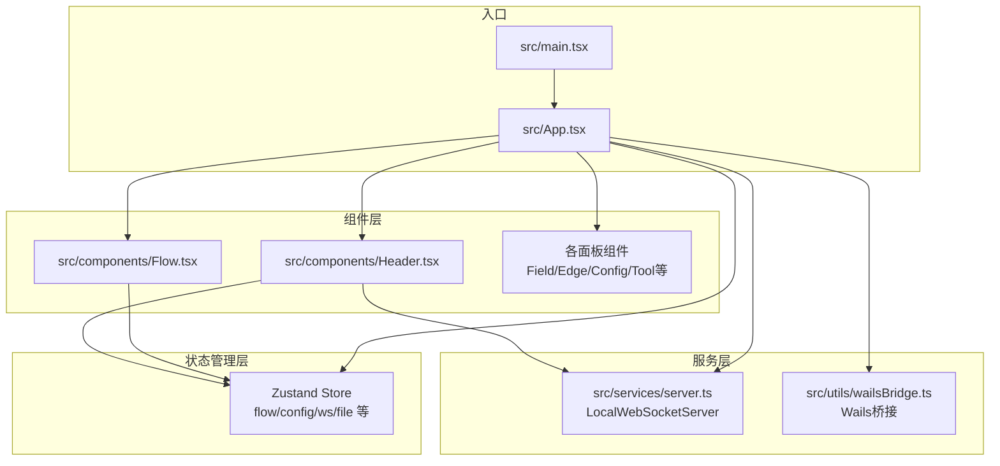
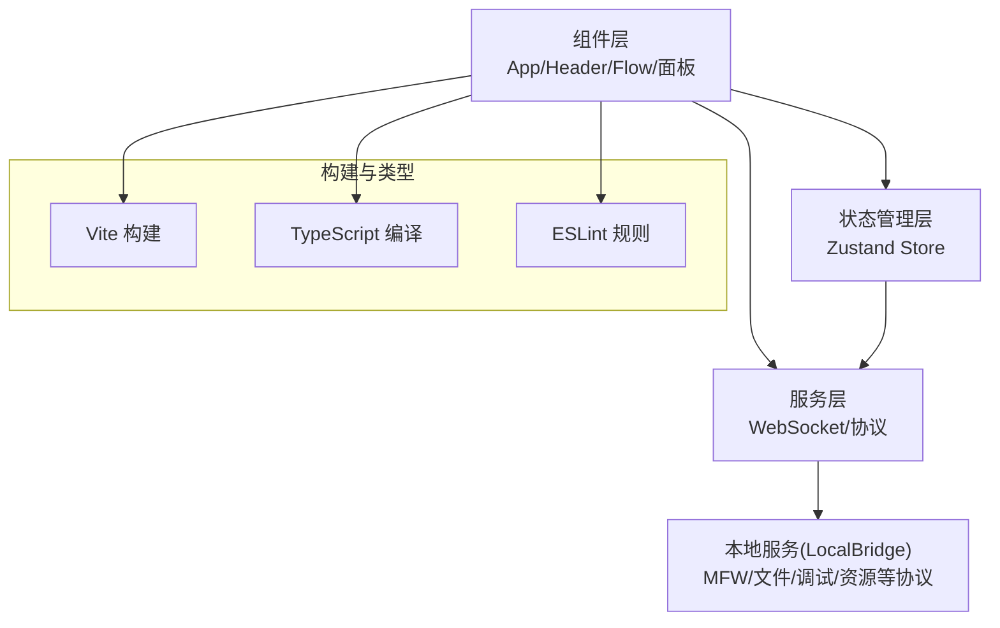
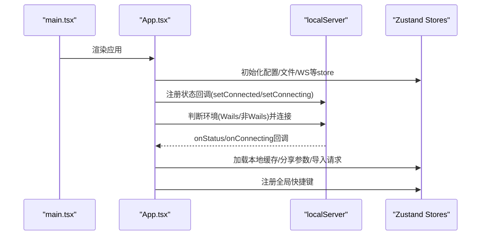
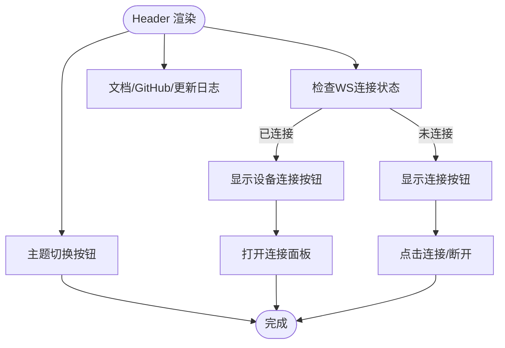
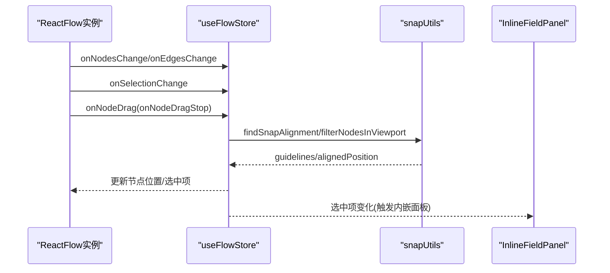
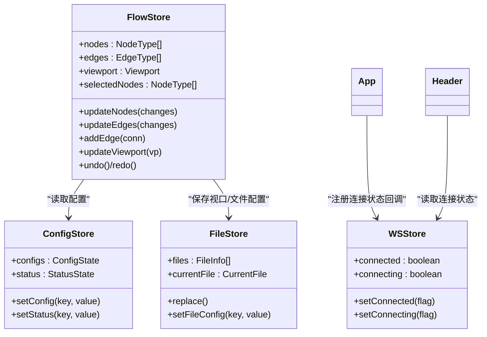
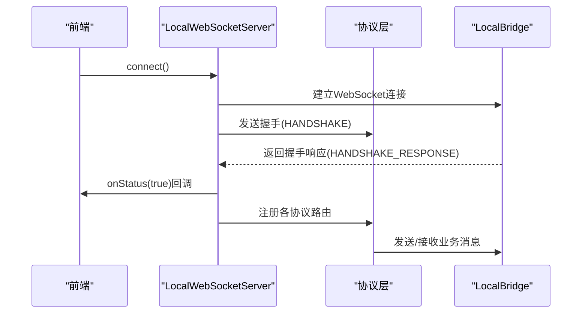
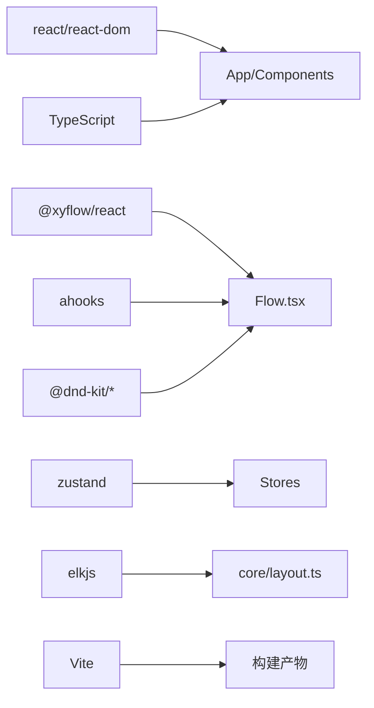

# 前端架构设计

<cite>
**本文档引用的文件**
- [package.json](file://package.json)
- [vite.config.ts](file://vite.config.ts)
- [tsconfig.json](file://tsconfig.json)
- [tsconfig.app.json](file://tsconfig.app.json)
- [src/main.tsx](file://src/main.tsx)
- [src/App.tsx](file://src/App.tsx)
- [src/components/Header.tsx](file://src/components/Header.tsx)
- [src/components/Flow.tsx](file://src/components/Flow.tsx)
- [src/stores/flow/index.ts](file://src/stores/flow/index.ts)
- [src/stores/configStore.ts](file://src/stores/configStore.ts)
- [src/hooks/useGlobalShortcuts.ts](file://src/hooks/useGlobalShortcuts.ts)
- [src/services/server.ts](file://src/services/server.ts)
- [src/utils/wailsBridge.ts](file://src/utils/wailsBridge.ts)
- [src/styles/index.less](file://src/styles/index.less)
- [eslint.config.js](file://eslint.config.js)
</cite>

## 目录
1. [引言](#引言)
2. [项目结构](#项目结构)
3. [核心组件](#核心组件)
4. [架构总览](#架构总览)
5. [详细组件分析](#详细组件分析)
6. [依赖分析](#依赖分析)
7. [性能考虑](#性能考虑)
8. [故障排查指南](#故障排查指南)
9. [结论](#结论)
10. [附录](#附录)

## 引言
本文件面向MaaPipelineEditor前端React应用，系统性阐述其整体架构设计与实现要点。重点覆盖技术栈选择（React 19 + TypeScript + Vite）、组件层次结构（App根组件、Header头部、Flow工作流画布、各类面板）、状态管理（Zustand多store协作）、构建与开发环境（Vite、TypeScript、ESLint）、组件通信机制、路由设计与样式组织等方面。旨在帮助开发者快速理解并高效扩展该前端应用。

## 项目结构
前端代码位于src目录，采用按功能域划分的组织方式：
- components：UI组件层，包含Header、Flow工作流画布及各面板组件
- stores：状态管理层，以Zustand实现的多个store（flow、config、ws、file等）
- services：服务层，封装WebSocket本地服务通信协议
- hooks：自定义Hook，如全局快捷键
- utils：工具模块，如Wails桥接、分享链接、URL解析等
- styles：样式组织，采用模块化Less组织方式
- 核心入口：main.tsx负责初始化与渲染App

**图表来源**
- [src/main.tsx:1-18](file://src/main.tsx#L1-L18)
- [src/App.tsx:111-333](file://src/App.tsx#L111-L333)
- [src/components/Header.tsx:226-424](file://src/components/Header.tsx#L226-L424)
- [src/components/Flow.tsx:193-542](file://src/components/Flow.tsx#L193-L542)
- [src/services/server.ts:20-373](file://src/services/server.ts#L20-L373)
- [src/utils/wailsBridge.ts:41-197](file://src/utils/wailsBridge.ts#L41-L197)

**章节来源**
- [src/main.tsx:1-18](file://src/main.tsx#L1-L18)
- [src/App.tsx:111-333](file://src/App.tsx#L111-L333)

## 核心组件
- App根组件：负责全局初始化、文件拖拽导入、分享链接与导入请求处理、WebSocket连接策略（Wails与非Wails环境差异）、主题提供者、以及布局中各面板的挂载与渲染。
- Header头部组件：提供版本信息、连接本地服务按钮、设备连接入口、主题切换、文档与GitHub链接、更新日志弹窗等。
- Flow工作流画布：基于@xyflow/react实现，承载节点与连线的增删改查、磁吸对齐、分组拖拽、内嵌字段/边面板、快捷键处理、视口变更监听与自动保存等。
- 面板组件群：包括字段面板、边面板、配置面板、工具面板、搜索面板、文件面板、实时画面面板、错误/日志/调试面板等，均通过Zustand store驱动状态。

**章节来源**
- [src/App.tsx:111-333](file://src/App.tsx#L111-L333)
- [src/components/Header.tsx:226-424](file://src/components/Header.tsx#L226-L424)
- [src/components/Flow.tsx:193-542](file://src/components/Flow.tsx#L193-L542)

## 架构总览
应用采用"组件层-状态管理层-服务层"的分层架构，配合Vite构建与TypeScript类型约束，确保开发效率与运行稳定性。

**图表来源**
- [src/App.tsx:111-333](file://src/App.tsx#L111-L333)
- [src/services/server.ts:20-373](file://src/services/server.ts#L20-L373)
- [vite.config.ts:1-41](file://vite.config.ts#L1-L41)
- [tsconfig.app.json:1-27](file://tsconfig.app.json#L1-L27)
- [eslint.config.js:1-24](file://eslint.config.js#L1-L24)

## 详细组件分析

### 技术栈与配置
- React 19：使用严格模式与最新特性，结合@xyflow/react实现可视化工作流。
- TypeScript：严格的类型检查，配置拆分为app与node两套tsconfig，确保Bundler模式与类型安全。
- Vite：提供快速开发与构建能力，支持多模式（stable/preview/extremer），别名@指向src。
- ESLint：基于typescript-eslint与react-hooks、react-refresh插件，统一代码规范。
- Zustand：轻量状态管理，支持slice式组合与浅比较优化。

**章节来源**
- [package.json:20-40](file://package.json#L20-L40)
- [vite.config.ts:1-41](file://vite.config.ts#L1-L41)
- [tsconfig.json:1-8](file://tsconfig.json#L1-L8)
- [tsconfig.app.json:1-27](file://tsconfig.app.json#L1-L27)
- [eslint.config.js:1-24](file://eslint.config.js#L1-L24)

### App根组件与生命周期
- 初始化：创建根节点、初始化WebSocket、注册协议、加载本地缓存与分享参数。
- 文件导入：支持拖拽JSON/JSONC文件，解析并转换为工作流。
- 连接策略：区分Wails与非Wails环境，动态决定端口与连接时机；支持URL参数与自动连接。
- 全局快捷键：提供撤销/重做/删除键重定向等快捷键处理。
- 面板挂载：按布局顺序渲染文件面板、工具栏、工作流、JSON查看器、实时画面、字段/边/配置/历史/日志等面板。

**图表来源**
- [src/main.tsx:1-18](file://src/main.tsx#L1-L18)
- [src/App.tsx:150-293](file://src/App.tsx#L150-L293)
- [src/services/server.ts:76-84](file://src/services/server.ts#L76-L84)

**章节来源**
- [src/main.tsx:1-18](file://src/main.tsx#L1-L18)
- [src/App.tsx:150-293](file://src/App.tsx#L150-L293)

### Header头部组件
- 连接状态：根据localServer状态展示连接/断开/连接中，并提供手动连接/断开。
- 设备连接：在WS连接状态下展示设备连接按钮，打开连接面板。
- 版本信息：展示当前版本、MFW版本、协议版本，支持多版本入口。
- 主题切换：通过ThemeContext切换明暗主题。
- 文档/GitHub/更新日志：提供外部链接与更新日志弹窗。

**图表来源**
- [src/components/Header.tsx:67-159](file://src/components/Header.tsx#L67-L159)
- [src/components/Header.tsx:161-224](file://src/components/Header.tsx#L161-L224)
- [src/components/Header.tsx:226-424](file://src/components/Header.tsx#L226-L424)

**章节来源**
- [src/components/Header.tsx:226-424](file://src/components/Header.tsx#L226-L424)

### Flow工作流画布
- 交互能力：节点拖拽、连线、选区、双击/右键菜单、磁吸对齐、分组拖入/拖出检测。
- 状态驱动：通过useFlowStore读写nodes/edges/viewport/selection等，使用useShallow减少重渲染。
- 性能优化：ResizeObserver监听画布尺寸，防抖保存视口与选中项，debounceEffect自动保存。
- 内嵌面板：InlineFieldPanel与InlineEdgePanel随选中项显示。
- 快捷键：复制/粘贴节点，基于ahooks的useKeyPress与useDebounceFn。

**图表来源**
- [src/components/Flow.tsx:248-360](file://src/components/Flow.tsx#L248-L360)
- [src/components/Flow.tsx:494-503](file://src/components/Flow.tsx#L494-L503)

**章节来源**
- [src/components/Flow.tsx:193-542](file://src/components/Flow.tsx#L193-L542)

### 状态管理架构（Zustand）
- flow store：组合view/selection/history/node/edge/graph/path等多个slice，提供节点/连线操作、历史记录、视口管理等。
- config store：集中管理UI面板、画布、通信、AI等配置项，支持分类与迁移逻辑。
- 其他store：wsStore、fileStore、debugStore、loggerStore、mfwStore等，分别负责WebSocket状态、文件管理、调试、日志、设备连接等。
- store协作：App在启动时注册WS状态回调，Flow在视口变化时保存到fileStore，Header根据WS状态更新UI。

**图表来源**
- [src/stores/flow/index.ts:16-24](file://src/stores/flow/index.ts#L16-L24)
- [src/stores/configStore.ts:163-267](file://src/stores/configStore.ts#L163-L267)
- [src/App.tsx:198-206](file://src/App.tsx#L198-L206)

**章节来源**
- [src/stores/flow/index.ts:16-24](file://src/stores/flow/index.ts#L16-L24)
- [src/stores/configStore.ts:163-267](file://src/stores/configStore.ts#L163-L267)

### 通信机制与路由设计
- WebSocket本地服务：LocalWebSocketServer封装连接、握手、消息路由、状态回调与错误提示。
- 协议体系：FileProtocol、MFWProtocol、ErrorProtocol、ConfigProtocol、DebugProtocol、ResourceProtocol、LoggerProtocol，分别处理文件、设备、错误、配置、调试、资源、日志等业务。
- Wails桥接：在Wails环境中通过window.runtime与go bindings进行事件监听、端口获取、桥接状态检查与重启等。
- 路由设计：前端无传统SPA路由，采用Hash路由与URL参数（如port/linkLb）控制连接与版本；部分功能通过弹窗/面板切换实现。

**图表来源**
- [src/services/server.ts:105-251](file://src/services/server.ts#L105-L251)
- [src/services/server.ts:348-373](file://src/services/server.ts#L348-L373)
- [src/utils/wailsBridge.ts:79-93](file://src/utils/wailsBridge.ts#L79-L93)

**章节来源**
- [src/services/server.ts:20-373](file://src/services/server.ts#L20-L373)
- [src/utils/wailsBridge.ts:41-197](file://src/utils/wailsBridge.ts#L41-L197)

### 样式组织

**更新** 样式系统已重构，采用全新的模块化组织结构

- 全局样式：index.less作为样式入口，统一导入基础样式、组件样式和第三方库样式。
- 模块化组织：采用按功能域划分的样式组织方式，包括base（基础样式）、flow（工作流样式）、layout（布局样式）、panels（面板样式）等目录。
- 组件样式：各组件使用独立的module.less文件，通过CSS Modules实现样式隔离，命名空间避免冲突。
- 样式导入：App组件通过import style from "./styles/layout/App.module.less"的方式引入布局样式，确保样式与组件的强关联性。
- 第三方集成：Ant Design样式通过单独的antd.less文件管理，确保与React 19的兼容性。

**章节来源**
- [src/styles/index.less:1-30](file://src/styles/index.less#L1-L30)
- [src/App.tsx:1-5](file://src/App.tsx#L1-L5)
- [package.json:21-29](file://package.json#L21-L29)

## 依赖分析
- React 19与@xyflow/react：提供现代化UI与可视化工作流能力。
- @ant-design/icons与antd：提供丰富的UI组件与图标。
- zustand：轻量状态管理，支持slice组合与浅比较优化。
- dnd-kit与ahooks：提供拖拽与工具函数（防抖、快捷键）。
- elkjs：布局算法（用于节点自动布局，见core/layout.ts）。
- tesseract.js：OCR识别（用于识别面板与截图相关功能）。

**图表来源**
- [package.json:20-40](file://package.json#L20-L40)
- [src/components/Flow.tsx:26-27](file://src/components/Flow.tsx#L26-L27)
- [src/stores/flow/index.ts:1-14](file://src/stores/flow/index.ts#L1-L14)

**章节来源**
- [package.json:20-40](file://package.json#L20-L40)

## 性能考虑
- 状态选择：Flow组件通过useShallow仅订阅必要字段，降低重渲染频率。
- 防抖策略：视口变化与自动保存使用useDebounceFn与useDebounceEffect，避免频繁写入。
- ResizeObserver：监听画布尺寸变化，节流更新。
- 磁吸对齐：仅在启用时计算，且可限制在视口范围内，减少计算量。
- 构建优化：Vite多模式构建，生产环境按需打包与缓存。

**章节来源**
- [src/components/Flow.tsx:51-93](file://src/components/Flow.tsx#L51-L93)
- [src/components/Flow.tsx:131-144](file://src/components/Flow.tsx#L131-L144)
- [vite.config.ts:22-38](file://vite.config.ts#L22-L38)

## 故障排查指南
- 连接问题：检查本地服务是否启动、端口是否正确、协议版本是否匹配；查看通知与控制台错误信息。
- Wails环境：确认window.runtime存在，Go bindings方法可用；通过isBridgeRunning检查桥接状态。
- 快捷键无效：确认未在输入框中触发，且useGlobalShortcuts已正确挂载。
- 自动保存：检查debounce配置与文件写入逻辑，确保视口与选中项变化被正确捕获。
- 样式问题：检查module.less文件导入路径，确认CSS Modules编译正常，样式作用域正确。

**章节来源**
- [src/services/server.ts:105-251](file://src/services/server.ts#L105-L251)
- [src/utils/wailsBridge.ts:79-113](file://src/utils/wailsBridge.ts#L79-L113)
- [src/hooks/useGlobalShortcuts.ts:134-147](file://src/hooks/useGlobalShortcuts.ts#L134-L147)

## 结论
MaaPipelineEditor前端采用清晰的分层架构与现代技术栈，通过Zustand实现轻量而强大的状态管理，结合@xyflow/react构建高可用的工作流画布，并以Vite与TypeScript保障开发与构建效率。组件间通过store与服务层解耦，具备良好的可扩展性与可维护性。样式系统的重构进一步提升了代码的模块化程度和可维护性。

## 附录
- 构建脚本：dev/build/preview/lint等命令定义于package.json scripts。
- TypeScript配置：tsconfig.json聚合app与node配置，app.json启用bundler模式与严格模式。
- ESLint规则：基于typescript-eslint与react-hooks、react-refresh，统一代码风格与最佳实践。

**章节来源**
- [package.json:6-18](file://package.json#L6-L18)
- [tsconfig.json:1-8](file://tsconfig.json#L1-L8)
- [tsconfig.app.json:1-27](file://tsconfig.app.json#L1-L27)
- [eslint.config.js:1-24](file://eslint.config.js#L1-L24)