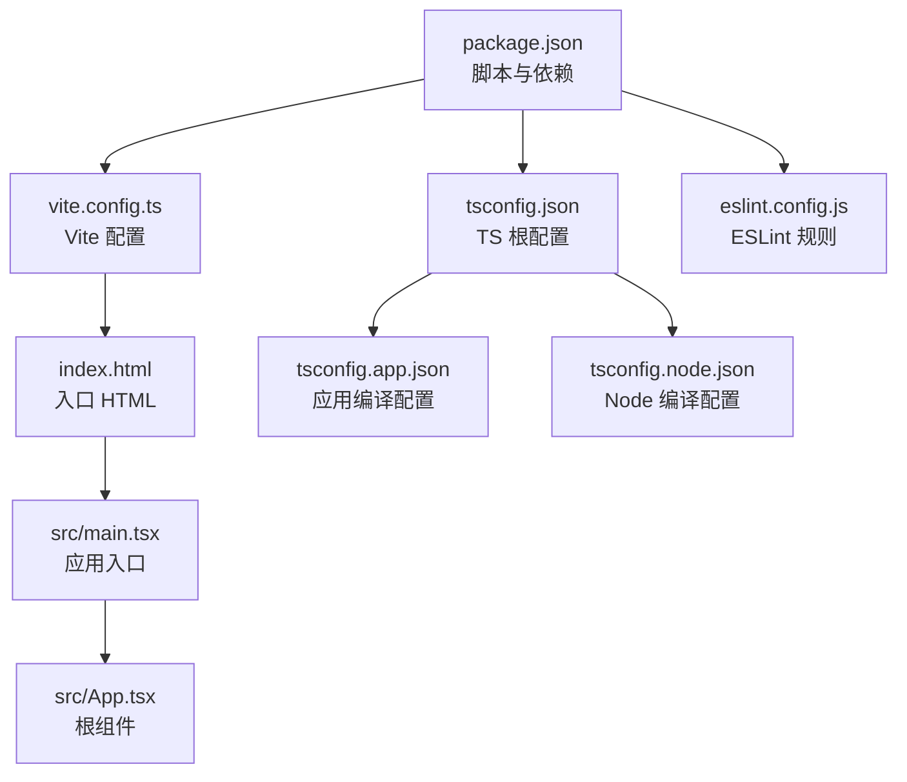
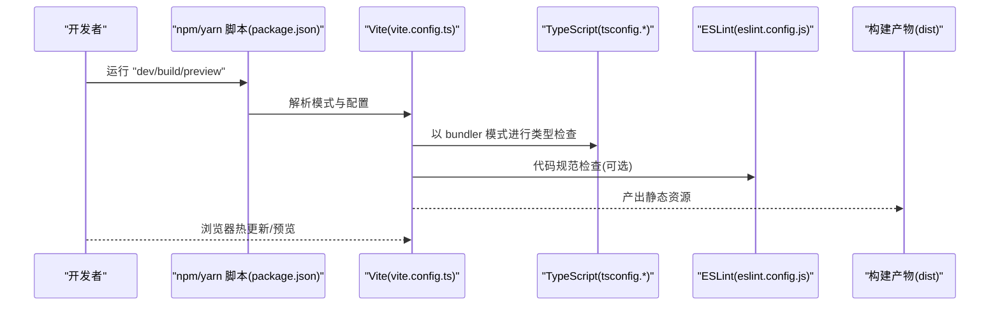
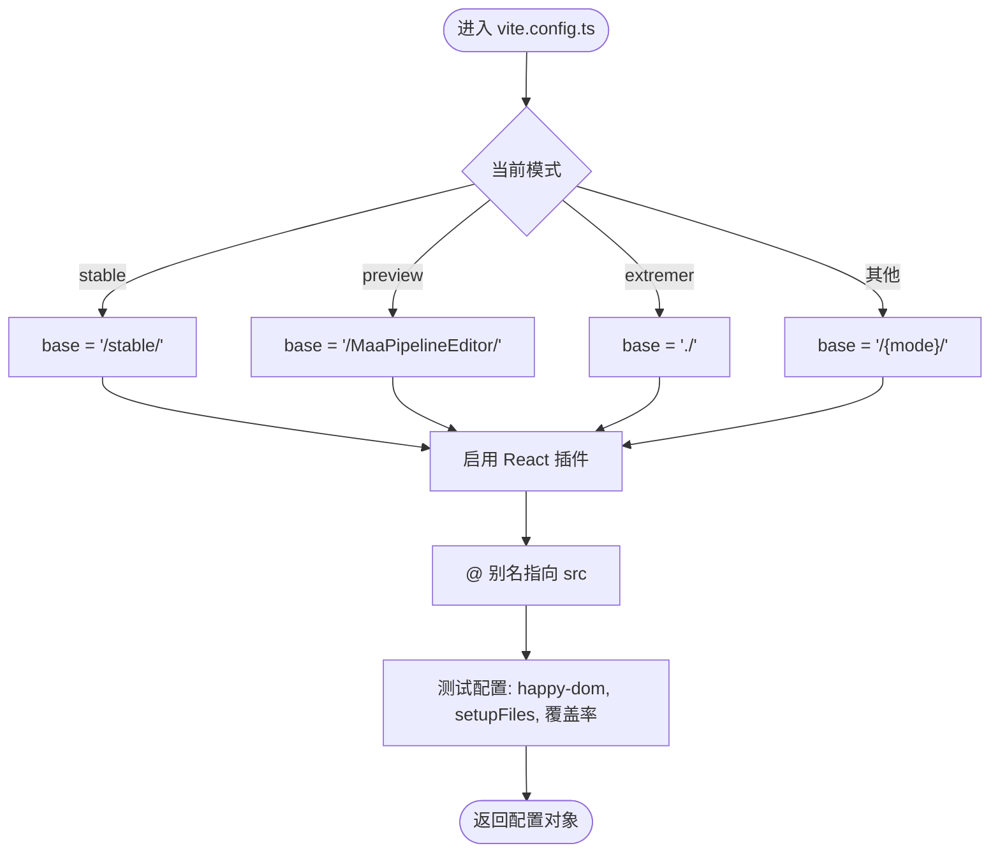
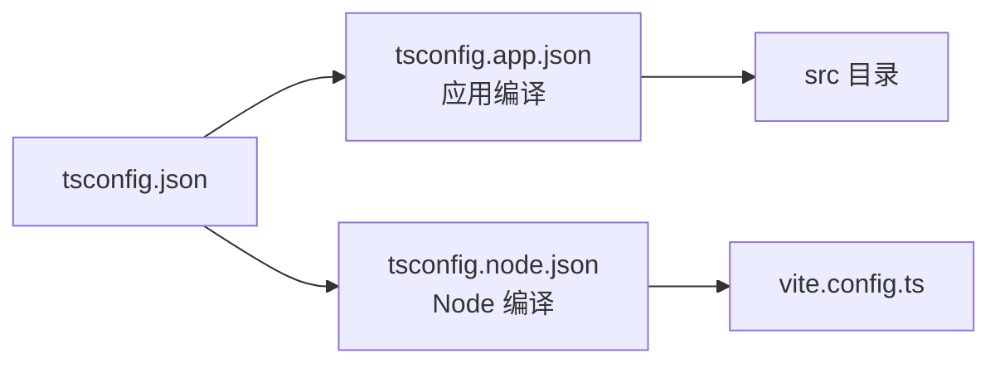
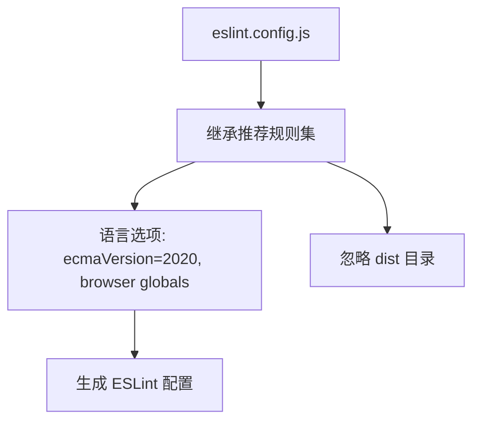
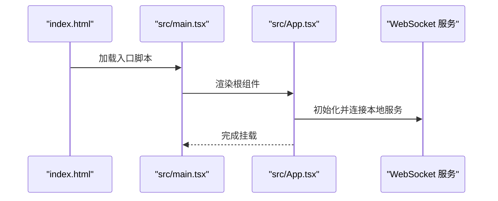
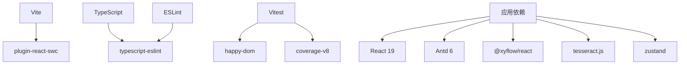

# 构建配置系统

<cite>
**本文引用的文件**
- [vite.config.ts](file://vite.config.ts)
- [package.json](file://package.json)
- [eslint.config.js](file://eslint.config.js)
- [tsconfig.json](file://tsconfig.json)
- [tsconfig.app.json](file://tsconfig.app.json)
- [tsconfig.node.json](file://tsconfig.node.json)
- [index.html](file://index.html)
- [src/main.tsx](file://src/main.tsx)
- [src/App.tsx](file://src/App.tsx)
</cite>

## 目录
1. [简介](#简介)
2. [项目结构](#项目结构)
3. [核心组件](#核心组件)
4. [架构总览](#架构总览)
5. [详细组件分析](#详细组件分析)
6. [依赖关系分析](#依赖关系分析)
7. [性能考虑](#性能考虑)
8. [故障排查指南](#故障排查指南)
9. [结论](#结论)
10. [附录](#附录)

## 简介
本文件系统性梳理 MaaPipelineEditor 前端构建配置体系，覆盖 Vite 构建工具配置（开发服务器、构建优化、插件、别名映射）、TypeScript 编译配置（类型检查、模块解析、编译目标、装饰器支持）、ESLint 代码规范（规则、插件、自动修复）、以及包管理脚本与依赖。同时提供开发环境搭建、生产构建优化与性能调优的实践建议。

## 项目结构
前端工程位于仓库根目录，采用 Vite + React + TypeScript 技术栈，配合 ESLint 与 Vitest 测试框架。关键配置文件分布如下：
- 构建与开发：vite.config.ts、index.html、src/main.tsx、src/App.tsx
- 类型系统：tsconfig.json、tsconfig.app.json、tsconfig.node.json
- 代码规范：eslint.config.js
- 包管理与脚本：package.json

图表来源
- [package.json:1-65](file://package.json#L1-L65)
- [vite.config.ts:1-41](file://vite.config.ts#L1-L41)
- [index.html:1-32](file://index.html#L1-L32)
- [src/main.tsx:1-18](file://src/main.tsx#L1-L18)
- [src/App.tsx:1-333](file://src/App.tsx#L1-L333)
- [tsconfig.json:1-8](file://tsconfig.json#L1-L8)
- [tsconfig.app.json:1-27](file://tsconfig.app.json#L1-L27)
- [tsconfig.node.json:1-26](file://tsconfig.node.json#L1-L26)
- [eslint.config.js:1-24](file://eslint.config.js#L1-L24)

章节来源
- [package.json:1-65](file://package.json#L1-L65)
- [vite.config.ts:1-41](file://vite.config.ts#L1-L41)
- [index.html:1-32](file://index.html#L1-L32)
- [src/main.tsx:1-18](file://src/main.tsx#L1-L18)
- [src/App.tsx:1-333](file://src/App.tsx#L1-L333)
- [tsconfig.json:1-8](file://tsconfig.json#L1-L8)
- [tsconfig.app.json:1-27](file://tsconfig.app.json#L1-L27)
- [tsconfig.node.json:1-26](file://tsconfig.node.json#L1-L26)
- [eslint.config.js:1-24](file://eslint.config.js#L1-L24)

## 核心组件
- Vite 构建配置：基于模式的 base 路径、React 插件、路径别名、测试环境与覆盖率配置
- TypeScript 编译配置：应用与 Node 环境双配置，严格模式与 bundler 模式
- ESLint 规则：推荐规则集、React Hooks、React Refresh、TS 扩展
- 包管理脚本：开发、构建、预览、文档、本地服务、代码检查、发布等

章节来源
- [vite.config.ts:5-40](file://vite.config.ts#L5-L40)
- [tsconfig.app.json:2-26](file://tsconfig.app.json#L2-L26)
- [tsconfig.node.json:2-25](file://tsconfig.node.json#L2-L25)
- [eslint.config.js:8-23](file://eslint.config.js#L8-L23)
- [package.json:6-19](file://package.json#L6-L19)

## 架构总览
下图展示从开发到生产的整体流程：开发者通过 npm/yarn 脚本启动 Vite 开发服务器，Vite 依据 vite.config.ts 解析别名与插件；TypeScript 编译由 tsconfig.app.json 控制；ESLint 在编辑器与 CI 中执行静态检查；最终产物由 Vite 构建输出至 dist 目录。

图表来源
- [package.json:6-19](file://package.json#L6-L19)
- [vite.config.ts:5-40](file://vite.config.ts#L5-L40)
- [tsconfig.app.json:2-26](file://tsconfig.app.json#L2-L26)
- [eslint.config.js:8-23](file://eslint.config.js#L8-L23)

## 详细组件分析

### Vite 构建配置
- 模式化 base 路径
  - stable 模式默认前缀为 /stable/
  - preview 模式为 /MaaPipelineEditor/
  - extremer 模式为 ./（相对路径）
  - 其他模式为 /{mode}/
- 插件与别名
  - 使用 @vitejs/plugin-react-swc 提升开发体验
  - 路径别名 @ 指向 src 目录，便于统一导入
- 测试配置
  - 全局测试环境、happy-dom 环境、setupFiles
  - 覆盖率提供者为 v8，报告器包含文本、JSON、HTML、LCov
  - 排除 node_modules、tests、类型声明、配置文件、mockData、dist
- 开发服务器与预览
  - dev 启动开发服务器
  - preview 启动静态预览服务器

图表来源
- [vite.config.ts:5-40](file://vite.config.ts#L5-L40)

章节来源
- [vite.config.ts:5-40](file://vite.config.ts#L5-L40)

### TypeScript 编译配置
- 根配置 tsconfig.json
  - 通过 references 引用应用与 Node 两套配置，实现分层编译
- 应用配置 tsconfig.app.json
  - 目标 ES2022、模块 ESNext、JSX 使用 react-jsx
  - 模块解析采用 bundler 模式，支持 TS 扩展导入与 verbatimModuleSyntax
  - 严格模式开启，禁用 emit，避免额外输出
  - 包含 src 目录
- Node 配置 tsconfig.node.json
  - 目标 ES2023，模块解析同样为 bundler
  - 仅包含 vite.config.ts，确保构建时类型安全
  - 严格模式与 erasableSyntaxOnly 等选项提升类型检查质量

图表来源
- [tsconfig.json:1-8](file://tsconfig.json#L1-L8)
- [tsconfig.app.json:1-27](file://tsconfig.app.json#L1-L27)
- [tsconfig.node.json:1-26](file://tsconfig.node.json#L1-L26)

章节来源
- [tsconfig.json:1-8](file://tsconfig.json#L1-L8)
- [tsconfig.app.json:2-26](file://tsconfig.app.json#L2-L26)
- [tsconfig.node.json:2-25](file://tsconfig.node.json#L2-L25)

### ESLint 代码规范配置
- 规则集
  - 继承 @eslint/js 推荐规则
  - 使用 typescript-eslint 推荐配置
  - React Hooks 最新推荐配置
  - React Refresh 在 Vite 环境下的推荐配置
- 语言选项
  - ecmaVersion 2020
  - 浏览器全局变量
- 忽略项
  - dist 目录忽略

图表来源
- [eslint.config.js:8-23](file://eslint.config.js#L8-L23)

章节来源
- [eslint.config.js:1-24](file://eslint.config.js#L1-L24)

### 包管理与脚本命令
- 开发与运行
  - dev：启动 Vite 开发服务器
  - server：启动 LocalBridge 本地服务（需在 LocalBridge 子目录执行）
  - doc：启动文档站点（VitePress）
- 构建与预览
  - build：生产构建
  - build-past：带模式 mfw_5_0 的构建
  - build:extremer：构建并复制到 Extremer 前端目录
  - preview：本地预览构建产物
- 质量与维护
  - lint：执行 ESLint 检查
  - reset、release、retag：版本与 Git 相关操作
- 依赖与版本
  - React 19、Ant Design 6、@xyflow/react、tesseract.js、zustand 等
  - Vite 7、TypeScript ~5.8、ESLint 9、Vitest 4 等

章节来源
- [package.json:6-63](file://package.json#L6-L63)

### 入口与运行时
- index.html
  - 设置基础 meta 信息、favicon、标题
  - 通过 script 标签引入应用入口模块
- src/main.tsx
  - 引入样式、创建 React 根节点、初始化 WebSocket
- src/App.tsx
  - 应用主组件，负责布局、面板、状态管理、Wails 环境适配、WebSocket 连接策略、文件拖拽导入、分享参数处理等

图表来源
- [index.html:1-32](file://index.html#L1-L32)
- [src/main.tsx:1-18](file://src/main.tsx#L1-L18)
- [src/App.tsx:110-293](file://src/App.tsx#L110-L293)

章节来源
- [index.html:1-32](file://index.html#L1-L32)
- [src/main.tsx:1-18](file://src/main.tsx#L1-L18)
- [src/App.tsx:110-293](file://src/App.tsx#L110-L293)

## 依赖关系分析
- Vite 与插件
  - @vitejs/plugin-react-swc 用于 React 开发加速
- TypeScript 与 ESLint
  - typescript-eslint 与 @typescript-eslint/* 生态协同
  - ESLint 配置继承推荐规则集，保证一致性
- 测试
  - Vitest + happy-dom + @vitest/coverage-v8 提供单元测试与覆盖率
- 依赖生态
  - React 19、Ant Design 6、@xyflow/react、tesseract.js、zustand 等

图表来源
- [package.json:41-63](file://package.json#L41-L63)
- [eslint.config.js:8-23](file://eslint.config.js#L8-L23)
- [vite.config.ts:1-3](file://vite.config.ts#L1-L3)

章节来源
- [package.json:41-63](file://package.json#L41-L63)
- [eslint.config.js:8-23](file://eslint.config.js#L8-L23)
- [vite.config.ts:1-3](file://vite.config.ts#L1-L3)

## 性能考虑
- 构建优化建议
  - 使用 Vite 的内置压缩与 Tree Shaking，确保生产构建体积最小化
  - 合理拆分路由与组件，结合动态导入进一步降低首屏体积
  - 保持 TypeScript 使用 bundler 模式，避免重复类型检查开销
- 开发体验
  - 使用 React 插件与热更新，减少重启时间
  - 在测试中启用 happy-dom，避免真实 DOM 造成的性能损耗
- 资源与路径
  - 模式化 base 配置确保不同部署环境下的资源正确加载
  - 路径别名 @ 指向 src，减少深层相对路径带来的维护成本

## 故障排查指南
- 构建失败或模块解析错误
  - 检查 tsconfig.app.json 的 moduleResolution 与 bundler 模式
  - 确认 vite.config.ts 中的 @ 别名指向正确
- 测试覆盖率异常
  - 检查 vitest 覆盖率排除列表，确认未误排除业务代码
  - 确保 setupFiles 正确加载
- ESLint 报错
  - 确认 eslint.config.js 继承链完整，语言选项与 globals 配置正确
  - 在编辑器中启用 ESLint 插件，避免与 IDE 内置规则冲突
- 预览路径问题
  - 根据部署模式调整 base 路径，避免静态资源 404

章节来源
- [vite.config.ts:17-38](file://vite.config.ts#L17-L38)
- [tsconfig.app.json:10-16](file://tsconfig.app.json#L10-L16)
- [eslint.config.js:18-22](file://eslint.config.js#L18-L22)

## 结论
本项目的前端构建配置以 Vite 为核心，结合 TypeScript 严格模式与 ESLint 推荐规则，形成高效、可维护的开发与构建体系。通过模式化 base、路径别名与测试覆盖率配置，提升了多环境部署与团队协作效率。建议在后续迭代中持续关注 Vite 与 TypeScript 的新特性，适时升级以获得更好的性能与开发体验。

## 附录
- 开发环境搭建步骤
  - 安装依赖：yarn install
  - 启动开发：yarn dev
  - 启动本地服务：yarn server（在 LocalBridge 子目录）
  - 启动文档：yarn doc
- 生产构建与发布
  - 生产构建：yarn build
  - 预览构建：yarn preview
  - 特殊模式构建：yarn build-past
  - Extremer 集成：yarn build:extremer
- 代码质量
  - 代码检查：yarn lint
  - 单元测试：yarn test（如存在）

章节来源
- [package.json:6-19](file://package.json#L6-L19)