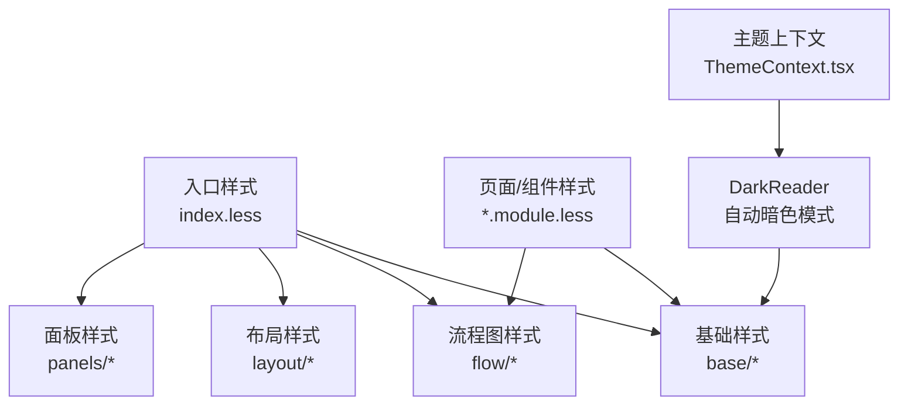
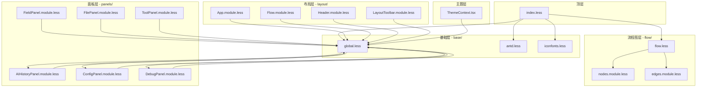
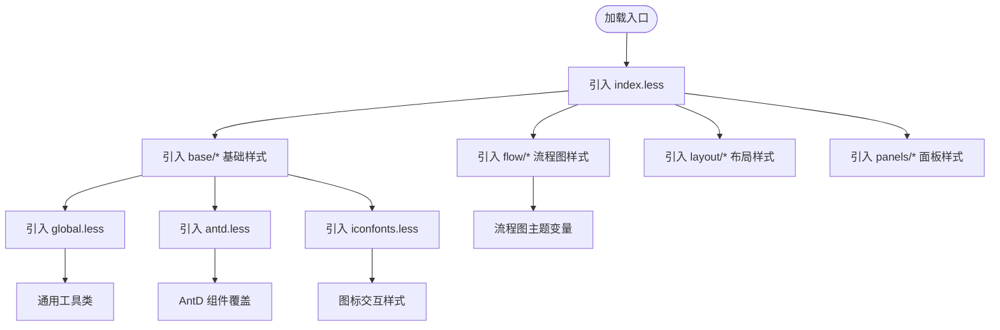
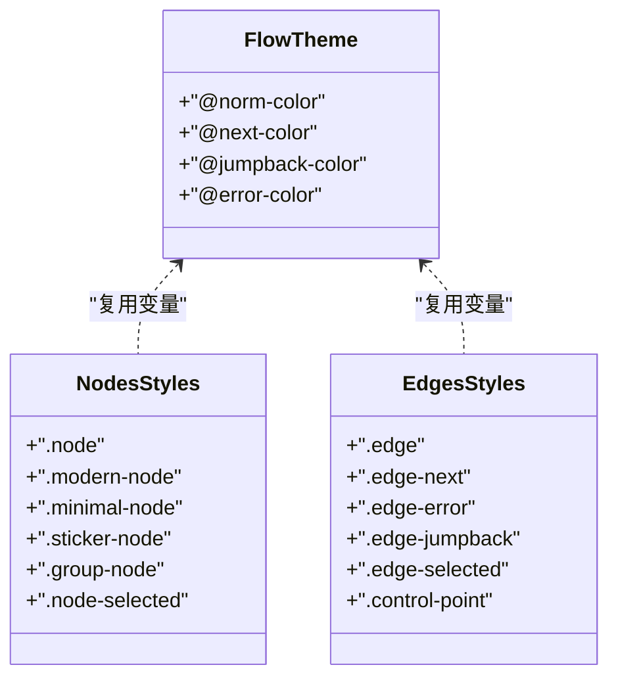
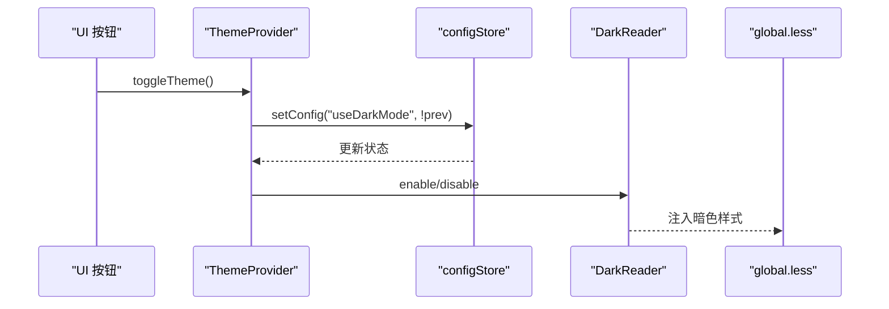
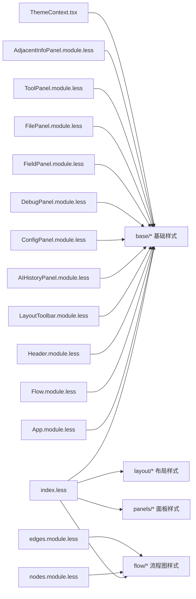

# 样式系统设计

<cite>
**本文引用的文件**
- [src/styles/index.less](file://src/styles/index.less)
- [src/styles/base/global.less](file://src/styles/base/global.less)
- [src/styles/base/antd.less](file://src/styles/base/antd.less)
- [src/styles/base/iconfonts.less](file://src/styles/base/iconfonts.less)
- [src/styles/flow/flow.less](file://src/styles/flow/flow.less)
- [src/styles/flow/nodes.module.less](file://src/styles/flow/nodes.module.less)
- [src/styles/flow/edges.module.less](file://src/styles/flow/edges.module.less)
- [src/styles/layout/App.module.less](file://src/styles/layout/App.module.less)
- [src/styles/layout/Flow.module.less](file://src/styles/layout/Flow.module.less)
- [src/styles/layout/Header.module.less](file://src/styles/layout/Header.module.less)
- [src/styles/layout/LayoutToolbar.module.less](file://src/styles/layout/LayoutToolbar.module.less)
- [src/styles/panels/AIHistoryPanel.module.less](file://src/styles/panels/AIHistoryPanel.module.less)
- [src/styles/panels/ConfigPanel.module.less](file://src/styles/panels/ConfigPanel.module.less)
- [src/styles/panels/DebugPanel.module.less](file://src/styles/panels/DebugPanel.module.less)
- [src/styles/panels/FieldPanel.module.less](file://src/styles/panels/FieldPanel.module.less)
- [src/styles/panels/FilePanel.module.less](file://src/styles/panels/FilePanel.module.less)
- [src/styles/panels/ToolPanel.module.less](file://src/styles/panels/ToolPanel.module.less)
- [src/components/panels/main/AdjacentInfoPanel.module.less](file://src/components/panels/main/AdjacentInfoPanel.module.less)
- [src/contexts/ThemeContext.tsx](file://src/contexts/ThemeContext.tsx)
</cite>

## 更新摘要
**变更内容**
- 更新样式文件组织结构：从单一 `src/styles/` 目录迁移到四个子目录结构
- 新增 `src/styles/base/`、`src/styles/flow/`、`src/styles/layout/`、`src/styles/panels/` 目录
- 更新样式导入路径和组织方式，提升样式系统的模块化程度
- 重新整理样式分类，增强可维护性和扩展性

## 目录
1. [简介](#简介)
2. [项目结构](#项目结构)
3. [核心组件](#核心组件)
4. [架构总览](#架构总览)
5. [详细组件分析](#详细组件分析)
6. [依赖关系分析](#依赖关系分析)
7. [性能考量](#性能考量)
8. [故障排查指南](#故障排查指南)
9. [结论](#结论)
10. [附录](#附录)

## 简介
本文件系统性阐述 MaaPipelineEditor 的样式系统架构设计，重点覆盖以下方面：
- Less 组织结构：全局样式、模块化样式、主题样式分层
- 命名规范与隔离：BEM 方法论、CSS Modules 使用、样式作用域隔离
- Ant Design 集成与定制：主题变量、组件覆盖、响应式设计
- 性能优化：样式分割、按需加载、缓存策略
- 调试与维护：实用指南、团队协作建议

**更新** 样式系统已完成重构，从单一目录结构迁移到模块化子目录结构，提升了系统的可维护性和扩展性。

## 项目结构
样式系统采用"入口聚合 + 层次化模块 + 子目录分类"的组织方式：
- 入口聚合：通过 index.less 汇总 base、flow、layout、panels 等基础样式
- 基础样式：base 目录提供全局工具类、Ant Design 覆盖、图标字体样式
- 流程图样式：flow 目录定义连接线、节点、边等视觉变量与动画
- 布局样式：layout 目录管理应用整体布局、头部、工具栏等样式
- 面板样式：panels 目录包含各个功能面板的专用样式
- 主题样式：通过 ThemeContext 控制暗色模式，结合 DarkReader 实现自动适配

**图表来源**
- [src/styles/index.less:1-30](file://src/styles/index.less#L1-L30)
- [src/styles/base/global.less:1-155](file://src/styles/base/global.less#L1-L155)
- [src/styles/base/antd.less:1-47](file://src/styles/base/antd.less#L1-L47)
- [src/styles/flow/flow.less:1-26](file://src/styles/flow/flow.less#L1-L26)
- [src/styles/base/iconfonts.less:1-11](file://src/styles/base/iconfonts.less#L1-L11)
- [src/contexts/ThemeContext.tsx:1-68](file://src/contexts/ThemeContext.tsx#L1-L68)

**章节来源**
- [src/styles/index.less:1-30](file://src/styles/index.less#L1-L30)
- [src/styles/base/global.less:1-155](file://src/styles/base/global.less#L1-L155)
- [src/styles/base/antd.less:1-47](file://src/styles/base/antd.less#L1-L47)
- [src/styles/flow/flow.less:1-26](file://src/styles/flow/flow.less#L1-L26)
- [src/styles/base/iconfonts.less:1-11](file://src/styles/base/iconfonts.less#L1-L11)
- [src/contexts/ThemeContext.tsx:1-68](file://src/contexts/ThemeContext.tsx#L1-L68)

## 核心组件
- 入口样式聚合：统一引入基础样式，确保加载顺序与依赖关系明确
- 基础工具与覆盖：提供通用布局与交互类，以及 Ant Design 组件的微调
- 流程图主题：定义连接线、节点、边等视觉变量与动画
- 页面/组件模块：每个页面或组件拥有独立的 CSS Modules 文件，避免全局污染
- 主题上下文：集中管理暗色模式开关，并通过 DarkReader 自动注入样式

**更新** 新的目录结构将样式功能进一步细分，提升了模块化程度和维护效率。

**章节来源**
- [src/styles/index.less:1-30](file://src/styles/index.less#L1-L30)
- [src/styles/base/global.less:1-155](file://src/styles/base/global.less#L1-L155)
- [src/styles/flow/flow.less:1-26](file://src/styles/flow/flow.less#L1-L26)
- [src/styles/flow/nodes.module.less:1-795](file://src/styles/flow/nodes.module.less#L1-L795)
- [src/styles/flow/edges.module.less:1-98](file://src/styles/flow/edges.module.less#L1-L98)
- [src/contexts/ThemeContext.tsx:1-68](file://src/contexts/ThemeContext.tsx#L1-L68)

## 架构总览
样式系统遵循"自顶向下 + 模块化分层"的设计理念：
- 顶层：index.less 负责全局引入与初始化
- 中层：base 目录提供通用类与 AntD 覆盖；flow 目录定义流程图主题；layout 目录管理应用布局
- 底层：panels 目录包含各功能面板的专用样式
- 主题层：ThemeContext.tsx 管理暗色模式，DarkReader 动态注入样式

**图表来源**
- [src/styles/index.less:1-30](file://src/styles/index.less#L1-L30)
- [src/styles/base/global.less:1-155](file://src/styles/base/global.less#L1-L155)
- [src/styles/flow/flow.less:1-26](file://src/styles/flow/flow.less#L1-L26)
- [src/styles/base/antd.less:1-47](file://src/styles/base/antd.less#L1-L47)
- [src/styles/base/iconfonts.less:1-11](file://src/styles/base/iconfonts.less#L1-L11)
- [src/styles/layout/App.module.less:1-32](file://src/styles/layout/App.module.less#L1-L32)
- [src/styles/layout/Flow.module.less:1-6](file://src/styles/layout/Flow.module.less#L1-L6)
- [src/styles/layout/Header.module.less:1-127](file://src/styles/layout/Header.module.less#L1-L127)
- [src/styles/layout/LayoutToolbar.module.less:1-100](file://src/styles/layout/LayoutToolbar.module.less#L1-L100)
- [src/styles/panels/AIHistoryPanel.module.less:1-150](file://src/styles/panels/AIHistoryPanel.module.less#L1-L150)
- [src/styles/panels/ConfigPanel.module.less:1-200](file://src/styles/panels/ConfigPanel.module.less#L1-L200)
- [src/styles/panels/DebugPanel.module.less:1-180](file://src/styles/panels/DebugPanel.module.less#L1-L180)
- [src/styles/panels/FieldPanel.module.less:1-250](file://src/styles/panels/FieldPanel.module.less#L1-L250)
- [src/styles/panels/FilePanel.module.less:1-220](file://src/styles/panels/FilePanel.module.less#L1-L220)
- [src/styles/panels/ToolPanel.module.less:1-160](file://src/styles/panels/ToolPanel.module.less#L1-L160)
- [src/contexts/ThemeContext.tsx:1-68](file://src/contexts/ThemeContext.tsx#L1-L68)

## 详细组件分析

### 基础样式与 Ant Design 定制
- 全局工具类：提供居中、省略、可伸缩布局等通用类，减少重复样式
- AntD 覆盖：针对下拉项换行、AutoComplete 高度限制、标签页下划线与通知按钮宽度进行微调
- 初始化：重置基础元素的 margin/padding、字体与溢出策略，保证跨平台一致性

**图表来源**
- [src/styles/index.less:1-30](file://src/styles/index.less#L1-L30)
- [src/styles/base/global.less:1-155](file://src/styles/base/global.less#L1-L155)
- [src/styles/base/antd.less:1-47](file://src/styles/base/antd.less#L1-L47)
- [src/styles/flow/flow.less:1-26](file://src/styles/flow/flow.less#L1-L26)
- [src/styles/base/iconfonts.less:1-11](file://src/styles/base/iconfonts.less#L1-L11)

**章节来源**
- [src/styles/base/global.less:1-155](file://src/styles/base/global.less#L1-L155)
- [src/styles/base/antd.less:1-47](file://src/styles/base/antd.less#L1-L47)
- [src/styles/index.less:1-30](file://src/styles/index.less#L1-L30)

### 流程图主题与节点样式
- 主题变量：在 flow.less 中定义连接线颜色变量，在 nodes.module.less 与 edges.module.less 中复用
- 节点样式：提供 classic/minimal/modern/sticker/group 等多种节点风格，支持选中态与交互反馈
- 边样式：定义默认边、跳转边、错误边及控制点样式，包含动画与过渡效果

**图表来源**
- [src/styles/flow/flow.less:1-26](file://src/styles/flow/flow.less#L1-L26)
- [src/styles/flow/nodes.module.less:1-795](file://src/styles/flow/nodes.module.less#L1-L795)
- [src/styles/flow/edges.module.less:1-98](file://src/styles/flow/edges.module.less#L1-L98)

**章节来源**
- [src/styles/flow/flow.less:1-26](file://src/styles/flow/flow.less#L1-L26)
- [src/styles/flow/nodes.module.less:1-795](file://src/styles/flow/nodes.module.less#L1-L795)
- [src/styles/flow/edges.module.less:1-98](file://src/styles/flow/edges.module.less#L1-L98)

### 布局样式系统
- 应用布局：App.module.less 管理整体应用容器和基础布局
- 流程图布局：Flow.module.less 专门处理流程图画布的布局和样式
- 头部导航：Header.module.less 实现响应式头部导航栏
- 工具栏：LayoutToolbar.module.less 提供布局工具栏的样式控制

**新增** 布局样式系统独立出来，专门处理应用的整体布局和导航样式。

**章节来源**
- [src/styles/layout/App.module.less:1-32](file://src/styles/layout/App.module.less#L1-L32)
- [src/styles/layout/Flow.module.less:1-6](file://src/styles/layout/Flow.module.less#L1-L6)
- [src/styles/layout/Header.module.less:1-127](file://src/styles/layout/Header.module.less#L1-L127)
- [src/styles/layout/LayoutToolbar.module.less:1-100](file://src/styles/layout/LayoutToolbar.module.less#L1-L100)

### 面板样式系统
- AI 历史面板：AIHistoryPanel.module.less 专门处理 AI 识别历史的展示样式
- 配置面板：ConfigPanel.module.less 管理应用配置界面的样式
- 调试面板：DebugPanel.module.less 提供调试信息的展示样式
- 字段面板：FieldPanel.module.less 处理字段编辑的样式
- 文件面板：FilePanel.module.less 管理文件浏览的样式
- 工具面板：ToolPanel.module.less 提供各种工具按钮的样式

**新增** 面板样式系统独立出来，每个功能面板都有专门的样式文件，提升了模块化程度。

**章节来源**
- [src/styles/panels/AIHistoryPanel.module.less:1-150](file://src/styles/panels/AIHistoryPanel.module.less#L1-L150)
- [src/styles/panels/ConfigPanel.module.less:1-200](file://src/styles/panels/ConfigPanel.module.less#L1-L200)
- [src/styles/panels/DebugPanel.module.less:1-180](file://src/styles/panels/DebugPanel.module.less#L1-L180)
- [src/styles/panels/FieldPanel.module.less:1-250](file://src/styles/panels/FieldPanel.module.less#L1-L250)
- [src/styles/panels/FilePanel.module.less:1-220](file://src/styles/panels/FilePanel.module.less#L1-L220)
- [src/styles/panels/ToolPanel.module.less:1-160](file://src/styles/panels/ToolPanel.module.less#L1-L160)

### 主题系统与暗色模式
- 主题上下文：ThemeContext.tsx 提供 isDark、toggleTheme、setTheme 接口
- 暗色模式：通过 DarkReader 在运行时启用/禁用暗色滤镜，自动适配全局样式
- 状态同步：useConfigStore 读取/写入 useDarkMode 配置，驱动主题切换

**图表来源**
- [src/contexts/ThemeContext.tsx:1-68](file://src/contexts/ThemeContext.tsx#L1-L68)
- [src/styles/base/global.less:1-155](file://src/styles/base/global.less#L1-L155)

**章节来源**
- [src/contexts/ThemeContext.tsx:1-68](file://src/contexts/ThemeContext.tsx#L1-L68)

## 依赖关系分析
- 入口依赖：index.less 依赖 base、flow、layout、panels 子目录
- 组件依赖：各 module.less 依赖对应的基类样式文件
- 主题依赖：ThemeContext.tsx 依赖 DarkReader 并影响全局样式

**图表来源**
- [src/styles/index.less:1-30](file://src/styles/index.less#L1-L30)
- [src/styles/base/global.less:1-155](file://src/styles/base/global.less#L1-L155)
- [src/styles/flow/flow.less:1-26](file://src/styles/flow/flow.less#L1-L26)
- [src/styles/layout/App.module.less:1-32](file://src/styles/layout/App.module.less#L1-L32)
- [src/styles/panels/AIHistoryPanel.module.less:1-150](file://src/styles/panels/AIHistoryPanel.module.less#L1-L150)
- [src/contexts/ThemeContext.tsx:1-68](file://src/contexts/ThemeContext.tsx#L1-L68)

**章节来源**
- [src/styles/index.less:1-30](file://src/styles/index.less#L1-L30)
- [src/styles/base/global.less:1-155](file://src/styles/base/global.less#L1-L155)
- [src/styles/flow/flow.less:1-26](file://src/styles/flow/flow.less#L1-L26)
- [src/styles/layout/App.module.less:1-32](file://src/styles/layout/App.module.less#L1-L32)
- [src/styles/panels/AIHistoryPanel.module.less:1-150](file://src/styles/panels/AIHistoryPanel.module.less#L1-L150)
- [src/contexts/ThemeContext.tsx:1-68](file://src/contexts/ThemeContext.tsx#L1-L68)

## 性能考量
- 样式分割与按需加载
  - 将页面/组件样式拆分为独立 module.less，配合构建工具按需打包，减少初始 CSS 体积
  - 入口仅引入必要基础样式（base、flow、layout、panels），避免冗余
- 缓存策略
  - 利用浏览器缓存与构建产物指纹化，确保样式更新后可被正确替换
  - DarkReader 注入的暗色样式为运行时注入，避免额外静态资源
- 选择器复杂度与重绘
  - 优先使用类选择器，避免深层后代选择器导致的重绘
  - 使用 CSS 变量与工具类（如 ellipsis）降低重复定义
- 动画与过渡
  - 合理使用 transition 与 transform，避免频繁触发回流
  - 控制点与边的动画采用轻量级属性，保持流畅体验

**更新** 新的目录结构使得样式文件更加模块化，便于按需加载和缓存优化。

## 故障排查指南
- 样式未生效
  - 检查 index.less 的引入顺序是否正确
  - 确认组件是否使用了正确的 CSS Modules 类名
- AntD 组件样式异常
  - 查看 antd.less 是否覆盖了目标组件类名
  - 注意 !important 的使用场景与副作用
- 暗色模式不生效
  - 确认 ThemeContext.tsx 中 useDarkMode 配置已更新
  - 检查 DarkReader 是否成功启用/禁用
- 响应式问题
  - 检查媒体查询断点与组件布局是否匹配
  - 确保容器具备足够的高度/宽度以容纳内容
- 目录结构问题
  - 确认样式文件路径是否正确指向新的子目录结构
  - 检查 @import 语句中的相对路径是否匹配新的目录层级

**更新** 新增目录结构相关的故障排查指导。

**章节来源**
- [src/styles/index.less:1-30](file://src/styles/index.less#L1-L30)
- [src/styles/base/antd.less:1-47](file://src/styles/base/antd.less#L1-L47)
- [src/contexts/ThemeContext.tsx:1-68](file://src/contexts/ThemeContext.tsx#L1-L68)

## 结论
MaaPipelineEditor 的样式系统通过"入口聚合 + 层次化模块 + 子目录分类 + 主题上下文"的架构实现了清晰的职责分离与良好的扩展性。新的目录结构将样式功能细分为 base、flow、layout、panels 四个主要类别，显著提升了系统的可维护性和模块化程度。Less 的变量与工具类提升了复用性，CSS Modules 确保了样式隔离，AntD 定制满足产品化需求，DarkReader 提供了便捷的主题能力。配合合理的性能策略与调试指南，可在保证开发效率的同时维持高质量的用户体验。

**更新** 样式系统的重构不仅改善了代码组织结构，还为未来的功能扩展和维护提供了更好的基础。

## 附录
- 命名规范与最佳实践
  - 命名：采用 BEM 风格，块（Block）_修饰（Modifier）--状态（State）组合
  - 作用域：页面/组件样式统一使用 CSS Modules，类名由构建工具生成唯一标识
  - 变量：在 flow.less 中集中定义颜色与尺寸变量，避免硬编码
  - 覆盖：AntD 覆盖尽量局部化，使用 :global 时注意作用域边界
  - 响应式：在组件级样式中使用媒体查询，避免全局污染
  - 目录：按照功能分类组织样式文件，base/flow/layout/panels 四大类清晰划分
- 团队协作建议
  - 新增样式前先在 base 目录中评估复用性
  - 组件样式文件命名与组件同名，便于定位与维护
  - 主题相关改动统一通过 ThemeContext 管理，避免分散配置
  - 遵循新的目录结构约定，按功能分类存放样式文件
  - 更新样式时注意保持与其他模块的依赖关系