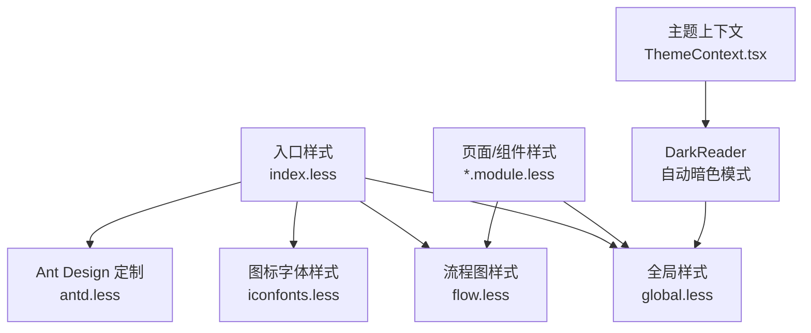
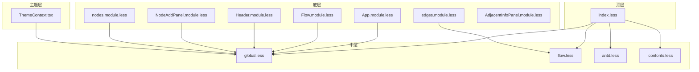
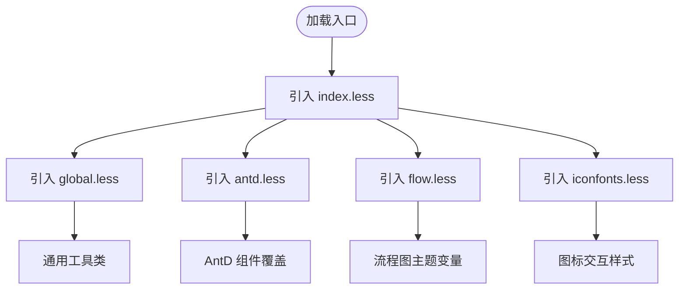
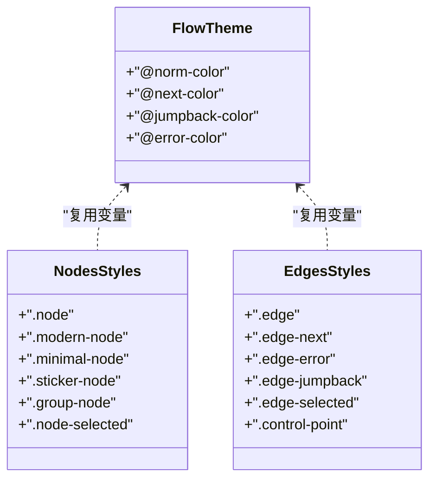
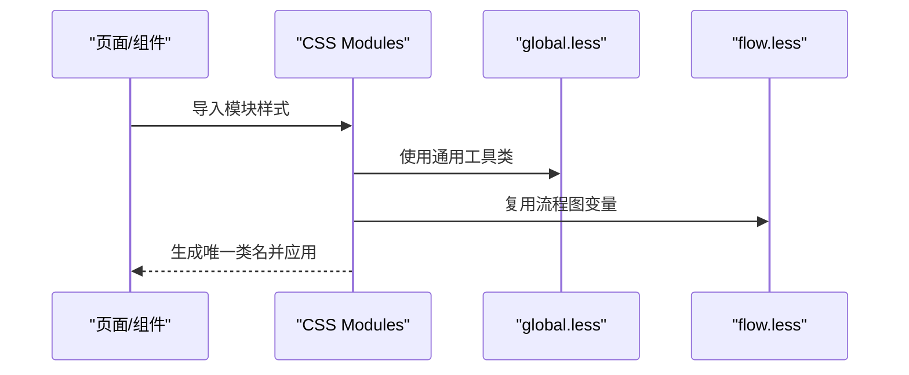
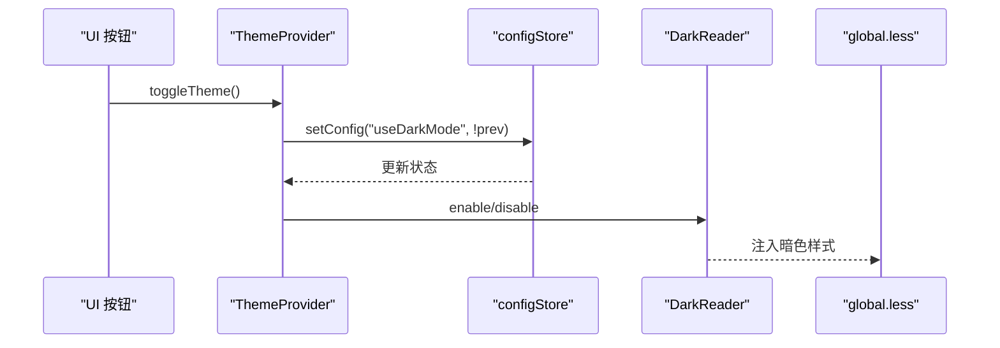
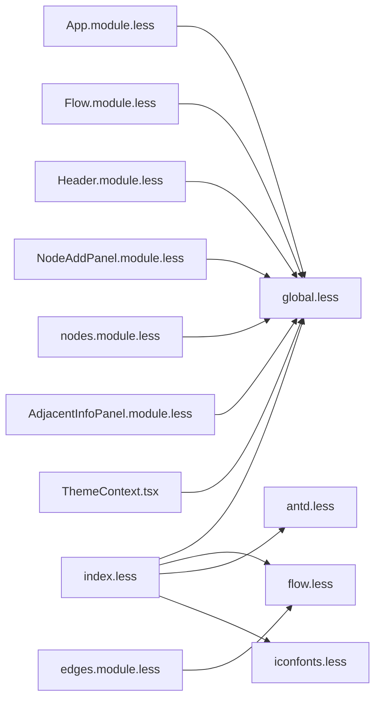

# 样式系统设计

<cite>
**本文引用的文件**
- [src/styles/index.less](file://src/styles/index.less)
- [src/styles/global.less](file://src/styles/global.less)
- [src/styles/antd.less](file://src/styles/antd.less)
- [src/styles/flow.less](file://src/styles/flow.less)
- [src/styles/iconfonts.less](file://src/styles/iconfonts.less)
- [src/styles/App.module.less](file://src/styles/App.module.less)
- [src/styles/Flow.module.less](file://src/styles/Flow.module.less)
- [src/styles/Header.module.less](file://src/styles/Header.module.less)
- [src/styles/NodeAddPanel.module.less](file://src/styles/NodeAddPanel.module.less)
- [src/styles/nodes.module.less](file://src/styles/nodes.module.less)
- [src/styles/edges.module.less](file://src/styles/edges.module.less)
- [src/components/panels/main/AdjacentInfoPanel.module.less](file://src/components/panels/main/AdjacentInfoPanel.module.less)
- [src/contexts/ThemeContext.tsx](file://src/contexts/ThemeContext.tsx)
</cite>

## 目录
1. [简介](#简介)
2. [项目结构](#项目结构)
3. [核心组件](#核心组件)
4. [架构总览](#架构总览)
5. [详细组件分析](#详细组件分析)
6. [依赖关系分析](#依赖关系分析)
7. [性能考量](#性能考量)
8. [故障排查指南](#故障排查指南)
9. [结论](#结论)
10. [附录](#附录)

## 简介
本文件系统性阐述 MaaPipelineEditor 的样式系统架构设计，重点覆盖以下方面：
- Less 组织结构：全局样式、模块化样式、主题样式分层
- 命名规范与隔离：BEM 方法论、CSS Modules 使用、样式作用域隔离
- Ant Design 集成与定制：主题变量、组件覆盖、响应式设计
- 性能优化：样式分割、按需加载、缓存策略
- 调试与维护：实用指南、团队协作建议

## 项目结构
样式系统采用“入口聚合 + 层次化模块”的组织方式：
- 入口聚合：通过 index.less 汇总 iconfonts、global、flow、antd 等基础样式
- 全局样式：global.less 提供通用工具类与 Ant Design 覆盖
- 模块化样式：各页面/组件以 module.less 形式局部作用域化
- 主题样式：通过 ThemeContext 控制暗色模式，结合 DarkReader 实现自动适配

图表来源
- [src/styles/index.less:1-30](file://src/styles/index.less#L1-L30)
- [src/styles/global.less:1-155](file://src/styles/global.less#L1-L155)
- [src/styles/antd.less:1-47](file://src/styles/antd.less#L1-L47)
- [src/styles/flow.less:1-26](file://src/styles/flow.less#L1-L26)
- [src/styles/iconfonts.less:1-11](file://src/styles/iconfonts.less#L1-L11)
- [src/contexts/ThemeContext.tsx:1-68](file://src/contexts/ThemeContext.tsx#L1-L68)

章节来源
- [src/styles/index.less:1-30](file://src/styles/index.less#L1-L30)
- [src/styles/global.less:1-155](file://src/styles/global.less#L1-L155)
- [src/styles/antd.less:1-47](file://src/styles/antd.less#L1-L47)
- [src/styles/flow.less:1-26](file://src/styles/flow.less#L1-L26)
- [src/styles/iconfonts.less:1-11](file://src/styles/iconfonts.less#L1-L11)
- [src/contexts/ThemeContext.tsx:1-68](file://src/contexts/ThemeContext.tsx#L1-L68)

## 核心组件
- 入口样式聚合：统一引入基础样式，确保加载顺序与依赖关系明确
- 全局工具与覆盖：提供通用布局与交互类，以及 Ant Design 组件的微调
- 流程图主题：定义连接线、节点、边等视觉变量与动画
- 页面/组件模块：每个页面或组件拥有独立的 CSS Modules 文件，避免全局污染
- 主题上下文：集中管理暗色模式开关，并通过 DarkReader 自动注入样式

章节来源
- [src/styles/index.less:1-30](file://src/styles/index.less#L1-L30)
- [src/styles/global.less:1-155](file://src/styles/global.less#L1-L155)
- [src/styles/flow.less:1-26](file://src/styles/flow.less#L1-L26)
- [src/styles/nodes.module.less:1-694](file://src/styles/nodes.module.less#L1-L694)
- [src/styles/edges.module.less:1-98](file://src/styles/edges.module.less#L1-L98)
- [src/contexts/ThemeContext.tsx:1-68](file://src/contexts/ThemeContext.tsx#L1-L68)

## 架构总览
样式系统遵循“自顶向下”的分层设计：
- 顶层：index.less 负责全局引入与初始化
- 中层：global.less 提供通用类与 AntD 覆盖；flow.less 定义流程图主题；antd.less 调整标签页与通知等组件
- 底层：各页面/组件的 module.less 以 CSS Modules 方式局部作用域化
- 主题层：ThemeContext.tsx 管理暗色模式，DarkReader 动态注入样式

图表来源
- [src/styles/index.less:1-30](file://src/styles/index.less#L1-L30)
- [src/styles/global.less:1-155](file://src/styles/global.less#L1-L155)
- [src/styles/flow.less:1-26](file://src/styles/flow.less#L1-L26)
- [src/styles/antd.less:1-47](file://src/styles/antd.less#L1-L47)
- [src/styles/iconfonts.less:1-11](file://src/styles/iconfonts.less#L1-L11)
- [src/styles/App.module.less:1-32](file://src/styles/App.module.less#L1-L32)
- [src/styles/Flow.module.less:1-6](file://src/styles/Flow.module.less#L1-L6)
- [src/styles/Header.module.less:1-127](file://src/styles/Header.module.less#L1-L127)
- [src/styles/NodeAddPanel.module.less:1-428](file://src/styles/NodeAddPanel.module.less#L1-L428)
- [src/styles/nodes.module.less:1-694](file://src/styles/nodes.module.less#L1-L694)
- [src/styles/edges.module.less:1-98](file://src/styles/edges.module.less#L1-L98)
- [src/components/panels/main/AdjacentInfoPanel.module.less:1-121](file://src/components/panels/main/AdjacentInfoPanel.module.less#L1-L121)
- [src/contexts/ThemeContext.tsx:1-68](file://src/contexts/ThemeContext.tsx#L1-L68)

## 详细组件分析

### 全局样式与 Ant Design 定制
- 全局工具类：提供居中、省略、可伸缩布局等通用类，减少重复样式
- AntD 覆盖：针对下拉项换行、AutoComplete 高度限制、标签页下划线与通知按钮宽度进行微调
- 初始化：重置基础元素的 margin/padding、字体与溢出策略，保证跨平台一致性

图表来源
- [src/styles/index.less:1-30](file://src/styles/index.less#L1-L30)
- [src/styles/global.less:1-155](file://src/styles/global.less#L1-L155)
- [src/styles/antd.less:1-47](file://src/styles/antd.less#L1-L47)
- [src/styles/flow.less:1-26](file://src/styles/flow.less#L1-L26)
- [src/styles/iconfonts.less:1-11](file://src/styles/iconfonts.less#L1-L11)

章节来源
- [src/styles/global.less:1-155](file://src/styles/global.less#L1-L155)
- [src/styles/antd.less:1-47](file://src/styles/antd.less#L1-L47)
- [src/styles/index.less:1-30](file://src/styles/index.less#L1-L30)

### 流程图主题与节点样式
- 主题变量：在 flow.less 中定义连接线颜色变量，在 nodes.module.less 与 edges.module.less 中复用
- 节点样式：提供 classic/minimal/modern/sticker/group 等多种节点风格，支持选中态与交互反馈
- 边样式：定义默认边、跳转边、错误边及控制点样式，包含动画与过渡效果

图表来源
- [src/styles/flow.less:1-26](file://src/styles/flow.less#L1-L26)
- [src/styles/nodes.module.less:1-694](file://src/styles/nodes.module.less#L1-L694)
- [src/styles/edges.module.less:1-98](file://src/styles/edges.module.less#L1-L98)

章节来源
- [src/styles/flow.less:1-26](file://src/styles/flow.less#L1-L26)
- [src/styles/nodes.module.less:1-694](file://src/styles/nodes.module.less#L1-L694)
- [src/styles/edges.module.less:1-98](file://src/styles/edges.module.less#L1-L98)

### 页面与组件模块样式
- 页面级样式：App.module.less、Flow.module.less、Header.module.less 等，采用 CSS Modules 限定作用域
- 组件级样式：NodeAddPanel.module.less、AdjacentInfoPanel.module.less 等，局部化控制组件外观
- 响应式设计：Header.module.less 中使用媒体查询实现标题与版本信息的自适应展示

图表来源
- [src/styles/App.module.less:1-32](file://src/styles/App.module.less#L1-L32)
- [src/styles/Flow.module.less:1-6](file://src/styles/Flow.module.less#L1-L6)
- [src/styles/Header.module.less:1-127](file://src/styles/Header.module.less#L1-L127)
- [src/styles/NodeAddPanel.module.less:1-428](file://src/styles/NodeAddPanel.module.less#L1-L428)
- [src/components/panels/main/AdjacentInfoPanel.module.less:1-121](file://src/components/panels/main/AdjacentInfoPanel.module.less#L1-L121)
- [src/styles/global.less:1-155](file://src/styles/global.less#L1-L155)
- [src/styles/flow.less:1-26](file://src/styles/flow.less#L1-L26)

章节来源
- [src/styles/App.module.less:1-32](file://src/styles/App.module.less#L1-L32)
- [src/styles/Flow.module.less:1-6](file://src/styles/Flow.module.less#L1-L6)
- [src/styles/Header.module.less:1-127](file://src/styles/Header.module.less#L1-L127)
- [src/styles/NodeAddPanel.module.less:1-428](file://src/styles/NodeAddPanel.module.less#L1-L428)
- [src/components/panels/main/AdjacentInfoPanel.module.less:1-121](file://src/components/panels/main/AdjacentInfoPanel.module.less#L1-L121)

### 主题系统与暗色模式
- 主题上下文：ThemeContext.tsx 提供 isDark、toggleTheme、setTheme 接口
- 暗色模式：通过 DarkReader 在运行时启用/禁用暗色滤镜，自动适配全局样式
- 状态同步：useConfigStore 读取/写入 useDarkMode 配置，驱动主题切换

图表来源
- [src/contexts/ThemeContext.tsx:1-68](file://src/contexts/ThemeContext.tsx#L1-L68)
- [src/styles/global.less:1-155](file://src/styles/global.less#L1-L155)

章节来源
- [src/contexts/ThemeContext.tsx:1-68](file://src/contexts/ThemeContext.tsx#L1-L68)

## 依赖关系分析
- 入口依赖：index.less 依赖 global、flow、antd、iconfonts
- 组件依赖：各 module.less 依赖 global.less 与 flow.less（如涉及节点/边）
- 主题依赖：ThemeContext.tsx 依赖 DarkReader 并影响 global.less 的渲染结果

图表来源
- [src/styles/index.less:1-30](file://src/styles/index.less#L1-L30)
- [src/styles/global.less:1-155](file://src/styles/global.less#L1-L155)
- [src/styles/flow.less:1-26](file://src/styles/flow.less#L1-L26)
- [src/styles/antd.less:1-47](file://src/styles/antd.less#L1-L47)
- [src/styles/iconfonts.less:1-11](file://src/styles/iconfonts.less#L1-L11)
- [src/styles/App.module.less:1-32](file://src/styles/App.module.less#L1-L32)
- [src/styles/Flow.module.less:1-6](file://src/styles/Flow.module.less#L1-L6)
- [src/styles/Header.module.less:1-127](file://src/styles/Header.module.less#L1-L127)
- [src/styles/NodeAddPanel.module.less:1-428](file://src/styles/NodeAddPanel.module.less#L1-L428)
- [src/styles/nodes.module.less:1-694](file://src/styles/nodes.module.less#L1-L694)
- [src/styles/edges.module.less:1-98](file://src/styles/edges.module.less#L1-L98)
- [src/components/panels/main/AdjacentInfoPanel.module.less:1-121](file://src/components/panels/main/AdjacentInfoPanel.module.less#L1-L121)
- [src/contexts/ThemeContext.tsx:1-68](file://src/contexts/ThemeContext.tsx#L1-L68)

章节来源
- [src/styles/index.less:1-30](file://src/styles/index.less#L1-L30)
- [src/styles/global.less:1-155](file://src/styles/global.less#L1-L155)
- [src/styles/flow.less:1-26](file://src/styles/flow.less#L1-L26)
- [src/styles/antd.less:1-47](file://src/styles/antd.less#L1-L47)
- [src/styles/iconfonts.less:1-11](file://src/styles/iconfonts.less#L1-L11)
- [src/styles/nodes.module.less:1-694](file://src/styles/nodes.module.less#L1-L694)
- [src/styles/edges.module.less:1-98](file://src/styles/edges.module.less#L1-L98)
- [src/contexts/ThemeContext.tsx:1-68](file://src/contexts/ThemeContext.tsx#L1-L68)

## 性能考量
- 样式分割与按需加载
  - 将页面/组件样式拆分为独立 module.less，配合构建工具按需打包，减少初始 CSS 体积
  - 入口仅引入必要基础样式（global、flow、antd、iconfonts），避免冗余
- 缓存策略
  - 利用浏览器缓存与构建产物指纹化，确保样式更新后可被正确替换
  - DarkReader 注入的暗色样式为运行时注入，避免额外静态资源
- 选择器复杂度与重绘
  - 优先使用类选择器，避免深层后代选择器导致的重绘
  - 使用 CSS 变量与工具类（如 ellipsis）降低重复定义
- 动画与过渡
  - 合理使用 transition 与 transform，避免频繁触发回流
  - 控制点与边的动画采用轻量级属性，保持流畅体验

## 故障排查指南
- 样式未生效
  - 检查 index.less 的引入顺序是否正确
  - 确认组件是否使用了正确的 CSS Modules 类名
- AntD 组件样式异常
  - 查看 antd.less 是否覆盖了目标组件类名
  - 注意 !important 的使用场景与副作用
- 暗色模式不生效
  - 确认 ThemeContext.tsx 中 useDarkMode 配置已更新
  - 检查 DarkReader 是否成功启用/禁用
- 响应式问题
  - 检查媒体查询断点与组件布局是否匹配
  - 确保容器具备足够的高度/宽度以容纳内容

章节来源
- [src/styles/index.less:1-30](file://src/styles/index.less#L1-L30)
- [src/styles/antd.less:1-47](file://src/styles/antd.less#L1-L47)
- [src/contexts/ThemeContext.tsx:1-68](file://src/contexts/ThemeContext.tsx#L1-L68)

## 结论
MaaPipelineEditor 的样式系统通过“入口聚合 + 层次化模块 + 主题上下文”的架构实现了清晰的职责分离与良好的扩展性。Less 的变量与工具类提升了复用性，CSS Modules 确保了样式隔离，AntD 定制满足产品化需求，DarkReader 提供了便捷的主题能力。配合合理的性能策略与调试指南，可在保证开发效率的同时维持高质量的用户体验。

## 附录
- 命名规范与最佳实践
  - 命名：采用 BEM 风格，块（Block）_修饰（Modifier）--状态（State）组合
  - 作用域：页面/组件样式统一使用 CSS Modules，类名由构建工具生成唯一标识
  - 变量：在 flow.less 中集中定义颜色与尺寸变量，避免硬编码
  - 覆盖：AntD 覆盖尽量局部化，使用 :global 时注意作用域边界
  - 响应式：在组件级样式中使用媒体查询，避免全局污染
- 团队协作建议
  - 新增样式前先在全局工具类中评估复用性
  - 组件样式文件命名与组件同名，便于定位与维护
  - 主题相关改动统一通过 ThemeContext 管理，避免分散配置