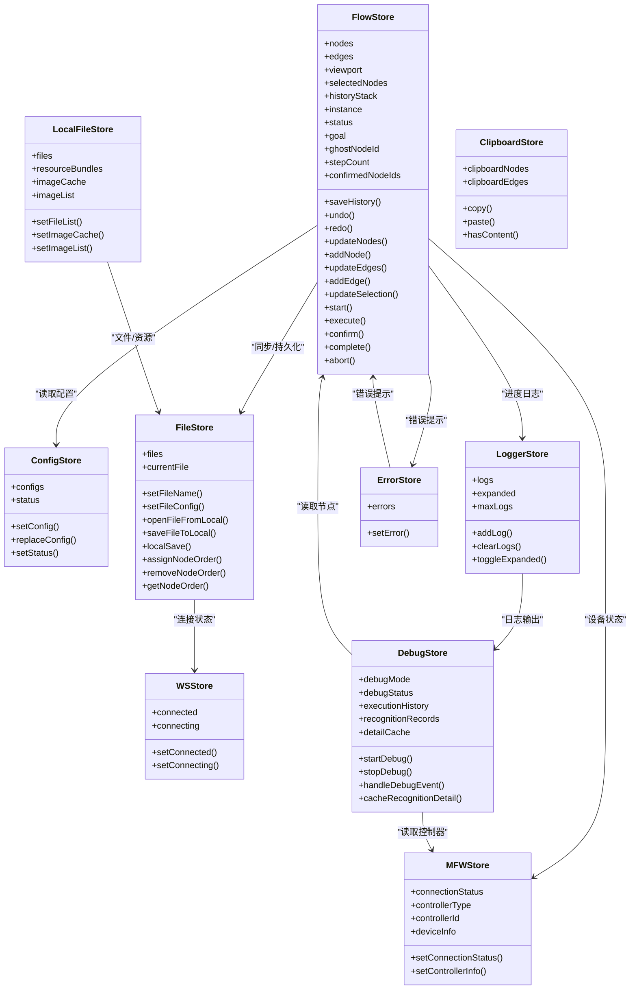
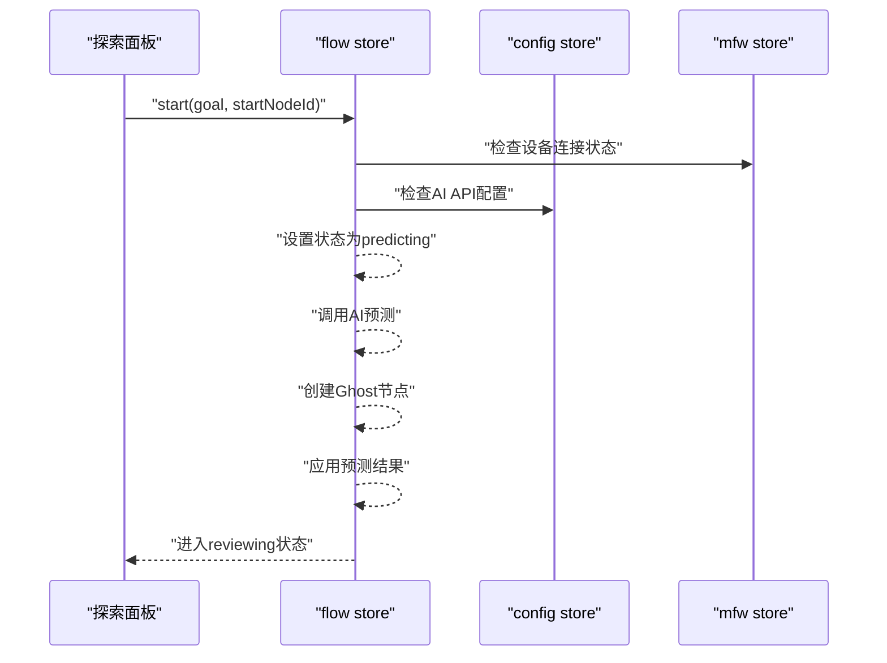
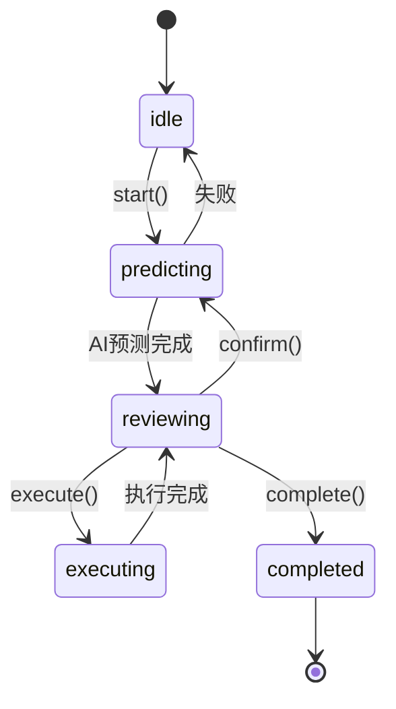
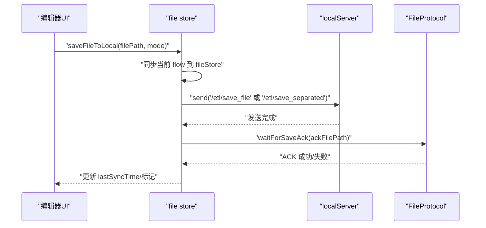
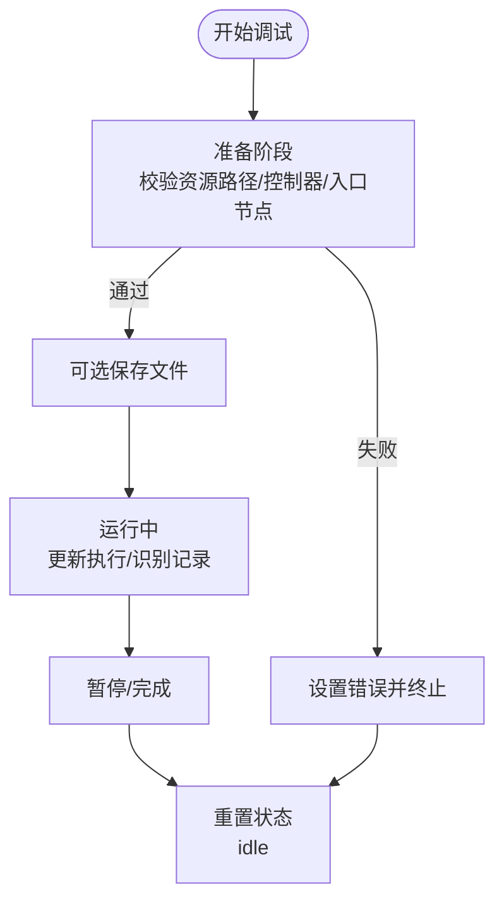
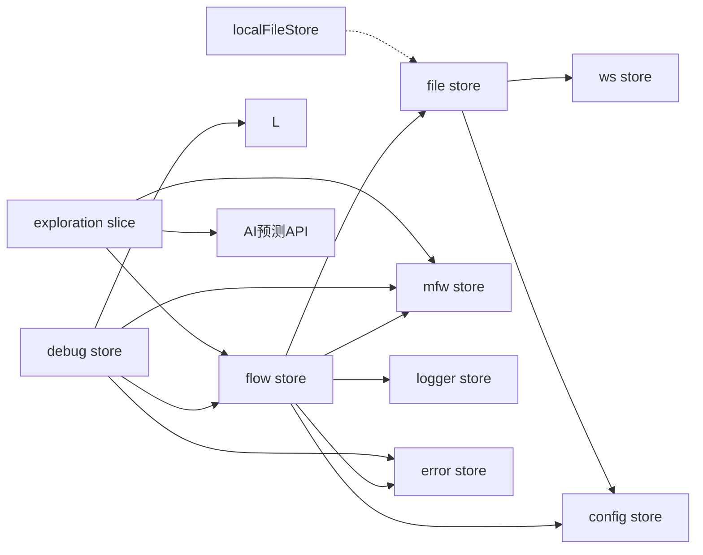

# 状态管理系统

<cite>
**本文引用的文件**
- [src/stores/flow/index.ts](file://src/stores/flow/index.ts)
- [src/stores/flow/slices/explorationSlice.ts](file://src/stores/flow/slices/explorationSlice.ts)
- [src/stores/flow/slices/viewSlice.ts](file://src/stores/flow/slices/viewSlice.ts)
- [src/stores/flow/slices/selectionSlice.ts](file://src/stores/flow/slices/selectionSlice.ts)
- [src/stores/flow/slices/historySlice.ts](file://src/stores/flow/slices/historySlice.ts)
- [src/stores/flow/slices/nodeSlice.ts](file://src/stores/flow/slices/nodeSlice.ts)
- [src/stores/flow/slices/edgeSlice.ts](file://src/stores/flow/slices/edgeSlice.ts)
- [src/stores/flow/types.ts](file://src/stores/flow/types.ts)
- [src/utils/ai/explorationAI.ts](file://src/utils/ai/explorationAI.ts)
- [src/utils/ai/aiPredictor.ts](file://src/utils/ai/aiPredictor.ts)
- [src/components/panels/exploration/ExplorationPanel.tsx](file://src/components/panels/exploration/ExplorationPanel.tsx)
- [src/components/panels/exploration/ExplorationFAB.tsx](file://src/components/panels/exploration/ExplorationFAB.tsx)
- [src/styles/panels/ExplorationPanel.module.less](file://src/styles/panels/ExplorationPanel.module.less)
- [src/stores/configStore.ts](file://src/stores/configStore.ts)
- [src/stores/fileStore.ts](file://src/stores/fileStore.ts)
- [src/stores/wsStore.ts](file://src/stores/wsStore.ts)
- [src/stores/clipboardStore.ts](file://src/stores/clipboardStore.ts)
- [src/stores/errorStore.ts](file://src/stores/errorStore.ts)
- [src/stores/debugStore.ts](file://src/stores/debugStore.ts)
- [src/stores/localFileStore.ts](file://src/stores/localFileStore.ts)
- [src/stores/loggerStore.ts](file://src/stores/loggerStore.ts)
- [src/stores/mfwStore.ts](file://src/stores/mfwStore.ts)
</cite>

## 目录
1. [简介](#简介)
2. [项目结构](#项目结构)
3. [核心组件](#核心组件)
4. [架构总览](#架构总览)
5. [详细组件分析](#详细组件分析)
6. [依赖分析](#依赖分析)
7. [性能考虑](#性能考虑)
8. [故障排查指南](#故障排查指南)
9. [结论](#结论)
10. [附录](#附录)

## 简介
本文件系统性解析 MaaPipelineEditor 基于 Zustand 的状态管理架构，重点覆盖以下方面：
- store 设计模式：flow store（工作流状态）、config store（配置状态）、file store（文件状态）、ws store（WebSocket 状态）等职责与数据结构
- 状态管理最佳实践：状态分层、异步状态处理、状态持久化、状态同步
- store 间协作关系：状态订阅、状态派发、中间件使用
- 实用技巧：状态调试、性能优化、内存管理

## 项目结构
MaaPipelineEditor 的状态管理采用"单页多 store"的组织方式，每个 store 聚焦特定领域，通过组合与协作实现复杂 UI 与业务逻辑：
- flow store：围绕工作流图（节点、边、视口、选择、历史、探索）构建，采用 slice 模式拆分 view/selection/history/node/edge/graph/path/anchorRef/exploration 等子域
- config store：集中管理 UI 与行为配置，并提供分类与迁移逻辑
- file store：负责文件集合、当前文件、本地/远程持久化、与后端协议交互
- ws store：轻量 WebSocket 连接状态
- debug/store：调试执行状态、识别记录、详情缓存、日志与错误
- localFileStore：本地文件与资源包缓存
- loggerStore：日志队列与 UI 展示
- mfwStore：设备与控制器连接状态
- clipboardStore：内部剪贴板
- errorStore：错误聚合与展示

```mermaid
graph TB
subgraph "工作流域"
F["flow store<br/>节点/边/视口/历史/选择/探索"]
V["viewSlice"]
S["selectionSlice"]
H["historySlice"]
N["nodeSlice"]
E["edgeSlice"]
EX["explorationSlice<br/>探索模式状态"]
end
subgraph "配置域"
C["configStore<br/>UI/行为配置"]
end
subgraph "文件域"
FI["fileStore<br/>文件集合/持久化/协议"]
WS["wsStore<br/>连接状态"]
end
subgraph "调试域"
D["debugStore<br/>执行/识别/详情缓存"]
L["loggerStore<br/>日志队列"]
ER["errorStore<br/>错误聚合"]
end
subgraph "设备域"
MF["mfwStore<br/>设备/控制器"]
end
subgraph "工具域"
CL["clipboardStore"]
LF["localFileStore"]
end
F --> V
F --> S
F --> H
F --> N
F --> E
F --> EX
F <- --> C
F <- --> FI
D <- --> MF
D <- --> F
D <- --> L
D <- --> ER
FI <- --> WS
FI <- --> C
CL -.-> F
LF -.-> FI
```

**图表来源**
- [src/stores/flow/index.ts:18-28](file://src/stores/flow/index.ts#L18-L28)
- [src/stores/flow/slices/explorationSlice.ts:34-270](file://src/stores/flow/slices/explorationSlice.ts#L34-L270)

**章节来源**
- [src/stores/flow/index.ts:18-28](file://src/stores/flow/index.ts#L18-L28)
- [src/stores/flow/slices/explorationSlice.ts:34-270](file://src/stores/flow/slices/explorationSlice.ts#L34-L270)
- [src/stores/configStore.ts:163-267](file://src/stores/configStore.ts#L163-L267)
- [src/stores/fileStore.ts:299-514](file://src/stores/fileStore.ts#L299-L514)
- [src/stores/wsStore.ts:7-23](file://src/stores/wsStore.ts#L7-L23)
- [src/stores/debugStore.ts:227-800](file://src/stores/debugStore.ts#L227-L800)
- [src/stores/localFileStore.ts:129-337](file://src/stores/localFileStore.ts#L129-L337)
- [src/stores/loggerStore.ts:21-45](file://src/stores/loggerStore.ts#L21-L45)
- [src/stores/mfwStore.ts:102-157](file://src/stores/mfwStore.ts#L102-L157)
- [src/stores/clipboardStore.ts:13-50](file://src/stores/clipboardStore.ts#L13-L50)
- [src/stores/errorStore.ts:24-38](file://src/stores/errorStore.ts#L24-L38)

## 核心组件
- flow store（工作流状态）
  - 职责：维护节点、边、视口、选择、历史、图元与路径等状态，提供增删改、历史撤销/重做、视口适配等能力
  - 数据结构：nodes、edges、viewport、selectedNodes、historyStack、instance 等
  - 关键能力：saveHistory、undo、redo、initHistory、updateNodes/addNode、updateEdges/addEdge、updateSelection 等
- exploration slice（探索模式状态）
  - 职责：管理探索模式的复杂状态转换和业务逻辑，协调AI预测引擎、设备执行能力和用户交互
  - 状态枚举：idle、predicting、reviewing、executing、completed
  - 数据结构：status、goal、startNodeId、ghostNodeId、stepCount、confirmedNodeIds、error、progressStage、progressDetail
  - 关键能力：start、execute、confirm、complete、abort、_setStatus、_setError、_setProgress、_setGhostNodeId
- config store（配置状态）
  - 职责：集中管理 UI 与行为配置，支持分类、迁移与联动（如 isExportConfig 与 configHandlingMode）
  - 数据结构：configs（布尔、枚举、数值等）、status（面板开关、宽度等）
  - 关键能力：setConfig、replaceConfig、setStatus
- file store（文件状态）
  - 职责：管理文件集合、当前文件、本地/远程持久化、与后端协议交互（保存、ACK 等）
  - 数据结构：files、currentFile、setFileName、setFileConfig、openFileFromLocal、saveFileToLocal
  - 关键能力：localSave、syncFlowStoreToFileStore、markFileDeleted、assignNodeOrder/removeNodeOrder/getNodeOrder
- ws store（WebSocket 状态）
  - 职责：轻量连接状态管理（connected/connecting）
  - 数据结构：connected、connecting、setConnected、setConnecting
- debug store（调试状态）
  - 职责：调试执行生命周期、识别记录、详情缓存、错误与日志
  - 数据结构：debugMode/debugStatus、session/sessionId、resourcePaths/entryNode/controllerId、executionHistory/recognitionRecords/detailCache、error/testMode/testResult
  - 关键能力：startDebug/stopDebug、handleDebugEvent、updateExecutionState、cacheRecognitionDetail/getCachedDetail
- localFileStore（本地文件缓存）
  - 职责：本地文件列表、资源包、图片缓存与列表
  - 数据结构：rootPath/files/resourceBundles/imageDirs/imageCache/pendingImageRequests/imageList 等
  - 关键能力：setFileList/addFile/removeFile/updateFile/findFileByPath、setImageCache/getImageCache、setImageList/clearImageList
- loggerStore（日志）
  - 职责：日志队列与 UI 展示
  - 数据结构：logs、expanded、maxLogs、addLog/clearLogs/toggleExpanded/setExpanded
- mfwStore（设备/控制器）
  - 职责：设备类型、连接状态、设备列表、错误信息
  - 数据结构：connectionStatus/controllerType/controllerId/deviceInfo/adbDevices/win32Windows/errorMessage
  - 关键能力：setConnectionStatus/setControllerInfo/updateAdbDevices/updateWin32Windows/setErrorMessage/clearConnection
- clipboardStore（剪贴板）
  - 职责：内部复制/粘贴节点与边
  - 数据结构：clipboardNodes/clipboardEdges、copy/paste/hasContent
- errorStore（错误）
  - 职责：错误聚合与按类型过滤
  - 数据结构：errors、setError

**章节来源**
- [src/stores/flow/index.ts:18-28](file://src/stores/flow/index.ts#L18-L28)
- [src/stores/flow/slices/explorationSlice.ts:21-270](file://src/stores/flow/slices/explorationSlice.ts#L21-L270)
- [src/stores/flow/types.ts:369-431](file://src/stores/flow/types.ts#L369-L431)
- [src/stores/flow/slices/historySlice.ts:37-229](file://src/stores/flow/slices/historySlice.ts#L37-L229)
- [src/stores/flow/slices/nodeSlice.ts:36-690](file://src/stores/flow/slices/nodeSlice.ts#L36-L690)
- [src/stores/flow/slices/edgeSlice.ts:16-221](file://src/stores/flow/slices/edgeSlice.ts#L16-L221)
- [src/stores/configStore.ts:94-161](file://src/stores/configStore.ts#L94-L161)
- [src/stores/fileStore.ts:299-514](file://src/stores/fileStore.ts#L299-L514)
- [src/stores/wsStore.ts:7-23](file://src/stores/wsStore.ts#L7-L23)
- [src/stores/debugStore.ts:143-221](file://src/stores/debugStore.ts#L143-L221)
- [src/stores/localFileStore.ts:60-122](file://src/stores/localFileStore.ts#L60-L122)
- [src/stores/loggerStore.ts:11-19](file://src/stores/loggerStore.ts#L11-L19)
- [src/stores/mfwStore.ts:72-97](file://src/stores/mfwStore.ts#L72-L97)
- [src/stores/clipboardStore.ts:5-11](file://src/stores/clipboardStore.ts#L5-L11)
- [src/stores/errorStore.ts:17-23](file://src/stores/errorStore.ts#L17-L23)

## 架构总览
Zustand 通过 create 函数创建独立 store，flow store 采用 slice 模式将大 store 拆分为 view/selection/history/node/edge/exploration 等子 slice，形成清晰的职责边界。各 store 之间通过 getState()/setState() 读写状态，必要时通过服务层（如 fileStore 与后端协议）进行异步同步。



**图表来源**
- [src/stores/flow/index.ts:18-28](file://src/stores/flow/index.ts#L18-L28)
- [src/stores/flow/slices/explorationSlice.ts:34-270](file://src/stores/flow/slices/explorationSlice.ts#L34-L270)
- [src/stores/configStore.ts:163-267](file://src/stores/configStore.ts#L163-L267)
- [src/stores/fileStore.ts:299-514](file://src/stores/fileStore.ts#L299-L514)
- [src/stores/wsStore.ts:7-23](file://src/stores/wsStore.ts#L7-L23)
- [src/stores/debugStore.ts:227-800](file://src/stores/debugStore.ts#L227-L800)
- [src/stores/localFileStore.ts:129-337](file://src/stores/localFileStore.ts#L129-L337)
- [src/stores/loggerStore.ts:21-45](file://src/stores/loggerStore.ts#L21-L45)
- [src/stores/mfwStore.ts:102-157](file://src/stores/mfwStore.ts#L102-L157)
- [src/stores/clipboardStore.ts:13-50](file://src/stores/clipboardStore.ts#L13-L50)
- [src/stores/errorStore.ts:24-38](file://src/stores/errorStore.ts#L24-L38)

## 详细组件分析

### flow store（工作流状态）
- 设计模式
  - slice 模式：将视口、选择、历史、节点、边、探索等子域拆分为独立 slice，便于维护与扩展
  - 状态分层：UI 状态（如 selectedNodes/debouncedSelectedNodes）与数据状态（nodes/edges）分离
- 数据结构与职责
  - 视口与实例：instance、viewport、size
  - 选择与目标：selectedNodes/selectedEdges/targetNode、debounced* 防抖版本
  - 历史：historyStack、historyIndex、lastSnapshot、saveTimeout
  - 节点与边：nodes、edges、nodeIdCounter、edgeControlResetKey
  - 探索：status、goal、ghostNodeId、stepCount、confirmedNodeIds、error、progressStage、progressDetail
- 异步与持久化
  - 历史保存采用防抖策略，避免频繁快照
  - 节点/边变更后根据场景延迟保存（拖拽更长，删除即时）
- 协作关系
  - 与 config store：读取默认节点方向等配置
  - 与 file store：同步 nodes/edges 到 currentFile
  - 与 error store：校验节点标签重复并上报
  - 与 mfwStore：检查设备连接状态
  - 与 config store：检查AI API配置



**图表来源**
- [src/stores/flow/slices/explorationSlice.ts:43-118](file://src/stores/flow/slices/explorationSlice.ts#L43-L118)
- [src/stores/flow/slices/explorationSlice.ts:121-142](file://src/stores/flow/slices/explorationSlice.ts#L121-L142)
- [src/stores/flow/slices/explorationSlice.ts:145-231](file://src/stores/flow/slices/explorationSlice.ts#L145-L231)

**章节来源**
- [src/stores/flow/index.ts:18-28](file://src/stores/flow/index.ts#L18-L28)
- [src/stores/flow/slices/viewSlice.ts:5-27](file://src/stores/flow/slices/viewSlice.ts#L5-L27)
- [src/stores/flow/slices/selectionSlice.ts:12-99](file://src/stores/flow/slices/selectionSlice.ts#L12-L99)
- [src/stores/flow/slices/historySlice.ts:37-229](file://src/stores/flow/slices/historySlice.ts#L37-L229)
- [src/stores/flow/slices/nodeSlice.ts:36-690](file://src/stores/flow/slices/nodeSlice.ts#L36-L690)
- [src/stores/flow/slices/edgeSlice.ts:16-221](file://src/stores/flow/slices/edgeSlice.ts#L16-L221)
- [src/stores/flow/slices/explorationSlice.ts:21-270](file://src/stores/flow/slices/explorationSlice.ts#L21-L270)

### exploration slice（探索模式状态）
- 状态管理
  - 状态枚举：idle（未开始）、predicting（AI预测中）、reviewing（等待用户审核）、executing（执行动作中）、completed（已完成）
  - 状态转换：通过 start、execute、confirm、complete、abort 方法实现
- AI预测与执行
  - predictExplorationStep：复用现有AI预测功能，为探索模式提供预测能力
  - executeNodeAction：通过mfwProtocol执行节点动作
  - calculateGhostNodePosition：计算Ghost节点位置
- 数据结构
  - status：当前探索状态
  - goal：用户目标描述
  - startNodeId：起始节点ID
  - ghostNodeId：当前Ghost节点ID
  - stepCount：已完成步骤数
  - confirmedNodeIds：已确认节点ID列表
  - error：错误信息
  - progressStage/progressDetail：进度阶段和详情
- 业务逻辑
  - start：检查前置条件（设备连接、AI配置），开始预测流程
  - execute：执行当前方案的动作
  - confirm：确认当前方案，创建连接并开始下一轮预测
  - complete：完成探索
  - abort：退出探索，可选择保存已确认的节点



**图表来源**
- [src/stores/flow/types.ts:369-376](file://src/stores/flow/types.ts#L369-L376)
- [src/stores/flow/slices/explorationSlice.ts:43-231](file://src/stores/flow/slices/explorationSlice.ts#L43-L231)

**章节来源**
- [src/stores/flow/slices/explorationSlice.ts:21-270](file://src/stores/flow/slices/explorationSlice.ts#L21-L270)
- [src/stores/flow/types.ts:369-431](file://src/stores/flow/types.ts#L369-L431)
- [src/utils/ai/explorationAI.ts:69-116](file://src/utils/ai/explorationAI.ts#L69-L116)
- [src/utils/ai/explorationAI.ts:278-340](file://src/utils/ai/explorationAI.ts#L278-L340)

### config store（配置状态）
- 配置分类与迁移
  - 通过 configCategoryMap 将配置项归类到 panel/pipeline/communication/ai
  - setConfig/replaceConfig 实现 isExportConfig 与 configHandlingMode 的双向同步与迁移
- 状态与设置分离
  - configs：具体配置项
  - status：面板开关、宽度等 UI 状态
- 使用场景
  - 影响节点默认方向、导出行为、面板布局、实时预览、跨文件搜索、AI 配置等

**章节来源**
- [src/stores/configStore.ts:17-77](file://src/stores/configStore.ts#L17-L77)
- [src/stores/configStore.ts:94-161](file://src/stores/configStore.ts#L94-L161)
- [src/stores/configStore.ts:163-267](file://src/stores/configStore.ts#L163-L267)

### file store（文件状态）
- 文件集合与当前文件
  - files/currentFile：文件列表与当前编辑文件
  - setFileName/setFileConfig：文件名与文件级配置（前缀、路径、视口、节点顺序等）
- 本地/远程持久化
  - localSave：保存 files 与 configs 到 localStorage
  - saveFileToLocal：通过本地服务协议保存到远端，等待 ACK
  - openFileFromLocal：从本地打开文件，合并配置，同步到 flow
- 节点顺序与视口
  - assignNodeOrder/removeNodeOrder/getNodeOrder：为节点分配/移除顺序号
  - savedViewport：记录并恢复视口位置
- 与后端协议
  - 通过 FileProtocol 等协议等待保存 ACK，确保一致性



**图表来源**
- [src/stores/fileStore.ts:605-778](file://src/stores/fileStore.ts#L605-L778)
- [src/stores/fileStore.ts:700-743](file://src/stores/fileStore.ts#L700-L743)

**章节来源**
- [src/stores/fileStore.ts:299-514](file://src/stores/fileStore.ts#L299-L514)
- [src/stores/fileStore.ts:605-778](file://src/stores/fileStore.ts#L605-L778)

### ws store（WebSocket 状态）
- 轻量 store，仅维护连接状态与连接中状态
- 与 file store 协作：在保存前检查连接状态

**章节来源**
- [src/stores/wsStore.ts:7-23](file://src/stores/wsStore.ts#L7-L23)
- [src/stores/fileStore.ts:625-628](file://src/stores/fileStore.ts#L625-L628)

### debug store（调试状态）
- 调试生命周期与状态机
  - idle/preparing/running/paused/completed
  - session/sessionId、entryNode、resourcePaths、controllerId
- 执行与识别记录
  - executionHistory：节点级执行记录（running/completed/failed）
  - recognitionRecords：识别记录（running/succeeded/failed），支持 hit 与父节点关联
  - detailCache：识别详情缓存（base64 图像等），带容量限制与清理策略
- 事件处理
  - handleDebugEvent：统一处理节点/识别/动作/调试控制事件，更新对应记录
  - startDebug/stopDebug：准备与停止调试，必要时保存文件
- 性能与内存
  - 最大记录数与清理比例，避免内存膨胀
  - 详情缓存按需懒加载并限制容量



**图表来源**
- [src/stores/debugStore.ts:295-398](file://src/stores/debugStore.ts#L295-L398)
- [src/stores/debugStore.ts:437-795](file://src/stores/debugStore.ts#L437-L795)

**章节来源**
- [src/stores/debugStore.ts:143-221](file://src/stores/debugStore.ts#L143-L221)
- [src/stores/debugStore.ts:227-800](file://src/stores/debugStore.ts#L227-L800)

### localFileStore（本地文件缓存）
- 文件与资源包
  - files：本地文件列表（含节点与前缀）
  - resourceBundles/imageDirs：资源包与 image 目录
- 图片缓存与请求去重
  - imageCache：相对路径到缓存项映射
  - pendingImageRequests：正在请求的图片路径集合
- 列表与过滤
  - imageList：当前资源包下的图片列表
  - isFiltered/loading：过滤状态与加载状态

**章节来源**
- [src/stores/localFileStore.ts:60-122](file://src/stores/localFileStore.ts#L60-L122)
- [src/stores/localFileStore.ts:129-337](file://src/stores/localFileStore.ts#L129-L337)

### loggerStore（日志）
- 日志队列与 UI 展示
  - logs：日志条目列表，按 maxLogs 限制长度
  - expanded：展开/收起
  - addLog/clearLogs/toggleExpanded/setExpanded

**章节来源**
- [src/stores/loggerStore.ts:11-19](file://src/stores/loggerStore.ts#L11-L19)
- [src/stores/loggerStore.ts:21-45](file://src/stores/loggerStore.ts#L21-L45)

### mfwStore（设备/控制器）
- 设备类型与连接状态
  - connectionStatus/controllerType/controllerId/deviceInfo
  - adbDevices/win32Windows：设备列表
- 错误信息与清理

**章节来源**
- [src/stores/mfwStore.ts:72-97](file://src/stores/mfwStore.ts#L72-L97)
- [src/stores/mfwStore.ts:102-157](file://src/stores/mfwStore.ts#L102-L157)

### clipboardStore（剪贴板）
- 内部复制/粘贴节点与边
- copy/paste/hasContent

**章节来源**
- [src/stores/clipboardStore.ts:5-11](file://src/stores/clipboardStore.ts#L5-L11)
- [src/stores/clipboardStore.ts:13-50](file://src/stores/clipboardStore.ts#L13-L50)

### errorStore（错误）
- 错误聚合与按类型过滤
- setError(type, cb)：按类型过滤并合并新错误

**章节来源**
- [src/stores/errorStore.ts:17-23](file://src/stores/errorStore.ts#L17-L23)
- [src/stores/errorStore.ts:24-38](file://src/stores/errorStore.ts#L24-L38)

## 依赖分析
- 组件耦合与内聚
  - flow store 与 config store：低耦合读取，高内聚状态更新
  - flow store 与 file store：强耦合同步与持久化
  - flow store 与 mfwStore：探索模式依赖设备连接状态
  - debug store 与 flow/mfw/logger/error：跨域协作，事件驱动
  - file store 与 ws store：弱耦合连接状态检查
- 直接与间接依赖
  - flow store 间接依赖 config/file/error/mfw/logger
  - debug store 间接依赖 flow/mfw/logger/error
  - file store 间接依赖 config/ws
- 外部依赖与集成点
  - 本地服务协议（FileProtocol、debugProtocol）用于与后端通信
  - AI预测API（OpenAIChat）用于探索模式
  - 设备控制协议（mfwProtocol）用于执行动作
  - React Flow 实例与视口管理



**图表来源**
- [src/stores/flow/index.ts:18-28](file://src/stores/flow/index.ts#L18-L28)
- [src/stores/flow/slices/explorationSlice.ts:34-270](file://src/stores/flow/slices/explorationSlice.ts#L34-L270)
- [src/stores/debugStore.ts:299-318](file://src/stores/debugStore.ts#L299-L318)
- [src/stores/fileStore.ts:625-628](file://src/stores/fileStore.ts#L625-L628)

**章节来源**
- [src/stores/flow/index.ts:18-28](file://src/stores/flow/index.ts#L18-L28)
- [src/stores/flow/slices/explorationSlice.ts:34-270](file://src/stores/flow/slices/explorationSlice.ts#L34-L270)
- [src/stores/debugStore.ts:295-398](file://src/stores/debugStore.ts#L295-L398)
- [src/stores/fileStore.ts:605-778](file://src/stores/fileStore.ts#L605-L778)

## 性能考虑
- 历史记录优化
  - 历史保存采用防抖与差异检测，避免频繁快照
  - 历史栈上限与序列化裁剪，降低内存占用
- 识别与调试缓存
  - 识别记录与详情缓存设置上限与清理比例，防止内存膨胀
  - 详情缓存按需懒加载，减少初始开销
- 节点/边更新
  - 批量更新与深拷贝降级（structuredClone 降级到 JSON），平衡性能与稳定性
- 视口与渲染
  - 通过视口适配与防抖选择更新，减少不必要的重绘
- 探索模式优化
  - Ghost节点使用防抖更新，避免频繁重渲染
  - AI预测结果缓存，减少重复计算
  - 执行动作超时控制，避免长时间阻塞

## 故障排查指南
- 节点名重复
  - 触发条件：节点标签重复
  - 处理：error store 聚合错误，flow store 在节点数据更新时重新校验
- 保存失败
  - 触发条件：本地存储配额不足或后端 ACK 失败
  - 处理：file store 捕获异常并提示，必要时清理缓存或减少文件数量
- 调试异常
  - 触发条件：资源路径/控制器缺失、保存文件失败
  - 处理：debug store 设置错误信息并终止调试流程
- 连接问题
  - 触发条件：WebSocket 未连接
  - 处理：file store 在保存前检查连接状态
- 探索模式异常
  - 触发条件：设备未连接、AI API未配置、AI预测失败
  - 处理：exploration slice 设置错误状态，引导用户检查前置条件
- 执行动作失败
  - 触发条件：设备连接中断、动作执行超时
  - 处理：executeNodeAction返回错误信息，探索状态回到reviewing

**章节来源**
- [src/stores/errorStore.ts:24-38](file://src/stores/errorStore.ts#L24-L38)
- [src/stores/fileStore.ts:255-267](file://src/stores/fileStore.ts#L255-L267)
- [src/stores/debugStore.ts:304-332](file://src/stores/debugStore.ts#L304-L332)
- [src/stores/wsStore.ts:18-23](file://src/stores/wsStore.ts#L18-L23)
- [src/stores/flow/slices/explorationSlice.ts:48-55](file://src/stores/flow/slices/explorationSlice.ts#L48-L55)
- [src/stores/flow/slices/explorationSlice.ts:127-141](file://src/stores/flow/slices/explorationSlice.ts#L127-L141)
- [src/utils/ai/explorationAI.ts:278-340](file://src/utils/ai/explorationAI.ts#L278-L340)

## 结论
MaaPipelineEditor 的 Zustand 状态管理以"单页多 store + slice 模式"为核心，实现了清晰的职责划分与良好的扩展性。通过配置分类与迁移、文件持久化与协议同步、调试缓存与事件驱动、探索模式的AI预测与设备执行、以及严格的性能与内存管理策略，系统在复杂工作流编辑场景下保持了稳定与高效。新增的探索切片为AI驱动的工作流创建提供了完整的状态管理框架，协调了AI预测引擎、设备执行能力和用户交互。建议在后续迭代中持续完善 store 间的契约文档与自动化测试，进一步提升可维护性与可靠性。

## 附录
- 最佳实践清单
  - 状态分层：UI 状态与数据状态分离，避免混杂
  - 异步处理：使用 waitForAck/防抖/节流，保证一致性与性能
  - 状态持久化：区分 localStorage 与后端持久化，明确失效与回滚策略
  - 状态同步：通过 getState()/setState() 与服务层解耦
  - 中间件：可引入日志/调试中间件辅助定位问题
  - 探索模式：合理使用Ghost节点，避免频繁重渲染
- 调试技巧
  - 使用 loggerStore 记录关键事件与参数
  - 利用 historySlice 的撤销/重做快速回退
  - 在 flow store 中开启防抖选择，减少 UI 抖动
  - 探索模式使用进度回调监控AI预测过程
- 性能优化
  - 控制历史栈大小与清理比例
  - 限制识别详情缓存容量，及时清理过期数据
  - 批量更新时使用浅拷贝与差异检测
  - 探索模式使用防抖更新Ghost节点
- 内存管理
  - 定期清理缓存（imageCache/detailCache）
  - 及时释放不再使用的引用（如 removedIds 对应的顺序号）
  - 探索模式及时清理已确认的节点引用