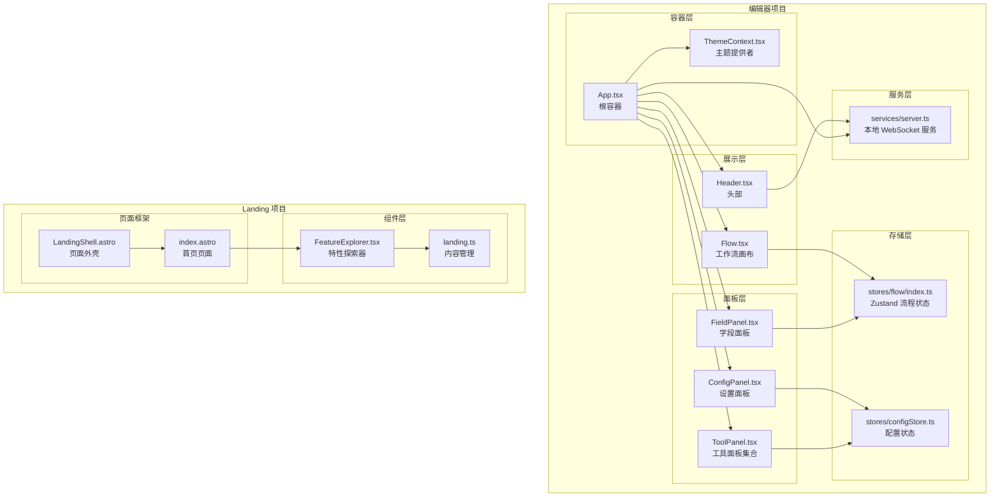
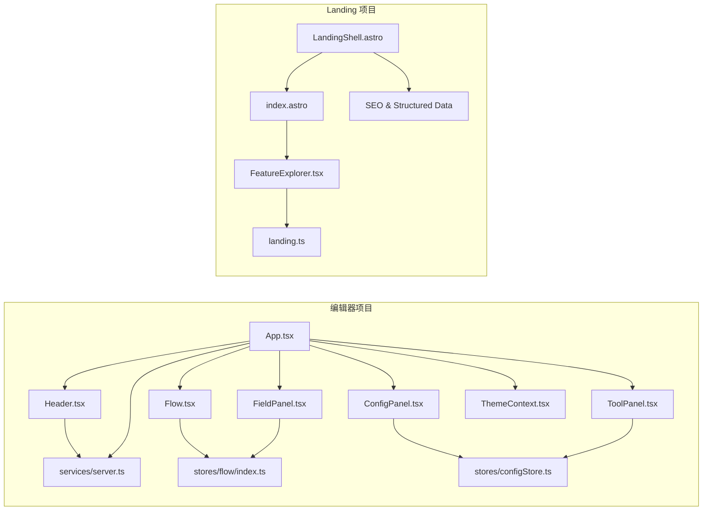
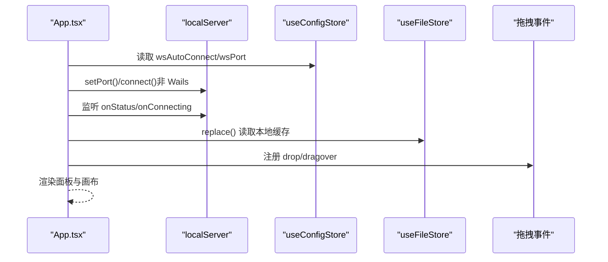
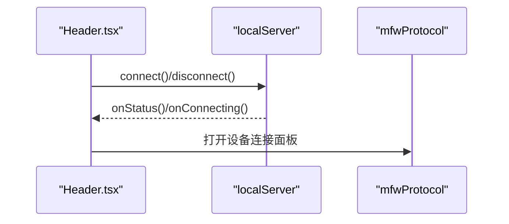
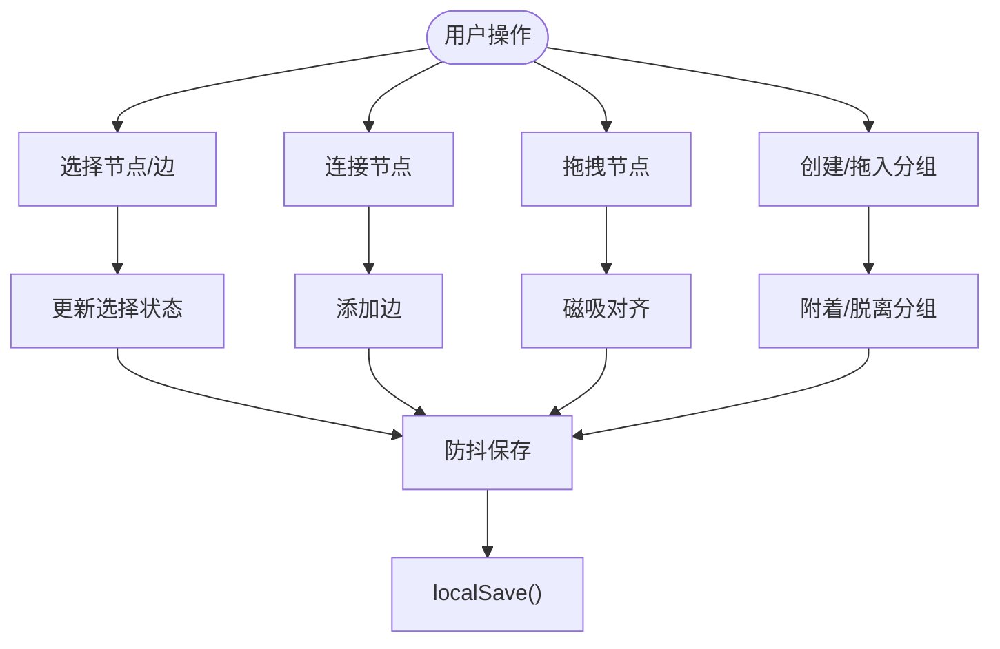
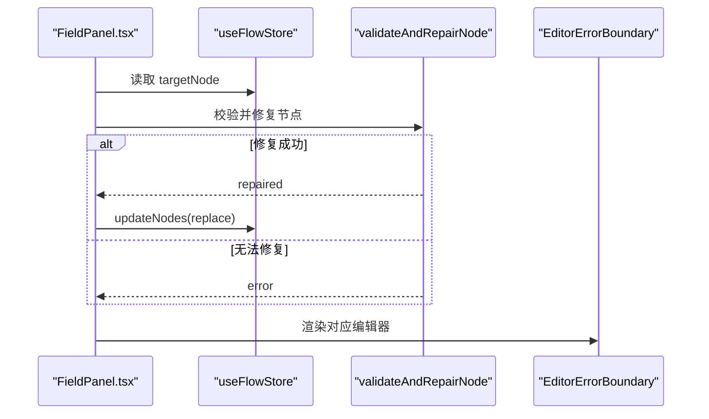
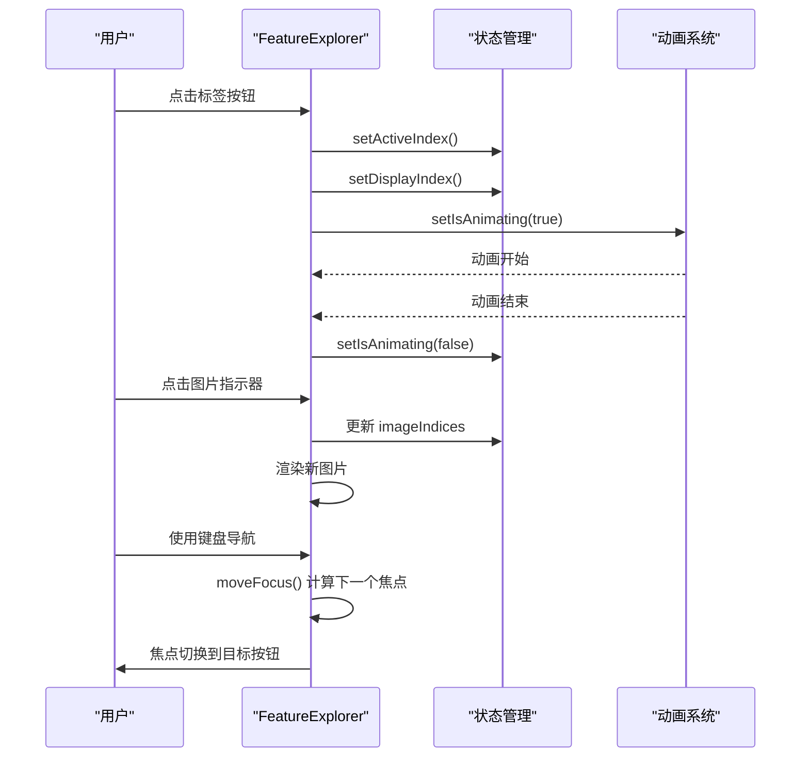
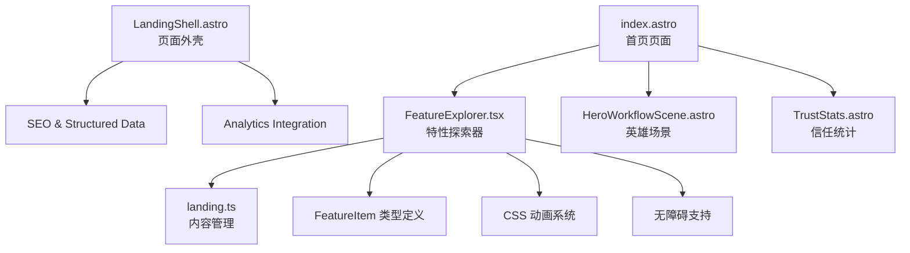
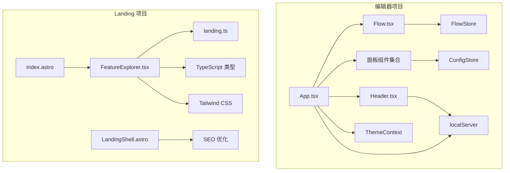

# 组件系统架构

<cite>
**本文引用的文件**
- [src\App.tsx](file://src\App.tsx)
- [src\main.tsx](file://src\main.tsx)
- [src\components\Header.tsx](file://src\components\Header.tsx)
- [src\components\Flow.tsx](file://src\components\Flow.tsx)
- [src\components\panels\main\FieldPanel.tsx](file://src\components\panels\main\FieldPanel.tsx)
- [src\components\panels\main\ConfigPanel.tsx](file://src\components\panels\main\ConfigPanel.tsx)
- [src\components\panels\tools\ToolPanel.tsx](file://src\components\panels\tools\ToolPanel.tsx)
- [src\contexts\ThemeContext.tsx](file://src\contexts\ThemeContext.tsx)
- [src\stores\flow\types.ts](file://src\stores\flow\types.ts)
- [src\stores\flow\index.ts](file://src\stores\flow\index.ts)
- [src\stores\configStore.ts](file://src\stores\configStore.ts)
- [src\services\server.ts](file://src\services\server.ts)
- [Landing\src\components\FeatureExplorer.tsx](file://Landing\src\components\FeatureExplorer.tsx)
- [Landing\src\content\landing.ts](file://Landing\src\content\landing.ts)
- [Landing\src\pages\index.astro](file://Landing\src\pages\index.astro)
- [Landing\src\layouts\LandingShell.astro](file://Landing\src\layouts\LandingShell.astro)
</cite>

## 更新摘要
**变更内容**
- 新增 FeatureExplorer 组件的详细文档，该组件已从静态演示升级为功能完整的交互式图片轮播系统
- 添加 Landing 项目架构分析，包含 Astro 页面框架和组件集成
- 更新组件层次结构图，反映新增的 Landing 组件系统
- 增强无障碍支持和响应式设计的技术细节

## 目录
1. [引言](#引言)
2. [项目结构](#项目结构)
3. [核心组件](#核心组件)
4. [架构总览](#架构总览)
5. [详细组件分析](#详细组件分析)
6. [Landing 项目架构](#landing-项目架构)
7. [依赖分析](#依赖分析)
8. [性能考虑](#性能考虑)
9. [故障排查指南](#故障排查指南)
10. [结论](#结论)

## 引言
本文件系统性梳理 MaaPipelineEditor 前端组件系统的整体架构设计，重点说明：
- 组件层次结构：App 根组件作为容器，Header 头部、MainFlow 工作流画布、各类面板组件（FieldPanel、ConfigPanel、ToolPanel 等）的职责与协作方式
- **新增**：Landing 项目中的 FeatureExplorer 组件，作为功能完整的交互式图片轮播系统
- 设计原则：单一职责、可复用性、可测试性、无障碍支持
- 组件间通信机制：props 传递、事件冒泡、上下文共享、状态存储（Zustand）、WebSocket 协议层
- 数据流向：从用户交互到状态变更再到 UI 更新的闭环
- 生命周期管理、错误边界处理、性能优化策略

## 项目结构
前端采用"容器组件 + 展示组件 + 面板组件 + 存储层 + 服务层"的分层组织，现已扩展为包含 Landing 项目的双项目架构：
- **编辑器项目**：容器层（App.tsx）、展示层（Header.tsx、Flow.tsx）、面板层（FieldPanel、ConfigPanel、ToolPanel 等）
- **Landing 项目**：Astro 页面框架 + FeatureExplorer 组件 + 内容管理系统
- 存储层：Zustand stores（flow、config、file 等），集中管理状态与历史
- 服务层：WebSocket 本地服务封装与协议路由注册，统一与后端通信

**图表来源**
- [src\App.tsx:296-329](file://src\App.tsx#L296-L329)
- [Landing\src\pages\index.astro:100-102](file://Landing\src\pages\index.astro#L100-L102)
- [Landing\src\components\FeatureExplorer.tsx:46-304](file://Landing\src\components\FeatureExplorer.tsx#L46-L304)

**章节来源**
- [src\App.tsx:296-329](file://src\App.tsx#L296-L329)
- [src\main.tsx:1-18](file://src\main.tsx#L1-L18)
- [Landing\src\pages\index.astro:100-102](file://Landing\src\pages\index.astro#L100-L102)

## 核心组件
- **编辑器项目核心组件**
  - App 根容器：负责全局初始化（拖拽导入、分享参数、Wails 环境桥接、WebSocket 自动连接）、主题提供、面板布局与可见性控制
  - Header 头部：连接状态按钮、设备连接入口、版本信息、主题切换、文档与更新日志入口
  - MainFlow 工作流画布：基于 @xyflow/react 的画布，承载节点、边、对齐参考线、内嵌面板、快捷键与视口持久化
  - FieldPanel 字段面板：根据选中节点类型动态渲染对应编辑器，内置错误边界与数据修复流程
  - ConfigPanel 设置面板：聚合文件、Pipeline、面板、本地服务、AI 等配置项
  - ToolPanel 工具面板集合：Add、Global、Layout、Debug 等工具面板的命名空间导出

- **Landing 项目核心组件**
  - FeatureExplorer 特性探索器：功能完整的交互式图片轮播系统，支持动画过渡、主题系统、响应式设计和无障碍支持
  - LandingShell 页面外壳：Astro 页面框架，提供 SEO 优化和结构化数据支持
  - 内容管理系统：基于 TypeScript 的类型安全内容定义和管理

**章节来源**
- [src\App.tsx:111-333](file://src\App.tsx#L111-L333)
- [src\components\Header.tsx:226-421](file://src\components\Header.tsx#L226-L421)
- [src\components\Flow.tsx:193-542](file://src\components\Flow.tsx#L193-L542)
- [src\components\panels\main\FieldPanel.tsx:185-524](file://src\components\panels\main\FieldPanel.tsx#L185-L524)
- [src\components\panels\main\ConfigPanel.tsx:17-78](file://src\components\panels\main\ConfigPanel.tsx#L17-L78)
- [src\components\panels\tools\ToolPanel.tsx:6-14](file://src\components\panels\tools\ToolPanel.tsx#L6-L14)
- [Landing\src\components\FeatureExplorer.tsx:46-304](file://Landing\src\components\FeatureExplorer.tsx#L46-L304)
- [Landing\src\layouts\LandingShell.astro:1-138](file://Landing\src\layouts\LandingShell.astro#L1-L138)

## 架构总览
组件系统以 App 为中心，围绕 Zustand 流程状态与配置状态进行数据驱动；通过 ThemeContext 提供主题能力；通过本地 WebSocket 服务与后端通信，实现连接状态、设备管理、调试与资源等能力。新增的 Landing 项目采用 Astro 框架，提供现代化的静态站点生成和交互式组件支持。

**图表来源**
- [src\App.tsx:296-329](file://src\App.tsx#L296-L329)
- [Landing\src\pages\index.astro:100-102](file://Landing\src\pages\index.astro#L100-L102)
- [Landing\src\components\FeatureExplorer.tsx:46-304](file://Landing\src\components\FeatureExplorer.tsx#L46-L304)

## 详细组件分析

### App 根容器
- **职责**
  - 全局初始化：注册拖拽导入、解析分享参数、处理导入请求、加载自定义模板
  - 连接管理：根据环境（Wails 或非 Wails）决定端口与连接策略，注册状态回调
  - 面板布局：按顺序渲染多个面板与工具面板，并依据配置控制可见性
  - 主题提供：包裹 ThemeProvider，统一主题开关与同步
- **通信机制**
  - props：向子组件传递状态与回调
  - 上下文：ThemeContext 提供主题切换
  - 事件：DOM 拖拽事件、Wails 事件监听
  - 状态：Zustand stores（file、config、ws、customTemplate、debug）
  - 服务：localServer（WebSocket）

**图表来源**
- [src\App.tsx:150-293](file://src\App.tsx#L150-L293)
- [src\services\server.ts:105-251](file://src\services\server.ts#L105-L251)
- [src\stores\configStore.ts:163-267](file://src\stores\configStore.ts#L163-L267)

**章节来源**
- [src\App.tsx:111-333](file://src\App.tsx#L111-L333)

### Header 头部组件
- **职责**
  - 显示版本信息与链接
  - 连接按钮：连接/断开本地服务，状态轮询与提示
  - 设备连接按钮：打开设备连接面板
  - 主题切换：委托 ThemeContext
- **通信机制**
  - 事件：点击按钮触发连接/断开
  - 状态：订阅 localServer 连接状态
  - 上下文：useTheme

**图表来源**
- [src\components\Header.tsx:67-159](file://src\components\Header.tsx#L67-L159)
- [src\components\Header.tsx:162-224](file://src\components\Header.tsx#L162-L224)
- [src\services\server.ts:105-251](file://src\services\server.ts#L105-L251)

**章节来源**
- [src\components\Header.tsx:226-421](file://src\components\Header.tsx#L226-L421)

### MainFlow 工作流画布
- **职责**
  - 承载节点与边，提供选择、拖拽、连接、分组、对齐等交互
  - 内嵌面板：InlineFieldPanel、InlineEdgePanel
  - 对齐参考线：SnapGuidelines
  - 快捷键：复制/粘贴
  - 视口持久化：保存视口到文件配置
- **通信机制**
  - props：节点/边数据、回调函数
  - 状态：useFlowStore（节点/边/选择/历史/视口/尺寸）
  - 事件：onNodesChange/onEdgesChange/onConnect/onSelectionChange
  - 服务：localSave（防抖保存）

**图表来源**
- [src\components\Flow.tsx:248-413](file://src\components\Flow.tsx#L248-L413)
- [src\stores\flow\types.ts:285-338](file://src\stores\flow\types.ts#L285-L338)

**章节来源**
- [src\components\Flow.tsx:193-542](file://src\components\Flow.tsx#L193-L542)

### FieldPanel 字段面板
- **职责**
  - 根据当前选中节点类型渲染对应编辑器（Pipeline/External/Anchor/Sticker/Group）
  - 数据校验与修复：validateAndRepairNode，错误边界 EditorErrorBoundary
  - 面板模式：固定/可拖拽/内嵌
  - 附加信息：邻接信息、识别记录（调试模式）
- **通信机制**
  - props：currentNode、回调（删除、进度、加载）
  - 状态：useFlowStore（更新节点、目标节点）
  - 上下文：useConfigStore（面板模式）、useToolbarStore（右侧面板标识）

**图表来源**
- [src\components\panels\main\FieldPanel.tsx:41-119](file://src\components\panels\main\FieldPanel.tsx#L41-L119)
- [src\components\panels\main\FieldPanel.tsx:210-237](file://src\components\panels\main\FieldPanel.tsx#L210-L237)
- [src\components\panels\main\FieldPanel.tsx:269-323](file://src\components\panels\main\FieldPanel.tsx#L269-L323)

**章节来源**
- [src\components\panels\main\FieldPanel.tsx:185-524](file://src\components\panels\main\FieldPanel.tsx#L185-L524)

### ConfigPanel 设置面板
- **职责**
  - 聚合配置项：文件、Pipeline、面板、本地服务、AI、配置管理
  - 端口同步：监听 wsPort 并同步到 localServer
  - 可见性控制：通过 useConfigStore.status.showConfigPanel
- **通信机制**
  - props：状态与回调
  - 状态：useConfigStore（configs/status）

**章节来源**
- [src\components\panels\main\ConfigPanel.tsx:17-78](file://src\components\panels\main\ConfigPanel.tsx#L17-L78)
- [src\stores\configStore.ts:163-267](file://src\stores\configStore.ts#L163-L267)

### ToolPanel 工具面板集合
- **职责**
  - 以命名空间导出 Add、Global、Layout、Debug 等面板组件
- **通信机制**
  - 通过 useConfigStore 控制可见性与行为

**章节来源**
- [src\components\panels\tools\ToolPanel.tsx:6-14](file://src\components\panels\tools\ToolPanel.tsx#L6-L14)

### ThemeContext 主题上下文
- **职责**
  - 提供 isDark、toggleTheme、setTheme
  - 同步 darkreader 主题
- **通信机制**
  - 通过 useTheme Hook 消费

**章节来源**
- [src\contexts\ThemeContext.tsx:22-68](file://src\contexts\ThemeContext.tsx#L22-L68)

### FeatureExplorer 特性探索器组件
**新增** FeatureExplorer 组件是一个功能完整的交互式图片轮播系统，专为展示 MaaPipelineEditor 的各项功能特性而设计。

- **职责**
  - 创建交互式的特性展示轮播，支持多主题色彩系统
  - 实现平滑的图片切换动画和状态管理
  - 提供键盘导航和无障碍支持
  - 支持响应式设计和触摸手势
- **核心功能**
  - 图片轮播：支持多张图片的循环播放和手动切换
  - 主题系统：四种预设主题（蓝色、薄荷绿、橙色、玫瑰红）
  - 动画过渡：淡入淡出效果和滑动动画
  - 无障碍支持：ARIA 标签、键盘导航、焦点管理
  - 响应式设计：适配不同屏幕尺寸
- **状态管理**
  - activeIndex：当前激活的特性项索引
  - displayIndex：当前显示的特性项索引
  - isAnimating：动画状态标志
  - imageIndices：每个特性项的图片索引映射
- **交互机制**
  - 点击标签切换特性项
  - 键盘方向键导航
  - 图片指示器点击切换
  - 左右箭头按钮切换图片

**图表来源**
- [Landing\src\components\FeatureExplorer.tsx:61-85](file://Landing\src\components\FeatureExplorer.tsx#L61-L85)
- [Landing\src\components\FeatureExplorer.tsx:75-79](file://Landing\src\components\FeatureExplorer.tsx#L75-L79)
- [Landing\src\components\FeatureExplorer.tsx:81-85](file://Landing\src\components\FeatureExplorer.tsx#L81-L85)

**章节来源**
- [Landing\src\components\FeatureExplorer.tsx:46-304](file://Landing\src\components\FeatureExplorer.tsx#L46-L304)

### Zustand 流程状态（FlowStore）
- **职责**
  - 统一管理节点、边、选择、历史、视口、尺寸、路径等状态
  - 提供批量更新、历史快照、粘贴计数、路径计算等能力
- **数据模型**
  - 节点/边/选择/历史/视口/尺寸/路径等 slice

**章节来源**
- [src\stores\flow\types.ts:247-362](file://src\stores\flow\types.ts#L247-L362)
- [src\stores\flow\index.ts:16-24](file://src\stores\flow\index.ts#L16-L24)

### 配置状态（ConfigStore）
- **职责**
  - 管理面板、Pipeline、通信、AI 等配置项
  - 提供 setConfig/replaceConfig 与状态管理
- **通信机制**
  - 与 App、Header、FieldPanel、ConfigPanel 等组件通过 props/state 协作

**章节来源**
- [src\stores\configStore.ts:163-267](file://src\stores\configStore.ts#L163-L267)

### 本地 WebSocket 服务（localServer）
- **职责**
  - 管理连接生命周期、握手校验、消息路由、状态回调
  - 注册多协议处理器（文件、MFW、错误、配置、调试、资源、日志）
- **通信机制**
  - send(path, data) 发送消息
  - registerRoute/registerRoutes 注册路由
  - onStatus/onConnecting 监听状态

**章节来源**
- [src\services\server.ts:20-333](file://src\services\server.ts#L20-L333)
- [src\services\server.ts:348-373](file://src\services\server.ts#L348-L373)

## Landing 项目架构
**新增** Landing 项目采用 Astro 框架构建，提供现代化的静态站点生成和交互式组件支持。

### 页面框架
- **LandingShell 页面外壳**
  - 提供 SEO 优化和结构化数据支持
  - 包含 Open Graph、Twitter Card 和 Schema.org 结构化数据
  - 支持可访问性友好的 HTML 结构
  - 集成 Google Analytics 和可选的 Plausible Analytics
- **Astro 页面系统**
  - 使用 Astro 的 Islands 架构实现组件级别的交互
  - 支持静态生成和客户端水合（client:idle）
  - 提供类型安全的组件导入和属性传递

### 组件集成
- **FeatureExplorer 集成**
  - 通过 Astro 的 client:idle 指令实现延迟加载
  - 使用 TypeScript 类型定义确保数据完整性
  - 支持 SSR 和 CSR 的混合渲染模式
- **内容管理系统**
  - 基于 TypeScript 的类型安全内容定义
  - 支持多语言内容管理和标签系统
  - 提供结构化的特性描述和指标展示

**图表来源**
- [Landing\src\layouts\LandingShell.astro:17-34](file://Landing\src\layouts\LandingShell.astro#L17-L34)
- [Landing\src\pages\index.astro:100-102](file://Landing\src\pages\index.astro#L100-L102)
- [Landing\src\components\FeatureExplorer.tsx:87-304](file://Landing\src\components\FeatureExplorer.tsx#L87-L304)

**章节来源**
- [Landing\src\layouts\LandingShell.astro:1-138](file://Landing\src\layouts\LandingShell.astro#L1-L138)
- [Landing\src\pages\index.astro:100-102](file://Landing\src\pages\index.astro#L100-L102)
- [Landing\src\content\landing.ts:16-29](file://Landing\src\content\landing.ts#L16-L29)

## 依赖分析
- **组件耦合**
  - App 与各面板存在强耦合（布局与可见性），但通过状态与上下文解耦具体实现
  - Flow 与 FlowStore 高内聚，通过 slice 解耦不同维度的状态
  - Header 与 localServer 弱耦合（仅状态订阅与少量交互）
  - **新增** FeatureExplorer 与内容管理系统松耦合，通过 TypeScript 类型定义进行数据传递
- **外部依赖**
  - @xyflow/react：画布与交互
  - antd：UI 组件库
  - darkreader：主题切换
  - zustand：状态管理
  - **新增** Astro：静态站点生成和组件框架
  - **新增** Tailwind CSS：原子化样式系统

**图表来源**
- [src\App.tsx:296-329](file://src\App.tsx#L296-L329)
- [Landing\src\components\FeatureExplorer.tsx:46-304](file://Landing\src\components\FeatureExplorer.tsx#L46-L304)
- [Landing\src\content\landing.ts:16-29](file://Landing\src\content\landing.ts#L16-L29)

## 性能考虑
- **编辑器项目性能**
  - 防抖保存：Flow 中对选择与目标节点变更进行防抖保存，降低频繁写入
  - 记忆化：FieldPanel 对渲染内容与样式类名使用 useMemo，减少不必要的重渲染
  - 节点磁吸：仅在启用时计算对齐，且可限制在视口范围内
  - 主题切换：通过 darkreader 同步，避免重复计算
  - 事件监听：App 在卸载时清理拖拽与 Wails 事件监听，防止内存泄漏
- **Landing 项目性能**
  - **新增** 延迟加载：FeatureExplorer 使用 Astro 的 client:idle 指令实现延迟加载
  - **新增** 静态生成：Astro 静态生成页面，提升首屏加载速度
  - **新增** 组件水合：仅在需要时对交互组件进行水合，减少 JavaScript 体积
  - **新增** CSS 优化：使用 Tailwind CSS 的原子化类名，支持 Tree Shaking

**章节来源**
- [src\components\Flow.tsx:131-144](file://src\components\Flow.tsx#L131-L144)
- [src\components\panels\main\FieldPanel.tsx:383-392](file://src\components\panels\main\FieldPanel.tsx#L383-L392)
- [src\components\Flow.tsx:296-329](file://src\components\Flow.tsx#L296-L329)
- [src\contexts\ThemeContext.tsx:27-37](file://src\contexts\ThemeContext.tsx#L27-L37)
- [src\App.tsx:285-293](file://src\App.tsx#L285-L293)
- [Landing\src\pages\index.astro:100-102](file://Landing\src\pages\index.astro#L100-L102)

## 故障排查指南
- **编辑器项目故障排查**
  - 连接问题：确认本地服务已启动、端口正确、协议版本匹配
  - 节点渲染失败：使用 FieldPanel 的错误边界与修复流程
  - 面板不可见：检查 ConfigStore 中对应状态（如 showConfigPanel、fieldPanelMode）
- **Landing 项目故障排查**
  - **新增** FeatureExplorer 无响应：检查浏览器控制台错误、确认 TypeScript 类型定义正确
  - **新增** SEO 数据缺失：验证 LandingShell 中的结构化数据配置
  - **新增** 页面加载缓慢：检查 Astro 构建配置和资源优化设置

**章节来源**
- [src\services\server.ts:105-251](file://src\services\server.ts#L105-L251)
- [src\components\panels\main\FieldPanel.tsx:122-182](file://src\components\panels\main\FieldPanel.tsx#L122-L182)
- [src\stores\configStore.ts:255-267](file://src\stores\configStore.ts#L255-L267)
- [Landing\src\components\FeatureExplorer.tsx:46-304](file://Landing\src\components\FeatureExplorer.tsx#L46-L304)

## 结论
该组件系统以 App 为核心容器，结合 Zustand 状态管理与本地 WebSocket 服务，实现了清晰的职责划分与稳定的组件通信机制。**新增的 Landing 项目**通过 Astro 框架提供了现代化的静态站点生成能力，FeatureExplorer 组件展现了完整的交互式图片轮播系统，包含动画过渡、主题系统、响应式设计和无障碍支持等特性。

通过主题上下文、防抖保存、错误边界与磁吸对齐等策略，兼顾了可维护性与用户体验。**后续可在以下方面持续优化**：
- 面板模块化与懒加载，进一步降低首屏负担
- 增加单元测试覆盖，提升可测试性
- 统一事件与协议命名规范，增强可读性与扩展性
- **新增** 优化 Landing 项目的构建配置和性能监控
- **新增** 扩展 FeatureExplorer 的交互功能和主题定制能力
- **新增** 增强 SEO 优化和社交媒体分享功能