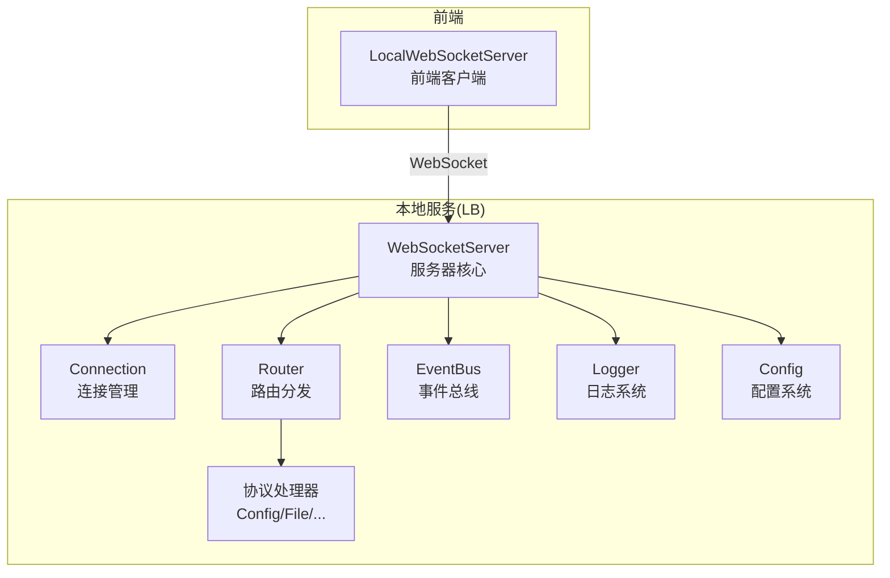
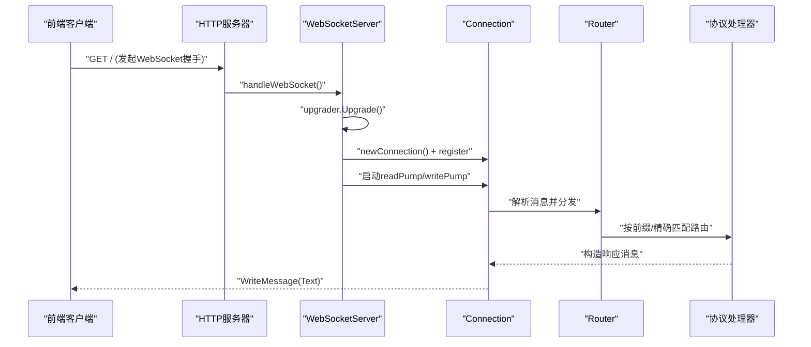
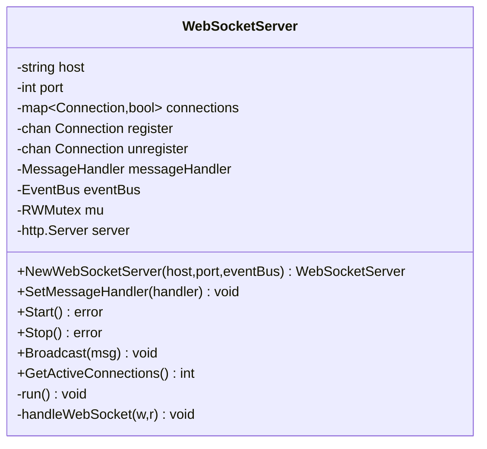
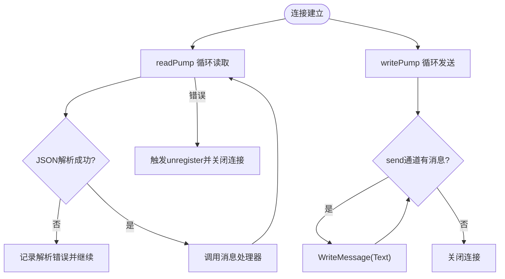
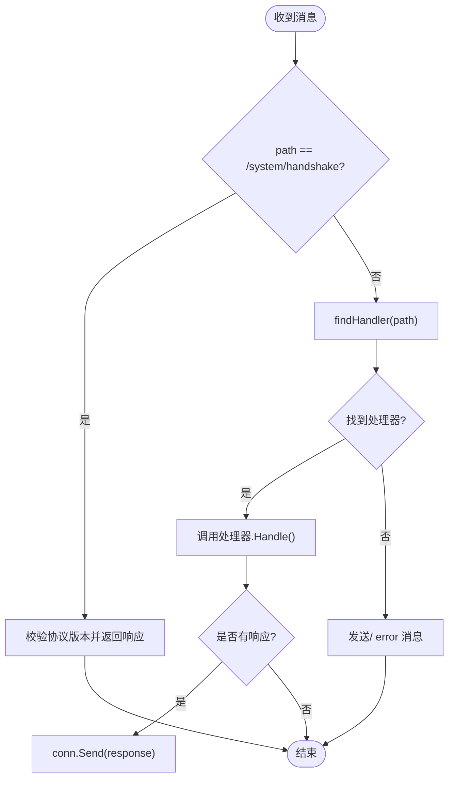
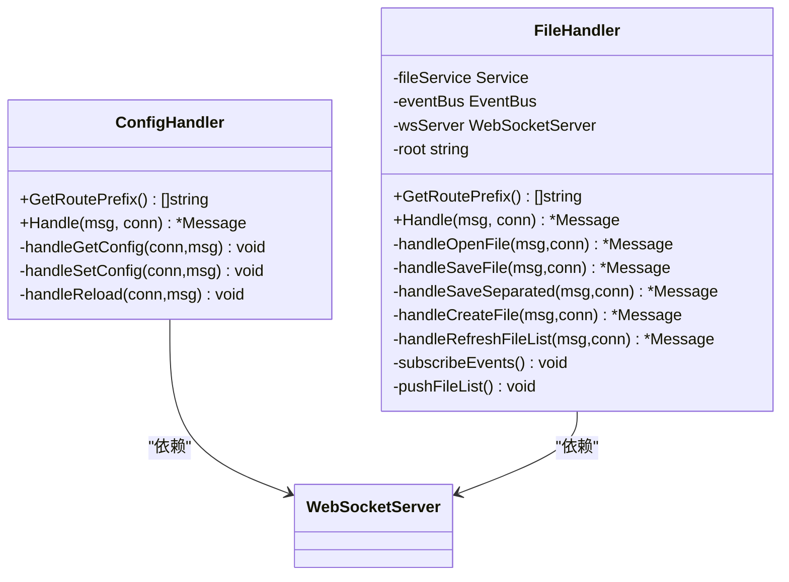
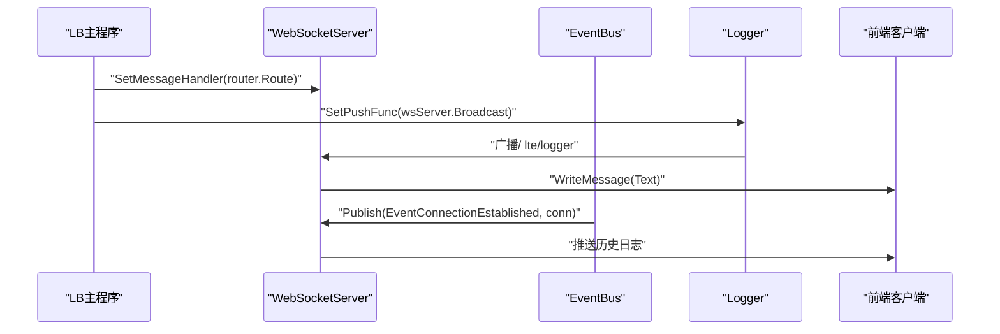
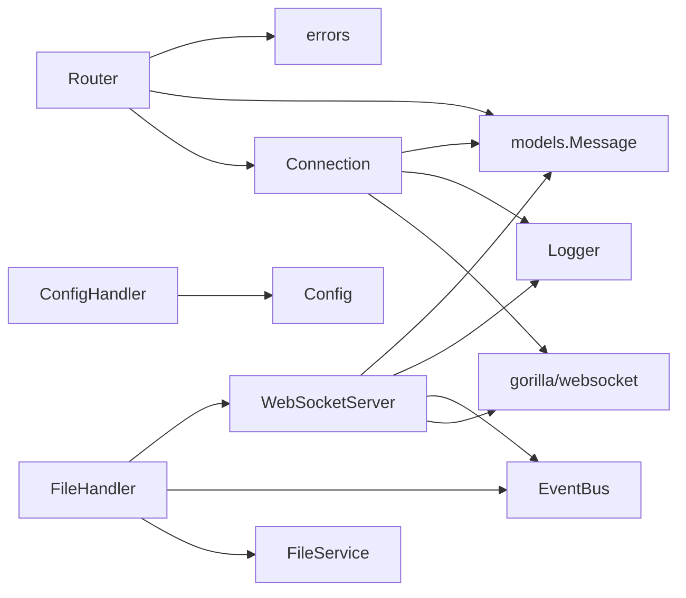

# WebSocket服务器

<cite>
**本文引用的文件**
- [websocket.go](file://LocalBridge/internal/server/websocket.go)
- [connection.go](file://LocalBridge/internal/server/connection.go)
- [router.go](file://LocalBridge/internal/router/router.go)
- [message.go](file://LocalBridge/pkg/models/message.go)
- [config.go](file://LocalBridge/internal/config/config.go)
- [logger.go](file://LocalBridge/internal/logger/logger.go)
- [eventbus.go](file://LocalBridge/internal/eventbus/eventbus.go)
- [file_handler.go](file://LocalBridge/internal/protocol/file/file_handler.go)
- [handler.go](file://LocalBridge/internal/protocol/config/handler.go)
- [main.go](file://LocalBridge/cmd/lb/main.go)
- [server.ts](file://src/services/server.ts)
- [type.ts](file://src/services/type.ts)
- [BackendConfigModal.tsx](file://src/components/modals/BackendConfigModal.tsx)
- [LocalServiceSection.tsx](file://src/components/panels/config/LocalServiceSection.tsx)
</cite>

## 目录
1. [简介](#简介)
2. [项目结构](#项目结构)
3. [核心组件](#核心组件)
4. [架构总览](#架构总览)
5. [详细组件分析](#详细组件分析)
6. [依赖关系分析](#依赖关系分析)
7. [性能考虑](#性能考虑)
8. [故障排查指南](#故障排查指南)
9. [结论](#结论)
10. [附录](#附录)

## 简介
本文件系统性阐述本地WebSocket服务器的实现架构与核心功能，涵盖服务器初始化、端口绑定、HTTP路由设置；upgrader配置、缓冲区大小与跨域策略；启动流程、优雅关闭机制与错误处理；连接注册/注销、并发安全与连接池管理；服务器配置项、性能调优建议与监控指标；以及部署最佳实践与故障排查方法。目标读者包括开发者、运维工程师与产品运营人员。

## 项目结构
WebSocket服务器位于LocalBridge模块中，采用Go语言实现，前端通过TypeScript封装的WebSocket客户端进行通信。核心文件组织如下：
- 服务器核心：LocalBridge/internal/server/websocket.go、connection.go
- 路由与协议：LocalBridge/internal/router/router.go、LocalBridge/internal/protocol/*
- 数据模型：LocalBridge/pkg/models/message.go
- 配置与日志：LocalBridge/internal/config/config.go、internal/logger/logger.go
- 事件总线：LocalBridge/internal/eventbus/eventbus.go
- 主程序入口：LocalBridge/cmd/lb/main.go
- 前端集成：src/services/server.ts、src/services/type.ts、UI配置组件

**图表来源**
- [websocket.go:35-46](file://LocalBridge/internal/server/websocket.go#L35-L46)
- [connection.go:12-19](file://LocalBridge/internal/server/connection.go#L12-L19)
- [router.go:28-31](file://LocalBridge/internal/router/router.go#L28-L31)
- [config.go:42-48](file://LocalBridge/internal/config/config.go#L42-L48)
- [logger.go:13-25](file://LocalBridge/internal/logger/logger.go#L13-L25)
- [eventbus.go:16-20](file://LocalBridge/internal/eventbus/eventbus.go#L16-L20)

**章节来源**
- [websocket.go:1-179](file://LocalBridge/internal/server/websocket.go#L1-L179)
- [connection.go:1-96](file://LocalBridge/internal/server/connection.go#L1-L96)
- [router.go:1-151](file://LocalBridge/internal/router/router.go#L1-L151)
- [message.go:1-126](file://LocalBridge/pkg/models/message.go#L1-L126)
- [config.go:1-339](file://LocalBridge/internal/config/config.go#L1-L339)
- [logger.go:1-251](file://LocalBridge/internal/logger/logger.go#L1-L251)
- [eventbus.go:1-83](file://LocalBridge/internal/eventbus/eventbus.go#L1-L83)

## 核心组件
- WebSocketServer：负责HTTP路由、upgrader配置、连接注册/注销、广播消息、优雅关闭、统计连接数。
- Connection：每个WebSocket连接的抽象，包含发送通道、读写泵协程、并发安全锁。
- Router：消息路由分发器，支持精确与前缀匹配，内置版本握手处理。
- 协议处理器：ConfigHandler、FileHandler等，实现具体业务路由与响应。
- EventBus：事件总线，用于连接生命周期、文件变更、配置重载等事件传播。
- Logger：统一日志系统，支持推送至客户端的历史日志与实时日志。
- Config：配置系统，提供服务器、文件、日志、MaaFW等配置项。

**章节来源**
- [websocket.go:35-93](file://LocalBridge/internal/server/websocket.go#L35-L93)
- [connection.go:12-96](file://LocalBridge/internal/server/connection.go#L12-L96)
- [router.go:28-151](file://LocalBridge/internal/router/router.go#L28-L151)
- [config.go:42-123](file://LocalBridge/internal/config/config.go#L42-L123)
- [logger.go:22-162](file://LocalBridge/internal/logger/logger.go#L22-L162)
- [eventbus.go:16-83](file://LocalBridge/internal/eventbus/eventbus.go#L16-L83)

## 架构总览
WebSocket服务器以gorilla/websocket为基础，结合自研Router与协议处理器，形成“HTTP路由 -> 升级WebSocket -> 连接管理 -> 消息路由 -> 协议处理”的完整链路。服务器通过事件总线与日志系统解耦，支持配置热重载与文件变更推送。

**图表来源**
- [websocket.go:144-161](file://LocalBridge/internal/server/websocket.go#L144-L161)
- [connection.go:31-59](file://LocalBridge/internal/server/connection.go#L31-L59)
- [router.go:49-76](file://LocalBridge/internal/router/router.go#L49-L76)
- [file_handler.go:48-64](file://LocalBridge/internal/protocol/file/file_handler.go#L48-L64)

## 详细组件分析

### WebSocketServer 组件
- 初始化与配置
  - 构造函数：初始化连接映射、注册/注销通道、事件总线。
  - upgrader：读写缓冲均为1024字节，CheckOrigin始终允许跨域。
  - HTTP路由：注册根路径“/”为WebSocket处理函数。
- 启动流程
  - 启动连接管理协程run()。
  - 创建http.Server，设置Addr、Handler、ReadTimeout/WriteTimeout。
  - ListenAndServe启动监听，记录在线服务地址。
- 优雅关闭
  - 锁定连接集合，逐个关闭发送通道，最后关闭HTTP服务器。
- 广播与统计
  - 广播：遍历连接集合，逐个Send消息。
  - 统计：GetActiveConnections返回活跃连接数。

**图表来源**
- [websocket.go:35-93](file://LocalBridge/internal/server/websocket.go#L35-L93)

**章节来源**
- [websocket.go:48-179](file://LocalBridge/internal/server/websocket.go#L48-L179)

### Connection 组件
- 结构与创建
  - ID、底层websocket.Conn、发送通道send(容量256)、所属服务器指针、互斥锁。
- 读写泵
  - readPump：循环读取消息，JSON反序列化，触发消息处理器；异常时记录并触发unregister。
  - writePump：循环从send通道取出消息并WriteMessage，异常时关闭连接。
- 发送
  - Send：JSON序列化消息，非阻塞写入send通道，队列满时丢弃并告警。

**图表来源**
- [connection.go:31-76](file://LocalBridge/internal/server/connection.go#L31-L76)

**章节来源**
- [connection.go:12-96](file://LocalBridge/internal/server/connection.go#L12-L96)

### Router 组件
- 路由匹配
  - 支持精确匹配与前缀匹配，优先精确匹配。
- 版本握手
  - 处理/system/handshake，校验前端协议版本与服务器一致，返回响应。
- 错误处理
  - 未知路由时发送/error消息，包含错误码与详情。

**图表来源**
- [router.go:49-151](file://LocalBridge/internal/router/router.go#L49-L151)

**章节来源**
- [router.go:28-151](file://LocalBridge/internal/router/router.go#L28-L151)

### 协议处理器
- ConfigHandler
  - 路由前缀：/etl/config/
  - 功能：获取配置、设置配置（含服务器、文件、日志、MaaFW）、内部重载。
- FileHandler
  - 路由前缀：/etl/open_file、/etl/save_file、/etl/save_separated、/etl/create_file、/etl/refresh_file_list
  - 功能：打开/保存/分离保存文件、创建文件、刷新文件列表；订阅文件变更事件并广播通知。

**图表来源**
- [handler.go:12-47](file://LocalBridge/internal/protocol/config/handler.go#L12-L47)
- [file_handler.go:14-46](file://LocalBridge/internal/protocol/file/file_handler.go#L14-L46)

**章节来源**
- [handler.go:12-237](file://LocalBridge/internal/protocol/config/handler.go#L12-L237)
- [file_handler.go:14-328](file://LocalBridge/internal/protocol/file/file_handler.go#L14-L328)

### 事件总线与日志
- EventBus
  - 提供Subscribe/Publish/PublishAsync/Unsubscribe，事件类型包括连接建立/关闭、文件变更、配置重载等。
- Logger
  - 支持控制台与文件双输出，可将日志推送到客户端；维护历史日志缓冲（默认100条），支持清理旧日志。

**图表来源**
- [main.go:317-362](file://LocalBridge/cmd/lb/main.go#L317-L362)
- [logger.go:102-162](file://LocalBridge/internal/logger/logger.go#L102-L162)
- [eventbus.go:37-56](file://LocalBridge/internal/eventbus/eventbus.go#L37-L56)

**章节来源**
- [eventbus.go:16-83](file://LocalBridge/internal/eventbus/eventbus.go#L16-L83)
- [logger.go:22-251](file://LocalBridge/internal/logger/logger.go#L22-L251)
- [main.go:317-362](file://LocalBridge/cmd/lb/main.go#L317-L362)

## 依赖关系分析
- 组件耦合
  - WebSocketServer依赖gorilla/websocket、eventbus、logger、models。
  - Connection依赖websocket、logger、models。
  - Router依赖server.Connection、models、errors、logger。
  - 协议处理器依赖server、config、eventbus、logger、models。
- 外部依赖
  - gorilla/websocket：WebSocket协议升级与读写。
  - logrus：日志框架。
  - viper：配置解析与持久化。

**图表来源**
- [websocket.go:3-13](file://LocalBridge/internal/server/websocket.go#L3-L13)
- [connection.go:3-10](file://LocalBridge/internal/server/connection.go#L3-L10)
- [router.go:3-11](file://LocalBridge/internal/router/router.go#L3-L11)
- [handler.go:3-10](file://LocalBridge/internal/protocol/config/handler.go#L3-L10)
- [file_handler.go:3-12](file://LocalBridge/internal/protocol/file/file_handler.go#L3-L12)

**章节来源**
- [websocket.go:1-179](file://LocalBridge/internal/server/websocket.go#L1-L179)
- [connection.go:1-96](file://LocalBridge/internal/server/connection.go#L1-L96)
- [router.go:1-151](file://LocalBridge/internal/router/router.go#L1-L151)
- [handler.go:1-237](file://LocalBridge/internal/protocol/config/handler.go#L1-L237)
- [file_handler.go:1-328](file://LocalBridge/internal/protocol/file/file_handler.go#L1-L328)

## 性能考虑
- 缓冲区与背压
  - 连接发送通道容量为256，若上游消息速率超过下游发送速率，将出现丢弃与告警。建议：
    - 增大send通道容量（谨慎评估内存占用）。
    - 在处理器侧增加限速或批量化发送。
    - 使用异步写入与批量压缩消息。
- 并发与锁
  - 连接集合使用RWMutex，读多写少场景下读锁提升并发；建议避免在锁内执行耗时操作。
- 超时与资源回收
  - HTTP服务器设置ReadTimeout/WriteTimeout，防止慢连接占用资源；优雅关闭时主动关闭发送通道，确保协程退出。
- 路由与序列化
  - JSON序列化/反序列化为热点路径，建议：
    - 复用对象池减少GC压力。
    - 对高频消息采用更高效编码（如MessagePack）。
- 广播优化
  - 广播时使用只读锁，但遍历map仍为O(n)；n较大时可考虑：
    - 分组广播或分区策略。
    - 延迟队列合并小消息。

[本节为通用性能指导，无需特定文件引用]

## 故障排查指南
- 连接无法建立
  - 检查upgrader配置（当前允许跨域），确认前端URL与端口正确。
  - 查看服务器日志中“升级连接失败”错误。
- 版本不匹配
  - 前端发送protocol_version与服务器ProtocolVersion不一致会导致握手失败。
  - 建议前端打印安装命令提示并引导用户更新。
- 消息丢失
  - Connection.Send通道满时会丢弃消息并告警；检查发送速率与通道容量。
- 优雅关闭异常
  - 若Stop()后仍有连接未释放，检查是否在锁外执行了阻塞操作。
- 日志未推送
  - 确认Logger.SetPushFunc已设置，且前端订阅了/lte/logger路由。
- 配置未生效
  - 部分配置需重启服务生效；检查ConfigHandler返回的消息提示。

**章节来源**
- [websocket.go:144-161](file://LocalBridge/internal/server/websocket.go#L144-L161)
- [router.go:107-151](file://LocalBridge/internal/router/router.go#L107-L151)
- [connection.go:78-96](file://LocalBridge/internal/server/connection.go#L78-L96)
- [logger.go:102-162](file://LocalBridge/internal/logger/logger.go#L102-L162)

## 结论
该WebSocket服务器以清晰的职责划分与事件驱动架构实现了稳定的本地通信能力。通过Router与协议处理器解耦业务逻辑，配合事件总线与日志系统，具备良好的可观测性与扩展性。建议在高并发场景下进一步优化缓冲与序列化策略，并完善健康检查与监控指标以支撑生产环境。

[本节为总结性内容，无需特定文件引用]

## 附录

### 服务器配置选项
- 服务器配置
  - server.host：监听主机，默认"localhost"。
  - server.port：监听端口，默认9066。
- 文件配置
  - file.root：扫描根目录，默认空（当前工作目录）。
  - file.exclude：排除目录列表。
  - file.extensions：文件扩展名过滤。
  - file.max_depth：最大扫描深度（0表示无限制）。
  - file.max_files：最大文件数量（0表示无限制）。
- 日志配置
  - log.level：日志级别，默认"INFO"。
  - log.dir：日志目录，默认应用日志目录。
  - log.push_to_client：是否推送日志到客户端。
- MaaFW配置
  - maafw.enabled：是否启用。
  - maafw.lib_dir：库目录。
  - maafw.resource_dir：资源目录。

**章节来源**
- [config.go:13-48](file://LocalBridge/internal/config/config.go#L13-L48)
- [config.go:102-123](file://LocalBridge/internal/config/config.go#L102-L123)

### 前端集成要点
- 前端通过LocalWebSocketServer封装WebSocket连接，支持：
  - 自动连接开关与连接状态回调。
  - 版本握手请求与响应。
  - 路由注册与消息发送。
- UI配置项
  - 监听端口与主机地址，修改后需重启服务。
  - 自动连接开关与自动重载文件变更。

**章节来源**
- [server.ts:76-124](file://src/services/server.ts#L76-L124)
- [server.ts:260-322](file://src/services/server.ts#L260-L322)
- [type.ts:1-27](file://src/services/type.ts#L1-L27)
- [BackendConfigModal.tsx:259-298](file://src/components/modals/BackendConfigModal.tsx#L259-L298)
- [LocalServiceSection.tsx:75-117](file://src/components/panels/config/LocalServiceSection.tsx#L75-L117)

### 部署最佳实践
- 端口与网络
  - 使用非特权端口（>1024），避免防火墙拦截。
  - 如需跨域访问，确认CheckOrigin策略与代理层配置。
- 安全加固
  - 生产环境建议限制主机绑定（仅本地或内网）。
  - 配置文件权限最小化，日志目录定期清理。
- 监控与告警
  - 监控活跃连接数、消息吞吐、错误率与CPU/内存使用。
  - 记录关键事件（连接建立/关闭、配置重载、文件变更）。
- 可靠性
  - 启用ReadTimeout/WriteTimeout，防止资源泄漏。
  - 实现指数退避重连与心跳保活（前端useWebSocket已提供基础能力）。

[本节为通用实践建议，无需特定文件引用]