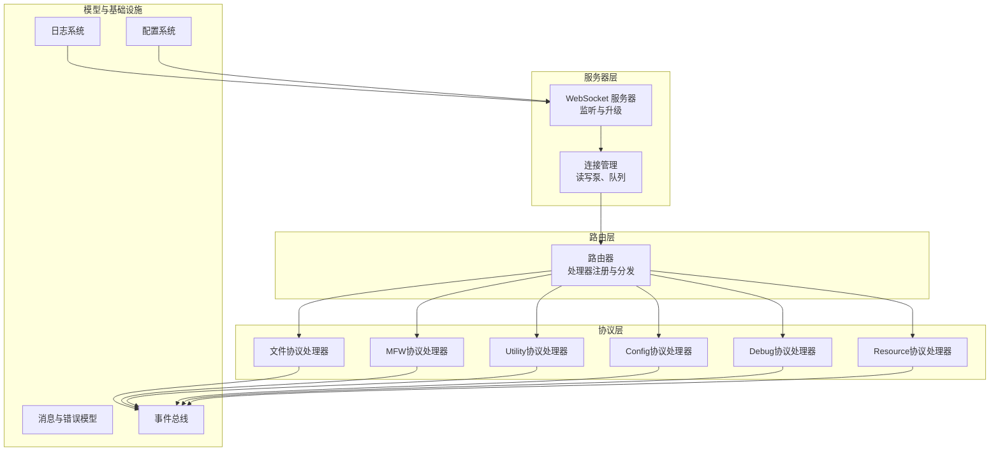
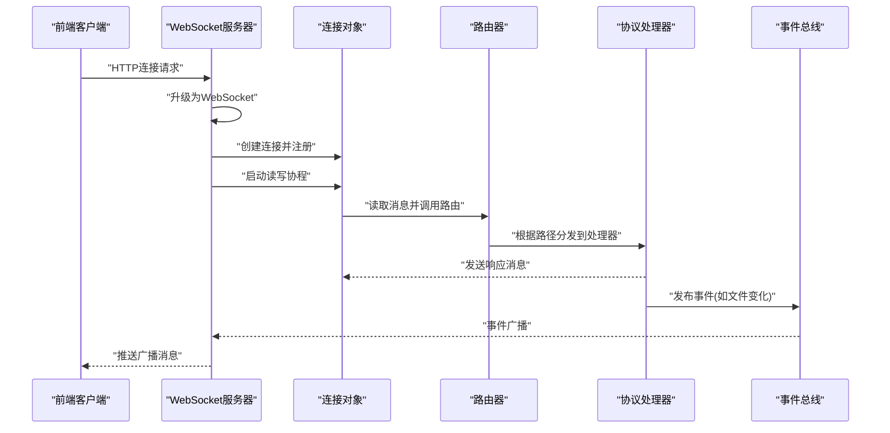
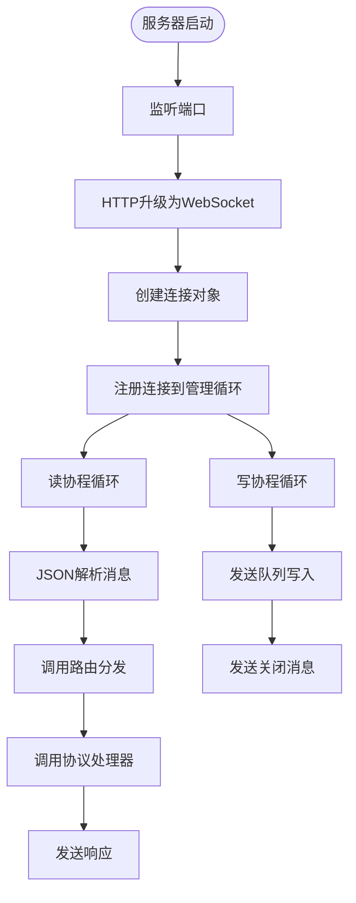
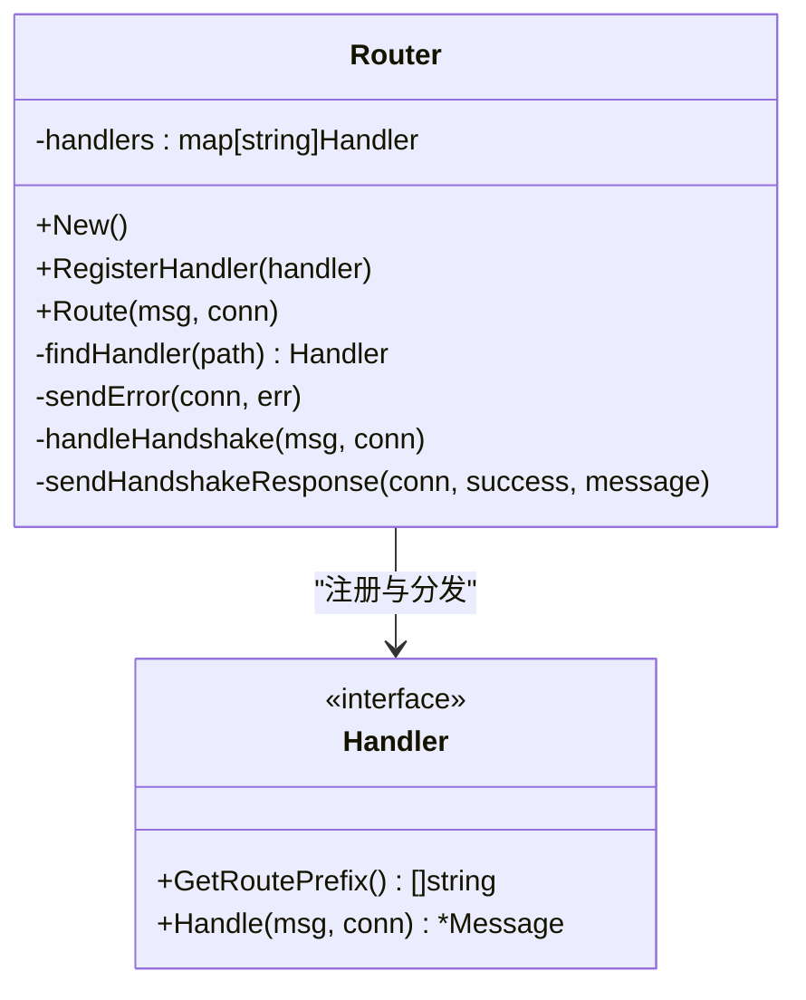
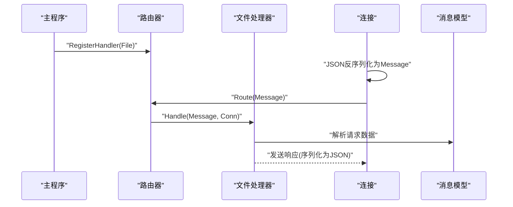
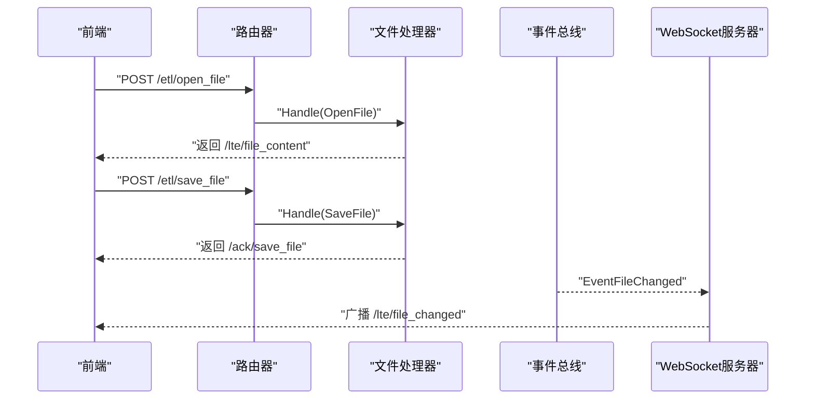
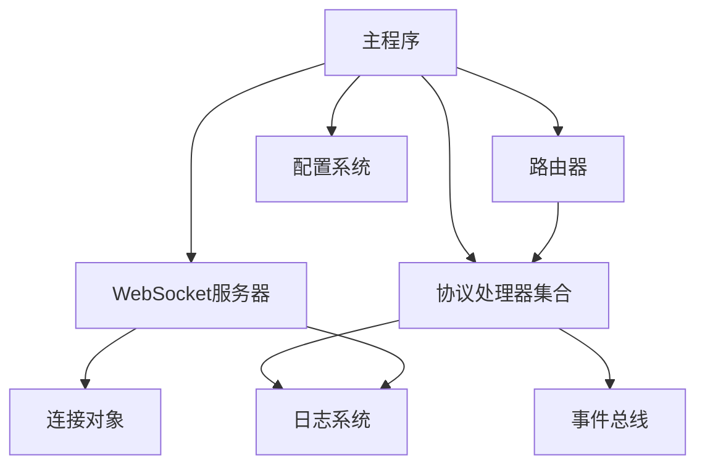

# WebSocket通信机制

<cite>
**本文档引用的文件**
- [router.go](file://LocalBridge/internal/router/router.go)
- [websocket.go](file://LocalBridge/internal/server/websocket.go)
- [connection.go](file://LocalBridge/internal/server/connection.go)
- [message.go](file://LocalBridge/pkg/models/message.go)
- [handler.go](file://LocalBridge/internal/protocol/config/handler.go)
- [handler_v2.go](file://LocalBridge/internal/protocol/debug/handler_v2.go)
- [file_handler.go](file://LocalBridge/internal/protocol/file/file_handler.go)
- [handler.go](file://LocalBridge/internal/protocol/mfw/handler.go)
- [handler.go](file://LocalBridge/internal/protocol/resource/handler.go)
- [handler.go](file://LocalBridge/internal/protocol/utility/handler.go)
- [errors.go](file://LocalBridge/internal/errors/errors.go)
- [main.go](file://LocalBridge/cmd/lb/main.go)
- [config.go](file://LocalBridge/internal/config/config.go)
- [eventbus.go](file://LocalBridge/internal/eventbus/eventbus.go)
- [logger.go](file://LocalBridge/internal/logger/logger.go)
</cite>

## 目录
1. [简介](#简介)
2. [项目结构](#项目结构)
3. [核心组件](#核心组件)
4. [架构总览](#架构总览)
5. [详细组件分析](#详细组件分析)
6. [依赖关系分析](#依赖关系分析)
7. [性能考量](#性能考量)
8. [故障排查指南](#故障排查指南)
9. [结论](#结论)
10. [附录](#附录)

## 简介
本文件全面阐述 LocalBridge 的 WebSocket 通信架构与实现细节，涵盖服务器启动、连接管理、消息路由、协议处理器注册与分发、连接生命周期与错误处理、消息格式规范与安全考虑，并提供通信示例与最佳实践。

## 项目结构
LocalBridge 的 WebSocket 通信相关代码主要分布在以下模块：
- 服务器层：WebSocket 服务器、连接管理
- 路由层：消息路由与协议处理器注册
- 协议层：各类协议处理器（文件、MFW、Utility、Config、Debug、Resource）
- 模型层：消息与错误数据结构
- 配置与事件：配置管理、事件总线、日志推送

图表来源
- [websocket.go:35-93](file://LocalBridge/internal/server/websocket.go#L35-L93)
- [connection.go:12-96](file://LocalBridge/internal/server/connection.go#L12-L96)
- [router.go:28-93](file://LocalBridge/internal/router/router.go#L28-L93)
- [file_handler.go:14-64](file://LocalBridge/internal/protocol/file/file_handler.go#L14-L64)
- [handler.go:11-27](file://LocalBridge/internal/protocol/mfw/handler.go#L11-L27)
- [handler.go:24-41](file://LocalBridge/internal/protocol/utility/handler.go#L24-L41)
- [handler.go:12-23](file://LocalBridge/internal/protocol/config/handler.go#L12-L23)
- [handler_v2.go:16-33](file://LocalBridge/internal/protocol/debug/handler_v2.go#L16-L33)
- [handler.go:22-53](file://LocalBridge/internal/protocol/resource/handler.go#L22-L53)
- [message.go:3-7](file://LocalBridge/pkg/models/message.go#L3-L7)
- [eventbus.go:16-82](file://LocalBridge/internal/eventbus/eventbus.go#L16-L82)
- [logger.go:42-100](file://LocalBridge/internal/logger/logger.go#L42-L100)

章节来源
- [websocket.go:35-93](file://LocalBridge/internal/server/websocket.go#L35-L93)
- [connection.go:12-96](file://LocalBridge/internal/server/connection.go#L12-L96)
- [router.go:28-93](file://LocalBridge/internal/router/router.go#L28-L93)

## 核心组件
- WebSocket 服务器：负责监听端口、HTTP 升级、连接注册与广播。
- 连接对象：封装 gorilla/websocket 连接，维护发送队列，提供读写泵。
- 路由器：注册协议处理器，基于精确匹配与前缀匹配进行消息分发。
- 协议处理器：按路由前缀处理具体业务逻辑，返回响应或触发事件。
- 消息模型：统一的 Message 结构与错误数据结构。
- 事件总线：连接建立/关闭、文件变化、资源扫描等事件的发布订阅。
- 日志系统：控制台与文件日志、历史日志缓存与客户端推送。

章节来源
- [websocket.go:35-93](file://LocalBridge/internal/server/websocket.go#L35-L93)
- [connection.go:12-96](file://LocalBridge/internal/server/connection.go#L12-L96)
- [router.go:28-93](file://LocalBridge/internal/router/router.go#L28-L93)
- [message.go:3-7](file://LocalBridge/pkg/models/message.go#L3-L7)
- [eventbus.go:16-82](file://LocalBridge/internal/eventbus/eventbus.go#L16-L82)
- [logger.go:42-100](file://LocalBridge/internal/logger/logger.go#L42-L100)

## 架构总览
WebSocket 服务器启动后，接收来自前端的连接请求并升级为 WebSocket；每个连接独立维护读写协程，读取 JSON 消息后交由路由器进行分发；路由器根据消息路径选择对应协议处理器；处理器完成业务处理后向连接发送响应或通过事件总线广播消息；日志系统可将日志推送到客户端。

图表来源
- [websocket.go:144-161](file://LocalBridge/internal/server/websocket.go#L144-L161)
- [connection.go:31-59](file://LocalBridge/internal/server/connection.go#L31-L59)
- [router.go:49-76](file://LocalBridge/internal/router/router.go#L49-L76)
- [file_handler.go:243-247](file://LocalBridge/internal/protocol/file/file_handler.go#L243-L247)
- [eventbus.go:37-51](file://LocalBridge/internal/eventbus/eventbus.go#L37-L51)

## 详细组件分析

### WebSocket 服务器与连接管理
- 服务器启动：监听指定主机与端口，设置 HTTP 路由与超时，启动后持续接受连接。
- 连接升级：使用 gorilla/websocket Upgrader，允许任意来源跨域访问。
- 连接注册：维护连接集合，注册/注销通道采用 select 实现并发安全。
- 读写泵：读协程负责 JSON 解析与消息分发；写协程负责发送队列与关闭消息。
- 广播：向所有活跃连接发送消息。

图表来源
- [websocket.go:65-93](file://LocalBridge/internal/server/websocket.go#L65-L93)
- [websocket.go:144-161](file://LocalBridge/internal/server/websocket.go#L144-L161)
- [connection.go:31-76](file://LocalBridge/internal/server/connection.go#L31-L76)

章节来源
- [websocket.go:35-93](file://LocalBridge/internal/server/websocket.go#L35-L93)
- [connection.go:12-96](file://LocalBridge/internal/server/connection.go#L12-L96)

### 路由器与消息分发
- 处理器接口：定义 GetRoutePrefix 与 Handle 方法，便于注册与调用。
- 注册机制：将处理器的路由前缀映射到处理器实例。
- 分发策略：先精确匹配，再前缀匹配；未匹配时返回错误消息。
- 版本握手：统一处理前端协议版本校验，返回握手响应。

图表来源
- [router.go:19-93](file://LocalBridge/internal/router/router.go#L19-L93)

章节来源
- [router.go:28-93](file://LocalBridge/internal/router/router.go#L28-L93)

### 协议处理器注册与消息序列化/反序列化
- 注册流程：在主程序中创建各协议处理器并注册到路由器。
- 序列化/反序列化：连接读协程将字节流反序列化为 models.Message；处理器内部可将请求数据解析为结构体；发送时将响应消息序列化为 JSON。
- 错误处理：统一包装为 models.ErrorData 或 LBError，通过 /error 路径返回。

图表来源
- [main.go:385-413](file://LocalBridge/cmd/lb/main.go#L385-L413)
- [connection.go:47-57](file://LocalBridge/internal/server/connection.go#L47-L57)
- [file_handler.go:302-315](file://LocalBridge/internal/protocol/file/file_handler.go#L302-L315)
- [message.go:3-7](file://LocalBridge/pkg/models/message.go#L3-L7)

章节来源
- [main.go:385-413](file://LocalBridge/cmd/lb/main.go#L385-L413)
- [connection.go:47-57](file://LocalBridge/internal/server/connection.go#L47-L57)
- [file_handler.go:302-315](file://LocalBridge/internal/protocol/file/file_handler.go#L302-L315)
- [message.go:3-7](file://LocalBridge/pkg/models/message.go#L3-L7)

### 协议处理器详解

#### 文件协议处理器
- 路由前缀：/etl/open_file、/etl/save_file、/etl/save_separated、/etl/create_file、/etl/refresh_file_list。
- 功能：打开/保存/分离保存文件、创建文件、刷新文件列表；订阅连接建立与文件变化事件，推送文件列表与变化通知。
- 错误处理：封装文件读写错误为 LBError 并返回。

图表来源
- [file_handler.go:48-64](file://LocalBridge/internal/protocol/file/file_handler.go#L48-L64)
- [file_handler.go:139-166](file://LocalBridge/internal/protocol/file/file_handler.go#L139-L166)
- [file_handler.go:249-284](file://LocalBridge/internal/protocol/file/file_handler.go#L249-L284)

章节来源
- [file_handler.go:14-64](file://LocalBridge/internal/protocol/file/file_handler.go#L14-L64)
- [file_handler.go:139-166](file://LocalBridge/internal/protocol/file/file_handler.go#L139-L166)
- [file_handler.go:249-284](file://LocalBridge/internal/protocol/file/file_handler.go#L249-L284)

#### MFW 协议处理器
- 路由前缀：/etl/mfw/*，覆盖设备、控制器、任务、资源等操作。
- 功能：刷新设备列表、创建/断开控制器、截图、输入、任务提交与状态查询、资源加载等。
- 错误处理：针对 MFW 服务状态与操作失败返回特定错误码。

章节来源
- [handler.go:23-27](file://LocalBridge/internal/protocol/mfw/handler.go#L23-L27)
- [handler.go:43-117](file://LocalBridge/internal/protocol/mfw/handler.go#L43-L117)

#### Utility 协议处理器
- 路由前缀：/etl/utility/*，提供 OCR 识别、图片路径解析、打开日志等功能。
- 功能：OCR 识别（绑定控制器与资源，提交任务，解析结果）、图片路径解析、打开日志目录。
- 错误处理：封装 OCR 资源配置、控制器状态等错误。

章节来源
- [handler.go:38-41](file://LocalBridge/internal/protocol/utility/handler.go#L38-L41)
- [handler.go:48-65](file://LocalBridge/internal/protocol/utility/handler.go#L48-L65)
- [handler.go:67-119](file://LocalBridge/internal/protocol/utility/handler.go#L67-L119)

#### Config 协议处理器
- 路由前缀：/etl/config/*，提供获取/设置配置、内部重载配置。
- 功能：读取/更新全局配置并持久化；发布配置重载事件。

章节来源
- [handler.go:20-23](file://LocalBridge/internal/protocol/config/handler.go#L20-L23)
- [handler.go:48-47](file://LocalBridge/internal/protocol/config/handler.go#L48-L47)

#### Debug 协议处理器
- 路由前缀：/mpe/debug/*，提供调试会话管理、启动/运行/停止、节点数据查询、截图等。
- 功能：创建/销毁/列出/获取会话，启动/运行/停止任务，事件回调推送。

章节来源
- [handler_v2.go:30-33](file://LocalBridge/internal/protocol/debug/handler_v2.go#L30-L33)
- [handler_v2.go:47-79](file://LocalBridge/internal/protocol/debug/handler_v2.go#L47-L79)

#### Resource 协议处理器
- 路由前缀：/etl/get_image、/etl/get_images、/etl/get_image_list、/etl/refresh_resources。
- 功能：获取图片、批量获取、图片列表、刷新资源包；订阅事件推送资源包列表。

章节来源
- [handler.go:45-53](file://LocalBridge/internal/protocol/resource/handler.go#L45-L53)
- [handler.go:107-114](file://LocalBridge/internal/protocol/resource/handler.go#L107-L114)
- [handler.go:219-232](file://LocalBridge/internal/protocol/resource/handler.go#L219-L232)

### 连接生命周期管理、心跳与断线重连
- 生命周期：连接建立时注册到服务器管理循环，发布连接建立事件；断开时注销并发布连接关闭事件。
- 心跳检测：代码中未发现显式的 ping/pong 心跳机制。
- 断线重连：前端需自行实现重连策略；服务器端在连接断开时会清理发送队列并关闭底层连接。

章节来源
- [websocket.go:114-142](file://LocalBridge/internal/server/websocket.go#L114-L142)
- [connection.go:31-59](file://LocalBridge/internal/server/connection.go#L31-L59)
- [eventbus.go:74-82](file://LocalBridge/internal/eventbus/eventbus.go#L74-L82)

### 消息格式规范与错误处理
- 消息结构：Message{Path, Data}，Path 为路由路径，Data 为任意 JSON 数据。
- 错误结构：ErrorData{Code, Message, Detail}，统一通过 /error 路径返回。
- 错误码：预定义多种业务错误码，便于前端识别与处理。

章节来源
- [message.go:3-14](file://LocalBridge/pkg/models/message.go#L3-L14)
- [errors.go:9-20](file://LocalBridge/internal/errors/errors.go#L9-L20)
- [errors.go:43-50](file://LocalBridge/internal/errors/errors.go#L43-L50)

### 安全考虑
- 跨域策略：Upgrader 的 CheckOrigin 返回 true，允许任意来源；生产环境建议限制来源。
- 路由安全：路由器对未知路由返回错误；协议处理器对无效请求返回错误。
- 配置安全：配置文件路径规范化与安全检查，避免扫描高风险目录。

章节来源
- [websocket.go:24-30](file://LocalBridge/internal/server/websocket.go#L24-L30)
- [router.go:60-65](file://LocalBridge/internal/router/router.go#L60-L65)
- [config.go:234-296](file://LocalBridge/internal/config/config.go#L234-L296)

## 依赖关系分析

图表来源
- [main.go:317-413](file://LocalBridge/cmd/lb/main.go#L317-L413)
- [websocket.go:35-58](file://LocalBridge/internal/server/websocket.go#L35-L58)
- [router.go:28-47](file://LocalBridge/internal/router/router.go#L28-L47)
- [eventbus.go:16-27](file://LocalBridge/internal/eventbus/eventbus.go#L16-L27)
- [logger.go:42-100](file://LocalBridge/internal/logger/logger.go#L42-L100)
- [config.go:53-95](file://LocalBridge/internal/config/config.go#L53-L95)

章节来源
- [main.go:317-413](file://LocalBridge/cmd/lb/main.go#L317-L413)
- [eventbus.go:16-27](file://LocalBridge/internal/eventbus/eventbus.go#L16-L27)
- [logger.go:42-100](file://LocalBridge/internal/logger/logger.go#L42-L100)

## 性能考量
- 发送队列：连接发送队列为带缓冲的 channel，避免阻塞；当队列满时会丢弃消息并记录警告。
- 广播：遍历所有连接发送消息，连接数较多时需关注内存与带宽占用。
- JSON 序列化：每次发送前进行 JSON 编码，建议减少不必要的大对象传输。
- 事件广播：文件/资源变化事件会触发广播，建议前端按需订阅。

章节来源
- [connection.go:78-95](file://LocalBridge/internal/server/connection.go#L78-L95)
- [file_handler.go:287-300](file://LocalBridge/internal/protocol/file/file_handler.go#L287-L300)
- [handler.go:234-245](file://LocalBridge/internal/protocol/resource/handler.go#L234-L245)

## 故障排查指南
- 握手失败：检查前端协议版本与服务器版本是否一致；查看握手响应中的 RequiredVersion。
- 路由错误：确认消息 Path 是否正确；查看路由器对未知路由的错误返回。
- 文件操作失败：检查文件路径合法性与权限；查看 LBError 的详细信息。
- MFW 功能不可用：确认 MaaFramework 路径配置与库版本兼容性。
- 日志未推送：检查日志级别与 push_to_client 配置；确认连接建立后历史日志推送。

章节来源
- [router.go:107-133](file://LocalBridge/internal/router/router.go#L107-L133)
- [router.go:95-105](file://LocalBridge/internal/router/router.go#L95-L105)
- [errors.go:75-141](file://LocalBridge/internal/errors/errors.go#L75-L141)
- [config.go:256-298](file://LocalBridge/internal/config/config.go#L256-L298)
- [logger.go:31-40](file://LocalBridge/internal/logger/logger.go#L31-L40)

## 结论
LocalBridge 的 WebSocket 通信架构以清晰的分层设计实现了稳定的连接管理与灵活的消息路由。通过事件总线与日志系统增强了可观测性与扩展性。建议在生产环境中完善心跳机制、来源校验与鉴权策略，并优化大对象传输与广播性能。

## 附录

### 通信示例（路径与数据）
- 握手请求：Path="/system/handshake"，Data={protocol_version: "0.7.4"}
- 握手响应：Path="/system/handshake/response"，Data={success, server_version, required_version, message}
- 打开文件：Path="/etl/open_file"，Data={file_path}
- 保存文件：Path="/etl/save_file"，Data={file_path, content, indent}
- 分离保存：Path="/etl/save_separated"，Data={pipeline_path, config_path, pipeline, config, indent}
- 创建文件：Path="/etl/create_file"，Data={file_name, directory, content?}
- 刷新文件列表：Path="/etl/refresh_file_list"
- MFW 截图：Path="/etl/mfw/request_screencap"，Data={controller_id}
- Utility OCR：Path="/etl/utility/ocr_recognize"，Data={controller_id, resource_id, roi:[x,y,w,h]}
- Debug 启动：Path="/mpe/debug/start"，Data={resource_paths[], entry, controller_id, agent_identifier?, pipeline_override?}
- Resource 获取图片：Path="/etl/get_image"，Data={relative_path}

章节来源
- [message.go:101-125](file://LocalBridge/pkg/models/message.go#L101-L125)
- [file_handler.go:67-137](file://LocalBridge/internal/protocol/file/file_handler.go#L67-L137)
- [file_handler.go:139-208](file://LocalBridge/internal/protocol/file/file_handler.go#L139-L208)
- [file_handler.go:210-241](file://LocalBridge/internal/protocol/file/file_handler.go#L210-L241)
- [handler.go:348-381](file://LocalBridge/internal/protocol/mfw/handler.go#L348-L381)
- [handler.go:67-119](file://LocalBridge/internal/protocol/utility/handler.go#L67-L119)
- [handler_v2.go:229-294](file://LocalBridge/internal/protocol/debug/handler_v2.go#L229-L294)
- [handler.go:71-105](file://LocalBridge/internal/protocol/resource/handler.go#L71-L105)

### 最佳实践
- 前端：实现指数退避重连、心跳探测（建议）、错误分类处理与用户提示。
- 后端：限制来源域名、增加鉴权中间件、优化广播频率、对大对象进行压缩或分片。
- 配置：合理设置扫描深度与文件数量限制，避免高风险目录扫描。
- 日志：开启 push_to_client 以便前端实时查看日志，同时保留文件日志便于问题追踪。

章节来源
- [websocket.go:24-30](file://LocalBridge/internal/server/websocket.go#L24-L30)
- [config.go:103-123](file://LocalBridge/internal/config/config.go#L103-L123)
- [logger.go:60-63](file://LocalBridge/internal/logger/logger.go#L60-L63)