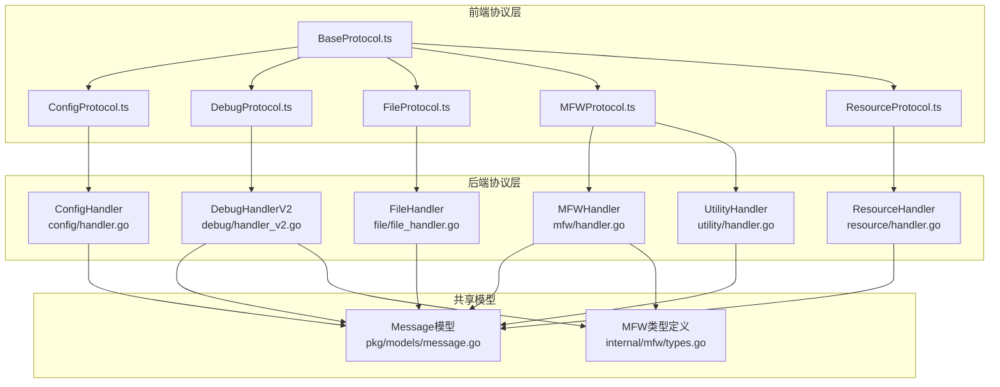
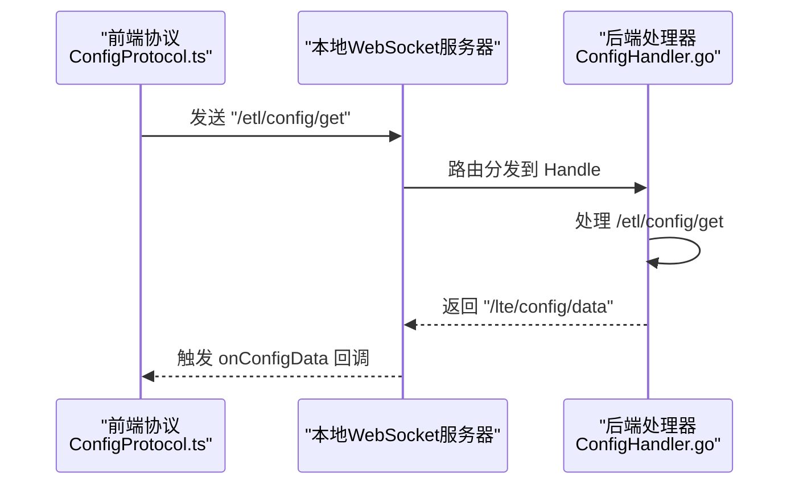
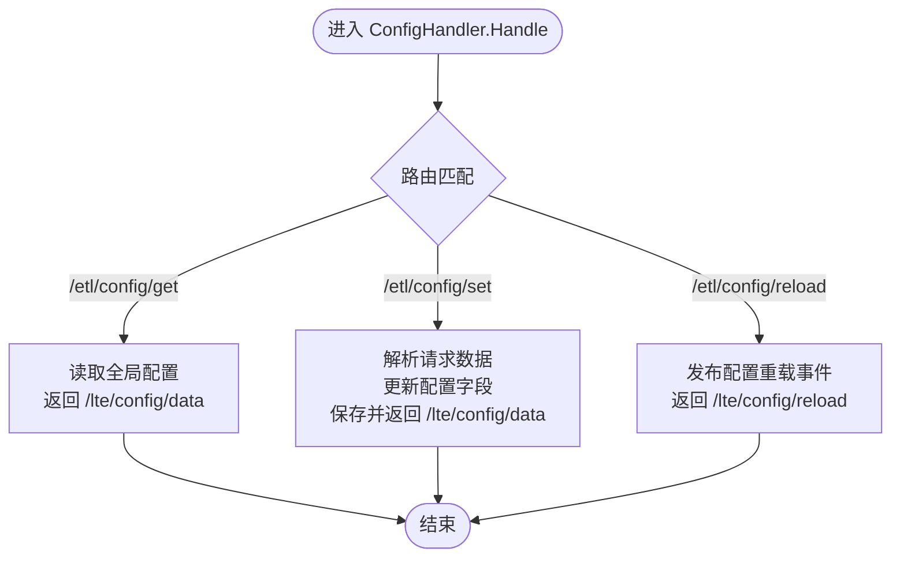
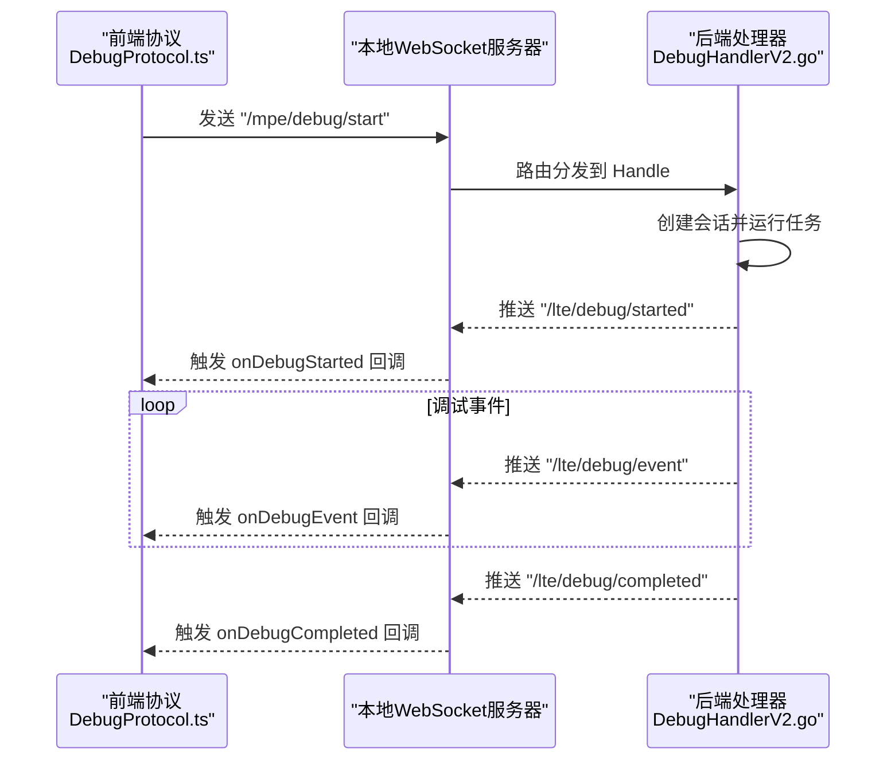
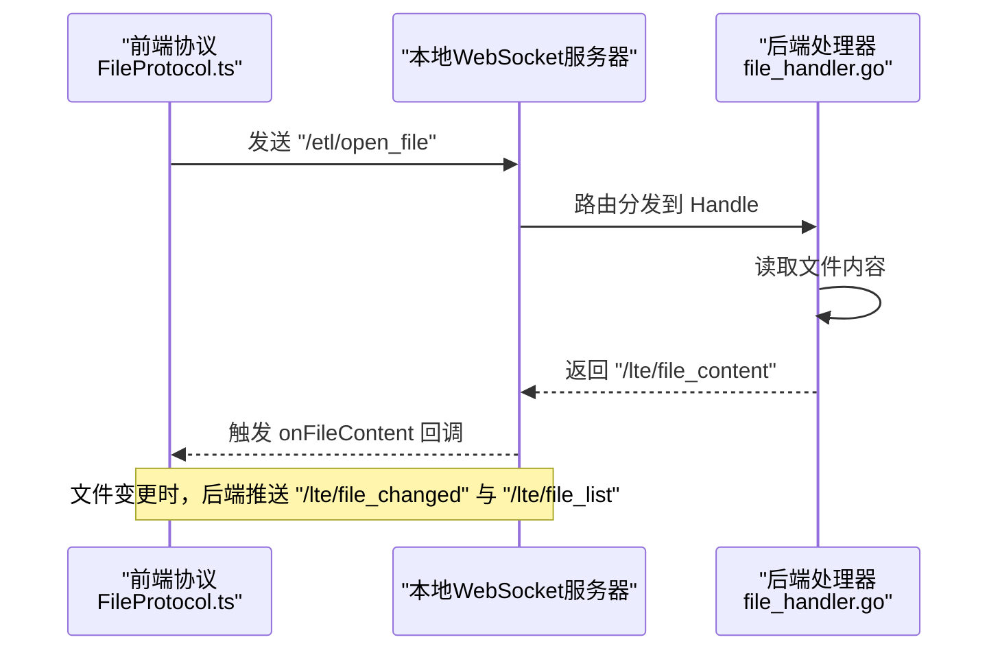
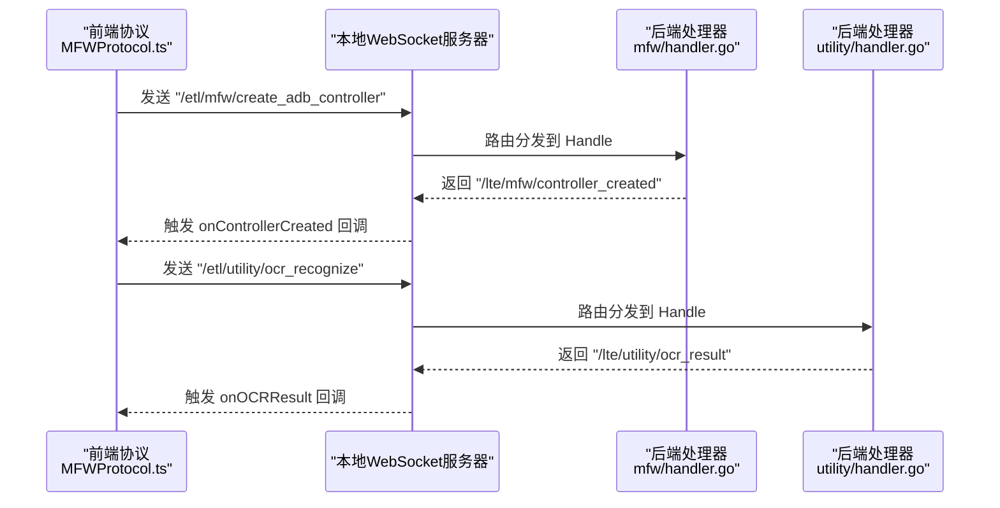
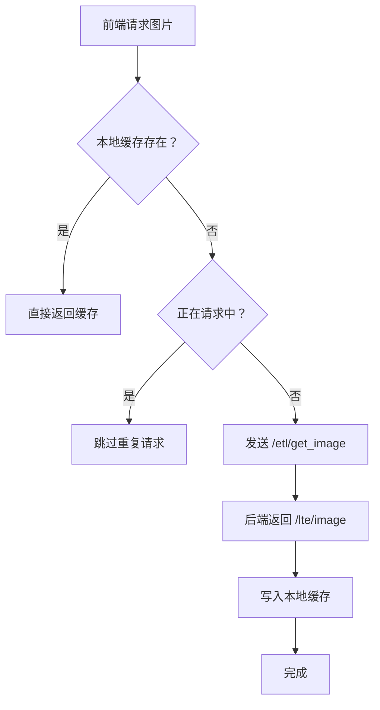
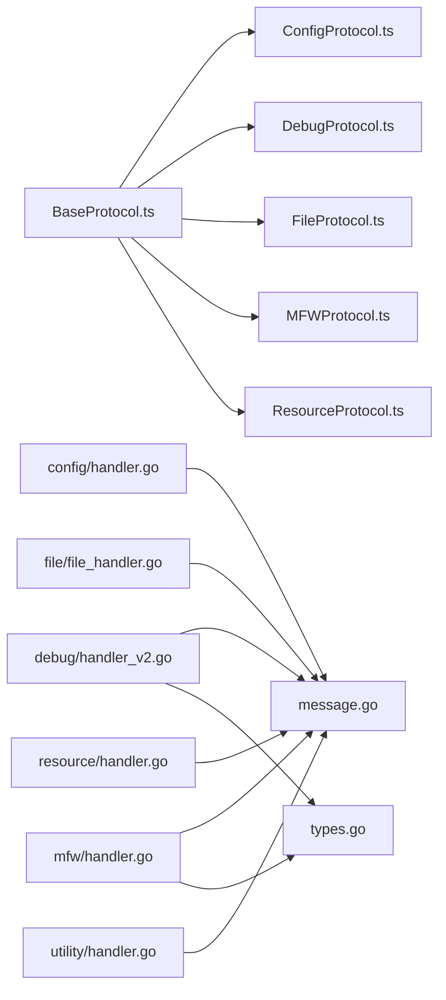

# 协议处理器

<cite>
**本文档引用的文件**
- [LocalBridge\internal\protocol\config\handler.go](file://LocalBridge/internal/protocol/config/handler.go)
- [LocalBridge\internal\protocol\debug\handler_v2.go](file://LocalBridge/internal/protocol/debug/handler_v2.go)
- [LocalBridge\internal\protocol\file\file_handler.go](file://LocalBridge/internal/protocol/file/file_handler.go)
- [LocalBridge\internal\protocol\mfw\handler.go](file://LocalBridge/internal/protocol/mfw/handler.go)
- [LocalBridge\internal\protocol\resource\handler.go](file://LocalBridge/internal/protocol/resource/handler.go)
- [LocalBridge\internal\protocol\utility\handler.go](file://LocalBridge/internal/protocol/utility/handler.go)
- [LocalBridge\pkg\models\message.go](file://LocalBridge/pkg/models/message.go)
- [LocalBridge\internal\mfw\types.go](file://LocalBridge/internal/mfw/types.go)
- [src\services\protocols\BaseProtocol.ts](file://src/services/protocols/BaseProtocol.ts)
- [src\services\protocols\ConfigProtocol.ts](file://src/services/protocols/ConfigProtocol.ts)
- [src\services\protocols\DebugProtocol.ts](file://src/services/protocols/DebugProtocol.ts)
- [src\services\protocols\FileProtocol.ts](file://src/services/protocols/FileProtocol.ts)
- [src\services\protocols\MFWProtocol.ts](file://src/services/protocols/MFWProtocol.ts)
- [src\services\protocols\ResourceProtocol.ts](file://src/services/protocols/ResourceProtocol.ts)
</cite>

## 目录
1. [简介](#简介)
2. [项目结构](#项目结构)
3. [核心组件](#核心组件)
4. [架构总览](#架构总览)
5. [详细组件分析](#详细组件分析)
6. [依赖关系分析](#依赖关系分析)
7. [性能考虑](#性能考虑)
8. [故障排查指南](#故障排查指南)
9. [结论](#结论)
10. [附录](#附录)

## 简介
本文件系统性梳理了本地桥接服务中各类 WebSocket 协议处理器的实现与功能特性，覆盖配置协议(ConfigProtocol)、调试协议(DebugProtocol)、文件协议(FileProtocol)、MFW 协议(MFWProtocol)、资源协议(ResourceProtocol)以及工具协议(UtilityProtocol)。文档从架构设计、数据流、处理逻辑、集成点、错误处理与性能特征等维度进行深入分析，并提供 API 接口说明、使用示例与最佳实践建议，帮助开发者与使用者高效理解与运用。

## 项目结构
- 后端协议处理器位于 LocalBridge 内部，按功能划分为 config、debug、file、mfw、resource、utility 等子包，分别对应不同业务域的消息处理。
- 前端协议封装位于 src/services/protocols，统一继承 BaseProtocol 抽象类，负责与本地 WebSocket 服务器交互，暴露易用的 API 方法与回调机制。
- 模型定义位于 LocalBridge/pkg/models，前后端共享消息结构，确保协议一致性。

图表来源
- [src\services\protocols\BaseProtocol.ts:1-40](file://src/services/protocols/BaseProtocol.ts#L1-L40)
- [src\services\protocols\ConfigProtocol.ts:1-197](file://src/services/protocols/ConfigProtocol.ts#L1-L197)
- [src\services\protocols\DebugProtocol.ts:1-800](file://src/services/protocols/DebugProtocol.ts#L1-L800)
- [src\services\protocols\FileProtocol.ts:1-607](file://src/services/protocols/FileProtocol.ts#L1-L607)
- [src\services\protocols\MFWProtocol.ts:1-774](file://src/services/protocols/MFWProtocol.ts#L1-L774)
- [src\services\protocols\ResourceProtocol.ts:1-271](file://src/services/protocols/ResourceProtocol.ts#L1-L271)
- [LocalBridge\internal\protocol\config\handler.go:1-237](file://LocalBridge/internal/protocol/config/handler.go#L1-L237)
- [LocalBridge\internal\protocol\debug\handler_v2.go:1-520](file://LocalBridge/internal/protocol/debug/handler_v2.go#L1-L520)
- [LocalBridge\internal\protocol\file\file_handler.go:1-328](file://LocalBridge/internal/protocol/file/file_handler.go#L1-L328)
- [LocalBridge\internal\protocol\mfw\handler.go:1-860](file://LocalBridge/internal/protocol/mfw/handler.go#L1-L860)
- [LocalBridge\internal\protocol\resource\handler.go:1-272](file://LocalBridge/internal/protocol/resource/handler.go#L1-L272)
- [LocalBridge\internal\protocol\utility\handler.go:1-694](file://LocalBridge/internal/protocol/utility/handler.go#L1-L694)
- [LocalBridge\pkg\models\message.go:1-126](file://LocalBridge/pkg/models/message.go#L1-L126)
- [LocalBridge\internal\mfw\types.go:1-124](file://LocalBridge/internal/mfw/types.go#L1-L124)

章节来源
- [LocalBridge\internal\protocol\config\handler.go:1-237](file://LocalBridge/internal/protocol/config/handler.go#L1-L237)
- [LocalBridge\internal\protocol\debug\handler_v2.go:1-520](file://LocalBridge/internal/protocol/debug/handler_v2.go#L1-L520)
- [LocalBridge\internal\protocol\file\file_handler.go:1-328](file://LocalBridge/internal/protocol/file/file_handler.go#L1-L328)
- [LocalBridge\internal\protocol\mfw\handler.go:1-860](file://LocalBridge/internal/protocol/mfw/handler.go#L1-L860)
- [LocalBridge\internal\protocol\resource\handler.go:1-272](file://LocalBridge/internal/protocol/resource/handler.go#L1-L272)
- [LocalBridge\internal\protocol\utility\handler.go:1-694](file://LocalBridge/internal/protocol/utility/handler.go#L1-L694)
- [LocalBridge\pkg\models\message.go:1-126](file://LocalBridge/pkg/models/message.go#L1-L126)
- [LocalBridge\internal\mfw\types.go:1-124](file://LocalBridge/internal/mfw/types.go#L1-L124)
- [src\services\protocols\BaseProtocol.ts:1-40](file://src/services/protocols/BaseProtocol.ts#L1-L40)
- [src\services\protocols\ConfigProtocol.ts:1-197](file://src/services/protocols/ConfigProtocol.ts#L1-L197)
- [src\services\protocols\DebugProtocol.ts:1-800](file://src/services/protocols/DebugProtocol.ts#L1-L800)
- [src\services\protocols\FileProtocol.ts:1-607](file://src/services/protocols/FileProtocol.ts#L1-L607)
- [src\services\protocols\MFWProtocol.ts:1-774](file://src/services/protocols/MFWProtocol.ts#L1-L774)
- [src\services\protocols\ResourceProtocol.ts:1-271](file://src/services/protocols/ResourceProtocol.ts#L1-L271)

## 核心组件
- 配置协议(ConfigProtocol)
  - 功能：提供后端配置的获取、设置与重载能力；支持参数校验与错误码返回；前端通过回调订阅配置变更。
  - 关键接口：requestGetConfig、requestSetConfig、requestReload；onConfigData、onReload。
  - 后端处理器：ConfigHandler，路由前缀 /etl/config/，支持 /etl/config/get、/etl/config/set、/etl/config/reload。
- 调试协议(DebugProtocol)
  - 功能：会话生命周期管理（创建/销毁/列举/获取）、调试控制（启动/运行/停止）、节点数据查询、截图；事件驱动的状态监控与日志推送。
  - 关键接口：会话管理、调试控制、数据查询、截图；事件回调与错误处理。
  - 后端处理器：DebugHandlerV2，路由前缀 /mpe/debug/，支持 /mpe/debug/* 系列路由。
- 文件协议(FileProtocol)
  - 功能：文件打开、保存、分离保存、创建、刷新列表；文件变更通知与自动重载；保存确认机制与超时处理。
  - 关键接口：requestOpenFile、requestCreateFile、requestSaveSeparated、requestRefreshFileList；onFileList、onFileContent、onFileChanged。
  - 后端处理器：Handler，路由前缀 /etl/open_file、/etl/save_file、/etl/save_separated、/etl/create_file、/etl/refresh_file_list。
- MFW 协议(MFWProtocol)
  - 功能：设备发现（ADB/Win32/PlayCover/Gamepad）、控制器创建与连接、控制器操作（点击/滑动/输入/按键/滚动/Shell）、截图、任务提交与状态查询、资源加载；OCR 识别与图片路径解析、日志打开。
  - 关键接口：设备刷新、控制器创建、控制器操作、截图、OCR、路径解析、打开日志；回调注册与注销。
  - 后端处理器：MFWHandler，路由前缀 /etl/mfw/；UtilityHandler，路由前缀 /etl/utility/。
- 资源协议(ResourceProtocol)
  - 功能：图片获取（单张/批量）、资源包列表推送、图片列表查询与过滤；基于前端缓存的去重与并发控制。
  - 关键接口：requestImage、requestImages、requestRefreshResources、requestImageList；onImage、onImages、onImageList。
  - 后端处理器：Handler，路由前缀 /etl/get_image、/etl/get_images、/etl/get_image_list、/etl/refresh_resources。
- 工具协议(UtilityProtocol)
  - 功能：OCR 识别（截图+OCR+结果解析）、图片路径解析（跨 image 目录搜索）、日志打开（跨平台）。
  - 后端处理器：UtilityHandler，路由前缀 /etl/utility/，支持 /etl/utility/ocr_recognize、resolve_image_path、open_log。

章节来源
- [src\services\protocols\ConfigProtocol.ts:1-197](file://src/services/protocols/ConfigProtocol.ts#L1-L197)
- [src\services\protocols\DebugProtocol.ts:1-800](file://src/services/protocols/DebugProtocol.ts#L1-L800)
- [src\services\protocols\FileProtocol.ts:1-607](file://src/services/protocols/FileProtocol.ts#L1-L607)
- [src\services\protocols\MFWProtocol.ts:1-774](file://src/services/protocols/MFWProtocol.ts#L1-L774)
- [src\services\protocols\ResourceProtocol.ts:1-271](file://src/services/protocols/ResourceProtocol.ts#L1-L271)
- [LocalBridge\internal\protocol\config\handler.go:1-237](file://LocalBridge/internal/protocol/config/handler.go#L1-L237)
- [LocalBridge\internal\protocol\debug\handler_v2.go:1-520](file://LocalBridge/internal/protocol/debug/handler_v2.go#L1-L520)
- [LocalBridge\internal\protocol\file\file_handler.go:1-328](file://LocalBridge/internal/protocol/file/file_handler.go#L1-L328)
- [LocalBridge\internal\protocol\mfw\handler.go:1-860](file://LocalBridge/internal/protocol/mfw/handler.go#L1-L860)
- [LocalBridge\internal\protocol\resource\handler.go:1-272](file://LocalBridge/internal/protocol/resource/handler.go#L1-L272)
- [LocalBridge\internal\protocol\utility\handler.go:1-694](file://LocalBridge/internal/protocol/utility/handler.go#L1-L694)

## 架构总览
- 前端协议层通过 BaseProtocol 抽象统一注册路由、发送消息与接收回调；后端协议层以处理器为核心，按路由分发到具体处理函数。
- 共享模型 Message 与各业务模型确保前后端数据结构一致；MFW 类型定义支撑控制器、资源、任务等复杂对象。
- 事件总线与广播机制用于文件与资源的变更通知与自动刷新。

图表来源
- [src\services\protocols\ConfigProtocol.ts:128-135](file://src/services/protocols/ConfigProtocol.ts#L128-L135)
- [LocalBridge\internal\protocol\config\handler.go:49-68](file://LocalBridge/internal/protocol/config/handler.go#L49-L68)
- [LocalBridge\pkg\models\message.go:1-126](file://LocalBridge/pkg/models/message.go#L1-L126)

## 详细组件分析

### 配置协议(ConfigProtocol)
- 参数管理
  - 支持 server.host、server.port、file.root、file.exclude、file.extensions、log.level、log.dir、log.push_to_client、maafw.enabled、maafw.lib_dir、maafw.resource_dir 等字段的读取与更新。
  - 更新时进行字段类型校验与转换，未发生有效更新时返回 NO_CHANGES 错误。
- 配置同步机制
  - set 接口写入全局配置并持久化；reload 接口触发事件总线发布配置重载事件，后端服务据此重新加载配置。
  - 前端通过 onConfigData 订阅配置推送，onReload 订阅重载完成事件。
- API 接口
  - 后端路由：/etl/config/get、/etl/config/set、/etl/config/reload
  - 前端方法：requestGetConfig、requestSetConfig、requestReload；回调：onConfigData、onReload

图表来源
- [LocalBridge\internal\protocol\config\handler.go:26-204](file://LocalBridge/internal/protocol/config/handler.go#L26-L204)

章节来源
- [LocalBridge\internal\protocol\config\handler.go:1-237](file://LocalBridge/internal/protocol/config/handler.go#L1-L237)
- [src\services\protocols\ConfigProtocol.ts:1-197](file://src/services/protocols/ConfigProtocol.ts#L1-L197)

### 调试协议(DebugProtocol)
- 日志处理
  - 通过后端日志模块记录调试过程；前端 DebugProtocol 订阅 /lte/debug/event 事件，按事件类型更新调试状态与 UI。
- 状态监控
  - 会话管理：创建/销毁/列举/获取；调试控制：启动/运行/停止；节点数据查询与截图。
  - 事件驱动：节点执行、识别、动作、暂停、完成、错误等事件均映射为前端调试状态机事件。
- 错误诊断
  - /lte/debug/error 错误推送；资源加载失败时弹出 Modal 提示修正资源路径。
- API 接口
  - 后端路由：/mpe/debug/create_session、/mpe/debug/destroy_session、/mpe/debug/list_sessions、/mpe/debug/get_session、/mpe/debug/start、/mpe/debug/run、/mpe/debug/stop、/mpe/debug/get_node_data、/mpe/debug/screencap
  - 前端方法：会话管理、调试控制、数据查询、截图；事件回调：onDebugEvent、onDebugError、onDebugCompleted、onDebugStarted、onDebugStopped

图表来源
- [LocalBridge\internal\protocol\debug\handler_v2.go:229-294](file://LocalBridge/internal/protocol/debug/handler_v2.go#L229-L294)
- [src\services\protocols\DebugProtocol.ts:574-708](file://src/services/protocols/DebugProtocol.ts#L574-L708)

章节来源
- [LocalBridge\internal\protocol\debug\handler_v2.go:1-520](file://LocalBridge/internal/protocol/debug/handler_v2.go#L1-L520)
- [src\services\protocols\DebugProtocol.ts:1-800](file://src/services/protocols/DebugProtocol.ts#L1-L800)

### 文件协议(FileProtocol)
- 文件操作
  - 打开文件：/etl/open_file；保存文件：/etl/save_file；分离保存：/etl/save_separated；创建文件：/etl/create_file；刷新列表：/etl/refresh_file_list。
- 目录遍历
  - 通过事件总线订阅文件变更，自动推送 /lte/file_list 与 /lte/file_changed；支持 created/modified/deleted/renamed 等类型。
- 文件监控机制
  - 保存确认采用 Promise + 超时机制（默认 10 秒），避免阻塞 UI；自动重载与手动确认两种策略。
- API 接口
  - 前端方法：requestOpenFile、requestCreateFile、requestSaveSeparated、requestRefreshFileList；回调：onFileList、onFileContent、onFileChanged、onSaveAck、onSaveSeparatedAck、onCreateFileAck

图表来源
- [LocalBridge\internal\protocol\file\file_handler.go:67-137](file://LocalBridge/internal/protocol/file/file_handler.go#L67-L137)
- [src\services\protocols\FileProtocol.ts:109-141](file://src/services/protocols/FileProtocol.ts#L109-L141)

章节来源
- [LocalBridge\internal\protocol\file\file_handler.go:1-328](file://LocalBridge/internal/protocol/file/file_handler.go#L1-L328)
- [src\services\protocols\FileProtocol.ts:1-607](file://src/services/protocols/FileProtocol.ts#L1-L607)

### MFW 协议(MFWProtocol)
- 设备控制
  - ADB/Win32/PlayCover/Gamepad 设备发现与控制器创建；自动连接；断开连接；状态推送。
- OCR 识别
  - 通过 UtilityHandler 的 /etl/utility/ocr_recognize 实现；支持 ROI 区域、OCR 资源加载、结果解析与空内容兜底。
- 动作执行
  - 点击、滑动、输入文本、启动/停止应用、按键、手柄触摸、滚动、Shell、Inactive 等控制器操作。
- API 接口
  - 设备与控制器：refreshAdbDevices、refreshWin32Windows、createAdbController、createWin32Controller、createPlayCoverController、createGamepadController、disconnectController
  - 控制器操作：click、swipe、inputText、startApp、stopApp、clickKey、touchGamepad、scroll、keyDown、keyUp、clickV2、swipeV2、shell、inactive
  - OCR 与工具：requestOCR、requestResolveImagePath、requestOpenLog；回调：onScreencapResult、onOCRResult、onImagePathResolved、onLogOpened

图表来源
- [LocalBridge\internal\protocol\mfw\handler.go:159-203](file://LocalBridge/internal/protocol/mfw/handler.go#L159-L203)
- [LocalBridge\internal\protocol\utility\handler.go:68-119](file://LocalBridge/internal/protocol/utility/handler.go#L68-L119)
- [src\services\protocols\MFWProtocol.ts:302-330](file://src/services/protocols/MFWProtocol.ts#L302-L330)
- [src\services\protocols\MFWProtocol.ts:470-482](file://src/services/protocols/MFWProtocol.ts#L470-L482)

章节来源
- [LocalBridge\internal\protocol\mfw\handler.go:1-860](file://LocalBridge/internal/protocol/mfw/handler.go#L1-L860)
- [LocalBridge\internal\protocol\utility\handler.go:1-694](file://LocalBridge/internal/protocol/utility/handler.go#L1-L694)
- [src\services\protocols\MFWProtocol.ts:1-774](file://src/services/protocols/MFWProtocol.ts#L1-L774)
- [LocalBridge\internal\mfw\types.go:1-124](file://LocalBridge/internal/mfw/types.go#L1-L124)

### 资源协议(ResourceProtocol)
- 资源管理
  - 资源包列表推送：/lte/resource_bundles；图片获取：/etl/get_image、/etl/get_images；图片列表：/etl/get_image_list；刷新资源：/etl/refresh_resources。
- 缓存策略
  - 前端本地缓存图片 Base64、MIME、尺寸与来源资源包；请求去重（pending 标记）；加载完成后更新缓存。
- 版本控制
  - 通过资源包名称与路径区分不同版本资源；图片列表返回 bundle_name 与 is_filtered 标识。
- API 接口
  - 前端方法：requestImage、requestImages、requestRefreshResources、requestImageList；回调：onImage、onImages、onImageList

图表来源
- [LocalBridge\internal\protocol\resource\handler.go:71-182](file://LocalBridge/internal/protocol/resource/handler.go#L71-L182)
- [src\services\protocols\ResourceProtocol.ts:149-173](file://src/services/protocols/ResourceProtocol.ts#L149-L173)

章节来源
- [LocalBridge\internal\protocol\resource\handler.go:1-272](file://LocalBridge/internal/protocol/resource/handler.go#L1-L272)
- [src\services\protocols\ResourceProtocol.ts:1-271](file://src/services/protocols/ResourceProtocol.ts#L1-L271)

### 工具协议(UtilityProtocol)
- OCR 识别
  - 截图 + OCR + 结果解析；支持临时资源创建与 Windows 非 ASCII 路径处理；空内容返回兜底。
- 图片路径解析
  - 在根目录下递归搜索 image 目录，按文件名匹配并返回最新修改时间的文件路径。
- 日志打开
  - 跨平台打开日志目录（Windows: explorer /select, macOS: open -R, Linux: xdg-open）。
- API 接口
  - 后端路由：/etl/utility/ocr_recognize、resolve_image_path、open_log
  - 前端方法：requestOCR、requestResolveImagePath、requestOpenLog；回调：onOCRResult、onImagePathResolved、onLogOpened

章节来源
- [LocalBridge\internal\protocol\utility\handler.go:1-694](file://LocalBridge/internal/protocol/utility/handler.go#L1-L694)
- [src\services\protocols\MFWProtocol.ts:502-513](file://src/services/protocols/MFWProtocol.ts#L502-L513)
- [src\services\protocols\MFWProtocol.ts:541-549](file://src/services/protocols/MFWProtocol.ts#L541-L549)

## 依赖关系分析
- 前端协议依赖 BaseProtocol 抽象，统一注册路由与消息处理。
- 后端协议依赖共享模型 Message 与各业务模型；MFW 协议依赖 MFW 类型定义。
- 事件总线与广播用于文件与资源变更通知，降低耦合度。
- 错误处理统一通过 /error 路由与错误码返回，便于前端统一处理。

图表来源
- [src\services\protocols\BaseProtocol.ts:1-40](file://src/services/protocols/BaseProtocol.ts#L1-L40)
- [src\services\protocols\ConfigProtocol.ts:1-197](file://src/services/protocols/ConfigProtocol.ts#L1-L197)
- [src\services\protocols\DebugProtocol.ts:1-800](file://src/services/protocols/DebugProtocol.ts#L1-L800)
- [src\services\protocols\FileProtocol.ts:1-607](file://src/services/protocols/FileProtocol.ts#L1-L607)
- [src\services\protocols\MFWProtocol.ts:1-774](file://src/services/protocols/MFWProtocol.ts#L1-L774)
- [src\services\protocols\ResourceProtocol.ts:1-271](file://src/services/protocols/ResourceProtocol.ts#L1-L271)
- [LocalBridge\internal\protocol\config\handler.go:1-237](file://LocalBridge/internal/protocol/config/handler.go#L1-L237)
- [LocalBridge\internal\protocol\debug\handler_v2.go:1-520](file://LocalBridge/internal/protocol/debug/handler_v2.go#L1-L520)
- [LocalBridge\internal\protocol\file\file_handler.go:1-328](file://LocalBridge/internal/protocol/file/file_handler.go#L1-L328)
- [LocalBridge\internal\protocol\mfw\handler.go:1-860](file://LocalBridge/internal/protocol/mfw/handler.go#L1-L860)
- [LocalBridge\internal\protocol\resource\handler.go:1-272](file://LocalBridge/internal/protocol/resource/handler.go#L1-L272)
- [LocalBridge\internal\protocol\utility\handler.go:1-694](file://LocalBridge/internal/protocol/utility/handler.go#L1-L694)
- [LocalBridge\pkg\models\message.go:1-126](file://LocalBridge/pkg/models/message.go#L1-L126)
- [LocalBridge\internal\mfw\types.go:1-124](file://LocalBridge/internal/mfw/types.go#L1-L124)

章节来源
- [LocalBridge\pkg\models\message.go:1-126](file://LocalBridge/pkg/models/message.go#L1-L126)
- [LocalBridge\internal\mfw\types.go:1-124](file://LocalBridge/internal/mfw/types.go#L1-L124)

## 性能考虑
- 资源加载与缓存
  - ResourceProtocol 对图片请求进行去重与本地缓存，减少网络与 IO 压力；建议合理设置缓存失效策略。
- 文件保存确认
  - FileProtocol 采用超时机制避免长时间阻塞；建议在 UI 层提供“保存中”反馈。
- 调试事件流
  - DebugProtocol 事件密集，建议前端按需渲染与节流，避免 UI 卡顿。
- OCR 识别
  - UtilityHandler 在 Windows 非 ASCII 路径场景下采用短路径或工作目录切换策略，减少 OCR 资源加载失败概率。

## 故障排查指南
- 配置未初始化
  - MFW 协议在未初始化时拒绝请求，需先设置 MaaFramework 库路径与资源路径。
- 资源加载失败
  - DebugProtocol 与 MFWProtocol 在资源加载失败时弹出 Modal 提示，检查资源路径与 pipeline 内容格式。
- 文件保存失败
  - FileProtocol 保存确认超时或后端返回非 ok，检查文件权限与磁盘空间。
- 截图失败
  - MFWProtocol 截图结果回调为空或错误，检查控制器连接状态与截图方法配置。
- OCR 识别无内容
  - UtilityHandler 返回 no_content 标识，检查 ROI 区域与 OCR 资源模型完整性。

章节来源
- [LocalBridge\internal\protocol\mfw\handler.go:33-41](file://LocalBridge/internal/protocol/mfw/handler.go#L33-L41)
- [src\services\protocols\DebugProtocol.ts:466-531](file://src/services/protocols/DebugProtocol.ts#L466-L531)
- [src\services\protocols\FileProtocol.ts:237-267](file://src/services/protocols/FileProtocol.ts#L237-L267)
- [src\services\protocols\MFWProtocol.ts:207-220](file://src/services/protocols/MFWProtocol.ts#L207-L220)
- [LocalBridge\internal\protocol\utility\handler.go:289-306](file://LocalBridge/internal/protocol/utility/handler.go#L289-L306)

## 结论
本文档系统梳理了本地桥接服务中六大协议处理器的功能与实现细节，明确了前后端交互模式、关键 API 与最佳实践。通过事件驱动与缓存策略，系统在保证实时性的同时兼顾性能与稳定性。建议在生产环境中结合错误码与回调机制完善前端提示与重试策略，确保用户体验与系统可靠性。

## 附录
- 使用示例（以伪代码形式）
  - 配置协议
    - 前端：调用 requestGetConfig 获取配置；设置配置时传入部分字段；重载配置后监听 onReload。
  - 调试协议
    - 前端：调用 /mpe/debug/start 传入 resource_paths、entry、controller_id；订阅 /lte/debug/event 事件；停止调试调用 /mpe/debug/stop。
  - 文件协议
    - 前端：调用 /etl/open_file 打开文件；调用 /etl/save_file 保存；监听 /lte/file_changed 自动重载。
  - MFW 协议
    - 前端：调用 /etl/mfw/refresh_adb_devices 获取设备；调用 /etl/mfw/create_adb_controller 创建控制器；调用 /etl/mfw/controller_click 执行点击；调用 /etl/utility/ocr_recognize 进行 OCR。
  - 资源协议
    - 前端：调用 /etl/get_image 获取单张图片；调用 /etl/get_images 批量获取；调用 /etl/get_image_list 获取图片列表。
  - 工具协议
    - 前端：调用 /etl/utility/resolve_image_path 解析图片路径；调用 /etl/utility/open_log 打开日志目录。