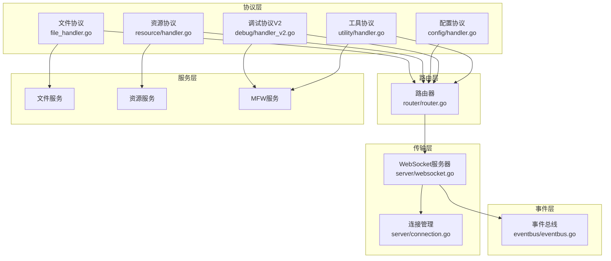
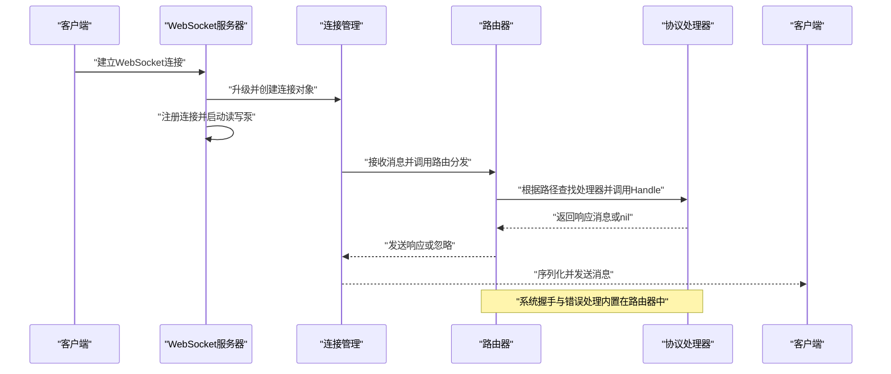
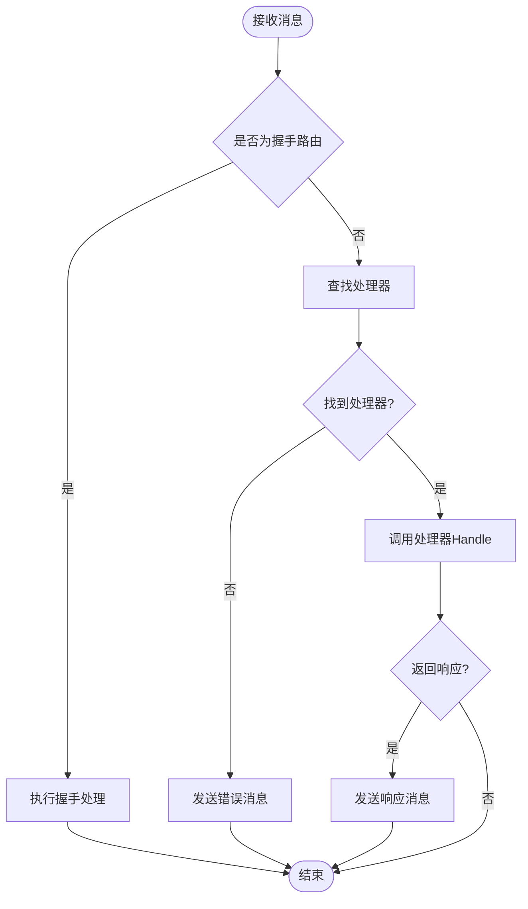
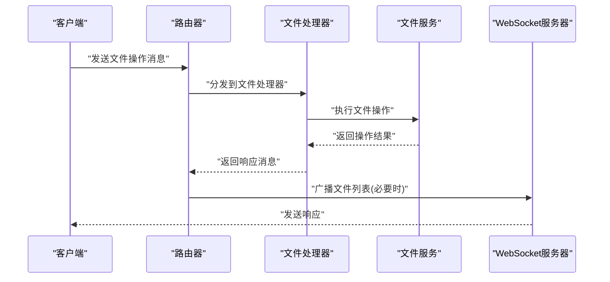
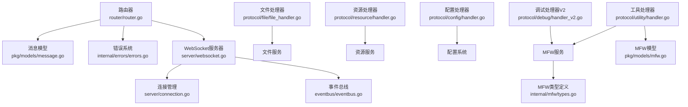

# 消息路由机制

<cite>
**本文档引用的文件**
- [router.go](file://LocalBridge/internal/router/router.go)
- [websocket.go](file://LocalBridge/internal/server/websocket.go)
- [connection.go](file://LocalBridge/internal/server/connection.go)
- [message.go](file://LocalBridge/pkg/models/message.go)
- [errors.go](file://LocalBridge/internal/errors/errors.go)
- [logger.go](file://LocalBridge/internal/logger/logger.go)
- [handler.go](file://LocalBridge/internal/protocol/config/handler.go)
- [handler_v2.go](file://LocalBridge/internal/protocol/debug/handler_v2.go)
- [file_handler.go](file://LocalBridge/internal/protocol/file/file_handler.go)
- [handler.go](file://LocalBridge/internal/protocol/resource/handler.go)
- [handler.go](file://LocalBridge/internal/protocol/utility/handler.go)
- [main.go](file://LocalBridge/cmd/lb/main.go)
- [eventbus.go](file://LocalBridge/internal/eventbus/eventbus.go)
- [types.go](file://LocalBridge/internal/mfw/types.go)
- [mfw.go](file://LocalBridge/pkg/models/mfw.go)
</cite>

## 目录
1. [简介](#简介)
2. [项目结构](#项目结构)
3. [核心组件](#核心组件)
4. [架构总览](#架构总览)
5. [详细组件分析](#详细组件分析)
6. [依赖关系分析](#依赖关系分析)
7. [性能考虑](#性能考虑)
8. [故障排除指南](#故障排除指南)
9. [结论](#结论)

## 简介
本文件深入解析 LocalBridge 模块中的 WebSocket 消息路由分发与协议处理架构。重点涵盖路由器设计原理、消息路径解析、处理器注册机制；协议处理器接口规范、消息格式约定、序列化/反序列化流程；消息优先级与批量处理策略；错误消息生成与传播、异常处理与回退策略；消息中间件、过滤器与拦截器实现；以及消息追踪、日志记录与调试工具的使用方法。

## 项目结构
LocalBridge 采用清晰的分层架构：
- 协议层：定义消息模型与协议处理器接口，具体协议包括文件、资源、配置、调试、工具等
- 路由层：统一的消息路由与分发，负责将消息分派给对应协议处理器
- 传输层：基于 WebSocket 的连接管理与消息收发
- 事件层：事件总线驱动的广播与订阅机制
- 服务层：文件服务、资源服务、MFW 服务等业务能力封装



**图表来源**
- [router.go:29-93](file://LocalBridge/internal/router/router.go#L29-L93)
- [websocket.go:36-46](file://LocalBridge/internal/server/websocket.go#L36-L46)
- [connection.go:13-19](file://LocalBridge/internal/server/connection.go#L13-L19)
- [file_handler.go:15-20](file://LocalBridge/internal/protocol/file/file_handler.go#L15-L20)
- [handler.go:23-28](file://LocalBridge/internal/protocol/resource/handler.go#L23-L28)
- [handler.go:13-18](file://LocalBridge/internal/protocol/config/handler.go#L13-L18)
- [handler_v2.go:17-28](file://LocalBridge/internal/protocol/debug/handler_v2.go#L17-L28)
- [handler.go:25-28](file://LocalBridge/internal/protocol/utility/handler.go#L25-L28)

**章节来源**
- [main.go:385-413](file://LocalBridge/cmd/lb/main.go#L385-L413)
- [router.go:29-93](file://LocalBridge/internal/router/router.go#L29-L93)
- [websocket.go:36-46](file://LocalBridge/internal/server/websocket.go#L36-L46)

## 核心组件
- 路由器 Router：维护处理器映射表，提供精确匹配与前缀匹配两种查找策略，内置握手与错误处理逻辑
- WebSocket 服务器：负责连接升级、读写泵协程、连接注册/注销、广播消息
- 连接 Connection：封装单个 WebSocket 连接，提供消息序列化/反序列化与发送队列
- 协议处理器：实现 Handler 接口，定义路由前缀与 Handle 方法，按路径分发具体业务逻辑
- 消息模型：统一的 Message 结构与各类协议数据结构，确保前后端一致的消息格式
- 错误系统：统一的 LBError 错误类型与错误码，支持详细错误信息与包装原始错误
- 日志系统：控制台与文件双通道日志，支持历史日志缓存与客户端推送
- 事件总线：同步/异步事件发布与订阅，驱动文件/资源扫描与连接状态广播

**章节来源**
- [router.go:19-31](file://LocalBridge/internal/router/router.go#L19-L31)
- [websocket.go:36-46](file://LocalBridge/internal/server/websocket.go#L36-L46)
- [connection.go:13-19](file://LocalBridge/internal/server/connection.go#L13-L19)
- [message.go:4-7](file://LocalBridge/pkg/models/message.go#L4-L7)
- [errors.go:23-28](file://LocalBridge/internal/errors/errors.go#L23-L28)
- [logger.go:13-25](file://LocalBridge/internal/logger/logger.go#L13-L25)
- [eventbus.go:17-20](file://LocalBridge/internal/eventbus/eventbus.go#L17-L20)

## 架构总览
WebSocket 消息从客户端进入，经由连接层解析为统一消息结构，再由路由层根据路径选择对应协议处理器，处理器完成业务处理后向客户端发送响应或通过事件总线广播消息。



**图表来源**
- [connection.go:32-58](file://LocalBridge/internal/server/connection.go#L32-L58)
- [router.go:50-76](file://LocalBridge/internal/router/router.go#L50-L76)
- [websocket.go:145-161](file://LocalBridge/internal/server/websocket.go#L145-L161)

**章节来源**
- [main.go:412-413](file://LocalBridge/cmd/lb/main.go#L412-L413)
- [router.go:50-76](file://LocalBridge/internal/router/router.go#L50-L76)
- [connection.go:32-58](file://LocalBridge/internal/server/connection.go#L32-L58)

## 详细组件分析

### 路由器设计与消息分发
- 处理器注册：通过 RegisterHandler 将处理器的路由前缀映射到处理器实例
- 路径匹配：先精确匹配，再进行前缀匹配，支持多前缀处理器
- 握手处理：内置系统握手路由，校验前端协议版本，不匹配时发送错误响应
- 错误处理：未匹配处理器时记录警告并发送标准错误消息



**图表来源**
- [router.go:49-93](file://LocalBridge/internal/router/router.go#L49-L93)
- [router.go:108-133](file://LocalBridge/internal/router/router.go#L108-L133)

**章节来源**
- [router.go:40-47](file://LocalBridge/internal/router/router.go#L40-L47)
- [router.go:78-93](file://LocalBridge/internal/router/router.go#L78-L93)
- [router.go:108-133](file://LocalBridge/internal/router/router.go#L108-L133)

### 协议处理器接口与消息格式
- Handler 接口：定义 GetRoutePrefix 返回处理器支持的路由前缀集合，Handle 方法处理消息并可返回响应
- 消息模型：Message 结构包含 path 与 data 字段，所有协议数据结构均遵循统一的 JSON 序列化约定
- 错误模型：ErrorData 包含 code、message、detail 字段，便于前端统一展示

```mermaid
classDiagram
class Handler {
+GetRoutePrefix() []string
+Handle(msg, conn) *Message
}
class Message {
+string Path
+interface{} Data
}
class ErrorData {
+string Code
+string Message
+interface{} Detail
}
Handler --> Message : "处理"
Message --> ErrorData : "错误响应"
```

**图表来源**
- [router.go:19-26](file://LocalBridge/internal/router/router.go#L19-L26)
- [message.go:4-14](file://LocalBridge/pkg/models/message.go#L4-L14)

**章节来源**
- [router.go:19-26](file://LocalBridge/internal/router/router.go#L19-L26)
- [message.go:4-14](file://LocalBridge/pkg/models/message.go#L4-L14)

### 文件协议处理器
- 路由前缀：/etl/open_file、/etl/save_file、/etl/save_separated、/etl/create_file、/etl/refresh_file_list
- 功能：打开/保存/分离保存/创建文件，刷新文件列表，推送文件变化通知
- 序列化：使用 JSON 解析请求数据，错误时返回标准化错误消息



**图表来源**
- [file_handler.go:38-46](file://LocalBridge/internal/protocol/file/file_handler.go#L38-L46)
- [file_handler.go:49-64](file://LocalBridge/internal/protocol/file/file_handler.go#L49-L64)
- [file_handler.go:287-300](file://LocalBridge/internal/protocol/file/file_handler.go#L287-L300)

**章节来源**
- [file_handler.go:38-46](file://LocalBridge/internal/protocol/file/file_handler.go#L38-L46)
- [file_handler.go:49-64](file://LocalBridge/internal/protocol/file/file_handler.go#L49-L64)
- [file_handler.go:287-300](file://LocalBridge/internal/protocol/file/file_handler.go#L287-L300)

### 资源协议处理器
- 路由前缀：/etl/get_image、/etl/get_images、/etl/get_image_list、/etl/refresh_resources
- 功能：获取单张/批量图片、图片列表、刷新资源包，推送资源包列表
- 序列化：统一 JSON 解析与错误处理，图片数据 Base64 编码传输

**章节来源**
- [handler.go:46-53](file://LocalBridge/internal/protocol/resource/handler.go#L46-L53)
- [handler.go:56-69](file://LocalBridge/internal/protocol/resource/handler.go#L56-L69)
- [handler.go:235-245](file://LocalBridge/internal/protocol/resource/handler.go#L235-L245)

### 配置协议处理器
- 路由前缀：/etl/config/*
- 功能：获取/设置/重载配置，返回当前配置与配置路径
- 错误处理：配置未加载、保存失败等情况返回标准化错误

**章节来源**
- [handler.go:21-23](file://LocalBridge/internal/protocol/config/handler.go#L21-L23)
- [handler.go:26-47](file://LocalBridge/internal/protocol/config/handler.go#L26-L47)
- [handler.go:174-204](file://LocalBridge/internal/protocol/config/handler.go#L174-L204)

### 调试协议处理器V2
- 路由前缀：/mpe/debug/*
- 功能：会话管理（创建/销毁/列出/获取）、调试控制（启动/运行/停止）、数据查询（节点数据、截图）
- 事件回调：通过闭包携带 session_id，确保事件消息包含正确会话标识
- 错误处理：服务未初始化、参数缺失、会话不存在等情况返回错误消息

**章节来源**
- [handler_v2.go:31-33](file://LocalBridge/internal/protocol/debug/handler_v2.go#L31-L33)
- [handler_v2.go:36-79](file://LocalBridge/internal/protocol/debug/handler_v2.go#L36-L79)
- [handler_v2.go:490-519](file://LocalBridge/internal/protocol/debug/handler_v2.go#L490-L519)

### 工具协议处理器
- 路由前缀：/etl/utility/*
- 功能：OCR 识别、图片路径解析、打开日志目录
- OCR 流程：截图 -> 绑定控制器/资源 -> 提交任务 -> 解析结果 -> Base64 图像返回
- 跨平台：根据操作系统使用不同命令打开日志目录

**章节来源**
- [handler.go:39-41](file://LocalBridge/internal/protocol/utility/handler.go#L39-L41)
- [handler.go:44-65](file://LocalBridge/internal/protocol/utility/handler.go#L44-L65)
- [handler.go:122-287](file://LocalBridge/internal/protocol/utility/handler.go#L122-L287)

### WebSocket 传输与连接管理
- 连接升级：使用 gorilla/websocket 升级 HTTP 连接到 WebSocket
- 读写泵：独立协程处理读取与发送，避免阻塞
- 发送队列：带缓冲的发送通道，满载时记录警告并丢弃消息
- 广播：向所有活跃连接发送消息

**章节来源**
- [websocket.go:24-30](file://LocalBridge/internal/server/websocket.go#L24-L30)
- [websocket.go:145-161](file://LocalBridge/internal/server/websocket.go#L145-L161)
- [connection.go:62-76](file://LocalBridge/internal/server/connection.go#L62-L76)
- [connection.go:79-95](file://LocalBridge/internal/server/connection.go#L79-L95)

### 错误处理与异常回退
- 错误码：统一定义常见错误码（文件不存在、读写失败、权限不足、请求无效等）
- 错误包装：支持包装原始错误并保留上下文
- 标准化：所有处理器返回统一的 ErrorData 结构
- 回退策略：握手失败、处理器未找到、序列化失败等场景均有明确的错误响应

**章节来源**
- [errors.go:10-20](file://LocalBridge/internal/errors/errors.go#L10-L20)
- [errors.go:53-73](file://LocalBridge/internal/errors/errors.go#L53-L73)
- [router.go:96-105](file://LocalBridge/internal/router/router.go#L96-L105)
- [file_handler.go:318-327](file://LocalBridge/internal/protocol/file/file_handler.go#L318-L327)

### 日志记录与消息追踪
- 日志系统：控制台与文件双通道，支持历史日志缓存（最多100条）
- 客户端推送：可配置将日志推送到前端，支持历史日志补推
- 追踪：连接建立/关闭事件、文件变化事件、资源扫描完成事件等通过事件总线广播

**章节来源**
- [logger.go:43-100](file://LocalBridge/internal/logger/logger.go#L43-L100)
- [logger.go:118-134](file://LocalBridge/internal/logger/logger.go#L118-L134)
- [logger.go:320-352](file://LocalBridge/internal/logger/logger.go#L320-L352)
- [eventbus.go:75-82](file://LocalBridge/internal/eventbus/eventbus.go#L75-L82)

## 依赖关系分析



**图表来源**
- [router.go:3-11](file://LocalBridge/internal/router/router.go#L3-L11)
- [websocket.go:3-13](file://LocalBridge/internal/server/websocket.go#L3-L13)
- [connection.go:3-10](file://LocalBridge/internal/server/connection.go#L3-L10)
- [file_handler.go:3-12](file://LocalBridge/internal/protocol/file/file_handler.go#L3-L12)
- [handler.go:3-20](file://LocalBridge/internal/protocol/resource/handler.go#L3-L20)
- [handler.go:3-10](file://LocalBridge/internal/protocol/config/handler.go#L3-L10)
- [handler_v2.go:3-10](file://LocalBridge/internal/protocol/debug/handler_v2.go#L3-L10)
- [handler.go:3-22](file://LocalBridge/internal/protocol/utility/handler.go#L3-L22)
- [types.go:1-6](file://LocalBridge/internal/mfw/types.go#L1-L6)
- [mfw.go:1-6](file://LocalBridge/pkg/models/mfw.go#L1-L6)

**章节来源**
- [main.go:385-413](file://LocalBridge/cmd/lb/main.go#L385-L413)

## 性能考虑
- 发送队列：连接发送通道容量为256，满载时记录警告并丢弃消息，避免内存膨胀
- 广播优化：广播时使用只读锁保护连接集合，减少锁竞争
- 序列化成本：消息解析与序列化为 JSON，建议避免频繁大对象传输
- 事件驱动：文件/资源变化通过事件总线异步推送，降低耦合度
- 资源管理：MFW 资源与控制器按需创建与销毁，避免长期占用

## 故障排除指南
- 握手失败：检查前端协议版本与后端版本是否一致，查看版本不匹配的错误提示
- 处理器未找到：确认消息 path 是否在处理器的前缀集合中，检查注册顺序
- 序列化错误：检查消息 data 结构是否符合处理器预期，查看日志中的解析失败信息
- 文件操作失败：确认文件路径合法性与权限，查看错误码 FILE_NOT_FOUND/FILE_READ_ERROR/FILE_WRITE_ERROR
- 调试功能不可用：检查 MaaFramework 配置（lib_dir 与 resource_dir），确认服务初始化状态

**章节来源**
- [router.go:121-128](file://LocalBridge/internal/router/router.go#L121-L128)
- [errors.go:78-140](file://LocalBridge/internal/errors/errors.go#L78-L140)
- [logger.go:181-187](file://LocalBridge/internal/logger/logger.go#L181-L187)

## 结论
该消息路由机制以路由器为核心，结合协议处理器、WebSocket 传输与事件总线，形成了清晰、可扩展的消息处理架构。通过统一的消息模型与错误处理机制，实现了跨协议的一致性体验；通过事件驱动与异步处理，提升了系统的响应性与可维护性。建议在实际部署中关注握手版本一致性、发送队列容量与日志推送配置，以获得最佳的运行效果。