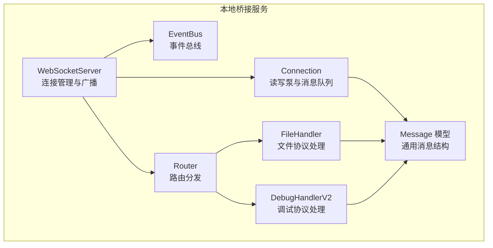
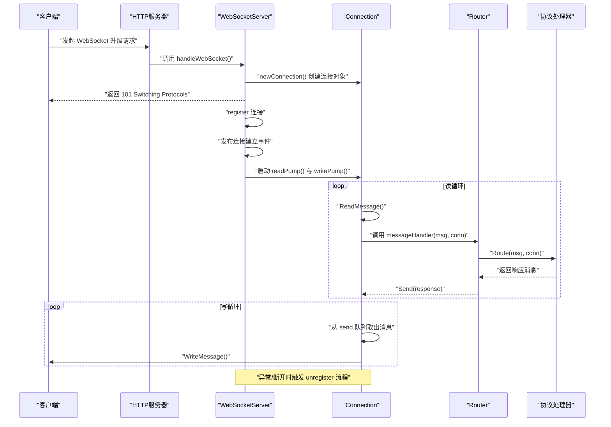
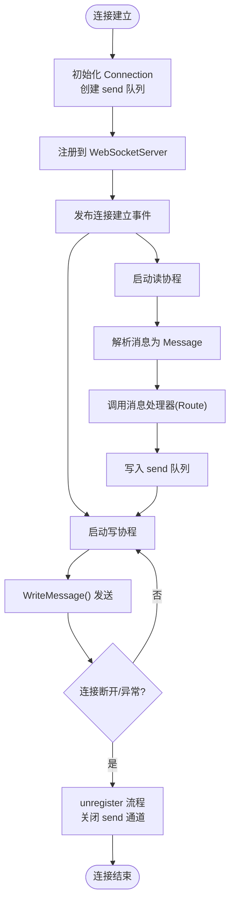
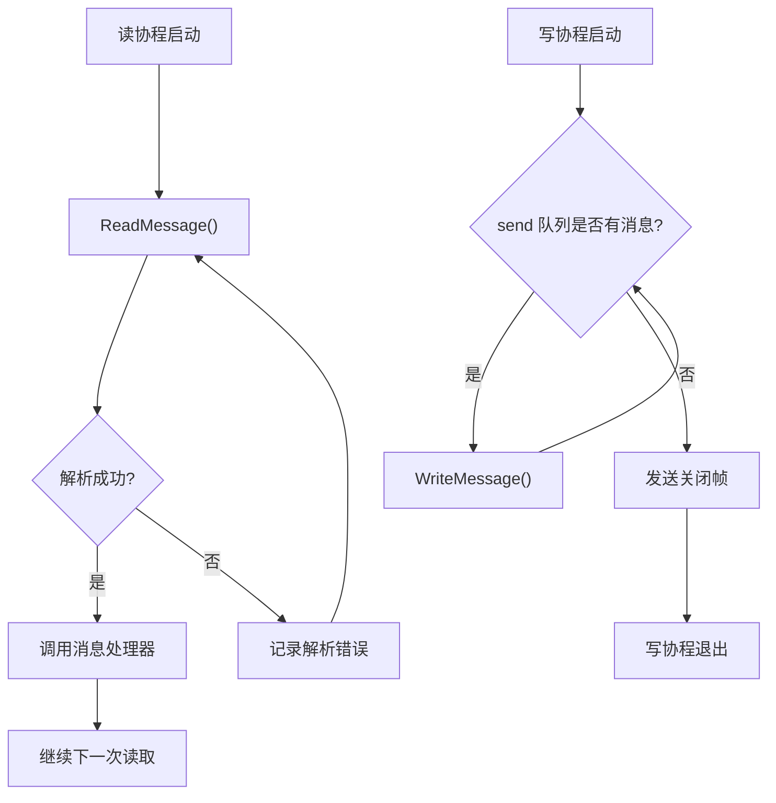
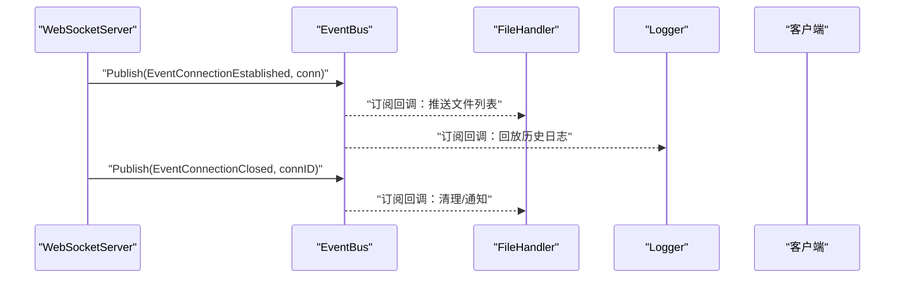
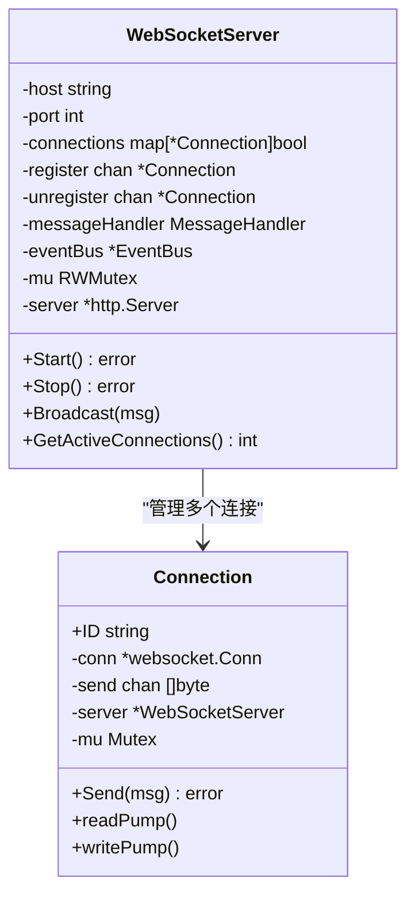
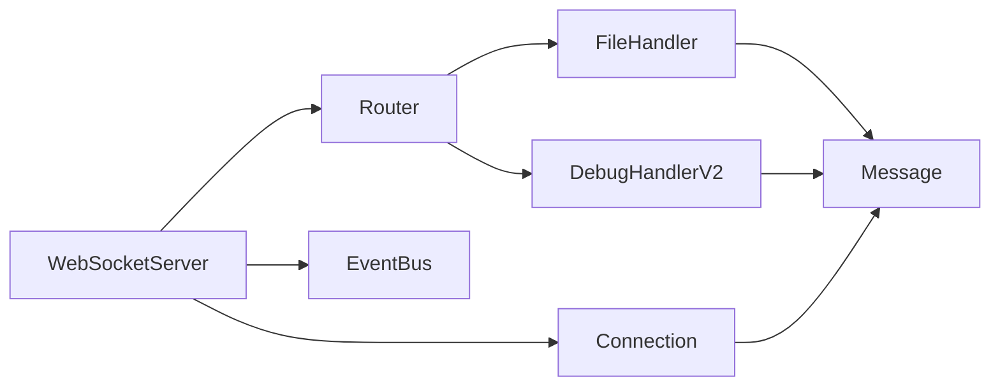

# 连接管理

<cite>
**本文引用的文件**
- [websocket.go](file://LocalBridge/internal/server/websocket.go)
- [connection.go](file://LocalBridge/internal/server/connection.go)
- [eventbus.go](file://LocalBridge/internal/eventbus/eventbus.go)
- [message.go](file://LocalBridge/pkg/models/message.go)
- [router.go](file://LocalBridge/internal/router/router.go)
- [file_handler.go](file://LocalBridge/internal/protocol/file/file_handler.go)
- [handler_v2.go](file://LocalBridge/internal/protocol/debug/handler_v2.go)
- [main.go](file://LocalBridge/cmd/lb/main.go)
</cite>

## 目录
1. [引言](#引言)
2. [项目结构](#项目结构)
3. [核心组件](#核心组件)
4. [架构总览](#架构总览)
5. [详细组件分析](#详细组件分析)
6. [依赖分析](#依赖分析)
7. [性能考虑](#性能考虑)
8. [故障排查指南](#故障排查指南)
9. [结论](#结论)

## 引言
本文围绕本地桥接服务中的 WebSocket 连接生命周期与事件处理机制展开，系统性阐述连接对象的创建、初始化与状态维护；读写协程的工作原理、消息队列与背压处理；连接事件发布机制（建立、断开、异常等）；连接池并发控制与锁机制；以及心跳、超时与断线重连策略的设计现状与优化建议。同时给出监控、统计与性能优化方案，帮助读者在理解现有实现的基础上进行扩展与调优。

## 项目结构
本项目的 WebSocket 服务位于 LocalBridge 子模块，核心文件分布如下：
- 服务器与连接管理：websocket.go、connection.go
- 事件总线：eventbus.go
- 消息模型：message.go
- 路由与协议处理：router.go、file_handler.go、handler_v2.go
- 启动入口与集成：main.go

图表来源
- [websocket.go:35-93](file://LocalBridge/internal/server/websocket.go#L35-L93)
- [connection.go:12-29](file://LocalBridge/internal/server/connection.go#L12-L29)
- [eventbus.go:17-51](file://LocalBridge/internal/eventbus/eventbus.go#L17-L51)
- [router.go:28-76](file://LocalBridge/internal/router/router.go#L28-L76)
- [file_handler.go:14-35](file://LocalBridge/internal/protocol/file/file_handler.go#L14-L35)
- [handler_v2.go:16-28](file://LocalBridge/internal/protocol/debug/handler_v2.go#L16-L28)
- [message.go:3-7](file://LocalBridge/pkg/models/message.go#L3-L7)

章节来源
- [websocket.go:35-93](file://LocalBridge/internal/server/websocket.go#L35-L93)
- [connection.go:12-29](file://LocalBridge/internal/server/connection.go#L12-L29)
- [eventbus.go:17-51](file://LocalBridge/internal/eventbus/eventbus.go#L17-L51)
- [router.go:28-76](file://LocalBridge/internal/router/router.go#L28-L76)
- [file_handler.go:14-35](file://LocalBridge/internal/protocol/file/file_handler.go#L14-L35)
- [handler_v2.go:16-28](file://LocalBridge/internal/protocol/debug/handler_v2.go#L16-L28)
- [message.go:3-7](file://LocalBridge/pkg/models/message.go#L3-L7)

## 核心组件
- WebSocketServer：负责 HTTP 升级、连接注册/注销、广播消息、对外暴露活跃连接数等。
- Connection：封装单个 WebSocket 连接，提供读泵、写泵、消息发送与背压处理。
- EventBus：提供事件订阅/发布能力，支持同步与异步发布。
- Router：根据消息路径分发至对应协议处理器。
- 协议处理器：如文件协议、调试协议等，负责具体业务逻辑与响应。
- Message 模型：统一的消息结构体，包含 path 与 data 字段。

章节来源
- [websocket.go:35-93](file://LocalBridge/internal/server/websocket.go#L35-L93)
- [connection.go:12-29](file://LocalBridge/internal/server/connection.go#L12-L29)
- [eventbus.go:17-51](file://LocalBridge/internal/eventbus/eventbus.go#L17-L51)
- [router.go:28-76](file://LocalBridge/internal/router/router.go#L28-L76)
- [message.go:3-7](file://LocalBridge/pkg/models/message.go#L3-L7)

## 架构总览
WebSocket 服务启动后，HTTP 服务器监听端口，接收升级请求并创建 Connection 对象。Connection 启动读写协程，读协程负责解析消息并交由 Router 分发，写协程负责将消息序列化后发送。服务器通过事件总线发布连接建立与断开事件，供其他模块订阅与响应。

图表来源
- [websocket.go:144-161](file://LocalBridge/internal/server/websocket.go#L144-L161)
- [connection.go:31-59](file://LocalBridge/internal/server/connection.go#L31-L59)
- [connection.go:61-76](file://LocalBridge/internal/server/connection.go#L61-L76)
- [router.go:49-76](file://LocalBridge/internal/router/router.go#L49-L76)

章节来源
- [websocket.go:144-161](file://LocalBridge/internal/server/websocket.go#L144-L161)
- [connection.go:31-59](file://LocalBridge/internal/server/connection.go#L31-L59)
- [connection.go:61-76](file://LocalBridge/internal/server/connection.go#L61-L76)
- [router.go:49-76](file://LocalBridge/internal/router/router.go#L49-L76)

## 详细组件分析

### 连接对象生命周期与状态维护
- 创建与初始化
  - 服务器在升级成功后调用 newConnection 构造 Connection，初始化 ID、底层 websocket.Conn、发送通道与所属服务器引用。
  - 发送通道容量固定，用于承载待发送消息，避免阻塞写协程。
- 状态维护
  - 服务器通过 register/unregister 管理连接集合，并在连接建立与断开时发布事件。
  - 连接断开时，服务器关闭发送通道以触发写协程退出。
- 读写协程
  - 读协程持续读取消息，解析为通用 Message 结构后交由消息处理器（通常为 Router.Route）。
  - 写协程从 send 队列取出消息并发送，异常时退出。
- 背压与丢弃
  - 发送侧采用非阻塞 select 将消息写入 send 队列，队列满时记录告警并丢弃消息，避免阻塞发送线程。

图表来源
- [connection.go:21-29](file://LocalBridge/internal/server/connection.go#L21-L29)
- [connection.go:31-59](file://LocalBridge/internal/server/connection.go#L31-L59)
- [connection.go:61-76](file://LocalBridge/internal/server/connection.go#L61-L76)
- [websocket.go:114-142](file://LocalBridge/internal/server/websocket.go#L114-L142)

章节来源
- [connection.go:21-29](file://LocalBridge/internal/server/connection.go#L21-L29)
- [connection.go:31-59](file://LocalBridge/internal/server/connection.go#L31-L59)
- [connection.go:61-76](file://LocalBridge/internal/server/connection.go#L61-L76)
- [websocket.go:114-142](file://LocalBridge/internal/server/websocket.go#L114-L142)

### 读写协程与消息队列
- 读协程
  - 循环读取消息，解析失败则记录错误并继续；解析成功后调用消息处理器。
  - 异常关闭时，触发 unregister 流程，确保资源回收。
- 写协程
  - 从 send 队列顺序取出消息并发送，异常时退出。
  - 发送完成后发送关闭帧，保证对端正确感知。
- 发送队列与背压
  - send 队列为有界缓冲，发送侧采用非阻塞写入，队列满时丢弃消息并记录告警，避免写协程阻塞。

图表来源
- [connection.go:31-59](file://LocalBridge/internal/server/connection.go#L31-L59)
- [connection.go:61-76](file://LocalBridge/internal/server/connection.go#L61-L76)
- [connection.go:78-95](file://LocalBridge/internal/server/connection.go#L78-L95)

章节来源
- [connection.go:31-59](file://LocalBridge/internal/server/connection.go#L31-L59)
- [connection.go:61-76](file://LocalBridge/internal/server/connection.go#L61-L76)
- [connection.go:78-95](file://LocalBridge/internal/server/connection.go#L78-L95)

### 连接事件发布机制
- 事件类型
  - 连接建立：WebSocketServer 在 register 成功后发布连接建立事件，携带 Connection 对象。
  - 连接断开：在 unregister 时发布连接断开事件，携带连接 ID。
- 订阅与使用
  - 文件协议处理器订阅连接建立事件，向新连接推送文件列表。
  - 日志系统订阅连接建立事件，向新连接回放历史日志。
  - 配置重载事件触发资源扫描与 MFW 服务的重载。

图表来源
- [websocket.go:114-142](file://LocalBridge/internal/server/websocket.go#L114-L142)
- [eventbus.go:37-51](file://LocalBridge/internal/eventbus/eventbus.go#L37-L51)
- [file_handler.go:249-285](file://LocalBridge/internal/protocol/file/file_handler.go#L249-L285)
- [main.go:333-352](file://LocalBridge/cmd/lb/main.go#L333-L352)

章节来源
- [websocket.go:114-142](file://LocalBridge/internal/server/websocket.go#L114-L142)
- [eventbus.go:37-51](file://LocalBridge/internal/eventbus/eventbus.go#L37-L51)
- [file_handler.go:249-285](file://LocalBridge/internal/protocol/file/file_handler.go#L249-L285)
- [main.go:333-352](file://LocalBridge/cmd/lb/main.go#L333-L352)

### 连接池并发控制与锁机制
- 并发控制
  - 连接集合 connections 通过互斥读写锁保护，读多写少场景下使用 RWMutex 提升并发读性能。
  - register/unregister 通过 goroutine 通道进行解耦，避免阻塞主处理流程。
- 锁机制
  - 服务器侧使用 RWMutex 保护连接集合；连接侧使用 Mutex 保护发送操作。
- 内存管理
  - 发送通道容量固定，避免无限增长；异常断开时关闭通道并释放资源。

图表来源
- [websocket.go:35-93](file://LocalBridge/internal/server/websocket.go#L35-L93)
- [connection.go:12-29](file://LocalBridge/internal/server/connection.go#L12-L29)

章节来源
- [websocket.go:35-93](file://LocalBridge/internal/server/websocket.go#L35-L93)
- [connection.go:12-29](file://LocalBridge/internal/server/connection.go#L12-L29)

### 心跳检测、超时处理与断线重连
- 心跳检测
  - 代码中未发现显式的 ping/pong 心跳机制实现。
- 超时处理
  - HTTP 服务器设置了 ReadTimeout 与 WriteTimeout，有助于避免长时间占用连接。
  - 连接读写协程未设置独立的读写超时，异常关闭时依赖底层库的错误判断。
- 断线重连策略
  - 代码未实现自动重连；客户端需自行实现重连逻辑，建议指数退避与最大重试次数控制。

章节来源
- [websocket.go:74-80](file://LocalBridge/internal/server/websocket.go#L74-L80)
- [connection.go:31-59](file://LocalBridge/internal/server/connection.go#L31-L59)

### 连接监控、统计与性能优化
- 监控与统计
  - WebSocketServer 提供 GetActiveConnections() 获取当前活跃连接数，可用于简单监控。
  - 日志系统通过事件总线推送运行日志，便于前端实时查看。
- 性能优化建议
  - 读写缓冲区大小：当前 Upgrader 的 ReadBufferSize/WriteBufferSize 为 1024，可根据实际消息大小调整。
  - 发送队列容量：当前 send 队列容量为 256，可根据峰值吞吐量与内存预算调整。
  - 背压策略：当前为丢弃策略，可考虑替换为阻塞写或限流策略以降低丢弃率。
  - 事件总线：发布为同步阻塞，建议在高频事件场景下使用异步发布或批量发布。

章节来源
- [websocket.go:24-30](file://LocalBridge/internal/server/websocket.go#L24-L30)
- [connection.go:26](file://LocalBridge/internal/server/connection.go#L26)
- [websocket.go:173-178](file://LocalBridge/internal/server/websocket.go#L173-L178)
- [eventbus.go:37-56](file://LocalBridge/internal/eventbus/eventbus.go#L37-L56)

## 依赖分析
- 组件耦合
  - WebSocketServer 与 Connection 为强耦合：Connection 持有服务器引用以便注销与广播。
  - Router 与协议处理器解耦：通过路由前缀匹配，便于扩展新协议。
  - EventBus 作为事件中枢，被多个模块订阅使用，耦合度较高但职责清晰。
- 外部依赖
  - gorilla/websocket：提供 WebSocket 协议支持。
  - goroutine 通道：用于连接注册/注销与事件发布。
- 循环依赖
  - 未发现直接循环依赖；模块间通过接口与回调进行交互。

图表来源
- [websocket.go:35-93](file://LocalBridge/internal/server/websocket.go#L35-L93)
- [router.go:28-76](file://LocalBridge/internal/router/router.go#L28-L76)
- [file_handler.go:14-35](file://LocalBridge/internal/protocol/file/file_handler.go#L14-L35)
- [handler_v2.go:16-28](file://LocalBridge/internal/protocol/debug/handler_v2.go#L16-L28)
- [message.go:3-7](file://LocalBridge/pkg/models/message.go#L3-L7)

章节来源
- [websocket.go:35-93](file://LocalBridge/internal/server/websocket.go#L35-L93)
- [router.go:28-76](file://LocalBridge/internal/router/router.go#L28-L76)
- [file_handler.go:14-35](file://LocalBridge/internal/protocol/file/file_handler.go#L14-L35)
- [handler_v2.go:16-28](file://LocalBridge/internal/protocol/debug/handler_v2.go#L16-L28)
- [message.go:3-7](file://LocalBridge/pkg/models/message.go#L3-L7)

## 性能考虑
- 读写缓冲区
  - 当前缓冲为 1024 字节，建议根据消息体量与网络环境评估是否增大。
- 发送队列容量
  - 当前容量为 256，建议结合 QPS 与峰值延迟评估扩容或引入动态限流。
- 并发读写
  - 读写协程分离，避免相互阻塞；建议为每个连接分配独立协程，减少上下文切换。
- 事件发布
  - 同步发布在高并发下可能成为瓶颈，建议改为异步发布或批量化处理。
- 资源回收
  - 断开时及时关闭 send 通道与底层连接，避免资源泄漏。

## 故障排查指南
- 连接无法建立
  - 检查 HTTP 服务器启动日志与端口占用情况。
  - 确认 Upgrade 是否成功，失败时记录错误日志。
- 消息解析失败
  - 检查消息格式是否符合 Message 结构，确认 JSON 序列化/反序列化过程。
- 发送队列溢出
  - 观察告警日志，评估队列容量与发送速率，必要时扩容或限流。
- 连接频繁断开
  - 检查读写超时设置与网络稳定性；确认异常关闭错误码。
- 事件未到达
  - 检查 EventBus 订阅是否正确，处理器是否注册到 Router。

章节来源
- [websocket.go:66-93](file://LocalBridge/internal/server/websocket.go#L66-L93)
- [connection.go:48-52](file://LocalBridge/internal/server/connection.go#L48-L52)
- [connection.go:88-95](file://LocalBridge/internal/server/connection.go#L88-L95)
- [router.go:95-105](file://LocalBridge/internal/router/router.go#L95-L105)

## 结论
该实现提供了清晰的 WebSocket 连接生命周期管理：从升级、连接注册、读写协程分离、消息队列与背压处理，到事件总线驱动的连接事件发布。服务器通过 RWMutex 与 goroutine 通道实现并发安全与解耦。当前未内置心跳与自动重连机制，建议在客户端层面补充；同时可通过调整缓冲区与队列容量、采用异步事件发布等方式进一步提升性能与稳定性。