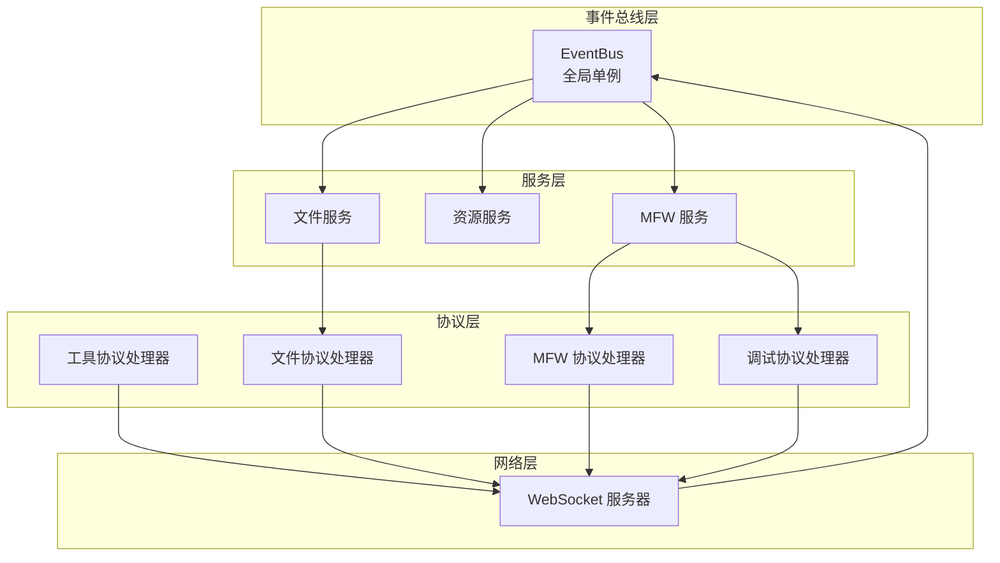
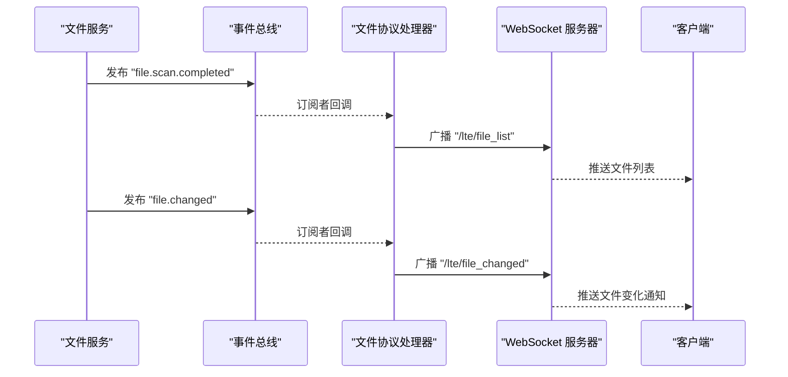
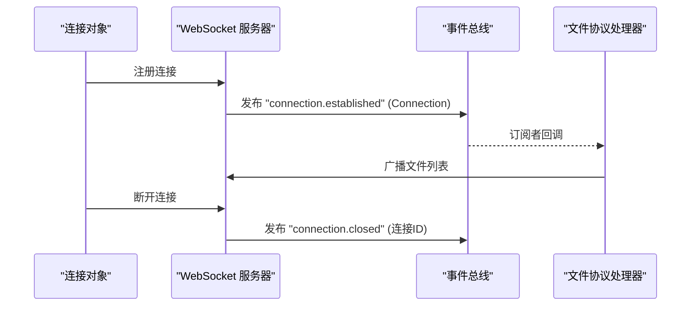
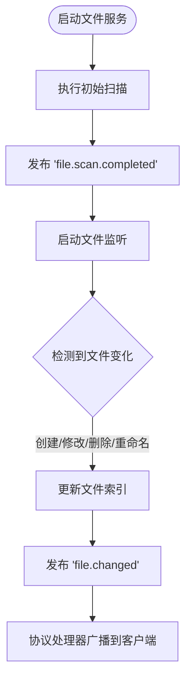
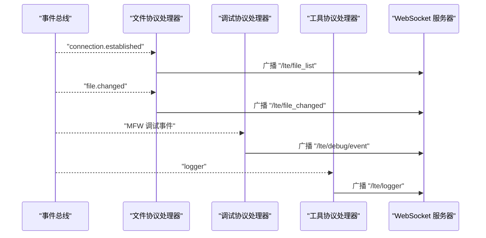
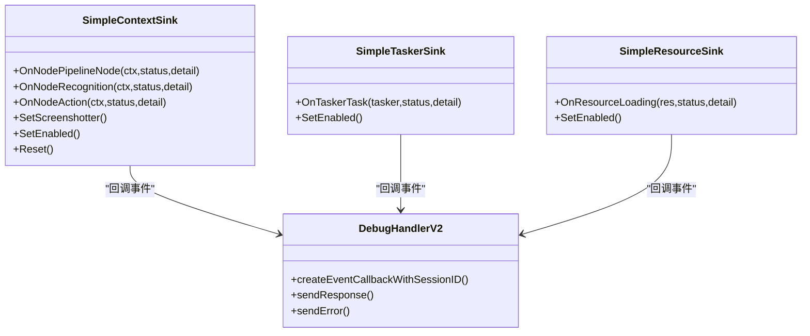
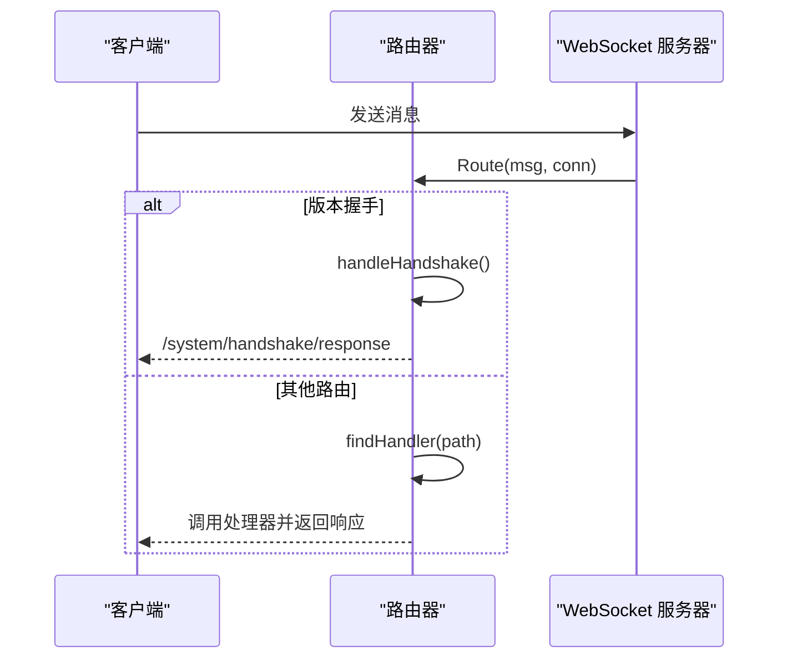
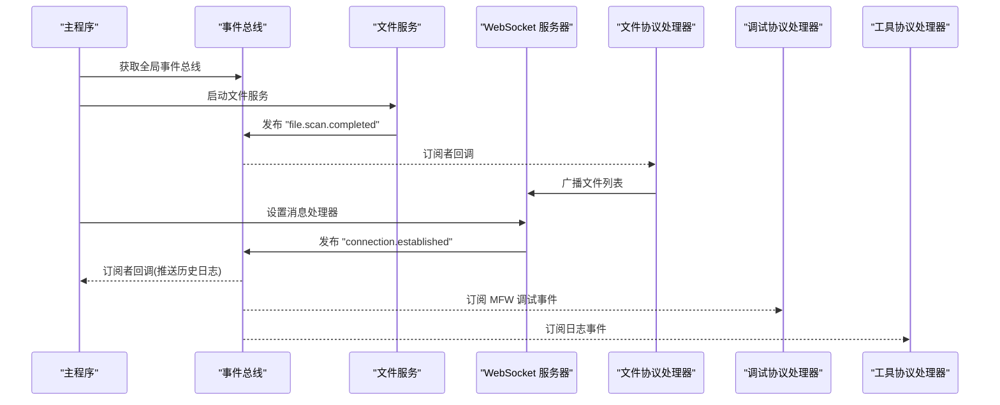
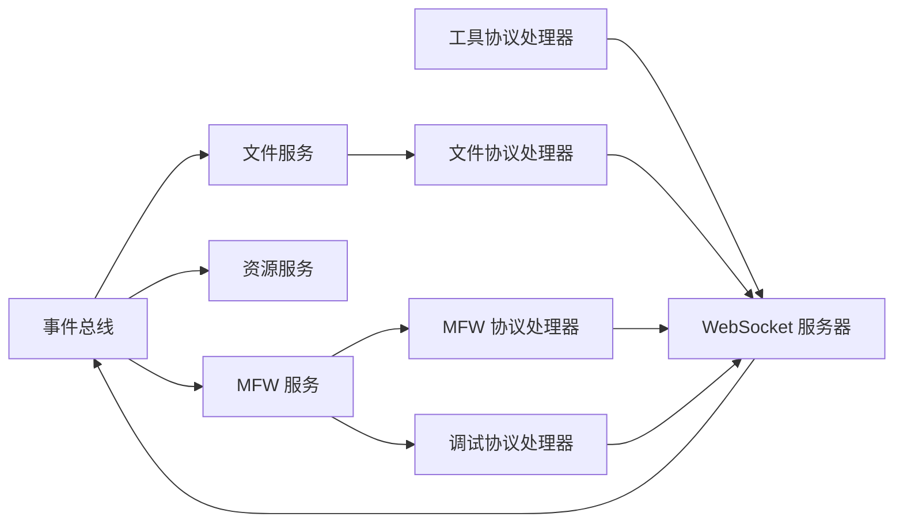

# 事件系统架构

<cite>
**本文档引用的文件**
- [eventbus.go](file://LocalBridge/internal/eventbus/eventbus.go)
- [message.go](file://LocalBridge/pkg/models/message.go)
- [websocket.go](file://LocalBridge/internal/server/websocket.go)
- [file_service.go](file://LocalBridge/internal/service/file/file_service.go)
- [file_handler.go](file://LocalBridge/internal/protocol/file/file_handler.go)
- [router.go](file://LocalBridge/internal/router/router.go)
- [main.go](file://LocalBridge/cmd/lb/main.go)
- [event_sink.go](file://LocalBridge/internal/mfw/event_sink.go)
- [types.go](file://LocalBridge/internal/mfw/types.go)
- [handler_v2.go](file://LocalBridge/internal/protocol/debug/handler_v2.go)
- [utility_handler.go](file://LocalBridge/internal/protocol/utility/handler.go)
</cite>

## 目录
1. [简介](#简介)
2. [项目结构](#项目结构)
3. [核心组件](#核心组件)
4. [架构总览](#架构总览)
5. [详细组件分析](#详细组件分析)
6. [依赖关系分析](#依赖关系分析)
7. [性能考虑](#性能考虑)
8. [故障排查指南](#故障排查指南)
9. [结论](#结论)
10. [附录](#附录)

## 简介
本文件全面阐述 LocalBridge 事件系统的架构设计与实现机制，重点覆盖以下方面：
- 事件总线(EventBus)的工作原理、事件类型定义、订阅发布模式
- 全局事件总线的单例模式实现、事件队列管理、异步处理机制
- 事件的生命周期、优先级处理、错误传播等特性
- 事件在文件服务、MFW 服务、WebSocket 服务器之间的协调作用
- 事件订阅和发布的最佳实践，以及自定义事件的开发指南

## 项目结构
LocalBridge 采用模块化设计，事件系统贯穿于服务层、协议层与网络层之间，形成松耦合的事件驱动架构。关键模块如下：
- 事件总线：提供统一的事件发布/订阅能力
- 服务层：文件服务、资源服务、MFW 服务等产生事件
- 协议层：文件协议、MFW 协议、调试协议、工具协议等消费事件
- 网络层：WebSocket 服务器负责事件广播与客户端通信
- 路由层：根据消息路径分发到对应协议处理器



图表来源
- [eventbus.go:1-83](file://LocalBridge/internal/eventbus/eventbus.go#L1-L83)
- [file_service.go:1-360](file://LocalBridge/internal/service/file/file_service.go#L1-L360)
- [file_handler.go:1-328](file://LocalBridge/internal/protocol/file/file_handler.go#L1-L328)
- [websocket.go:1-179](file://LocalBridge/internal/server/websocket.go#L1-L179)
- [handler_v2.go:1-520](file://LocalBridge/internal/protocol/debug/handler_v2.go#L1-L520)
- [utility_handler.go:1-694](file://LocalBridge/internal/protocol/utility/handler.go#L1-L694)

章节来源
- [eventbus.go:1-83](file://LocalBridge/internal/eventbus/eventbus.go#L1-L83)
- [file_service.go:1-360](file://LocalBridge/internal/service/file/file_service.go#L1-L360)
- [file_handler.go:1-328](file://LocalBridge/internal/protocol/file/file_handler.go#L1-L328)
- [websocket.go:1-179](file://LocalBridge/internal/server/websocket.go#L1-L179)
- [handler_v2.go:1-520](file://LocalBridge/internal/protocol/debug/handler_v2.go#L1-L520)
- [utility_handler.go:1-694](file://LocalBridge/internal/protocol/utility/handler.go#L1-L694)

## 核心组件
- 事件总线(EventBus)
  - 提供同步/异步发布、订阅、取消订阅能力
  - 支持全局单例访问
  - 内置事件类型常量
- 事件模型(Event)
  - 类型与数据分离，便于多协议处理
- WebSocket 服务器
  - 与事件总线协作，将事件广播至客户端
- 文件服务
  - 产生文件扫描完成、文件变化等事件
- 协议处理器
  - 订阅事件并转发到客户端或内部服务
- 路由器
  - 将消息路径映射到具体处理器

章节来源
- [eventbus.go:1-83](file://LocalBridge/internal/eventbus/eventbus.go#L1-L83)
- [message.go:1-126](file://LocalBridge/pkg/models/message.go#L1-L126)
- [websocket.go:1-179](file://LocalBridge/internal/server/websocket.go#L1-L179)
- [file_service.go:1-360](file://LocalBridge/internal/service/file/file_service.go#L1-L360)
- [file_handler.go:1-328](file://LocalBridge/internal/protocol/file/file_handler.go#L1-L328)
- [router.go:1-151](file://LocalBridge/internal/router/router.go#L1-L151)

## 架构总览
事件系统以 EventBus 为核心，围绕其构建“事件产生—事件消费—事件广播”的闭环：
- 事件产生：文件服务扫描完成、文件变化；MFW 服务调试事件；WebSocket 连接建立/断开
- 事件消费：协议处理器订阅事件，向客户端推送或调用内部服务
- 事件广播：WebSocket 服务器将事件推送到所有连接的客户端



图表来源
- [file_service.go:86-87](file://LocalBridge/internal/service/file/file_service.go#L86-L87)
- [file_service.go:337-343](file://LocalBridge/internal/service/file/file_service.go#L337-L343)
- [file_handler.go:250-285](file://LocalBridge/internal/protocol/file/file_handler.go#L250-L285)
- [websocket.go:163-171](file://LocalBridge/internal/server/websocket.go#L163-L171)

章节来源
- [file_service.go:64-95](file://LocalBridge/internal/service/file/file_service.go#L64-L95)
- [file_handler.go:249-300](file://LocalBridge/internal/protocol/file/file_handler.go#L249-L300)
- [websocket.go:114-179](file://LocalBridge/internal/server/websocket.go#L114-L179)

## 详细组件分析

### 事件总线(EventBus)与全局单例
- 设计要点
  - 使用 map[string][]EventHandler 维护事件类型到处理器列表的映射
  - 读写锁保护并发安全
  - 提供同步发布(Publish)与异步发布(PublishAsync)两种模式
  - 全局单例通过包级变量与 GetGlobalBus() 提供
- 事件类型
  - 文件扫描完成、文件变化、连接建立、连接断开、资源扫描完成、配置重载
- 生命周期
  - 订阅：Subscribe(eventType, handler)
  - 发布：Publish(eventType, data) / PublishAsync(eventType, data)
  - 取消：Unsubscribe(eventType)

```mermaid
classDiagram
class EventBus {
-handlers : map[string][]EventHandler
-mu : RWMutex
+New() EventBus
+Subscribe(eventType, handler)
+Publish(eventType, data)
+PublishAsync(eventType, data)
+Unsubscribe(eventType)
}
class Event {
+Type : string
+Data : interface{}
}
EventBus --> Event : "封装事件"
```

图表来源
- [eventbus.go:17-27](file://LocalBridge/internal/eventbus/eventbus.go#L17-L27)
- [eventbus.go:7-11](file://LocalBridge/internal/eventbus/eventbus.go#L7-L11)

章节来源
- [eventbus.go:1-83](file://LocalBridge/internal/eventbus/eventbus.go#L1-L83)

### WebSocket 服务器与事件广播
- 设计要点
  - 维护连接集合，注册/注销通道
  - 连接建立/断开时发布事件，供协议处理器订阅
  - 提供 Broadcast 方法向所有连接推送消息
- 事件传播
  - 连接建立：发布 EventConnectionEstablished，携带 Connection 对象
  - 连接断开：发布 EventConnectionClosed，携带连接 ID
- 与日志推送集成
  - 订阅连接建立事件，推送历史日志



图表来源
- [websocket.go:114-142](file://LocalBridge/internal/server/websocket.go#L114-L142)
- [websocket.go:163-171](file://LocalBridge/internal/server/websocket.go#L163-L171)
- [file_handler.go:250-255](file://LocalBridge/internal/protocol/file/file_handler.go#L250-L255)

章节来源
- [websocket.go:35-93](file://LocalBridge/internal/server/websocket.go#L35-L93)
- [websocket.go:114-179](file://LocalBridge/internal/server/websocket.go#L114-L179)

### 文件服务与事件产生
- 设计要点
  - 启动时执行初始扫描，完成后发布 EventFileScanCompleted
  - 监听文件系统变化，发布 EventFileChanged
  - 自身写入采用防抖窗口避免重复事件
- 事件数据
  - 文件扫描完成：文件列表
  - 文件变化：类型、路径、是否目录
- 与协议处理器协作
  - 订阅连接建立事件，主动推送文件列表
  - 订阅文件变化事件，广播到客户端



图表来源
- [file_service.go:64-95](file://LocalBridge/internal/service/file/file_service.go#L64-L95)
- [file_service.go:253-343](file://LocalBridge/internal/service/file/file_service.go#L253-L343)
- [file_handler.go:250-285](file://LocalBridge/internal/protocol/file/file_handler.go#L250-L285)

章节来源
- [file_service.go:19-95](file://LocalBridge/internal/service/file/file_service.go#L19-L95)
- [file_service.go:253-343](file://LocalBridge/internal/service/file/file_service.go#L253-L343)
- [file_handler.go:249-300](file://LocalBridge/internal/protocol/file/file_handler.go#L249-L300)

### 协议处理器与事件消费
- 文件协议处理器
  - 订阅连接建立事件，推送文件列表
  - 订阅文件变化事件，广播文件变化通知，并在结构变化时重新推送列表
- 调试协议处理器
  - 订阅 MFW 调试事件，将事件转换为前端可消费的消息格式并推送
- 工具协议处理器
  - 订阅日志事件，将日志推送到客户端



图表来源
- [file_handler.go:250-285](file://LocalBridge/internal/protocol/file/file_handler.go#L250-L285)
- [handler_v2.go:490-519](file://LocalBridge/internal/protocol/debug/handler_v2.go#L490-L519)
- [utility_handler.go:320-331](file://LocalBridge/internal/protocol/utility/handler.go#L320-L331)

章节来源
- [file_handler.go:249-300](file://LocalBridge/internal/protocol/file/file_handler.go#L249-L300)
- [handler_v2.go:488-519](file://LocalBridge/internal/protocol/debug/handler_v2.go#L488-L519)
- [utility_handler.go:320-331](file://LocalBridge/internal/protocol/utility/handler.go#L320-L331)

### MFW 服务与调试事件
- 事件类型
  - 节点级：node_starting/succeeded/failed
  - 识别级：reco_starting/succeeded/failed
  - 动作级：action_starting/succeeded/failed
  - 任务级：task_starting/succeeded/failed
  - 资源级：resource_loading/loaded/loadfail
- 事件传播
  - 通过 SimpleContextSink/SimpleTaskerSink/SimpleResourceSink 捕获事件
  - 调试协议处理器订阅并广播到客户端



图表来源
- [event_sink.go:58-167](file://LocalBridge/internal/mfw/event_sink.go#L58-L167)
- [event_sink.go:388-454](file://LocalBridge/internal/mfw/event_sink.go#L388-L454)
- [event_sink.go:457-520](file://LocalBridge/internal/mfw/event_sink.go#L457-L520)
- [handler_v2.go:488-519](file://LocalBridge/internal/protocol/debug/handler_v2.go#L488-L519)

章节来源
- [event_sink.go:15-52](file://LocalBridge/internal/mfw/event_sink.go#L15-L52)
- [event_sink.go:108-167](file://LocalBridge/internal/mfw/event_sink.go#L108-L167)
- [event_sink.go:418-454](file://LocalBridge/internal/mfw/event_sink.go#L418-L454)
- [handler_v2.go:488-519](file://LocalBridge/internal/protocol/debug/handler_v2.go#L488-L519)

### 路由与消息分发
- 路由器
  - 精确匹配与前缀匹配相结合
  - 处理握手请求，校验协议版本
  - 将消息分发到对应协议处理器
- 握手流程
  - 客户端发送 /system/handshake
  - 服务器校验版本，返回 /system/handshake/response



图表来源
- [router.go:49-93](file://LocalBridge/internal/router/router.go#L49-L93)
- [router.go:107-150](file://LocalBridge/internal/router/router.go#L107-L150)

章节来源
- [router.go:1-151](file://LocalBridge/internal/router/router.go#L1-L151)

### 启动流程与事件协调
- 启动阶段
  - 创建事件总线、文件服务、MFW 服务、资源服务
  - 订阅连接建立事件，推送历史日志
  - 订阅配置重载事件，重载相关服务
  - 注册协议处理器，设置消息处理器
  - 启动 WebSocket 服务器
- 事件传播链路
  - 文件服务 → 事件总线 → 文件协议处理器 → WebSocket → 客户端
  - MFW 服务 → 事件总线 → 调试协议处理器 → WebSocket → 客户端
  - 日志服务 → 事件总线 → 工具协议处理器 → WebSocket → 客户端



图表来源
- [main.go:264-440](file://LocalBridge/cmd/lb/main.go#L264-L440)
- [file_service.go:64-95](file://LocalBridge/internal/service/file/file_service.go#L64-L95)
- [file_handler.go:250-255](file://LocalBridge/internal/protocol/file/file_handler.go#L250-L255)
- [handler_v2.go:490-519](file://LocalBridge/internal/protocol/debug/handler_v2.go#L490-L519)
- [utility_handler.go:320-331](file://LocalBridge/internal/protocol/utility/handler.go#L320-L331)

章节来源
- [main.go:264-440](file://LocalBridge/cmd/lb/main.go#L264-L440)

## 依赖关系分析
- 组件耦合
  - 事件总线与服务层：弱耦合，通过事件接口解耦
  - 协议处理器与事件总线：强依赖订阅关系
  - WebSocket 服务器与事件总线：通过连接事件进行协作
- 外部依赖
  - gorilla/websocket：WebSocket 通信
  - MaaFramework：MFW 服务与调试事件
- 循环依赖
  - 未发现循环依赖，事件总线处于中心位置，避免了环状依赖



图表来源
- [eventbus.go:1-83](file://LocalBridge/internal/eventbus/eventbus.go#L1-L83)
- [file_service.go:1-360](file://LocalBridge/internal/service/file/file_service.go#L1-L360)
- [file_handler.go:1-328](file://LocalBridge/internal/protocol/file/file_handler.go#L1-L328)
- [websocket.go:1-179](file://LocalBridge/internal/server/websocket.go#L1-L179)
- [handler_v2.go:1-520](file://LocalBridge/internal/protocol/debug/handler_v2.go#L1-L520)
- [utility_handler.go:1-694](file://LocalBridge/internal/protocol/utility/handler.go#L1-L694)

章节来源
- [eventbus.go:1-83](file://LocalBridge/internal/eventbus/eventbus.go#L1-L83)
- [file_handler.go:1-328](file://LocalBridge/internal/protocol/file/file_handler.go#L1-L328)
- [websocket.go:1-179](file://LocalBridge/internal/server/websocket.go#L1-L179)

## 性能考虑
- 并发安全
  - 事件总线使用读写锁，保证高并发下的订阅/发布一致性
- 异步发布
  - PublishAsync 通过 goroutine 异步发布，避免阻塞主线程
- 事件过滤
  - 文件服务对自身写入采用时间窗口过滤，减少重复事件
- 广播优化
  - WebSocket 服务器在广播时使用读锁，降低锁竞争
- 资源管理
  - MFW 服务在关闭时释放资源，避免内存泄漏

## 故障排查指南
- 事件未到达客户端
  - 检查协议处理器是否正确订阅事件
  - 确认 WebSocket 服务器是否正常运行
  - 验证消息路径是否匹配处理器前缀
- 事件重复或丢失
  - 检查文件服务的防抖窗口设置
  - 确认事件总线的订阅/取消订阅逻辑
- MFW 事件异常
  - 检查 MFW 服务初始化状态
  - 确认调试事件回调是否正确设置
- 日志推送异常
  - 检查日志推送函数是否设置
  - 确认连接建立事件是否触发历史日志推送

章节来源
- [file_handler.go:250-285](file://LocalBridge/internal/protocol/file/file_handler.go#L250-L285)
- [websocket.go:114-179](file://LocalBridge/internal/server/websocket.go#L114-L179)
- [utility_handler.go:320-331](file://LocalBridge/internal/protocol/utility/handler.go#L320-L331)
- [event_sink.go:108-167](file://LocalBridge/internal/mfw/event_sink.go#L108-L167)

## 结论
LocalBridge 的事件系统通过全局单例事件总线实现了服务层、协议层与网络层的解耦，形成了清晰的事件产生—消费—广播链路。该设计具备良好的扩展性与可维护性，能够支撑文件服务、MFW 服务与 WebSocket 服务器之间的协同工作。建议在新增功能时遵循统一的事件命名规范与数据结构，确保事件系统的稳定性与一致性。

## 附录

### 事件类型与数据结构参考
- 事件类型常量
  - file.scan.completed
  - file.changed
  - connection.established
  - connection.closed
  - resource.scan.completed
  - config.reload
- 事件数据结构
  - 文件变化事件数据包含类型、路径、是否目录
  - 调试事件数据包含节点名、任务ID、识别ID、动作ID、时间戳、耗时、详情等

章节来源
- [eventbus.go:74-82](file://LocalBridge/internal/eventbus/eventbus.go#L74-L82)
- [file_service.go:337-343](file://LocalBridge/internal/service/file/file_service.go#L337-L343)
- [event_sink.go:41-52](file://LocalBridge/internal/mfw/event_sink.go#L41-L52)

### 最佳实践与开发指南
- 订阅发布
  - 使用 GetGlobalBus() 获取全局事件总线
  - 订阅事件时明确事件类型与数据结构
  - 发布事件时确保数据可序列化
- 异步处理
  - 对耗时操作使用 PublishAsync
  - 避免在事件回调中执行阻塞操作
- 错误处理
  - 在事件回调中捕获并记录错误
  - 对外部依赖失败进行降级处理
- 自定义事件
  - 定义清晰的事件类型常量
  - 规范事件数据结构，便于前后端协作
  - 在协议处理器中添加相应的订阅与广播逻辑

章节来源
- [eventbus.go:66-72](file://LocalBridge/internal/eventbus/eventbus.go#L66-L72)
- [file_handler.go:250-285](file://LocalBridge/internal/protocol/file/file_handler.go#L250-L285)
- [router.go:49-93](file://LocalBridge/internal/router/router.go#L49-L93)