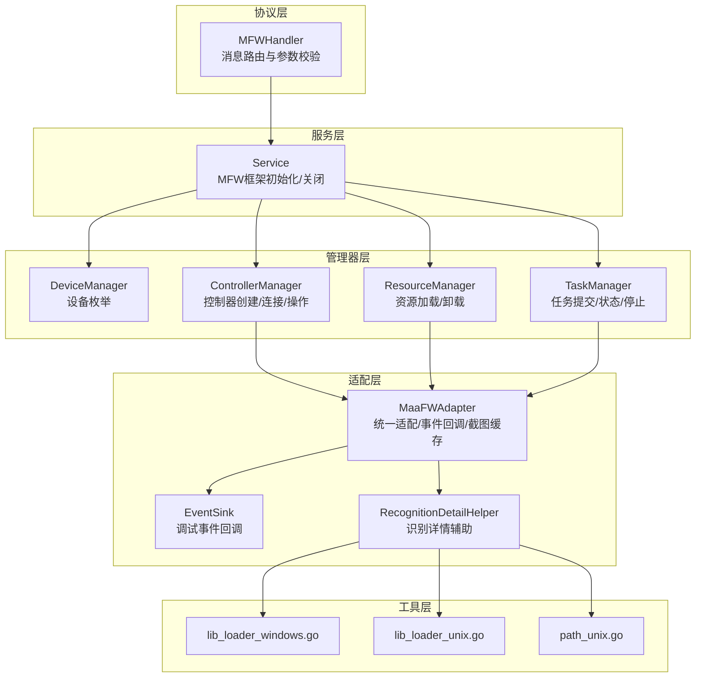
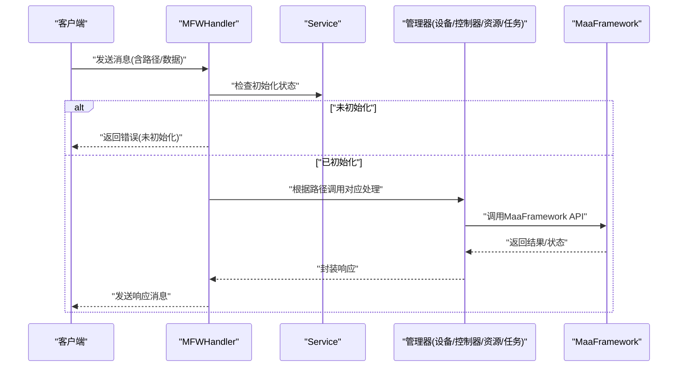
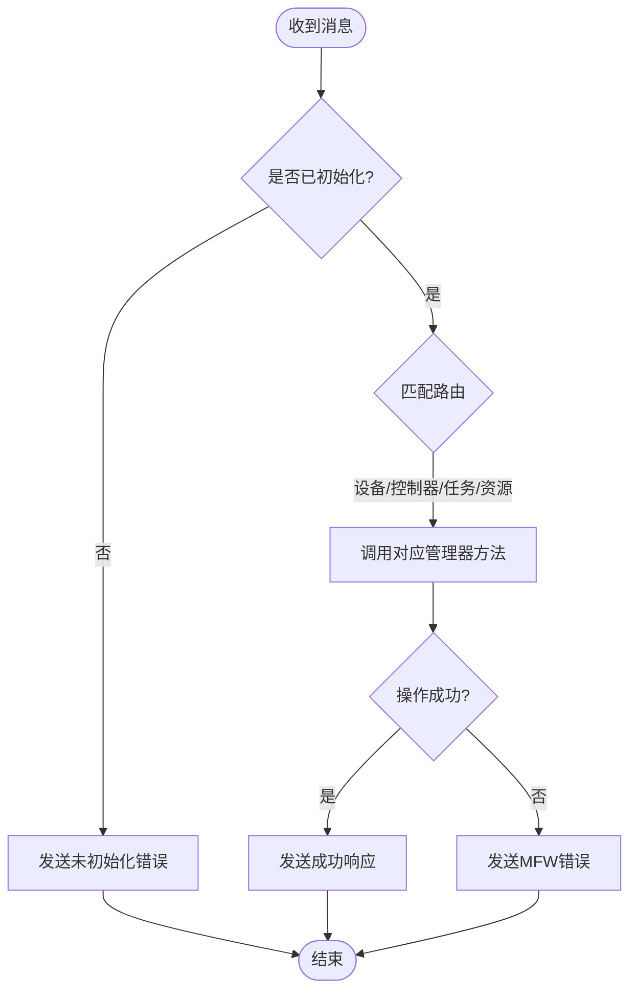
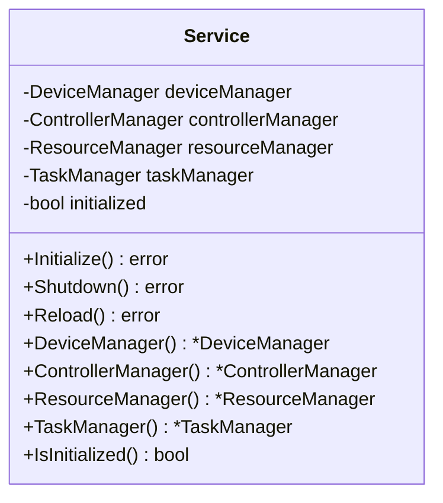
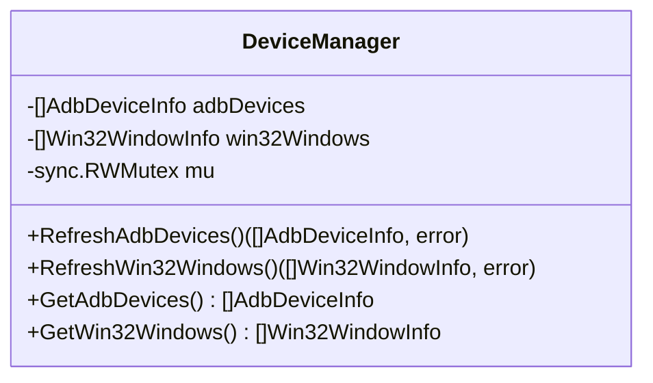
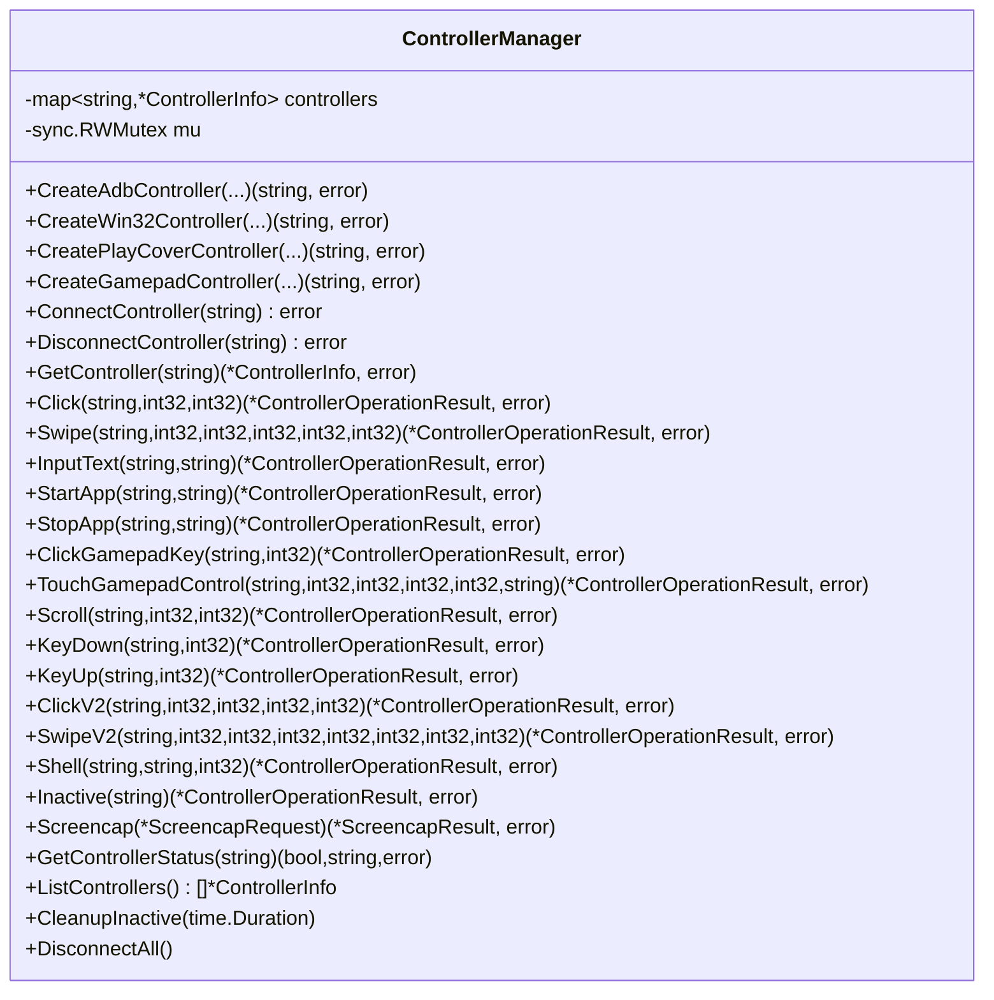
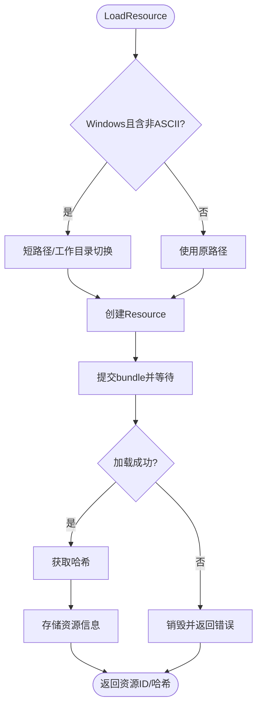
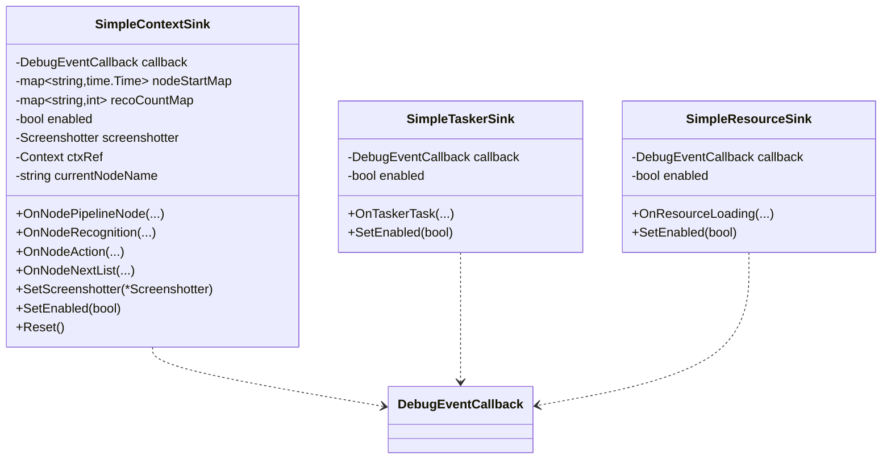
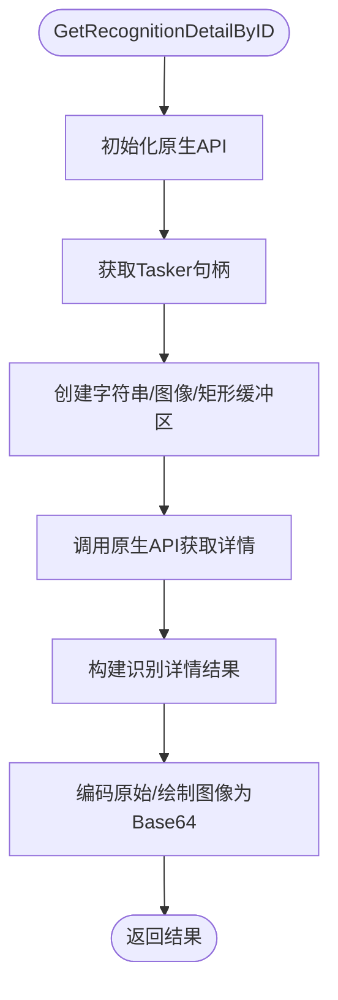
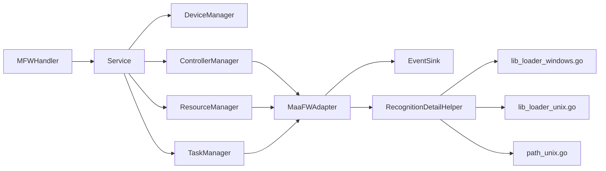

# MFW协议处理器

<cite>
**本文档引用的文件**
- [handler.go](file://LocalBridge/internal/protocol/mfw/handler.go)
- [service.go](file://LocalBridge/internal/mfw/service.go)
- [controller_manager.go](file://LocalBridge/internal/mfw/controller_manager.go)
- [device_manager.go](file://LocalBridge/internal/mfw/device_manager.go)
- [types.go](file://LocalBridge/internal/mfw/types.go)
- [error.go](file://LocalBridge/internal/mfw/error.go)
- [task_manager.go](file://LocalBridge/internal/mfw/task_manager.go)
- [resource_manager.go](file://LocalBridge/internal/mfw/resource_manager.go)
- [adapter.go](file://LocalBridge/internal/mfw/adapter.go)
- [event_sink.go](file://LocalBridge/internal/mfw/event_sink.go)
- [reco_detail_helper.go](file://LocalBridge/internal/mfw/reco_detail_helper.go)
- [lib_loader_windows.go](file://LocalBridge/internal/mfw/lib_loader_windows.go)
- [lib_loader_unix.go](file://LocalBridge/internal/mfw/lib_loader_unix.go)
- [path_unix.go](file://LocalBridge/internal/mfw/path_unix.go)
</cite>

## 目录
1. [简介](#简介)
2. [项目结构](#项目结构)
3. [核心组件](#核心组件)
4. [架构总览](#架构总览)
5. [详细组件分析](#详细组件分析)
6. [依赖关系分析](#依赖关系分析)
7. [性能考虑](#性能考虑)
8. [故障排除指南](#故障排除指南)
9. [结论](#结论)
10. [附录](#附录)

## 简介
本文件深入介绍MFW协议处理器（MFWHandler）的设计与实现，涵盖其在MaaFramework集成中的处理流程，包括控制器管理、设备连接、识别服务、任务调度与资源管理等模块。文档详细说明了MFW协议的消息格式、参数验证、业务逻辑处理、与MaaFramework的交互机制以及错误处理策略，并提供配置示例与故障排除指南。

## 项目结构
MFW协议处理器位于LocalBridge内部协议栈中，围绕MaaFramework Go语言绑定进行封装，形成“协议处理器 → 服务管理器 → 管理器层”的分层架构。核心文件组织如下：
- 协议层：MFWHandler负责HTTP/WebSocket消息路由与参数校验
- 服务层：Service统一初始化MaaFramework并协调各管理器
- 管理器层：设备管理器、控制器管理器、资源管理器、任务管理器
- 适配层：MaaFWAdapter提供统一适配与事件回调
- 工具层：识别详情辅助、原生API桥接、路径与库加载工具



**图表来源**
- [handler.go:12-26](file://LocalBridge/internal/protocol/mfw/handler.go#L12-L26)
- [service.go:16-34](file://LocalBridge/internal/mfw/service.go#L16-L34)
- [controller_manager.go:21-31](file://LocalBridge/internal/mfw/controller_manager.go#L21-L31)
- [device_manager.go:12-24](file://LocalBridge/internal/mfw/device_manager.go#L12-L24)
- [resource_manager.go:14-24](file://LocalBridge/internal/mfw/resource_manager.go#L14-L24)
- [task_manager.go:12-22](file://LocalBridge/internal/mfw/task_manager.go#L12-L22)
- [adapter.go:25-50](file://LocalBridge/internal/mfw/adapter.go#L25-L50)
- [event_sink.go:63-71](file://LocalBridge/internal/mfw/event_sink.go#L63-L71)
- [reco_detail_helper.go:22-31](file://LocalBridge/internal/mfw/reco_detail_helper.go#L22-L31)
- [lib_loader_windows.go:12-20](file://LocalBridge/internal/mfw/lib_loader_windows.go#L12-L20)
- [lib_loader_unix.go:12-18](file://LocalBridge/internal/mfw/lib_loader_unix.go#L12-L18)
- [path_unix.go:8-21](file://LocalBridge/internal/mfw/path_unix.go#L8-L21)

**章节来源**
- [handler.go:24-117](file://LocalBridge/internal/protocol/mfw/handler.go#L24-L117)
- [service.go:25-34](file://LocalBridge/internal/mfw/service.go#L25-L34)

## 核心组件
- MFWHandler：协议处理器，负责消息路由、参数校验与错误响应
- Service：服务管理器，负责MaaFramework初始化、关闭与全局状态
- DeviceManager：设备管理器，负责ADB设备与Win32窗口枚举
- ControllerManager：控制器管理器，负责控制器创建、连接、操作与截图
- ResourceManager：资源管理器，负责资源包加载与卸载
- TaskManager：任务管理器，负责任务提交、状态查询与停止
- MaaFWAdapter：统一适配器，封装控制器、资源、任务、Agent与事件回调
- EventSink：事件回调实现，提供节点/识别/动作/任务/资源事件
- RecognitionDetailHelper：识别详情辅助，通过原生API获取识别细节

**章节来源**
- [types.go:7-124](file://LocalBridge/internal/mfw/types.go#L7-L124)
- [error.go:6-53](file://LocalBridge/internal/mfw/error.go#L6-L53)

## 架构总览
MFWHandler作为入口，根据消息路径分发至相应处理函数；处理函数调用Service提供的管理器完成具体操作；管理器通过MaaFramework Go绑定与底层引擎交互；识别详情通过原生API桥接获取更丰富的调试信息。



**图表来源**
- [handler.go:29-41](file://LocalBridge/internal/protocol/mfw/handler.go#L29-L41)
- [service.go:37-55](file://LocalBridge/internal/mfw/service.go#L37-L55)

**章节来源**
- [handler.go:29-117](file://LocalBridge/internal/protocol/mfw/handler.go#L29-L117)
- [service.go:37-138](file://LocalBridge/internal/mfw/service.go#L37-L138)

## 详细组件分析

### MFWHandler（协议处理器）
- 路由前缀：/etl/mfw/
- 支持路由：
  - 设备：刷新ADB设备、刷新Win32窗口
  - 控制器：创建ADB/Win32/PlayCover/Gamepad控制器、断开、截图、点击、滑动、输入文本、启动/停止应用、按键、手柄触控、滚动、按键按下/释放、点击V2/滑动V2、Shell、置为非活跃
  - 任务：提交任务、查询任务状态、停止任务
  - 资源：加载资源、注册自定义识别/动作
- 参数校验：对消息数据进行类型转换与存在性检查，错误时返回标准错误响应
- 错误处理：统一使用MFW错误码与错误类型，结合日志输出



**图表来源**
- [handler.go:29-117](file://LocalBridge/internal/protocol/mfw/handler.go#L29-L117)

**章节来源**
- [handler.go:24-117](file://LocalBridge/internal/protocol/mfw/handler.go#L24-L117)

### Service（服务管理器）
- 初始化：读取全局配置，处理Windows中文路径问题，调用MaaFramework初始化API，设置日志目录与行为
- 关闭：停止所有任务、断开所有控制器、卸载所有资源、释放框架
- 提供：设备管理器、控制器管理器、资源管理器、任务管理器的访问接口



**图表来源**
- [service.go:16-34](file://LocalBridge/internal/mfw/service.go#L16-L34)

**章节来源**
- [service.go:37-218](file://LocalBridge/internal/mfw/service.go#L37-L218)

### DeviceManager（设备管理器）
- ADB设备：调用FindAdbDevices，返回设备列表与可用截图/输入方法
- Win32窗口：调用FindDesktopWindows，返回窗口列表与可用截图/输入方法
- 线程安全：使用互斥锁保护设备列表



**图表来源**
- [device_manager.go:12-24](file://LocalBridge/internal/mfw/device_manager.go#L12-L24)

**章节来源**
- [device_manager.go:27-110](file://LocalBridge/internal/mfw/device_manager.go#L27-L110)

### ControllerManager（控制器管理器）
- 控制器类型：ADB、Win32、PlayCover、Gamepad
- 创建与连接：解析方法名、创建控制器实例、异步连接并等待完成
- 操作：点击、滑动、输入文本、启动/停止应用、按键、手柄触控、滚动、按键按下/释放、点击V2/滑动V2、Shell、置为非活跃
- 截图：支持目标长/短边缩放、原始尺寸、缓存策略，返回Base64 PNG
- 状态管理：连接状态、UUID、最后活跃时间、非活跃清理



**图表来源**
- [controller_manager.go:21-31](file://LocalBridge/internal/mfw/controller_manager.go#L21-L31)
- [types.go:41-124](file://LocalBridge/internal/mfw/types.go#L41-L124)

**章节来源**
- [controller_manager.go:34-647](file://LocalBridge/internal/mfw/controller_manager.go#L34-L647)
- [types.go:72-124](file://LocalBridge/internal/mfw/types.go#L72-L124)

### ResourceManager（资源管理器）
- 加载：创建Resource实例，提交bundle，等待完成，获取哈希
- 卸载：销毁资源实例，清空列表
- Windows路径处理：中文路径转换为短路径或工作目录切换



**图表来源**
- [resource_manager.go:27-105](file://LocalBridge/internal/mfw/resource_manager.go#L27-L105)

**章节来源**
- [resource_manager.go:27-158](file://LocalBridge/internal/mfw/resource_manager.go#L27-L158)

### TaskManager（任务管理器）
- 提交：创建Tasker，生成任务ID，记录状态
- 查询：返回任务状态
- 停止：向Tasker提交停止作业并等待

```mermaid
classDiagram
class TaskManager {
-map~int64,*TaskInfo~ tasks
-sync.RWMutex mu
+SubmitTask(string,string,string,map[string]interface{}) (int64, error)
+GetTaskStatus(int64) (string, error)
+StopTask(int64) error
+StopAll()
}
```

**图表来源**
- [task_manager.go:12-22](file://LocalBridge/internal/mfw/task_manager.go#L12-L22)

**章节来源**
- [task_manager.go:25-114](file://LocalBridge/internal/mfw/task_manager.go#L25-L114)

### MaaFWAdapter（统一适配器）
- 控制器：ADB/Win32连接、设置外部控制器、连接状态检查
- 资源：加载单个/多个资源包、设置外部资源、资源状态检查
- 任务：初始化Tasker、运行/提交任务、停止任务、事件回调注册
- Agent：连接/断开、状态检查、事件回传
- 截图：截图器封装，Base64 PNG输出
- 清理：销毁适配器，释放所有资源

```mermaid
classDiagram
class MaaFWAdapter {
-Controller controller
-Resource resource
-Tasker tasker
-AgentClient agentClient
-Screenshotter screenshotter
-bool controllerConnected
-bool resourceLoaded
-bool agentConnected
-bool initialized
-bool ownsController
-string controllerType
-string deviceInfo
-int64 contextSinkID
-int64 taskerSinkID
+ConnectADB(...)
+ConnectWin32(...)
+SetController(*Controller,string,string)
+GetController() *Controller
+IsControllerConnected() bool
+LoadResource(string) error
+LoadResources([]string) error
+SetResource(*Resource)
+GetResource() *Resource
+IsResourceLoaded() bool
+InitTasker() error
+RunTask(string, ...interface{}) (*TaskJob, error)
+PostTask(string, ...interface{}) (*TaskJob, error)
+StopTask() error
+PostStop()
+ConnectAgent(string) error
+DisconnectAgent()
+IsAgentConnected() bool
+AddContextSink(ContextEventSink) int64
+RemoveContextSink(int64)
+ClearContextSinks()
+AddTaskerSink(TaskerEventSink) int64
+RemoveTaskerSink(int64)
+GetScreenshotter() *Screenshotter
+Screencap() (string, error)
+ScreencapImage() (image.Image, error)
+Destroy()
+GetStatus() map[string]interface{}
}
```

**图表来源**
- [adapter.go:25-50](file://LocalBridge/internal/mfw/adapter.go#L25-L50)

**章节来源**
- [adapter.go:65-703](file://LocalBridge/internal/mfw/adapter.go#L65-L703)

### EventSink（事件回调）
- 节点事件：节点开始/成功/失败
- 识别事件：识别开始/成功/失败，包含算法、框、原始图像、绘制图像等详情
- 动作事件：动作开始/成功/失败
- 任务事件：任务开始/成功/失败
- 资源事件：资源加载中/完成/失败
- 事件携带时间戳、节点/任务/识别/动作ID、延迟时间等



**图表来源**
- [event_sink.go:63-71](file://LocalBridge/internal/mfw/event_sink.go#L63-L71)
- [event_sink.go:392-403](file://LocalBridge/internal/mfw/event_sink.go#L392-L403)
- [event_sink.go:461-472](file://LocalBridge/internal/mfw/event_sink.go#L461-L472)

**章节来源**
- [event_sink.go:18-520](file://LocalBridge/internal/mfw/event_sink.go#L18-L520)

### RecognitionDetailHelper（识别详情辅助）
- 通过原生API桥接获取识别详情：名称、算法、命中、框、原始图像、绘制图像列表
- 跨平台库加载：Windows使用sys/windows，Unix使用purego
- 路径处理：非ASCII字符检测与短路径转换



**图表来源**
- [reco_detail_helper.go:169-267](file://LocalBridge/internal/mfw/reco_detail_helper.go#L169-L267)

**章节来源**
- [reco_detail_helper.go:86-345](file://LocalBridge/internal/mfw/reco_detail_helper.go#L86-L345)

## 依赖关系分析
- MFWHandler依赖Service提供的管理器实例
- Service依赖MaaFramework Go绑定与配置/路径工具
- 管理器层依赖MaaFramework API进行设备、控制器、资源、任务操作
- 适配层提供统一抽象，事件回调与识别详情辅助作为支撑
- 跨平台库加载与路径处理确保Windows中文路径兼容



**图表来源**
- [handler.go:12-21](file://LocalBridge/internal/protocol/mfw/handler.go#L12-L21)
- [service.go:16-34](file://LocalBridge/internal/mfw/service.go#L16-L34)
- [adapter.go:25-50](file://LocalBridge/internal/mfw/adapter.go#L25-L50)
- [reco_detail_helper.go:86-129](file://LocalBridge/internal/mfw/reco_detail_helper.go#L86-L129)

**章节来源**
- [handler.go:12-21](file://LocalBridge/internal/protocol/mfw/handler.go#L12-L21)
- [service.go:16-34](file://LocalBridge/internal/mfw/service.go#L16-L34)
- [adapter.go:25-50](file://LocalBridge/internal/mfw/adapter.go#L25-L50)

## 性能考虑
- 截图缓存：Screenshotter提供默认100ms缓存，避免频繁截图
- 连接超时：控制器连接采用异步等待并超时控制
- 非活跃清理：定期清理长时间未活跃的控制器，释放资源
- 资源加载：多资源包顺序加载，失败即销毁并回滚
- 事件过滤：简化事件回调，减少事件噪声，提升调试效率

[本节为通用指导，无需特定文件引用]

## 故障排除指南
- 未初始化：检查是否已设置MaaFramework库路径并重启服务
  - 参考：[service.go:60-65](file://LocalBridge/internal/mfw/service.go#L60-L65)
- 控制器创建/连接失败：检查设备/窗口句柄、方法名解析、权限与驱动
  - 参考：[controller_manager.go:34-58](file://LocalBridge/internal/mfw/controller_manager.go#L34-L58)
- 截图失败：确认控制器已连接、截图参数有效、缓存策略
  - 参考：[controller_manager.go:517-585](file://LocalBridge/internal/mfw/controller_manager.go#L517-L585)
- 资源加载失败：检查路径、中文路径处理、bundle有效性
  - 参考：[resource_manager.go:27-105](file://LocalBridge/internal/mfw/resource_manager.go#L27-L105)
- 任务提交/停止失败：检查任务ID、Tasker初始化状态
  - 参考：[task_manager.go:25-90](file://LocalBridge/internal/mfw/task_manager.go#L25-L90)
- 识别详情获取失败：确认原生API初始化、库路径正确、Tasker句柄有效
  - 参考：[reco_detail_helper.go:169-267](file://LocalBridge/internal/mfw/reco_detail_helper.go#L169-L267)

**章节来源**
- [service.go:60-138](file://LocalBridge/internal/mfw/service.go#L60-L138)
- [controller_manager.go:34-58](file://LocalBridge/internal/mfw/controller_manager.go#L34-L58)
- [controller_manager.go:517-585](file://LocalBridge/internal/mfw/controller_manager.go#L517-L585)
- [resource_manager.go:27-105](file://LocalBridge/internal/mfw/resource_manager.go#L27-L105)
- [task_manager.go:25-90](file://LocalBridge/internal/mfw/task_manager.go#L25-L90)
- [reco_detail_helper.go:169-267](file://LocalBridge/internal/mfw/reco_detail_helper.go#L169-L267)

## 结论
MFW协议处理器通过清晰的分层设计与完善的错误处理机制，实现了与MaaFramework的深度集成。协议层负责消息路由与参数校验，服务层统一初始化与资源管理，管理器层封装具体业务操作，适配层提供统一抽象与事件回调，工具层保障跨平台兼容性。该架构具备良好的扩展性与可维护性，适用于复杂自动化场景。

[本节为总结性内容，无需特定文件引用]

## 附录

### MFW协议消息格式与参数
- 路由前缀：/etl/mfw/
- 设备相关：
  - /etl/mfw/refresh_adb_devices → 返回/devices
  - /etl/mfw/refresh_win32_windows → 返回/windows
- 控制器相关：
  - /etl/mfw/create_adb_controller → data: adb_path, address, screencap_methods[], input_methods[], config, agent_path
  - /etl/mfw/create_win32_controller → data: hwnd, screencap_method, input_method
  - /etl/mfw/create_playcover_controller → data: address, uuid
  - /etl/mfw/create_gamepad_controller → data: hwnd, gamepad_type, screencap_method
  - /etl/mfw/disconnect_controller → data: controller_id
  - /etl/mfw/request_screencap → data: controller_id, use_cache, target_long_side, target_short_side, use_raw_size
  - /etl/mfw/controller_click → data: controller_id, x, y
  - /etl/mfw/controller_swipe → data: controller_id, x1, y1, x2, y2, duration
  - /etl/mfw/controller_input_text → data: controller_id, text
  - /etl/mfw/controller_start_app → data: controller_id, package
  - /etl/mfw/controller_stop_app → data: controller_id, package
  - /etl/mfw/controller_click_key → data: controller_id, keycode
  - /etl/mfw/controller_touch_gamepad → data: controller_id, contact, x, y, pressure, action
  - /etl/mfw/controller_scroll → data: controller_id, dx, dy
  - /etl/mfw/controller_key_down → data: controller_id, keycode
  - /etl/mfw/controller_key_up → data: controller_id, keycode
  - /etl/mfw/controller_click_v2 → data: controller_id, x, y, contact, pressure
  - /etl/mfw/controller_swipe_v2 → data: controller_id, x1, y1, x2, y2, duration, contact, pressure
  - /etl/mfw/controller_shell → data: controller_id, command, timeout
  - /etl/mfw/controller_inactive → data: controller_id
- 任务相关：
  - /etl/mfw/submit_task → data: controller_id, resource_id, entry, pipeline_override
  - /etl/mfw/query_task_status → data: task_id
  - /etl/mfw/stop_task → data: task_id
- 资源相关：
  - /etl/mfw/load_resource → data: resource_path
  - /etl/mfw/register_custom_recognition → data: ...
  - /etl/mfw/register_custom_action → data: ...

**章节来源**
- [handler.go:44-117](file://LocalBridge/internal/protocol/mfw/handler.go#L44-L117)

### 配置示例与最佳实践
- 设置MaaFramework库路径：使用后端命令设置库目录，确保路径不含中文或进行短路径转换
  - 参考：[service.go:60-94](file://LocalBridge/internal/mfw/service.go#L60-L94)
- Windows中文路径处理：优先尝试短路径转换，失败则切换工作目录
  - 参考：[service.go:68-94](file://LocalBridge/internal/mfw/service.go#L68-L94)，[resource_manager.go:31-52](file://LocalBridge/internal/mfw/resource_manager.go#L31-L52)，[path_unix.go:8-21](file://LocalBridge/internal/mfw/path_unix.go#L8-L21)
- 控制器方法选择：根据设备能力选择合适的截图与输入方法，必要时使用默认值
  - 参考：[controller_manager.go:39-53](file://LocalBridge/internal/mfw/controller_manager.go#L39-L53)，[controller_manager.go:126-140](file://LocalBridge/internal/mfw/controller_manager.go#L126-L140)
- 任务调试：启用事件回调，关注节点/识别/动作/任务事件，结合识别详情辅助定位问题
  - 参考：[event_sink.go:108-167](file://LocalBridge/internal/mfw/event_sink.go#L108-L167)，[reco_detail_helper.go:169-267](file://LocalBridge/internal/mfw/reco_detail_helper.go#L169-L267)

**章节来源**
- [service.go:60-138](file://LocalBridge/internal/mfw/service.go#L60-L138)
- [resource_manager.go:31-105](file://LocalBridge/internal/mfw/resource_manager.go#L31-L105)
- [path_unix.go:8-21](file://LocalBridge/internal/mfw/path_unix.go#L8-L21)
- [event_sink.go:108-167](file://LocalBridge/internal/mfw/event_sink.go#L108-L167)
- [reco_detail_helper.go:169-267](file://LocalBridge/internal/mfw/reco_detail_helper.go#L169-L267)