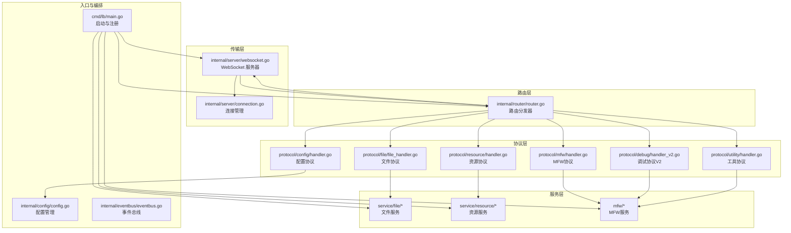
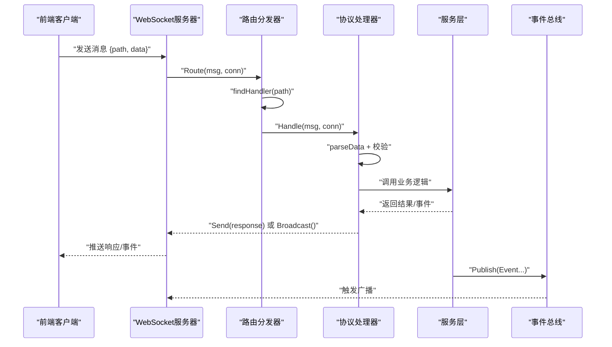
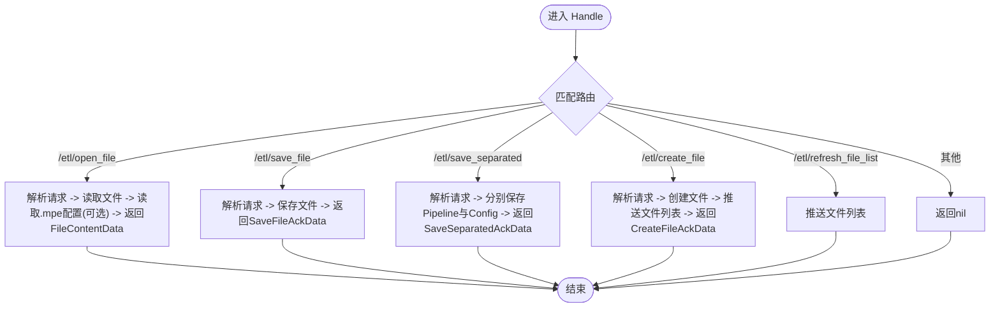
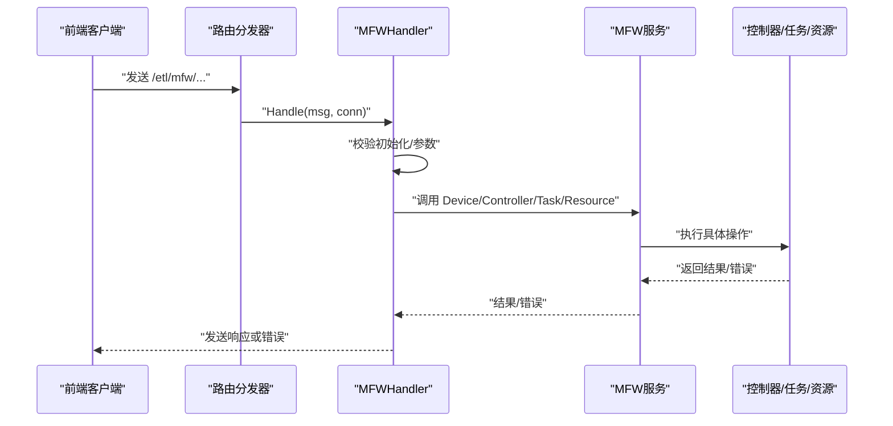
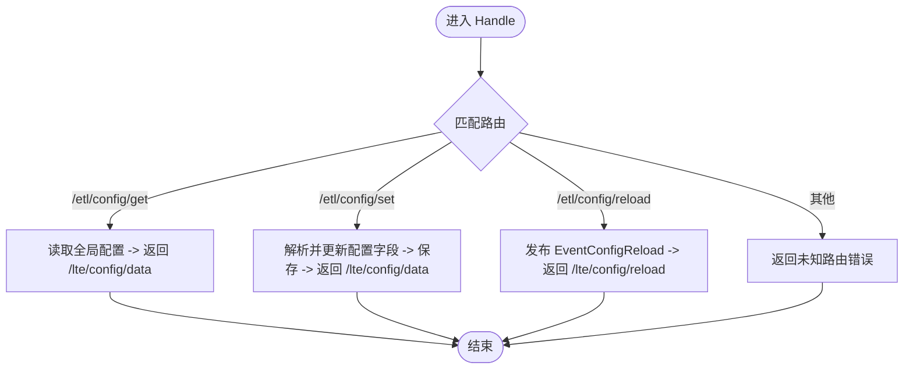
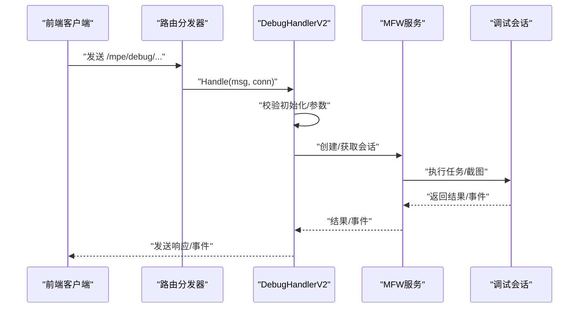
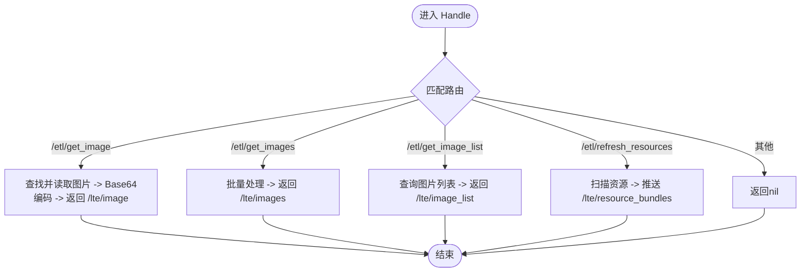
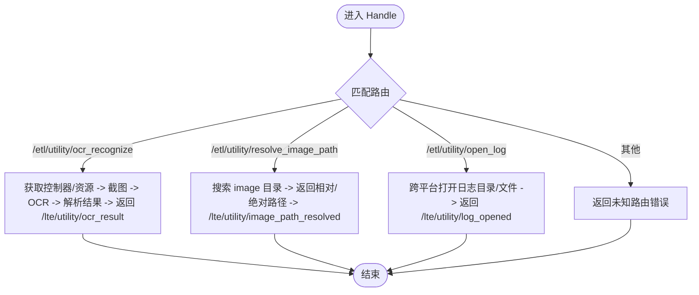
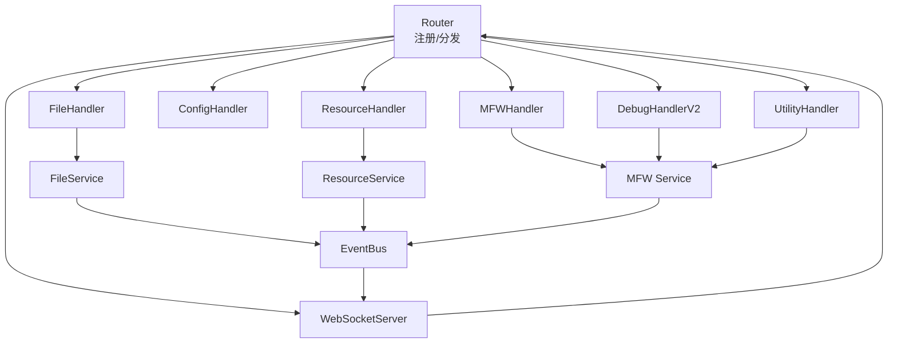

# 协议处理器系统

<cite>
**本文档引用的文件**
- [LocalBridge/cmd/lb/main.go](file://LocalBridge/cmd/lb/main.go)
- [LocalBridge/internal/router/router.go](file://LocalBridge/internal/router/router.go)
- [LocalBridge/internal/server/websocket.go](file://LocalBridge/internal/server/websocket.go)
- [LocalBridge/internal/server/connection.go](file://LocalBridge/internal/server/connection.go)
- [LocalBridge/internal/protocol/file/file_handler.go](file://LocalBridge/internal/protocol/file/file_handler.go)
- [LocalBridge/internal/protocol/mfw/handler.go](file://LocalBridge/internal/protocol/mfw/handler.go)
- [LocalBridge/internal/protocol/config/handler.go](file://LocalBridge/internal/protocol/config/handler.go)
- [LocalBridge/internal/protocol/debug/handler_v2.go](file://LocalBridge/internal/protocol/debug/handler_v2.go)
- [LocalBridge/internal/protocol/resource/handler.go](file://LocalBridge/internal/protocol/resource/handler.go)
- [LocalBridge/internal/protocol/utility/handler.go](file://LocalBridge/internal/protocol/utility/handler.go)
- [LocalBridge/pkg/models/message.go](file://LocalBridge/pkg/models/message.go)
- [LocalBridge/internal/errors/errors.go](file://LocalBridge/internal/errors/errors.go)
- [LocalBridge/internal/eventbus/eventbus.go](file://LocalBridge/internal/eventbus/eventbus.go)
- [LocalBridge/internal/config/config.go](file://LocalBridge/internal/config/config.go)
- [LocalBridge/internal/mfw/types.go](file://LocalBridge/internal/mfw/types.go)
</cite>

## 目录
1. [简介](#简介)
2. [项目结构](#项目结构)
3. [核心组件](#核心组件)
4. [架构总览](#架构总览)
5. [详细组件分析](#详细组件分析)
6. [依赖关系分析](#依赖关系分析)
7. [性能考虑](#性能考虑)
8. [故障排除指南](#故障排除指南)
9. [结论](#结论)
10. [附录](#附录)

## 简介
本文件系统性介绍 LocalBridge 协议处理器系统的架构与实现，重点涵盖文件协议、MFW 协议、配置协议、调试协议、资源协议与工具协议六大处理器的设计原理、消息格式、参数校验、业务流程、注册机制、消息路由与错误处理策略，并给出协议扩展与自定义处理器开发指南。

## 项目结构
LocalBridge 采用模块化设计，核心由以下层次构成：
- 入口与服务编排：命令行入口负责初始化路径、配置、日志、事件总线、文件与资源服务、WebSocket 服务器与路由分发器。
- 传输层：基于 WebSocket 的消息传输，统一消息结构与广播机制。
- 路由层：根据消息路径精确或前缀匹配到对应协议处理器。
- 协议层：六大协议处理器分别处理文件、MFW 控制、配置、调试、资源与工具类功能。
- 服务层：文件服务、资源服务、MFW 服务等支撑协议处理。
- 模型与错误：统一的消息模型、错误码与错误包装。

图表来源
- [LocalBridge/cmd/lb/main.go:385-413](file://LocalBridge/cmd/lb/main.go#L385-L413)
- [LocalBridge/internal/router/router.go:29-47](file://LocalBridge/internal/router/router.go#L29-L47)
- [LocalBridge/internal/server/websocket.go:36-58](file://LocalBridge/internal/server/websocket.go#L36-L58)

章节来源
- [LocalBridge/cmd/lb/main.go:385-413](file://LocalBridge/cmd/lb/main.go#L385-L413)
- [LocalBridge/internal/server/websocket.go:36-58](file://LocalBridge/internal/server/websocket.go#L36-L58)
- [LocalBridge/internal/router/router.go:29-47](file://LocalBridge/internal/router/router.go#L29-L47)

## 核心组件
- 路由分发器：实现 Handler 接口的处理器注册与消息分发，支持精确匹配与前缀匹配。
- WebSocket 服务器：负责连接生命周期管理、消息读写与广播。
- 协议处理器：六大协议处理器分别实现路由前缀声明与 Handle 方法，完成消息解析、参数校验、业务处理与响应。
- 错误系统：统一的 LBError 错误码与包装，便于前端一致处理。
- 事件总线：连接建立、文件变化、资源扫描完成、配置重载等事件驱动的推送与联动。
- 模型与配置：统一的消息结构、错误结构与配置结构，确保前后端契约稳定。

章节来源
- [LocalBridge/internal/router/router.go:19-26](file://LocalBridge/internal/router/router.go#L19-L26)
- [LocalBridge/internal/server/websocket.go:36-46](file://LocalBridge/internal/server/websocket.go#L36-L46)
- [LocalBridge/internal/errors/errors.go:22-50](file://LocalBridge/internal/errors/errors.go#L22-L50)
- [LocalBridge/internal/eventbus/eventbus.go:16-20](file://LocalBridge/internal/eventbus/eventbus.go#L16-L20)
- [LocalBridge/pkg/models/message.go:3-14](file://LocalBridge/pkg/models/message.go#L3-L14)

## 架构总览
LocalBridge 的消息处理链路如下：
- 客户端通过 WebSocket 发送消息，消息包含 path 与 data。
- WebSocket 服务器接收消息后，交由路由分发器进行匹配。
- 路由分发器根据精确匹配或前缀匹配选择对应处理器。
- 处理器解析数据、执行参数校验、调用服务层执行业务逻辑、返回响应或通过事件总线推送消息。

图表来源
- [LocalBridge/internal/server/connection.go:32-59](file://LocalBridge/internal/server/connection.go#L32-L59)
- [LocalBridge/internal/router/router.go:49-76](file://LocalBridge/internal/router/router.go#L49-L76)
- [LocalBridge/internal/server/websocket.go:163-171](file://LocalBridge/internal/server/websocket.go#L163-L171)

章节来源
- [LocalBridge/internal/server/connection.go:32-59](file://LocalBridge/internal/server/connection.go#L32-L59)
- [LocalBridge/internal/router/router.go:49-76](file://LocalBridge/internal/router/router.go#L49-L76)
- [LocalBridge/internal/server/websocket.go:163-171](file://LocalBridge/internal/server/websocket.go#L163-L171)

## 详细组件分析

### 文件协议处理器（FileHandler）
- 设计要点
  - 实现路由前缀：/etl/open_file、/etl/save_file、/etl/save_separated、/etl/create_file、/etl/refresh_file_list。
  - 事件驱动：订阅连接建立与文件变化事件，自动推送文件列表与变化通知。
  - 参数校验：统一解析 JSON，失败时返回标准错误。
  - 业务流程：打开文件读取内容与关联配置；保存文件；分离保存；创建文件；刷新文件列表。
- 消息格式
  - 请求：OpenFileRequest、SaveFileRequest、SaveSeparatedRequest、CreateFileRequest。
  - 响应：FileContentData、SaveFileAckData、SaveSeparatedAckData、CreateFileAckData。
- 错误处理：封装文件读写异常为 LBError，区分业务错误与系统错误。
- 特殊功能：自动探测 .mpe.json 配置文件并返回；文件变化时推送 /lte/file_changed 与必要时刷新列表。

图表来源
- [LocalBridge/internal/protocol/file/file_handler.go:48-64](file://LocalBridge/internal/protocol/file/file_handler.go#L48-L64)
- [LocalBridge/internal/protocol/file/file_handler.go:67-137](file://LocalBridge/internal/protocol/file/file_handler.go#L67-L137)
- [LocalBridge/internal/protocol/file/file_handler.go:140-166](file://LocalBridge/internal/protocol/file/file_handler.go#L140-L166)
- [LocalBridge/internal/protocol/file/file_handler.go:169-208](file://LocalBridge/internal/protocol/file/file_handler.go#L169-L208)
- [LocalBridge/internal/protocol/file/file_handler.go:211-241](file://LocalBridge/internal/protocol/file/file_handler.go#L211-L241)
- [LocalBridge/internal/protocol/file/file_handler.go:244-247](file://LocalBridge/internal/protocol/file/file_handler.go#L244-L247)

章节来源
- [LocalBridge/internal/protocol/file/file_handler.go:14-35](file://LocalBridge/internal/protocol/file/file_handler.go#L14-L35)
- [LocalBridge/internal/protocol/file/file_handler.go:37-46](file://LocalBridge/internal/protocol/file/file_handler.go#L37-L46)
- [LocalBridge/internal/protocol/file/file_handler.go:249-285](file://LocalBridge/internal/protocol/file/file_handler.go#L249-L285)
- [LocalBridge/pkg/models/message.go:46-91](file://LocalBridge/pkg/models/message.go#L46-L91)

### MFW 协议处理器（MFWHandler）
- 设计要点
  - 路由前缀：/etl/mfw/ 前缀下的多条子路由，覆盖设备刷新、控制器创建与操作、任务提交与查询、资源加载、自定义识别与动作注册。
  - 初始化检查：未初始化则拒绝请求并提示设置库路径。
  - 参数校验：对请求数据进行类型检查与必要字段校验。
  - 业务流程：设备管理、控制器管理、任务管理、资源管理与自定义扩展。
- 消息格式
  - 设备：/etl/mfw/refresh_adb_devices、/etl/mfw/refresh_win32_windows。
  - 控制器：/etl/mfw/create_*、/etl/mfw/disconnect_controller、/etl/mfw/request_screencap、/etl/mfw/controller_*。
  - 任务：/etl/mfw/submit_task、/etl/mfw/query_task_status、/etl/mfw/stop_task。
  - 资源：/etl/mfw/load_resource、/etl/mfw/register_custom_recognition、/etl/mfw/register_custom_action。
- 错误处理：使用 MFW 错误码与统一错误响应，便于前端定位问题。

图表来源
- [LocalBridge/internal/protocol/mfw/handler.go:28-117](file://LocalBridge/internal/protocol/mfw/handler.go#L28-L117)
- [LocalBridge/internal/protocol/mfw/handler.go:119-156](file://LocalBridge/internal/protocol/mfw/handler.go#L119-L156)
- [LocalBridge/internal/protocol/mfw/handler.go:159-320](file://LocalBridge/internal/protocol/mfw/handler.go#L159-L320)
- [LocalBridge/internal/protocol/mfw/handler.go:321-346](file://LocalBridge/internal/protocol/mfw/handler.go#L321-L346)
- [LocalBridge/internal/protocol/mfw/handler.go:684-771](file://LocalBridge/internal/protocol/mfw/handler.go#L684-L771)
- [LocalBridge/internal/protocol/mfw/handler.go:773-800](file://LocalBridge/internal/protocol/mfw/handler.go#L773-L800)

章节来源
- [LocalBridge/internal/protocol/mfw/handler.go:11-21](file://LocalBridge/internal/protocol/mfw/handler.go#L11-L21)
- [LocalBridge/internal/protocol/mfw/handler.go:23-26](file://LocalBridge/internal/protocol/mfw/handler.go#L23-L26)
- [LocalBridge/internal/protocol/mfw/handler.go:33-41](file://LocalBridge/internal/protocol/mfw/handler.go#L33-L41)
- [LocalBridge/internal/mfw/types.go:7-124](file://LocalBridge/internal/mfw/types.go#L7-L124)

### 配置协议处理器（ConfigHandler）
- 设计要点
  - 路由前缀：/etl/config/。
  - 支持获取配置、设置配置与内部重载。
  - 设置配置时进行字段映射与类型转换，支持增量更新。
  - 重载事件触发资源扫描与 MFW 服务重载。
- 消息格式
  - 获取：/etl/config/get -> 返回 /lte/config/data。
  - 设置：/etl/config/set -> 返回 /lte/config/data。
  - 重载：/etl/config/reload -> 返回 /lte/config/reload。
- 错误处理：配置未加载、保存失败、无有效更新等场景返回标准化错误。

图表来源
- [LocalBridge/internal/protocol/config/handler.go:25-47](file://LocalBridge/internal/protocol/config/handler.go#L25-L47)
- [LocalBridge/internal/protocol/config/handler.go:49-68](file://LocalBridge/internal/protocol/config/handler.go#L49-L68)
- [LocalBridge/internal/protocol/config/handler.go:70-171](file://LocalBridge/internal/protocol/config/handler.go#L70-L171)
- [LocalBridge/internal/protocol/config/handler.go:173-204](file://LocalBridge/internal/protocol/config/handler.go#L173-L204)

章节来源
- [LocalBridge/internal/protocol/config/handler.go:12-18](file://LocalBridge/internal/protocol/config/handler.go#L12-L18)
- [LocalBridge/internal/protocol/config/handler.go:20-23](file://LocalBridge/internal/protocol/config/handler.go#L20-L23)
- [LocalBridge/internal/protocol/config/handler.go:206-215](file://LocalBridge/internal/protocol/config/handler.go#L206-L215)
- [LocalBridge/internal/config/config.go:42-48](file://LocalBridge/internal/config/config.go#L42-L48)

### 调试协议处理器（DebugHandlerV2）
- 设计要点
  - 路由前缀：/mpe/debug/。
  - 会话管理：创建、销毁、列出、获取会话。
  - 调试控制：启动、运行、停止任务。
  - 数据查询：获取节点数据、截图。
  - 事件回调：通过 DebugEventCallback 将事件推送给前端。
- 消息格式
  - 会话：/mpe/debug/create_session、/mpe/debug/destroy_session、/mpe/debug/list_sessions、/mpe/debug/get_session。
  - 控制：/mpe/debug/start、/mpe/debug/run、/mpe/debug/stop。
  - 查询：/mpe/debug/get_node_data、/mpe/debug/screencap。
  - 事件：/lte/debug/event。
- 错误处理：统一错误响应与会话不存在、参数缺失等场景。

图表来源
- [LocalBridge/internal/protocol/debug/handler_v2.go:35-79](file://LocalBridge/internal/protocol/debug/handler_v2.go#L35-L79)
- [LocalBridge/internal/protocol/debug/handler_v2.go:85-137](file://LocalBridge/internal/protocol/debug/handler_v2.go#L85-L137)
- [LocalBridge/internal/protocol/debug/handler_v2.go:227-294](file://LocalBridge/internal/protocol/debug/handler_v2.go#L227-L294)
- [LocalBridge/internal/protocol/debug/handler_v2.go:333-366](file://LocalBridge/internal/protocol/debug/handler_v2.go#L333-L366)
- [LocalBridge/internal/protocol/debug/handler_v2.go:372-445](file://LocalBridge/internal/protocol/debug/handler_v2.go#L372-L445)

章节来源
- [LocalBridge/internal/protocol/debug/handler_v2.go:16-28](file://LocalBridge/internal/protocol/debug/handler_v2.go#L16-L28)
- [LocalBridge/internal/protocol/debug/handler_v2.go:30-33](file://LocalBridge/internal/protocol/debug/handler_v2.go#L30-L33)
- [LocalBridge/internal/protocol/debug/handler_v2.go:488-519](file://LocalBridge/internal/protocol/debug/handler_v2.go#L488-L519)

### 资源协议处理器（ResourceHandler）
- 设计要点
  - 路由前缀：/etl/get_image、/etl/get_images、/etl/get_image_list、/etl/refresh_resources。
  - 事件驱动：连接建立与资源扫描完成后推送资源包列表。
  - 业务流程：单图/多图获取、图片列表查询、资源刷新与推送。
- 消息格式
  - 请求：GetImageRequest、GetImagesRequest、GetImageListRequest。
  - 响应：GetImageResponse、GetImagesResponse、GetImageListResponse。
- 错误处理：图片未找到、读取失败等场景返回标准化错误。

图表来源
- [LocalBridge/internal/protocol/resource/handler.go:55-69](file://LocalBridge/internal/protocol/resource/handler.go#L55-L69)
- [LocalBridge/internal/protocol/resource/handler.go:71-84](file://LocalBridge/internal/protocol/resource/handler.go#L71-L84)
- [LocalBridge/internal/protocol/resource/handler.go:86-105](file://LocalBridge/internal/protocol/resource/handler.go#L86-L105)
- [LocalBridge/internal/protocol/resource/handler.go:117-137](file://LocalBridge/internal/protocol/resource/handler.go#L117-L137)
- [LocalBridge/internal/protocol/resource/handler.go:108-114](file://LocalBridge/internal/protocol/resource/handler.go#L108-L114)

章节来源
- [LocalBridge/internal/protocol/resource/handler.go:22-28](file://LocalBridge/internal/protocol/resource/handler.go#L22-L28)
- [LocalBridge/internal/protocol/resource/handler.go:45-53](file://LocalBridge/internal/protocol/resource/handler.go#L45-L53)
- [LocalBridge/internal/protocol/resource/handler.go:219-232](file://LocalBridge/internal/protocol/resource/handler.go#L219-L232)
- [LocalBridge/pkg/models/message.go:114-126](file://LocalBridge/pkg/models/message.go#L114-L126)

### 工具协议处理器（UtilityHandler）
- 设计要点
  - 路由前缀：/etl/utility/。
  - OCR 识别：基于 MFW 控制器截图与资源执行 OCR，支持 ROI 区域与结果解析。
  - 图片路径解析：在根目录下搜索 image 目录，返回相对/绝对路径。
  - 打开日志：跨平台打开日志目录或文件。
- 消息格式
  - OCR：/etl/utility/ocr_recognize -> /lte/utility/ocr_result。
  - 路径解析：/etl/utility/resolve_image_path -> /lte/utility/image_path_resolved。
  - 打开日志：/etl/utility/open_log -> /lte/utility/log_opened。
- 错误处理：OCR 资源未配置、控制器未连接、截图失败等场景返回标准化错误。

图表来源
- [LocalBridge/internal/protocol/utility/handler.go:43-65](file://LocalBridge/internal/protocol/utility/handler.go#L43-L65)
- [LocalBridge/internal/protocol/utility/handler.go:67-119](file://LocalBridge/internal/protocol/utility/handler.go#L67-L119)
- [LocalBridge/internal/protocol/utility/handler.go:452-514](file://LocalBridge/internal/protocol/utility/handler.go#L452-L514)
- [LocalBridge/internal/protocol/utility/handler.go:597-693](file://LocalBridge/internal/protocol/utility/handler.go#L597-L693)

章节来源
- [LocalBridge/internal/protocol/utility/handler.go:24-36](file://LocalBridge/internal/protocol/utility/handler.go#L24-L36)
- [LocalBridge/internal/protocol/utility/handler.go:38-41](file://LocalBridge/internal/protocol/utility/handler.go#L38-L41)
- [LocalBridge/internal/protocol/utility/handler.go:121-287](file://LocalBridge/internal/protocol/utility/handler.go#L121-L287)

## 依赖关系分析
- 路由层与协议层：路由分发器通过 Handler 接口统一注册与调用，协议处理器实现 GetRoutePrefix 与 Handle。
- 传输层与路由层：WebSocket 服务器将消息交给路由分发器，路由再调用处理器。
- 协议层与服务层：文件、资源、MFW、工具协议依赖各自服务层执行业务逻辑。
- 事件总线：连接建立、文件变化、资源扫描完成、配置重载等事件驱动推送与联动。
- 错误系统：统一的 LBError 与错误码，便于前端一致处理。

图表来源
- [LocalBridge/internal/router/router.go:40-47](file://LocalBridge/internal/router/router.go#L40-L47)
- [LocalBridge/internal/server/websocket.go:163-171](file://LocalBridge/internal/server/websocket.go#L163-L171)
- [LocalBridge/internal/eventbus/eventbus.go:37-51](file://LocalBridge/internal/eventbus/eventbus.go#L37-L51)

章节来源
- [LocalBridge/internal/router/router.go:40-47](file://LocalBridge/internal/router/router.go#L40-L47)
- [LocalBridge/internal/server/websocket.go:163-171](file://LocalBridge/internal/server/websocket.go#L163-L171)
- [LocalBridge/internal/eventbus/eventbus.go:37-51](file://LocalBridge/internal/eventbus/eventbus.go#L37-L51)

## 性能考虑
- WebSocket 缓冲与背压：连接发送通道容量固定，避免阻塞主线程；当缓冲满时记录告警，防止内存膨胀。
- 路由匹配：优先精确匹配，其次前缀匹配，减少不必要的字符串处理。
- 事件驱动：文件变化与资源扫描通过事件总线异步推送，降低耦合与阻塞。
- 资源与图片：资源扫描与图片读取采用懒加载与缓存策略，避免重复 IO。
- 日志推送：日志系统支持向客户端推送，注意控制推送频率与消息大小。

## 故障排除指南
- 协议版本不匹配：握手阶段校验前端协议版本，不匹配时返回错误并提示更新方式。
- 未知路由：路由未找到处理器时返回标准错误，检查路由前缀与处理器注册。
- 文件操作失败：读写失败返回文件相关错误码，检查路径合法性与权限。
- MFW 未初始化：访问 MFW 路由前检查初始化状态，提示设置库路径与资源路径。
- 配置重载：配置重载事件触发资源扫描与 MFW 服务重载，确保服务状态一致。
- 日志查看：通过工具协议打开日志目录，定位问题。

章节来源
- [LocalBridge/internal/router/router.go:107-151](file://LocalBridge/internal/router/router.go#L107-L151)
- [LocalBridge/internal/router/router.go:95-105](file://LocalBridge/internal/router/router.go#L95-L105)
- [LocalBridge/internal/protocol/mfw/handler.go:33-41](file://LocalBridge/internal/protocol/mfw/handler.go#L33-L41)
- [LocalBridge/internal/protocol/config/handler.go:173-204](file://LocalBridge/internal/protocol/config/handler.go#L173-L204)
- [LocalBridge/internal/protocol/utility/handler.go:597-693](file://LocalBridge/internal/protocol/utility/handler.go#L597-L693)

## 结论
LocalBridge 协议处理器系统以清晰的分层与模块化设计实现了文件、MFW、配置、调试、资源与工具六大协议的统一接入与扩展。通过路由分发器、事件总线与统一错误系统，系统具备良好的可维护性与可扩展性。建议在新增协议时遵循现有模式：定义路由前缀、实现 Handler 接口、进行参数校验、调用服务层、返回统一消息结构，并通过事件总线实现必要的推送与联动。

## 附录

### 协议扩展指南与自定义处理器开发示例
- 步骤
  - 定义消息模型：在 models 中添加请求/响应结构，确保 JSON 字段与前端一致。
  - 实现处理器：实现 Handler 接口，定义 GetRoutePrefix 与 Handle 方法。
  - 注册处理器：在入口文件中创建处理器实例并注册到路由分发器。
  - 事件与推送：必要时通过事件总线发布事件，使用 WebSocket 广播推送。
  - 错误处理：使用 LBError 统一错误包装，返回标准错误结构。
- 示例参考
  - 文件协议：路由前缀与 Handle 流程。
  - 资源协议：事件驱动与批量处理。
  - 工具协议：复杂业务流程与错误码设计。

章节来源
- [LocalBridge/pkg/models/message.go:3-14](file://LocalBridge/pkg/models/message.go#L3-L14)
- [LocalBridge/internal/router/router.go:19-26](file://LocalBridge/internal/router/router.go#L19-L26)
- [LocalBridge/internal/protocol/file/file_handler.go:37-46](file://LocalBridge/internal/protocol/file/file_handler.go#L37-L46)
- [LocalBridge/internal/protocol/resource/handler.go:45-53](file://LocalBridge/internal/protocol/resource/handler.go#L45-L53)
- [LocalBridge/internal/protocol/utility/handler.go:24-36](file://LocalBridge/internal/protocol/utility/handler.go#L24-L36)
- [LocalBridge/cmd/lb/main.go:388-410](file://LocalBridge/cmd/lb/main.go#L388-L410)